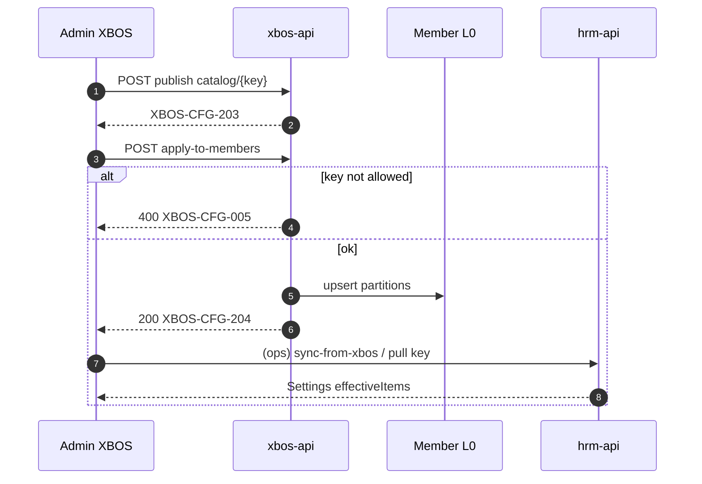

# BA-ERP-XBOS-CTRL-SPEC-01 — XBOS→HRM apply-to-members expand (ADD-only)

| Field | Value |
|-------|--------|
| **work_item_id** | `BA-ERP-XBOS-CTRL-SPEC-01` |
| **cohort** | `E-XBOS-CTRL-SPEC` · alias `XBOS-POLICY-SPEC` |
| **date** | 2026-07-28 |
| **lane** | governance · ba-process · **docs only** |
| **change_mode** | **ADD-only** — không đè FR-HRM-SC-* / E1-A/E1-B/E2/E3 must_keep; không sửa `apps/**` |
| **Team merge pointer** | `docs/hrm/SRS.md` **§16.7** (ADD) → body SoT = **file này** |
| **Evidence** | `docs/qa/evidence/ba-erp-xbos-ctrl-spec-01-20260728.md` |
| **Inputs** | `FIDELITY_PROGRAM_DISPATCH.md` Cohort 5 · `sa-xbos-hrm-control-gap-01-20260728.md` · `DANH_MUC_XBOS_CHO_HRM.md` · FR-HRM-SC-* · OpenAPI `ApplyCatalogToMembersBody` · E1-B bucket inventory |
| **CẤM** | Seed U65 · Phase1/PROD claim · Dev G1/G2 (`E-XBOS-CTRL-G1/G2`) trước sponsor chốt SPEC · wipe stub FR · invent allow-list không map DANH_MUC/FR-SC |

**Mục tiêu:** Khóa SRS/AC để XBOS **fan-out catalog L0** (`POST …/config-sync/catalog/{key}/apply-to-members`, `XBOS-CFG-204`) cover đủ **P0 Settings keys** (`departments`, `leave_types`, …) + **P1 E1-B parity keys**, rồi HRM **pull/consume** — trước TechSpec/DB/API/Dev.

---

## 0. Actors & scope

| Actor | Vai trò |
|-------|---------|
| **Admin XBOS / Group HCNS** | Publish L0 holding → Apply xuống ĐVTV → gán `assigned_systems` ∋ `hrm` |
| **Admin / HCNS HRM** | Sync/pull → Settings `effectiveItems` → consumer picker (đã khóa E1-A/E1-B) |
| **Group CEO** | Scope rollup `main`/holding — xem catalog sau fan-out (không invent mã) |
| **Member CEO** | Chỉ partition công ty mình sau apply |

### In scope (E-XBOS-CTRL-SPEC — docs)

1. Normative **allow-list phases** P0 / P1 / P2 cho `apply-to-members`.
2. Diễn biến mở rộng **XBOS-DM-HRM-07** (không chỉ chức danh).
3. BR/AC measurable + fail paths (`XBOS-CFG-005`, missing source, empty targets).
4. HRM consume pattern sau fan-out (UC-HRM-06/08 · FR-HRM-SC-*).
5. Dual-surface lock: L0 `job_titles` ≠ `business-master/positions`.
6. Journey IDs **J-XBOS-CTRL-01..03**.

### Out of scope

| Residual | Owner |
|----------|-------|
| TechSpec F.1 full + OpenAPI schema edit | **SA** `SA-ERP-XBOS-CTRL-SPEC-01` — **CLOSED** 2026-07-28 (`TECHSPEC`/`API_DESIGN`/`DB_DESIGN`_XBOS_APPLY_TO_MEMBERS_EXPAND) · OpenAPI runtime = G1 Dev |
| DB_DESIGN policy/allow-list persistence | **SA CLOSED** — no DDL G1 (const allow-list) |
| API_DESIGN Mục đích+Diễn biến cho apply endpoint | **SA CLOSED** — F.1 full in `API_DESIGN_XBOS_APPLY_TO_MEMBERS_EXPAND.md` |
| Nest/OpenAPI runtime expand | **E-XBOS-CTRL-G1** Dev XBOS — sau sponsor chốt |
| HRM pull alias / Settings UI | **E-XBOS-CTRL-G2** / already E1-B — không reopen E1-B DoD |
| Consumer FREE_TEXT | **E1-A** (CLOSED path) |
| Field-group presets STT 15–26 · WF mã 55–59 · RACI 64–68 · LE tree 1–6 | Control plane **khác** — không nhét vào apply-to-members |
| Full 72 STT one-shot | **P2** + sponsor wave — không claim trong P0/P1 |
| `insurers` publish gap | Residual E3 `R-E3-XBOS-INSURERS` — optional P1.5, không chặn P0 DoD |
| WF bind G-BM-REC-02 | BM lane — outside this FR |

---

## 1. As-is vs to-be (control plane)

### 1.1 As-is (spec says / OpenAPI)

| Layer | Fact |
|-------|------|
| OpenAPI `ApplyCatalogToMembersBody` | Allow-list = **`job_titles` \| `recruitment_channels` \| `job_grades`** only |
| SA control-gap G1 | **MISS** P0 Settings keys **`departments`**, **`leave_types`** |
| API_DESIGN_XBOS_CATALOG_GOV §8 | apply-to-members = **F.1-lite cite** (`XBOS-CFG-204`) — U71 depth gap |
| DANH_MUC | **XBOS-DM-HRM-07** tên «Sao chép thư viện chức danh» — pattern đúng nhưng wording hẹp hơn nhu cầu ERP fan-out |
| HRM Settings P0 | FR-HRM-SC-POS/LEAVE đòi `departments` + `leave_types` + `job_titles` |

### 1.2 To-be (this delta)

```text
XBOS holding L0 publish (key ∈ allow-list phase)
  → POST …/apply-to-members (targets / memberCompanyIds)
  → Member L0 partitions upserted (XBOS-CFG-204)
  → HRM POST sync-from-xbos | pull/:key
  → Settings effectiveItems (FR-HRM-SC-*)
  → Consumer picker persist code (E1-A — must_keep)
```

**Verdict baseline:** XBOS control HRM = **PARTIAL** → sau P0 Dev + QA = **SUFFICIENT for Settings P0 keys**; full DANH_MUC 72 = **not claimed**.

---

## 2. Allow-list inventory (normative)

### 2.1 Phase P0 — must (closes SA G1 · FR-HRM-SC-POS/LEAVE)

| # | `catalog_key` (canonical) | DANH_MUC / FR | AS-IS allow | TO-BE P0 |
|---|---------------------------|---------------|-------------|----------|
| 1 | `job_titles` | §3 STT 7–10 · FR-HRM-SC-POS-01 · DM-07 | ✅ | ✅ keep |
| 2 | `departments` | §3 STT 9 · FR-HRM-SC-POS-01 | ❌ | **ADD** |
| 3 | `leave_types` | §5 STT 30 · FR-HRM-SC-LEAVE-01 | ❌ | **ADD** |
| 4 | `recruitment_channels` | §6 STT 39 · FR-HRM-SC-CH-01 | ✅ | ✅ keep |
| 5 | `job_grades` | §3/§10 related · FR-HRM-SC-GRADE-01 | ✅ | ✅ keep |

**P0 set (normative string set):**  
`{ job_titles, departments, leave_types, recruitment_channels, job_grades }`

**PASS P0:** mọi key trong set được apply **không** `XBOS-CFG-005`; key ngoài set → **400** `XBOS-CFG-005`.

### 2.2 Phase P1 — E1-B Settings parity (sau P0 lock)

| # | `catalog_key` | Alias read (HRM) | FR | TO-BE P1 |
|---|---------------|------------------|-----|----------|
| 6 | `contract_types` | — | FR-HRM-SC-CT-01 | **ADD** |
| 7 | `employment_types` | `employment_type` | FR-HRM-SC-ET-01 | **ADD** |
| 8 | `pay_types` | `component_types`, … | FR-HRM-SC-PAY-TYPE-01 | **ADD** |
| 9 | `shifts` | `work_shifts` *(key only)* | FR-HRM-SC-SHIFT-01 | **ADD** |
| 10 | `decision_types` | `hr_decision_types` | FR-HRM-SC-DEC-01 · BR-HRM-SC-ALIAS-01 | **ADD** (publish canonical; HRM merge alias) |

**P1 optional ADD (không chặn P1 DoD):** `insurers` (E3 residual) — chỉ khi DANH_MUC + Settings surface sẵn sàng.

**P1 set = P0 ∪ { contract_types, employment_types, pay_types, shifts, decision_types }**

### 2.3 Phase P2 — breadth (PENDING_SYNTH / sponsor)

| Class | Examples | Rule |
|-------|----------|------|
| Code catalogs còn lại trong DANH_MUC §5–§8, §10 | attendance adjust types, allowance/deduction types, candidate statuses, … | Thêm từng key bằng delta sau khi có FR-SC consumer + Settings bucket |
| Non–code-catalog | STT 1–6 LE/OU · 15–26 field defs · 55–59 WF · 64–68 RACI | **Cấm** nhét vào apply-to-members — dùng API ownership riêng |

### 2.4 Alias / dual-key rules (apply plane)

| ID | Rule |
|----|------|
| **BR-HRM-XBOS-CTRL-ALIAS-01** | Path param `catalogKey` cho apply = **canonical** trong §2.1–2.2 |
| **BR-HRM-XBOS-CTRL-ALIAS-02** | `decision_types` apply → L0 store canonical; HRM pull **phải** resolve alias `hr_decision_types` (E1-B) — không yêu cầu apply cả hai key |
| **BR-HRM-XBOS-CTRL-ALIAS-03** | `positions` / `employee_positions` **không** là apply key riêng — SoT picker = **`job_titles`** |
| **BR-HRM-XBOS-CTRL-BM-01** | `business-master/positions` **≠** HRM Settings/`job_titles` SoT — cấm Dev/QA claim BM fan-out thay apply L0 |

---

## 3. FR-XBOS-CTRL-01 — Fan-out apply-to-members (expand allow-list)

**Purpose:** Admin XBOS sao chép **snapshot catalog L0** từ holding (hoặc company nguồn) xuống các ĐVTV đã chọn cho mọi key thuộc phase đang unlock — không chỉ chức danh.

**Mở rộng:** **XBOS-DM-HRM-07** · G-BM-REC-01 · OpenAPI `configSyncApplyCatalogToMembers` · FR-HRM-SC-* (consume).

### Diễn biến

| # | Actor | Tương tác | Điều kiện | Kết quả / lỗi |
|---|-------|-----------|-----------|---------------|
| 1 | Admin XBOS | Chọn `catalogKey` ∈ phase unlock | Auth group admin | UI/API nhận key |
| 2 | Admin XBOS | Đảm bảo nguồn đã **publish** L0 | Source `(tenantId, companyId, key)` tồn tại | Thiếu → **404** `XBOS-CFG-001` |
| 3 | Admin XBOS | Chọn targets (`targets[]` và/hoặc `memberCompanyIds[]`) | ≥1 target hợp lệ | Empty/invalid → **400** `XBOS-VAL-011/012` |
| 4 | System | Validate key ∈ allow-list phase | Key ngoài list | **400** `XBOS-CFG-005` — **không** partial write |
| 5 | System | Upsert snapshot sang từng member partition | Scope ACL OK | **200** `XBOS-CFG-204` + `appliedCount` ≥ 1 (hoặc 0 nếu idempotent no-op documented) |
| 6 | Admin XBOS | F5 / GET catalog member | Cùng key | Member thấy version/items khớp nguồn (hoặc documented merge policy) |
| 7 | — | Thành công | AC-XBOS-CTRL-P0-* | Handoff HRM pull |



### Business rules

| ID | Điều kiện | Hành động | Kết quả |
|----|-----------|-----------|---------|
| **BR-HRM-XBOS-CTRL-01** | Phase P0 unlocked | Allow-list = §2.1 set | Thiếu `departments`/`leave_types` = FAIL SPEC/Dev |
| **BR-HRM-XBOS-CTRL-02** | Key ∉ allow-list | Reject trước write | `XBOS-CFG-005` |
| **BR-HRM-XBOS-CTRL-03** | Apply thành công | Member L0 nhận copy | Không thay single-company publish |
| **BR-HRM-XBOS-CTRL-04** | `assigned_systems` thiếu `hrm` | Publish/assign gate (DM-08) | HRM pull miss = FAIL ops AC (không silent invent) |
| **BR-HRM-XBOS-CTRL-05** | Phase P1 chưa sponsor unlock | Chỉ P0 keys | Apply P1 key → vẫn `XBOS-CFG-005` đến khi OpenAPI/Dev P1 |
| **BR-HRM-XBOS-CTRL-BM-01** | (§2.4) | L0 `job_titles` SoT | BM positions không thay |

### Acceptance criteria

| ID | Pass | Fail |
|----|------|------|
| **AC-XBOS-CTRL-01** | Spec + (sau Dev) OpenAPI allow-list ⊇ P0 set §2.1 | Vẫn chỉ 3 keys AS-IS |
| **AC-XBOS-CTRL-02** | Apply `departments` → 200 `XBOS-CFG-204`; member GET có items | `XBOS-CFG-005` trên `departments` |
| **AC-XBOS-CTRL-03** | Apply `leave_types` → 200 + member items | `XBOS-CFG-005` trên `leave_types` |
| **AC-XBOS-CTRL-04** | Apply key ngoài P0 (trước P1 unlock) → **400** `XBOS-CFG-005` | Accept arbitrary key / silent no-op |
| **AC-XBOS-CTRL-05** | Missing source → **404** `XBOS-CFG-001` | 500 / empty 200 giả |
| **AC-XBOS-CTRL-06** | Invalid/empty targets → **400** VAL-011/012 | Apply toàn tenant mù |
| **AC-XBOS-CTRL-07** | U72: UI nhãn VI cho key/status; Network có `catalogKey` code | Raw key làm tiêu đề chính |
| **AC-XBOS-CTRL-08** | U65: evidence browser/API **không** seed bootstrap | `bootstrap-xevn` trong evidence UF |

---

## 4. FR-XBOS-CTRL-02 — HRM consume sau fan-out

**Purpose:** Sau apply member L0, HRM đồng bộ và Settings/consumer dùng **cùng mã** — không invent local master.

**Mở rộng:** UC-HRM-06/08 · FR-HRM-SC-01 · FR-HRM-SC-POS/LEAVE/… · XBOS-DM-HRM-10.

### Diễn biến

| # | Actor | Tương tác | Điều kiện | Kết quả / lỗi |
|---|-------|-----------|-----------|---------------|
| 1 | Admin HRM | Mở Settings → bucket tương ứng | Member đã được apply P0 key | Empty honest nếu chưa pull |
| 2 | Admin HRM | Sync-from-xbos / pull `catalogKey` | Upstream L0 có `hrm` assign | L1 `synced_catalogs` cập nhật; **2xx** |
| 3 | System | Merge effectiveItems (+ extension L2a nếu có) | Alias DEC nếu cần | List Settings có mã từ L0 |
| 4 | User | F5 Settings | Cùng company | Items còn |
| 5 | User | Form consumer (E1-A) | Picker bind | Chọn **code**; F5 persist `*_key` |
| 6 | — | Pull fail / upstream empty | Banner lỗi hoặc empty + CTA | **Cấm** mock invent |

### Acceptance criteria

| ID | Pass | Fail |
|----|------|------|
| **AC-XBOS-CTRL-HRM-01** | Sau apply+pull `departments`/`leave_types`: Settings bucket có items (hoặc empty honest nếu nguồn 0 item) | Settings vẫn MISS key / hardcode |
| **AC-XBOS-CTRL-HRM-02** | Network pull/sync **2xx**; F5 còn snapshot | Silent fail / seed để «có data» |
| **AC-XBOS-CTRL-HRM-03** | Group CEO `main` rollup vs member partition theo ADR scope | Leak cross-company catalog rows |
| **AC-XBOS-CTRL-HRM-04** | Consumer không free-text SoT cho field đã bind E1-A | Reintroduce Input free-text |

---

## 5. FR-XBOS-CTRL-03 — Phase P1 unlock gate

**Purpose:** Mở P1 keys chỉ khi P0 AC đóng + Settings E1-B bucket tồn tại cho key đó.

| ID | Pass | Fail |
|----|------|------|
| **AC-XBOS-CTRL-P1-01** | Spec P1 set §2.2 documented; Dev P1 chỉ sau sponsor + P0 QA PASS | Gộp 72 STT vào một PR |
| **AC-XBOS-CTRL-P1-02** | Apply `contract_types` / `employment_types` / `pay_types` / `shifts` / `decision_types` → 204 khi P1 unlocked | P1 key pass trước P0 |
| **AC-XBOS-CTRL-P1-03** | `decision_types` apply + HRM alias merge → Decisions Settings thấy items | Require apply `hr_decision_types` trùng |

---

## 6. Journeys (L2.5)

| J-ID | Click / API path | AC map | Status |
|------|------------------|--------|--------|
| **J-XBOS-CTRL-01** | Holding: publish `departments` → apply-to-members (≥1 member) → HRM login member/group → Settings PB → sync/pull → list items → F5 | AC-XBOS-CTRL-02 · HRM-01/02 | ⬜ SPEC |
| **J-XBOS-CTRL-02** | Cùng luồng với `leave_types` (+ spot `job_titles` regression keep) | AC-XBOS-CTRL-03 · 01 keep | ⬜ SPEC |
| **J-XBOS-CTRL-03** | Apply key **ngoài** allow-list phase → UI/API hiện lỗi `XBOS-CFG-005`; không đổi member | AC-XBOS-CTRL-04 | ⬜ SPEC |

**Persona:** Admin XBOS + `ceo@xe.vn` (group) và/hoặc member CEO partition.  
**Cấm:** seed catalog / bootstrap-xevn trong evidence.

**Cross-nav AC:** Sau Settings list có item → user mở consumer liên quan (Leave type / Dept picker) → detail/form load option **cùng code** (E1-A must_keep).

---

## 7. Validation / error matrix

| Code | HTTP | Khi | UI |
|------|------|-----|-----|
| `XBOS-CFG-204` | 200 | Apply OK | Toast/summary `appliedCount` |
| `XBOS-CFG-005` | 400 | Key not allowed | Banner «Danh mục không được phép áp dụng» (VI) |
| `XBOS-CFG-001` | 404 | Source missing | Banner thiếu nguồn |
| `XBOS-VAL-011/012` | 400 | Targets invalid | Banner chọn ĐVTV |
| `XBOS-AUTH-001` | 401 | No auth | Login |
| `SCOPE_CONTEXT_MISMATCH` | 409 | Scope JWT | Banner scope |

---

## 8. PENDING_SYNTH (U71 — không Dev)

| Artifact | Status | Owner | Note |
|----------|--------|-------|------|
| This SRS/AC delta | **DONE** (this WI) | ba-process | |
| TechSpec XBOS apply expand + HRM consume | **LANDED** parallel | **sa** `SA-ERP-XBOS-CTRL-SPEC-01` | `docs/xbos/TECHSPEC_XBOS_APPLY_TO_MEMBERS_EXPAND.md` — PM SYNTH vs §16.7 |
| DB_DESIGN allow-list / policy | **LANDED** parallel | sa | Constant tiers; **no DDL** G1 per SA evidence |
| API_DESIGN F.1 full apply-to-members | **LANDED** parallel | sa | `docs/xbos/API_DESIGN_XBOS_APPLY_TO_MEMBERS_EXPAND.md` |
| OpenAPI allow-list string update | After sponsor chốt | Dev G1 | Normative set = SYNTH(BA P0∪P1 ↔ SA Tier B) |
| E-XBOS-CTRL-G1 / G2 Dev | **HOLD** | pm | Sau sponsor chốt SPEC pack |

**SYNTH residuals (PM):** (1) BA P0-then-P1 vs SA single Tier B package for G1; (2) DEC apply write key `decision_types` vs `hr_decision_types` — prefer E1-B live `hr_decision_types`.

---

## 9. must_keep / forbidden

### must_keep

- Spine publish / get / list / catalog-governance UF-09/15 🟢
- HRM Settings API_DESIGN pair + E1-B ≥10 bucket AC
- E1-A picker `*_key` + label snapshot
- Single-company publish (apply **không** thay)
- U65 zero-seed · HOLD_DEPLOY · cấm Phase1/PROD claim

### forbidden

- `apps/**` trong wave SPEC
- Claim «XBOS đủ control 72 STT» khi chỉ P0/P1
- DDL-rename live keys trong apply wave
- Dùng BM positions làm fan-out SoT cho HRM picker
- Seed/bootstrap trong AC evidence

---

## 10. Handoff expectations

| Role | Expectation |
|------|-------------|
| **SA** | TechSpec + API_DESIGN F.1 + DB note; OpenAPI cite P0 set; ACK unlock G1/G2 |
| **ba-data** | (optional) physical key map STT↔`catalog_key` P1/P2 appendix |
| **Dev XBOS G1** | Expand allow-list + tests CFG-005/204; FE apply CTA nếu residual G5 |
| **Dev HRM G2** | Consume/pull regression P0 keys; alias DEC |
| **QA** | J-XBOS-CTRL-01..03 browser-first; U65 |
| **QC** | No GO Dev wave trước sponsor SPEC chốt |

---

## 11. Open risks

| Risk | Mitigation |
|------|------------|
| Runtime Nest allow-list ≠ OpenAPI | SA/Dev verify trước claim AC-01 |
| Overwrite member local extension on apply | TechSpec merge policy (L0 vs L2a) — SA |
| P1 `shifts` vs `work_shifts` TX | Giữ E1-B HOLD dual-write — apply chỉ catalog key |
| Wording DM-07 «chức danh» | ADD Diễn biến đa-key; ba-docs khách later |
