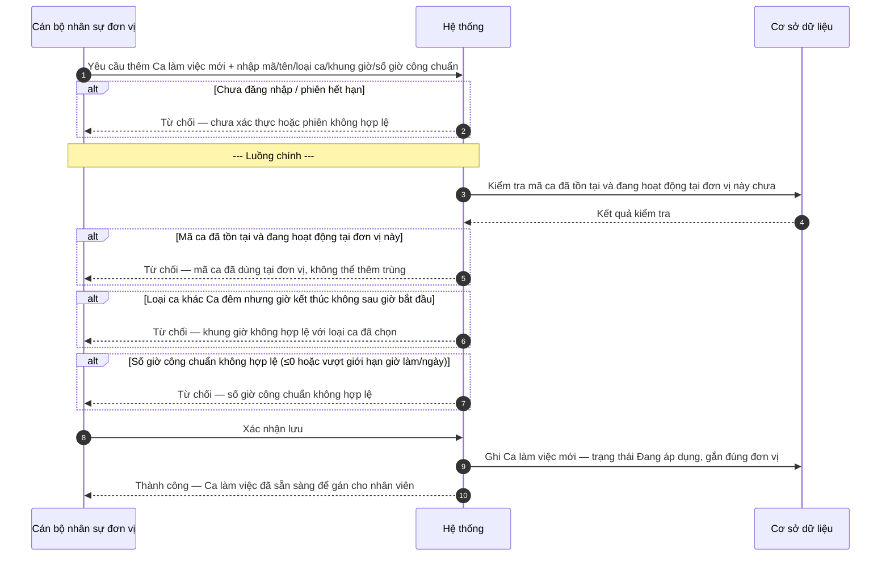
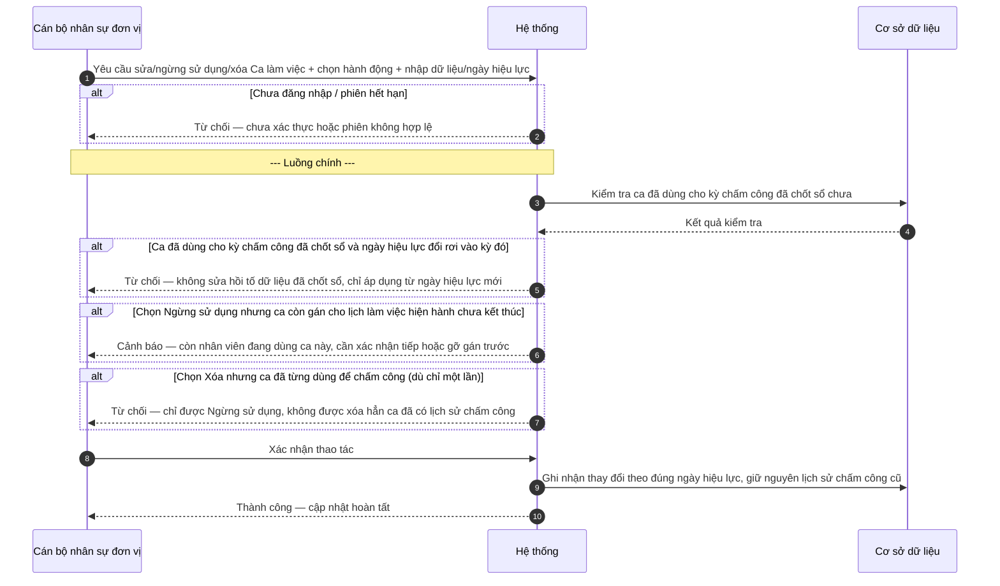
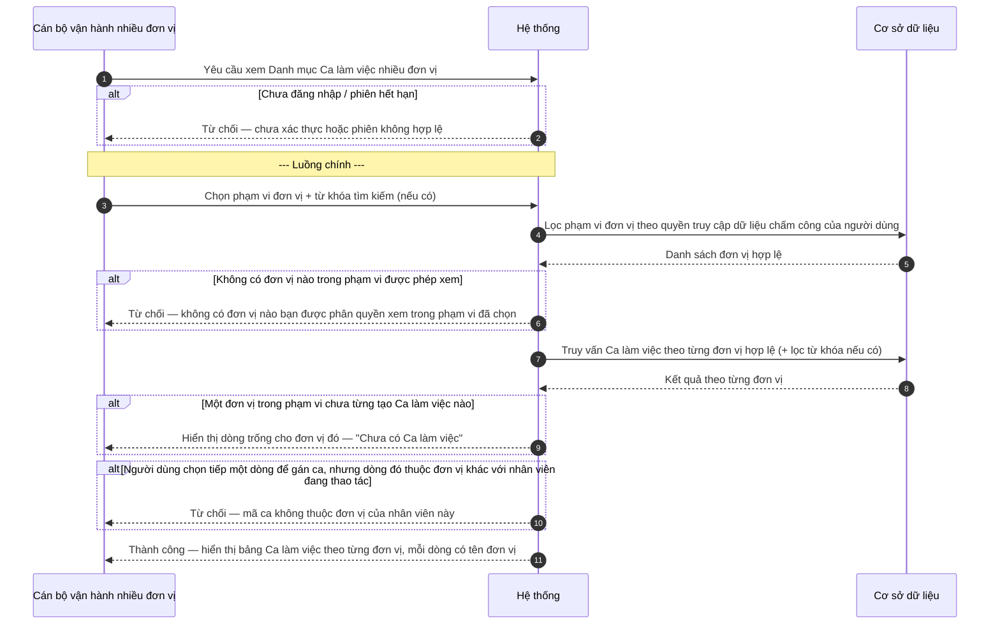

# SRS — Danh mục Ca làm việc (Wave 7)

| Mã tài liệu | BA-HRM-ATTENDANCE-SHIFT-SRS-01 |
| --- | --- |
| Phiên bản | v1 |
| Nguồn nghiệp vụ | Lịch làm việc thực tế nhiều tỉnh/đơn vị (Hà Nội, Nam Định, Ninh Bình, Thái Bình, Yên Bái, Phú Thọ, Việt Trì) + 19 câu hỏi làm rõ đã có câu trả lời sponsor |
| Ngày | 2026-08-13 |
| Trạng thái | DRAFT — chờ xác nhận trước khi sang thiết kế kỹ thuật |

## 1. Giới thiệu

Tài liệu này mô tả nghiệp vụ quản lý **Danh mục Ca làm việc** — khung giờ làm việc (giờ bắt đầu, giờ kết thúc, số giờ công chuẩn) dùng làm căn cứ chấm công tại từng đơn vị (chi nhánh/công ty thành viên).

Khác với các danh mục dùng chung toàn công ty (ví dụ Ngạch bậc lương), **Ca làm việc không phải dữ liệu do cấp Tập đoàn ban hành xuống**. Thực tế khảo sát cho thấy mỗi đơn vị có khung giờ làm việc khác nhau dù đặt cùng tên gọi — ví dụ ca "Hành chính" tại Hà Nội là 8h30-17h30, trong khi ca "Hành chính" tại Nam Định là 7h30-17h00. Vì vậy, mỗi đơn vị **tự định nghĩa và quản lý Ca làm việc của riêng mình**, không có bước ban hành/áp dụng từ Tập đoàn xuống như các danh mục khác.

Để tránh nhầm lẫn khi nhiều đơn vị cùng đặt một ký hiệu ca giống nhau (ví dụ cùng gọi là "Hành chính") nhưng khung giờ khác nhau, tài liệu này quy định rõ: **mã ca chỉ cần duy nhất trong phạm vi 1 đơn vị**, không cần duy nhất toàn hệ thống; và **mọi màn hình xem tổng hợp nhiều đơn vị phải hiển thị rõ tên đơn vị đi kèm mã ca**.

## 2. Mô tả tổng quan (luồng tổng thể)

| Bước | Vai trò thực hiện | Mô tả |
| --- | --- | --- |
| 1 | Cán bộ nhân sự tại đơn vị | Tạo mới Ca làm việc riêng cho đơn vị mình (không chờ Tập đoàn ban hành) |
| 2 | Cán bộ nhân sự tại đơn vị | Sửa thông tin hoặc ngừng sử dụng Ca làm việc khi nhu cầu vận hành thay đổi |
| 3 | Cán bộ vận hành phụ trách nhiều đơn vị (ví dụ Phòng Hành chính nhân sự Tập đoàn) | Tra cứu Ca làm việc theo từng đơn vị khi cần đối chiếu, tổng hợp báo cáo |
| 4 | Hệ thống chấm công | Dùng Ca làm việc đã tạo để tính giờ công, đi trễ/về sớm khi chấm công hàng ngày (nghiệp vụ này thuộc phạm vi khác, chỉ liệt kê để biết phụ thuộc) |

Bước 2–3 phụ thuộc Bước 1 đã có ít nhất một Ca làm việc tại đơn vị. Bước 4 nằm ngoài phạm vi tài liệu này (sẽ có tài liệu riêng khi làm chấm công/tính công).

## 3. Yêu cầu chức năng

### FR-UC-SHIFT-01 — Tạo mới Ca làm việc tại đơn vị

| Thuộc tính | Mô tả |
| --- | --- |
| **Actor** | Cán bộ nhân sự tại đơn vị (chi nhánh/công ty thành viên) — người được phân quyền quản trị danh mục chấm công của đúng đơn vị mình |
| **Ưu tiên** | Cao |
| **Điều kiện tiên quyết** | Đơn vị/chi nhánh đã tồn tại và đang hoạt động trên hệ thống; người thực hiện có quyền quản trị danh mục chấm công tại đơn vị đó |
| **Điều kiện hậu** | Ca làm việc mới sẵn sàng để gán cho lịch làm việc/chấm công của nhân viên tại đúng đơn vị đó |
| **Mã UC** | UC-HRM-SHIFT-01 |
| **Liên hệ phần mềm hiện tại** | Chưa có — hiện các đơn vị tự quản lý lịch làm việc bằng bảng tính rời rạc, mỗi tỉnh một quy ước ký hiệu ca riêng, không thống nhất |

**Dữ liệu đầu vào:**

| Trường | Bắt buộc | Ràng buộc / kiểm tra |
| --- | --- | --- |
| Mã ca | Có | Duy nhất **trong phạm vi đơn vị đang tạo** — không kiểm tra trùng với mã ca của đơn vị khác |
| Tên ca (hiển thị) | Có | Không để trống |
| Loại ca | Có | Chọn 1 trong: Hành chính (một khung giờ cố định trong ngày) / Ca kíp lệch giờ (nhiều khung giờ xen kẽ trong ngày, ví dụ ca sáng — ca chiều) / Ca đêm (giờ kết thúc thuộc ngày hôm sau) |
| Giờ bắt đầu / Giờ kết thúc | Có | Giờ kết thúc phải sau giờ bắt đầu trong cùng ngày; riêng Loại ca = Ca đêm thì giờ kết thúc được phép nhỏ hơn giờ bắt đầu (hiểu là thuộc ngày hôm sau) |
| Số giờ công chuẩn trong ca | Có | Phải lớn hơn 0 và không vượt quá số giờ làm tối đa/ngày theo quy định |
| Đơn vị áp dụng | Có (tự động) | Là đúng đơn vị người tạo đang thao tác — không được chọn sang đơn vị khác |

**Luồng chính:**

1. Cán bộ nhân sự tại đơn vị mở màn hình "Danh mục Ca làm việc" trong Cài đặt, chọn "Thêm ca mới".
2. Nhập mã ca, tên ca, loại ca, khung giờ bắt đầu/kết thúc, số giờ công chuẩn (theo bảng dữ liệu đầu vào).
3. Hệ thống kiểm tra mã ca có trùng với một ca đang hoạt động khác tại cùng đơn vị hay không.
4. Hệ thống kiểm tra khung giờ có hợp lệ theo loại ca đã chọn hay không.
5. Cán bộ nhân sự xác nhận lưu.
6. Hệ thống ghi nhận Ca làm việc mới ở trạng thái "Đang áp dụng", gắn đúng đơn vị vừa thao tác.

**Quy tắc nghiệp vụ:**

- BR-SHIFT-01: Mã ca chỉ cần duy nhất trong phạm vi 1 đơn vị — hệ thống không kiểm tra trùng với mã ca của đơn vị khác. Hai đơn vị khác nhau được phép cùng dùng mã "HC" với khung giờ hoàn toàn khác nhau, đây không phải lỗi.
- BR-SHIFT-02: Nếu Loại ca là "Ca đêm", giờ kết thúc được phép nhỏ hơn giờ bắt đầu (hiểu ngầm thuộc ngày hôm sau). Nếu Loại ca khác Ca đêm, giờ kết thúc bắt buộc lớn hơn giờ bắt đầu trong cùng ngày.
- BR-SHIFT-03: Ca vừa tạo chỉ áp dụng cho đúng 1 đơn vị đang thao tác — không có bước "ban hành rồi áp dụng xuống đơn vị khác". Đơn vị khác muốn dùng ca tương tự phải tự tạo lại, không được kế thừa tự động từ đơn vị này.
- BR-SHIFT-04: Khi hiển thị Ca làm việc trên màn hình hoặc báo cáo có phạm vi nhiều đơn vị, hệ thống phải hiển thị kèm tên đơn vị bên cạnh mã ca, không được hiển thị một mình mã ca — tránh nhầm giữa mã ca của đơn vị này với mã ca giống hệt của đơn vị khác.

**Sơ đồ tương tác:**

**Diễn biến nghiệp vụ (theo sơ đồ):**

| # | Tương tác | Điều kiện / quy tắc | Kết quả hoặc lỗi |
| --- | --- | --- | --- |
| 1 | Yêu cầu thêm ca mới + nhập mã/tên/loại ca/khung giờ/số giờ công chuẩn | Theo bảng dữ liệu đầu vào | Tiếp tục |
| 2 | Kiểm tra phiên đăng nhập | Chưa đăng nhập / hết phiên | Từ chối — yêu cầu đăng nhập lại |
| 3 | Kiểm tra mã ca trùng tại đơn vị | BR-SHIFT-01 — chỉ so trong phạm vi đơn vị đang thao tác | Tiếp tục |
| 4 | Mã ca đã tồn tại và đang hoạt động tại đơn vị | BR-SHIFT-01 | Từ chối — mã ca đã dùng tại đơn vị |
| 5 | Kiểm tra khung giờ theo loại ca | BR-SHIFT-02 | Tiếp tục |
| 6 | Khung giờ không hợp lệ với loại ca đã chọn | BR-SHIFT-02 | Từ chối — sai khung giờ theo loại ca |
| 7 | Kiểm tra số giờ công chuẩn | Phải > 0, không vượt giới hạn giờ làm/ngày | Tiếp tục |
| 8 | Số giờ công chuẩn không hợp lệ | Ngoài khoảng cho phép | Từ chối — số giờ công chuẩn không hợp lệ |
| 9 | Xác nhận lưu | Toàn bộ kiểm tra 3–7 đã qua | Tiếp tục |
| 10 | Ghi nhận Ca làm việc mới | BR-SHIFT-03 — gắn đúng 1 đơn vị | Thành công |

**Kết quả trả về khi thành công:**

| Ý | Nội dung |
| --- | --- |
| Người dùng thấy | Thông báo "Đã thêm Ca làm việc [tên ca] — áp dụng tại [tên đơn vị]"; ca mới xuất hiện trong danh sách "Đang áp dụng" |
| Bản ghi tạo/cập nhật | Ca làm việc (mới) thuộc đúng đơn vị đang thao tác |
| Khóa mang sang bước sau | Mã ca (dùng để gán khi tra cứu đa đơn vị — UC-HRM-SHIFT-03 — và khi gán lịch làm việc cho nhân viên) |
| Trạng thái sau | "Đang áp dụng" |
| Việc được mở khóa tiếp | UC-HRM-SHIFT-02 (Sửa/Ngừng sử dụng); gán Ca làm việc vào lịch làm việc nhân viên (ngoài phạm vi tài liệu này) |

---

### FR-UC-SHIFT-02 — Sửa hoặc ngừng sử dụng Ca làm việc đã tạo

| Thuộc tính | Mô tả |
| --- | --- |
| **Actor** | Cán bộ nhân sự tại đơn vị |
| **Ưu tiên** | Cao |
| **Điều kiện tiên quyết** | Ca làm việc đã tồn tại tại đơn vị (UC-HRM-SHIFT-01 hoàn tất) |
| **Điều kiện hậu** | Ca được cập nhật thông tin mới, hoặc chuyển sang trạng thái "Ngừng sử dụng", hoặc bị xóa hẳn nếu chưa từng dùng chấm công |
| **Mã UC** | UC-HRM-SHIFT-02 |
| **Liên hệ phần mềm hiện tại** | Chưa có |

**Dữ liệu đầu vào:**

| Trường | Bắt buộc | Ràng buộc / kiểm tra |
| --- | --- | --- |
| Ca làm việc cần thao tác | Có | Phải thuộc đúng đơn vị người thao tác |
| Hành động (Sửa thông tin / Ngừng sử dụng / Xóa) | Có | Chọn đúng 1 hành động |
| Trường sửa (tên ca / khung giờ / số giờ công chuẩn), nếu chọn Sửa | Có (khi Sửa) | Theo ràng buộc dữ liệu đầu vào của UC-HRM-SHIFT-01 |
| Ngày hiệu lực áp dụng thay đổi | Có | Không được là ngày đã thuộc kỳ chấm công đã chốt sổ |

**Luồng chính:**

1. Cán bộ nhân sự mở danh sách Ca làm việc tại đơn vị, chọn ca cần sửa hoặc ngừng sử dụng.
2. Chọn hành động (Sửa thông tin / Ngừng sử dụng / Xóa) và nhập dữ liệu mới cùng ngày hiệu lực áp dụng (nếu là sửa thông tin).
3. Hệ thống kiểm tra ca có đang được dùng cho kỳ chấm công đã chốt sổ hay không.
4. Nếu chọn Ngừng sử dụng, hệ thống kiểm tra ca có đang được gán cho lịch làm việc hiện hành (chưa kết thúc) của nhân viên nào không.
5. Cán bộ nhân sự xác nhận thao tác.
6. Hệ thống ghi nhận thay đổi theo đúng ngày hiệu lực, giữ nguyên lịch sử chấm công cũ đã chốt sổ.

**Quy tắc nghiệp vụ:**

- BR-SHIFT-05: Nếu Ca đang được dùng để chấm công của một kỳ lương đã chốt sổ, không cho sửa trực tiếp khung giờ áp dụng cho kỳ đã chốt đó — thay đổi khung giờ chỉ được áp dụng từ một ngày hiệu lực mới trở đi, dữ liệu chấm công đã chốt giữ nguyên.
- BR-SHIFT-06: Không xóa cứng Ca làm việc đã từng được dùng để chấm công dù chỉ một lần — chỉ được chuyển trạng thái "Ngừng sử dụng" (ẩn khỏi danh sách gán mới, lịch sử chấm công cũ vẫn hiển thị đúng ca cũ).
- BR-SHIFT-07: Ca chưa từng được dùng để chấm công lần nào thì được phép xóa hẳn.
- BR-SHIFT-08: Ngừng sử dụng một ca đang còn được gán cho lịch làm việc hiện hành (chưa kết thúc) của nhân viên phải được cảnh báo rõ số lượng nhân viên bị ảnh hưởng trước khi cho xác nhận tiếp.

**Sơ đồ tương tác:**

**Diễn biến nghiệp vụ (theo sơ đồ):**

| # | Tương tác | Điều kiện / quy tắc | Kết quả hoặc lỗi |
| --- | --- | --- | --- |
| 1 | Yêu cầu sửa/ngừng sử dụng/xóa + chọn hành động + nhập dữ liệu/ngày hiệu lực | Theo bảng dữ liệu đầu vào | Tiếp tục |
| 2 | Kiểm tra phiên đăng nhập | Chưa đăng nhập / hết phiên | Từ chối — yêu cầu đăng nhập lại |
| 3 | Kiểm tra ca có dùng cho kỳ chấm công đã chốt sổ | BR-SHIFT-05 | Tiếp tục |
| 4 | Ca đã chốt sổ và ngày hiệu lực đổi rơi vào kỳ đó | BR-SHIFT-05 | Từ chối — không sửa hồi tố kỳ đã chốt sổ |
| 5 | Kiểm tra ca còn gán cho lịch làm việc hiện hành (khi chọn Ngừng sử dụng) | BR-SHIFT-08 | Tiếp tục |
| 6 | Còn nhân viên đang dùng ca này khi chọn Ngừng sử dụng | BR-SHIFT-08 | Cảnh báo — yêu cầu xác nhận tiếp hoặc gỡ gán trước |
| 7 | Kiểm tra ca đã từng dùng chấm công lần nào (khi chọn Xóa) | BR-SHIFT-06, BR-SHIFT-07 | Tiếp tục |
| 8 | Chọn Xóa nhưng ca đã từng dùng chấm công | BR-SHIFT-06 | Từ chối — chỉ được Ngừng sử dụng, không xóa hẳn |
| 9 | Xác nhận thao tác | Toàn bộ kiểm tra 3–7 đã qua | Tiếp tục |
| 10 | Ghi nhận thay đổi theo đúng ngày hiệu lực | Giữ nguyên lịch sử chấm công cũ | Thành công |

**Kết quả trả về khi thành công:**

| Ý | Nội dung |
| --- | --- |
| Người dùng thấy | Thông báo "Đã cập nhật Ca làm việc [tên ca]" hoặc "Ca [tên ca] đã chuyển sang Ngừng sử dụng" hoặc "Đã xóa Ca [tên ca]"; thay đổi hiển thị đúng theo ngày hiệu lực |
| Bản ghi tạo/cập nhật | Ca làm việc hiện có (cập nhật theo ngày hiệu lực mới); dữ liệu chấm công thuộc kỳ đã chốt sổ trước đó giữ nguyên không đổi |
| Khóa mang sang bước sau | Mã ca + ngày hiệu lực áp dụng mới |
| Trạng thái sau | "Đang áp dụng" (nếu sửa), "Ngừng sử dụng" (nếu ngừng), hoặc không còn tồn tại (nếu xóa và chưa từng dùng chấm công) |
| Việc được mở khóa tiếp | Gán lại lịch làm việc nhân viên theo thông tin ca mới (ngoài phạm vi tài liệu này); UC-HRM-SHIFT-03 phản ánh đúng trạng thái mới khi tra cứu đa đơn vị |

---

### FR-UC-SHIFT-03 — Tra cứu Ca làm việc theo từng đơn vị (nhiều đơn vị)

| Thuộc tính | Mô tả |
| --- | --- |
| **Actor** | Cán bộ vận hành phụ trách nhiều đơn vị (ví dụ Phòng Hành chính nhân sự Tập đoàn theo dõi chấm công toàn bộ chi nhánh) |
| **Ưu tiên** | Trung bình |
| **Điều kiện tiên quyết** | Có ít nhất 1 đơn vị đã tạo Ca làm việc (UC-HRM-SHIFT-01) |
| **Điều kiện hậu** | Không thay đổi dữ liệu (chỉ xem) |
| **Mã UC** | UC-HRM-SHIFT-03 |
| **Liên hệ phần mềm hiện tại** | Chưa có |

**Dữ liệu đầu vào:**

| Trường | Bắt buộc | Ràng buộc / kiểm tra |
| --- | --- | --- |
| Phạm vi đơn vị muốn xem (1 đơn vị cụ thể hoặc nhiều đơn vị) | Có | Chỉ được chọn trong phạm vi đơn vị người dùng có quyền xem dữ liệu chấm công |
| Từ khóa tìm kiếm theo mã ca hoặc tên ca | Không bắt buộc | Tìm gần đúng trong phạm vi đơn vị đã chọn |

**Luồng chính:**

1. Cán bộ vận hành mở màn hình "Danh mục Ca làm việc" ở chế độ xem nhiều đơn vị, chọn phạm vi đơn vị cần xem.
2. Hệ thống lọc phạm vi đơn vị theo đúng quyền truy cập dữ liệu chấm công của người dùng.
3. Hệ thống truy vấn danh sách Ca làm việc của từng đơn vị hợp lệ trong phạm vi.
4. Hệ thống nhóm kết quả theo đơn vị, gắn rõ tên đơn vị cạnh mỗi mã ca — kể cả khi 2 đơn vị dùng trùng mã.
5. Cán bộ vận hành tìm kiếm theo mã/tên ca nếu cần; nếu từ khóa trùng khớp ở nhiều đơn vị, hệ thống hiển thị đầy đủ từng dòng kèm tên đơn vị, không tự gộp lại.

**Quy tắc nghiệp vụ:**

- BR-SHIFT-09: Khi hiển thị nhiều đơn vị cùng lúc, mỗi dòng kết quả phải có tên đơn vị đi kèm mã ca — cấm hiển thị bảng chỉ có cột "Mã ca" mà không có cột "Đơn vị" khi phạm vi xem lớn hơn 1 đơn vị.
- BR-SHIFT-10: Trùng mã ca giữa các đơn vị không được hệ thống tự động gộp thành 1 dòng dữ liệu, kể cả khi tên ca và khung giờ giống hệt nhau — đây là 2 bản ghi độc lập của 2 đơn vị khác nhau, có thể thay đổi độc lập sau này.
- BR-SHIFT-11: Cán bộ vận hành chỉ xem được Ca làm việc của các đơn vị mình được phân quyền truy cập dữ liệu chấm công; nếu chọn phạm vi rộng hơn quyền, hệ thống tự động thu hẹp về đúng phạm vi được phép, không chặn toàn màn hình.
- BR-SHIFT-12: Khi điều hướng từ kết quả tra cứu sang thao tác gán ca cho nhân viên, hệ thống phải mang theo cả mã ca và mã đơn vị — nếu người dùng chọn nhầm dòng thuộc đơn vị khác với đơn vị của nhân viên đang thao tác, hệ thống phải chặn và báo rõ lý do.

**Sơ đồ tương tác:**

**Diễn biến nghiệp vụ (theo sơ đồ):**

| # | Tương tác | Điều kiện / quy tắc | Kết quả hoặc lỗi |
| --- | --- | --- | --- |
| 1 | Yêu cầu xem + chọn phạm vi đơn vị/từ khóa | Theo bảng dữ liệu đầu vào | Tiếp tục |
| 2 | Kiểm tra phiên đăng nhập | Chưa đăng nhập / hết phiên | Từ chối — yêu cầu đăng nhập lại |
| 3 | Lọc phạm vi đơn vị theo quyền truy cập chấm công | BR-SHIFT-11 | Tiếp tục |
| 4 | Không có đơn vị hợp lệ trong phạm vi đã chọn | BR-SHIFT-11 | Từ chối — không có đơn vị nào được phân quyền xem |
| 5 | Truy vấn Ca làm việc theo từng đơn vị hợp lệ | BR-SHIFT-09, BR-SHIFT-10 | Tiếp tục |
| 6 | Một đơn vị trong phạm vi chưa từng tạo Ca làm việc nào | — | Hiển thị trống có ghi chú, không phải lỗi hệ thống |
| 7 | Người dùng chọn tiếp một dòng để gán ca cho nhân viên | BR-SHIFT-12 | Tiếp tục |
| 8 | Dòng được chọn thuộc đơn vị khác với nhân viên đang thao tác | BR-SHIFT-12 | Từ chối — mã ca không thuộc đơn vị của nhân viên này |
| 9 | Hiển thị bảng kết quả, mỗi dòng gắn rõ tên đơn vị | BR-SHIFT-09, BR-SHIFT-10 | Tiếp tục |
| 10 | Trả kết quả hiển thị hoàn tất | Toàn bộ đơn vị hợp lệ đã xử lý | Thành công |

**Kết quả trả về khi thành công:**

| Ý | Nội dung |
| --- | --- |
| Người dùng thấy | Bảng danh sách Ca làm việc, mỗi dòng có cột Đơn vị + Mã ca + Tên ca + Khung giờ; nếu trùng mã ca giữa các đơn vị thì hiển thị đầy đủ từng dòng riêng |
| Bản ghi tạo/cập nhật | Không có (chỉ đọc) |
| Khóa mang sang bước sau | Mã ca + mã đơn vị đi kèm (dùng cùng nhau để không nhầm khi điều hướng sang gán ca cho nhân viên) |
| Trạng thái sau | Không đổi |
| Việc được mở khóa tiếp | Gán Ca làm việc cho lịch làm việc nhân viên tại đúng đơn vị (ngoài phạm vi tài liệu này); đối chiếu báo cáo chấm công đa chi nhánh |

## 4. Yêu cầu phi chức năng

| # | Yêu cầu | Ghi chú |
| --- | --- | --- |
| NFR-SHIFT-01 | Danh sách Ca làm việc phải đọc được dễ dàng trên thiết bị cấu hình thấp tại chi nhánh xa trung tâm | Bảng cuộn được, không vỡ layout khi số ca nhiều |
| NFR-SHIFT-02 | Lịch sử thay đổi Ca làm việc đã từng dùng chấm công phải giữ lại đầy đủ, không xóa cứng | Phục vụ tra soát khi có tranh chấp công/lương (liên hệ BR-SHIFT-06) |
| NFR-SHIFT-03 | Màn hình tra cứu nhiều đơn vị (UC-HRM-SHIFT-03) phải tải được danh sách dù số đơn vị lớn (toàn bộ chi nhánh) mà không chậm bất thường | Áp dụng khi số lượng đơn vị và ca tăng theo thời gian |

## 5. Giao diện ngoài

Màn hình cấp đơn vị: form tạo/sửa Ca làm việc + danh sách Ca làm việc của riêng đơn vị đó, có nút Ngừng sử dụng/Xóa tùy trạng thái đã dùng chấm công hay chưa. Màn hình tra cứu nhiều đơn vị (dành cho cán bộ vận hành phụ trách nhiều đơn vị): bảng có cột Đơn vị đi kèm mỗi mã ca, có ô tìm kiếm, không có nút thêm/sửa/xóa (chỉ đọc). Không quy định token màu sắc/kích thước cụ thể ở tài liệu này — sẽ có trong tài liệu thiết kế kỹ thuật riêng.

## 6. Ràng buộc nghiệp vụ tổng quát

- Ca làm việc là dữ liệu vận hành riêng của từng đơn vị, không phải dữ liệu do Tập đoàn ban hành xuống như Ngạch bậc lương — mỗi đơn vị tự chịu trách nhiệm về tính chính xác khung giờ ca của mình.
- Mã ca chỉ đảm bảo duy nhất trong phạm vi 1 đơn vị; hệ thống không đảm bảo và không cần đảm bảo duy nhất toàn hệ thống.
- Mọi màn hình hoặc báo cáo hiển thị Ca làm việc ở phạm vi nhiều đơn vị bắt buộc gắn kèm tên đơn vị cạnh mã ca.
- Ca làm việc đã từng dùng để chấm công không được xóa hẳn, chỉ được ngừng sử dụng, để bảo toàn dữ liệu chấm công lịch sử.

## 7. Vấn đề còn hở, cần xác nhận thêm

- Mốc giờ chính xác của "Ca đêm" tại một số đơn vị vận tải chưa thống nhất (21h hay 22h là thời điểm bắt đầu tính ca đêm) — theo trả lời hiện tại, mỗi đơn vị sẽ tự cấu hình mốc giờ này khi tạo Ca làm việc riêng, không có giá trị mặc định chung do Tập đoàn quy định; cần đơn vị liên quan xác nhận mốc cụ thể trước khi đưa vào vận hành thật.
- Một số đơn vị hiện vẫn quản lý lịch làm việc bằng bảng tính riêng theo tỉnh, chưa số hóa — khi chuyển sang Danh mục Ca làm việc trên hệ thống, đơn vị đó cần tự rà soát lại quy ước ký hiệu ca cũ của mình trước khi nhập mới, không tự động chuyển đổi 1-1 vì ký hiệu cũ không thống nhất giữa các tỉnh.
