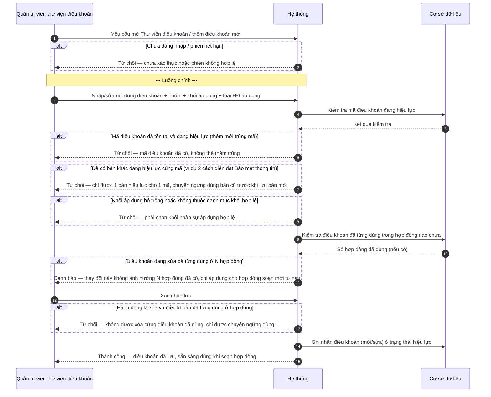
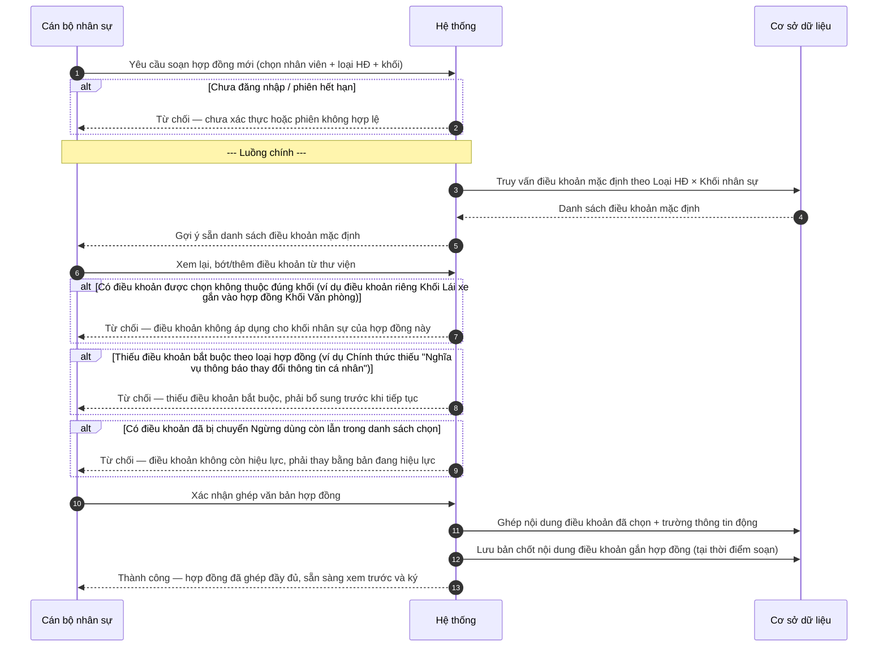
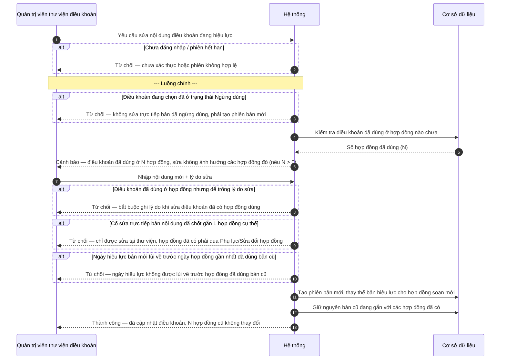

# SRS — Thư viện điều khoản hợp đồng (Wave 11)

| Mã tài liệu | BA-HRM-CONTRACT-CLAUSE-LIBRARY-SRS-01 |
| --- | --- |
| Phiên bản | v1 |
| Nguồn nghiệp vụ | 4 mẫu hợp đồng gốc (Hợp đồng thử việc / Hợp đồng lao động chính thức, áp dụng riêng Khối Văn phòng và Khối Lái xe), 14 điều khoản dùng chung và 4 điều khoản đặc thù Khối Lái xe đã được trích xuất từ bộ hợp đồng mẫu của công ty |
| Ngày | 2026-08-13 |
| Trạng thái | DRAFT — chờ xác nhận trước khi sang thiết kế kỹ thuật |

## 1. Giới thiệu

Tài liệu này mô tả nghiệp vụ **Thư viện điều khoản hợp đồng** — nơi lưu trữ tập trung các điều khoản pháp lý chuẩn (đã được công ty duyệt) để cán bộ nhân sự **chọn dùng lại** khi soạn hợp đồng lao động, thay vì gõ tay từng lần. Thư viện áp dụng riêng cho từng công ty/pháp nhân trong hệ thống. Phạm vi tài liệu gồm: quản lý nội dung điều khoản, soạn hợp đồng bằng cách ghép điều khoản có sẵn, và quy tắc giữ nguyên nội dung điều khoản trên hợp đồng đã có ngay cả khi điều khoản gốc trong thư viện được sửa sau đó.

## 2. Mô tả tổng quan (luồng tổng thể)

| Bước | Vai trò thực hiện | Mô tả |
| --- | --- | --- |
| 1 | Quản trị viên thư viện điều khoản | Xây dựng và duy trì Thư viện điều khoản hợp đồng: tạo/sửa nội dung điều khoản, gắn nhóm, gắn khối nhân sự áp dụng và loại hợp đồng áp dụng |
| 2 | Cán bộ nhân sự | Soạn hợp đồng mới bằng cách chọn điều khoản có sẵn từ thư viện (không gõ lại nội dung); hệ thống ghép các điều khoản đã chọn cùng thông tin nhân viên thành văn bản hợp đồng hoàn chỉnh, đúng theo mẫu tương ứng với loại hợp đồng và khối nhân sự |
| 3 | Hệ thống | Ngay tại thời điểm hợp đồng được soạn, hệ thống chốt lại (giữ nguyên) nội dung từng điều khoản đã dùng — nội dung này gắn cố định với hợp đồng đó, không tự đổi theo sau |
| 4 | Quản trị viên thư viện điều khoản | Khi cần cập nhật hoặc chuẩn hóa nội dung một điều khoản (ví dụ chốt lại 1 cách viết chuẩn duy nhất giữa các bản câu chữ đang lệch nhau), thay đổi chỉ áp dụng cho hợp đồng soạn **mới** từ sau thời điểm sửa — không ảnh hưởng nội dung các hợp đồng đã soạn/ký trước đó |

Bước 2 phụ thuộc Bước 1 đã có đủ nội dung điều khoản sẵn sàng. Bước 3 diễn ra ngay trong Bước 2, không phải một thao tác rời. Bước 4 có thể xảy ra bất kỳ lúc nào sau khi thư viện đã được dùng để soạn ít nhất một hợp đồng.

## 3. Yêu cầu chức năng

### FR-UC-CLAUSE-01 — Quản trị viên quản lý điều khoản trong Thư viện điều khoản hợp đồng

| Thuộc tính | Mô tả |
| --- | --- |
| **Actor** | Quản trị viên thư viện điều khoản hợp đồng (nhân sự có thẩm quyền duyệt nội dung pháp lý hợp đồng) |
| **Ưu tiên** | Cao |
| **Điều kiện tiên quyết** | Đã xác định danh sách nhóm điều khoản áp dụng cho công ty (ví dụ Quyền lợi & Bảo mật thông tin, Nghĩa vụ người lao động, Nghĩa vụ/Quyền hạn người sử dụng lao động, Điều khoản thi hành) |
| **Điều kiện hậu** | Điều khoản ở trạng thái Đang hiệu lực, sẵn sàng được chọn khi soạn hợp đồng |
| **Mã UC** | UC-HRM-CLAUSE-01 |
| **Liên hệ phần mềm hiện tại** | Một phần — đã có màn hình danh sách nhóm điều khoản và bảng điều khoản trong mục Cài đặt, nhưng nội dung điều khoản thật của công ty chưa được nạp |

**Dữ liệu đầu vào:**

| Trường | Bắt buộc | Ràng buộc / kiểm tra |
| --- | --- | --- |
| Mã điều khoản | Có | Duy nhất trong các mã đang hiệu lực; giữ đúng mã đã quy ước nếu là chuẩn hóa điều khoản cũ (ví dụ điều khoản Bảo mật thông tin), đặt mã mới nếu là điều khoản bổ sung chưa từng có |
| Nhóm điều khoản | Có | Chọn từ danh mục nhóm đã duyệt; không tự đặt tên nhóm mới ngoài danh mục khi chưa được duyệt |
| Tiêu đề điều khoản | Có | Không để trống |
| Nội dung điều khoản (toàn văn) | Có | Không để trống; nếu là điều khoản đang chuẩn hóa từ nhiều bản câu chữ khác nhau, phải dùng đúng bản đã được xác nhận là bản chuẩn |
| Khối nhân sự áp dụng | Có | Một trong: Tất cả / Khối Văn phòng / Khối Lái xe |
| Loại hợp đồng áp dụng | Có | Một hoặc nhiều trong: Thử việc / Chính thức |
| Trạng thái | Có | Đang hiệu lực / Ngừng dùng |

**Luồng chính:**

1. Quản trị viên mở màn hình Thư viện điều khoản hợp đồng, chọn nhóm điều khoản rồi chọn "Thêm điều khoản mới" hoặc mở một điều khoản đã có để sửa.
2. Nhập/sửa nội dung điều khoản, gán nhóm, gán khối nhân sự áp dụng và loại hợp đồng áp dụng.
3. Hệ thống kiểm tra trùng mã và kiểm tra còn bản khác đang hiệu lực cho cùng mã điều khoản hay không.
4. Nếu điều khoản đang sửa đã từng được dùng trong hợp đồng, hệ thống cảnh báo rõ việc sửa lần này không làm thay đổi nội dung trên các hợp đồng đã có.
5. Quản trị viên xác nhận lưu.
6. Hệ thống ghi nhận điều khoản (mới hoặc phiên bản cập nhật) ở trạng thái Đang hiệu lực.

**Quy tắc nghiệp vụ:**

- BR-CLAUSE-01: Một mã điều khoản tại một thời điểm chỉ được có **duy nhất 1 bản đang hiệu lực**. Nếu phát hiện nhiều bản câu chữ khác nhau cho cùng một mã (thực tế đã ghi nhận điều khoản Bảo mật thông tin có 2 cách diễn đạt khác nhau), Quản trị viên phải chọn 1 bản làm chuẩn và chuyển các bản còn lại sang Ngừng dùng trước khi lưu — hệ thống không cho phép 2 bản cùng hiệu lực song song cho cùng 1 mã.
- BR-CLAUSE-02: Điều khoản gắn riêng cho một khối nhân sự (ví dụ Khối Lái xe) chỉ được hiển thị và chọn khi soạn hợp đồng đúng khối đó.
- BR-CLAUSE-03: Không được xóa cứng một điều khoản đã từng được dùng trong ít nhất 1 hợp đồng — chỉ được chuyển sang trạng thái Ngừng dùng để giữ lịch sử tra cứu.
- BR-CLAUSE-04: Sửa nội dung một điều khoản đang hiệu lực không thay đổi nội dung điều khoản đã gắn trên các hợp đồng đã soạn từ trước (chi tiết quy tắc này xem UC-HRM-CLAUSE-03).

**Sơ đồ tương tác:**

**Diễn biến nghiệp vụ (theo sơ đồ):**

| # | Tương tác | Điều kiện / quy tắc | Kết quả hoặc lỗi |
| --- | --- | --- | --- |
| 1 | Yêu cầu mở Thư viện điều khoản / thêm điều khoản mới | — | Tiếp tục |
| 2 | Kiểm tra phiên đăng nhập | Chưa đăng nhập / hết phiên | Từ chối — yêu cầu đăng nhập lại |
| 3 | Nhập/sửa nội dung + nhóm + khối áp dụng + loại HĐ áp dụng | Theo bảng dữ liệu đầu vào | Tiếp tục |
| 4 | Kiểm tra mã điều khoản trùng đang hiệu lực | BR-CLAUSE-01 | Từ chối — mã điều khoản đã có |
| 5 | Kiểm tra còn bản khác cùng mã đang hiệu lực | BR-CLAUSE-01 — trường hợp thực tế 2 cách diễn đạt Bảo mật thông tin | Từ chối — phải chuyển ngừng bản cũ trước |
| 6 | Kiểm tra khối áp dụng hợp lệ | BR-CLAUSE-02 — khối phải thuộc danh mục Văn phòng/Lái xe/Tất cả | Từ chối — thiếu hoặc sai khối áp dụng |
| 7 | Kiểm tra điều khoản đã dùng ở hợp đồng nào chưa | BR-CLAUSE-04 | Tiếp tục — cảnh báo không ảnh hưởng hợp đồng cũ nếu N > 0 |
| 8 | Xác nhận lưu | — | Tiếp tục |
| 9 | Kiểm tra không xóa cứng điều khoản đã dùng | BR-CLAUSE-03 — chỉ áp dụng khi hành động là Xóa | Từ chối — chỉ được chuyển ngừng dùng |
| 10 | Ghi nhận hiệu lực | Toàn bộ kiểm tra ở bước 4–9 đã qua | Thành công |

**Kết quả trả về khi thành công:**

| Ý | Nội dung |
| --- | --- |
| Người dùng thấy | Thông báo "Đã lưu điều khoản [tên] — trạng thái Đang hiệu lực"; điều khoản hiển thị đúng nhóm trên Thư viện |
| Bản ghi tạo/cập nhật | Điều khoản hợp đồng (mới hoặc phiên bản cập nhật) trong Thư viện điều khoản của công ty |
| Khóa mang sang bước sau | Mã điều khoản (dùng khi soạn hợp đồng ở UC-HRM-CLAUSE-02) |
| Trạng thái sau | Đang hiệu lực (bản cũ cùng mã, nếu có, chuyển sang Ngừng dùng) |
| Việc được mở khóa tiếp | UC-HRM-CLAUSE-02 (chọn điều khoản khi soạn hợp đồng) |

---

### FR-UC-CLAUSE-02 — Soạn hợp đồng mới bằng cách chọn điều khoản có sẵn từ thư viện

| Thuộc tính | Mô tả |
| --- | --- |
| **Actor** | Cán bộ nhân sự (người soạn hợp đồng) |
| **Ưu tiên** | Cao |
| **Điều kiện tiên quyết** | Đã có hồ sơ nhân viên; Thư viện điều khoản đã có sẵn nội dung các điều khoản dùng chung và điều khoản đặc thù theo khối (UC-HRM-CLAUSE-01 đã hoàn tất tối thiểu các điều khoản bắt buộc) |
| **Điều kiện hậu** | Hợp đồng ở trạng thái dự thảo hoàn chỉnh, sẵn sàng ký; nội dung điều khoản trên hợp đồng đã được chốt tại thời điểm soạn |
| **Mã UC** | UC-HRM-CLAUSE-02 |
| **Liên hệ phần mềm hiện tại** | Một phần — đã có bước xem trước điều khoản khi tạo hợp đồng, nhưng nội dung điều khoản thật của công ty chưa được nạp nên chưa dùng được đầy đủ |

**Dữ liệu đầu vào:**

| Trường | Bắt buộc | Ràng buộc / kiểm tra |
| --- | --- | --- |
| Nhân viên | Có | Đã có hồ sơ nhân viên trong hệ thống |
| Loại hợp đồng | Có | Thử việc / Chính thức (12 tháng, 24 tháng, hoặc không xác định thời hạn) |
| Khối nhân sự | Có | Khối Văn phòng / Khối Lái xe |
| Danh sách điều khoản áp dụng | Có, đủ điều khoản bắt buộc theo loại hợp đồng | Chỉ chọn từ Thư viện điều khoản đang hiệu lực — không nhập tay nội dung mới |
| Trường thông tin động (số hợp đồng, ngày ký, pháp nhân, ngày bắt đầu/kết thúc, họ tên/mã nhân viên, CCCD, địa chỉ, chức danh, mức lương, riêng Khối Lái xe có thêm số/hạng/hạn giấy phép lái xe...) | Có (theo từng trường) | Lấy từ hồ sơ nhân viên đã có; không để trống trường bắt buộc theo mẫu tương ứng |

**Luồng chính:**

1. Cán bộ nhân sự chọn nhân viên, chọn Loại hợp đồng và Khối nhân sự.
2. Hệ thống gợi ý sẵn danh sách điều khoản mặc định đúng theo Loại hợp đồng × Khối nhân sự (theo đúng mẫu tương ứng của công ty).
3. Cán bộ nhân sự xem lại danh sách, có thể bớt điều khoản tùy chọn hoặc thêm điều khoản khác từ thư viện (không được gõ nội dung điều khoản mới).
4. Hệ thống kiểm tra danh sách điều khoản đã chọn: đủ điều khoản bắt buộc theo loại hợp đồng chưa, có điều khoản không thuộc đúng khối bị chọn nhầm không.
5. Cán bộ nhân sự xác nhận; hệ thống ghép nội dung các điều khoản đã chọn cùng các trường thông tin động thành văn bản hợp đồng hoàn chỉnh.
6. Hệ thống lưu lại nội dung điều khoản đã dùng tại thời điểm này, gắn cố định với hợp đồng.

**Quy tắc nghiệp vụ:**

- BR-CONTRACT-01: Hợp đồng Chính thức Khối Văn phòng bắt buộc có điều khoản "Nghĩa vụ thông báo thay đổi thông tin cá nhân" — hợp đồng Thử việc không bắt buộc điều khoản này.
- BR-CONTRACT-02: Điều khoản gắn riêng Khối Lái xe (ví dụ tuân thủ luật giao thông, báo cáo an toàn lao động/tai nạn, mốc báo trước nghỉ việc cụ thể, bồi thường vật chất khi vi phạm kỷ luật) không được chọn cho hợp đồng Khối Văn phòng, và ngược lại điều khoản chỉ dành Khối Văn phòng không dùng cho Khối Lái xe.
- BR-CONTRACT-03: Nội dung điều khoản đưa vào hợp đồng luôn là nội dung đang hiệu lực tại thời điểm soạn — không cho gõ hoặc sửa tay nội dung ngay trong bước soạn hợp đồng.
- BR-CONTRACT-04: Hợp đồng Chính thức Khối Lái xe bắt buộc thêm các điều khoản đặc thù theo đúng loại: tuân thủ luật giao thông (áp dụng cả Thử việc và Chính thức Khối Lái xe), báo cáo an toàn lao động/tai nạn và quyền yêu cầu bồi thường vật chất khi vi phạm kỷ luật (chỉ Chính thức); hợp đồng Thử việc Khối Lái xe bắt buộc thêm mốc báo trước nghỉ việc cụ thể.

**Sơ đồ tương tác:**

**Diễn biến nghiệp vụ (theo sơ đồ):**

| # | Tương tác | Điều kiện / quy tắc | Kết quả hoặc lỗi |
| --- | --- | --- | --- |
| 1 | Yêu cầu soạn hợp đồng mới | — | Tiếp tục |
| 2 | Kiểm tra phiên đăng nhập | Chưa đăng nhập / hết phiên | Từ chối |
| 3 | Hệ thống gợi ý danh sách điều khoản mặc định theo Loại HĐ × Khối | Theo mẫu tương ứng của công ty | Tiếp tục |
| 4 | Cán bộ nhân sự xem lại, bớt/thêm điều khoản từ thư viện | Chỉ chọn từ thư viện, không gõ tay | Tiếp tục |
| 5 | Kiểm tra điều khoản chọn có thuộc đúng khối | BR-CONTRACT-02 | Từ chối — điều khoản không áp dụng cho khối này |
| 6 | Kiểm tra đủ điều khoản bắt buộc theo loại hợp đồng | BR-CONTRACT-01, BR-CONTRACT-04 | Từ chối — thiếu điều khoản bắt buộc |
| 7 | Kiểm tra không còn điều khoản đã ngừng dùng trong danh sách chọn | BR-CLAUSE-01 | Từ chối — điều khoản không còn hiệu lực |
| 8 | Xác nhận ghép văn bản hợp đồng | — | Tiếp tục |
| 9 | Ghép nội dung điều khoản + trường thông tin động | BR-CONTRACT-03 | Tiếp tục |
| 10 | Lưu bản chốt nội dung điều khoản gắn hợp đồng | Tại thời điểm soạn | Thành công |

**Kết quả trả về khi thành công:**

| Ý | Nội dung |
| --- | --- |
| Người dùng thấy | Thông báo "Đã ghép hợp đồng — đủ [N] điều khoản theo đúng mẫu"; có thể xem trước toàn văn hợp đồng |
| Bản ghi tạo/cập nhật | Hợp đồng (dự thảo hoàn chỉnh) + bản chốt nội dung điều khoản gắn hợp đồng tại thời điểm soạn |
| Khóa mang sang bước sau | Mã hợp đồng |
| Trạng thái sau | Dự thảo — sẵn sàng ký |
| Việc được mở khóa tiếp | Nghiệp vụ ký hợp đồng (ngoài phạm vi tài liệu này); UC-HRM-CLAUSE-03 áp dụng khi sau này điều khoản gốc trong thư viện được sửa |

---

### FR-UC-CLAUSE-03 — Giữ nguyên nội dung điều khoản trên hợp đồng đã có khi điều khoản gốc bị sửa sau

| Thuộc tính | Mô tả |
| --- | --- |
| **Actor** | Quản trị viên thư viện điều khoản hợp đồng |
| **Ưu tiên** | Cao |
| **Điều kiện tiên quyết** | Điều khoản cần sửa đang ở trạng thái Đang hiệu lực; có thể đã hoặc chưa từng được dùng trong hợp đồng nào |
| **Điều kiện hậu** | Điều khoản có phiên bản mới đang hiệu lực áp dụng cho hợp đồng soạn từ nay; các hợp đồng đã soạn/ký trước đó vẫn giữ nguyên nội dung điều khoản tại thời điểm soạn, không bị thay đổi theo |
| **Mã UC** | UC-HRM-CLAUSE-03 |
| **Liên hệ phần mềm hiện tại** | Một phần — đã có cơ chế lưu bản chốt nội dung điều khoản theo từng hợp đồng, nhưng chưa có nội dung điều khoản thật để kiểm chứng đầy đủ luồng này |

**Dữ liệu đầu vào:**

| Trường | Bắt buộc | Ràng buộc / kiểm tra |
| --- | --- | --- |
| Mã điều khoản cần sửa | Có | Đang ở trạng thái Đang hiệu lực (không sửa trực tiếp bản đã Ngừng dùng) |
| Nội dung mới | Có | Khác nội dung hiện tại |
| Lý do sửa | Có, nếu điều khoản đã từng dùng ở ≥ 1 hợp đồng | Ghi rõ lý do (ví dụ chuẩn hóa câu chữ, cập nhật theo quy định mới) |
| Ngày hiệu lực bản mới | Có | Không được đặt lùi về trước ngày của hợp đồng gần nhất đã dùng bản cũ |

**Luồng chính:**

1. Quản trị viên mở một điều khoản đang hiệu lực, chọn "Sửa nội dung".
2. Hệ thống kiểm tra và hiển thị rõ: điều khoản này đã được dùng trong bao nhiêu hợp đồng đã hoàn chỉnh (nếu có).
3. Quản trị viên nhập nội dung mới và lý do sửa.
4. Quản trị viên xác nhận tiếp tục; hệ thống tạo một phiên bản mới của điều khoản, thay thế bản hiệu lực áp dụng cho hợp đồng soạn **mới** từ nay.
5. Hệ thống giữ nguyên bản nội dung cũ đang gắn với các hợp đồng đã có — không sửa dữ liệu đã chốt trên các hợp đồng đó.
6. Bất kỳ ai xem lại một hợp đồng đã soạn/ký trước thời điểm sửa vẫn thấy đúng nội dung điều khoản gốc tại thời điểm soạn, không bị đổi theo bản mới.

**Quy tắc nghiệp vụ:**

- BR-CLAUSE-SNAPSHOT-01: Nội dung điều khoản trên một hợp đồng đã hoàn chỉnh là bản đã chốt tại thời điểm soạn — không tự động cập nhật theo thay đổi sau này của điều khoản gốc trong thư viện, dù cùng mã điều khoản.
- BR-CLAUSE-SNAPSHOT-02: Chỉ hợp đồng soạn mới sau thời điểm sửa mới dùng nội dung điều khoản đã cập nhật.
- BR-CLAUSE-SNAPSHOT-03: Nếu cần áp dụng nội dung điều khoản mới cho một hợp đồng đã ký trước đó (ví dụ do phát hiện lỗi nhập sai chứ không phải thay đổi chính sách), phải thực hiện qua nghiệp vụ Phụ lục/Sửa đổi hợp đồng riêng — không được sửa trực tiếp bản nội dung đã chốt gắn hợp đồng đó.
- BR-CLAUSE-SNAPSHOT-04: Không được sửa trực tiếp một điều khoản đã chuyển Ngừng dùng — phải tạo điều khoản/phiên bản mới đang hiệu lực (khớp BR-CLAUSE-01).

**Sơ đồ tương tác:**

**Diễn biến nghiệp vụ (theo sơ đồ):**

| # | Tương tác | Điều kiện / quy tắc | Kết quả hoặc lỗi |
| --- | --- | --- | --- |
| 1 | Yêu cầu sửa điều khoản đang hiệu lực | — | Tiếp tục |
| 2 | Kiểm tra phiên đăng nhập | Chưa đăng nhập / hết phiên | Từ chối |
| 3 | Kiểm tra trạng thái điều khoản đang chọn | BR-CLAUSE-SNAPSHOT-04 — phải đang hiệu lực, không phải đã ngừng dùng | Từ chối — không sửa trực tiếp bản đã ngừng dùng |
| 4 | Kiểm tra điều khoản đã dùng ở hợp đồng nào chưa | — | Tiếp tục |
| 5 | Cảnh báo không ảnh hưởng hợp đồng cũ (nếu N > 0) | BR-CLAUSE-SNAPSHOT-01 | Tiếp tục |
| 6 | Nhập nội dung mới + lý do sửa | Theo bảng dữ liệu đầu vào | Tiếp tục |
| 7 | Kiểm tra lý do sửa bắt buộc khi đã có hợp đồng dùng | — | Từ chối — thiếu lý do sửa |
| 8 | Kiểm tra cố sửa trực tiếp bản đã chốt gắn 1 hợp đồng cụ thể | BR-CLAUSE-SNAPSHOT-03 | Từ chối — sai chỗ sửa, phải qua Phụ lục/Sửa đổi hợp đồng |
| 9 | Kiểm tra ngày hiệu lực bản mới không lùi về trước hợp đồng cũ đã dùng bản cũ | — | Từ chối — sai ngày hiệu lực |
| 10 | Tạo phiên bản mới, thay thế bản hiệu lực cho hợp đồng soạn mới | BR-CLAUSE-SNAPSHOT-02 | Tiếp tục |
| 11 | Giữ nguyên bản cũ đang gắn với hợp đồng đã có | BR-CLAUSE-SNAPSHOT-01 | Tiếp tục |
| 12 | Ghi nhận phiên bản mới hiệu lực | Toàn bộ kiểm tra ở bước 3, 7–9 đã qua | Thành công |

**Kết quả trả về khi thành công:**

| Ý | Nội dung |
| --- | --- |
| Người dùng thấy | Thông báo "Đã cập nhật điều khoản [mã] — áp dụng từ [ngày hiệu lực]; N hợp đồng đã ký trước đó không thay đổi" |
| Bản ghi tạo/cập nhật | Phiên bản mới của điều khoản trong Thư viện; các hợp đồng cũ không bị cập nhật |
| Khóa mang sang bước sau | Mã điều khoản + số phiên bản mới |
| Trạng thái sau | Điều khoản: Đang hiệu lực (bản mới); bản cũ vẫn gắn cố định với các hợp đồng đã dùng, không đổi |
| Việc được mở khóa tiếp | UC-HRM-CLAUSE-02 (hợp đồng soạn mới từ nay dùng bản mới) |

## 4. Yêu cầu phi chức năng

| # | Yêu cầu | Ghi chú |
| --- | --- | --- |
| NFR-CLAUSE-01 | Nội dung điều khoản khi ghép vào hợp đồng hoàn chỉnh phải giữ đúng định dạng văn bản pháp lý, không vỡ bố cục khi các điều khoản có độ dài khác nhau | Áp dụng cho cả bản xem trước và bản in |
| NFR-CLAUSE-02 | Lịch sử các phiên bản điều khoản, kể cả bản đã Ngừng dùng, phải được giữ lại đầy đủ, không xóa cứng | Phục vụ tra soát khi có tranh chấp lao động liên quan nội dung hợp đồng đã ký |
| NFR-CLAUSE-03 | Bước chọn điều khoản khi soạn hợp đồng phải nhanh, hỗ trợ soạn nhiều hợp đồng liên tiếp cho cùng khối nhân sự (ví dụ tuyển hàng loạt lái xe theo tỉnh) | Không phải chọn lại từ đầu từng điều khoản cho mỗi hồ sơ |

## 5. Giao diện ngoài

Màn hình Thư viện điều khoản hợp đồng (trong mục Cài đặt): danh sách nhóm điều khoản hiển thị bên trái, bảng điều khoản theo nhóm hiển thị bên phải, có dấu hiệu cảnh báo tại các điều khoản đang tồn tại nhiều bản chưa chuẩn hóa. Màn hình soạn hợp đồng: bước chọn điều khoản hiển thị sẵn danh sách điều khoản mặc định đã đánh dấu chọn theo đúng mẫu tương ứng (loại hợp đồng × khối nhân sự), cho phép bỏ đánh dấu hoặc thêm điều khoản khác, có bước xem trước toàn văn hợp đồng trước khi xác nhận. Không quy định token màu sắc/kích thước cụ thể ở tài liệu này — sẽ có trong tài liệu thiết kế kỹ thuật riêng.

## 6. Ràng buộc nghiệp vụ tổng quát

- Thư viện điều khoản hợp đồng là dữ liệu riêng của từng công ty/pháp nhân, không dùng chung giữa các pháp nhân khác nhau trong cùng Tập đoàn — mỗi pháp nhân tự quản lý thư viện điều khoản của mình.
- Nội dung điều khoản đưa vào seed mặc định ban đầu phải được xác nhận đúng 1 bản chuẩn cho các trường hợp phát hiện lệch câu chữ giữa các bản (ví dụ điều khoản Bảo mật thông tin) — không tự ý chọn khi chưa có xác nhận.
- Dữ liệu nhân sự thật trong các hợp đồng mẫu gốc là dữ liệu nhạy cảm, không được đưa vào môi trường thử nghiệm/demo dưới bất kỳ hình thức nào.

## 7. Vấn đề còn hở, cần xác nhận thêm

- Một pháp nhân trong hệ thống hiện chưa có dữ liệu mẫu đầy đủ (tên đầy đủ, người đại diện, địa chỉ) — cần bổ sung trước khi pháp nhân này có thể dùng thư viện điều khoản để soạn hợp đồng.
- Một số câu chữ giữa các bản hợp đồng cùng loại đang bị lệch nhẹ (câu cuối điều khoản thi hành; cách dẫn chiếu người có thẩm quyền trong điều khoản Bảo mật thông tin) — cần xác nhận đúng 1 bản chuẩn duy nhất trước khi đưa vào seed chính thức.
- Chưa xác nhận có mẫu Hợp đồng lao động chính thức nào khác ngoài các mẫu đã trích xuất, làm căn cứ bổ sung nếu công ty có thêm biến thể hợp đồng khác.
