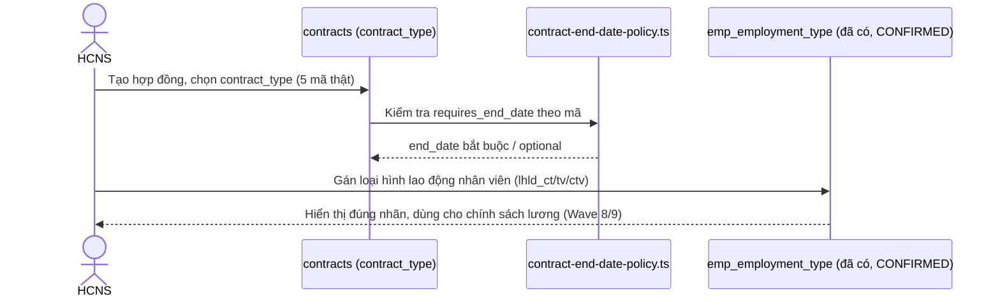

# SRS — Danh mục Loại hợp đồng & Loại hình lao động (Wave 4 / PO-HRM-CNTT-PAYROLL-CATALOG-PROGRAM-01)

| Meta | Value |
|---|---|
| work_item_id | BA-HRM-CONTRACT-EMPLOYMENT-TYPE-SRS-01 |
| ref_program | `docs/program/PO_HRM_CNTT_PAYROLL_CATALOG_PROGRAM.md` (Wave 4) |
| Nguồn nghiệp vụ | Sheet "Danh mục" STT 87-94 (bucket `LOẠI HỢP ĐỒNG` + `LOẠI HÌNH LAO ĐỘNG`) trong `docs/brand-new-documents-20270801/SYNTHESIS-CNTT-PAYROLL-REAL-20260813.xlsx` |
| Ngày | 2026-08-13 |
| Trạng thái | DRAFT — chờ sponsor + SA confirm trước khi sang TechSpec |

---

## 0. Cảnh báo nhầm lẫn khái niệm (đọc trước khi làm gì khác)

Đây là **2 khái niệm khác nhau**, dễ gộp lẫn:

| Khái niệm | "Loại hợp đồng" (contract type) | "Loại hình lao động" (employment type) |
|---|---|---|
| Định nghĩa | Loại **văn bản hợp đồng** ký với NLĐ (HĐ thử việc / HĐ lần 1 / HĐ lần 2 / HĐ KXĐTH / HĐ dịch vụ) | **Trạng thái làm việc hiện tại** của NLĐ (Chính thức / Thử việc / Cộng tác viên) |
| Gắn với | 1 bản ghi hợp đồng cụ thể (`contracts` — nhiều bản ghi lịch sử/1 nhân viên) | 1 nhân viên tại 1 thời điểm (thường 1 giá trị hiện hành) |
| Ví dụ thật | `hd_thu_viec`, `hd_lan_1`, `hd_lan_2`, `hd_kxdth`, `hd_dich_vu` | `lhld_ct` (Chính thức), `lhld_tv` (Thử việc), `lhld_ctv` (CTV) |
| Bảng/cơ chế trong code | **CHƯA có catalog riêng** — hiện là cột text tự do `contract_type` trên `contracts`, chỉ có 1 hàm nhận diện "hợp đồng không thời hạn" bằng normalize chuỗi (`contract-end-date-policy.ts`) | **ĐÃ CÓ** open catalog `public.emp_employment_type` (work item `PO-HRM-DYNAMIC-CONFIG-PLATFORM-EMP-BE-01`, CONFIRMED 2026-08-07) |

SRS này viết **2 domain riêng trong 1 file** theo đúng yêu cầu — FR/BR của từng domain KHÔNG được gộp chung.

## 1. Mục đích (Purpose)

- Chuẩn hoá "Loại hợp đồng" thành danh mục có cấu trúc (hiện là text tự do, dựa vào so khớp chuỗi để suy ra "không thời hạn" — rủi ro sai khi nhập liệu lệch chính tả).
- Nạp đúng 3 mã "Loại hình lao động" thật (`lhld_ct/lhld_tv/lhld_ctv`) vào catalog **đã có sẵn** `emp_employment_type`, thay cho bộ starter tiếng Anh hiện tại không khớp thuật ngữ công ty.
- Làm nền cho Wave 8-10 (thành phần lương, công thức) vì nhiều công thức lương thật phụ thuộc loại hình lao động (VD thử việc hưởng 85%).

## 2. UC (Use Case)

**UC-HRM-CNTT-CTRTYPE-01: Quản lý danh mục Loại hợp đồng**

| Actor | Mô tả |
|---|---|
| HCNS | Chọn loại hợp đồng khi tạo `contracts` mới; cấu hình danh mục loại hợp đồng (nếu TechSpec chốt xây catalog mới — xem FR-04) |
| Hệ thống Hợp đồng (`contracts-insurance.service.ts`) | Dùng loại hợp đồng để quyết định `end_date` bắt buộc hay không (`contract-end-date-policy.ts`) |

**UC-HRM-CNTT-EMPTYPE-01: Quản lý danh mục Loại hình lao động**

| Actor | Mô tả |
|---|---|
| HCNS | CRUD `emp_employment_type` (đã có sẵn cơ chế) — nạp/sửa 3 mã thật |
| Hệ thống Nhân sự/Lương | Đọc `employment_type_key` của nhân viên để áp dụng chính sách (VD % lương thử việc) |

## 3. FR (Functional Requirements)

### 3.1 Loại hợp đồng (`hd_*`) — domain MỚI, chưa có catalog

| Mã | Yêu cầu |
|---|---|
| FR-HRM-CTRTYPE-01 | Nạp 5 mã loại hợp đồng thật: `hd_thu_viec`, `hd_lan_1`, `hd_lan_2`, `hd_kxdth`, `hd_dich_vu` — làm danh mục dùng khi tạo `contracts`. |
| FR-HRM-CTRTYPE-02 | TechSpec phải quyết định: (a) xây catalog mới theo đúng khuôn mẫu Dynamic Config Platform Option B đã dùng cho DEC/EMP/SI/OT (bảng mở, `contract_type_key` format-only, có `group_ref` nếu cần chia sẻ toàn công ty), hay (b) chỉ validate cột text `contracts.contract_type` hiện có bằng 1 danh sách gợi ý (không ràng buộc FK). BA khuyến nghị (a) để nhất quán với các domain khác đã build và tránh lỗi chính tả gây sai policy `end_date` — nhưng đây là quyết định SA, không tự chốt. |
| FR-HRM-CTRTYPE-03 | Mỗi mã cần cờ **`requires_end_date`** tương ứng đúng logic đã có trong `contract-end-date-policy.ts`: `hd_kxdth` (Hợp đồng không xác định thời hạn) → `requires_end_date=false`; `hd_thu_viec`/`hd_lan_1`/`hd_lan_2`/`hd_dich_vu` → `requires_end_date=true`. Không được để hệ thống suy luận lại bằng so khớp chuỗi tên loại (rủi ro sai chính tả) sau khi có catalog chính thức — chuyển hẳn sang tra cờ theo mã. |
| FR-HRM-CTRTYPE-04 | `hd_dich_vu` (Hợp đồng dịch vụ — CTV, nguồn Mảng 2 TĐHK) là loại hợp đồng đặc thù không theo Luật Lao động thông thường (không phải HĐLĐ) — TechSpec cần đánh dấu khác biệt (VD cờ `is_labor_contract=false`) để tránh áp nhầm quy tắc BHXH/thuế TNCN của HĐLĐ chính thức. |

### 3.2 Loại hình lao động (`lhld_*`) — domain ĐÃ CÓ catalog

| Mã | Yêu cầu |
|---|---|
| FR-HRM-EMPTYPE-01 | Nạp 3 mã thật vào `emp_employment_type` (đã CONFIRMED, KHÔNG tạo bảng mới): `lhld_ct` (Chính thức), `lhld_tv` (Thử việc), `lhld_ctv` (Cộng tác viên) — thay/mở rộng starter set hiện tại (`full_time/part_time/contract/intern`) vì không khớp thuật ngữ công ty thật. TechSpec quyết định giữ song song 2 bộ (starter cũ + mã mới) hay thay hẳn — không tự chốt trong SRS vì có thể ảnh hưởng dữ liệu nhân viên đã gán trước đó (nếu có). |
| FR-HRM-EMPTYPE-02 | `lhld_tv` (Thử việc) cần liên kết được với chính sách "hưởng 85%" (đa số mảng, theo dữ liệu Excel STT 93) — nhưng % này thuộc phạm vi Wave 8/9 (thành phần lương) hoặc `hrm_position_compensation_policy`, KHÔNG lưu trực tiếp trên `emp_employment_type` (BA không tự thêm cột %). |
| FR-HRM-EMPTYPE-03 | Xác nhận cơ chế `group_ref` sẵn có (`EMP_EMPLOYMENT_TYPES_GROUP_REF_KEY`) dùng đúng cho việc công bố "Toàn công ty" 3 loại hình lao động — KHÔNG cần XBOS `PublishCatalogDto` (tương tự khuyến nghị FR-05 ở SRS Wave 2 Loại quyết định). |

## 4. BR (Business Rules)

| Mã | Quy tắc |
|---|---|
| BR-HRM-CTRTYPE-01 | "Loại hợp đồng" và "Loại hình lao động" là 2 trường độc lập trên 2 đối tượng khác nhau (`contracts.contract_type` vs nhân viên `employment_type_key`) — KHÔNG tự động suy diễn 1 field từ field kia (VD không tự set `lhld_tv` chỉ vì có `hd_thu_viec`) trừ khi TechSpec định nghĩa rõ luồng đồng bộ + có xác nhận nghiệp vụ. |
| BR-HRM-CTRTYPE-02 | `hd_kxdth` là loại hợp đồng mở (open-ended) — `end_date` optional; các loại còn lại `end_date` bắt buộc >= `start_date` — đúng policy đã có (`contract-end-date-policy.ts`, `HRM-CON-001`). |
| BR-HRM-CTRTYPE-03 | `hd_dich_vu` không tính là Hợp đồng lao động theo Luật LĐ — không áp automatic BHXH bắt buộc theo đúng luồng HĐLĐ chính thức (liên hệ Wave 5 Loại bảo hiểm) — cần review riêng bởi Legal/HCNS trước khi TechSpec khoá. |
| BR-HRM-EMPTYPE-01 | `employment_type_key` là open catalog (format-only) — 3 mã thật là khởi tạo, KHÔNG đóng cứng enum, tenant có thể thêm loại khác sau (BR-PLT-05). |
| BR-HRM-EMPTYPE-02 | Không hard-delete — retire (`status=retired`), giữ lịch sử nhân sự cũ tham chiếu đúng loại hình lao động. |

## 5. Dữ liệu gốc (SoT — trích Excel, đã verify trong phiên 2026-08-13)

**Loại hợp đồng (STT 87-91):**

| Mã | Tên hiển thị | Mảng nghiệp vụ | Nguồn |
|---|---|---|---|
| `hd_thu_viec` | Hợp đồng thử việc/thực tập/học nghề | Chung | Sheet input/data (nhiều mảng) |
| `hd_lan_1` | Hợp đồng lao động lần 1 | Chung | Sheet input/data |
| `hd_lan_2` | Hợp đồng lao động lần 2 | Chung | Sheet input/data |
| `hd_kxdth` | Hợp đồng không xác định thời hạn | Chung | Sheet input/data |
| `hd_dich_vu` | Hợp đồng dịch vụ (CTV) | Mảng 2 (TĐHK) | Sheet Staff |

**Loại hình lao động (STT 92-94):**

| Mã | Tên hiển thị | Mảng nghiệp vụ | Ghi chú |
|---|---|---|---|
| `lhld_ct` | Chính thức (CT) | Chung | |
| `lhld_tv` | Thử việc (TV) | Chung | Hưởng 85% (đa số mảng) |
| `lhld_ctv` | Cộng tác viên (CTV) | Chung | Sheet data/input |

Nguồn đầy đủ: sheet "Danh mục" (STT 87-94) — file `SYNTHESIS-CNTT-PAYROLL-REAL-20260813.xlsx`. Excel là bản chính thức, SRS chỉ tham chiếu.

## 6. AC (Acceptance Criteria)

| Mã | Điều kiện PASS |
|---|---|
| AC-HRM-CTRTYPE-01 | Picker "Loại hợp đồng" khi tạo `contracts` hiển thị đúng 5 mã, khớp Excel SoT |
| AC-HRM-CTRTYPE-02 | Tạo hợp đồng loại `hd_kxdth` → `end_date` optional (không bắt buộc); 4 loại còn lại → `end_date` bắt buộc >= `start_date` |
| AC-HRM-CTRTYPE-03 | Tạo hợp đồng loại `hd_dich_vu` → hệ thống hiển thị cảnh báo/nhãn rõ "không phải HĐLĐ chính thức" (theo BR-03), không tự động enroll BHXH bắt buộc |
| AC-HRM-EMPTYPE-01 | Picker "Loại hình lao động" hiển thị đúng 3 mã (`lhld_ct/lhld_tv/lhld_ctv`), khớp Excel SoT |
| AC-HRM-EMPTYPE-02 | Đổi loại hình lao động nhân viên đang có lịch sử → lịch sử cũ vẫn hiển thị đúng loại tại thời điểm đó (không hard-delete/ghi đè) |

## 7. Diễn biến (Luồng chính)

## 8. Ngoài phạm vi (Out of scope, wave này)

- Xây bảng catalog `hd_*` mới thật sự trong DB (chờ TechSpec quyết định FR-CTRTYPE-02).
- % lương thử việc cụ thể theo mảng (Wave 8/9 — thành phần lương/policy).
- Đồng bộ tự động giữa loại hợp đồng và loại hình lao động (BR-01 — cần xác nhận nghiệp vụ riêng).

## 9. Bước kế tiếp

Sponsor/SA trả lời FR-CTRTYPE-02 (xây catalog mới hay validate cột text hiện có) + FR-EMPTYPE-01 (thay hay giữ song song starter cũ) → TechSpec (DB nếu cần bảng mới cho contract_type, review cột `emp_employment_type`) → API_DESIGN → UI_SCREEN_SPEC → Dev.
