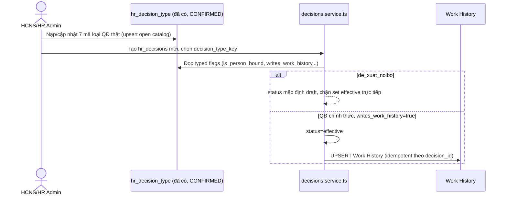

# SRS — Danh mục Loại quyết định (Wave 2 / PO-HRM-CNTT-PAYROLL-CATALOG-PROGRAM-01)

| Meta | Value |
|---|---|
| work_item_id | BA-HRM-DECISION-TYPE-SRS-01 |
| ref_program | `docs/program/PO_HRM_CNTT_PAYROLL_CATALOG_PROGRAM.md` (Wave 2) |
| Nguồn nghiệp vụ | Sheet "Danh mục" STT 57-63 (bucket `LOẠI QUYẾT ĐỊNH`) + sheet "Chính sách" (QĐ 2A/127A/753/752/280823/169) trong `docs/brand-new-documents-20270801/SYNTHESIS-CNTT-PAYROLL-REAL-20260813.xlsx` |
| Ngày | 2026-08-13 |
| Trạng thái | DRAFT — chờ sponsor + SA confirm (có 1 xung đột kiến trúc cần chốt, xem §3 FR-05) trước khi sang TechSpec |

---

## 1. Mục đích (Purpose)

Chuẩn hoá "Loại quyết định" (7 mục thật: QĐ thang bảng lương, QĐ điều chỉnh lương, QĐ phụ cấp, QĐ thưởng, Thông báo định mức, Giấy đề xuất/Tờ trình nội bộ, QĐ kỷ luật) làm danh mục có cấu trúc, dùng để:
- Phân loại QĐ khi HCNS tạo/soạn hồ sơ (`hr_decisions`), gate hành vi hệ thống (có cập nhật Work History hay không, có bắt buộc gắn nhân sự hay không).
- Tách bạch rõ "Giấy đề xuất/Tờ trình" (chưa phải văn bản chính thức) khỏi các loại QĐ đã ban hành — tránh QĐ nháp bị coi là căn cứ pháp lý chính thức.

**Phát hiện quan trọng (đọc code thật, không phải đề xuất xây mới):** bảng catalog cho "Loại quyết định" **đã tồn tại** — `public.hr_decision_type` (work item `PO-HRM-DYNAMIC-CONFIG-PLATFORM-DEC-BE-01`, DATA/BA/SA đều **CONFIRMED** ngày 2026-08-07, xem `docs/program/specs/PO-HRM-DYNAMIC-CONFIG-PLATFORM-DEC-DATA-01.md`). Đây là **open catalog per-company** (không phải bảng đóng cứng enum), hiện có starter keys mẫu `appointment/transfer/HRD_01/HRD_02/HRD_03` (bootstrap, không phải trần sản phẩm — BR-PLT-05). Wave 2 vì vậy **KHÔNG phải xây bảng catalog mới** — là nạp đúng 7 mã thật từ QĐ 2A/127A + review lại nhóm typed-flag đã thiết kế sẵn (`is_person_bound`, `writes_work_history`, `wh_event_type`, `requires_position_key`) cho khớp nghiệp vụ thật.

## 2. UC (Use Case)

**UC-HRM-CNTT-DECTYPE-01: Quản lý danh mục Loại quyết định**

| Actor | Mô tả |
|---|---|
| HCNS/HR Admin (mỗi company) | CRUD `hr_decision_type` (mã, tên, cờ typed) qua UI Settings; retire (không hard-delete) |
| Group Admin (holding, nếu chốt kiến trúc group_ref — xem FR-05) | Tạo bộ mã "Toàn công ty" tại company `holding`, member company đọc REF (dual SoT, tenant có thể override) |
| Hệ thống Decisions (`decisions.service.ts`) | Đọc `decision_type_key` để gate `is_person_bound` (bắt `employee_id`), `writes_work_history` (khi QĐ `status=effective` -> upsert Work History), `requires_position_key` |
| HCNS tạo QĐ | Chọn loại QĐ từ picker khi tạo `hr_decisions` mới |

## 3. FR (Functional Requirements)

| Mã | Yêu cầu |
|---|---|
| FR-HRM-DECTYPE-01 | Nạp 7 mã loại quyết định thật vào `hr_decision_type` (không tạo bảng mới): `qd_thang_bang_luong`, `qd_dieu_chinh_luong`, `qd_phu_cap`, `qd_thuong`, `tb_dinh_muc`, `de_xuat_noibo`, `qd_ky_luat` — thay/mở rộng starter set hiện tại (`appointment/transfer/HRD_01..03`) vì đó chỉ là dữ liệu bootstrap ví dụ, không phải danh sách chính thức. |
| FR-HRM-DECTYPE-02 | Với mỗi mã, TechSpec phải xác định cụ thể `is_person_bound`/`writes_work_history`/`wh_event_type`/`requires_position_key` theo đúng ngữ nghĩa nghiệp vụ (VD `qd_dieu_chinh_luong` có gắn nhân sự + có thể ghi Work History; `tb_dinh_muc` không gắn nhân sự, không ghi Work History) — SRS này KHÔNG tự gán vì thiếu căn cứ đủ chi tiết, chỉ nêu yêu cầu phải làm rõ trước code. |
| FR-HRM-DECTYPE-03 | `tb_dinh_muc` (Thông báo định mức, VD TB 17/2026 khoán nhiên liệu) là văn bản hành chính không phải "Quyết định" theo đúng nghĩa Luật LĐ, nhưng dùng chung bảng `hr_decisions` (mở rộng loại văn bản) — cần TechSpec xác nhận có tách nhãn UI ("Loại văn bản": Quyết định/Thông báo/Tờ trình) hay giữ phẳng 1 danh mục. |
| FR-HRM-DECTYPE-04 | `de_xuat_noibo` (Giấy đề xuất/Tờ trình) dùng field đã có sẵn `hr_decisions.status` (mặc định `draft`, hiện là text mở, không phải enum đóng) để phân biệt Dự thảo/Chờ duyệt — KHÔNG được set `status` bằng giá trị `effective` trực tiếp cho loại này vì `effective` hiện là trigger có sẵn để ghi Work History (dành cho QĐ chính thức), set nhầm sẽ ghi WH sai cho 1 tờ trình chưa duyệt. TechSpec phải định nghĩa rõ tập giá trị status hợp lệ cho `de_xuat_noibo` (ví dụ draft -> pending_approval -> converted/rejected), khác với luồng draft -> effective của QĐ chính thức. |
| FR-HRM-DECTYPE-05 | **Xung đột kiến trúc cần chốt trước TechSpec:** `PO_HRM_CNTT_PAYROLL_CATALOG_PROGRAM.md` §1 ghi domain `hrm_org_decision_type` publish tại `xevn/holding` qua luồng XBOS `PublishCatalogDto`/`ApplyCatalogToMembers` (kiến trúc ARCH-01 §1). Nhưng `hr_decision_type` thật trong code là bảng per-company native với cơ chế group_ref dual-SoT đã CONFIRMED sẵn (`HR_DECISION_TYPES_GROUP_REF_KEY`, family alias `decision_types`/`hr_decision_types`, tenant ghi đè thắng — BR-PLT-06) — đây là 1 pipeline khác, KHÔNG đi qua `catalog-governance`/`config-sync` như ARCH-01 mô tả cho payroll_grade. Dùng cả 2 luồng song song cho cùng khái niệm sẽ tạo 2 nguồn sự thật. Khuyến nghị của BA: dùng đúng cơ chế group_ref đã CONFIRMED và có sẵn code (rẻ hơn, nhất quán với DEC/EMP/SI/OT đã build), KHÔNG publish qua XBOS `PublishCatalogDto` cho domain này — nhưng đây là quyết định của SA/PM, không tự chốt trong SRS. |

## 4. BR (Business Rules)

| Mã | Quy tắc |
|---|---|
| BR-HRM-DECTYPE-01 | KHÔNG tạo bảng catalog mới — dùng đúng `hr_decision_type` đã CONFIRMED (work item `PO-HRM-DYNAMIC-CONFIG-PLATFORM-DEC-BE-01`). Wave 2 = nạp dữ liệu + review typed flags, không phải dựng schema từ đầu. |
| BR-HRM-DECTYPE-02 | `decision_type_key` là open catalog (format-only, regex `^[a-zA-Z][a-zA-Z0-9_]*$`) — 7 mã thật là khởi tạo, KHÔNG đóng thành enum cứng; tenant có thể thêm loại QĐ khác sau (đúng BR-PLT-05 đã lock trong platform). |
| BR-HRM-DECTYPE-03 | `de_xuat_noibo` KHÔNG được set `writes_work_history=true` — vì bản chất chưa phải quyết định có hiệu lực pháp lý, tránh Work History bị ghi sai từ 1 văn bản chưa duyệt. |
| BR-HRM-DECTYPE-04 | Không hard-delete loại QĐ — retire (`status=retired` + `archived_at`), giữ đúng tên loại cho QĐ lịch sử đã tham chiếu (BR-PLT-04). |
| BR-HRM-DECTYPE-05 | Nếu SA/PM chốt dùng group_ref (khuyến nghị FR-05) — company `holding` là nơi tạo bộ mã "Toàn công ty", các company con đọc qua effective-catalog union (tenant ghi đè thắng nếu trùng mã) — không phải publish/apply 1 chiều kiểu XBOS. |

## 5. Dữ liệu gốc (SoT — trích Excel, đã verify trong phiên 2026-08-13)

| Mã | Tên hiển thị | Mảng nghiệp vụ | Nguồn (QĐ) | Ghi chú |
|---|---|---|---|---|
| `qd_thang_bang_luong` | QĐ ban hành thang lương/bảng lương | Chung | QĐ 2A | |
| `qd_dieu_chinh_luong` | QĐ điều chỉnh cơ chế/đơn giá lương | Chung | QĐ 127A/439/816/1031 | |
| `qd_phu_cap` | QĐ ban hành/chi phụ cấp | Chung | QĐ 753/752/280823 | |
| `qd_thuong` | QĐ ban hành chính sách thưởng | Chung | QĐ 169/2026 | |
| `tb_dinh_muc` | Thông báo định mức (nhiên liệu...) | Mảng 5 (LX Tải) | TB 17/2026 | Không phải "Quyết định" thuần |
| `de_xuat_noibo` | Giấy đề xuất/Tờ trình (chưa phải QĐ chính thức) | Nhiều mảng | Nhiều file "Đề xuất" | Có luồng ký nháy BLĐ/HCNS — cần trạng thái riêng Dự thảo/Chờ duyệt |
| `qd_ky_luat` | QĐ kỷ luật | Tất cả mảng | Sheet VPKL | Có số QĐ + ngày ban hành riêng (chỉ 1 số nơi ghi đủ) |

Nguồn đầy đủ: sheet "Danh mục" (STT 57-63) + sheet "Chính sách" — file `SYNTHESIS-CNTT-PAYROLL-REAL-20260813.xlsx`. Excel là bản chính thức, SRS chỉ tham chiếu.

## 6. AC (Acceptance Criteria)

| Mã | Điều kiện PASS |
|---|---|
| AC-HRM-DECTYPE-01 | Picker "Loại quyết định" khi tạo `hr_decisions` hiển thị đúng 7 mã, khớp 100% tên/mảng trong Excel SoT |
| AC-HRM-DECTYPE-02 | Tạo văn bản loại `de_xuat_noibo` -> mặc định `status=draft`; hệ thống KHÔNG cho set status thành `effective` trực tiếp (chặn hoặc cảnh báo rõ) cho tới khi TechSpec khoá state machine riêng cho loại này |
| AC-HRM-DECTYPE-03 | Retire 1 loại QĐ đang có QĐ lịch sử tham chiếu -> QĐ cũ vẫn hiển thị đúng tên loại, không vỡ liên kết, không hard-delete |
| AC-HRM-DECTYPE-04 | Câu hỏi kiến trúc FR-05 (group_ref vs XBOS publish) có câu trả lời của SA/PM ghi lại bằng văn bản TRƯỚC khi TechSpec khoá thiết kế |
| AC-HRM-DECTYPE-05 | Mỗi mã trong 7 mã có đủ giá trị `is_person_bound`/`writes_work_history`/`wh_event_type`/`requires_position_key` được TechSpec xác nhận rõ ràng (không để mặc định `false` một cách tuỳ tiện) |

## 7. Diễn biến (Luồng chính)

## 8. Ngoài phạm vi (Out of scope, wave này)

- Workflow duyệt chi tiết (ai duyệt, bao nhiêu bước) cho `de_xuat_noibo` — thuộc TechSpec/wave khác.
- In ấn văn bản QĐ, gán người ký theo chức danh.
- Quyết định kiến trúc publish cuối cùng (group_ref vs XBOS) — chờ SA/PM trả lời FR-05.

## 9. Bước kế tiếp

Sponsor/SA trả lời FR-05 (kiến trúc publish) + xác nhận typed flags từng mã (AC-05) -> TechSpec (điều chỉnh nếu cần cột `hr_decision_type`, định nghĩa state machine `de_xuat_noibo`) -> API_DESIGN (đã có phần lớn qua F-DEC-CAT-*, chỉ bổ sung nếu có thay đổi) -> UI_SCREEN_SPEC -> Dev (chỉ là data-load + review flag, không phải xây bảng mới).
