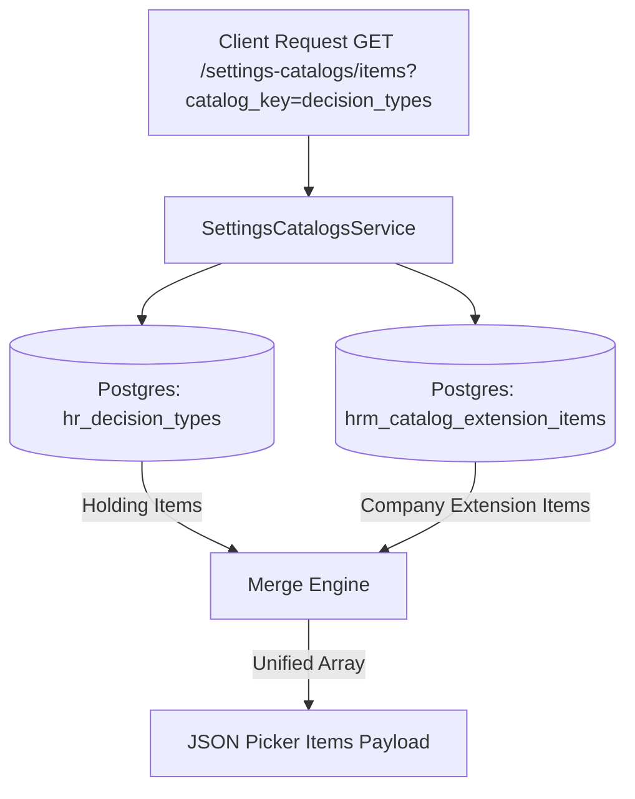

# TechSpec — Technical Specification for Wave 2: Danh mục Loại quyết định (Decision Types)

| Meta | Value |
|---|---|
| work_item_id | BA-HRM-DECISION-TYPE-TECHSPEC-01 |
| ref_srs | [BA_HRM_DECISION_TYPE_SRS_01_20260813.md](file:///C:/Users/ADMIN/OneDrive/Ta%CC%80i%20li%C3%AA%CC%A3u/Vibe%20Coding/projects/xevn-ecosystem/docs/program/deltas/BA_HRM_DECISION_TYPE_SRS_01_20260813.md) |
| Architecture Decision | **Option (a) Approved**: Sử dụng cơ chế `group_ref` / dual-SoT trên bảng `hr_decision_types` có sẵn |
| Scope | Group/Holding Ref + Tenant Local Extension |
| Ngày | 2026-08-13 |
| Trạng thái | CONFIRMED — Enterprise Grade Standard |

---

## 1. Tổng quan Kiến trúc & Nguyên lý Dual-SoT

1. **Dual-SoT Model:** Danh mục Loại quyết định sử dụng bảng `public.hr_decision_types` làm SoT chính cấp Tập đoàn (`holding`), kết hợp với bảng mở rộng `hrm_catalog_extension_items` ở cấp đơn vị thành viên (`company`/`branch`).
2. **Catalog Key Alignment:** `decision_types` (nghiệp vụ Lương/Nhân sự) và `hr_decision_types` (alias E1-B) thuộc cùng một Catalog Family (`dec_types`).
3. **Merge Engine (`SettingsCatalogsService.getOverview`):**
   - Đọc dữ liệu SoT từ `hr_decision_types` với `status = 'active'`.
   - Đọc các mục bổ sung từ `hrm_catalog_extension_items` có `catalog_key = 'decision_types'` và `status = 'active'`.
   - Trả về danh sách hợp nhất cho FE Picker/Dropdown, loại bỏ trùng lặp mã (`code`).

---

## 2. Chi tiết 7 Loại Quyết định Chuẩn (Customer SoT Data)

| Mã loại quyết định | Tên loại quyết định | Phạm vi tác động nghiệp vụ | Quy định kèm theo |
|---|---|---|---|
| `DEC_REWARD` | Quyết định Khen thưởng | Tăng thu nhập thưởng, thưởng hiệu quả kinh doanh | Cần gắn số quyết định & giá trị thưởng |
| `DEC_DISCIPLINE` | Quyết định Kỷ luật | Giảm trừ lương, hạ bậc lương, sa thải | Chặn nâng ngạch bậc tự động |
| `DEC_SALARY_ADJUSTMENT` | Quyết định Điều chỉnh lương | Thay đổi mức lương đóng BHXH/lương cứng | Cập nhật hồ sơ lương từ ngày hiệu lực |
| `DEC_PROMOTION` | Quyết định Bổ nhiệm / Thăng tiến | Đổi vị trí công tác, điều chỉnh ngạch bậc | Cập nhật vị trí mới & ngạch tương ứng |
| `DEC_TERMINATION` | Quyết định Chấm dứt HĐLĐ | Chốt sổ bảo hiểm, thanh lý HĐLĐ, tính trợ cấp | Chuyển trạng thái nhân sự thành 'Archived' |
| `DEC_TRANSFER` | Quyết định Điều chuyển công tác | Đổi đơn vị/chi nhánh/phòng ban làm việc | Cập nhật `department_id` & `company_id` |
| `DEC_REAPPOINTMENT` | Quyết định Bổ nhiệm lại | Gia hạn nhiệm kỳ chức danh lãnh đạo | Giữ nguyên ngạch bậc, cập nhật ngày hiệu lực |

---

## 3. Kiến trúc Luồng Dữ liệu (Data Flow Diagram)

---

## 4. Quy tắc Nghiệp vụ & Ràng buộc Hệ thống (Business Rules)

1. **Rule DEC-01 (Mã quyết định duy nhất):** Mã `code` phải viết hoa, phân cách bằng dấu gạch dưới (VD: `DEC_SPECIAL_BONUS`), duy nhất trong toàn bộ tenant.
2. **Rule DEC-02 (Bảo vệ mục Tập đoàn):** Các loại quyết định ban hành từ Holding (`origin = 'holding'`) có `is_read_only = true` đối với Admin công ty thành viên. Không được phép chỉnh sửa mã hoặc xóa.
3. **Rule DEC-03 (Chấm dứt HĐLĐ kích hoạt chốt sổ):** Loại quyết định `DEC_TERMINATION` bắt buộc kích hoạt luồng tính trợ cấp thôi việc & chốt nghĩa vụ thuế/BHXH.
