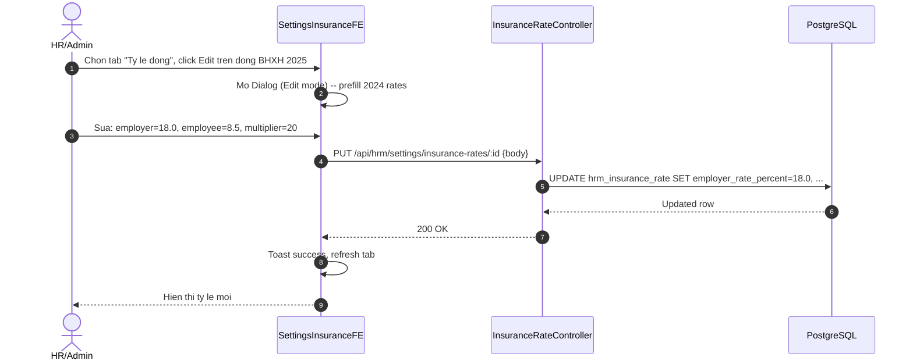

# SRS W12b -- Cau Hinh Muc Dong Bao Hiem Bat Buoc (BHXH, BHYT, BHTN) Theo Quy Dinh Nha Nuoc VN

| Meta | Value |
|---|---|
| work_item_id | BA-HRM-INSURANCE-RATE-SRS-01 |
| ref_program | PO_HRM_CNTT_PAYROLL_CATALOG_PROGRAM.md (Wave 12b) |
| Ngay | 2026-08-15 |
| Trang thai | DRAFT -- ready for BA review |
| Luu y | KHONG can nha bao hiem thuong mai. Chi cau hinh cac ty le dong BHXH/BHYT/BHTN theo Nghi dinh Chinh phu. Sponsor yeu cau: "van can cau hinh duoc" -- khong hardcode.

---

## 1. Business Context

Viet Nam co 3 loai bao hiem bat buoc (Luong bao hiem xa hoi -- Luat BHXH 2014, hieu luc 01/2016, dieu chinh bo sung 2024):
- **BHXH** (Bao hiem xa hoi): Hiem ng Nghiep, Hiem Su khong, Thai san, Hiem Lao dong, Hiem Ngheo, Huu tri
- **BHYT** (Bao hiem y te): Kham chua benh
- **BHTN** (Bao hiem that nghiep): Tro cap that nghiep

Ty le dong va muc luong dong (salary cap) duoc quy dinh boi Chinh phu qua Nghi dinh. Hien tai (2024-2025):
- **Nghi dinh 58/2020/ND-CP** (ty le dong)
- **Nghi dinh 135/2020/ND-CP** (dieu chinh ty le)
- **Nghi dinh 74/2024/ND-CP** (muc luong toi thieu vung tu 07/2024 -> muc dong BH toi da = 20 x luong toi thieu vung)

Yeu cau: **Cau hinh duoc cac ty le va muc luong toi da** -- khong hardcode, de khi Chinh phu cap nhat Nghi dinh moi thi Admin cap nhat Settings ma khong can deploy code.

---

## 2. User Stories (3 UC)

| UC | Actor | Mo ta | Acceptance |
|---|---|---|---|
| UC-IR-01 | HR/Admin | Xem bang cau hinh ty le BH trong Settings > Payroll > Insurance Rates | Bang hien thi 2 tab: Ty le dong (Employer/Employee) + Muc luong toi da (theo vung) |
| UC-IR-02 | HR/Admin | Cap nhat ty le dong / muc luong toi da khi co Nghi dinh moi | Form edit: nam hieu luc, ty le nha lao dong %, ty le nguoi lao dong %, muc luong toi da (moi vung) |
| UC-IR-03 | Payroll Engine | Tinh dong BH tu dong dung ty le hieu luc theo ky tinh luong | Payroll lay ty le hieu luc theo ngay tinh ky payroll_period |

---

## 3. Functional Requirements (6 FR)

| ID | Requirement | Priority |
|---|---|---|
| FR-IR-01 | He thong luu lich su ty le dong BHXH/BHYT/BHTN theo nam hieu luc (effective_year) | Must |
| FR-IR-02 | Moi nam co 3 dong: BHXH, BHYT, BHTN -- moi dong co: employer_rate, employee_rate, salary_cap_multiplier (mac dinh 20) | Must |
| FR-IR-03 | Muc luong toi da dong BH = salary_cap_multiplier x luong_toi_thieu_vung (vung 1/2/3/4) | Must |
| FR-IR-04 | Luong_toi_thieu_vung cau hinh rieng (4 vung) theo Nghi dinh 74/2024/ND-CP | Must |
| FR-IR-05 | Payroll tinh dong: employer_pay = min(gross, cap) x employer_rate%; employee_pay = min(gross, cap) x employee_rate% | Must |
| FR-IR-06 | Settings UI: Tab "Ty le dong" (bang 3 loai BH x 2 ty le) + Tab "Muc luong toi da" (4 vung), Edit dialog moi row | Must |

---

## 4. Business Rules (7 BR)

| ID | Rule | Source |
|---|---|---|
| BR-IR-01 | Ty le hien hanh (2024-2025): BHXH NLD 17.5% / NLD 8%; BHYT NLD 3% / NLD 1.5%; BHTN NLD 1% / NLD 1% | ND 58/2020, 135/2020 |
| BR-IR-02 | Tong ty le NLD = 21.5%, NLD = 10.5% (tong 32%) | Sum check |
| BR-IR-03 | Muc luong dong BH toi da = 20 x luong_toi_thieu_vung (vung 1: 4.680.000 -> cap 93.600.000) | ND 74/2024 |
| BR-IR-04 | Luong_toi_thieu_vung 4 vung (07/2024): V1=4.680.000, V2=4.160.000, V3=3.640.000, V4=3.250.000 | ND 74/2024 |
| BR-IR-05 | Chi co 1 record hieu luc cho 1 (nam, loai_bh) -- khong trung nam | Unique constraint |
| BR-IR-06 | Khi tinh payroll ky N: lay ty le cua nam chua ngay tinh ky (pay_period.start_date) | Payroll alignment |
| BR-IR-07 | Khong cho xoa record da co payroll da tinh -- chi deactivate (effective_end) | Audit trail |

---

## 5. Data Model (2 bang moi)

### 5.1 hrm_insurance_rate (Ty le dong BH)

| Column | Type | Constraints |
|---|---|---|
| id | uuid | PK |
| tenant_id | uuid | NOT NULL, FK |
| company_id | uuid | NOT NULL, FK |
| insurance_type | varchar(10) | NOT NULL, CHECK IN ('BHXH','BHYT','BHTN') |
| effective_year | int | NOT NULL, CHECK (2000-2100) |
| employer_rate_percent | numeric(5,2) | NOT NULL, CHECK (0-100) |
| employee_rate_percent | numeric(5,2) | NOT NULL, CHECK (0-100) |
| salary_cap_multiplier | numeric(4,1) | NOT NULL, DEFAULT 20.0, CHECK (>0) |
| status | varchar(20) | NOT NULL, DEFAULT 'active', CHECK IN ('active','inactive') |
| effective_from | date | NOT NULL |
| effective_to | date | NULLABLE |
| created_at | timestamptz | DEFAULT now() |
| updated_at | timestamptz | DEFAULT now() |

Unique: (tenant_id, insurance_type, effective_year)

### 5.2 hrm_minimum_wage_region (Luong toi thieu vung)

| Column | Type | Constraints |
|---|---|---|
| id | uuid | PK |
| tenant_id | uuid | NOT NULL, FK |
| company_id | uuid | NOT NULL, FK |
| region_code | varchar(10) | NOT NULL, CHECK IN ('REGION_1','REGION_2','REGION_3','REGION_4') |
| effective_from | date | NOT NULL |
| effective_to | date | NULLABLE |
| monthly_min_wage | numeric(14,2) | NOT NULL, CHECK (>0) |
| status | varchar(20) | DEFAULT 'active' |
| created_at | timestamptz | DEFAULT now() |
| updated_at | timestamptz | DEFAULT now() |

Unique: (tenant_id, region_code, effective_from)

---

## 6. Seed Data (Ty le 2024-2025 + Luong toi thieu vung 07/2024)

### hrm_insurance_rate (effective_year = 2024)

| insurance_type | employer_rate | employee_rate | salary_cap_multiplier |
|---|---|---|---|
| BHXH | 17.50 | 8.00 | 20.0 |
| BHYT | 3.00 | 1.50 | 20.0 |
| BHTN | 1.00 | 1.00 | 20.0 |

### hrm_minimum_wage_region (effective_from = '2024-07-01')

| region_code | monthly_min_wage | Note |
|---|---|---|
| REGION_1 | 4,680,000 | TP.HCM, Ha Noi, v.v. |
| REGION_2 | 4,160,000 | |
| REGION_3 | 3,640,000 | |
| REGION_4 | 3,250,000 | |

-> Muc dong BH toi da V1 = 20 x 4.68M = 93.6M VND/thang

---

## 7. Acceptance Criteria (8 AC)

| AC | Test case |
|---|---|
| AC-IR-01 | GET /api/hrm/settings/insurance-rates -> 200, tra ve 3 loai BH voi ty le 2024 |
| AC-IR-02 | POST insurance rate nam 2025 (BHXH NLD 18%, NLD 8.5%) -> 201, hieu luc tu 2025-01-01 |
| AC-IR-03 | PUT cap nhat luong_toi_thieu REGION_1 = 4.9M (2025) -> 200, cap BH V1 tu dong = 98M |
| AC-IR-04 | Payroll ky 01/2025 dung ty le 2024; ky 01/2026 dung ty le 2025 (neu da cau hinh) |
| AC-IR-05 | Tinh dong: gross=100M, cap=93.6M -> employer_BHXH = 93.6M x 17.5% = 16.38M |
| AC-IR-06 | Employee gross=50M (< cap) -> employee_BHXH = 50M x 8% = 4M |
| AC-IR-07 | Settings UI: 2 tabs, bang editable, dialog validation (rate 0-100, multiplier >0) |
| AC-IR-08 | Khong the xoa rate nam 2024 neu payroll 2024 da chay -> chi deactivate |

---

## 8. Sequence Diagram (UC-IR-02: Cap nhat ty le moi nam)



---

## 9. API Contract (6 endpoints)

| Method | Path | Desc |
|---|---|---|
| GET | /api/hrm/settings/insurance-rates | List all rates (grouped by year) |
| GET | /api/hrm/settings/insurance-rates/:id | Detail |
| POST | /api/hrm/settings/insurance-rates | Create new year rate |
| PUT | /api/hrm/settings/insurance-rates/:id | Update rate |
| GET | /api/hrm/settings/minimum-wage-regions | List 4 regions |
| PUT | /api/hrm/settings/minimum-wage-regions/:id | Update region min wage |

DTOs: InsuranceRateDto (insuranceType, effectiveYear, employerRatePercent, employeeRatePercent, salaryCapMultiplier), MinimumWageRegionDto (regionCode, effectiveFrom, monthlyMinWage).

---

## 10. UI Screen Spec

**File:** `UI-HRM-INSURANCE-RATE-SETUP-01.md` (separate file)

- Route: `/hr/settings/payroll/insurance-rates`
- Layout: 2 Tabs -- "Ty le dong" + "Muc luong toi da (vung)"
- Tab 1: Table 3 rows (BHXH, BHYT, BHTN) x cols: Nam, NLD%, NLD%, He so cap, Trang thai, Hanh dong
- Tab 2: Table 4 rows (Vung 1-4) x cols: Vung, Muc luong toi thieu, Muc dong BH toi da (tinh), Hanh dong
- Dialog Edit: Validation rate 0-100, multiplier >0, nam unique
- Read-only computed column: "Muc dong BH toi da" = multiplier x luong_toi_thieu_vung

---

## 11. Payroll Formula Integration

Bien moi cho pay-formula allowlist:
- `insurance_bhxh_employer_rate` (numeric, % tu config)
- `insurance_bhxh_employee_rate`
- `insurance_bhyt_employer_rate` (note: ten bien khong dau)
- `insurance_bhyt_employee_rate`
- `insurance_bhtn_employer_rate`
- `insurance_bhtn_employee_rate`
- `insurance_salary_cap` (numeric, VND -- min(gross, cap))

Cong thuc tinh dong (pseudo):
```
bhxh_employer = min(gross_salary, insurance_salary_cap) * insurance_bhxh_employer_rate / 100
bhxh_employee = min(gross_salary, insurance_salary_cap) * insurance_bhxh_employee_rate / 100
...
```

Can them vao `PAY_FORMULA_INPUT_PACK_SOURCE_KINDS` hoac allowlist rieng -- quy dinh o TechSpec.

---

## 12. Dependencies & Impact

- **2 bang moi:** `hrm_insurance_rate`, `hrm_minimum_wage_region` (2 migrations)
- **Payroll formula:** 7 bien moi vao allowlist (TechSpec W10 mo rong)
- **Settings UI:** New route `/hr/settings/payroll/insurance-rates` -- pattern Settings Catalog (tabs)
- **Dependency:** W8 (Thanh phan luong) da co base_salary -- insurance tinh tu gross/base
- **Khong can:** W5 Loai bao hiem (da co catalog loai BH -- W12b cau hinh TY LE cua cac loai do)

---

## 13. Exit Criteria (BA sign-off -> TechSpec)

- [ ] BA xac nhan ty le 2024-2025 chuan xac (NLD/NLD tung loai)
- [ ] BA xac nhan 4 vung luong toi thieu + cap 20x
- [ ] BA xac nhan Settings UI 2 tabs pattern
- [ ] BA xac nhan payroll formula integration (7 bien moi)
- [ ] TechSpec drafted with 2 migrations + API + FE + formula integration spec
