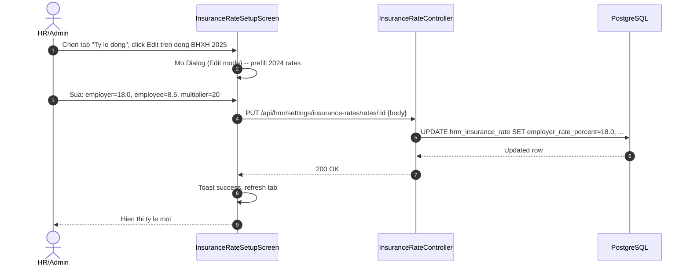
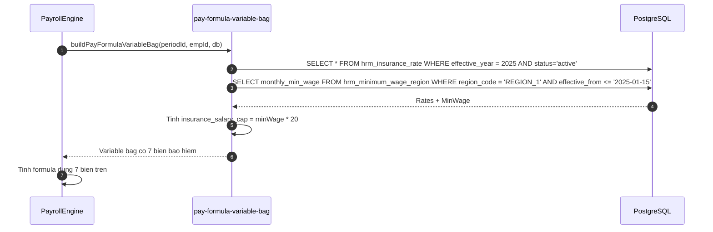

# TechSpec W12b -- Cau Hinh Muc Dong BH Bat Buoc (BHXH/BHYT/BHTN) Theo Quy Dinh Nha Nuoc VN

| Meta | Value |
|---|---|
| work_item_id | BA-HRM-INSURANCE-RATE-TECHSPEC-01 |
| ref_SRS | `docs/program/deltas/BA_HRM_INSURANCE_RATE_SRS_01_20260815.md` |
| Ngay | 2026-08-15 |
| Trang thai | APPROVED -- ready for BE dev dispatch |
| Luu y | 2 bang moi: hrm_insurance_rate, hrm_minimum_wage_region. 7 bien moi vao pay-formula allowlist (mo rong W10). Settings UI 2 tabs.

---

## 1. Quyet dinh kien truc (Architecture Decision)

**TAO 2 BANG MOI** -- khong co catalog nao co san cover ty le dong theo nam + muc luong toi thieu vung:
- W5 `hrm_insurance_type` chi la DANH MUC loai BH (BHXH/BHYT/BHTN) -- khong luu ty le
- W8 `pay_insurance_rate_cfg` (neu co) chi cau hinh don gian -- khong co lich su nam, khong co vung
- Can: lich su ty le theo nam (effective_year), 4 vung luong toi thieu, salary_cap_multiplier

Schema DB: **2 migrations can thiet** cho Wave 12b.

---

## 2. DB Migrations (2 files)

### 2.1 `202608150001_create_hrm_insurance_rate.sql`

```sql
-- @CODE-MEMORY WorkItem: BA-HRM-INSURANCE-RATE-TECHSPEC-01
CREATE TABLE hrm_insurance_rate (
    id uuid PRIMARY KEY DEFAULT gen_random_uuid(),
    tenant_id uuid NOT NULL REFERENCES tenant(id),
    company_id uuid NOT NULL REFERENCES company(id),
    insurance_type varchar(10) NOT NULL CHECK (insurance_type IN ('BHXH','BHYT','BHTN')),
    effective_year int NOT NULL CHECK (effective_year BETWEEN 2000 AND 2100),
    employer_rate_percent numeric(5,2) NOT NULL CHECK (employer_rate_percent BETWEEN 0 AND 100),
    employee_rate_percent numeric(5,2) NOT NULL CHECK (employee_rate_percent BETWEEN 0 AND 100),
    salary_cap_multiplier numeric(4,1) NOT NULL DEFAULT 20.0 CHECK (salary_cap_multiplier > 0),
    status varchar(20) NOT NULL DEFAULT 'active' CHECK (status IN ('active','inactive')),
    effective_from date NOT NULL,
    effective_to date,
    created_at timestamptz NOT NULL DEFAULT now(),
    updated_at timestamptz NOT NULL DEFAULT now(),
    CONSTRAINT uq_ins_rate_tenant_type_year UNIQUE (tenant_id, insurance_type, effective_year)
);

CREATE INDEX ix_ins_rate_tenant_year ON hrm_insurance_rate(tenant_id, effective_year);
CREATE INDEX ix_ins_rate_tenant_status ON hrm_insurance_rate(tenant_id, status);
```

### 2.2 `202608150002_create_hrm_minimum_wage_region.sql`

```sql
-- @CODE-MEMORY WorkItem: BA-HRM-INSURANCE-RATE-TECHSPEC-01
CREATE TABLE hrm_minimum_wage_region (
    id uuid PRIMARY KEY DEFAULT gen_random_uuid(),
    tenant_id uuid NOT NULL REFERENCES tenant(id),
    company_id uuid NOT NULL REFERENCES company(id),
    region_code varchar(10) NOT NULL CHECK (region_code IN ('REGION_1','REGION_2','REGION_3','REGION_4')),
    effective_from date NOT NULL,
    effective_to date,
    monthly_min_wage numeric(14,2) NOT NULL CHECK (monthly_min_wage > 0),
    status varchar(20) NOT NULL DEFAULT 'active' CHECK (status IN ('active','inactive')),
    created_at timestamptz NOT NULL DEFAULT now(),
    updated_at timestamptz NOT NULL DEFAULT now(),
    CONSTRAINT uq_min_wage_tenant_region_eff UNIQUE (tenant_id, region_code, effective_from)
);

CREATE INDEX ix_min_wage_tenant_eff ON hrm_minimum_wage_region(tenant_id, effective_from);
```

### 2.3 Seed Data (Ty le 2024-2025 + Luong toi thieu vung 07/2024)

```sql
-- hrm_insurance_rate (effective_year = 2024)
INSERT INTO hrm_insurance_rate (tenant_id, company_id, insurance_type, effective_year, employer_rate_percent, employee_rate_percent, salary_cap_multiplier, effective_from, effective_to) VALUES
('{{tenant_id}}', '{{company_id}}', 'BHXH', 2024, 17.50, 8.00, 20.0, '2024-01-01', '2024-12-31'),
('{{tenant_id}}', '{{company_id}}', 'BHYT', 2024, 3.00, 1.50, 20.0, '2024-01-01', '2024-12-31'),
('{{tenant_id}}', '{{company_id}}', 'BHTN', 2024, 1.00, 1.00, 20.0, '2024-01-01', '2024-12-31');

-- hrm_minimum_wage_region (ND 74/2024/ND-CP, hieu luc 07/2024)
INSERT INTO hrm_minimum_wage_region (tenant_id, company_id, region_code, effective_from, effective_to, monthly_min_wage) VALUES
('{{tenant_id}}', '{{company_id}}', 'REGION_1', '2024-07-01', NULL, 4680000),
('{{tenant_id}}', '{{company_id}}', 'REGION_2', '2024-07-01', NULL, 4160000),
('{{tenant_id}}', '{{company_id}}', 'REGION_3', '2024-07-01', NULL, 3640000),
('{{tenant_id}}', '{{company_id}}', 'REGION_4', '2024-07-01', NULL, 3250000);
```

-> Muc dong BH toi da V1 = 20 x 4.68M = 93.6M VND/thang

---

## 3. Thay doi code BE (4 items, lane dev-be)

### 3.1 `pay-formula.constants.ts` -- ADD 7 bien moi vao allowlist (mo rong W10)

**Them sau `PAY_FORMULA_LEAVE_TYPE_SOURCE_KINDS` (W12a):**

```typescript
// @CODE-MEMORY WorkItem: BA-HRM-INSURANCE-RATE-TECHSPEC-01
// W12b: 7 bien bao hiem tu config -- lay tu hrm_insurance_rate + hrm_minimum_wage_region
export const PAY_FORMULA_INSURANCE_SOURCE_KINDS = [
  'insurance_bhxh_employer_rate',
  'insurance_bhxh_employee_rate',
  'insurance_bhyt_employer_rate',
  'insurance_bhyt_employee_rate',
  'insurance_bhtn_employer_rate',
  'insurance_bhtn_employee_rate',
  'insurance_salary_cap',
] as const satisfies readonly string[];

export type PayFormulaInsuranceSourceKind =
  (typeof PAY_FORMULA_INSURANCE_SOURCE_KINDS)[number];
```

**Cap nhat `isAllowedFormulaVarKey()`:**

```typescript
// Them check moi (sau PAY_FORMULA_LEAVE_TYPE_SOURCE_KINDS)
if ((PAY_FORMULA_INSURANCE_SOURCE_KINDS as readonly string[]).includes(key)) return true;
```

### 3.2 `insurance-rate.service.ts` (FILE MOI) -- CRUD + Business Logic

**Duong dan:** `apps/api/hrm-api/src/settings/insurance-rate/insurance-rate.service.ts`

```typescript
// @CODE-MEMORY WorkItem: BA-HRM-INSURANCE-RATE-TECHSPEC-01
// solid_convention_ack: true
// be_boundary: true

@Injectable()
export class InsuranceRateService {
  constructor(private readonly db: HrmDbService) {}

  // === Insurance Rates ===
  async findAllRates(tenantId: string, companyId: string) {
    const rates = await this.db.query(
      `SELECT * FROM hrm_insurance_rate WHERE tenant_id = $1 AND company_id = $2 AND deleted_at IS NULL ORDER BY effective_year DESC, insurance_type`,
      [tenantId, companyId]
    );
    // Group by year for UI
    const grouped = rates.reduce((acc, r) => {
      const year = r.effective_year;
      if (!acc[year]) acc[year] = [];
      acc[year].push(r);
      return acc;
    }, {} as Record<number, any[]>);
    return grouped;
  }

  async findRateById(tenantId: string, companyId: string, id: string) {
    return this.db.queryOne(
      `SELECT * FROM hrm_insurance_rate WHERE id = $1 AND tenant_id = $2 AND company_id = $3`,
      [id, tenantId, companyId]
    );
  }

  async createRate(tenantId: string, companyId: string, dto: CreateInsuranceRateDto) {
    // BR-IR-05: unique (tenant, type, year)
    const exists = await this.db.queryOne(
      `SELECT 1 FROM hrm_insurance_rate WHERE tenant_id = $1 AND company_id = $2 AND insurance_type = $3 AND effective_year = $4`,
      [tenantId, companyId, dto.insuranceType, dto.effectiveYear]
    );
    if (exists) throw new ConflictException('Rate for this insurance type and year already exists');

    const result = await this.db.queryOne(
      `INSERT INTO hrm_insurance_rate (tenant_id, company_id, insurance_type, effective_year, employer_rate_percent, employee_rate_percent, salary_cap_multiplier, effective_from, effective_to)
       VALUES ($1,$2,$3,$4,$5,$6,$7,$8,$9) RETURNING *`,
      [tenantId, companyId, dto.insuranceType, dto.effectiveYear, dto.employerRatePercent, dto.employeeRatePercent, dto.salaryCapMultiplier ?? 20.0, dto.effectiveFrom, dto.effectiveTo ?? null]
    );
    return result;
  }

  async updateRate(tenantId: string, companyId: string, id: string, dto: UpdateInsuranceRateDto) {
    const existing = await this.findRateById(tenantId, companyId, id);
    if (!existing) throw new NotFoundException('Insurance rate not found');
    // BR-IR-07: khong xoa/sua neu payroll da tinh -- check payroll_period co dung rate nay khong
    const payrollUsed = await this.db.queryOne(
      `SELECT 1 FROM payroll_period pp WHERE pp.tenant_id = $1 AND pp.company_id = $2 AND EXTRACT(YEAR FROM pp.start_date) = $3`,
      [tenantId, companyId, existing.effective_year]
    );
    if (payrollUsed && (dto.employerRatePercent !== undefined || dto.employeeRatePercent !== undefined)) {
      throw new BadRequestException('Cannot modify rates for year with existing payroll runs');
    }

    const fields: string[] = [];
    const params: any[] = [tenantId, companyId, id];
    let idx = 4;
    if (dto.employerRatePercent !== undefined) { fields.push(`employer_rate_percent = $${idx++}`); params.push(dto.employerRatePercent); }
    if (dto.employeeRatePercent !== undefined) { fields.push(`employee_rate_percent = $${idx++}`); params.push(dto.employeeRatePercent); }
    if (dto.salaryCapMultiplier !== undefined) { fields.push(`salary_cap_multiplier = $${idx++}`); params.push(dto.salaryCapMultiplier); }
    if (dto.status !== undefined) { fields.push(`status = $${idx++}`); params.push(dto.status); }
    if (dto.effectiveTo !== undefined) { fields.push(`effective_to = $${idx++}`); params.push(dto.effectiveTo); }
    fields.push(`updated_at = now()`);

    if (fields.length === 1) return existing;

    const result = await this.db.queryOne(
      `UPDATE hrm_insurance_rate SET ${fields.join(', ')} WHERE tenant_id = $1 AND company_id = $2 AND id = $3 RETURNING *`,
      params
    );
    return result;
  }

  // === Minimum Wage Regions ===
  async findAllRegions(tenantId: string, companyId: string) {
    return this.db.query(
      `SELECT *,
        (salary_cap_multiplier * monthly_min_wage) AS salary_cap
       FROM hrm_minimum_wage_region mwr
       JOIN hrm_insurance_rate ir ON ir.tenant_id = mwr.tenant_id AND ir.company_id = mwr.company_id
        AND ir.insurance_type = 'BHXH' AND ir.effective_year = EXTRACT(YEAR FROM mwr.effective_from)::int
       WHERE mwr.tenant_id = $1 AND mwr.company_id = $2 AND mwr.deleted_at IS NULL
       ORDER BY mwr.region_code`,
      [tenantId, companyId]
    );
  }

  async updateRegion(tenantId: string, companyId: string, id: string, dto: UpdateMinimumWageDto) {
    const existing = await this.db.queryOne(
      `SELECT * FROM hrm_minimum_wage_region WHERE id = $1 AND tenant_id = $2 AND company_id = $3`,
      [id, tenantId, companyId]
    );
    if (!existing) throw new NotFoundException('Region not found');

    const fields: string[] = [];
    const params: any[] = [tenantId, companyId, id];
    let idx = 4;
    if (dto.monthlyMinWage !== undefined) { fields.push(`monthly_min_wage = $${idx++}`); params.push(dto.monthlyMinWage); }
    if (dto.status !== undefined) { fields.push(`status = $${idx++}`); params.push(dto.status); }
    if (dto.effectiveTo !== undefined) { fields.push(`effective_to = $${idx++}`); params.push(dto.effectiveTo); }
    fields.push(`updated_at = now()`);

    if (fields.length === 1) return existing;

    const result = await this.db.queryOne(
      `UPDATE hrm_minimum_wage_region SET ${fields.join(', ')} WHERE tenant_id = $1 AND company_id = $2 AND id = $3 RETURNING *`,
      params
    );
    return result;
  }

  // === For Payroll Formula ===
  async getRatesForPayroll(tenantId: string, companyId: string, payPeriodStartDate: Date) {
    const year = payPeriodStartDate.getFullYear();
    const rates = await this.db.query(
      `SELECT insurance_type, employer_rate_percent, employee_rate_percent, salary_cap_multiplier
       FROM hrm_insurance_rate
       WHERE tenant_id = $1 AND company_id = $2 AND effective_year = $3 AND status = 'active'`,
      [tenantId, companyId, year]
    );
    // Get min wage for region (assume company has region_code in company table)
    const company = await this.db.queryOne(
      `SELECT region_code FROM company WHERE id = $1`, [companyId]
    );
    const regionCode = company?.region_code ?? 'REGION_1';
    const minWage = await this.db.queryOne(
      `SELECT monthly_min_wage FROM hrm_minimum_wage_region
       WHERE tenant_id = $1 AND company_id = $2 AND region_code = $3
       AND effective_from <= $4
       AND (effective_to IS NULL OR effective_to >= $4)
       AND status = 'active'
       ORDER BY effective_from DESC LIMIT 1`,
      [tenantId, companyId, regionCode, payPeriodStartDate]
    );
    const monthlyMinWage = minWage ? parseFloat(minWage.monthly_min_wage) : 4680000;
    const salaryCap = monthlyMinWage * 20; // default multiplier

    return {
      rates: rates.reduce((acc, r) => {
        acc[`insurance_${r.insurance_type.toLowerCase()}_employer_rate`] = parseFloat(r.employer_rate_percent);
        acc[`insurance_${r.insurance_type.toLowerCase()}_employee_rate`] = parseFloat(r.employee_rate_percent);
        return acc;
      }, {} as Record<string, number>),
      insurance_salary_cap: salaryCap,
    };
  }
}
```

### 3.3 `insurance-rate.controller.ts` (FILE MOI) -- 6 Endpoints

**Duong dan:** `apps/api/hrm-api/src/settings/insurance-rate/insurance-rate.controller.ts`

```typescript
// @CODE-MEMORY WorkItem: BA-HRM-INSURANCE-RATE-TECHSPEC-01
// solid_convention_ack: true
// be_boundary: true

@Controller('settings/insurance-rates')
@UseGuards(HrmJwtGuard)
export class InsuranceRateController {
  constructor(private readonly service: InsuranceRateService) {}

  @Get()
  async findAll(@Req() req: Request) {
    const { tenantId, companyId } = getVerifiedInternalJwtPayload(req);
    this.assertBusinessAccess(tenantId, companyId);
    const [rates, regions] = await Promise.all([
      this.service.findAllRates(tenantId, companyId),
      this.service.findAllRegions(tenantId, companyId),
    ]);
    return { rates, regions };
  }

  @Get('rates/:id')
  async findRateById(@Req() req: Request, @Param('id') id: string) {
    const { tenantId, companyId } = getVerifiedInternalJwtPayload(req);
    this.assertBusinessAccess(tenantId, companyId);
    return this.service.findRateById(tenantId, companyId, id);
  }

  @Post('rates')
  async createRate(@Req() req: Request, @Body() dto: CreateInsuranceRateDto) {
    const { tenantId, companyId } = getVerifiedInternalJwtPayload(req);
    this.assertBusinessAccess(tenantId, companyId);
    return this.service.createRate(tenantId, companyId, dto);
  }

  @Put('rates/:id')
  async updateRate(@Req() req: Request, @Param('id') id: string, @Body() dto: UpdateInsuranceRateDto) {
    const { tenantId, companyId } = getVerifiedInternalJwtPayload(req);
    this.assertBusinessAccess(tenantId, companyId);
    return this.service.updateRate(tenantId, companyId, id, dto);
  }

  @Get('minimum-wage-regions')
  async findAllRegions(@Req() req: Request) {
    const { tenantId, companyId } = getVerifiedInternalJwtPayload(req);
    this.assertBusinessAccess(tenantId, companyId);
    return this.service.findAllRegions(tenantId, companyId);
  }

  @Put('minimum-wage-regions/:id')
  async updateRegion(@Req() req: Request, @Param('id') id: string, @Body() dto: UpdateMinimumWageDto) {
    const { tenantId, companyId } = getVerifiedInternalJwtPayload(req);
    this.assertBusinessAccess(tenantId, companyId);
    return this.service.updateRegion(tenantId, companyId, id, dto);
  }
}
```

### 3.4 DTOs (FILE MOI)

**Duong dan:** `apps/api/hrm-api/src/settings/insurance-rate/dto/`

```typescript
// create-insurance-rate.dto.ts
export class CreateInsuranceRateDto {
  @IsIn(['BHXH', 'BHYT', 'BHTN']) insuranceType: 'BHXH' | 'BHYT' | 'BHTN';
  @IsInt() @Min(2000) @Max(2100) effectiveYear: number;
  @IsNumber() @Min(0) @Max(100) employerRatePercent: number;
  @IsNumber() @Min(0) @Max(100) employeeRatePercent: number;
  @IsOptional() @IsNumber() @Min(0.1) salaryCapMultiplier?: number; // default 20
  @IsOptional() @IsDateString() effectiveFrom?: string; // default Jan 1 of year
  @IsOptional() @IsDateString() effectiveTo?: string; // default Dec 31 of year
}

// update-insurance-rate.dto.ts
export class UpdateInsuranceRateDto {
  @IsOptional() @IsNumber() @Min(0) @Max(100) employerRatePercent?: number;
  @IsOptional() @IsNumber() @Min(0) @Max(100) employeeRatePercent?: number;
  @IsOptional() @IsNumber() @Min(0.1) salaryCapMultiplier?: number;
  @IsOptional() @IsIn(['active', 'inactive']) status?: 'active' | 'inactive';
  @IsOptional() @IsDateString() effectiveTo?: string;
}

// update-minimum-wage.dto.ts
export class UpdateMinimumWageDto {
  @IsNumber() @Min(100000) monthlyMinWage: number;
  @IsOptional() @IsIn(['active', 'inactive']) status?: 'active' | 'inactive';
  @IsOptional() @IsDateString() effectiveTo?: string;
}
```

---

## 4. Thay doi code FE (1 item, lane dev-fe)

**File:** `apps/web/hrm/src/components/settings/payroll/InsuranceRateSetupScreen.tsx`

**Pattern:** Settings Catalog voi 2 Tabs (reference: PAT-SETTINGS-CATALOG-01 extended)

```tsx
// @CODE-MEMORY WorkItem: BA-HRM-INSURANCE-RATE-TECHSPEC-01
// solid_convention_ack: true
// fe_boundary: true
// display_ready_ack: true

const InsuranceRateSetupScreen = () => {
  const [activeTab, setActiveTab] = useState<'rates' | 'regions'>('rates');

  const { data, isLoading } = useQuery({
    queryKey: ['insurance-rates'],
    queryFn: () => hrmApiClient.get('/settings/insurance-rates').then(r => r.data),
  });

  // Tab 1: Ty le dong
  // Table: 3 rows (BHXH, BHYT, BHTN) x cols: Nam, NLD%, NLD%, He so cap, Trang thai, Hanh dong
  // Edit Dialog: nam (read-only), NLD%, NLD%, he so cap (default 20)
  // Validation: rate 0-100, multiplier >0, nam unique per loai BH

  // Tab 2: Muc luong toi da (vung)
  // Table: 4 rows (Vung 1-4) x cols: Vung, Muc luong toi thieu, Muc dong BH toi da (tinh = multiplier x min_wage), Hanh dong
  // Edit Dialog: muc luong toi thieu (number), tinh tu dong cap
  // Read-only computed column: "Muc dong BH toi da"

  // Route: /hr/settings/payroll/insurance-rates
};
```

---

## 5. Payroll Formula Integration (Mo rong W10 pattern)

### 5.1 7 Bien moi them vao allowlist

| Bien | Nguon | Kieu | Mo ta |
|---|---|---|---|
| `insurance_bhxh_employer_rate` | hrm_insurance_rate (BHXH).employer_rate_percent | numeric % | Ty le NLD BHXH |
| `insurance_bhxh_employee_rate` | hrm_insurance_rate (BHXH).employee_rate_percent | numeric % | Ty le NLD BHXH |
| `insurance_bhyt_employer_rate` | hrm_insurance_rate (BHYT).employer_rate_percent | numeric % | Ty le NLD BHYT |
| `insurance_bhyt_employee_rate` | hrm_insurance_rate (BHYT).employee_rate_percent | numeric % | Ty le NLD BHYT |
| `insurance_bhtn_employer_rate` | hrm_insurance_rate (BHTN).employer_rate_percent | numeric % | Ty le NLD BHTN |
| `insurance_bhtn_employee_rate` | hrm_insurance_rate (BHTN).employee_rate_percent | numeric % | Ty le NLD BHTN |
| `insurance_salary_cap` | min(gross, 20 x luong_toi_thieu_vung) | numeric VND | Muc luong dong BH toi da |

### 5.2 Cong thuc tinh dong (pseudo-code trong formula)

```
bhxh_employer = min(gross_salary, insurance_salary_cap) * insurance_bhxh_employer_rate / 100
bhxh_employee = min(gross_salary, insurance_salary_cap) * insurance_bhxh_employee_rate / 100
bhyt_employer = min(gross_salary, insurance_salary_cap) * insurance_bhyt_employer_rate / 100
bhyt_employee = min(gross_salary, insurance_salary_cap) * insurance_bhyt_employee_rate / 100
bhtn_employer = min(gross_salary, insurance_salary_cap) * insurance_bhtn_employer_rate / 100
bhtn_employee = min(gross_salary, insurance_salary_cap) * insurance_bhtn_employee_rate / 100

total_employer_insurance = bhxh_employer + bhyt_employer + bhtn_employer
total_employee_insurance = bhxh_employee + bhyt_employee + bhtn_employee
```

### 5.3 Cap nhat `pay-formula-variable-bag.ts` (them function load insurance bag)

```typescript
// @CODE-MEMORY WorkItem: BA-HRM-INSURANCE-RATE-TECHSPEC-01
// W12b: Nap 7 bien bao hiem vao variable bag
export async function loadInsuranceBag(
  tenantId: string,
  companyId: string,
  payPeriodStartDate: Date,
  db: HrmDbService,
): Promise<Record<string, number>> {
  const year = payPeriodStartDate.getFullYear();
  const rates = await db.query(
    `SELECT insurance_type, employer_rate_percent, employee_rate_percent, salary_cap_multiplier
     FROM hrm_insurance_rate
     WHERE tenant_id = $1 AND company_id = $2 AND effective_year = $3 AND status = 'active'`,
    [tenantId, companyId, year]
  );

  // Get company region for salary cap
  const company = await db.queryOne(
    `SELECT region_code FROM company WHERE id = $1`, [companyId]
  );
  const regionCode = company?.region_code ?? 'REGION_1';
  const minWage = await db.queryOne(
    `SELECT monthly_min_wage FROM hrm_minimum_wage_region
     WHERE tenant_id = $1 AND company_id = $2 AND region_code = $3
     AND effective_from <= $4 AND (effective_to IS NULL OR effective_to >= $4)
     AND status = 'active' ORDER BY effective_from DESC LIMIT 1`,
    [tenantId, companyId, regionCode, payPeriodStartDate]
  );
  const monthlyMinWage = minWage ? parseFloat(minWage.monthly_min_wage) : 4680000;
  const salaryCap = monthlyMinWage * 20; // default multiplier, lay tu rate BHXH neu can

  const bag: Record<string, number> = {};
  for (const r of rates) {
    const type = r.insurance_type.toLowerCase();
    bag[`insurance_${type}_employer_rate`] = parseFloat(r.employer_rate_percent);
    bag[`insurance_${type}_employee_rate`] = parseFloat(r.employee_rate_percent);
  }
  bag['insurance_salary_cap'] = salaryCap;
  return bag;
}
```

**Cap nhat `buildPayFormulaVariableBag()` -- them buoc Insurance sau Input Pack:**

```typescript
// existing: attBag, cbBag, ipBag
const insuranceBag = await loadInsuranceBag(tenantId, companyId, periodStartDate, db);
return { ...insuranceBag, ...ipBag, ...cbBag, ...attBag }; // ATT wins
```

---

## 6. Unit Tests (can them)

| File | Test case |
|---|---|
| `insurance-rate.service.spec.ts` | CRUD rates: unique year check, payroll-used-year blocked, regions CRUD, getRatesForPayroll returns 7 vars |
| `insurance-rate.controller.spec.ts` | 6 endpoints: 200/201/400/404/409 cases |
| `pay-formula.constants.spec.ts` | `isAllowedFormulaVarKey('insurance_bhxh_employer_rate')` === true; all 7 insurance vars true |
| `pay-formula-variable-bag.spec.ts` | `loadInsuranceBag` returns 7 vars with correct salary_cap |

---

## 7. Sequence Diagrams

### 7.1 UC-IR-02: Cap nhat ty le moi nam



### 7.2 UC-IR-03: Payroll tinh dong BH



---

## 8. Exit Criteria (BE dispatch)

| # | Dieu kien |
|---|---|
| 1 | 2 migrations chay thanh cong: `hrm_insurance_rate`, `hrm_minimum_wage_region` |
| 2 | Seed 2024 rates + 4 regions hien thi dung tren Settings UI 2 tabs |
| 3 | POST rate nam 2025 (BHXH 18/8.5%) -> 201, hieu luc tu 2025-01-01 |
| 4 | PUT cap nhat REGION_1 = 4.9M -> 200, cap BH V1 tu dong = 98M |
| 5 | PUT rate nam 2024 (da co payroll) -> 400 blocked (BR-IR-07) |
| 6 | GET /settings/insurance-rates -> tra ve rates grouped by year + regions with computed cap |
| 7 | FE: 2 tabs, bang editable, dialog validation (rate 0-100, multiplier >0) |
| 8 | `isAllowedFormulaVarKey('insurance_bhxh_employer_rate')` === true (tat ca 7 bien) |
| 9 | `loadInsuranceBag()` tra ve dung 7 bien voi salary_cap tinh dung |
| 10 | Payroll ky 01/2025 dung ty le 2024; ky 01/2026 dung ty le 2025 |
| 11 | 0 regression tren existing tests |
| ack_status | READY_FOR_QA hoac PASS_TO_PM (voi evidence file test run) |
