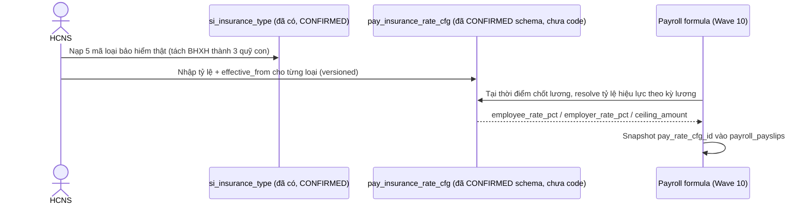

# SRS — Danh mục Loại bảo hiểm bắt buộc (Wave 5 / PO-HRM-CNTT-PAYROLL-CATALOG-PROGRAM-01)

| Meta | Value |
|---|---|
| work_item_id | BA-HRM-INSURANCE-TYPE-SRS-01 |
| ref_program | `docs/program/PO_HRM_CNTT_PAYROLL_CATALOG_PROGRAM.md` (Wave 5) |
| Nguồn nghiệp vụ | Sheet "Danh mục" STT 104-108 (bucket `LOẠI BẢO HIỂM`) trong `docs/brand-new-documents-20270801/SYNTHESIS-CNTT-PAYROLL-REAL-20260813.xlsx`; căn cứ NĐ 293/2025/NĐ-CP (lương tối thiểu vùng) trích dẫn tại QĐ 2A |
| Ngày | 2026-08-13 |
| Trạng thái | DRAFT — chờ sponsor + SA confirm trước khi sang TechSpec |

---

## 1. Mục đích (Purpose)

Chuẩn hoá 5 loại BHXH bắt buộc theo luật (Hưu trí-Tử tuất, Ốm đau-Thai sản, BHYT, BHTN, BHTNLĐ-BNN) kèm tỷ lệ đóng NSDLĐ/NLĐ, làm nền cho:
- Tính khấu trừ BHXH/BHYT/BHTN trên bảng lương (Wave 10 formula engine).
- Cơ chế **versioning theo hiệu lực** (`effective_date`) — vì tỷ lệ này do Nhà nước quy định, có thể thay đổi, KHÔNG được hardcode trong code hay catalog tĩnh.

**Phát hiện quan trọng (đọc code thật):**
1. Bảng catalog "Loại bảo hiểm" **đã tồn tại** — `public.si_insurance_type` (work item `PO-HRM-DYNAMIC-CONFIG-PLATFORM-SI-INS-CATALOG-BE-01`, DATA/BA/SA đều **CONFIRMED** ngày 2026-08-08). Starter hiện tại chỉ có 4 mã gộp (`BHXH/BHYT/BHTN/social`) — **KHÔNG khớp thực tế pháp luật**: BHXH thật ra tách thành 3 quỹ con với 3 tỷ lệ khác nhau (Hưu trí-Tử tuất, Ốm đau-Thai sản, TNLĐ-BNN), không phải 1 dòng "BHXH" duy nhất. Đây là gap thật cần sửa ở Wave 5, không phải tự bịa.
2. Bảng lưu **tỷ lệ đóng có versioning theo hiệu lực** cũng **đã CONFIRMED thiết kế sẵn** — `public.pay_insurance_rate_cfg` (`docs/program/specs/PO-HRM-SETTINGS-DEFAULTS-DATA-01.md` §3, CONFIRMED 2026-08-07, **Nest chưa code — chỉ mới xác nhận schema**) — có đủ cột `employee_rate_pct`, `employer_rate_pct`, `effective_from`, `effective_to`, `ceiling_amount`, `version`, `supersedes_id` — **đúng chính xác** cơ chế "versioning theo effective_date, không hardcode" mà yêu cầu Wave 5 mô tả. SRS này KHÔNG đề xuất bảng mới cho tỷ lệ — dùng đúng bảng đã CONFIRMED.

## 2. UC (Use Case)

**UC-HRM-CNTT-INSTYPE-01: Quản lý danh mục Loại bảo hiểm + tỷ lệ đóng theo hiệu lực**

| Actor | Mô tả |
|---|---|
| HCNS/HR Admin | CRUD `si_insurance_type` (5 mã thật); nhập/versioning tỷ lệ đóng qua `pay_insurance_rate_cfg` |
| Hệ thống Payroll (formula engine, Wave 10) | Đọc tỷ lệ hiệu lực tại kỳ lương (`effective_from`/`effective_to`) để tính khấu trừ |
| Hệ thống Hồ sơ BHXH nhân viên (`employee_insurances`) | Tham chiếu `insurance_type_key` khi đăng ký/enroll bảo hiểm cho từng nhân viên |

## 3. FR (Functional Requirements)

| Mã | Yêu cầu |
|---|---|
| FR-HRM-INSTYPE-01 | Nạp 5 mã loại bảo hiểm bắt buộc thật vào `si_insurance_type` (không tạo bảng mới, mở rộng/thay starter set gộp hiện có): `bh_httt` (Hưu trí-Tử tuất), `bh_odts` (Ốm đau-Thai sản), `bh_byt` (BHYT), `bh_btn` (BHTN), `bh_tnld_bnn` (BHTNLĐ-BNN). Đặt `is_statutory=true` cho cả 5 (cột đã có sẵn trên `si_insurance_type`, phân biệt với bảo hiểm thương mại — xem BR-03). |
| FR-HRM-INSTYPE-02 | Tỷ lệ đóng (NSDLĐ/NLĐ) của từng loại **KHÔNG lưu trên `si_insurance_type`** — lưu tại `pay_insurance_rate_cfg` (bảng đã CONFIRMED, tách riêng đúng theo thiết kế) — mỗi loại bảo hiểm ứng 1 dòng `pay_insurance_rate_cfg` với `insurance_type_key` tham chiếu tới `si_insurance_type`, `effective_from` = ngày hiệu lực thật (cần sponsor xác nhận — xem §5), `effective_to=NULL` (đang hiệu lực). |
| FR-HRM-INSTYPE-03 | Khi Nhà nước thay đổi tỷ lệ (VD nghị định mới), hệ thống KHÔNG sửa đè dòng cũ — tạo dòng mới với `effective_from` mới, `supersedes_id` trỏ dòng cũ, dòng cũ tự động hết hiệu lực (`effective_to`) — payroll đã chốt kỳ trước giữ nguyên `pay_rate_cfg_id` đã snapshot (đã có cơ chế `payroll_payslips` -> `pay_insurance_rate_cfg` snapshot). |
| FR-HRM-INSTYPE-04 | `bh_tnld_bnn` (TNLĐ-BNN) hiện chỉ có tỷ lệ NSDLĐ (0.5%), NLĐ không đóng — TechSpec/DATA cần xác nhận `employee_rate_pct` cho phép giá trị `0` một cách tường minh (không phải NULL ngầm, tránh nhầm "chưa cấu hình" với "NLĐ không đóng phần này") — đúng lưu ý V-13/BR-AMIS-SET-DEF-02 đã ghi "cấm silent 0%" nghĩa là 0% phải được LƯU RÕ, không phải mặc định thiếu dữ liệu. |
| FR-HRM-INSTYPE-05 | Bảo hiểm thương mại (Nhà bảo hiểm — nêu trong ARCH-01 §3 là "không có căn cứ nguồn trong Gửi P.CNTT") — **ngoài phạm vi Wave 5**, không nạp, không suy diễn (đã ghi ở Wave 12 HOLD trong chương trình). |

## 4. BR (Business Rules)

| Mã | Quy tắc |
|---|---|
| BR-HRM-INSTYPE-01 | KHÔNG tạo bảng catalog mới cho loại bảo hiểm — dùng đúng `si_insurance_type` đã CONFIRMED. KHÔNG tạo bảng tỷ lệ mới — dùng đúng `pay_insurance_rate_cfg` đã CONFIRMED (Nest hiện ABSENT — cần dev-be code theo đúng schema đã khoá, không tự thiết kế lại). |
| BR-HRM-INSTYPE-02 | `insurance_type_key` là open catalog (format-only) — 5 mã thật là khởi tạo, KHÔNG đóng cứng enum (BR-PLT-05); tenant có thể thêm loại bảo hiểm khác (thương mại) sau khi có dữ liệu. |
| BR-HRM-INSTYPE-03 | Tỷ lệ đóng là dữ liệu THEO LUẬT (không phải chính sách công ty tự đặt) — mọi thay đổi phải có căn cứ pháp lý (số hiệu nghị định/quyết định) ghi tại cột `notes` của `pay_insurance_rate_cfg`, KHÔNG được sửa trực tiếp không ghi nguồn. |
| BR-HRM-INSTYPE-04 | Không hard-delete loại bảo hiểm hay dòng tỷ lệ lịch sử — retire/`archived_at`, giữ nguyên cho hồ sơ enrollment/bảng lương lịch sử tham chiếu đúng (BR-PLT-04). |
| BR-HRM-INSTYPE-05 | `eligible_for_rate_cfg=true` cho cả 5 loại bắt buộc (cột đã có trên `si_insurance_type`) — gate cho phép tạo dòng `pay_insurance_rate_cfg` tương ứng. |

## 5. Dữ liệu gốc (SoT — trích Excel, đã verify trong phiên 2026-08-13)

| Mã | Tên hiển thị | NSDLĐ | NLĐ | Nguồn |
|---|---|---|---|---|
| `bh_httt` | BHXH — Hưu trí tử tuất (HT-TT) | 14% | 8% | Sheet BHXH (nhiều mảng) |
| `bh_odts` | BHXH — Ốm đau thai sản (ÔĐ-TS) | 3% | — | Sheet BHXH |
| `bh_byt` | BHYT | 3% | 1.5% | Sheet BHXH |
| `bh_btn` | BHTN | 1% | 1% | Sheet BHXH |
| `bh_tnld_bnn` | BHTNLĐ-BNN | 0.5% | — | Sheet BHXH |

**Ghi chú hiệu lực:** chưa có ngày hiệu lực (`effective_from`) tường minh trong dữ liệu đã trích — cần sponsor xác nhận mốc áp dụng thật (có thể theo NĐ 293/2025/NĐ-CP hoặc văn bản BHXH riêng, khác QĐ 2A) trước khi TechSpec nạp dòng đầu tiên vào `pay_insurance_rate_cfg` — **không tự suy diễn ngày**.

Nguồn đầy đủ: sheet "Danh mục" (STT 104-108) — file `SYNTHESIS-CNTT-PAYROLL-REAL-20260813.xlsx`. Excel là bản chính thức, SRS chỉ tham chiếu.

## 6. AC (Acceptance Criteria)

| Mã | Điều kiện PASS |
|---|---|
| AC-HRM-INSTYPE-01 | Danh mục "Loại bảo hiểm" hiển thị đúng 5 mã tách riêng (không gộp BHXH thành 1 dòng), khớp Excel SoT |
| AC-HRM-INSTYPE-02 | Mỗi loại có đúng 1 dòng `pay_insurance_rate_cfg` hiệu lực hiện tại, tỷ lệ khớp 100% bảng §5 (14%/8%, 3%/0%, 3%/1.5%, 1%/1%, 0.5%/0%) |
| AC-HRM-INSTYPE-03 | Tạo dòng tỷ lệ mới (giả lập thay đổi luật) → dòng cũ tự động có `effective_to`, không bị xoá, bảng lương đã chốt trước đó vẫn tham chiếu đúng tỷ lệ cũ qua `pay_rate_cfg_id` snapshot |
| AC-HRM-INSTYPE-04 | `bh_odts`/`bh_tnld_bnn` hiển thị rõ NLĐ = 0% (không phải "chưa cấu hình"/trống) |
| AC-HRM-INSTYPE-05 | Ngày hiệu lực (`effective_from`) thật đã được sponsor xác nhận bằng văn bản trước khi TechSpec khoá (không dùng ngày suy đoán) |

## 7. Diễn biến (Luồng chính)

## 8. Ngoài phạm vi (Out of scope, wave này)

- Dev-be code bảng `pay_insurance_rate_cfg` (Nest hiện ABSENT — thuộc TechSpec/BE wave riêng, schema đã khoá sẵn).
- Bảo hiểm thương mại (Nhà bảo hiểm) — HOLD theo Wave 12, chưa có nguồn dữ liệu.
- Công thức khấu trừ thật trong bảng lương (Wave 10 — formula engine).
- Trần đóng BHXH theo vùng (Q17 sheet Xác nhận — sponsor đã trả lời "có áp dụng, phải cho cấu hình" — thuộc TechSpec).

## 9. Bước kế tiếp

Sponsor xác nhận ngày hiệu lực thật (AC-05) → TechSpec (đối chiếu chính xác cột `pay_insurance_rate_cfg` đã CONFIRMED, không thiết kế lại) → API_DESIGN → UI_SCREEN_SPEC → Dev (BE dựng bảng `pay_insurance_rate_cfg` theo schema đã khoá + nạp 5 dòng `si_insurance_type` + 5 dòng tỷ lệ đầu).
