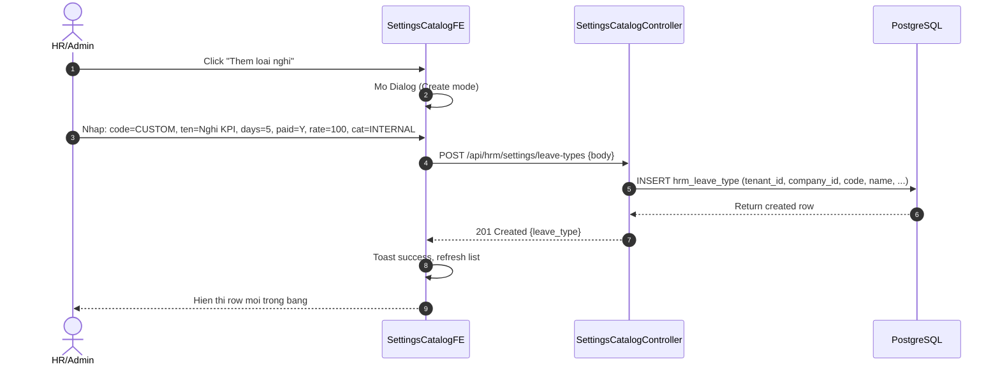

# SRS W12a -- Loai Nghi Day Du Theo Bo Luat Lao Dong 2019 + Man Cau Hinh Settings

| Meta | Value |
|---|---|
| work_item_id | BA-HRM-LEAVE-TYPE-SRS-01 |
| ref_program | PO_HRM_CNTT_PAYROLL_CATALOG_PROGRAM.md (Wave 12a) |
| Ngay | 2026-08-15 |
| Trang thai | DRAFT -- ready for BA review |
| Luu y | W12a tach rieng tu W12 (tuyen dung HOLD). Chi chay W12a + W12b.

---

## 1. Business Context

XeVN can trien khai payroll catalog chuan hoa cho cac tenant VN. Bo luat Lao dong 2019 (hieu luc tu 01/01/2021) quy dinh ro rang cac loai nghi, so ngay duoc nghi, muc luong/che do khi nghi. Hien he thong chua co danh muc loai nghi chuan -- can cau hinh day du de:
- Payroll tinh dung che do luong khi nghi (luong ngay cong, luong 1 ngay, bao hiem...)
- Attendance request workflow biet loai nghi nao can phe duyet, so ngay toi da
- Leave balance tracking dung so ngay duoc phep moi nam

Yeu cau: **Phai co man Settings (Catalog) de HR/Admin cau hinh loai nghri** -- pattern PAT-SETTINGS-CATALOG-01 (List + Dialog, khong form inline luon).

---

## 2. User Stories (3 UC)

| UC | Actor | Mo ta | Acceptance |
|---|---|---|---|
| UC-LV-01 | HR/Admin | Xem danh sach loai nghri trong Settings > Catalog > Loai nghi | Bang hien thi 8 cot: Ma, Ten, So ngay/nam, Co luong khong, Muc luong (%), Loai (BLD/Internal), Trang thai, Hanh dong |
| UC-LV-02 | HR/Admin | Them/Sua/Xoa loai nghri qua Dialog | Dialog co cac truong: Ma (unique, uppercase), Ten, So ngay mac dinh/nam, Co tinh luong (Y/N), Muc luong (%, 0-100), Loai (BLD/Internal), Ghi chu. Validate Ma unique per tenant. |
| UC-LV-03 | Employee/Manager | Xin nghi qua Attendance Request chon loai nghri tu Catalog | Dropdown loai nghi chi hien nhung loai status=active. So ngay xin khong vuot qua so ngay con lai (leave_balance). |

---

## 3. Functional Requirements (7 FR)

| ID | Requirement | Priority |
|---|---|---|
| FR-LV-01 | He thong cung cap 8 loai nghi mac dinh theo BLD 2019 (xem bang duoi) mac dinh active | Must |
| FR-LV-02 | Tenant co the them/sua/xoa loai nghi tuong ung (soft delete, khong xoa mac dinh BLD) | Must |
| FR-LV-03 | Moi loai nghi co thuoc tinh: ma, ten, so_ngay_mac_dinh_nam, co_tinh_luong (bool), muc_luong_phantram (0-100), loai_nghi (BLD|INTERNAL), ghi_chu | Must |
| FR-LV-04 | Leave balance tu dong khoi tao moi nam: so_ngay = so_ngay_mac_dinh_nam (co the ghi de per employee) | Must |
| FR-LV-05 | Attendance request validate: so_ngay_xin <= so_ngay_con_lai (leave_balance) | Must |
| FR-LV-06 | Payroll formula bien: lay duoc muc_luong_phantram cua loai nghi de tinh che do | Must |
| FR-LV-07 | Settings UI pattern PAT-SETTINGS-CATALOG-01: List page + Dialog (Create/Edit), Search, Filter trang thai, Pagination | Must |

---

## 4. Business Rules (6 BR)

| ID | Rule | Note |
|---|---|---|
| BR-LV-01 | 8 loai BLD mac dinh KHONG duoc hard delete -- chi deactivate (status=inactive) | Data integrity |
| BR-LV-02 | Ma loai nghi unique trong tenant (code unique per tenant_id) | DB constraint |
| BR-LV-03 | so_ngay_mac_dinh_nam > 0, muc_luong_phantram IN [0, 100] | Validation |
| BR-LV-04 | Loai nghi BLD: phan biet voi Internal (tenant tu tao) -- BLD khong duoc doi ma/ten mac dinh | Compliance |
| BR-LV-05 | Leave balance tinh theo nam luong (payroll year), reset 1/1 moi nam | Payroll alignment |
| BR-LV-06 | Neu loai nghi co_tinh_luong=false -> muc_luong_phantram bat buoc = 0 | Logic consistency |

---

## 5. Data Model (Bang moi: hrm_leave_type)

| Column | Type | Constraints | Note |
|---|---|---|---|
| id | uuid | PK, gen_random_uuid() | |
| tenant_id | uuid | NOT NULL, FK -> tenant.id | Multi-tenant |
| company_id | uuid | NOT NULL, FK -> company.id | |
| code | varchar(20) | NOT NULL, UNIQUE(tenant_id, code) | VD: ANNUAL, SICK, MATERNITY... |
| name | varchar(100) | NOT NULL | VD: Nghi phep nam, Nghi om, Nghi thai san... |
| default_days_per_year | int | NOT NULL, DEFAULT 0, CHECK > 0 | So ngay mac dinh/nam |
| is_paid | boolean | NOT NULL, DEFAULT true | Co tinh luong khong |
| pay_rate_percent | numeric(5,2) | NOT NULL, DEFAULT 100.00, CHECK (0-100) | Muc luong % |
| leave_category | varchar(20) | NOT NULL, CHECK IN ('LABOR_LAW','INTERNAL') | BLD hay Internal |
| description | text | NULLABLE | Ghi chu |
| status | varchar(20) | NOT NULL, DEFAULT 'active', CHECK IN ('active','inactive') | Soft delete |
| created_at | timestamptz | NOT NULL, DEFAULT now() | |
| updated_at | timestamptz | NOT NULL, DEFAULT now() | |
| deleted_at | timestamptz | NULLABLE | Soft delete |

Index: UNIQUE(tenant_id, code), INDEX(tenant_id, status)

---

## 6. 8 Loai Nghri Mac Dinh (BLD 2019) -- Seed Data

| Code | Ten (VI) | So ngay/nam | Co luong | Muc luong % | Loai | Dieu kien BLD 2019 |
|---|---|---|---|---|---|---|
| ANNUAL | Nghi phep nam | 12 | Y | 100 | LABOR_LAW | Dieu 113 -- 12 ngay/nam (>=12 thang lam) |
| SICK | Nghi om / con om | 30 | Y | 75 | LABOR_LAW | Dieu 137 -- 30 ngay/nam (BHXH tra), luong 75% |
| MATERNITY | Nghi thai san | 180 | Y | 100 | LABOR_LAW | Dieu 139 -- 6 thang (BHXH tra 100%) |
| PATERNITY | Nghi thai san cua vo/chong | 5-14 | Y | 100 | LABOR_LAW | Dieu 139 -- 5-14 ngay tuong ung |
| BEREAVEMENT_IMMEDIATE | Tang Chong/Vo/Con/Bo/Me | 3 | Y | 100 | LABOR_LAW | Dieu 138 -- 3 ngay |
| BEREAVEMENT_EXTENDED | Tang Ong/Ba/Anh/Chi/Em | 1 | Y | 100 | LABOR_LAW | Dieu 138 -- 1 ngay |
| MARRIAGE_SELF | Cuoi ban than | 3 | Y | 100 | LABOR_LAW | Dieu 138 -- 3 ngay |
| MARRIAGE_CHILD | Con cuoi | 1 | Y | 100 | LABOR_LAW | Dieu 138 -- 1 ngay |
| COMPENSATORY | Nghi bu OT | 0* | Y | 100 | LABOR_LAW | Dieu 106 -- Nghi bu = so gio OT / 8 (khong co han mac dinh) |

*Ghi chu: COMPENSATORY so ngay khong co dinh mac dinh -- tinh tu OT balance. default_days_per_year = 0, tinh dong boi payroll/attendance.

---

## 7. Acceptance Criteria (8 AC)

| AC | Test case |
|---|---|
| AC-LV-01 | GET /api/hrm/settings/leave-types -> 200, tra ve 8 loai mac dinh + custom cua tenant |
| AC-LV-02 | POST /api/hrm/settings/leave-types (ma=ANNUAL) -> 409 Conflict (ma trung BLD) |
| AC-LV-03 | POST custom leave (code=CUSTOM_01, is_paid=false, pay_rate=50) -> 400 (BR-LV-06) |
| AC-LV-04 | PUT deactivate ANNUAL -> 200, status=inactive, khong xoa record |
| AC-LV-05 | Employee xin nghi ANNUAL 13 ngay (chi co 12) -> 400 vuot balance |
| AC-LV-06 | Leave balance reset 1/1 moi nam -> so ngay = default_days_per_year |
| AC-LV-07 | Payroll formula doc duoc pay_rate_percent cua loai nghi de tinh tien nghi |
| AC-LV-08 | Settings UI: List + Dialog, search/filter, pagination, khong inline form |

---

## 8. Sequence Diagram (UC-LV-02: Tao loai nghi moi)

---

## 9. API Contract (5 endpoints)

| Method | Path | Desc | Body/Query | Response |
|---|---|---|---|---|
| GET | /api/hrm/settings/leave-types | List (paginated, search, filter) | query: page, limit, search, status, category | {data: LeaveType[], total, page, limit} |
| GET | /api/hrm/settings/leave-types/:id | Detail | param: id | LeaveType |
| POST | /api/hrm/settings/leave-types | Create | body: CreateLeaveTypeDto | 201 LeaveType |
| PUT | /api/hrm/settings/leave-types/:id | Update | param: id, body: UpdateLeaveTypeDto | 200 LeaveType |
| DELETE | /api/hrm/settings/leave-types/:id | Soft delete | param: id | 204 |

DTOs: CreateLeaveTypeDto (code, name, defaultDaysPerYear, isPaid, payRatePercent, leaveCategory, description), UpdateLeaveTypeDto (all optional except id).

---

## 10. UI Screen Spec (PAT-SETTINGS-CATALOG-01)

**File:** `UI-HRM-LEAVE-TYPE-SETUP-01.md` (separate file)

- Route: `/hr/settings/catalog/leave-types`
- Layout: Toolbar (search, filter status, filter category, "Them" button) + Table (8 columns) + Pagination
- Dialog Create/Edit: Fields as per DTO, validation inline
- Actions per row: Edit, Deactivate (not Delete for BLD), View detail
- No inline editing, no drag-drop -- strict List+Dialog

---

## 11. Dependencies & Impact

- **New table:** `hrm_leave_type` (1 migration)
- **Refs:** `hrm_leave_balance` (existing?) -> add FK leave_type_id; `hrm_attendance_request` -> add leave_type_id
- **Payroll formula:** New variable `leave_type_pay_rate` (from leave_type.pay_rate_percent) -- add to allowlist
- **Attendance catalog:** W7 Ca lam viec da co pattern Settings Catalog -- reuse component pattern

---

## 12. Exit Criteria (BA sign-off -> TechSpec)

- [ ] BA review 8 loai BLD chuan xac (so ngay, muc luong, dieu kien)
- [ ] BA xac nhan Settings UI pattern PAT-SETTINGS-CATALOG-01
- [ ] BA xac nhan leave_balance logic (reset nam, tinh theo leave_type)
- [ ] TechSpec drafted with exact migration + API + FE component spec
