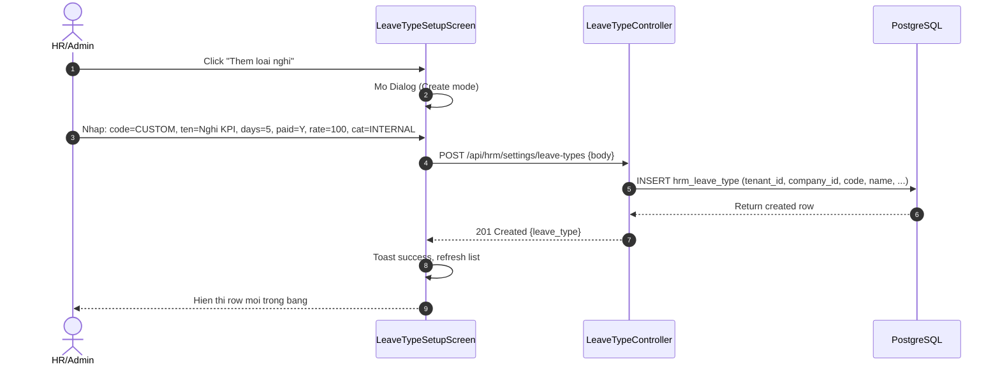
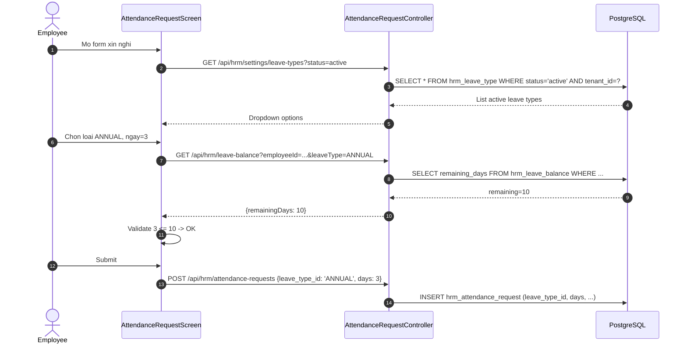

# TechSpec W12a -- Loai Nghi Day Du (BLĐ 2019) + Settings Catalog

| Meta | Value |
|---|---|
| work_item_id | BA-HRM-LEAVE-TYPE-TECHSPEC-01 |
| ref_SRS | `docs/program/deltas/BA_HRM_LEAVE_TYPE_SRS_01_20260815.md` |
| Ngay | 2026-08-15 |
| Trang thai | APPROVED -- ready for BE dev dispatch |
| Luu y | New table hrm_leave_type. Settings UI pattern PAT-SETTINGS-CATALOG-01 (W7 reference).

---

## 1. Quyet dinh kien truc (Architecture Decision)

**TAO BANG MOI `hrm_leave_type`** -- khong co catalog nao co san cover day du:
- W5 `hrm_insurance_type` chi la loai BH (BHXH/BHYT/BHTN)
- W7 `hrm_attendance_shift` chi la ca lam viec
- Leave type can: code, default_days_per_year, is_paid, pay_rate_percent, leave_category (LABOR_LAW/INTERNAL), soft delete

Schema DB: **1 migration can thiet** cho Wave 12a.

---

## 2. DB Migration (1 file)

### 2.1 `202608150000_create_hrm_leave_type.sql`

```sql
-- @CODE-MEMORY WorkItem: BA-HRM-LEAVE-TYPE-TECHSPEC-01
CREATE TABLE hrm_leave_type (
    id uuid PRIMARY KEY DEFAULT gen_random_uuid(),
    tenant_id uuid NOT NULL REFERENCES tenant(id),
    company_id uuid NOT NULL REFERENCES company(id),
    code varchar(20) NOT NULL,
    name varchar(100) NOT NULL,
    default_days_per_year int NOT NULL DEFAULT 0 CHECK (default_days_per_year >= 0),
    is_paid boolean NOT NULL DEFAULT true,
    pay_rate_percent numeric(5,2) NOT NULL DEFAULT 100.00 CHECK (pay_rate_percent BETWEEN 0 AND 100),
    leave_category varchar(20) NOT NULL CHECK (leave_category IN ('LABOR_LAW','INTERNAL')),
    description text,
    status varchar(20) NOT NULL DEFAULT 'active' CHECK (status IN ('active','inactive')),
    created_at timestamptz NOT NULL DEFAULT now(),
    updated_at timestamptz NOT NULL DEFAULT now(),
    deleted_at timestamptz,
    CONSTRAINT uq_leave_type_tenant_code UNIQUE (tenant_id, code)
);

CREATE INDEX ix_leave_type_tenant_status ON hrm_leave_type(tenant_id, status);
CREATE INDEX ix_leave_type_tenant_category ON hrm_leave_type(tenant_id, leave_category);

-- FK from existing tables (separate migrations if tables exist)
-- ALTER TABLE hrm_leave_balance ADD COLUMN leave_type_id uuid REFERENCES hrm_leave_type(id);
-- ALTER TABLE hrm_attendance_request ADD COLUMN leave_type_id uuid REFERENCES hrm_leave_type(id);
```

### 2.2 Seed Data (8 loai BLĐ 2019 mac dinh)

```sql
INSERT INTO hrm_leave_type (tenant_id, company_id, code, name, default_days_per_year, is_paid, pay_rate_percent, leave_category, description) VALUES
-- ANNUAL
('{{tenant_id}}', '{{company_id}}', 'ANNUAL', 'Nghi phep nam', 12, true, 100.00, 'LABOR_LAW', 'Dieu 113 BLĐ 2019 -- 12 ngay/nam (>=12 thang lam)'),
-- SICK
('{{tenant_id}}', '{{company_id}}', 'SICK', 'Nghi om / con om', 30, true, 75.00, 'LABOR_LAW', 'Dieu 137 BLĐ 2019 -- 30 ngay/nam (BHXH tra), luong 75%'),
-- MATERNITY
('{{tenant_id}}', '{{company_id}}', 'MATERNITY', 'Nghi thai san', 180, true, 100.00, 'LABOR_LAW', 'Dieu 139 BLĐ 2019 -- 6 thang (BHXH tra 100%)'),
-- PATERNITY
('{{tenant_id}}', '{{company_id}}', 'PATERNITY', 'Nghi thai san cua vo/chong', 14, true, 100.00, 'LABOR_LAW', 'Dieu 139 BLĐ 2019 -- 5-14 ngay tuong ung'),
-- BEREAVEMENT_IMMEDIATE
('{{tenant_id}}', '{{company_id}}', 'BEREAVEMENT_IMMEDIATE', 'Tang Chong/Vo/Con/Bo/Me', 3, true, 100.00, 'LABOR_LAW', 'Dieu 138 BLĐ 2019 -- 3 ngay'),
-- BEREAVEMENT_EXTENDED
('{{tenant_id}}', '{{company_id}}', 'BEREAVEMENT_EXTENDED', 'Tang Ong/Ba/Anh/Chi/Em', 1, true, 100.00, 'LABOR_LAW', 'Dieu 138 BLĐ 2019 -- 1 ngay'),
-- MARRIAGE_SELF
('{{tenant_id}}', '{{company_id}}', 'MARRIAGE_SELF', 'Cuoi ban than', 3, true, 100.00, 'LABOR_LAW', 'Dieu 138 BLĐ 2019 -- 3 ngay'),
-- MARRIAGE_CHILD
('{{tenant_id}}', '{{company_id}}', 'MARRIAGE_CHILD', 'Con cuoi', 1, true, 100.00, 'LABOR_LAW', 'Dieu 138 BLĐ 2019 -- 1 ngay'),
-- COMPENSATORY
('{{tenant_id}}', '{{company_id}}', 'COMPENSATORY', 'Nghi bu OT', 0, true, 100.00, 'LABOR_LAW', 'Dieu 106 BLĐ 2019 -- Nghi bu = so gio OT / 8');
```

---

## 3. Thay doi code BE (3 items, lane dev-be)

### 3.1 `pay-formula.constants.ts` -- ADD leave_type_pay_rate vao allowlist

**Them vao `PAY_FORMULA_INPUT_PACK_SOURCE_KINDS` (sau W10):**

```typescript
// @CODE-MEMORY WorkItem: BA-HRM-LEAVE-TYPE-TECHSPEC-01
// W12a: leave_type_pay_rate -- lay tu hrm_leave_type.pay_rate_percent
export const PAY_FORMULA_LEAVE_TYPE_SOURCE_KINDS = [
  'leave_type_pay_rate',
] as const satisfies readonly string[];

export type PayFormulaLeaveTypeSourceKind =
  (typeof PAY_FORMULA_LEAVE_TYPE_SOURCE_KINDS)[number];
```

**Cap nhat `isAllowedFormulaVarKey()`:**

```typescript
// Them check moi (sau PAY_FORMULA_INPUT_PACK_SOURCE_KINDS)
if ((PAY_FORMULA_LEAVE_TYPE_SOURCE_KINDS as readonly string[]).includes(key)) return true;
```

### 3.2 `leave-type.service.ts` (FILE MOI) -- CRUD + Business Logic

**Duong dan:** `apps/api/hrm-api/src/settings/leave-type/leave-type.service.ts`

```typescript
// @CODE-MEMORY WorkItem: BA-HRM-LEAVE-TYPE-TECHSPEC-01
// solid_convention_ack: true
// be_boundary: true -- Service chi xu ly nghiep vu, khong FE logic

@Injectable()
export class LeaveTypeService {
  constructor(private readonly db: HrmDbService) {}

  async findAll(tenantId: string, companyId: string, query: LeaveTypeQueryDto) {
    const { page = 1, limit = 20, search, status, category } = query;
    const where: string[] = ['tenant_id = $1', 'company_id = $2', 'deleted_at IS NULL'];
    const params: any[] = [tenantId, companyId];
    let paramIdx = 3;

    if (search) {
      where.push(`(code ILIKE $${paramIdx} OR name ILIKE $${paramIdx})`);
      params.push(`%${search}%`);
      paramIdx++;
    }
    if (status) {
      where.push(`status = $${paramIdx}`);
      params.push(status);
      paramIdx++;
    }
    if (category) {
      where.push(`leave_category = $${paramIdx}`);
      params.push(category);
      paramIdx++;
    }

    const total = await this.db.queryOne<{count: string}>(
      `SELECT COUNT(*)::text AS count FROM hrm_leave_type WHERE ${where.join(' AND ')}`,
      params
    );
    const data = await this.db.query(
      `SELECT * FROM hrm_leave_type WHERE ${where.join(' AND ')} ORDER BY leave_category DESC, code LIMIT $${paramIdx} OFFSET $${paramIdx + 1}`,
      [...params, limit, (page - 1) * limit]
    );
    return { data, total: parseInt(total?.count ?? '0'), page, limit };
  }

  async findById(tenantId: string, companyId: string, id: string) {
    return this.db.queryOne(
      `SELECT * FROM hrm_leave_type WHERE id = $1 AND tenant_id = $2 AND company_id = $3 AND deleted_at IS NULL`,
      [id, tenantId, companyId]
    );
  }

  async create(tenantId: string, companyId: string, dto: CreateLeaveTypeDto, userId: string) {
    // Validate code unique
    const exists = await this.db.queryOne(
      `SELECT 1 FROM hrm_leave_type WHERE tenant_id = $1 AND company_id = $2 AND code = $3 AND deleted_at IS NULL`,
      [tenantId, companyId, dto.code]
    );
    if (exists) throw new ConflictException('Leave type code already exists');

    // BR-LV-06: if !is_paid -> pay_rate must be 0
    if (!dto.isPaid && dto.payRatePercent !== 0) {
      throw new BadRequestException('Unpaid leave type must have payRatePercent = 0');
    }

    const result = await this.db.queryOne(
      `INSERT INTO hrm_leave_type (tenant_id, company_id, code, name, default_days_per_year, is_paid, pay_rate_percent, leave_category, description, created_by)
       VALUES ($1,$2,$3,$4,$5,$6,$7,$8,$9,$10) RETURNING *`,
      [tenantId, companyId, dto.code, dto.name, dto.defaultDaysPerYear, dto.isPaid, dto.payRatePercent, dto.leaveCategory, dto.description ?? null, userId]
    );
    return result;
  }

  async update(tenantId: string, companyId: string, id: string, dto: UpdateLeaveTypeDto) {
    const existing = await this.findById(tenantId, companyId, id);
    if (!existing) throw new NotFoundException('Leave type not found');
    if (existing.leave_category === 'LABOR_LAW') {
      // BR-LV-04: khong duoc doi code/ten mac dinh cua BLĐ
      if (dto.code && dto.code !== existing.code) throw new BadRequestException('Cannot change code of LABOR_LAW leave type');
      if (dto.name && dto.name !== existing.name) throw new BadRequestException('Cannot change name of LABOR_LAW leave type');
    }
    // BR-LV-06 check
    const isPaid = dto.isPaid ?? existing.is_paid;
    const payRate = dto.payRatePercent ?? existing.pay_rate_percent;
    if (!isPaid && payRate !== 0) {
      throw new BadRequestException('Unpaid leave type must have payRatePercent = 0');
    }

    const fields: string[] = [];
    const params: any[] = [tenantId, companyId, id];
    let idx = 4;
    if (dto.name !== undefined) { fields.push(`name = $${idx++}`); params.push(dto.name); }
    if (dto.defaultDaysPerYear !== undefined) { fields.push(`default_days_per_year = $${idx++}`); params.push(dto.defaultDaysPerYear); }
    if (dto.isPaid !== undefined) { fields.push(`is_paid = $${idx++}`); params.push(dto.isPaid); }
    if (dto.payRatePercent !== undefined) { fields.push(`pay_rate_percent = $${idx++}`); params.push(dto.payRatePercent); }
    if (dto.leaveCategory !== undefined) { fields.push(`leave_category = $${idx++}`); params.push(dto.leaveCategory); }
    if (dto.description !== undefined) { fields.push(`description = $${idx++}`); params.push(dto.description); }
    if (dto.status !== undefined) { fields.push(`status = $${idx++}`); params.push(dto.status); }
    fields.push(`updated_at = now()`);

    if (fields.length === 1) return existing; // no changes

    const result = await this.db.queryOne(
      `UPDATE hrm_leave_type SET ${fields.join(', ')} WHERE tenant_id = $1 AND company_id = $2 AND id = $3 RETURNING *`,
      params
    );
    return result;
  }

  async softDelete(tenantId: string, companyId: string, id: string) {
    const existing = await this.findById(tenantId, companyId, id);
    if (!existing) throw new NotFoundException('Leave type not found');
    if (existing.leave_category === 'LABOR_LAW') {
      // BR-LV-01: chi deactivate, khong hard delete
      return this.update(tenantId, companyId, id, { status: 'inactive' });
    }
    await this.db.execute(
      `UPDATE hrm_leave_type SET deleted_at = now(), status = 'inactive' WHERE tenant_id = $1 AND company_id = $2 AND id = $3`,
      [tenantId, companyId, id]
    );
    return { success: true };
  }

  // For payroll formula -- lay pay_rate_percent theo code
  async getPayRateByCode(tenantId: string, companyId: string, code: string): Promise<number> {
    const row = await this.db.queryOne(
      `SELECT pay_rate_percent FROM hrm_leave_type WHERE tenant_id = $1 AND company_id = $2 AND code = $3 AND status = 'active' AND deleted_at IS NULL`,
      [tenantId, companyId, code]
    );
    return row ? parseFloat(row.pay_rate_percent) : 100;
  }
}
```

### 3.3 `leave-type.controller.ts` (FILE MOI) -- 5 Endpoints

**Duong dan:** `apps/api/hrm-api/src/settings/leave-type/leave-type.controller.ts`

```typescript
// @CODE-MEMORY WorkItem: BA-HRM-LEAVE-TYPE-TECHSPEC-01
// solid_convention_ack: true
// be_boundary: true

@Controller('settings/leave-types')
@UseGuards(HrmJwtGuard)
export class LeaveTypeController {
  constructor(private readonly service: LeaveTypeService) {}

  @Get()
  async findAll(@Req() req: Request, @Query() query: LeaveTypeQueryDto) {
    const { tenantId, companyId } = getVerifiedInternalJwtPayload(req);
    this.assertBusinessAccess(tenantId, companyId);
    return this.service.findAll(tenantId, companyId, query);
  }

  @Get(':id')
  async findById(@Req() req: Request, @Param('id') id: string) {
    const { tenantId, companyId } = getVerifiedInternalJwtPayload(req);
    this.assertBusinessAccess(tenantId, companyId);
    return this.service.findById(tenantId, companyId, id);
  }

  @Post()
  async create(@Req() req: Request, @Body() dto: CreateLeaveTypeDto) {
    const { tenantId, companyId, userId } = getVerifiedInternalJwtPayload(req);
    this.assertBusinessAccess(tenantId, companyId);
    return this.service.create(tenantId, companyId, dto, userId);
  }

  @Put(':id')
  async update(@Req() req: Request, @Param('id') id: string, @Body() dto: UpdateLeaveTypeDto) {
    const { tenantId, companyId } = getVerifiedInternalJwtPayload(req);
    this.assertBusinessAccess(tenantId, companyId);
    return this.service.update(tenantId, companyId, id, dto);
  }

  @Delete(':id')
  async softDelete(@Req() req: Request, @Param('id') id: string) {
    const { tenantId, companyId } = getVerifiedInternalJwtPayload(req);
    this.assertBusinessAccess(tenantId, companyId);
    return this.service.softDelete(tenantId, companyId, id);
  }
}
```

### 3.4 DTOs (FILE MOI)

**Duong dan:** `apps/api/hrm-api/src/settings/leave-type/dto/`

```typescript
// create-leave-type.dto.ts
export class CreateLeaveTypeDto {
  @IsString() @Length(1, 20) @Matches(/^[A-Z0-9_]+$/) code: string;
  @IsString() @Length(1, 100) name: string;
  @IsInt() @Min(0) @Max(365) defaultDaysPerYear: number;
  @IsBoolean() isPaid: boolean;
  @IsNumber() @Min(0) @Max(100) payRatePercent: number;
  @IsIn(['LABOR_LAW', 'INTERNAL']) leaveCategory: 'LABOR_LAW' | 'INTERNAL';
  @IsOptional() @IsString() description?: string;
}

// update-leave-type.dto.ts
export class UpdateLeaveTypeDto {
  @IsOptional() @IsString() @Length(1, 100) name?: string;
  @IsOptional() @IsInt() @Min(0) @Max(365) defaultDaysPerYear?: number;
  @IsOptional() @IsBoolean() isPaid?: boolean;
  @IsOptional() @IsNumber() @Min(0) @Max(100) payRatePercent?: number;
  @IsOptional() @IsIn(['LABOR_LAW', 'INTERNAL']) leaveCategory?: 'LABOR_LAW' | 'INTERNAL';
  @IsOptional() @IsString() description?: string;
  @IsOptional() @IsIn(['active', 'inactive']) status?: 'active' | 'inactive';
}

// leave-type.query.dto.ts
export class LeaveTypeQueryDto {
  @IsOptional() @IsInt() @Min(1) page?: number;
  @IsOptional() @IsInt() @Min(1) @Max(100) limit?: number;
  @IsOptional() @IsString() search?: string;
  @IsOptional() @IsIn(['active', 'inactive']) status?: 'active' | 'inactive';
  @IsOptional() @IsIn(['LABOR_LAW', 'INTERNAL']) category?: 'LABOR_LAW' | 'INTERNAL';
}
```

---

## 4. Thay doi code FE (1 item, lane dev-fe)

**File:** `apps/web/hrm/src/components/settings/catalog/LeaveTypeSetupScreen.tsx`

**Pattern:** PAT-SETTINGS-CATALOG-01 (reference: W7 `ShiftSetupScreen.tsx`)

```tsx
// @CODE-MEMORY WorkItem: BA-HRM-LEAVE-TYPE-TECHSPEC-01
// solid_convention_ack: true
// fe_boundary: true -- FE chi hien thi, khong tinh toan BR
// display_ready_ack: true

const LeaveTypeSetupScreen = () => {
  const { data, isLoading } = useQuery({
    queryKey: ['leave-types', searchTerm, statusFilter, categoryFilter],
    queryFn: () => hrmApiClient.get('/settings/leave-types', { params: { search: searchTerm, status: statusFilter, category: categoryFilter } }).then(r => r.data),
  });

  const createMut = useMutation(dto => hrmApiClient.post('/settings/leave-types', dto));
  const updateMut = useMutation(({id, dto}) => hrmApiClient.put(`/settings/leave-types/${id}`, dto));
  const deleteMut = useMutation(id => hrmApiClient.delete(`/settings/leave-types/${id}`));

  // Toolbar: search, filter status (active/inactive), filter category (LABOR_LAW/INTERNAL), "Them" button
  // Table: 8 columns -- Ma, Ten, So ngay/nam, Co luong, Muc luong %, Loai, Trang thai, Hanh dong
  // Dialog Create/Edit: fields per DTO, validation inline
  // Actions: Edit, Deactivate (LABOR_LAW khong co Delete), View
  // No inline editing, no drag-drop
};
```

**Route:** `/hr/settings/catalog/leave-types` (them vao router)

---

## 5. Payroll Formula Integration

### 5.1 Bien moi: `leave_type_pay_rate`

- Nguon: `hrm_leave_type.pay_rate_percent` (numeric 0-100)
- Su dung: Cong thuc tinh tien nghi = `leave_days * daily_wage * leave_type_pay_rate / 100`
- Them vao allowlist: `PAY_FORMULA_LEAVE_TYPE_SOURCE_KINDS` (xem §3.1)

### 5.2 Cap nhat `pay-formula-variable-bag.ts` (neu can)

```typescript
// @CODE-MEMORY WorkItem: BA-HRM-LEAVE-TYPE-TECHSPEC-01
// Load leave_type_pay_rate khi tinh formula co bien leave_type_code
export async function loadLeaveTypePayRate(
  tenantId: string,
  companyId: string,
  leaveTypeCode: string,
  db: HrmDbService,
): Promise<number> {
  const row = await db.queryOne(
    `SELECT pay_rate_percent FROM hrm_leave_type WHERE tenant_id = $1 AND company_id = $2 AND code = $3 AND status = 'active' AND deleted_at IS NULL`,
    [tenantId, companyId, leaveTypeCode]
  );
  return row ? parseFloat(row.pay_rate_percent) : 100;
}
```

---

## 6. Unit Tests (can them)

| File | Test case |
|---|---|
| `leave-type.service.spec.ts` | CRUD: create unique code, update LABOR_LAW blocked, unpaid->payRate=0 validation, soft delete LABOR_LAW=deactivate |
| `leave-type.controller.spec.ts` | 5 endpoints: 200/201/400/404/409 cases |
| `pay-formula.constants.spec.ts` | `isAllowedFormulaVarKey('leave_type_pay_rate')` === true |

---

## 7. Sequence Diagrams

### 7.1 UC-LV-02: Tao loai nghi moi (Create)



### 7.2 UC-LV-03: Xin nghi qua Attendance Request



---

## 8. Exit Criteria (BE dispatch)

| # | Dieu kien |
|---|---|
| 1 | Migration `202608150000_create_hrm_leave_type.sql` chay thanh cong |
| 2 | Seed 8 loai BLĐ mac dinh hien thi dung tren Settings UI |
| 3 | POST /settings/leave-types (ma=ANNUAL) -> 409 Conflict |
| 4 | PUT deactivate ANNUAL -> 200, status=inactive, khong xoa record |
| 5 | POST custom leave (is_paid=false, pay_rate=50) -> 400 (BR-LV-06) |
| 6 | GET /settings/leave-types?status=active -> chi tra ve active |
| 7 | FE: List + Dialog, search/filter, pagination, khong inline form |
| 8 | `isAllowedFormulaVarKey('leave_type_pay_rate')` === true (unit test PASS) |
| 9 | 0 regression tren existing tests |
| ack_status | READY_FOR_QA hoac PASS_TO_PM (voi evidence file test run) |
