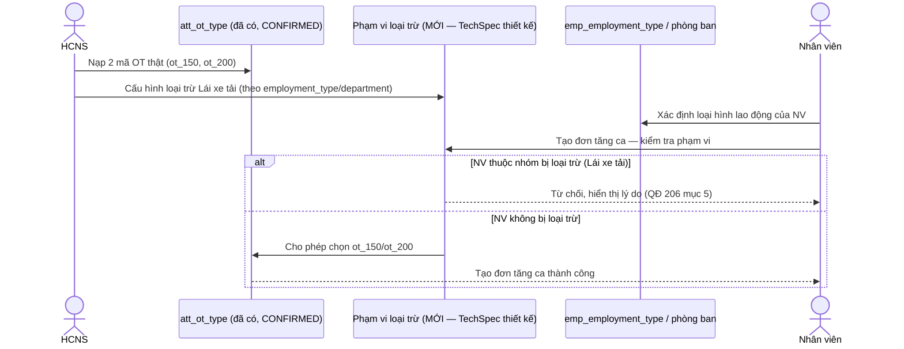

# SRS — Danh mục Loại tăng ca (OT) + Ngoại lệ theo phạm vi (Wave 6 / PO-HRM-CNTT-PAYROLL-CATALOG-PROGRAM-01)

| Meta | Value |
|---|---|
| work_item_id | BA-HRM-OVERTIME-TYPE-SRS-01 |
| ref_program | `docs/program/PO_HRM_CNTT_PAYROLL_CATALOG_PROGRAM.md` (Wave 6, domain ghi trong chương trình: `hrm_attendance_overtime`) |
| Nguồn nghiệp vụ | Sheet "Danh mục" STT 101-103 (bucket `LOẠI OT`) trong `docs/brand-new-documents-20270801/SYNTHESIS-CNTT-PAYROLL-REAL-20260813.xlsx`; QĐ 206/2026 mục 5 (Lái xe tải) |
| Ngày | 2026-08-13 |
| Trạng thái | DRAFT — chờ sponsor + SA confirm (có 1 xung đột đặt tên domain cần chốt, xem §3 FR-01) trước khi sang TechSpec |

---

## 1. Mục đích (Purpose)

Chuẩn hoá 3 loại tăng ca thật (OT 150% ngày thường, OT 200% ngày lễ, "Không áp dụng OT" cho Lái xe tải) và xử lý đúng case ngoại lệ: Lái xe tải KHÔNG hưởng OT theo QĐ 206/2026 mục 5 — vì thu nhập của họ tính theo doanh thu/sản lượng, không theo giờ công. Đây là ngoại lệ theo **phạm vi loại hình lao động/phòng ban**, không phải toàn công ty — cần cơ chế loại trừ có phạm vi (scope), không phải xoá loại OT khỏi hệ thống.

**Phát hiện quan trọng (đọc code thật):** bảng catalog "Loại tăng ca" **đã tồn tại** — `public.att_ot_type` (work item `PO-HRM-DYNAMIC-CONFIG-PLATFORM-OT-TYPE-CATALOG-BE-01`, DATA/BA/SA đều **CONFIRMED** ngày 2026-08-08). Đây là open catalog per-company với cột `default_coeff` (hệ số hiển thị, KHÔNG phải công thức lương LIVE), starter mẫu `weekday/weekend/holiday` (hệ số gợi ý 1.5/2.0/3.0). **Không có** cột nào cho phép giới hạn 1 loại OT chỉ áp dụng với 1 nhóm loại hình lao động/phòng ban cụ thể — đây là **gap thật** cần FR mới (xem §3), không phải dựng lại bảng từ đầu.

## 2. UC (Use Case)

**UC-HRM-CNTT-OTTYPE-01: Quản lý danh mục Loại tăng ca + loại trừ theo phạm vi**

| Actor | Mô tả |
|---|---|
| HCNS/HR Admin | CRUD `att_ot_type` (2 mã hệ số thật: 150%/200%); cấu hình phạm vi áp dụng/loại trừ theo loại hình lao động, phòng ban |
| NV/QL (`OvertimeRequestTab`) | Khi tạo đơn tăng ca, chỉ thấy loại OT phù hợp phạm vi của mình — Lái xe tải KHÔNG thấy picker OT (hoặc thấy nhưng bị chặn tạo) |
| Hệ thống Attendance (`attendance-requests.service.ts`) | Validate `overtime_type` ∈ catalog hiệu lực VÀ ∈ phạm vi áp dụng của nhân viên tạo đơn |

## 3. FR (Functional Requirements)

| Mã | Yêu cầu |
|---|---|
| FR-HRM-OTTYPE-01 | **Xung đột đặt tên domain cần chốt:** chương trình ghi domain "mới" `hrm_attendance_overtime`, nhưng bảng vật lý thật đã CONFIRMED là `att_ot_type` (cùng khái niệm). Khuyến nghị BA: coi `hrm_attendance_overtime` là **bí danh tài liệu** của bảng `att_ot_type` hiện có, KHÔNG tạo bảng thứ hai song song (tránh 2 nguồn sự thật cho "loại tăng ca") — cần SA/PM xác nhận trước TechSpec. |
| FR-HRM-OTTYPE-02 | Nạp/thay 2 mã hệ số OT thật vào `att_ot_type` (thay starter `weekday/weekend/holiday` không khớp thuật ngữ công ty): `ot_150` (Tăng ca ngày thường, `default_coeff=1.5`), `ot_200` (Tăng ca ngày lễ, `default_coeff=2.0`) — theo đúng cột `default_coeff` đã có, hiểu là hệ số hiển thị gợi ý, KHÔNG phải công thức lương LIVE (Wave 10 phụ trách nối công thức thật). |
| FR-HRM-OTTYPE-03 | `ot_khong_ad_lxtai` (Không áp dụng OT — Lái xe tải, QĐ 206 mục 5) **không phải 1 dòng catalog để chọn** — là **quy tắc loại trừ** (population không được tạo đơn tăng ca) áp cho nhóm Lái xe tải. TechSpec cần thiết kế cơ chế phạm vi mới — ví dụ mở rộng `att_ot_type` với cột `applicable_scope_json` (danh sách `employment_type_key`/`department_id` được phép dùng loại OT đó; rỗng = áp dụng toàn công ty) hoặc bảng phụ `att_ot_type_scope` — đây là quyết định schema thuộc DATA/SA, BA chỉ nêu yêu cầu nghiệp vụ: hệ thống phải chặn được tạo đơn OT cho 1 nhóm nhân sự cụ thể theo loại hình lao động/phòng ban, không phải toàn công ty. |
| FR-HRM-OTTYPE-04 | Phạm vi loại trừ Lái xe tải xác định qua `emp_employment_type`/phòng ban (Wave 4/W3), KHÔNG hardcode theo tên chức danh dạng chuỗi tự do — tránh lỗi khi đổi tên chức danh. |
| FR-HRM-OTTYPE-05 | Khi NV thuộc nhóm bị loại trừ cố tạo đơn tăng ca → hệ thống trả lỗi rõ ràng (không phải danh sách rỗng gây hiểu nhầm lỗi hệ thống) — TechSpec định nghĩa mã lỗi cụ thể (gợi ý theo đúng khuôn mẫu đã có `HRM-ATT-OT-TYPE-KEY`). |

## 4. BR (Business Rules)

| Mã | Quy tắc |
|---|---|
| BR-HRM-OTTYPE-01 | KHÔNG tạo bảng catalog "loại tăng ca" thứ 2 — dùng đúng `att_ot_type` đã CONFIRMED; domain name `hrm_attendance_overtime` trong chương trình chỉ là tài liệu tham chiếu tới bảng này (chờ SA xác nhận FR-01). |
| BR-HRM-OTTYPE-02 | `code` (OT-type key) là open catalog (format-only) — 2 mã thật là khởi tạo, KHÔNG đóng cứng enum 150/200 (BR-PLT-05) — tenant có thể thêm loại OT khác (VD ca đêm) sau. |
| BR-HRM-OTTYPE-03 | `default_coeff` là metadata hiển thị/gợi ý, **KHÔNG** phải công thức lương chính thức — cấm mọi tuyên bố "đã nối payroll formula LIVE" ở wave này (đúng khoá `L-ATT-OT-10` đã có trong code). |
| BR-HRM-OTTYPE-04 | Loại trừ Lái xe tải là ngoại lệ theo **phạm vi** (employment_type/department), KHÔNG phải xoá/ẩn loại OT khỏi toàn hệ thống — các nhóm khác vẫn dùng OT bình thường. |
| BR-HRM-OTTYPE-05 | Không hard-delete loại OT — retire (`status=inactive` + `archived_at`), giữ lịch sử `overtime_requests` cũ tham chiếu đúng loại (BR-PLT-04, đã có trong code hiện tại). |

## 5. Dữ liệu gốc (SoT — trích Excel, đã verify trong phiên 2026-08-13)

| Mã | Tên hiển thị | Mảng nghiệp vụ | Nguồn | Ghi chú |
|---|---|---|---|---|
| `ot_150` | OT 150% (ngày thường) | Chung | Nhiều sheet BCC | |
| `ot_200` | OT 200% (ngày lễ) | Chung | Nhiều sheet BCC | |
| `ot_khong_ad_lxtai` | Không áp dụng OT (Lái xe tải) | Mảng 5 (LX Tải) | QĐ 206 mục 5 | Thu nhập tính theo doanh thu, không có OT — là quy tắc loại trừ, không phải lựa chọn OT |

Nguồn đầy đủ: sheet "Danh mục" (STT 101-103) — file `SYNTHESIS-CNTT-PAYROLL-REAL-20260813.xlsx`. Excel là bản chính thức, SRS chỉ tham chiếu.

## 6. AC (Acceptance Criteria)

| Mã | Điều kiện PASS |
|---|---|
| AC-HRM-OTTYPE-01 | Picker "Loại tăng ca" hiển thị đúng `ot_150` (150%) và `ot_200` (200%), khớp Excel SoT — không còn starter `weekday/weekend/holiday` gây nhầm |
| AC-HRM-OTTYPE-02 | Nhân viên nhóm Lái xe tải (theo `emp_employment_type`/phòng ban đã cấu hình loại trừ) tạo đơn tăng ca → hệ thống chặn, hiển thị lý do rõ ràng (không phải lỗi hệ thống chung chung) |
| AC-HRM-OTTYPE-03 | Nhân viên nhóm khác (không thuộc phạm vi loại trừ) vẫn tạo đơn tăng ca bình thường, không bị ảnh hưởng |
| AC-HRM-OTTYPE-04 | Câu hỏi FR-01 (bí danh domain vs bảng thứ 2) có câu trả lời SA ghi lại bằng văn bản trước khi TechSpec khoá |
| AC-HRM-OTTYPE-05 | Retire 1 loại OT đang có đơn tăng ca lịch sử tham chiếu → đơn cũ vẫn hiển thị đúng tên loại, không vỡ liên kết |

## 7. Diễn biến (Luồng chính)

## 8. Ngoài phạm vi (Out of scope, wave này)

- Nối `default_coeff` vào công thức tính lương OT thật (Wave 10 — formula engine, đã HOLD sẵn trong code hiện tại).
- Thiết kế schema chi tiết cột/bảng phạm vi loại trừ (`applicable_scope_json` hay bảng phụ) — thuộc TechSpec/DATA.
- Các ngoại lệ OT khác ngoài Lái xe tải (nếu có, chưa thấy căn cứ nguồn trong dữ liệu đã trích).

## 9. Bước kế tiếp

Sponsor/SA trả lời FR-01 (bí danh domain) → TechSpec (thiết kế cột/bảng phạm vi loại trừ mở rộng `att_ot_type`, định nghĩa mã lỗi khi bị chặn) → API_DESIGN → UI_SCREEN_SPEC → Dev.
