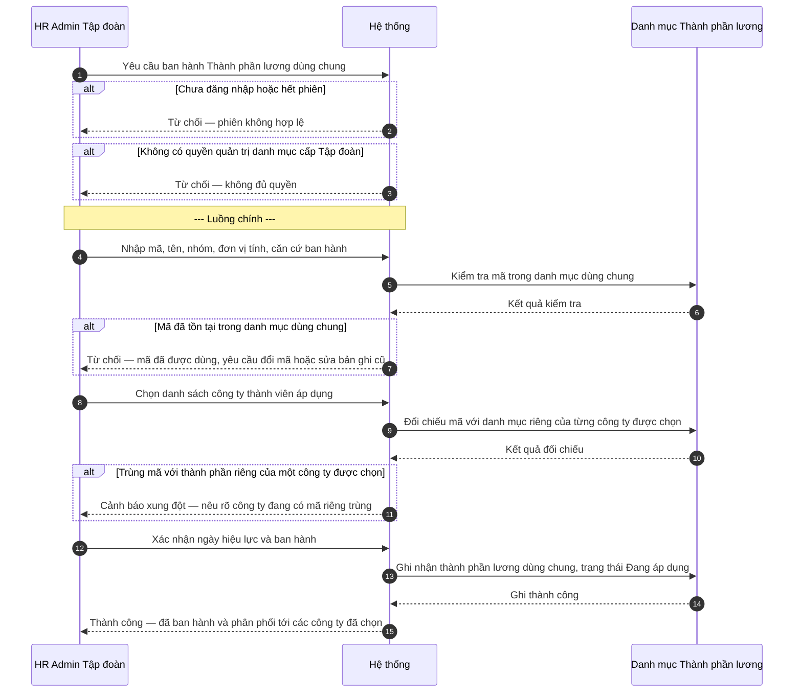
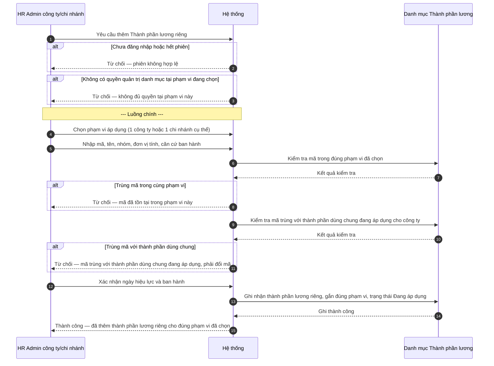
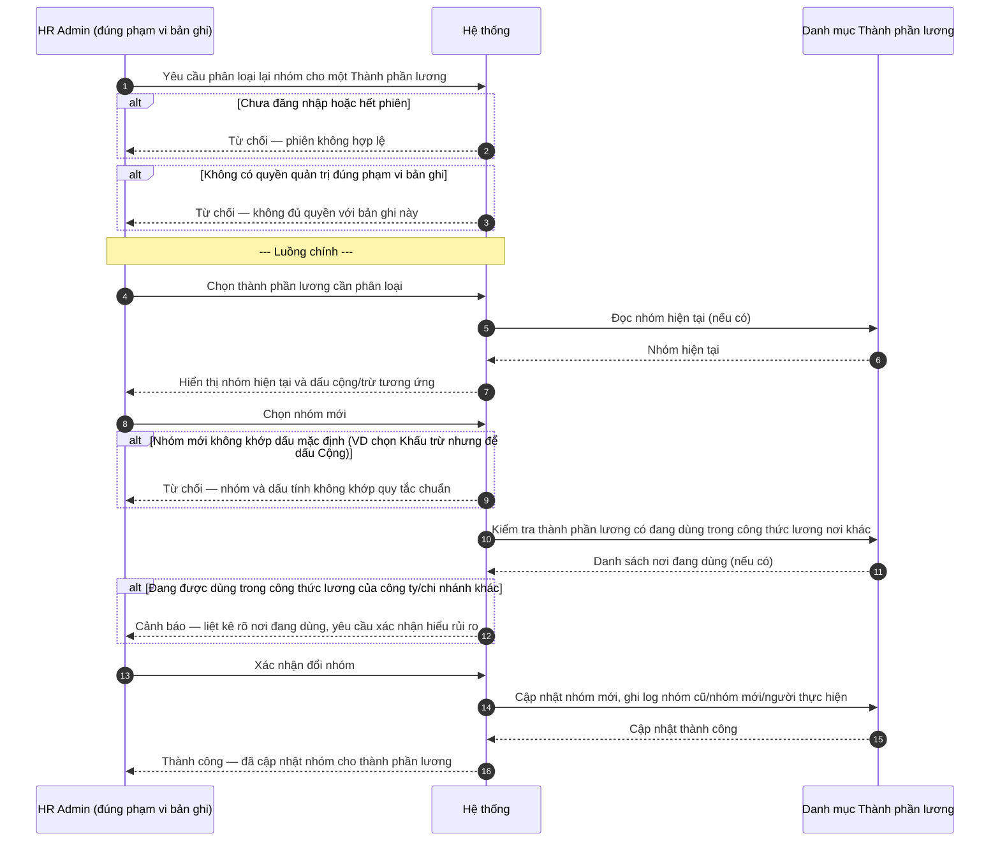
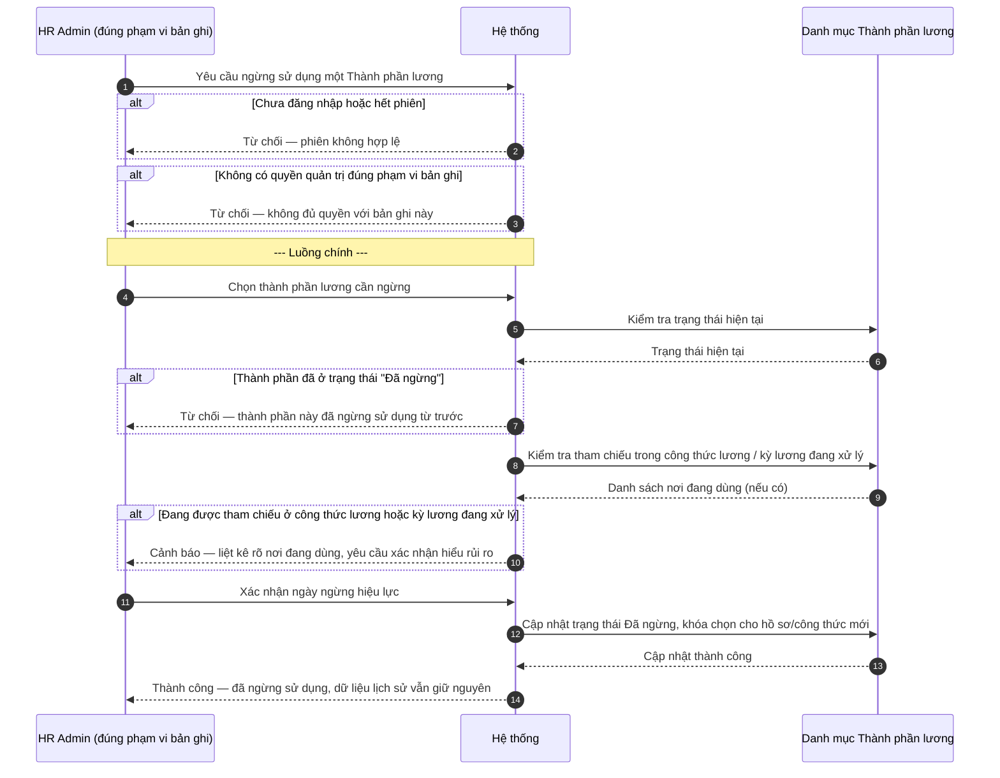

# SRS — Danh mục Thành phần lương & Phụ cấp/Thưởng/Khấu trừ (Wave 8 + Wave 9)

| Mã tài liệu | BA-HRM-PAYROLL-COMPONENT-SRS-01 |
| --- | --- |
| Chương trình | "CNTT Payroll Catalog" — Wave 8 (Thành phần lương, 24 mục đề xuất) + Wave 9 (Phụ cấp 11 mục, Thưởng 4 mục, Khấu trừ 6 mục đề xuất) |
| Nguồn nghiệp vụ | Sheet "Danh mục" (108 mục đề xuất, trích từ 30 văn bản chính sách lương thật) trong `docs/brand-new-documents-20270801/SYNTHESIS-CNTT-PAYROLL-REAL-20260813.xlsx` |
| Ngày | 2026-08-13 |
| Trạng thái | DRAFT — chờ sponsor duyệt (cột "Duyệt Y/N/?" trên sheet Danh mục hiện còn để trống cho từng mục) trước khi nạp dữ liệu chính thức; SRS này mô tả cơ chế quản lý danh mục, không tự chốt danh sách mã cuối cùng |

---

## 1. Giới thiệu

### 1.1. Mục đích

Tài liệu này mô tả yêu cầu nghiệp vụ cho việc xây dựng danh mục "Thành phần lương" dùng chung trong toàn bộ hệ thống nhân sự — bao gồm cả nhóm thu nhập (thu nhập cố định, thu nhập theo sản lượng/vận hành) và nhóm điều chỉnh lương (phụ cấp, thưởng, khấu trừ). Danh mục này là nền tảng để sau này hệ thống tính đúng bảng lương cho từng nhân sự, nhưng bản thân tài liệu này **chỉ mô tả việc quản lý danh mục tên/mã** — chưa mô tả cách tính số tiền cụ thể.

### 1.2. Phạm vi

- **Trong phạm vi:** tạo, phân loại, thay đổi phạm vi áp dụng, ngừng sử dụng các thành phần lương (bao gồm cả thu nhập, phụ cấp, thưởng, khấu trừ) ở 2 cấp — dùng chung toàn Tập đoàn và dùng riêng theo từng công ty/chi nhánh.
- **Ngoài phạm vi:** công thức tính lương (cách nhân, cộng, trừ các thành phần lương với nhau để ra lương thực nhận), tích hợp dữ liệu sản lượng/vận hành thực tế (số cuộc gọi, số lượt, doanh thu...) vào công thức, in phiếu lương. Các nội dung này thuộc giai đoạn triển khai tiếp theo của chương trình, do đội phụ trách công thức lương xử lý riêng.

### 1.3. Đối tượng đọc

Ban lãnh đạo phê duyệt chính sách lương, phòng Hành chính — Nhân sự (HCNS) các công ty thành viên, đội thiết kế nghiệp vụ và kỹ thuật tiếp nhận tài liệu này để thiết kế chi tiết ở giai đoạn sau.

---

## 2. Mô tả tổng quan

### 2.1. Bối cảnh nghiệp vụ

Trước đây hệ thống mới có khái niệm thành phần lương dùng chung, áp dụng đồng loạt cho nhiều công ty thành viên (tương tự mô hình danh mục dùng chung đã triển khai cho các nhóm dữ liệu nền tảng khác). Thực tế rà soát chính sách lương của các mảng nghiệp vụ (Điều phối hàng hóa, Tổng đài hành khách, Lái xe tuyến, Lái xe tải, Văn phòng tỉnh) cho thấy:

- Phần lớn các khoản thu nhập thật không phải là "lương cố định theo giờ công" mà là thu nhập tính theo **sản lượng và kết quả vận hành** — ví dụ: lương theo cuộc gọi (Tổng đài), đơn giá theo lượt (Lái xe tuyến), hoa hồng theo doanh thu hàng gửi/hàng nhận (Điều phối hàng hóa), quỹ phục vụ theo số khách (Văn phòng tỉnh). Đây là nhóm khác hẳn với thu nhập cố định theo giờ công/lương cơ bản.
- Bên cạnh thành phần dùng chung, nhiều công ty/chi nhánh có thành phần lương **chỉ áp dụng riêng cho mình** — ví dụ đơn giá lượt của một chi nhánh khác hẳn đơn giá lượt của chi nhánh khác, dù cùng tên gọi "lương lượt". Nếu gộp chung một mã sẽ dẫn đến áp sai mức cho các chi nhánh khác.
- Ngoài thu nhập, còn có phụ cấp (điện thoại, xăng xe, trang phục, đi lại, nhà ở, ăn, xa nhà, hướng dẫn khách hàng dùng ứng dụng...), thưởng (theo chỉ số công việc, chuyên cần, doanh thu, nỗ lực nhóm...), và khấu trừ (giảm trừ chi phí sửa chữa phương tiện, khấu trừ tạm ứng lương kỳ trước...). Các khoản này cần được phân biệt rõ với thu nhập để sau này cộng/trừ đúng khi ra tổng lương.

Wave 8 giải quyết danh mục thành phần **thu nhập** (cố định + theo sản lượng/vận hành); Wave 9 mở rộng cùng cơ chế danh mục cho **phụ cấp, thưởng, khấu trừ**. Cả hai wave dùng chung một cơ chế quản lý danh mục (cùng bộ Yêu cầu chức năng dưới đây), chỉ khác ở nhóm dữ liệu được nạp và thời điểm triển khai.

### 2.2. Luồng tổng thể (E2E spine)

| Bước | Yêu cầu chức năng | Actor chính | Kết quả mang sang bước sau |
|---|---|---|---|
| 1 | UC-HRM-PAYCAT-01 — Ban hành Thành phần lương chung | HR Admin cấp Tập đoàn | Danh mục dùng chung, phân phối tới các công ty được chọn |
| 2 | UC-HRM-PAYCAT-02 — Thêm Thành phần lương riêng theo công ty/chi nhánh | HR Admin công ty/chi nhánh | Danh mục riêng, chỉ hiển thị trong phạm vi đã chọn |
| 3 | UC-HRM-PAYCAT-03 — Phân loại Thành phần lương theo nhóm | HR Admin (đúng phạm vi bản ghi) | Mỗi thành phần lương có nhóm chính thức, sẵn sàng cho bước tính lương sau này sử dụng đúng dấu cộng/trừ |
| 4 | UC-HRM-PAYCAT-04 — Ngừng sử dụng Thành phần lương | HR Admin (đúng phạm vi bản ghi) | Thành phần chuyển "Đã ngừng", không chọn được cho hồ sơ mới, dữ liệu lịch sử vẫn nguyên vẹn |
| 5 (ngoài phạm vi) | Thiết kế công thức tính lương (Wave 10) | Đội phụ trách công thức lương | Dùng danh mục đã có ở bước 1-4 làm biến đầu vào |

### 2.3. Phân nhóm Thành phần lương (áp dụng chung Wave 8 + Wave 9)

| Nhóm | Ý nghĩa | Dấu khi tính tổng lương | Ví dụ thật từ sheet Danh mục đề xuất (minh họa nguồn gốc, đang chờ sponsor duyệt từng mục, không phải danh sách mã chính thức) |
|---|---|---|---|
| Thu nhập cố định | Khoản trả cố định theo tháng/ngạch bậc, không phụ thuộc sản lượng | Cộng | Lương cứng theo tải trọng (Lái xe tải), Lương theo hệ số chức danh (Văn phòng tỉnh), Lương cơ bản P1+P2 (Văn phòng Hà Nội) |
| Thu nhập theo sản lượng/vận hành | Khoản trả biến động theo kết quả công việc thực tế | Cộng | Lương KPI theo ngày công (Điều phối hàng hóa), Lương doanh thu hàng gửi/hàng nhận, Lương cuộc nghe và Lương hợp đồng (Tổng đài hành khách), Lương lượt và Lương chất lượng dịch vụ (Lái xe tuyến) |
| Phụ cấp | Khoản hỗ trợ điều kiện làm việc, không gắn trực tiếp kết quả | Cộng | Phụ cấp điện thoại/xăng xe/trang phục/đi lại/nhà ở/tiền ăn theo nhóm chức danh, phụ cấp ca đêm/tăng cường lượt (Lái xe tuyến), phụ cấp công tác xa nhà (Lái xe điều chuyển), phụ cấp hỗ trợ khách hàng dùng ứng dụng X.E (Tổng đài) |
| Thưởng | Khoản khuyến khích theo chỉ số/thành tích | Cộng | Thưởng chuyên cần (Lái xe tuyến), thưởng vượt mốc doanh thu hàng gửi (Điều phối hàng hóa), thưởng nỗ lực nhóm giao hàng, thưởng chuyến hàng đặc thù (Lái xe tải container lạnh) |
| Khấu trừ | Khoản trừ vào lương | Trừ | Trừ chi phí sửa chữa phương tiện, khấu trừ tạm ứng lương trong tháng, khấu trừ ký quỹ, khấu trừ vi phạm kỷ luật, trừ vượt định mức tiêu hao nhiên liệu (Lái xe tải) |

Toàn bộ ví dụ trên trích từ 108 mục trong sheet "Danh mục" (đang ở trạng thái đề xuất, chờ sponsor duyệt từng dòng) — trong đó nhóm Thành phần lương (thu nhập) có 24 mục đề xuất, Phụ cấp 11 mục, Thưởng 4 mục, Khấu trừ 6 mục.

---

## 3. Yêu cầu chức năng

### FR-UC-PAYCAT-01 — Ban hành Thành phần lương chung (cấp Tập đoàn)

| Thuộc tính | Mô tả |
| --- | --- |
| **Actor** | HR Admin cấp Tập đoàn |
| **Ưu tiên** | Cao |
| **Điều kiện tiên quyết** | Đã đăng nhập với quyền quản trị danh mục cấp Tập đoàn; đã có danh sách công ty thành viên đang hoạt động trong hệ thống |
| **Điều kiện hậu** | Thành phần lương chung xuất hiện trong danh mục dùng chung; các công ty thành viên được chọn áp dụng nhìn thấy và có thể sử dụng, không chỉnh sửa được |
| **Mã UC** | UC-HRM-PAYCAT-01 |
| **Liên hệ phần mềm hiện tại** | Một phần — cơ chế danh mục dùng chung, phân phối theo công ty được chọn đã có sẵn cho nhóm dữ liệu nền tảng khác; nay áp dụng cùng cơ chế cho nhóm dữ liệu Thành phần lương |

**Dữ liệu đầu vào:**

| Trường | Bắt buộc | Ràng buộc / kiểm tra |
| --- | --- | --- |
| Mã thành phần lương | Có | Duy nhất trong toàn bộ danh mục dùng chung (không phân biệt đang dùng hay đã ngừng) |
| Tên hiển thị | Có | Không trùng tên với thành phần dùng chung khác đang hoạt động |
| Nhóm | Có | Chọn 1 trong 5 nhóm đã chuẩn hoá (mục 2.3) |
| Đơn vị tính | Không | Ví dụ: theo giờ, theo lượt, theo tháng, theo cuộc gọi, theo khách |
| Căn cứ ban hành | Không | Số quyết định/quy chế nội bộ nếu có, để tra cứu về sau |
| Công ty thành viên áp dụng | Có | Chọn từ danh sách công ty đang hoạt động, tối thiểu 1 công ty, hoặc chọn "Áp dụng toàn Tập đoàn" |
| Ngày hiệu lực | Có | Không được sớm hơn ngày hiện tại trừ khi HR Admin Tập đoàn chỉ định cụ thể có căn cứ |

Ví dụ minh họa (từ chính sách đã ban hành áp dụng toàn công ty, không phải danh sách chính thức): "Phụ cấp điện thoại", "Phụ cấp xăng xe" (căn cứ Quyết định điều chỉnh phụ lục quy chế lương, áp dụng theo 10 nhóm chức danh); "Lương theo ngạch bậc" là ví dụ khác đã ban hành theo cơ chế dùng chung tương tự (Wave 1).

**Luồng chính:**

1. HR Admin Tập đoàn nhập mã, tên, nhóm, đơn vị tính, căn cứ ban hành cho thành phần lương mới.
2. Hệ thống kiểm tra mã không trùng với bất kỳ thành phần lương dùng chung nào đã có trong danh mục.
3. HR Admin chọn danh sách công ty thành viên được áp dụng thành phần lương này (hoặc chọn áp dụng toàn Tập đoàn).
4. Hệ thống đối chiếu mã mới với danh mục riêng hiện có của từng công ty được chọn để phát hiện xung đột.
5. HR Admin xác nhận ngày hiệu lực và ban hành.
6. Hệ thống ghi nhận thành phần lương dùng chung, đánh dấu "Đang áp dụng", phân phối tới các công ty thành viên đã chọn.

**Quy tắc nghiệp vụ:**

- Nếu mã đã tồn tại trong danh mục dùng chung (kể cả đã ngừng sử dụng) thì từ chối tạo mới, yêu cầu đổi mã hoặc chỉnh sửa bản ghi cũ — không tự sinh mã trùng.
- Nếu mã trùng với một thành phần lương RIÊNG đã có tại một công ty nằm trong danh sách được chọn áp dụng, hệ thống phải cảnh báo xung đột trước khi cho ban hành, không tự động ghi đè bản ghi riêng của công ty đó.
- Thành phần lương dùng chung khi ban hành chỉ có hiệu lực từ ngày hiệu lực trở đi, không hồi tố các kỳ lương đã chốt trước đó.
- Công ty thành viên chỉ xem và sử dụng được thành phần lương dùng chung ở chế độ đọc — không tự sửa, không tự ngừng (xem thêm UC-HRM-PAYCAT-04).

**Sơ đồ tương tác:**

**Diễn biến nghiệp vụ (theo sơ đồ):**

| # | Tương tác | Điều kiện / quy tắc | Kết quả hoặc lỗi |
| --- | --- | --- | --- |
| 1 | Kiểm tra phiên đăng nhập | Chưa đăng nhập hoặc phiên hết hạn | Từ chối: chưa xác thực hoặc phiên không hợp lệ |
| 2 | Kiểm tra quyền quản trị danh mục cấp Tập đoàn | Không có quyền quản trị danh mục cấp Tập đoàn | Từ chối: không đủ quyền thực hiện |
| 3 | Kiểm tra mã trong danh mục dùng chung | Mã đã tồn tại (kể cả đã ngừng) | Từ chối: mã đã được dùng, yêu cầu đổi mã hoặc sửa bản ghi cũ |
| 4 | Đối chiếu mã với danh mục riêng của công ty được chọn | Trùng mã với thành phần riêng của ít nhất 1 công ty | Cảnh báo xung đột — nêu rõ công ty đang có mã riêng trùng, không ghi đè |
| 5 | Xác nhận ngày hiệu lực | Ngày hiệu lực sớm hơn hiện tại và không có căn cứ chỉ định | Từ chối: ngày hiệu lực không hợp lệ |
| 6 | Nhập mã, tên, nhóm, đơn vị tính, căn cứ ban hành | Đủ trường bắt buộc theo bảng Dữ liệu đầu vào | Tiếp tục: dữ liệu được tiếp nhận |
| 7 | Chọn danh sách công ty thành viên áp dụng | Chọn tối thiểu 1 công ty hoặc "Áp dụng toàn Tập đoàn" | Tiếp tục: phạm vi phân phối được xác định |
| 8 | Đối chiếu mã với danh mục riêng — không xung đột | Không trùng mã với bất kỳ thành phần riêng nào | Tiếp tục: sẵn sàng ban hành |
| 9 | Xác nhận ngày hiệu lực hợp lệ | Ngày hiệu lực từ hiện tại trở đi | Tiếp tục: sẵn sàng ghi nhận |
| 10 | Ghi nhận thành phần lương dùng chung | Toàn bộ điều kiện trên đều đạt | Thành phần lương chuyển trạng thái Đang áp dụng |
| 11 | Thông báo kết quả | Ghi nhận thành công | Thành công: đã ban hành và phân phối tới các công ty đã chọn |

**Kết quả trả về khi thành công:**

| Ý | Nội dung |
| --- | --- |
| Người dùng thấy | Thông báo "Đã ban hành thành phần lương dùng chung, áp dụng cho N công ty thành viên" |
| Bản ghi tạo / cập nhật | Thành phần lương dùng chung mới, trạng thái Đang áp dụng |
| Khóa mang sang bước sau | Mã thành phần lương |
| Trạng thái sau | Đang áp dụng, hiển thị trong danh mục của các công ty được chọn ở chế độ chỉ đọc |
| Việc được mở khóa tiếp | UC-HRM-PAYCAT-03 (phân loại/kiểm tra lại nhóm), UC-HRM-PAYCAT-04 (ngừng sử dụng khi cần) |

---

### FR-UC-PAYCAT-02 — Thêm Thành phần lương riêng theo công ty/chi nhánh

| Thuộc tính | Mô tả |
| --- | --- |
| **Actor** | HR Admin công ty (hoặc HR Admin chi nhánh nếu được phân quyền quản trị danh mục ở cấp chi nhánh) |
| **Ưu tiên** | Cao |
| **Điều kiện tiên quyết** | Đã đăng nhập với quyền quản trị danh mục tại đúng phạm vi công ty hoặc chi nhánh đang thao tác |
| **Điều kiện hậu** | Thành phần lương riêng chỉ hiển thị và sử dụng được trong đúng phạm vi (công ty hoặc chi nhánh) đã chọn |
| **Mã UC** | UC-HRM-PAYCAT-02 |
| **Liên hệ phần mềm hiện tại** | Chưa có — đây là điểm khác biệt so với danh mục dùng chung hiện có, cần bổ sung khái niệm phạm vi "riêng theo công ty/chi nhánh" |

**Dữ liệu đầu vào:**

| Trường | Bắt buộc | Ràng buộc / kiểm tra |
| --- | --- | --- |
| Phạm vi áp dụng | Có | Chọn đúng 1: "Toàn bộ 1 công ty cụ thể" hoặc "1 chi nhánh cụ thể thuộc 1 công ty" |
| Mã thành phần lương | Có | Duy nhất trong đúng phạm vi đã chọn (công ty hoặc chi nhánh đó) |
| Tên hiển thị | Có | Không trùng tên với thành phần riêng khác đang hoạt động trong cùng phạm vi |
| Nhóm | Có | Chọn 1 trong 5 nhóm đã chuẩn hoá (mục 2.3) |
| Đơn vị tính | Không | Ví dụ: theo lượt, theo giờ, theo khách |
| Căn cứ ban hành | Không | Số quyết định/quy chế nội bộ của công ty/chi nhánh nếu có |
| Ngày hiệu lực | Có | Không được sớm hơn ngày hiện tại trừ khi có căn cứ chỉ định cụ thể |

Ví dụ minh họa thật (đã xảy ra trong thực tế, không phải giả định): Văn phòng Điều phối hàng hóa tại Trần Đại Nghĩa từng được ấn định riêng mức lương cố định 8.000.000đ/tháng khác với các văn phòng khác cùng mảng nghiệp vụ — đây chính là trường hợp cần một thành phần lương riêng chỉ áp dụng cho 1 chi nhánh cụ thể, không áp dụng chung toàn công ty. Tương tự, đơn giá "Lương lượt" của Lái xe tuyến khác nhau theo từng tỉnh (ví dụ chi nhánh Nam Định khác chi nhánh Ninh Bình) cũng là ví dụ điển hình cho UC này.

**Luồng chính:**

1. HR Admin công ty chọn phạm vi áp dụng: toàn bộ 1 công ty hoặc 1 chi nhánh cụ thể thuộc công ty đó (ví dụ chỉ áp dụng cho một chi nhánh, không áp dụng cho các chi nhánh khác cùng công ty).
2. HR Admin nhập mã, tên, nhóm, đơn vị tính, căn cứ ban hành cho thành phần lương riêng.
3. Hệ thống kiểm tra mã không trùng với thành phần riêng khác đã có trong đúng phạm vi vừa chọn.
4. Hệ thống kiểm tra thêm mã không trùng với bất kỳ thành phần lương dùng chung nào đang áp dụng cho công ty đó.
5. HR Admin xác nhận ngày hiệu lực và ban hành thành phần lương riêng.
6. Hệ thống ghi nhận, gắn đúng phạm vi đã chọn, đánh dấu "Đang áp dụng", chỉ công ty/chi nhánh đó nhìn thấy và sử dụng được.

**Quy tắc nghiệp vụ:**

- Thành phần lương riêng của một chi nhánh không tự động áp dụng cho chi nhánh khác cùng công ty, kể cả khi tên gọi tương tự — mỗi chi nhánh cần mã riêng của mình nếu mức áp dụng khác nhau.
- Nếu nhiều chi nhánh có cùng tên gọi nghiệp vụ nhưng mức áp dụng khác nhau (ví dụ đơn giá theo lượt khác nhau giữa các chi nhánh), phải tạo nhiều mã riêng biệt, không dùng chung một mã cho nhiều mức giá trị khác nhau.
- HR Admin công ty/chi nhánh không có quyền ban hành thành phần lương dùng chung cấp Tập đoàn (chỉ Group Admin mới thực hiện được UC-HRM-PAYCAT-01).
- Phạm vi áp dụng của một thành phần riêng không được thay đổi sau khi ban hành (không được chuyển từ "1 chi nhánh" sang "toàn công ty" hoặc ngược lại) — nếu cần mở rộng phạm vi, phải ngừng bản ghi cũ (UC-HRM-PAYCAT-04) và tạo bản ghi mới đúng phạm vi mong muốn, để tránh làm sai lệch dữ liệu lương đã áp dụng theo phạm vi cũ.

**Sơ đồ tương tác:**

**Diễn biến nghiệp vụ (theo sơ đồ):**

| # | Tương tác | Điều kiện / quy tắc | Kết quả hoặc lỗi |
| --- | --- | --- | --- |
| 1 | Kiểm tra phiên đăng nhập | Chưa đăng nhập hoặc phiên hết hạn | Từ chối: chưa xác thực hoặc phiên không hợp lệ |
| 2 | Kiểm tra quyền quản trị danh mục tại phạm vi đang chọn | Không có quyền tại công ty/chi nhánh đó | Từ chối: không đủ quyền tại phạm vi này |
| 3 | Kiểm tra mã trong đúng phạm vi đã chọn | Mã đã tồn tại trong cùng phạm vi (công ty hoặc chi nhánh) | Từ chối: mã đã tồn tại trong phạm vi này |
| 4 | Kiểm tra mã trùng với thành phần dùng chung | Mã trùng với thành phần dùng chung đang áp dụng cho công ty | Từ chối: mã trùng với thành phần dùng chung, phải đổi mã |
| 5 | Kiểm tra phạm vi áp dụng hợp lệ | Chưa chọn đúng 1 phạm vi (công ty hoặc chi nhánh) | Từ chối: phải chọn đúng một phạm vi áp dụng |
| 6 | Chọn phạm vi áp dụng | Chọn đúng 1 công ty hoặc 1 chi nhánh cụ thể | Tiếp tục: phạm vi được xác định |
| 7 | Nhập mã, tên, nhóm, đơn vị tính, căn cứ ban hành | Đủ trường bắt buộc theo bảng Dữ liệu đầu vào | Tiếp tục: dữ liệu được tiếp nhận |
| 8 | Kiểm tra mã không trùng trong phạm vi — đạt | Không trùng mã trong phạm vi đã chọn | Tiếp tục: mã hợp lệ trong phạm vi |
| 9 | Kiểm tra mã không trùng thành phần dùng chung — đạt | Không trùng với thành phần dùng chung | Tiếp tục: sẵn sàng ban hành |
| 10 | Ghi nhận thành phần lương riêng | Toàn bộ điều kiện trên đều đạt | Thành phần lương chuyển trạng thái Đang áp dụng, gắn đúng phạm vi |
| 11 | Thông báo kết quả | Ghi nhận thành công | Thành công: đã thêm thành phần lương riêng cho đúng phạm vi đã chọn |

**Kết quả trả về khi thành công:**

| Ý | Nội dung |
| --- | --- |
| Người dùng thấy | Thông báo "Đã thêm thành phần lương riêng cho [tên công ty/chi nhánh]" |
| Bản ghi tạo / cập nhật | Thành phần lương riêng mới, gắn đúng phạm vi công ty hoặc chi nhánh, trạng thái Đang áp dụng |
| Khóa mang sang bước sau | Mã thành phần lương + phạm vi áp dụng |
| Trạng thái sau | Đang áp dụng, chỉ hiển thị trong danh mục của đúng công ty/chi nhánh đã chọn |
| Việc được mở khóa tiếp | UC-HRM-PAYCAT-03 (phân loại/kiểm tra lại nhóm), UC-HRM-PAYCAT-04 (ngừng sử dụng khi cần) |

---

### FR-UC-PAYCAT-03 — Phân loại Thành phần lương theo nhóm

| Thuộc tính | Mô tả |
| --- | --- |
| **Actor** | HR Admin (Tập đoàn với thành phần dùng chung; công ty/chi nhánh với thành phần riêng — đúng phạm vi bản ghi đang quản lý) |
| **Ưu tiên** | Cao |
| **Điều kiện tiên quyết** | Thành phần lương đã tồn tại (từ UC-HRM-PAYCAT-01 hoặc UC-HRM-PAYCAT-02); HR Admin có quyền quản trị đúng phạm vi bản ghi |
| **Điều kiện hậu** | Thành phần lương có nhóm chính thức, sẵn sàng cho bước tính lương sau này sử dụng đúng dấu cộng/trừ |
| **Mã UC** | UC-HRM-PAYCAT-03 |
| **Liên hệ phần mềm hiện tại** | Chưa có — bổ sung mới để phục vụ việc tính đúng dấu cộng/trừ khi ra tổng lương ở giai đoạn sau |

**Dữ liệu đầu vào:**

| Trường | Bắt buộc | Ràng buộc / kiểm tra |
| --- | --- | --- |
| Thành phần lương cần phân loại | Có | Chọn từ danh mục thành phần lương đúng phạm vi HR Admin được quản lý |
| Nhóm mới | Có | Chọn 1 trong 5 nhóm đã chuẩn hoá (Thu nhập cố định/Thu nhập theo sản lượng/Phụ cấp/Thưởng/Khấu trừ) |
| Lý do thay đổi | Không | Ghi chú tự do, khuyến nghị nhập khi đổi nhóm một thành phần đã dùng lâu |

**Luồng chính:**

1. HR Admin mở danh sách thành phần lương, lọc theo "Chưa phân loại" hoặc chọn trực tiếp 1 thành phần cụ thể cần rà soát lại nhóm.
2. Hệ thống hiển thị nhóm hiện tại (nếu có) cùng dấu cộng/trừ tương ứng để HR Admin tham khảo trước khi đổi.
3. HR Admin chọn nhóm mới cho thành phần lương.
4. Hệ thống kiểm tra thành phần lương này có đang được sử dụng ở nơi khác hay không (ví dụ đã được chọn làm biến trong công thức lương của một công ty/chi nhánh); nếu có, liệt kê rõ những nơi đang dùng.
5. HR Admin xác nhận đổi nhóm sau khi đã xem cảnh báo (nếu có).
6. Hệ thống cập nhật nhóm mới cho thành phần lương, ghi lại nhóm cũ, nhóm mới, người thực hiện và thời điểm thay đổi.

**Quy tắc nghiệp vụ:**

- Mỗi nhóm có dấu mặc định khi tính tổng lương: Thu nhập cố định, Thu nhập theo sản lượng/vận hành, Phụ cấp, Thưởng đều mang dấu Cộng; riêng nhóm Khấu trừ mang dấu Trừ. Hệ thống không cho phép gán nhóm Khấu trừ cùng lúc với dấu Cộng, hoặc ngược lại.
- Thành phần lương mới tạo (từ UC-HRM-PAYCAT-01 hoặc UC-HRM-PAYCAT-02) mà chưa được phân loại nhóm sẽ ở trạng thái "Chưa phân loại" — chưa dùng được làm biến trong công thức lương cho tới khi phân loại xong.
- Đổi nhóm của một thành phần lương đang được dùng ở công thức lương của bất kỳ công ty/chi nhánh nào phải hiển thị đầy đủ danh sách nơi đang dùng trước khi HR Admin xác nhận — không chặn cứng việc đổi (vì đây là hiệu chỉnh phân loại, không phải xóa dữ liệu) nhưng bắt buộc HR Admin xác nhận đã hiểu rủi ro.
- Chỉ HR Admin đúng phạm vi bản ghi (Tập đoàn với thành phần dùng chung, công ty/chi nhánh với thành phần riêng của mình) mới được đổi nhóm; không được đổi nhóm cho bản ghi ngoài phạm vi quản lý.

**Sơ đồ tương tác:**

**Diễn biến nghiệp vụ (theo sơ đồ):**

| # | Tương tác | Điều kiện / quy tắc | Kết quả hoặc lỗi |
| --- | --- | --- | --- |
| 1 | Kiểm tra phiên đăng nhập | Chưa đăng nhập hoặc phiên hết hạn | Từ chối: chưa xác thực hoặc phiên không hợp lệ |
| 2 | Kiểm tra quyền quản trị đúng phạm vi bản ghi | Không có quyền với thành phần lương đang chọn | Từ chối: không đủ quyền với bản ghi này |
| 3 | Kiểm tra khớp dấu tính với nhóm mới | Nhóm và dấu tính không khớp quy tắc chuẩn (VD Khấu trừ + Cộng) | Từ chối: nhóm và dấu tính không khớp quy tắc chuẩn |
| 4 | Kiểm tra sử dụng ở công thức lương nơi khác | Thành phần đang được dùng ở ≥1 công thức lương | Cảnh báo: liệt kê rõ nơi đang dùng, yêu cầu xác nhận hiểu rủi ro trước khi tiếp tục |
| 5 | Chọn thành phần lương cần phân loại | Thành phần lương tồn tại và trong đúng phạm vi quản lý | Tiếp tục: hệ thống hiển thị nhóm hiện tại |
| 6 | Hiển thị nhóm hiện tại và dấu cộng/trừ | Có nhóm hiện tại (hoặc "Chưa phân loại" nếu chưa có) | Tiếp tục: HR Admin có đủ thông tin tham khảo |
| 7 | Chọn nhóm mới | Chọn đúng 1 trong 5 nhóm chuẩn | Tiếp tục: nhóm mới được ghi nhận tạm thời |
| 8 | Kiểm tra sử dụng nơi khác — không có cảnh báo | Không đang dùng ở công thức lương nào, hoặc đã xác nhận hiểu rủi ro | Tiếp tục: sẵn sàng cập nhật |
| 9 | Cập nhật nhóm mới | Toàn bộ điều kiện trên đều đạt | Nhóm mới được ghi nhận, log nhóm cũ/mới/người thực hiện |
| 10 | Thông báo kết quả | Cập nhật thành công | Thành công: đã cập nhật nhóm cho thành phần lương |

**Kết quả trả về khi thành công:**

| Ý | Nội dung |
| --- | --- |
| Người dùng thấy | Thông báo "Đã cập nhật nhóm cho [tên thành phần lương]: [nhóm cũ] → [nhóm mới]" |
| Bản ghi tạo / cập nhật | Thành phần lương được cập nhật trường Nhóm; bản ghi log lịch sử thay đổi nhóm |
| Khóa mang sang bước sau | Mã thành phần lương + nhóm mới |
| Trạng thái sau | Thành phần lương chuyển từ "Chưa phân loại" (hoặc nhóm cũ) sang nhóm mới, sẵn sàng làm biến cho bước tính lương |
| Việc được mở khóa tiếp | Thiết kế công thức lương (Wave 10, ngoài phạm vi) có thể dùng đúng dấu cộng/trừ của thành phần này |

---

### FR-UC-PAYCAT-04 — Ngừng sử dụng Thành phần lương

| Thuộc tính | Mô tả |
| --- | --- |
| **Actor** | HR Admin (Tập đoàn với thành phần dùng chung; công ty/chi nhánh với thành phần riêng — đúng phạm vi bản ghi) |
| **Ưu tiên** | Cao |
| **Điều kiện tiên quyết** | Thành phần lương đang ở trạng thái "Đang áp dụng"; HR Admin có quyền quản trị đúng phạm vi bản ghi |
| **Điều kiện hậu** | Thành phần lương chuyển "Đã ngừng"; không chọn được cho hồ sơ/công thức lương mới; dữ liệu lương lịch sử đã dùng thành phần này vẫn hiển thị đúng tên/mã |
| **Mã UC** | UC-HRM-PAYCAT-04 |
| **Liên hệ phần mềm hiện tại** | Chưa có — cần bổ sung cơ chế ngừng có kiểm tra tham chiếu, thay cho việc xóa cứng |

**Dữ liệu đầu vào:**

| Trường | Bắt buộc | Ràng buộc / kiểm tra |
| --- | --- | --- |
| Thành phần lương cần ngừng | Có | Đang ở trạng thái "Đang áp dụng", trong đúng phạm vi HR Admin quản lý |
| Ngày ngừng hiệu lực | Có | Từ ngày hiện tại trở đi |
| Lý do ngừng | Không | Ghi chú tự do, khuyến nghị nhập để tra cứu về sau |

**Luồng chính:**

1. HR Admin chọn một thành phần lương đang áp dụng và yêu cầu ngừng sử dụng.
2. Hệ thống kiểm tra thành phần lương này có đang được tham chiếu trong công thức lương nào đang hoạt động hoặc trong kỳ lương đang xử lý dở hay không.
3. Nếu có tham chiếu, hệ thống liệt kê rõ danh sách nơi đang dùng (ví dụ công thức lương của công ty/chi nhánh nào) để HR Admin nắm được trước khi quyết định.
4. HR Admin xác nhận ngày ngừng hiệu lực.
5. Hệ thống chuyển trạng thái thành phần lương sang "Đã ngừng", khóa không cho chọn thành phần này khi tạo công thức lương mới hoặc gán cho hồ sơ nhân sự mới kể từ ngày ngừng hiệu lực.
6. Hệ thống vẫn giữ nguyên toàn bộ dữ liệu lương lịch sử đã dùng thành phần lương này, hiển thị đúng tên/mã khi tra cứu về sau.

**Quy tắc nghiệp vụ:**

- Không xóa cứng thành phần lương trong bất kỳ trường hợp nào — mọi yêu cầu loại bỏ đều thực hiện qua ngừng sử dụng (soft-stop) để bảo toàn dữ liệu lương lịch sử.
- Thành phần lương đang được tham chiếu ở nơi khác vẫn được phép ngừng (không chặn cứng), nhưng hệ thống bắt buộc hiển thị đầy đủ danh sách nơi đang dùng và yêu cầu HR Admin xác nhận rõ ràng đã đọc cảnh báo trước khi hoàn tất.
- Thành phần lương dùng chung chỉ HR Admin cấp Tập đoàn được ngừng; công ty thành viên không tự ý ngừng thành phần dùng chung được phân phối tới mình.
- Thành phần lương riêng chỉ HR Admin đúng công ty/chi nhánh sở hữu bản ghi đó được ngừng; không được ngừng bản ghi riêng của công ty/chi nhánh khác.
- Một thành phần lương đã ngừng có thể được yêu cầu khôi phục lại "Đang áp dụng" nếu chưa phát sinh kỳ lương nào sử dụng khoảng thời gian sau khi ngừng — nội dung khôi phục chi tiết thuộc phạm vi bổ sung sau, không mô tả chi tiết trong UC này.

**Sơ đồ tương tác:**

**Diễn biến nghiệp vụ (theo sơ đồ):**

| # | Tương tác | Điều kiện / quy tắc | Kết quả hoặc lỗi |
| --- | --- | --- | --- |
| 1 | Kiểm tra phiên đăng nhập | Chưa đăng nhập hoặc phiên hết hạn | Từ chối: chưa xác thực hoặc phiên không hợp lệ |
| 2 | Kiểm tra quyền quản trị đúng phạm vi bản ghi | Không có quyền với thành phần lương đang chọn | Từ chối: không đủ quyền với bản ghi này |
| 3 | Kiểm tra trạng thái hiện tại | Thành phần đã ở trạng thái "Đã ngừng" từ trước | Từ chối: thành phần này đã ngừng sử dụng từ trước |
| 4 | Kiểm tra tham chiếu công thức lương / kỳ lương đang xử lý | Đang được tham chiếu ở ≥1 nơi | Cảnh báo: liệt kê rõ nơi đang dùng, yêu cầu xác nhận hiểu rủi ro trước khi tiếp tục |
| 5 | Chọn thành phần lương cần ngừng | Thành phần đang ở trạng thái Đang áp dụng, trong đúng phạm vi quản lý | Tiếp tục: hệ thống kiểm tra tham chiếu |
| 6 | Kiểm tra tham chiếu — không có cảnh báo | Không có tham chiếu, hoặc đã xác nhận hiểu rủi ro | Tiếp tục: sẵn sàng ngừng |
| 7 | Xác nhận ngày ngừng hiệu lực | Ngày ngừng hiệu lực từ hiện tại trở đi | Tiếp tục: ngày ngừng được ghi nhận |
| 8 | Cập nhật trạng thái Đã ngừng | Toàn bộ điều kiện trên đều đạt | Thành phần lương chuyển trạng thái Đã ngừng, khóa chọn cho hồ sơ/công thức mới |
| 9 | Giữ nguyên dữ liệu lương lịch sử | Đã có dữ liệu lương lịch sử dùng thành phần này trước ngày ngừng | Dữ liệu lịch sử vẫn hiển thị đúng tên/mã, không bị ảnh hưởng |
| 10 | Thông báo kết quả | Cập nhật thành công | Thành công: đã ngừng sử dụng, dữ liệu lịch sử vẫn giữ nguyên |

**Kết quả trả về khi thành công:**

| Ý | Nội dung |
| --- | --- |
| Người dùng thấy | Thông báo "Đã ngừng sử dụng [tên thành phần lương] kể từ [ngày ngừng hiệu lực]" |
| Bản ghi tạo / cập nhật | Thành phần lương chuyển trạng thái Đã ngừng; bản ghi log lịch sử ngừng (người thực hiện, ngày, lý do nếu có) |
| Khóa mang sang bước sau | Mã thành phần lương + ngày ngừng hiệu lực |
| Trạng thái sau | Đã ngừng — không chọn được cho hồ sơ/công thức lương mới kể từ ngày ngừng hiệu lực; dữ liệu lương lịch sử vẫn nguyên vẹn |
| Việc được mở khóa tiếp | Không mở UC mới trong phạm vi Wave 8/9; đội phụ trách công thức lương (Wave 10) cần cập nhật lại công thức nếu đang tham chiếu thành phần vừa ngừng |

---

## 4. Yêu cầu phi chức năng

| Mã | Yêu cầu |
| --- | --- |
| NFR-PAYCAT-01 | Danh sách thành phần lương phải tải và lọc được nhanh dù số lượng công ty/chi nhánh và số thành phần riêng tăng lên theo thời gian (nhiều công ty x nhiều thành phần riêng mỗi công ty). |
| NFR-PAYCAT-02 | Trên màn hình danh mục, thành phần "Dùng chung — toàn Tập đoàn" và thành phần "Riêng — [tên công ty/chi nhánh]" phải được gắn nhãn rõ ràng, phân biệt trực quan, tránh HR Admin công ty nhầm tưởng có thể sửa được thành phần dùng chung. |
| NFR-PAYCAT-03 | Cảnh báo khi ngừng sử dụng hoặc đổi nhóm một thành phần đang được dùng nơi khác phải hiển thị đầy đủ, dễ đọc, không bị ẩn sau nhiều bước bấm thêm. |
| NFR-PAYCAT-04 | Màn hình quản trị danh mục phải dùng được thuận tiện cho cán bộ nhân sự tại các chi nhánh tỉnh, kể cả khi kết nối mạng chậm hoặc thiết bị cấu hình thấp. |
| NFR-PAYCAT-05 | Mọi thao tác tạo, đổi nhóm, ngừng sử dụng đều phải ghi lại người thực hiện và thời điểm, phục vụ tra cứu và giải trình khi có sai lệch bảng lương về sau. |

---

## 5. Giao diện ngoài

Mục này mô tả **nhu cầu nghiệp vụ** của giao diện, không quy định thiết kế kỹ thuật cụ thể (thiết kế chi tiết thuộc tài liệu kỹ thuật ở giai đoạn sau).

| Nhu cầu | Mô tả |
| --- | --- |
| Danh sách có bộ lọc | Xem được danh sách thành phần lương theo nhóm, theo phạm vi (dùng chung/riêng), theo trạng thái (Đang áp dụng/Đã ngừng/Chưa phân loại) |
| Tìm kiếm nhanh | Tìm theo mã hoặc tên hiển thị, hỗ trợ tra cứu nhanh khi danh mục có nhiều bản ghi |
| Gắn nhãn phạm vi rõ ràng | Mỗi bản ghi hiển thị rõ "Dùng chung — Toàn Tập đoàn" hoặc "Riêng — [tên công ty/chi nhánh]", tránh nhầm lẫn khi HR Admin xử lý nhiều bản ghi cùng lúc |
| Xác nhận trước thao tác không thể hoàn tác dễ dàng | Ngừng sử dụng hoặc đổi nhóm một thành phần đang dùng nơi khác phải có bước xác nhận rõ ràng, hiển thị đầy đủ cảnh báo trước khi cho tiếp tục |
| Hiển thị nguồn căn cứ | Nếu thành phần lương có căn cứ ban hành (số quyết định/quy chế), hiển thị được thông tin này khi xem chi tiết, phục vụ tra cứu và giải trình |
| Trạng thái lỗi rõ ràng | Khi từ chối do trùng mã hoặc xung đột phạm vi, thông báo phải nêu rõ lý do và nơi xảy ra xung đột, không chỉ báo lỗi chung chung |

---

## 6. Ràng buộc nghiệp vụ tổng quát

- **Phạm vi Wave 8/9 chỉ là danh mục tên/mã/nhóm/phạm vi áp dụng của Thành phần lương — chưa bao gồm công thức tính lương.** Việc xác định cách nhân, cộng, trừ các thành phần lương với nhau, cũng như việc đưa dữ liệu sản lượng/vận hành thực tế (số cuộc gọi, số lượt, doanh thu, điểm chất lượng dịch vụ...) vào công thức để ra số tiền cụ thể, thuộc giai đoạn triển khai công thức lương (Wave 10), do đội phụ trách công thức lương thực hiện riêng, ngoài phạm vi tài liệu này.
- Không hard-delete bất kỳ thành phần lương nào ở bất kỳ trạng thái nào — mọi yêu cầu loại bỏ đều xử lý qua ngừng sử dụng (soft-stop), bảo toàn dữ liệu lương lịch sử đã tham chiếu.
- Mã thành phần lương phải duy nhất trong đúng phạm vi hiệu lực của nó: toàn bộ danh mục dùng chung là một phạm vi; mỗi công ty/mỗi chi nhánh riêng là một phạm vi độc lập. Khi thành phần dùng chung được phân phối tới một công ty, hệ thống phải phát hiện và cảnh báo nếu trùng với mã riêng đã có tại công ty đó.
- Việc đổi nhóm hoặc ngừng sử dụng một thành phần lương đang được dùng ở nơi khác không bị chặn cứng nhưng luôn phải hiển thị đầy đủ cảnh báo, để HR Admin chủ động quyết định và đội phụ trách công thức lương biết để cập nhật kịp thời.
- Danh sách mã và tên cụ thể cho từng thành phần lương (thu nhập, phụ cấp, thưởng, khấu trừ) sẽ do sponsor rà soát và phê duyệt riêng dựa trên toàn bộ chính sách lương thật đã thu thập — tài liệu này mô tả cơ chế quản lý danh mục, không tự chốt danh sách mã cuối cùng.

## 7. Vấn đề còn hở, cần xác nhận thêm

- Sheet "Danh mục" hiện có 108 mục đề xuất (gồm cả Thành phần lương, Phụ cấp, Thưởng, Khấu trừ và nhiều nhóm dữ liệu nền tảng khác), cột "Duyệt" còn để trống cho từng dòng — cần sponsor rà soát và đánh dấu duyệt/không duyệt/cần hỏi thêm trước khi nạp dữ liệu chính thức theo cơ chế mô tả trong tài liệu này.
- Một số mục đề xuất trong nhóm Thành phần lương (thu nhập) hiện chưa có đủ căn cứ số liệu chi tiết (ô "Ghi chú/giá trị" còn trống ở một số dòng, ví dụ nhóm liên quan Tổng đài hành khách và Lái xe tuyến) — không tự suy đoán số liệu, cần bổ sung căn cứ trước khi xác nhận đưa vào danh mục chính thức.
- Việc phân loại nhóm "Thu nhập cố định" và "Thu nhập theo sản lượng/vận hành" trong mục 2.3 hiện dựa trên cách hiểu nghiệp vụ chung, cần sponsor xác nhận lại cho từng mục cụ thể trong đợt rà soát danh mục vì có một số khoản mang tính hỗn hợp (ví dụ vừa có phần cố định vừa có phần biến động theo doanh thu).
- Việc ban hành Thành phần lương dùng chung ở đợt đầu tiên nên tận dụng kinh nghiệm đã có từ đợt triển khai Danh mục Ngạch bậc lương (đã có tài liệu nghiệp vụ riêng, đang chờ xác nhận) — khuyến nghị chỉ bắt đầu Wave 8/9 sau khi cơ chế danh mục dùng chung ở đợt đó đã được xác nhận hoạt động ổn định trên thực tế.
