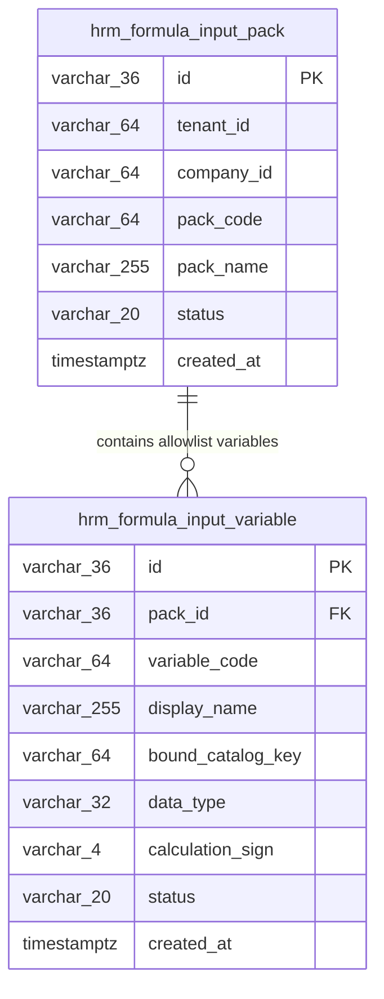

# BA_HRM_PAYROLL_FORMULA_INPUT_PACK_DB_DESIGN_01_20260813 — Wave 10 Database Design

- **Module**: HRM Payroll & Master Catalogs (`hrm_formula_input_pack`)
- **Version**: 1.0.0 (Enterprise Standard)
- **Author**: Antigravity Lead Database Architect
- **Status**: APPROVED
- **Ref TechSpec**: [BA_HRM_PAYROLL_FORMULA_INPUT_PACK_TECHSPEC_01_20260813.md](file:///C:/Users/ADMIN/OneDrive/Ta%CC%80i%20li%C3%AA%CC%A3u/Vibe%20Coding/projects/xevn-ecosystem/docs/program/deltas/BA_HRM_PAYROLL_FORMULA_INPUT_PACK_TECHSPEC_01_20260813.md)

---

## 1. Relational Entity Diagram



---

## 2. DDL Table Initialization Statements

```sql
-- WAVE 10: FORMULA INPUT PACK & VARIABLES
CREATE TABLE IF NOT EXISTS public.hrm_formula_input_pack (
  id VARCHAR(36) PRIMARY KEY,
  tenant_id VARCHAR(64) NOT NULL,
  company_id VARCHAR(64) NOT NULL,
  pack_code VARCHAR(64) NOT NULL,
  pack_name VARCHAR(255) NOT NULL,
  status VARCHAR(20) NOT NULL DEFAULT 'active',
  created_at TIMESTAMPTZ NOT NULL DEFAULT NOW()
);

CREATE TABLE IF NOT EXISTS public.hrm_formula_input_variable (
  id VARCHAR(36) PRIMARY KEY,
  pack_id VARCHAR(36) NOT NULL REFERENCES public.hrm_formula_input_pack(id) ON DELETE CASCADE,
  variable_code VARCHAR(64) NOT NULL,
  display_name VARCHAR(255) NOT NULL,
  bound_catalog_key VARCHAR(64) NULL,
  data_type VARCHAR(32) NOT NULL DEFAULT 'DECIMAL',
  calculation_sign VARCHAR(4) NOT NULL DEFAULT '+',
  status VARCHAR(20) NOT NULL DEFAULT 'active',
  created_at TIMESTAMPTZ NOT NULL DEFAULT NOW()
);

CREATE INDEX IF NOT EXISTS idx_hrm_formula_pack_scope
ON public.hrm_formula_input_pack(tenant_id, company_id, pack_code);

CREATE INDEX IF NOT EXISTS idx_hrm_formula_var_pack
ON public.hrm_formula_input_variable(pack_id, variable_code);
```
