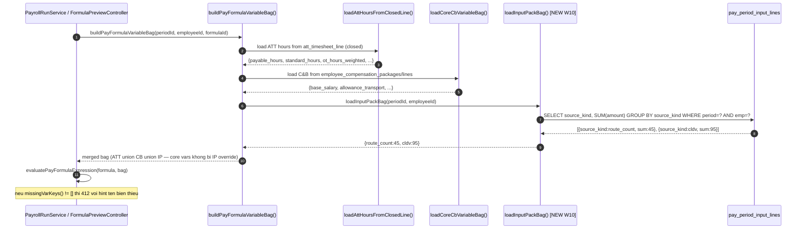

# SRS — Wave 10: Formula Engine — Mo Bien Dau Vao Qua Input Pack Profile

| Meta | Value |
|---|---|
| work_item_id | BA-HRM-PAYROLL-FORMULA-INPUT-PACK-SRS-01 |
| ref_program | `docs/program/PO_HRM_CNTT_PAYROLL_CATALOG_PROGRAM.md` (Wave 10) |
| Nguon nghiep vu | `docs/program/specs/PO-HRM-PAY-INPUT-PACKS-SPEC-01.md` (12 source_kind taxonomy) · `apps/api/hrm-api/src/payroll/pay-formula.constants.ts` (DV-18 allowlist hien tai) |
| Ngay | 2026-08-15 |
| Trang thai | DRAFT |
| SoT Architecture | KHONG tao bang moi — extend `pay_input_pack_profile.allowed_source_kinds_json` (da LIVE) va `pay-formula-variable-bag.ts` (da LIVE) |

---

## 1. Muc dich (Purpose)

Cong thuc luong CNTT (`pay_formula`) hien chi nhan 7 bien hardcoded (DV-18 allowlist: `payable_hours`, `standard_hours`, `ot_hours_weighted`, `paid_leave_hours`, `unpaid_leave_hours`, `base_salary`, `dependents_count` + pattern `allowance_*`). Khong co co che nao de mot ky luong LX-Tai tham chieu `route_count` (so luot), hay VP-Tinh tham chieu `kpi` (diem danh gia), `vp_cost` (chi phi VP C) trong cong thuc.

Wave 10 mo allowlist theo co che **Profile-Driven** — khong thay doi schema DB, chi them:
1. Logic validate bien cong thuc: chap nhan them `{source_kind}` neu `source_kind` thuoc taxonomy 12 muc.
2. Logic nap gia tri (variable bag): doc `pay_period_input_lines` theo `source_kind` cho ky luong, dua vao bag voi key = `source_kind`.
3. UI read-only: hien thi danh sach bien kha dung theo profile (khong phai form chinh sua).

---

## 2. UC (Use Case)

### UC-HRM-W10-01: Tac gia cong thuc xem bien kha dung theo profile

| Thuoc tinh | Gia tri |
|---|---|
| Actor | HR Manager / Payroll Admin (quyen `pay_formula:author`) |
| Trigger | Mo man soan cong thuc → nhan "Chen bien" / "Goi y bien" |
| Pre-condition | Nhan vien duoc gan profile input pack (VD: `INP_LXT_ROUTE`) dang active |
| Main flow | He thong tra ve danh sach bien kha dung = core vars (7) + allowance_* + `{source_kind}` theo profile |
| Success outcome | Tac gia chon `route_count` tu danh sach, he thong chen vao expression |
| Failure | Profile chua gan → chi hien 7 core vars + warning "nhan vien chua co profile luong" |

### UC-HRM-W10-02: He thong validate cong thuc khi Author/Publish

| Thuoc tinh | Gia tri |
|---|---|
| Actor | He thong (triggered by formula Author/Publish API) |
| Trigger | POST/PATCH `pay_formulas` — buoc validate bien |
| Pre-condition | Cong thuc gd1_eval_v1 co it nhat 1 var line |
| Main flow | Kiem tra moi var key: nam trong core allowlist HOAC pattern `allowance_*` HOAC la 1 `source_kind` hop le trong taxonomy 12 muc |
| Success outcome | Validate pass — cong thuc Author/Publish thanh cong |
| Failure | Var key khong thuoc bat ky danh sach nao → 412 `HRM-PAY-FORMULA-412-VARS` voi detail `unknown_var_keys: [...]` |

### UC-HRM-W10-03: Engine tinh luong nap gia tri Input Pack vao bag

| Thuoc tinh | Gia tri |
|---|---|
| Actor | He thong (triggered by payroll run / preview formula) |
| Trigger | `buildPayFormulaVariableBag()` duoc goi trong process/preview luong ky |
| Pre-condition | Ky luong da co `pay_period_input_lines` duoc nhap |
| Main flow | Sau khi nap ATT + C&B bag, he thong doc them `pay_period_input_lines` theo `(period_id, employee_id, source_kind)` — aggregate `SUM(amount)` theo `source_kind` → nap vao bag voi key = `source_kind` |
| Success outcome | Bag du bien → `evaluatePayFormulaExpression()` chay khong thieu var |
| Failure | Cong thuc yeu cau `route_count` nhung khong co dong input → `missingVarKeys()` tra ve `['route_count']` → 412 `HRM-PAY-FORMULA-412` hien canh bao ro ten bien thieu |

---

## 3. FR (Functional Requirements)

| Ma | Yeu cau |
|---|---|
| FR-W10-01 | Ham `isAllowedFormulaVarKey(key)` trong `pay-formula.constants.ts` duoc mo rong: true neu (a) key trong `PAY_FORMULA_REQUIRED_VAR_ALLOWLIST` (7 vars cu, giu nguyen), HOAC (b) key match `PAY_FORMULA_ALLOWANCE_VAR_RE`, HOAC (c) key trong `PAY_FORMULA_INPUT_PACK_SOURCE_KINDS` (12 source_kind). |
| FR-W10-02 | Ham `buildPayFormulaVariableBag()` trong `pay-formula-variable-bag.ts` co them buoc `loadInputPackBag(periodId, employeeId, db)`: SELECT `source_kind, SUM(amount)` FROM `pay_period_input_lines` WHERE `pay_period_id=$1 AND employee_id=$2 AND deleted_at IS NULL` GROUP BY `source_kind` → nap vao bag voi key = `source_kind`. |
| FR-W10-03 | API `GET /api/hrm/payroll/formula-variable-hints?profileCode={code}` (moi) tra ve danh sach bien kha dung: 7 core + allowance_* note + source_kinds tu profile `allowed_source_kinds_json`. |
| FR-W10-04 | UI Cai dat → "Cong thuc luong" → section "Bien dau vao" hien thi read-only table: Ma bien · Nguon du lieu · Ghi chu — phan nhom: Core (ATT+C&B), Allowance, Input Pack. Khong cho edit. |
| FR-W10-05 | Khi `missingVarKeys()` phat hien bien thieu luc process/preview, error payload ghi ro ten bien + goi y nguon: VD `"route_count — can nhap lieu ky luong loai route_count cho nhan vien nay"`. |

---

## 4. BR (Business Rules)

| Ma | Quy tac |
|---|---|
| BR-W10-01 | **Khong tao bang moi.** Dung `pay_input_pack_profile.allowed_source_kinds_json` hien co (LIVE open JSONB). Source_kind hop le = phai co trong `PAY_FORMULA_INPUT_PACK_SOURCE_KINDS`. |
| BR-W10-02 | **Source_kind aggregate toan ky:** `loadInputPackBag()` aggregate `SUM(amount)` theo `source_kind` toan bo dong input cua nhan vien trong ky. |
| BR-W10-03 | **Core vars khong bi override:** Neu co `pay_period_input_lines` voi `source_kind='payable_hours'`, he thong bo qua (ATT closed line la SoT cho ATT vars). |
| BR-W10-04 | **Validate tai Author, khong tai ket xuat:** `isAllowedFormulaVarKey()` duoc goi khi Author/Publish cong thuc — khong goi lai khi ket xuat. |
| BR-W10-05 | **Profile chua gan khong phai loi validate formula:** Tac gia soan cong thuc co the tham chieu `route_count` hop le — loi xay ra SAU khi process luong that ma khong co dong input. |
| BR-W10-06 | **`payroll_e2e_ready=false` giu nguyen:** Wave nay mo bien bag va validate logic — khong claim he thong tinh luong live. |
| BR-W10-07 | **Cam trung key voi core vars:** `PAY_FORMULA_INPUT_PACK_SOURCE_KINDS` khong duoc chua bat ky key nao da co trong `PAY_FORMULA_REQUIRED_VAR_ALLOWLIST`. |

---

## 5. Du lieu goc (SoT)

| Nguon | Noi dung |
|---|---|
| `pay-formula.constants.ts` L39-47 | `PAY_FORMULA_REQUIRED_VAR_ALLOWLIST` = 7 vars (giu nguyen) |
| `pay-formula.constants.ts` L49 | `PAY_FORMULA_ALLOWANCE_VAR_RE` (giu nguyen) |
| `PO-HRM-PAY-INPUT-PACKS-SPEC-01.md` §2 | 12 source_kind taxonomy — SoT duy nhat |
| `pay-formula-variable-bag.ts` | `buildPayFormulaVariableBag()` hien tai — W10 ADD buoc IP bag |
| `pay_period_input_lines` schema | `(pay_period_id, employee_id, source_kind, amount)` — LIVE, khong doi |

---

## 6. AC (Acceptance Criteria)

| Ma | Dieu kien PASS |
|---|---|
| AC-W10-01 | `isAllowedFormulaVarKey('route_count')` → true; `isAllowedFormulaVarKey('unknown_xyz')` → false |
| AC-W10-02 | Author cong thuc voi line `{source: 'var', var: 'kpi'}` → validate pass (khong 412) |
| AC-W10-03 | Author cong thuc voi var `'not_in_any_list'` → 412 `HRM-PAY-FORMULA-412-VARS` chua `unknown_var_keys: ['not_in_any_list']` |
| AC-W10-04 | `buildPayFormulaVariableBag()` voi period co `pay_period_input_lines` `source_kind='route_count' amount=45` → bag chua `{route_count: 45}` |
| AC-W10-05 | Preview cong thuc `route_count * 70000` voi bag `{route_count: 45}` → ket qua 3150000, khong 412 |
| AC-W10-06 | Preview cong thuc `route_count * 70000` voi bag thieu `route_count` → 412 `HRM-PAY-FORMULA-412` voi `missing_vars: ['route_count']` |
| AC-W10-07 | `GET /api/hrm/payroll/formula-variable-hints?profileCode=INP_LXT_ROUTE` → response chua 7 core + `route_count`, `cldv`, `cpsc`, `manual` (theo `allowed_source_kinds_json` profile do) |
| AC-W10-08 | Core var `payable_hours` tu ATT closed line — khong bi override boi IP bag du co dong input `source_kind='payable_hours'` |

---

## 7. Dien bien (Luong chinh: UC-03 — Engine tinh luong nap IP bag)

### Dien bien 4-col (UC-02: Validate var key khi Author)

| Buoc | Actor | Hanh dong | Ket qua |
|---|---|---|---|
| 1 | HR Manager | POST `pay_formulas` voi expression co var `route_count` | Request toi Controller |
| 2 | Controller | Goi `validateFormulaVarKeys(expression)` | Kiem tra tung var key |
| 3a (success) | System | `isAllowedFormulaVarKey('route_count')` → true (source_kind hop le) | Continue → 201 Author thanh cong |
| 3b (fail-var) | System | Var key `foo_bar` → khong khop core / allowance_* / source_kind taxonomy | 412 `HRM-PAY-FORMULA-412-VARS` · `{unknown_var_keys: ['foo_bar']}` |

---

## 8. Ngoai pham vi (Out of scope, Wave nay)

- Giao dien nhap lieu `pay_period_input_lines` (da LIVE)
- Cong thuc tinh luong e2e (W13 QA)
- Import Excel cho route_count/kpi
- Them bien moi ngoai 12 source_kind taxonomy (can BA xac nhan)
- TechSpec/API/DB duoc "antigravity" viet 2026-08-13 voi bang moi (`hrm_formula_input_pack`): **KHONG DUNG** — se archive, thay bang TechSpec moi extend `pay_input_pack_profile`

---

## 9. Buoc ke tiep

1. TechSpec: extend `pay-formula.constants.ts` (them `PAY_FORMULA_INPUT_PACK_SOURCE_KINDS`) + `pay-formula-variable-bag.ts` (`loadInputPackBag`), API hint endpoint, khong doi schema DB
2. BE code (dev-be lane): `loadInputPackBag()` + `isAllowedFormulaVarKey()` + hint endpoint
3. FE code (dev-fe lane): fix `FormulaInputPackSetupScreen.tsx` (bo DEFAULT_VARIABLES hardcoded, goi API hint that)
4. Unit tests: `pay-formula.constants.spec.ts`, `pay-formula-variable-bag.spec.ts`
5. W13 QA tong — sau tat ca cac wave done
