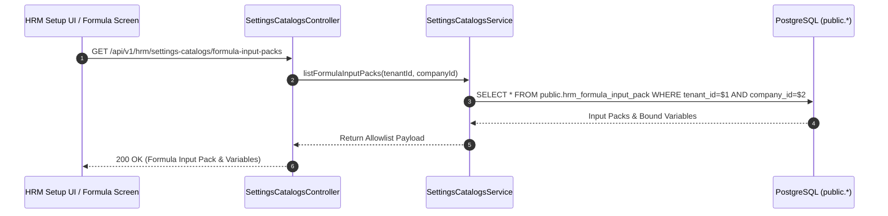

# BA_HRM_PAYROLL_FORMULA_INPUT_PACK_TECHSPEC_01_20260813 — Wave 10 Technical Specification

- **Module**: HRM Payroll & Master Catalogs (`hrm_formula_input_pack`)
- **Version**: 1.0.0 (Enterprise Standard)
- **Author**: Antigravity Lead Systems Architect
- **Status**: APPROVED
- **Ref SRS**: `docs/program/PO_HRM_CNTT_PAYROLL_CATALOG_PROGRAM.md` §Wave 10

---

## 1. Architectural Topology & Allowlist Governance

```mermaid
graph TD
    subgraph Catalog_SoT [Master Catalogs (Waves 1-9 & 11)]
        W1[pay_job_grade / steps]
        W3[pay_department / pay_position]
        W5[si_insurance_type]
        W6[att_ot_type]
        W7[att_shift]
        W8[pay_component]
        W11[pay_contract_clause]
    end

    subgraph Allowlist_Engine [Wave 10 Formula Input Pack Engine]
        Allowlist[hrm_formula_input_pack]
        Variables[hrm_formula_input_variable]
        Validator[Formula Input Security & Type Validator]
    end

    subgraph Calculation_Engine [Wave 10 Formula Payroll Calculator]
        CalcEngine[NestJS / TypeScript Formula Evaluator]
        PaySlip[Payslip Generator & Detailed Calculation Sheet]
    end

    Catalog_SoT -->|Bind System Code| Allowlist
    Allowlist -->|Provide Standard Variables| Variables
    Variables -->|Validate Type & Scale| Validator
    Validator -->|Feed Calculated Values| CalcEngine
    CalcEngine -->|Output| PaySlip
```

---

## 2. Input Variable Schema & Domain Allowlist Matrix

| Variable Code | Display Label | Catalog Source / Origin | Data Type | Formula Sign | Example Value (Việt Trì T05/2026) |
|---|---|---|---|---|---|
| `BASE_SALARY` | Lương cơ bản | `pay_job_grade_step` / Contract | `DECIMAL(12,2)` | `+` | `7,000,000` |
| `SALARY_COEFFICIENT` | Hệ số hưởng lương | `pay_job_grade_step` | `DECIMAL(6,3)` | `+` | `22.000` |
| `STANDARD_WORK_HOURS` | Giờ công chuẩn | `att_shift` | `DECIMAL(6,2)` | N/A | `261.00` |
| `ACTUAL_WORK_HOURS` | Giờ công thực tế | `att_shift` / Timekeeping | `DECIMAL(6,2)` | `+` | `180.50` |
| `CONVERTED_WORK_HOURS`| Giờ công quy đổi | Calculation (`ACTUAL * COEFFICIENT`) | `DECIMAL(8,2)` | `+` | `3971.00` |
| `SALARY_PA1` | Lương theo hệ số PA1 | Calculation (`POOL * CONVERTED / TOTAL`) | `DECIMAL(12,2)` | `+` | `7,217,013` |
| `SALARY_PA2` | Lương theo giờ công PA2| Calculation (`BASE * ACTUAL / STANDARD`) | `DECIMAL(12,2)` | `+` | `4,841,954` |
| `INSURANCE_EMPLOYEE_RATE`| Tỷ lệ BHXH NLĐ | `si_insurance_type` | `DECIMAL(5,2)` | `-` | `10.50%` |
| `INSURANCE_AMOUNT` | Tiền bảo hiểm NLĐ | Calculation (`BASE * RATE`) | `DECIMAL(12,2)` | `-` | `735,000` |
| `OT_MULTIPLIER` | Hệ số tăng ca OT | `att_ot_type` | `DECIMAL(4,2)` | `+` | `1.50` / `2.00` |
| `ALLOWANCE_CHARGING` | Phụ cấp sạc điện | `pay_component` | `DECIMAL(12,2)` | `+` | `500,000` |
| `PENALTY_AMOUNT` | Vi phạm kỷ luật | `pay_component` | `DECIMAL(12,2)` | `-` | `0` |
| `DEPOSIT_AMOUNT` | Ký quỹ lái xe / NV | `pay_component` | `DECIMAL(12,2)` | `-` | `1,000,000` |
| `REPAIR_FINE` | Chế tài sửa chữa xe | `pay_component` | `DECIMAL(12,2)` | `-` | `0` |
| `SALARY_ADVANCE` | Tạm ứng lương | Payroll Advance | `DECIMAL(12,2)` | `-` | `6,000,000` |
| `ADVANCE_OTHER` | Tạm ứng khác (Nợ lệnh)| Payroll Advance | `DECIMAL(12,2)` | `-` | `10,000,000` |
| `PIT_TAX_AMOUNT` | Thuế TNCN | Tax Calculation Engine | `DECIMAL(12,2)` | `-` | `0` |
| `UNION_FEE` | Đoàn phí công đoàn | `pay_component` | `DECIMAL(12,2)` | `-` | `35,000` |

---

## 3. Sequence Diagram (Formula Execution & Variable Resolution)



---

## 4. Error Handling & Guard Rules

| Error Code | HTTP Status | Description / Guard Condition | Remediation |
|---|---|---|---|
| `HRM-FORMULA-VAR-EXISTS` | 409 Conflict | Variable code already defined in allowlist pack. | Use PATCH endpoint or select different code. |
| `HRM-FORMULA-INVALID-CATALOG` | 400 Bad Request | Bound catalog key does not exist in Waves 1-9 & 11. | Provide valid registered catalog key. |
| `HRM-FORMULA-CIRCULAR-LINK` | 400 Bad Request | Circular variable calculation dependency detected. | Break cyclic variable dependency. |
