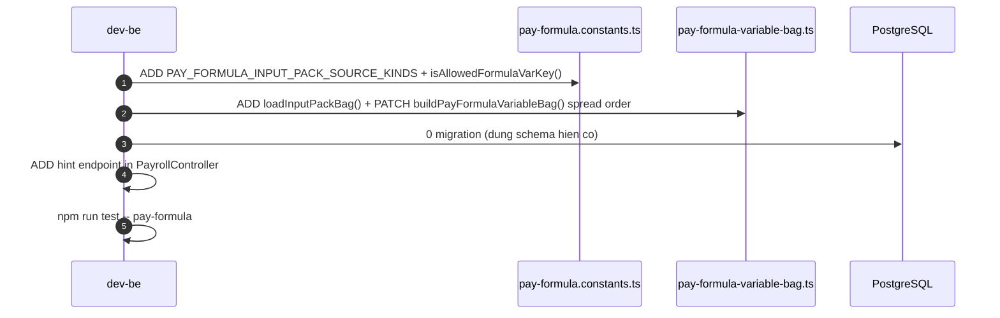

# TechSpec W10 -- Formula Engine: Mo Allowlist Qua Input Pack Profile

| Meta | Value |
|---|---|
| work_item_id | BA-HRM-PAYROLL-FORMULA-INPUT-PACK-TECHSPEC-01 |
| ref_SRS | `docs/program/deltas/BA_HRM_PAYROLL_FORMULA_INPUT_PACK_SRS_01_20260815.md` |
| Ngay | 2026-08-15 |
| Trang thai | APPROVED -- ready for BE dev dispatch |
| Luu y | TechSpec cu (antigravity, 2026-08-13) ARCHIVE -- sai arch (new tables). File nay la ban chinh thuc. |

---

## 1. Quyet dinh kien truc (Architecture Decision)

**KHONG tao bang moi.** He thong hien co da du:

| Component hien co | Role trong W10 |
|---|---|
| `pay_input_pack_profile.allowed_source_kinds_json` (LIVE) | Luu danh sach source_kind duoc phep per profile |
| `pay_period_input_lines.source_kind + amount` (LIVE) | Nguon gia tri bien tu Input Pack |
| `pay-formula.constants.ts` | ADD const `PAY_FORMULA_INPUT_PACK_SOURCE_KINDS` |
| `pay-formula-variable-bag.ts` | ADD function `loadInputPackBag()` |
| `pay-cntt-setup.service.ts` | Khong doi -- profile CRUD da co |

Schema DB: **0 migration can thiet** cho Wave 10.

---

## 2. Thay doi code BE (3 items, lane dev-be)

### 2.1 `pay-formula.constants.ts` -- ADD const + ADD guard function

**Them sau dong 49 (sau `PAY_FORMULA_ALLOWANCE_VAR_RE`):**

```typescript
/**
 * W10: source_kind taxonomy 12 muc -- mo allowlist cho bien tu Input Pack.
 * Them source_kind o day chi khi BA/sponsor xac nhan bo sung taxonomy.
 * Ref: docs/program/specs/PO-HRM-PAY-INPUT-PACKS-SPEC-01.md §2
 */
export const PAY_FORMULA_INPUT_PACK_SOURCE_KINDS = [
  'manual',
  'kpi',
  'dll_cpn',
  'cpsc',
  'cldv',
  'route_count',
  'revenue',
  'advance',
  'xdtn',
  'vp_cost',
  'vp_allowance',
  'other_income',
  'rd_transfer',
] as const satisfies readonly string[];

export type PayFormulaInputPackSourceKind =
  (typeof PAY_FORMULA_INPUT_PACK_SOURCE_KINDS)[number];

/**
 * W10: Kiem tra key bien co hop le khong (mo rong tu DV-18 allowlist cu).
 * True neu: (a) core var, (b) allowance_*, (c) source_kind taxonomy.
 * Cam: core var list PHAI thang neu conflict voi source_kind (BR-W10-07).
 */
export function isAllowedFormulaVarKey(key: string): boolean {
  if ((PAY_FORMULA_REQUIRED_VAR_ALLOWLIST as readonly string[]).includes(key)) return true;
  if (PAY_FORMULA_ALLOWANCE_VAR_RE.test(key)) return true;
  if ((PAY_FORMULA_INPUT_PACK_SOURCE_KINDS as readonly string[]).includes(key)) return true;
  return false;
}
```

### 2.2 `pay-formula-variable-bag.ts` -- ADD `loadInputPackBag()`

**Them function moi (truoc hoac sau `loadCoreCbVariableBag`):**

```typescript
/**
 * W10: Nap gia tri bien tu pay_period_input_lines vao variable bag.
 * Aggregate SUM(amount) per source_kind toan ky.
 * Core ATT vars (payable_hours, etc.) KHONG bi override -- goi sau loadAttHours.
 * @CODE-MEMORY WorkItem: BA-HRM-PAYROLL-FORMULA-INPUT-PACK-TECHSPEC-01
 */
export async function loadInputPackBag(
  periodId: string,
  employeeId: string,
  db: HrmDbService,
): Promise<Record<string, number>> {
  const rows = await db.query<{ source_kind: string; total: string }>(
    `SELECT source_kind, SUM(amount)::text AS total
     FROM pay_period_input_lines
     WHERE pay_period_id = $1
       AND employee_id   = $2
       AND deleted_at IS NULL
     GROUP BY source_kind`,
    [periodId, employeeId],
  );
  const bag: Record<string, number> = {};
  for (const row of rows) {
    // Skip core ATT vars -- those come from att_timesheet_line (BR-W10-03)
    if ((PAY_FORMULA_REQUIRED_VAR_ALLOWLIST as readonly string[]).includes(row.source_kind)) continue;
    bag[row.source_kind] = parseFloat(row.total ?? '0');
  }
  return bag;
}
```

**Sua `buildPayFormulaVariableBag()` -- them buoc IP sau C&B:**

```typescript
// existing step 1: ATT
const attBag = await loadAttHoursFromClosedLine(periodId, employeeId, db);
// existing step 2: C&B
const cbBag = await loadCoreCbVariableBag(employeeId, db);
// W10 ADD step 3: Input Pack
const ipBag = await loadInputPackBag(periodId, employeeId, db);

return { ...ipBag, ...cbBag, ...attBag }; // ATT wins conflict (spread order)
```

### 2.3 API moi `GET /api/hrm/payroll/formula-variable-hints` -- hint endpoint

**Route:** them vao `PayrollController` hoac `SettingsCatalogsController`

```typescript
@Get('formula-variable-hints')
@UseGuards(HrmJwtGuard)
async getFormulaVariableHints(
  @Query('profileCode') profileCode: string | undefined,
  @Req() req: Request,
) {
  const { tenantId, companyId } = getVerifiedInternalJwtPayload(req);
  return this.payrollService.getFormulaVariableHints(tenantId, companyId, profileCode);
}
```

**Service logic:**

```typescript
async getFormulaVariableHints(tenantId, companyId, profileCode?) {
  const coreVars = PAY_FORMULA_REQUIRED_VAR_ALLOWLIST.map(k => ({
    key: k, group: 'core', source: 'ATT/C&B',
  }));
  const allowanceNote = { key: 'allowance_*', group: 'allowance', source: 'employee_compensation_packages' };

  let ipVars: {key:string, group:string, source:string}[] = [];
  if (profileCode) {
    const profile = await db.queryOne(
      'SELECT allowed_source_kinds_json FROM pay_input_pack_profile WHERE code=$1 AND tenant_id=$2 AND company_id=$3 AND status='active' LIMIT 1',
      [profileCode, tenantId, companyId],
    );
    const allowed: string[] = JSON.parse(profile?.allowed_source_kinds_json ?? '[]');
    ipVars = allowed
      .filter(sk => (PAY_FORMULA_INPUT_PACK_SOURCE_KINDS as readonly string[]).includes(sk))
      .map(k => ({ key: k, group: 'input_pack', source: `pay_period_input_lines[source_kind=${k}]` }));
  } else {
    // No profile: show all 12 taxonomy as reference
    ipVars = PAY_FORMULA_INPUT_PACK_SOURCE_KINDS.map(k => ({
      key: k, group: 'input_pack', source: `pay_period_input_lines[source_kind=${k}]`,
    }));
  }

  return { coreVars, allowanceNote, ipVars };
}
```

---

## 3. Thay doi code FE (1 item, lane dev-fe)

**File:** `apps/web/hrm/src/components/payroll/setup/FormulaInputPackSetupScreen.tsx`

**Van de hien tai:** hardcoded `DEFAULT_VARIABLES`, khong goi API that.

**Fix:** Xoa `DEFAULT_VARIABLES`, them `useFormulaVariableHints()` hook goi `GET /api/hrm/payroll/formula-variable-hints`.

```typescript
// Thay the DEFAULT_VARIABLES + useDragOrdering bang:
const { data: hints, isLoading } = useQuery({
  queryKey: ['formula-variable-hints'],
  queryFn: () => hrmApiClient.get('/payroll/formula-variable-hints').then(r => r.data),
});
```

UI render: 3 section (Core / Allowance / Input Pack) thay vi table phang -- xem `UI-HRM-FORMULA-INPUT-PACK-01.md` §3 (hien co, chi can cap nhat phan group).

---

## 4. Unit tests can them

| File | Test case |
|---|---|
| `pay-formula.constants.spec.ts` | `isAllowedFormulaVarKey('route_count')` → true; `isAllowedFormulaVarKey('unknown_xyz')` → false; core vars khong bi source_kind override |
| `pay-formula-variable-bag.spec.ts` | `loadInputPackBag` tra ve dung aggregate; core var `payable_hours` tu input_lines bi bo qua (BR-W10-03) |
| `payroll.controller.spec.ts` (hoac rieng) | `GET formula-variable-hints?profileCode=INP_LXT_ROUTE` → response dung source_kinds |

---

## 5. Sequence check (on top of SRS diagram)



---

## 6. Exit criteria BE dispatch

| # | Dieu kien |
|---|---|
| 1 | `isAllowedFormulaVarKey('route_count')` === true (unit test PASS) |
| 2 | `isAllowedFormulaVarKey('unknown_xyz')` === false (unit test PASS) |
| 3 | `loadInputPackBag()` tra ve bag dung voi mock DB rows (unit test PASS) |
| 4 | Core ATT var trong `pay_period_input_lines` bi skip (BR-W10-03, unit test PASS) |
| 5 | `GET /api/hrm/payroll/formula-variable-hints` → 200 voi 3 groups |
| 6 | 0 regression tren `pay-formula.service.spec.ts`, `pay-formula-evaluator.spec.ts` |
| ack_status | READY_FOR_QA hoac PASS_TO_PM (voi evidence file test run) |
