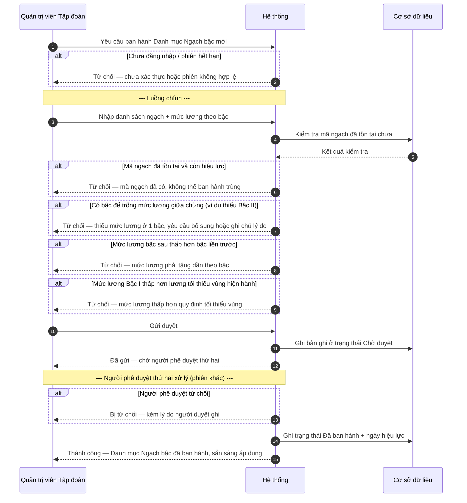
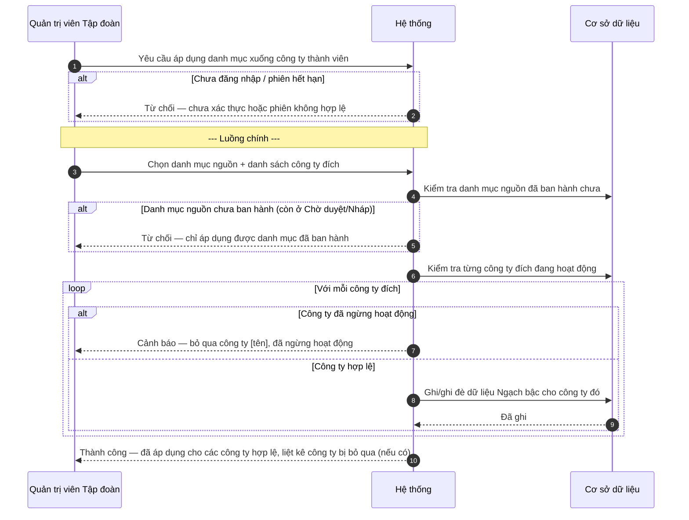
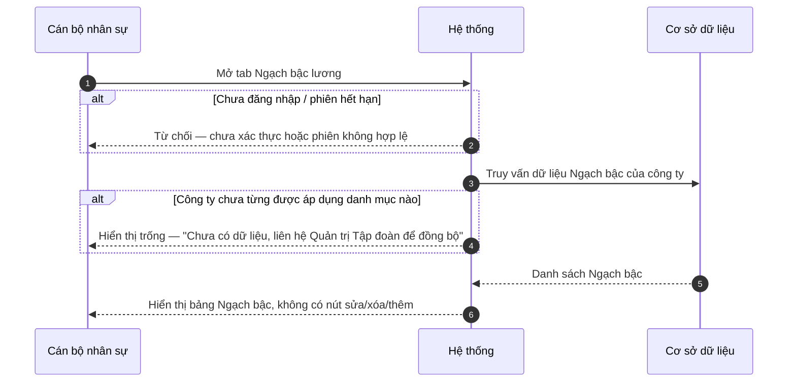

# SRS — Danh mục Ngạch bậc lương (Wave 1)

| Mã tài liệu | BA-HRM-PAYROLL-GRADE-SRS-01 |
| --- | --- |
| Phiên bản | v2 (viết lại đúng chuẩn tài liệu, thay thế v1) |
| Nguồn nghiệp vụ | Quyết định ban hành hệ thống thang lương, bảng lương (hiệu lực 01/01/2026) |
| Ngày | 2026-08-13 |
| Trạng thái | DRAFT — chờ xác nhận trước khi sang thiết kế kỹ thuật |

## 1. Giới thiệu

Tài liệu này mô tả nghiệp vụ quản lý **Danh mục Ngạch bậc lương** — bảng thang lương chính thức áp dụng cho toàn bộ nhân viên trong công ty và các đơn vị thành viên. Đây là dữ liệu gốc (do cấp Tập đoàn ban hành), các công ty con/chi nhánh chỉ được xem, không được tự ý sửa.

## 2. Mô tả tổng quan (luồng tổng thể)

| Bước | Vai trò thực hiện | Mô tả |
| --- | --- | --- |
| 1 | Quản trị viên Tập đoàn | Nhập và ban hành (publish) Danh mục Ngạch bậc tại cấp Tập đoàn |
| 2 | Quản trị viên Tập đoàn | Áp dụng (apply) danh mục đã ban hành xuống các công ty thành viên |
| 3 | Cán bộ nhân sự tại công ty thành viên | Xem danh mục Ngạch bậc đã được áp dụng (không sửa được) |
| 4 | Hệ thống tính lương | Sử dụng mức lương theo ngạch bậc để đối chiếu lương tối thiểu khi tạo/sửa hồ sơ lương nhân viên (nghiệp vụ này thuộc phạm vi khác, chỉ liệt kê để biết phụ thuộc) |

Bước 3 phụ thuộc Bước 1–2 hoàn tất. Bước 4 nằm ngoài phạm vi tài liệu này (sẽ có tài liệu riêng khi làm tính lương).

## 3. Yêu cầu chức năng

### FR-UC-GRADE-01 — Ban hành (publish) Danh mục Ngạch bậc tại cấp Tập đoàn

| Thuộc tính | Mô tả |
| --- | --- |
| **Actor** | Quản trị viên Tập đoàn (người có thẩm quyền ban hành thang lương) |
| **Ưu tiên** | Cao |
| **Điều kiện tiên quyết** | Đã có văn bản/quyết định thang lương chính thức được phê duyệt nội bộ trước khi nhập vào hệ thống |
| **Điều kiện hậu** | Danh mục ở trạng thái đã ban hành, sẵn sàng để áp dụng xuống công ty thành viên |
| **Mã UC** | UC-HRM-GRADE-01 |
| **Liên hệ phần mềm hiện tại** | Chưa có — đây là danh mục mới, hiện công ty đang quản lý bằng văn bản/Excel rời rạc |

**Dữ liệu đầu vào:**

| Trường | Bắt buộc | Ràng buộc / kiểm tra |
| --- | --- | --- |
| Mã ngạch | Có | Duy nhất trong toàn bộ danh mục đang hoạt động; không được trùng với ngạch đã ban hành trước đó còn hiệu lực |
| Tên ngạch (mô tả chức danh áp dụng) | Có | Không để trống |
| Danh sách mức lương theo bậc (Bậc I, II, III…) | Có ít nhất Bậc I | Mỗi ngạch phải có tối thiểu 1 bậc (Bậc I); số bậc có thể khác nhau giữa các ngạch; mức lương bậc sau phải lớn hơn hoặc bằng bậc liền trước (không được giảm dần) |
| Mức lương Bậc I của ngạch thấp nhất | Có | Không được thấp hơn mức lương tối thiểu vùng theo quy định Nhà nước hiện hành tại thời điểm ban hành |
| Ngày hiệu lực | Có | Không được là ngày trong quá khứ so với ngày ban hành, trừ trường hợp ban hành hồi tố có ghi chú rõ lý do |

**Luồng chính:**

1. Quản trị viên Tập đoàn mở màn hình "Ban hành Ngạch bậc lương", chọn "Thêm danh mục mới".
2. Nhập danh sách ngạch và mức lương theo từng bậc (theo bảng dữ liệu đầu vào), có thể nhập thủ công hoặc tải lên từ file.
3. Hệ thống kiểm tra hợp lệ toàn bộ danh sách (mã trùng, thứ tự bậc, mức lương tối thiểu).
4. Quản trị viên xác nhận gửi duyệt.
5. Người phê duyệt thứ hai (theo cơ chế duyệt song song 2 người) xem lại và phê duyệt.
6. Hệ thống chuyển danh mục sang trạng thái "Đã ban hành", ghi nhận ngày hiệu lực.

**Quy tắc nghiệp vụ:**

- BR-GRADE-01: Việc ban hành phải qua đủ 2 người duyệt (người nhập + người phê duyệt độc lập) trước khi có hiệu lực — không cho 1 người tự nhập tự duyệt.
- BR-GRADE-02: Không được để trống bậc giữa chừng (ví dụ có Bậc I, III nhưng thiếu Bậc II) — nếu nguồn văn bản gốc thật sự thiếu 1 bậc (đã gặp trường hợp thực tế), hệ thống phải cho phép ghi chú rõ "chưa có căn cứ" thay vì tự suy ra số liệu.
- BR-GRADE-03: Sau khi đã ban hành và áp dụng xuống công ty thành viên, không được sửa trực tiếp bản ghi cũ — mọi thay đổi mức lương phải tạo một lần ban hành mới có ngày hiệu lực riêng (giữ lịch sử).

**Sơ đồ tương tác:**

**Diễn biến nghiệp vụ (theo sơ đồ):**

| # | Tương tác | Điều kiện / quy tắc | Kết quả hoặc lỗi |
| --- | --- | --- | --- |
| 1 | Yêu cầu ban hành danh mục mới | — | Tiếp tục |
| 2 | Kiểm tra phiên đăng nhập | Chưa đăng nhập / hết phiên | Từ chối — yêu cầu đăng nhập lại |
| 3 | Nhập danh sách ngạch + mức lương theo bậc | Theo bảng dữ liệu đầu vào | Tiếp tục |
| 4 | Kiểm tra mã ngạch trùng | BR-GRADE-01 phạm vi kiểm trùng: mã còn hiệu lực | Từ chối — mã ngạch đã có |
| 5 | Kiểm tra thiếu bậc giữa chừng | BR-GRADE-02 | Từ chối — thiếu mức lương 1 bậc |
| 6 | Kiểm tra thứ tự tăng dần theo bậc | Mức lương bậc sau &lt; bậc trước | Từ chối — sai thứ tự tăng dần |
| 7 | Kiểm tra sàn lương tối thiểu vùng | Bậc I ngạch thấp nhất &lt; lương tối thiểu vùng | Từ chối — dưới mức tối thiểu vùng |
| 8 | Gửi duyệt | Toàn bộ kiểm tra ở bước 4–7 đã qua | Tiếp tục — trạng thái Chờ duyệt |
| 9 | Người phê duyệt thứ hai xem lại | BR-GRADE-01 — không cho người nhập tự duyệt | Tiếp tục hoặc Từ chối |
| 10 | Người phê duyệt từ chối | Người duyệt phát hiện sai sót | Từ chối — kèm lý do |
| 11 | Ghi nhận Đã ban hành | Người duyệt đồng ý | Thành công |

**Kết quả trả về khi thành công:**

| Ý | Nội dung |
| --- | --- |
| Người dùng thấy | Thông báo "Đã ban hành Danh mục Ngạch bậc — hiệu lực từ [ngày]"; danh mục chuyển sang tab "Đã ban hành" |
| Bản ghi tạo/cập nhật | Danh mục Ngạch bậc (mới) + toàn bộ các dòng Ngạch–Bậc–Mức lương thuộc danh mục đó |
| Khóa mang sang bước sau | Mã danh mục (dùng để chọn khi thực hiện UC-HRM-GRADE-02 — Áp dụng xuống công ty thành viên) |
| Trạng thái sau | "Đã ban hành" |
| Việc được mở khóa tiếp | UC-HRM-GRADE-02 (Áp dụng xuống công ty thành viên) |

---

### FR-UC-GRADE-02 — Áp dụng Danh mục Ngạch bậc xuống công ty thành viên

| Thuộc tính | Mô tả |
| --- | --- |
| **Actor** | Quản trị viên Tập đoàn |
| **Ưu tiên** | Cao |
| **Điều kiện tiên quyết** | Danh mục đã ở trạng thái "Đã ban hành" (UC-HRM-GRADE-01 hoàn tất) |
| **Điều kiện hậu** | Công ty thành viên được chọn có thể xem danh mục Ngạch bậc |
| **Mã UC** | UC-HRM-GRADE-02 |
| **Liên hệ phần mềm hiện tại** | Chưa có |

**Dữ liệu đầu vào:**

| Trường | Bắt buộc | Ràng buộc / kiểm tra |
| --- | --- | --- |
| Danh mục nguồn (mã danh mục đã ban hành) | Có | Phải đang ở trạng thái Đã ban hành |
| Danh sách công ty thành viên đích | Có | Mỗi công ty phải đang hoạt động (chưa bị khóa/ngừng hoạt động) |

**Luồng chính:**

1. Quản trị viên Tập đoàn mở danh mục đã ban hành, chọn "Áp dụng xuống công ty thành viên".
2. Chọn 1 hoặc nhiều công ty thành viên đích (hoặc chọn "Áp dụng cho tất cả").
3. Hệ thống kiểm tra từng công ty đích có đang hoạt động không.
4. Hệ thống thực hiện áp dụng, ghi log ai thực hiện + thời điểm.
5. Hệ thống trả kết quả riêng cho từng công ty (thành công/thất bại), không dừng toàn bộ nếu 1 công ty lỗi.

**Quy tắc nghiệp vụ:**

- BR-GRADE-04: Nếu công ty đích đang ngừng hoạt động (đã khóa), không áp dụng cho công ty đó, nhưng vẫn tiếp tục áp dụng cho các công ty còn lại hợp lệ trong cùng lượt chọn.
- BR-GRADE-05: Áp dụng lại lần 2 cho cùng 1 công ty (ví dụ sau khi sửa danh mục nguồn, ban hành bản mới) sẽ **ghi đè** dữ liệu ngạch bậc cũ của công ty đó bằng dữ liệu mới nhất — không cộng dồn, không tạo bản trùng.

**Sơ đồ tương tác:**

**Diễn biến nghiệp vụ (theo sơ đồ):**

| # | Tương tác | Điều kiện / quy tắc | Kết quả hoặc lỗi |
| --- | --- | --- | --- |
| 1 | Yêu cầu áp dụng | — | Tiếp tục |
| 2 | Kiểm tra phiên đăng nhập | Chưa đăng nhập / hết phiên | Từ chối |
| 3 | Chọn danh mục nguồn + công ty đích | Theo dữ liệu đầu vào | Tiếp tục |
| 4 | Kiểm tra trạng thái danh mục nguồn | Phải là "Đã ban hành" | Từ chối — chưa ban hành xong |
| 5 | Kiểm tra từng công ty đích đang hoạt động | BR-GRADE-04 | Bỏ qua công ty ngừng hoạt động (không chặn cả lượt) |
| 6 | Ghi/ghi đè dữ liệu cho công ty hợp lệ | BR-GRADE-05 — ghi đè nếu áp dụng lại | Tiếp tục |
| 7 | Trả kết quả tổng hợp | Toàn bộ công ty đã xử lý | Thành công — kèm danh sách bị bỏ qua nếu có |

**Kết quả trả về khi thành công:**

| Ý | Nội dung |
| --- | --- |
| Người dùng thấy | Thông báo "Đã áp dụng cho N công ty. M công ty bị bỏ qua (ngừng hoạt động)" — liệt kê tên công ty bị bỏ qua nếu có |
| Bản ghi tạo/cập nhật | Dữ liệu Ngạch bậc tại từng công ty thành viên hợp lệ (ghi mới hoặc ghi đè bản cũ) |
| Khóa mang sang bước sau | Danh sách mã công ty đã áp dụng thành công |
| Trạng thái sau | Công ty thành viên có dữ liệu Ngạch bậc nguồn = Tập đoàn, chỉ đọc |
| Việc được mở khóa tiếp | UC-HRM-GRADE-03 (Cán bộ nhân sự công ty thành viên xem danh mục) |

---

### FR-UC-GRADE-03 — Xem Danh mục Ngạch bậc tại công ty thành viên (chỉ đọc)

| Thuộc tính | Mô tả |
| --- | --- |
| **Actor** | Cán bộ nhân sự tại công ty thành viên |
| **Ưu tiên** | Trung bình |
| **Điều kiện tiên quyết** | Công ty đã được áp dụng danh mục (UC-HRM-GRADE-02) |
| **Điều kiện hậu** | Không thay đổi dữ liệu (chỉ xem) |
| **Mã UC** | UC-HRM-GRADE-03 |
| **Liên hệ phần mềm hiện tại** | Chưa có |

**Dữ liệu đầu vào:** Không có (màn hình chỉ hiển thị).

**Luồng chính:**

1. Cán bộ nhân sự mở menu Cài đặt → Danh mục nghiệp vụ → tab "Ngạch bậc lương".
2. Hệ thống hiển thị danh sách ngạch và mức lương theo bậc đã được Tập đoàn áp dụng.
3. Cán bộ nhân sự có thể tìm kiếm theo mã ngạch hoặc tên.
4. Cán bộ nhân sự không thấy nút Sửa/Xóa/Thêm mới trên màn hình này (vì đây là dữ liệu do Tập đoàn quản lý).

**Quy tắc nghiệp vụ:**

- BR-GRADE-06: Công ty thành viên tuyệt đối không được sửa/xóa/thêm trực tiếp — mọi thay đổi phải qua UC-HRM-GRADE-01/02 ở cấp Tập đoàn.

**Sơ đồ tương tác:**

**Diễn biến nghiệp vụ (theo sơ đồ):**

| # | Tương tác | Điều kiện / quy tắc | Kết quả hoặc lỗi |
| --- | --- | --- | --- |
| 1 | Mở tab Ngạch bậc lương | — | Tiếp tục |
| 2 | Kiểm tra phiên đăng nhập | Chưa đăng nhập / hết phiên | Từ chối |
| 3 | Truy vấn dữ liệu công ty | — | Tiếp tục |
| 4 | Kiểm tra dữ liệu rỗng | Công ty chưa từng được áp dụng | Hiển thị trạng thái trống có hướng dẫn liên hệ, không phải màn lỗi |
| 5 | Hiển thị danh sách | Có dữ liệu | Thành công — hiển thị bảng, ẩn nút sửa/xóa/thêm |

**Kết quả trả về khi thành công:**

| Ý | Nội dung |
| --- | --- |
| Người dùng thấy | Bảng danh sách Ngạch bậc + mức lương theo bậc |
| Bản ghi tạo/cập nhật | Không có (chỉ đọc) |
| Khóa mang sang bước sau | Mã ngạch (dùng khi gán ngạch cho chức danh — Wave 3) |
| Trạng thái sau | Không đổi |
| Việc được mở khóa tiếp | Gán Ngạch bậc cho Chức danh (Wave 3 — ngoài phạm vi tài liệu này) |

## 4. Yêu cầu phi chức năng

| # | Yêu cầu | Ghi chú |
| --- | --- | --- |
| NFR-GRADE-01 | Danh sách Ngạch bậc phải đọc được dễ dàng trên màn hình nhỏ (cán bộ nhân sự tại chi nhánh có thể dùng máy tính cấu hình thấp) | Bảng cuộn ngang nếu nhiều cột bậc, không vỡ layout |
| NFR-GRADE-02 | Lịch sử các lần ban hành phải giữ lại đầy đủ, không xóa cứng | Phục vụ tra soát khi có tranh chấp lương |

## 5. Giao diện ngoài

Màn hình cấp Tập đoàn: form nhập/ban hành + danh sách chờ duyệt. Màn hình cấp công ty thành viên: bảng danh sách chỉ đọc, có ô tìm kiếm, không có nút thêm/sửa/xóa. Không quy định token màu sắc/kích thước cụ thể ở tài liệu này — sẽ có trong tài liệu thiết kế kỹ thuật riêng.

## 6. Ràng buộc nghiệp vụ tổng quát

- Mức lương phải tuân thủ quy định lương tối thiểu vùng của Nhà nước tại thời điểm ban hành — hệ thống không tự động cập nhật quy định mới, người quản trị phải chủ động kiểm tra khi ban hành danh mục mới.
- Dữ liệu Ngạch bậc là dữ liệu nhạy cảm (liên quan lương) — chỉ Quản trị viên Tập đoàn được ban hành/áp dụng; cán bộ nhân sự công ty thành viên chỉ được xem.

## 7. Vấn đề còn hở, cần xác nhận thêm

- Văn bản gốc thiếu 1 mục bậc (giữa Bậc I và Bậc III của một ngạch cụ thể không có Bậc II) — hệ thống sẽ hiển thị ghi chú "chưa có căn cứ, chờ bổ sung" cho ô đó thay vì suy đoán số liệu; cần bổ sung văn bản gốc để điền đúng.
