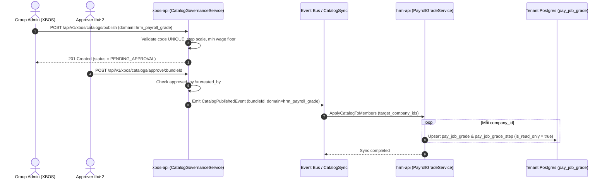

# TechSpec — Technical Specification for Wave 1: Danh mục Ngạch bậc lương

| Meta | Value |
|---|---|
| work_item_id | BA-HRM-PAYROLL-GRADE-TECHSPEC-01 |
| ref_srs | [BA_HRM_PAYROLL_GRADE_SRS_01_20260813.md](file:///C:/Users/ADMIN/OneDrive/Ta%CC%80i%20li%C3%AA%CC%A3u/Vibe%20Coding/projects/xevn-ecosystem/docs/program/deltas/BA_HRM_PAYROLL_GRADE_SRS_01_20260813.md) (v2) |
| ref_program | [PO_HRM_CNTT_PAYROLL_CATALOG_PROGRAM.md](file:///C:/Users/ADMIN/OneDrive/Ta%CC%80i%20li%C3%AA%CC%A3u/Vibe%20Coding/projects/xevn-ecosystem/docs/program/PO_HRM_CNTT_PAYROLL_CATALOG_PROGRAM.md) |
| Domain | `hrm_payroll_grade` |
| Master Scope | `xevn/holding` (Publish master catalog down to member tenants) |
| Ngày | 2026-08-13 |
| Trạng thái | CONFIRMED — Sẵn sàng cho DB_DESIGN & API_DESIGN |

---

## 1. Tổng quan Kiến trúc Technical

### 1.1. Luồng dữ liệu Master -> Tenant Sync
Dữ liệu Ngạch bậc lương tuân theo kiến trúc **XBOS Master Catalog Governance** (`docs/program/specs/BA-CNTT-PAYROLL-CATALOG-ARCH-01.md` §1):

1. **Master Write (XBOS Level):** Quản trị viên Tập đoàn gọi API `PublishCatalogDto` tại scope `xevn/holding` với `domain = "hrm_payroll_grade"`.
2. **Dual-Approval Gate:** Yêu cầu ban hành đi qua workflow `group_catalog_approval` (cần 2 chữ ký phê duyệt độc lập trước khi kích hoạt `status = PUBLISHED`).
3. **Tenant Read-Only Sync:** Khi được Apply xuống công ty thành viên (`ApplyCatalogToMembersDto`), service `CatalogSyncService` của HRM API thực hiện upsert dữ liệu vào 2 bảng local của tenant: `pay_job_grade` và `pay_job_grade_step`.
4. **Tenant Enforcement:** Tenant `HR Admin` chỉ được đọc (`GET /api/v1/hrm/payroll-grades`). API từ chối mọi thao tác `POST`/`PUT`/`DELETE` trực tiếp từ tenant header (`HTTP 403 Forbidden`).

---

## 2. Ràng buộc Kỹ thuật & Logic Validation

### 2.1. Logic Validation khi Publish Ngạch Bậc

| Yêu cầu SRS | Quy tắc Kỹ thuật / Code Check | HTTP Error Code |
|---|---|---|
| Mã ngạch duy nhất | `code` UNIQUE trong bundle `domain=hrm_payroll_grade` đang `PUBLISHED` | `409 Conflict` |
| Không để trống bậc giữa | Kiểm tra mảng `steps`: nếu tồn tại `step_number = i` thì phải tồn tại `step_number = 1..i-1` | `400 Bad Request` |
| Mức lương tăng dần theo bậc | `steps[i].base_salary >= steps[i-1].base_salary` với mọi `i > 1` | `400 Bad Request` |
| Sàn lương tối thiểu | `steps[0].base_salary >= REGIONAL_MIN_WAGE[VUNG_I]` (theo NĐ 293/2025/NĐ-CP & NĐ 128/2025/NĐ-CP) | `400 Bad Request` |
| Dual-approval 2 người | `created_by_user_id != approved_by_user_id` | `403 Forbidden` |
| Tenant không sửa | Thao tác ghi yêu cầu scope header `xevn/holding` | `403 Forbidden` |

---

## 3. Sơ đồ Tương tác Thành phần (Component Sequence)

---

## 4. Quyết định Thiết kế (ADR - Architectural Decision Record)

- **ADR-01 (Soft Delete & Versioning):** Không hỗ trợ `DELETE` bản ghi ngạch bậc cũ đã có dữ liệu nhân viên/hợp đồng tham chiếu. Khi Tập đoàn ban hành mức lương mới, tạo 1 Catalog Bundle mới với `effective_date` mới. Dữ liệu cũ giữ nguyên trạng thái `archived` để phục vụ tra soát lịch sử bảng lương.
- **ADR-02 (Atomic Upsert Sync):** Phân phối xuống tenant dùng `prisma.$transaction` để đảm bảo hoặc toàn bộ ngạch bậc của bundle được ghi vào `pay_job_grade`, hoặc rollback toàn bộ nếu có 1 bản ghi lỗi.
