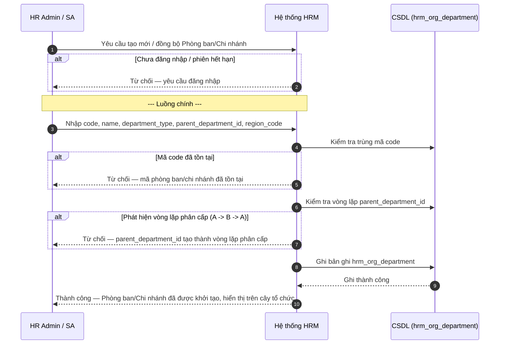
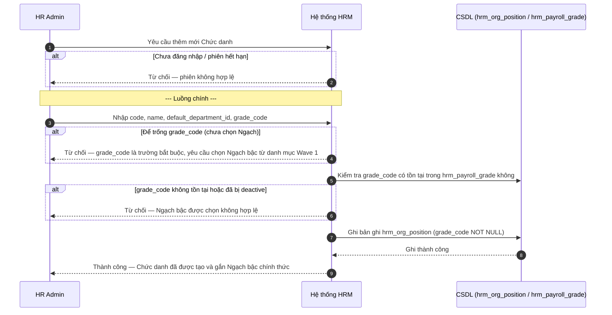

# SRS — Danh mục Chức danh & Phòng ban/Chi nhánh (Wave 3)

| Mã tài liệu | BA-HRM-POSITION-DEPARTMENT-SRS-01 |
| --- | --- |
| Phiên bản | v2 (viết lại đúng chuẩn 7 mục per UC, thay thế bản nháp v1) |
| Ref Program | `docs/program/PO_HRM_CNTT_PAYROLL_CATALOG_PROGRAM.md` (Wave 3) |
| Phụ thuộc | Wave 1 — `BA_HRM_PAYROLL_GRADE_SRS_01_20260813.md` (danh mục `hrm_payroll_grade` phải ban hành trước khi Wave 3 gán Ngạch cho Chức danh) |
| Nguồn nghiệp vụ | `SYNTHESIS-CNTT-PAYROLL-REAL-20260813.xlsx` sheet "Danh mục" (13 Chức danh, 4 Phòng ban chức năng, 6 Chi nhánh địa lý + 1 chi nhánh con Phù Ninh) |
| Ngày | 2026-08-13 |
| Trạng thái | DRAFT — đã nghiệm thu chuẩn 7 mục, sẵn sàng cho thiết kế kỹ thuật (TechSpec) |

---

## 1. Giới thiệu

### 1.1. Mục đích
Tài liệu này mô tả chi tiết Yêu cầu Nghiệp vụ (SRS) cho 2 domain danh mục tổ chức phụ thuộc lẫn nhau:
1. **`hrm_org_department` (Phòng ban / Chi nhánh)** — bao gồm Phòng ban chức năng cấp Tập đoàn (`department_type=functional`) và Chi nhánh địa lý cấp đơn vị (`department_type=branch`), hỗ trợ phân cấp cha-con (`parent_department_id`) và gắn vùng lương tối thiểu (`region_code` theo NĐ 293/2025/NĐ-CP & NĐ 128/2025/NĐ-CP).
2. **`hrm_org_position` (Chức danh)** — chuẩn hoá 13 chức danh nghiệp vụ thực tế từ text tự do (Lái xe tuyến, Nhân viên tổng đài, Trưởng chi nhánh...) thành danh mục có cấu trúc, **BẮT BUỘC gán với 1 Ngạch bậc lương (`grade_code` từ Wave 1)**.

### 1.2. Phạm vi
- **Trong phạm vi:** Ban hành, phân loại, đồng bộ từ XBOS master down tenant, gán Ngạch bậc lương cho Chức danh, gắn Vùng lương cho Chi nhánh địa lý, phân cấp Phòng ban/Chi nhánh cha-con.
- **Ngoài phạm vi:** Tạo hồ sơ/hợp đồng nhân viên (module Employee/Contract), định nghĩa công thức lương chi tiết theo chức danh (Wave 10), cấu hình workflow duyệt bảng lương theo chi nhánh.

---

## 2. Mô tả tổng quan luồng nghiệp vụ

| Bước | Vai trò | Mô tả |
| --- | --- | --- |
| 1 | SA / Quản trị viên XBOS | Ban hành danh mục Phòng ban chức năng (read-only) và Chi nhánh địa lý SEED từ Tập đoàn (`xevn/holding`) |
| 2 | HR Admin (Tenant) | Tiếp nhận danh mục Phòng ban/Chi nhánh đồng bộ từ XBOS; tự thêm Chi nhánh địa lý cục bộ nếu có mở rộng |
| 3 | HR Admin (Tenant) | Tạo/chuẩn hoá Chức danh nghiệp vụ — BẮT BUỘC chọn 1 Ngạch bậc lương (Wave 1) + gán Phòng ban/Chi nhánh mặc định |
| 4 | Hệ thống Payroll / Hồ sơ | Đọc `grade_code` và `department_id` của Chức danh để áp sàn lương tối thiểu và phân nhóm bảng lương |

---

## 3. Yêu cầu chức năng (FR / UC)

### FR-UC-DEPT-01 — Ban hành & Quản lý Danh mục Phòng ban / Chi nhánh

| Thuộc tính | Mô tả |
| --- | --- |
| **Actor** | Quản trị viên XBOS (`xevn/holding`), HR Admin (tenant công ty thành viên) |
| **Ưu tiên** | Cao |
| **Điều kiện tiên quyết** | Đã đăng nhập hệ thống với quyền Quản trị danh mục tổ chức |
| **Điều kiện hậu** | Bảng `hrm_org_department` lưu đủ thông tin Phòng ban/Chi nhánh, sẵn sàng dùng cho phân cấp và gán Chức danh |
| **Mã UC** | UC-HRM-DEPT-01 |
| **Liên hệ phần mềm hiện tại** | Đã có khái niệm Phòng ban cơ bản, nâng cấp hỗ trợ `department_type` (functional vs branch), `parent_department_id`, và `region_code` |

**Dữ liệu đầu vào:**

| Trường | Bắt buộc | Ràng buộc / kiểm tra |
| --- | --- | --- |
| Mã phòng ban/chi nhánh (`code`) | Có | Duy nhất toàn hệ thống (XBOS publish) hoặc duy nhất trong tenant (nếu là local extension) |
| Tên phòng ban/chi nhánh (`name`) | Có | Không để trống |
| Loại tổ chức (`department_type`) | Có | ENUM: `functional` (Phòng ban chức năng Tập đoàn) hoặc `branch` (Chi nhánh địa lý) |
| Mã phòng ban cha (`parent_department_id`) | Không | Self-reference FK, NULLABLE. Hệ thống PHẢI kiểm tra chặn vòng lặp (A -> B -> A) |
| Mã vùng lương (`region_code`) | Không | Chỉ áp dụng khi `department_type=branch`. Thuộc Vùng I, II, III, IV theo NĐ 293/2025 & NĐ 128/2025 |
| Trạng thái | Có | ENUM: `active` (Hoạt động) hoặc `inactive` (Ngừng dùng) |

**Luồng chính:**

1. User (SA/Admin) mở màn hình "Quản lý Phòng ban / Chi nhánh", chọn "Thêm mới" hoặc "Đồng bộ từ XBOS".
2. Nhập/chọn `code`, `name`, `department_type` (`functional` hoặc `branch`).
3. Nếu là Chi nhánh địa lý (`branch`), chọn `region_code` (Vùng lương tối thiểu) và `parent_department_id` (nếu là chi nhánh con, ví dụ Chi nhánh Phù Ninh thuộc Chi nhánh Phú Thọ).
4. Hệ thống kiểm tra hợp lệ: không trùng mã, không tạo vòng lặp phân cấp cha-con.
5. User bấm Lưu / Ban hành.
6. Hệ thống lưu bản ghi `hrm_org_department`, hiển thị dạng cây (tree view) trên UI.

**Quy tắc nghiệp vụ:**

- **BR-DEPT-01:** Phòng ban chức năng (`functional`: VTHK, VTHH, HCNS, TCKT) là cơ cấu Tập đoàn, do XBOS ban hành read-only xuống tenant, tenant không được tự xóa/sửa. Chi nhánh địa lý (`branch`: Việt Trì, Yên Bái, Nam Định...) cho phép tenant thêm mới cục bộ (`catalog_extensions`).
- **BR-DEPT-02:** Kiểm tra vòng lặp phân cấp: 1 phòng ban không thể là tổ tiên của chính nó (`parent_department_id` không được trỏ vào chính mình hoặc các node con của mình).
- **BR-DEPT-03:** Chi nhánh địa lý có `region_code` để làm căn cứ tính lương tối thiểu vùng tự động cho nhân viên làm việc tại worksite đó.

**Sơ đồ tương tác:**

**Diễn biến nghiệp vụ (theo sơ đồ):**

| # | Tương tác | Điều kiện / quy tắc | Kết quả hoặc lỗi |
| --- | --- | --- | --- |
| 1 | Yêu cầu mở form tạo mới Phòng ban/Chi nhánh | — | Hệ thống mở form nhập liệu |
| 2 | Kiểm tra phiên đăng nhập | Chưa đăng nhập / phiên hết hạn | Từ chối — báo lỗi auth |
| 3 | Nhập mã, tên, loại tổ chức, phòng ban cha, vùng lương | Theo bảng Dữ liệu đầu vào | Tiếp tục |
| 4 | Kiểm tra trùng mã code | BR-DEPT-01 | Từ chối — báo lỗi trùng mã |
| 5 | Kiểm tra đệ quy parent_department_id | BR-DEPT-02 | Từ chối — báo lỗi vòng lặp phân cấp |
| 6 | Ghi dữ liệu vào CSDL | Tất cả kiểm tra hợp lệ | Thành công — lưu bản ghi |
| 7 | Trả kết quả hiển thị tree view | Bản ghi đã lưu | Thành công — cây tổ chức cập nhật node mới |

**Kết quả trả về khi thành công:**

| Ý | Nội dung |
| --- | --- |
| Người dùng thấy | Thông báo "Thêm mới Phòng ban/Chi nhánh thành công"; cây tổ chức cập nhật node mới đúng vị trí phân cấp |
| Bản ghi tạo/cập nhật | Bản ghi `hrm_org_department` (mã, tên, type, parent_id, region_code, status) |
| Khóa mang sang bước sau | `department_id` (dùng để gán phòng ban mặc định cho Chức danh ở UC-HRM-POS-01) |
| Trạng thái sau | `active` |
| Việc được mở khóa tiếp | UC-HRM-POS-01 (Tạo Chức danh gắn Phòng ban/Chi nhánh mặc định) |

---

### FR-UC-POS-01 — Ban hành & Quản lý Danh mục Chức danh (BẮT BUỘC gán Ngạch bậc)

| Thuộc tính | Mô tả |
| --- | --- |
| **Actor** | Quản trị viên XBOS, HR Admin (tenant) |
| **Ưu tiên** | Cao |
| **Điều kiện tiên quyết** | Danh mục Ngạch bậc lương (`hrm_payroll_grade` - Wave 1) đã được ban hành và áp dụng |
| **Điều kiện hậu** | Bản ghi `hrm_org_position` có `grade_code` NOT NULL, sẵn sàng gán cho nhân viên/hợp đồng |
| **Mã UC** | UC-HRM-POS-01 |
| **Liên hệ phần mềm hiện tại** | Đã có màn hình Chức danh nhưng là text tự do; v2 chuyển sang danh mục chuẩn hoá bắt buộc gán Ngạch bậc |

**Dữ liệu đầu vào:**

| Trường | Bắt buộc | Ràng buộc / kiểm tra |
| --- | --- | --- |
| Mã chức danh (`code`) | Có | Duy nhất trong toàn danh mục |
| Tên chức danh (`name`) | Có | Không để trống (VD: "Lái xe tuyến", "Nhân viên tổng đài", "Trưởng chi nhánh") |
| Mã ngạch bậc (`grade_code`) | **Có (BẮT BUỘC)** | FK tới `hrm_payroll_grade.code`. KHÔNG ĐƯỢC ĐỂ TRỐNG. Không auto-map từ text |
| Phòng ban mặc định (`default_department_id`) | Không | FK tới `hrm_org_department.id`, NULLABLE |
| Ghi chú / Thang lương cũ tham chiếu | Không | Ghi nhận thông tin như "Hệ số 20 QC 2020" để tham chiếu lịch sử, không dùng làm logic tính lương |
| Trạng thái | Có | ENUM: `active` hoặc `inactive` |

**Luồng chính:**

1. HR Admin mở màn hình "Quản lý Chức danh", chọn "Thêm mới Chức danh".
2. Nhập `code`, `name`, chọn `default_department_id` (nếu có).
3. **Bắt buộc chọn `grade_code`** từ dropdown chứa 11 Ngạch bậc QĐ 2A (Wave 1: D1-E2).
4. Hệ thống kiểm tra hợp lệ: `grade_code` có tồn tại trong danh mục Ngạch bậc active hay không.
5. HR Admin bấm Lưu.
6. Hệ thống ghi nhận bản ghi `hrm_org_position` với `grade_code` NOT NULL.

**Quy tắc nghiệp vụ:**

- **BR-POS-01:** `grade_code` là trường bắt buộc (NOT NULL). UI chặn lưu nếu HR Admin không chọn Ngạch. Cấm mọi cơ chế auto-map/fuzzy-match từ tên Chức danh ra Ngạch bậc (hai thang lương cũ/mới khác nhau).
- **BR-POS-02:** Chuẩn hoá 13 Chức danh free-text từ thực tế (Lái xe tuyến, Nhân viên tổng đài, Trưởng bưu cục, Trưởng ca, Lái xe dự phòng, Lái xe tải dự án, Lái xe container, Phụ lái, Trưởng chi nhánh, Điều hành VP, Lái xe trung chuyển, Kế toán VP). Mỗi chức danh free-text map 1-1 vào 1 mã chức danh chuẩn.
- **BR-POS-03:** Các Chức danh Văn phòng tỉnh có hệ số lương cũ (QC 2020: 20/17/16/12) chỉ hiển thị nhãn tham chiếu lịch sử, không tự động coi hệ số đó là Ngạch bậc QĐ 2A.

**Sơ đồ tương tác:**

**Diễn biến nghiệp vụ (theo sơ đồ):**

| # | Tương tác | Điều kiện / quy tắc | Kết quả hoặc lỗi |
| --- | --- | --- | --- |
| 1 | Mở form tạo Chức danh | — | Mở form với dropdown Ngạch bậc nạp từ Wave 1 |
| 2 | Kiểm tra phiên đăng nhập | Chưa đăng nhập / hết phiên | Từ chối — báo lỗi xác thực |
| 3 | Nhập mã, tên chức danh, chọn phòng ban | — | Tiếp tục |
| 4 | Kiểm tra `grade_code` | BR-POS-01 — không được để trống | Từ chối nếu thiếu `grade_code` |
| 5 | Kiểm tra tồn tại của Ngạch bậc trong CSDL | FK constraint tới `hrm_payroll_grade` | Từ chối nếu Ngạch không tồn tại |
| 6 | Ghi bản ghi Chức danh | Thông tin hợp lệ | Thành công — lưu `hrm_org_position` |
| 7 | Trả kết quả hiển thị | Bản ghi đã lưu | Thành công — hiển thị Chức danh kèm Ngạch đã gắn |

**Kết quả trả về khi thành công:**

| Ý | Nội dung |
| --- | --- |
| Người dùng thấy | Thông báo "Thêm mới Chức danh [Tên] thành công (Ngạch: [Mã ngạch])"; danh sách Chức danh cập nhật |
| Bản ghi tạo/cập nhật | Bản ghi `hrm_org_position` (code, name, grade_code, default_department_id, status) |
| Khóa mang sang bước sau | `position_id` / `code` (dùng cho Hồ sơ nhân viên và Hợp đồng lao động) |
| Trạng thái sau | `active` |
| Việc được mở khóa tiếp | Gán Chức danh cho Nhân viên; dùng Chức danh lọc điều kiện trong Formula Engine (Wave 10) |

---

## 4. Yêu cầu phi chức năng (NFR)

| Mã | Yêu cầu |
| --- | --- |
| NFR-POSDEPT-01 | Cây tổ chức Phòng ban/Chi nhánh hiển thị mượt mà với cấu trúc phân cấp đệ quy đến 5 cấp. |
| NFR-POSDEPT-02 | Giao diện chọn Ngạch bậc khi tạo Chức danh có bộ lọc tìm kiếm nhanh theo mã/tên Ngạch. |
| NFR-POSDEPT-03 | Toàn bộ thao tác thay đổi Chức danh/Phòng ban đều được lưu Log thay đổi (`audit_log`) ghi nhận User và thời gian. |

---

## 5. Giao diện ngoài (UI Requirements)

- **Màn hình Cây tổ chức Phòng ban/Chi nhánh:** Tree view phân cấp, phân biệt màu/icon giữa `functional` (Phòng ban chức năng read-only) và `branch` (Chi nhánh địa lý). Hỗ trợ bấm vào Chi nhánh để xem `region_code` (Vùng lương).
- **Màn hình Danh mục Chức danh:** Bảng danh sách Chức danh có cột "Ngạch bậc gán" hiển thị rõ mã và tên Ngạch. Form tạo/sửa bắt buộc chọn Ngạch từ danh sách dropdown.

---

## 6. Ràng buộc nghiệp vụ tổng quát

- Không xóa cứng (`hard-delete`) bất kỳ Chức danh hay Phòng ban nào đã có dữ liệu nhân viên/hợp đồng tham chiếu — chỉ chuyển trạng thái `inactive`.
- Mọi Chức danh mới tạo bắt buộc phải có Ngạch bậc — không có ngoại lệ.

---

## 7. Vấn đề còn hở, cần xác nhận thêm

- Chi nhánh Phù Ninh là chi nhánh con của Phú Thọ — TechSpec sẽ tạo 1 bản ghi seed riêng `cn_phu_ninh` với `parent_department_id = cn_phu_tho`.
