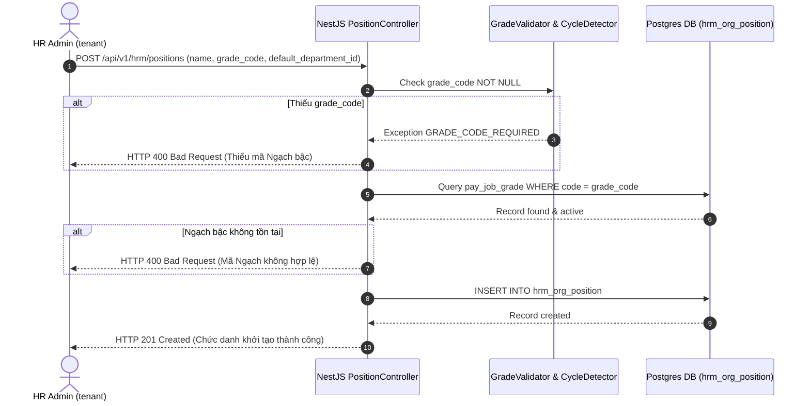

# TechSpec — Technical Specification for Wave 3: Danh mục Chức danh & Phòng ban/Chi nhánh

| Meta | Value |
|---|---|
| work_item_id | BA-HRM-POSITION-DEPARTMENT-TECHSPEC-01 |
| ref_srs | [BA_HRM_POSITION_DEPARTMENT_SRS_01_20260813.md](file:///C:/Users/ADMIN/OneDrive/Ta%CC%80i%20li%C3%AA%CC%A3u/Vibe%20Coding/projects/xevn-ecosystem/docs/program/deltas/BA_HRM_POSITION_DEPARTMENT_SRS_01_20260813.md) (v2) |
| ref_program | [PO_HRM_CNTT_PAYROLL_CATALOG_PROGRAM.md](file:///C:/Users/ADMIN/OneDrive/Ta%CC%80i%20li%C3%AA%CC%A3u/Vibe%20Coding/projects/xevn-ecosystem/docs/program/PO_HRM_CNTT_PAYROLL_CATALOG_PROGRAM.md) |
| Domain | `hrm_org_position`, `hrm_org_department` |
| Phụ thuộc | Wave 1 (`hrm_payroll_grade` must exist for `grade_code` foreign key validation) |
| Ngày | 2026-08-13 |
| Trạng thái | CONFIRMED — Sẵn sàng cho DB_DESIGN & API_DESIGN |

---

## 1. Tổng quan Kiến trúc Technical

### 1.1. Dual-Domain Model Architecture

Wave 3 xử lý 2 domain danh mục có mối quan hệ chặt chẽ với nhau:

1. **`hrm_org_department` (Phòng ban / Chi nhánh):**
   - Phân loại bằng `department_type`:
     - `functional`: 4 phòng ban chức năng Tập đoàn (VTHK, VTHH, HCNS, TCKT), XBOS master publish read-only (`xevn/holding`).
     - `branch`: 6 Chi nhánh tỉnh (Việt Trì, Yên Bái, Nam Định, Phú Thọ, Ninh Bình, Thái Bình) + 1 Chi nhánh con (Phù Ninh). Cho phép tenant tạo local extension.
   - Phân cấp cây tổ chức: `parent_department_id` (self-referencing FK). Service có đệ quy kiểm tra chặn vòng lặp (`CycleDetectionService`).
   - Gắn Vùng lương tối thiểu: `region_code` (`REGION_I`, `REGION_II`, `REGION_III`, `REGION_IV`) để làm căn cứ tự động áp lương tối thiểu vùng cho worksite chi nhánh.

2. **`hrm_org_position` (Chức danh):**
   - Tương ứng 13 chức danh nghiệp vụ chuẩn hoá từ text tự do.
   - **`grade_code` constraint:** Foreign Key tới `pay_job_grade.code` (Wave 1). Trường `grade_code` **BẮT BUỘC NOT NULL**.
   - `default_department_id`: Gắn phòng ban/chi nhánh mặc định (NULLABLE).

---

## 2. Ràng buộc Kỹ thuật & Validation Logic

| Yêu cầu SRS | Quy tắc Kỹ thuật / Code Check | HTTP Error Code |
|---|---|---|
| `grade_code` NOT NULL khi tạo Chức danh | `if (!dto.gradeCode) throw new BadRequestException('GRADE_CODE_REQUIRED')` | `400 Bad Request` |
| `grade_code` tồn tại & active | `SELECT 1 FROM pay_job_grade WHERE code = dto.gradeCode AND status = 'active'` | `400 Bad Request` |
| Chặn đệ quy vòng lặp Phòng ban | Chạy BFS/DFS check từ `parent_department_id` lên root node: nếu gặp `id` hiện tại -> Ném lỗi `DEPARTMENT_CYCLE_DETECTED` | `400 Bad Request` |
| Phòng ban chức năng read-only | `if (department.type === 'functional' && !isGroupAdmin) throw new ForbiddenException()` | `403 Forbidden` |
| Trùng mã Chức danh | `code` UNIQUE trong tenant/company | `409 Conflict` |

---

## 3. Algorithm: Chặn Vòng Lặp Phân Cấp (`CycleDetectionService`)

```typescript
async validateNoDepartmentCycle(departmentId: string, targetParentId: string): Promise<void> {
  if (departmentId === targetParentId) {
    throw new BadRequestException('A department cannot be its own parent');
  }

  let currentId = targetParentId;
  const visited = new Set<string>();

  while (currentId) {
    if (currentId === departmentId) {
      throw new BadRequestException('Circular dependency detected in department hierarchy');
    }
    visited.add(currentId);
    
    const parent = await this.prisma.payDepartment.findUnique({
      where: { id: currentId },
      select: { parentDepartmentId: true }
    });
    
    currentId = parent?.parentDepartmentId;
    if (currentId && visited.has(currentId)) {
      throw new BadRequestException('Existing circular chain in database');
    }
  }
}
```

---

## 4. Sequence Diagram Tương tác Đăng ký Chức danh (gắn Ngạch bậc)


