# PO-HRM-PAY-CNTT-STP-SRS-DELTA-01 — Thiết lập lương (ADD-only)

| Field | Value |
|-------|--------|
| **work_item_id** | `PO-HRM-PAY-CNTT-SRS-DELTA-01` |
| **parent** | `PO-HRM-PAY-XEVN-CUSTOMER-CNTT-INTAKE-01` |
| **sponsor_confirm** | 2026-08-11 — ADD-only `UC-BP-PAY-STP-01..12` |
| **lane** | governance · **cấm** `apps/**` |
| **change_mode** | **ADD-only** — không REPLACE FR-UC-BP-PAY-01..09 đã GWC |
| **honesty** | `payroll_e2e_ready=false` · Thiết lập ≠ UAT lập bảng · U65 zero-seed |
| **Team merge pointer** | `docs/hrm/SRS.md` **§16.9** |
| **Inputs** | `PO-HRM-PAY-CNTT-BA-PROCESS-01.md` · `PO-HRM-PAY-CNTT-GAP-SYNTH-01.md` |

**Mục tiêu:** Mở module **Thiết lập lương** (menu C&B) — metadata-driven cho **≥6 mô hình bảng** pack P.CNTT; tách khỏi **Lập bảng lương** (runtime FR-UC-BP-PAY-06).

**E2E spine (Thiết lập trước runtime):**

```text
STP-01 CHUNG → STP-02 RIÊNG/BP → STP-03..06 tham số → STP-07 catalog TP
 → STP-08 fragment → STP-09 nhóm NV → STP-10 mẫu → STP-11 multi-mẫu → STP-12 input pack
 → (sau LIVE) PAY-02 công thức · PAY-06 chạy kỳ
```

---

## 0. Actors · BR chung · AC chéo

| Actor | Vai trò |
|-------|---------|
| **C&B tập đoàn** | Policy CHUNG · thang bậc · catalog TP starter |
| **C&B đơn vị / BP** | Bind RIÊNG · mẫu OU · input pack theo mô hình |
| **Kế toán lương** | Xem tham số · chọn mẫu khi lập kỳ (read) |

| BR-ID | Điều kiện | Hành động | Fail nếu |
|-------|-----------|-----------|----------|
| **BR-PAY-STP-01** | Scope CHUNG | Chỉ C&B tập đoàn sửa trường khóa thang bậc | OU override im lặng |
| **BR-PAY-STP-02** | Scope RIÊNG-{BP} | Bind ≥1 OU/BP; `effective_from` bắt buộc | Gộp CHUNG+RIÊNG một form |
| **BR-PAY-STP-03** | Tạo mẫu | `applicability` hợp lệ scope JWT | Mẫu global không audit |
| **BR-PAY-STP-04** | Cột mẫu gắn TP | `component_code` ∈ catalog hiệu lực | Free-text mã SoT |
| **BR-PAY-STP-05** | Override CT cột | Chỉ FK công thức **đã phát hành** | Biểu thức inline runtime |
| **BR-PAY-STP-06** | Khai báo input pack | Mỗi type có ≥1 writer (UI/import/ATT) | Type orphan |
| **BR-PAY-STP-07** | Lập kỳ | Chọn mẫu **active** cho OU/NV | Kỳ không bind mẫu |
| **BR-PAY-STP-08** | Đổi mẫu/policy sau process | Từ chối hoặc chỉ kỳ mới | Hot-swap giữa kỳ |

| AC-ID | Pass (U65) | Fail |
|-------|------------|------|
| **AC-PAY-STP-GLOBAL-01** | Mọi mutate Thiết lập: Lưu → API 2xx → list/detail cập nhật ngay; F5 còn | Spinner vô hạn; mất sau F5 |
| **AC-PAY-STP-GLOBAL-02** | OU ĐPHH chỉ thấy mẫu/policy applicability ĐPHH | Mẫu TĐHK lẫn OU |
| **AC-PAY-STP-GLOBAL-03** | Không hardcode `if (bp==='DPHH')` trên UI — picker metadata | Cột/mẫu cố định theo enum Nest |

---

## FR-UC-BP-PAY-STP-01 — Quản lý policy pack CHUNG

#### Thông tin chung

| Mục | Nội dung |
|-----|----------|
| Tác nhân | C&B tập đoàn |
| Ưu tiên | Cao — P0 Thiết lập |
| Tiên quyết | Đăng nhập scope tập đoàn; quyền sửa chính sách CHUNG |
| Hậu điều kiện | Pack CHUNG (QĐ 2A thang bậc · QĐ 127A) lưu hiệu lực toàn group |
| Liên hệ phần mềm hiện tại | Settings thuế/BH partial; **chưa** master thang bậc metadata |
| BR | BR-PAY-STP-01 |

**Mục đích:** Lưu tham số lương **dùng chung** tập đoàn (thang bậc · quy chế lương · lịch PVTHK) — không gộp policy riêng BP.

#### Dữ liệu đầu vào

| Trường | Bắt buộc | Quy tắc |
|--------|----------|---------|
| Mã pack CHUNG | Có | Một phiên bản active theo `effective_from` |
| Tham số thang/QĐ | Có | Theo QĐ 2A · 127A (inventory khách) |
| Ngày hiệu lực | Có | `effective_from` ≤ `effective_to` nếu có |
| Ghi chú | Không | Audit |

#### Luồng chính

1. C&B tập đoàn mở **Thiết lập lương → Policy CHUNG**.
2. Nhập hoặc cập nhật tham số thang bậc / quy chế.
3. Lưu → hệ thống validate scope CHUNG.
4. F5 → bản ghi còn; OU không sửa trường khóa thang bậc.

#### Quy tắc nghiệp vụ

- BR-PAY-STP-01: CHUNG chỉ C&B tập đoàn sửa; OU không override thang bậc im lặng.
- Pack CHUNG ≠ pack RIÊNG BP — tách UC STP-02.

#### Trường hợp đặc biệt

| Tình huống | Hệ thống xử lý |
|------------|----------------|
| C&B đơn vị sửa pack CHUNG | Từ chối 403 |
| Trùng `effective_from` hai bản CHUNG | Từ chối hoặc buộc đóng bản cũ |
| Thiếu tham số bắt buộc QĐ 2A | 400 + nhắc trường |

#### Sơ đồ tương tác

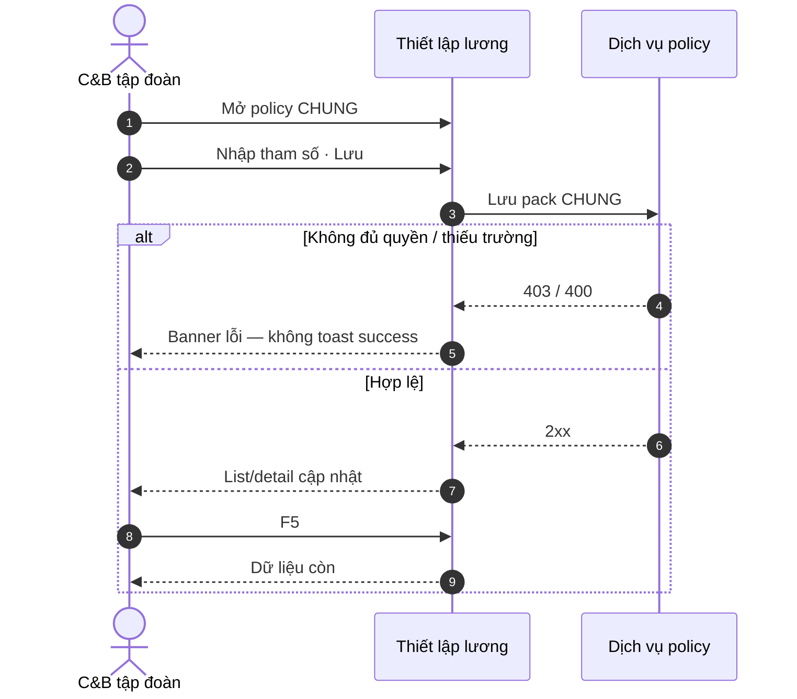

#### Diễn biến nghiệp vụ

| # | Tương tác | Điều kiện / quy tắc | Kết quả hoặc lỗi |
|---|-----------|---------------------|------------------|
| 1 | Mở policy CHUNG | Scope group | Form hiện bản active hoặc trống honest |
| 2 | Nhập tham số | BR-PAY-STP-01 | Bản nháp hợp lệ |
| 3 | Lưu | Validate QĐ | 2xx; row trên list |
| 4 | F5 | — | AC-PAY-STP-01; AC-PAY-STP-GLOBAL-01 |
| Thành công | — | — | Pack CHUNG hiệu lực; UC kế = bind RIÊNG STP-02 |

**AC:** **AC-PAY-STP-01** — C&B → Thiết lập → tạo policy CHUNG (QĐ 2A) → Lưu 2xx → F5 còn.

---

## FR-UC-BP-PAY-STP-02 — Bind policy RIÊNG theo OU / BP

#### Thông tin chung

| Mục | Nội dung |
|-----|----------|
| Tác nhân | C&B đơn vị · C&B BP (ĐPHH · TĐHK · LX · VP…) |
| Ưu tiên | Cao |
| Tiên quyết | Pack RIÊNG hoặc fragment theo BP; OU hợp lệ scope |
| Hậu điều kiện | OU/BP gắn pack riêng; list mẫu lọc theo applicability |
| Liên hệ phần mềm hiện tại | **MISSING** bind policy theo BP |
| BR | BR-PAY-STP-02 · BR-PAY-STP-03 |

**Mục đích:** Gắn policy **RIÊNG** (ĐPHH · TĐHK · LX tuyến · LX tải · VP tỉnh…) với pháp nhân/BP — **cấm** gộp CHUNG+RIÊNG một form.

#### Dữ liệu đầu vào

| Trường | Bắt buộc | Quy tắc |
|--------|----------|---------|
| OU / BP tag | Có | Trong scope JWT |
| Mã policy RIÊNG | Có | Fragment catalog (khi mount pack) |
| `effective_from` | Có | Bắt buộc |
| Pack CHUNG tham chiếu | Không | Kế thừa read-only |

#### Luồng chính

1. C&B OU mở **Bind policy RIÊNG**.
2. Chọn BP (ĐPHH / TĐHK / …) và OU áp dụng.
3. Chọn pack / fragment; nhập hiệu lực.
4. Lưu 2xx → list mẫu chỉ hiện applicability khớp BP.

#### Quy tắc nghiệp vụ

- BR-PAY-STP-02: Một bind = một scope RIÊNG; không merge CHUNG fields vào form RIÊNG.
- BR-PAY-STP-03: Mẫu sau bind chỉ visible đúng OU/BP.

#### Trường hợp đặc biệt

| Tình huống | Hệ thống xử lý |
|------------|----------------|
| Bind OU ngoài scope | 403 |
| BP không có fragment | Empty + CTA tạo STP-03/05 |
| Đổi BP sau khi có mẫu active | Cảnh báo; không hot-swap giữa kỳ (BR-PAY-STP-08) |

#### Sơ đồ tương tác

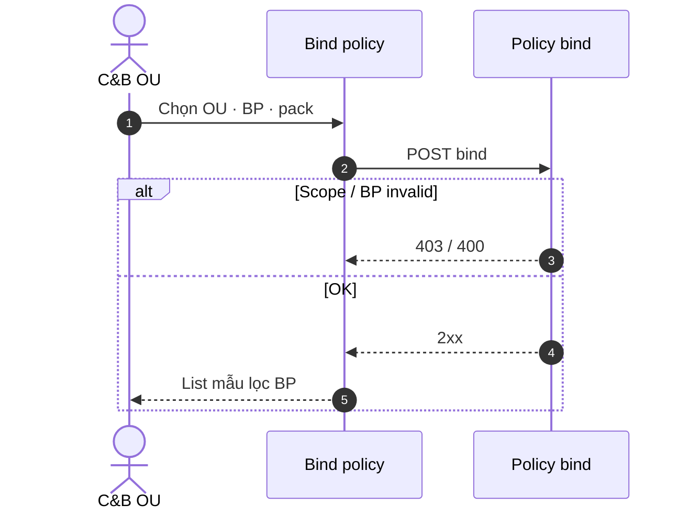

#### Diễn biến nghiệp vụ

| # | Tương tác | Điều kiện / quy tắc | Kết quả hoặc lỗi |
|---|-----------|---------------------|------------------|
| 1 | Chọn OU/BP | Scope JWT | Form bind |
| 2 | Lưu bind | BR-PAY-STP-02 | 2xx |
| 3 | Mở list mẫu | BR-PAY-STP-03 | Chỉ mẫu applicability khớp |
| Thành công | — | — | AC-PAY-STP-02; AC-PAY-STP-GLOBAL-02 |

**AC:** **AC-PAY-STP-02** — Bind RIÊNG ĐPHH → list mẫu chỉ applicability ĐPHH.

---

## FR-UC-BP-PAY-STP-03 — Tham số KPI / PCCV / đơn giá

#### Thông tin chung

| Mục | Nội dung |
|-----|----------|
| Tác nhân | C&B BP (TĐHK · LX · VP…) |
| Ưu tiên | Cao |
| Tiên quyết | Policy RIÊNG đã bind (STP-02) hoặc CHUNG |
| Hậu điều kiện | Tham số số (KPI 1500/1731 · PCCV · CPSC · đơn giá tuyến) lưu theo QĐ |
| Liên hệ phần mềm hiện tại | **GAP** KPI catalog |
| BR | BR-PAY-STP-02 |

**Mục đích:** CRUD tham số số theo quyết định (KPI tổng đài · PCCV · đơn giá CPSC…) — metadata, không hardcode Nest.

#### Dữ liệu đầu vào

| Trường | Bắt buộc | Quy tắc |
|--------|----------|---------|
| Mã tham số | Có | Trong vocabulary BP |
| Giá trị số | Có | Định dạng số nghiệp vụ (vi-VN hiển thị) |
| Đơn vị / grain | Có | Theo QĐ (điểm · VND · %…) |
| Hiệu lực | Có | `effective_from` |

#### Luồng chính

1. Mở **Tham số KPI/PCCV** trong Thiết lập.
2. Thêm/sửa tham số theo BP.
3. Lưu → list cập nhật; F5 còn.

#### Quy tắc nghiệp vụ

- Tham số gắn policy pack — không file config tĩnh theo tỉnh trong mã nguồn.
- LX-TR: tham số DT/XDTN có thể dùng chung vocabulary STP-12.

#### Trường hợp đặc biệt

| Tình huống | Hệ thống xử lý |
|------------|----------------|
| Giá trị âm khi policy cấm | 400 |
| Sửa tham số đã dùng kỳ closed | Chỉ kỳ mới hoặc từ chối |

#### Sơ đồ tương tác

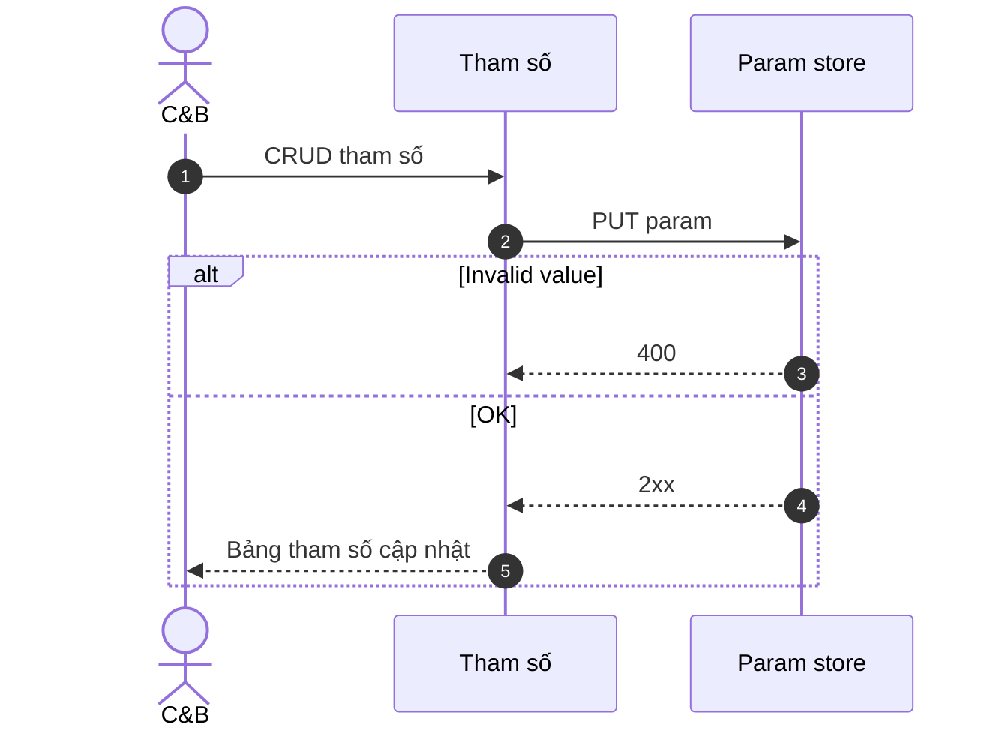

#### Diễn biến nghiệp vụ

| # | Tương tác | Điều kiện / quy tắc | Kết quả hoặc lỗi |
|---|-----------|---------------------|------------------|
| 1 | Thêm tham số | BP bind | Row mới |
| 2 | Lưu | Validate số | 2xx + FE list |
| 3 | F5 | AC-PAY-STP-GLOBAL-01 | Giá trị còn |
| Thành công | — | — | Input pack STP-12 đọc tham số |

---

## FR-UC-BP-PAY-STP-04 — Ngày công chuẩn theo OU

#### Thông tin chung

| Mục | Nội dung |
|-----|----------|
| Tác nhân | C&B · HCNS |
| Ưu tiên | Cao |
| Tiên quyết | OU TG/VP đã có policy bind |
| Hậu điều kiện | Chuẩn công theo OU; liên kết biến ATT khi chạy kỳ |
| Liên hệ phần mềm hiện tại | ATT chuẩn partial |
| BR | BR-PAY-STP-03 |

**Mục đích:** Cấu hình **ngày công chuẩn** (lương thời gian · VP) theo OU — nguồn biến cho engine sau ATT close.

#### Dữ liệu đầu vào

| Trường | Bắt buộc | Quy tắc |
|--------|----------|---------|
| OU | Có | Scope |
| Ngày công chuẩn / tháng | Có | Số > 0 |
| Năm / kỳ áp dụng | Có | Không overlap trái policy |

#### Luồng chính

1. Chọn OU (VP HN · TG…).
2. Nhập chuẩn công.
3. Lưu 2xx → F5; biến `BCC_STD` sẵn sàng cho STP-12.

#### Quy tắc nghiệp vụ

- Chuẩn công ≠ số ngày ATT thực tế — ATT là SoT giờ; chuẩn là tham số tính.

#### Trường hợp đặc biệt

| Tình huống | Hệ thống xử lý |
|------------|----------------|
| OU chưa bind policy | Cảnh báo trước Lưu |
| Đổi chuẩn giữa kỳ đã process | BR-PAY-STP-08 |

#### Sơ đồ tương tác

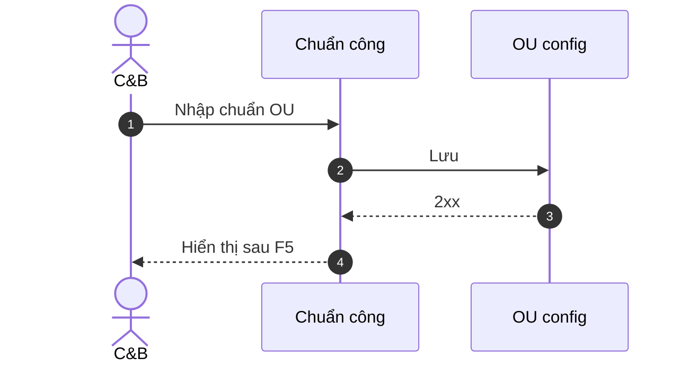

#### Diễn biến nghiệp vụ

| # | Tương tác | Điều kiện / quy tắc | Kết quả hoặc lỗi |
|---|-----------|---------------------|------------------|
| 1 | Cấu hình OU | Scope | Bản ghi chuẩn |
| 2 | Lưu | Validate | 2xx + FE |
| Thành công | — | — | Liên kết ATT-LINE / PAY-01 |

---

## FR-UC-BP-PAY-STP-05 — Policy theo địa bàn / tuyến

#### Thông tin chung

| Mục | Nội dung |
|-----|----------|
| Tác nhân | C&B LX · VP tỉnh |
| Ưu tiên | Cao |
| Tiên quyết | BP LX-T / LX-TR / VP-T |
| Hậu điều kiện | Đơn giá tuyến · CLDV · biến thể tỉnh lưu metadata |
| Liên hệ phần mềm hiện tại | **GAP** — 13 PDF LX theo tỉnh |
| BR | BR-PAY-STP-02 · BR-PAY-STP-03 |

**Mục đích:** Policy **theo địa bàn / tuyến** (LX tuyến · tỉnh · CLDV) — không enum 6 tỉnh trong mã nguồn.

#### Dữ liệu đầu vào

| Trường | Bắt buộc | Quy tắc |
|--------|----------|---------|
| Mã địa bàn / tuyến | Có | Catalog mở |
| Đơn giá / hệ số CLDV | Có | Theo PDF tỉnh |
| BP tag | Có | LX-T hoặc VP-T |

#### Luồng chính

1. Chọn BP và địa bàn.
2. CRUD tham số tuyến/CLDV.
3. Lưu → picker mẫu STP-11 lọc đúng tỉnh.

#### Quy tắc nghiệp vụ

- Nhiều tỉnh = nhiều row policy — không một row hardcode «tỉnh A–F».

#### Trường hợp đặc biệt

| Tình huống | Hệ thống xử lý |
|------------|----------------|
| PDF tỉnh supersede | `supersedes` trên fragment — đọc POLICY-DECOMPOSE |
| Trùng mã tuyến | 400 |

#### Sơ đồ tương tác

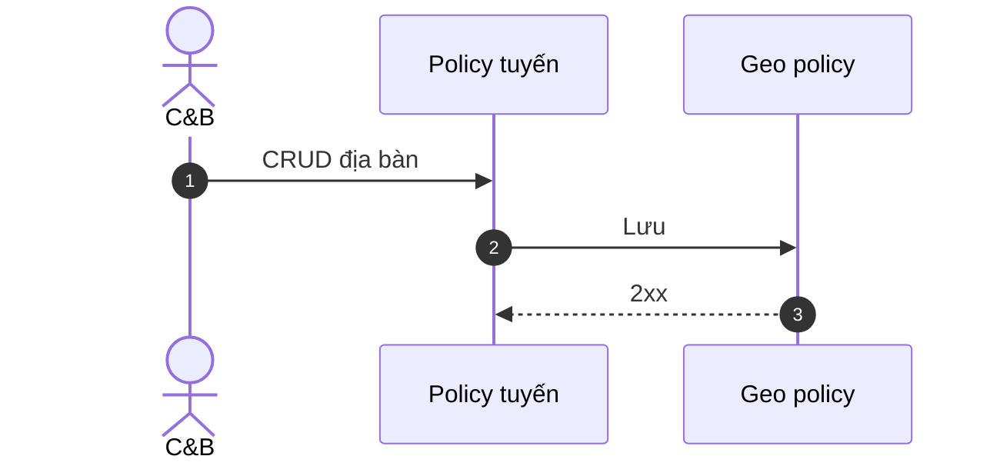

#### Diễn biến nghiệp vụ

| # | Tương tác | Điều kiện / quy tắc | Kết quả hoặc lỗi |
|---|-----------|---------------------|------------------|
| 1 | Thêm tuyến/tỉnh | BP LX/VP | Row policy |
| 2 | Lưu | BR-PAY-STP-03 | 2xx + FE |
| Thành công | — | — | STP-10/11 applicability tỉnh |

---

## FR-UC-BP-PAY-STP-06 — Trợ lương và chi phí văn phòng tỉnh

#### Thông tin chung

| Mục | Nội dung |
|-----|----------|
| Tác nhân | C&B VP tỉnh |
| Ưu tiên | Cao |
| Tiên quyết | BP VP-T bind |
| Hậu điều kiện | Tham số trợ lương · CP VP theo tỉnh |
| Liên hệ phần mềm hiện tại | **GAP** pack VP tỉnh |
| BR | BR-PAY-STP-02 |

**Mục đích:** Cấu hình **trợ lương** và **chi phí VP** cho mô hình văn phòng tỉnh (6 mẫu T05 inventory).

#### Dữ liệu đầu vào

| Trường | Bắt buộc | Quy tắc |
|--------|----------|---------|
| Mã tỉnh / VP | Có | Applicability |
| Trợ lương | Có* | Số tiền vi-VN |
| Chi phí VP | Không | Theo policy PDF |

#### Luồng chính

1. Chọn VP tỉnh.
2. Nhập trợ lương / CP.
3. Lưu 2xx → F5; gắn `VP_ALLOWANCE` / `VP_COST` (STP-12).

#### Quy tắc nghiệp vụ

- Tách UC khỏi STP-05 khi BP VP-T có cả địa bàn và trợ lương — STP-05 = tuyến/LX; STP-06 = VP economics.

#### Trường hợp đặc biệt

| Tình huống | Hệ thống xử lý |
|------------|----------------|
| Trợ lương = 0 | Cho phép nếu policy |
| Sửa sau kỳ closed | BR-PAY-STP-08 |

#### Sơ đồ tương tác

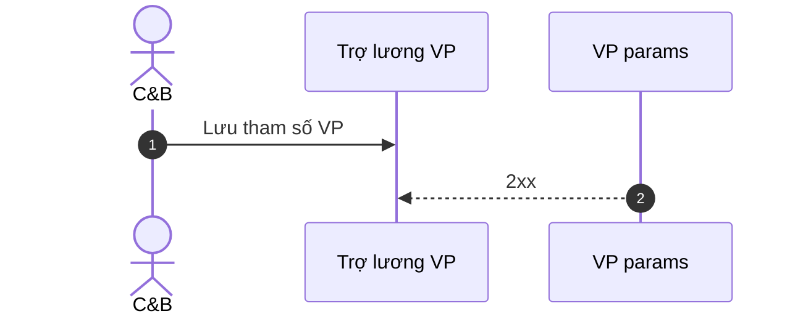

#### Diễn biến nghiệp vụ

| # | Tương tác | Điều kiện / quy tắc | Kết quả hoặc lỗi |
|---|-----------|---------------------|------------------|
| 1 | Cấu hình VP tỉnh | BR-PAY-STP-02 | Row lưu |
| 2 | Lưu | AC-PAY-STP-GLOBAL-01 | 2xx + F5 |
| Thành công | — | — | Input pack VP STP-12 |

---

## FR-UC-BP-PAY-STP-07 — Danh mục thành phần lương

#### Thông tin chung

| Mục | Nội dung |
|-----|----------|
| Tác nhân | C&B tập đoàn |
| Ưu tiên | Cao |
| Tiên quyết | Dual SoT PAY-02 (catalog vs pay_types) |
| Hậu điều kiện | Catalog mở + starter CHUNG; AC-PAY-COMP-01 pass path |
| Liên hệ phần mềm hiện tại | Stub · COMP-01 FAIL free-text |
| BR | BR-PAY-STP-04 · AC-PAY-COMP-01 |

**Mục đích:** **Open catalog** thành phần lương + starter CHUNG (lương CB · PC chức vụ · BH · TNCN).

#### Dữ liệu đầu vào

| Trường | Bắt buộc | Quy tắc |
|--------|----------|---------|
| `component_code` | Có | Unique tenant |
| Nhãn VI | Có | U72 |
| Bản chất (`pay_types`) | Có | Picker catalog |
| Hiệu lực | Có | Active/inactive |

#### Luồng chính

1. Mở **Danh mục TP** (Thiết lập hoặc Settings dual SoT).
2. Thêm mã mới hoặc import starter CHUNG.
3. Lưu → picker form gắn mã chỉ chọn từ catalog (AC-PAY-COMP-01).

#### Quy tắc nghiệp vụ

- BR-PAY-STP-04: Cột mẫu chỉ mã ∈ catalog.
- Không wipe FR-UC-BP-PAY-02 dual SoT.

#### Trường hợp đặc biệt

| Tình huống | Hệ thống xử lý |
|------------|----------------|
| Trùng mã | 400 |
| Ngưng mã đang gắn mẫu | Soft-retire; lịch sử kỳ giữ |

#### Sơ đồ tương tác

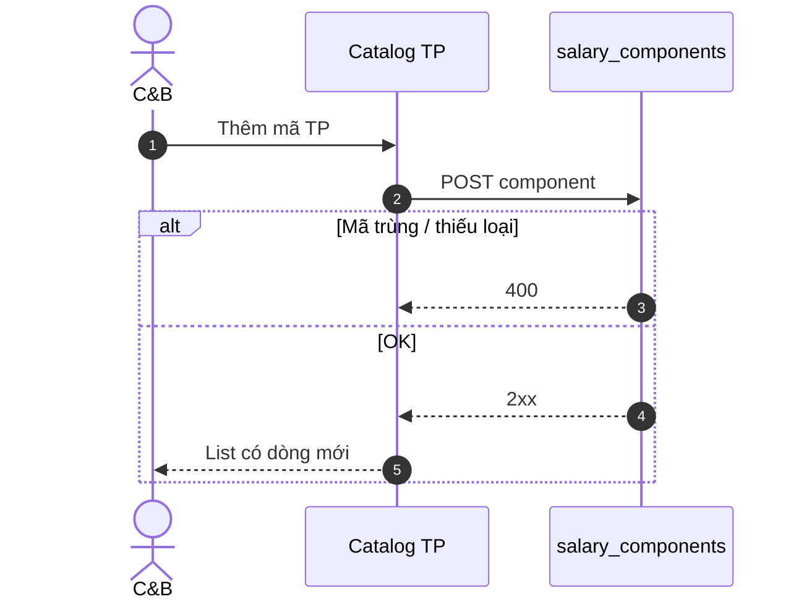

#### Diễn biến nghiệp vụ

| # | Tương tác | Điều kiện / quy tắc | Kết quả hoặc lỗi |
|---|-----------|---------------------|------------------|
| 1 | Thêm TP | AC-PAY-COMP-01 path | Mã catalog |
| 2 | Lưu | BR-PAY-STP-04 | 2xx + FE list |
| 3 | F5 | — | Mã còn |
| Thành công | — | — | STP-08/10 bind cột |

---

## FR-UC-BP-PAY-STP-08 — Sinh thành phần từ policy fragment

#### Thông tin chung

| Mục | Nội dung |
|-----|----------|
| Tác nhân | C&B |
| Ưu tiên | Cao |
| Tiên quyết | Fragment catalog (POLICY-DECOMPOSE); catalog STP-07 |
| Hậu điều kiện | Đề xuất mã TP từ fragment — không hardcode Nest |
| Liên hệ phần mềm hiện tại | **GAP** |
| BR | BR-PAY-STP-04 |

**Mục đích:** Từ **fragment policy** (PDF pack) → đề xuất / tạo mã TP hợp lệ trên catalog.

#### Dữ liệu đầu vào

| Trường | Bắt buộc | Quy tắc |
|--------|----------|---------|
| `fragment_id` | Có | Từ decompose |
| Map sang `component_code` | Có | User confirm |
| BP source | Có | ĐPHH · TĐHK… |

#### Luồng chính

1. Chọn fragment (vd. cột DLL ĐPHH).
2. Hệ thống đề xuất mã + nhãn.
3. C&B confirm → Lưu vào catalog STP-07.

#### Quy tắc nghiệp vụ

- Không auto-create mã trùng; merge alias nếu đã có.

#### Trường hợp đặc biệt

| Tình huống | Hệ thống xử lý |
|------------|----------------|
| Fragment chưa map (INV) | CTA chờ ba-data |
| User reject đề xuất | Không tạo mã |

#### Sơ đồ tương tác

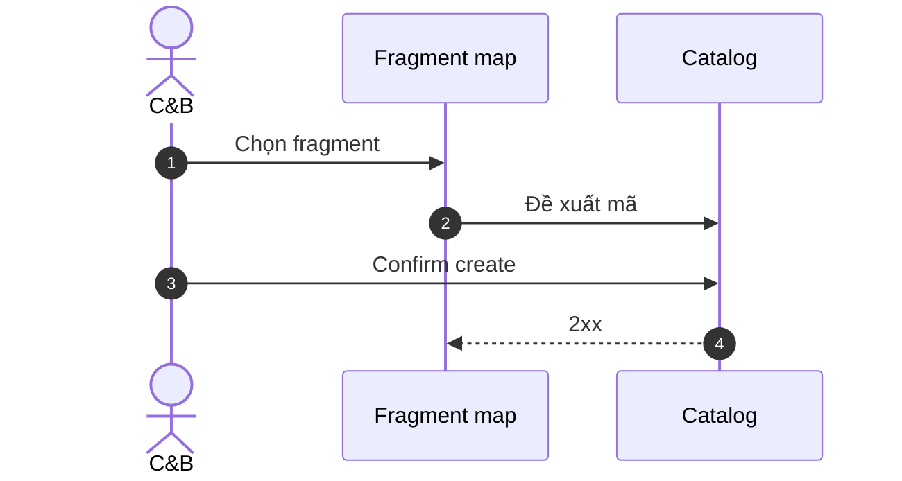

#### Diễn biến nghiệp vụ

| # | Tương tác | Điều kiện / quy tắc | Kết quả hoặc lỗi |
|---|-----------|---------------------|------------------|
| 1 | Map fragment | Catalog STP-07 | Mã mới hoặc alias |
| 2 | Lưu | BR-PAY-STP-04 | 2xx + FE |
| Thành công | — | — | Cột mẫu STP-10 dùng mã |

---

## FR-UC-BP-PAY-STP-09 — Nhóm lương và gán nhân viên

#### Thông tin chung

| Mục | Nội dung |
|-----|----------|
| Tác nhân | C&B |
| Ưu tiên | Cao |
| Tiên quyết | FR-UC-BP-PAY-09 (runtime) — UI Thiết lập |
| Hậu điều kiện | Nhóm lương map 6 mô hình khách; NV/BP gán nhóm |
| Liên hệ phần mềm hiện tại | PAY-09 GWC slice shallow |
| BR | BR-BP-PAY-GRP-01 (alias BR-BP-PAY-04) |

**Mục đích:** **Thiết lập** danh mục nhóm lương + gán NV/BP — bổ sung UI module Thiết lập cho FR-UC-BP-PAY-09.

#### Dữ liệu đầu vào

| Trường | Bắt buộc | Quy tắc |
|--------|----------|---------|
| Mã nhóm | Có | Catalog mở — không hardcode 4 nhóm |
| Gán NV / rule BP | Có | `effective_from` |
| BP tag (optional) | Không | Map ĐPHH/TĐHK/LX/VP |

#### Luồng chính

1. CRUD nhóm lương trên Thiết lập.
2. Gán NV hoặc rule bộ phận.
3. Lưu 2xx → chạy/lọc kỳ theo nhóm (sau PAY-06 LIVE).

#### Quy tắc nghiệp vụ

- STP-09 = **setup UI**; PAY-09 = **runtime** FR giữ nguyên — không REPLACE.

#### Trường hợp đặc biệt

| Tình huống | Hệ thống xử lý |
|------------|----------------|
| NV đổi nhóm giữa kỳ | Split PAY-04 |
| Nhóm trùng mã | 400 |

#### Sơ đồ tương tác

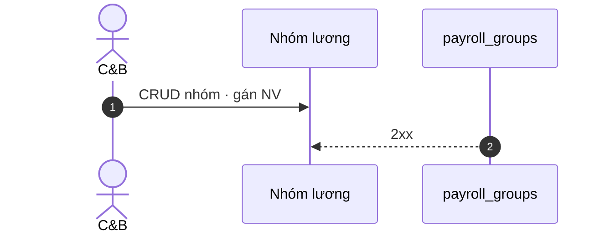

#### Diễn biến nghiệp vụ

| # | Tương tác | Điều kiện / quy tắc | Kết quả hoặc lỗi |
|---|-----------|---------------------|------------------|
| 1 | Tạo nhóm | BR-BP-PAY-GRP-01 | Danh mục |
| 2 | Gán NV | Scope | 2xx + FE |
| Thành công | — | — | PAY-09 runtime |

---

## FR-UC-BP-PAY-STP-10 — Mẫu bảng lương đa OU

#### Thông tin chung

| Mục | Nội dung |
|-----|----------|
| Tác nhân | C&B |
| Ưu tiên | Cao — F-STP-01 |
| Tiên quyết | Catalog TP STP-07; policy bind STP-02 |
| Hậu điều kiện | CRUD mẫu + cột + sort; AC-PAY-TPL-01..03 |
| Liên hệ phần mềm hiện tại | Paper `pay_sheet_template`; product **MISSING** |
| BR | BR-PAY-STP-03 · BR-PAY-STP-04 · BR-PAY-STP-05 · BR-PAY-STP-07 |

**Mục đích:** CRUD **mẫu bảng lương** đa OU (ĐPHH · TĐHK · VP HN · LX tuyến · LXT · VP tỉnh).

#### Dữ liệu đầu vào

| Trường | Bắt buộc | Quy tắc |
|--------|----------|---------|
| Tên mẫu | Có | |
| Applicability OU/BP | Có | BR-PAY-STP-03 |
| Cột (`component_code`) | Có | Picker catalog |
| `override_formula_id` | Không | Published only |
| Sort order | Có | |

#### Luồng chính

1. Tạo mẫu BP ĐPHH (≥5 cột từ catalog).
2. Lưu 2xx → F5 còn cột.
3. Khi tạo kỳ OU ĐPHH → picker chọn mẫu (AC-PAY-TPL-03).

#### Quy tắc nghiệp vụ

- BR-PAY-STP-07: Kỳ bắt buộc chọn mẫu active.
- enroll pack UI ≠ mẫu AMIS — honesty giữ slice.

#### Trường hợp đặc biệt

| Tình huống | Hệ thống xử lý |
|------------|----------------|
| Cột free-text mã | 400 AC-PAY-COMP-01 |
| Formula chưa publish | Chặn override FK |
| Đổi mẫu mid-period | BR-PAY-STP-08 |

#### Sơ đồ tương tác

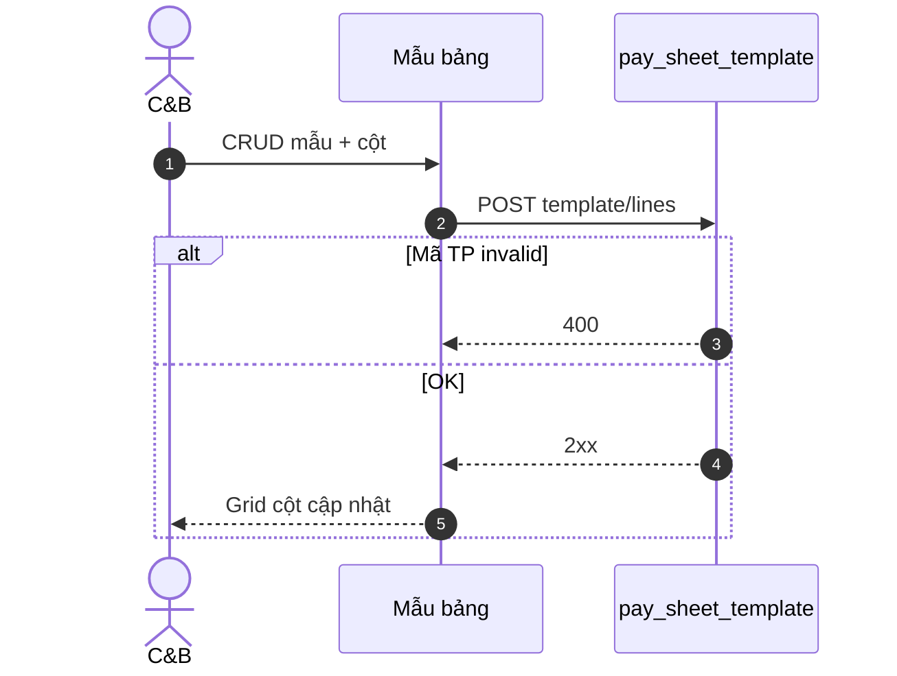

#### Diễn biến nghiệp vụ

| # | Tương tác | Điều kiện / quy tắc | Kết quả hoặc lỗi |
|---|-----------|---------------------|------------------|
| 1 | Tạo mẫu | Applicability | Header mẫu |
| 2 | Thêm cột | BR-PAY-STP-04 | Lines |
| 3 | Lưu | AC-PAY-TPL-01 | 2xx + FE |
| 4 | F5 | AC-PAY-STP-03 | Mẫu ĐPHH ≥5 cột |
| Thành công | — | — | PAY-06 chọn mẫu |

**AC:** **AC-PAY-STP-03** — Mẫu BP ĐPHH ≥5 cột catalog → F5 → chọn khi tạo kỳ OU ĐPHH.

---

## FR-UC-BP-PAY-STP-11 — Nhiều mẫu trong một BP

#### Thông tin chung

| Mục | Nội dung |
|-----|----------|
| Tác nhân | C&B VP tỉnh · LX đa tỉnh |
| Ưu tiên | Cao |
| Tiên quyết | STP-10; applicability metadata |
| Hậu điều kiện | VP 6 tỉnh · LX đa tỉnh — picker đúng `applicability` |
| Liên hệ phần mềm hiện tại | **MISSING** multi-template |
| BR | BR-PAY-STP-03 |

**Mục đích:** Một BP có **>1 mẫu** (6 tỉnh T05 · LX biến thể) — `applicability_scope` metadata.

#### Dữ liệu đầu vào

| Trường | Bắt buộc | Quy tắc |
|--------|----------|---------|
| BP tag | Có | VP-T / LX-T |
| Mã tỉnh / scope phụ | Có | Phân biệt mẫu A/B |
| Mẫu (header) | Có | Unique per applicability |

#### Luồng chính

1. Tạo mẫu tỉnh A và tỉnh B cùng BP VP-T.
2. Lưu cả hai 2xx.
3. Picker kỳ hiện 2 mẫu — chọn đúng tỉnh NV.

#### Quy tắc nghiệp vụ

- Cấm một mẫu hardcode cho 6 tỉnh.

#### Trường hợp đặc biệt

| Tình huống | Hệ thống xử lý |
|------------|----------------|
| Trùng applicability | 400 |
| NV thuộc tỉnh không có mẫu | Empty + CTA tạo mẫu |

#### Sơ đồ tương tác

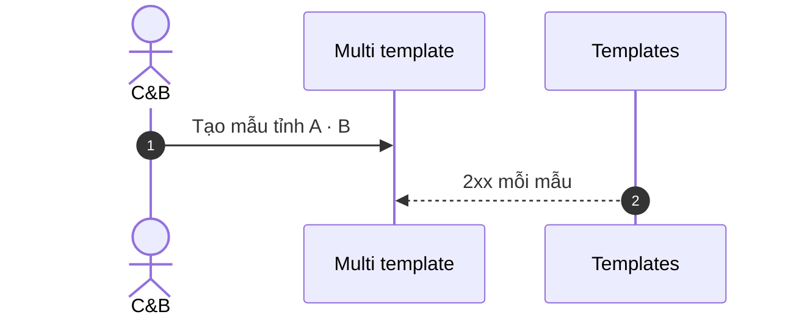

#### Diễn biến nghiệp vụ

| # | Tương tác | Điều kiện / quy tắc | Kết quả hoặc lỗi |
|---|-----------|---------------------|------------------|
| 1 | Tạo 2 mẫu | Cùng BP khác applicability | 2 headers |
| 2 | Picker kỳ | NV tỉnh A | Chỉ mẫu A (default) |
| Thành công | — | — | AC-PAY-STP-05 |

**AC:** **AC-PAY-STP-05** — VP 2 mẫu tỉnh A/B → picker đúng applicability.

---

## FR-UC-BP-PAY-STP-12 — Loại input pack theo mô hình

#### Thông tin chung

| Mục | Nội dung |
|-----|----------|
| Tác nhân | C&B · Kế toán lương |
| Ưu tiên | Cao — F-STP-04 |
| Tiên quyết | Mẫu STP-10/11 |
| Hậu điều kiện | Taxonomy pack: DLL_CPN · KPI · CPSC · DT… + bind mẫu |
| Liên hệ phần mềm hiện tại | Paper `pay_period_input_lines`; types **MISSING** |
| BR | BR-PAY-STP-06 |

**Mục đích:** Khai báo **loại input pack** theo mô hình và gắn mẫu — màn nhập kỳ hiện đúng label.

#### Dữ liệu đầu vào

| Trường | Bắt buộc | Quy tắc |
|--------|----------|---------|
| `input_pack_type` | Có | Vocabulary §ba-data |
| Writer (UI/import/ATT) | Có | BR-PAY-STP-06 |
| Mẫu gắn | Có | FK template |
| Grain (NV/kỳ/dòng) | Có | |

**Vocabulary (normative):**

| Type | Mô hình | Nguồn khách |
|------|---------|-------------|
| `DLL_CPN` | ĐPHH | DLL CPN |
| `KPI_TDHK` · `BCC` · `PCCV` | TĐHK | KPI/BCC/PCCV T5 |
| `BCC_STD` | TG | BCC chuẩn |
| `CPSC` · `CLDV_SCORE` | LX-T | BCC/CPSC/CLDV |
| `REVENUE_DT` · `ADVANCE` · `XDTN` | LX-TR | DT/tạm ứng |
| `VP_COST` · `VP_ALLOWANCE` | VP-T | Chi phí VP |

#### Luồng chính

1. Khai báo `DLL_CPN` gắn mẫu ĐPHH.
2. Chọn writer (UI kỳ).
3. Lưu 2xx → màn nhập kỳ hiện label DLL.

#### Quy tắc nghiệp vụ

- BR-PAY-STP-06: Type phải có đường nhập — không orphan.
- ATT bind = writer cho `BCC_STD` — không duplicate ATT-01.

#### Trường hợp đặc biệt

| Tình huống | Hệ thống xử lý |
|------------|----------------|
| Type không writer | Chặn Lưu |
| Pack mount INV | Label từ vocabulary; map chi tiết sau ba-data |

#### Sơ đồ tương tác

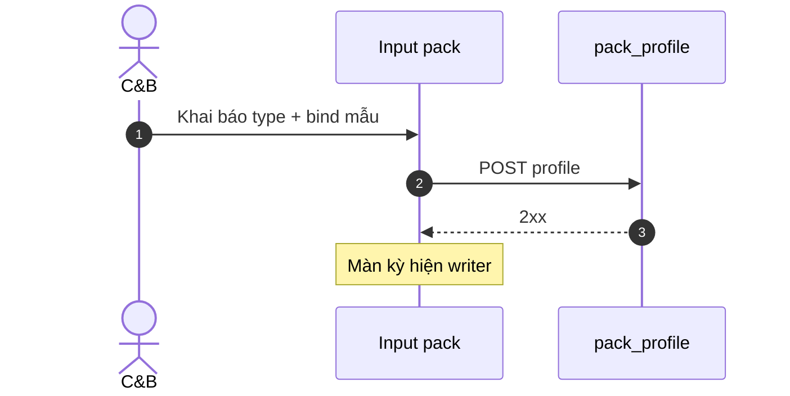

#### Diễn biến nghiệp vụ

| # | Tương tác | Điều kiện / quy tắc | Kết quả hoặc lỗi |
|---|-----------|---------------------|------------------|
| 1 | Khai báo type | Vocabulary | Profile row |
| 2 | Bind mẫu | STP-10 | FK |
| 3 | Mở nhập kỳ | Writer UI | Label đúng |
| Thành công | — | — | AC-PAY-STP-04 |

**AC:** **AC-PAY-STP-04** — `input_pack_type=DLL_CPN` gắn mẫu ĐPHH → màn kỳ hiện label.

---

## Residual · honesty

| Mục | Ghi chú |
|-----|---------|
| `payroll_e2e_ready` | **false** — Thiết lập paper+SRS ≠ chạy kỳ U65 |
| Runtime blocked | PAY-06 process · formula engine HOLD |
| Pack P.CNTT | Chưa mount — fragment STP-08 INV until decompose |
| Next governance | DB_DESIGN · API_DESIGN post SA-01 · UI_SCREEN_SPEC |

**ack_status (spec):** PASS_TO_PM  
**evidence:** `docs/qa/evidence/po-hrm-pay-cntt-srs-delta-01.md`
