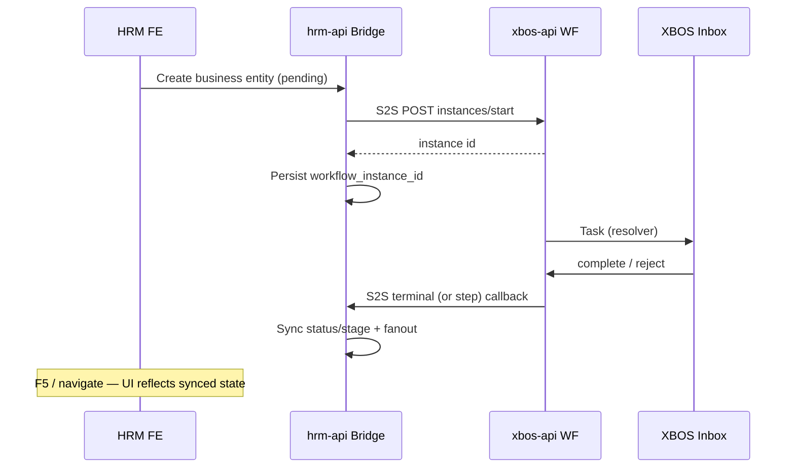
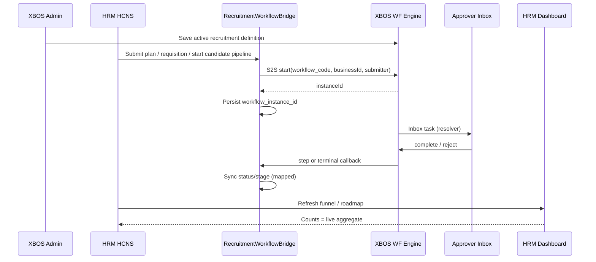

# XBOS → HRM Recruitment Workflow Bridge — BA Process Delta

| Field | Value |
|-------|--------|
| **work_item_id** | `XHRM-REC-WF-BA-01` |
| **program_id** | `P1-XBOS-HRM-REC-WF-BRIDGE` |
| **from_role** | ba-process |
| **to_role** | sa → pm |
| **lane** | governance |
| **change_mode** | **UPGRADE** — extend UC-HRM-22/30 + F6; **cấm** REPLACE CRUD 🟢 |
| **opened** | 2026-07-19 |
| **U65** | Zero-seed; FE-only UAT evidence |
| **code_memory** | Mọi file bridge Dev **bắt buộc** `@CODE-MEMORY` cite SRS§ / TechSpec§ / UC-ID dưới đây |

**Program:** `docs/program/XBOS_HRM_RECRUITMENT_WORKFLOW_BRIDGE_PROGRAM.md`  
**Pattern SoT:** `LeaveWorkflowBridge` + `ADR-WORKFLOW-RESOLVER-DYNAMIC-20260620.md` + F4 (`CUSTOMER_DEMO_HRM_DELTA` §4)  
**Ownership SoT:** `docs/hrm/DANH_MUC_XBOS_CHO_HRM.md` §1 + §6 + §13  
**F6 baseline (không đè):** `CUSTOMER_DEMO_HRM_DELTA_20260620.md` §6 UC-HRM-RC-07..09 · BR-CD-F6-* · AC-CD-F6-*

---

## 1. Process objective and actors

### 1.1 Objective

Khách cấu hình **quy trình tuyển dụng trên XBOS** (canvas / definition) → HRM **planning**, **duyệt hồ sơ/yêu cầu**, **roadmap bước ứng viên** chạy theo **workflow instance**; dashboard funnel đọc **tiến trình đã sync** (không mock, không seed inbox).

### 1.2 Actors

| Actor | Hệ | Trách nhiệm |
|-------|-----|-------------|
| Admin XBOS / Group HCNS | XBOS | Định nghĩa QT `hrm_recruitment_*` (UC-XBOS-13 mở rộng) |
| Approver (resolver) | XBOS Inbox | Duyệt / từ chối task (J-XBOS-01 pattern) |
| HCNS / Hiring manager | HRM FE + embed | Tạo plan / requisition / candidate; xem roadmap + dashboard |
| Group CEO | Portal embed P-CC-06 | Rollup `company_id=main`; filter ĐVTV |
| Engine | xbos-api workflow-engine | Spawn instance, resolver, inbox, terminal |
| Consumer | hrm-api RecruitmentWorkflowBridge | Spawn S2S + callback sync status/stage |

---

## 2. As-is vs To-be

| Dimension | As-is | To-be |
|-----------|-------|-------|
| Quy trình | Stage enum CRUD cứng trên HRM; approve trực tiếp API | XBOS definition + resolver (F4) điều khiển bước |
| Planning | `recruitment_plans` CRUD local | Submit plan → spawn WF; status theo terminal/step |
| Duyệt hồ sơ | PATCH status/stage trên HRM UI | Inbox XBOS → callback → HRM status/stage |
| Roadmap ứng viên | PATCH `candidates.stage` / applications | Step complete → map stage (ba-data chốt bảng map) |
| Dashboard F6 | Aggregate `candidate.status` live API | Cùng funnel; số phản ánh stage sau sync WF (BR-DQ-01 giữ) |
| Catalog §37–42 | XBOS SoT danh mục | Giữ; HRM chỉ consume sync — **không** hardcode label mới ngoài catalog |

### 2.1 Scope

| In scope | Out of scope (wave này) |
|----------|-------------------------|
| Bridge spawn + step/terminal callback cho plan / requisition / candidate pipeline | Mobile tuyển dụng parity |
| Roadmap UI bind WF-linked stage | REPLACE JD library F6 |
| Dashboard đọc stage đã sync | Seed inbox / seed WF definition cho UAT |
| Journeys J-REC-WF-01..06 draft | Claim Phase1 DONE / PROD-READY |
| CODE-MEMORY AC trên bridge files | Silent đổi enum stage không ADR |

### 2.2 must_keep (non-negotiable)

| ID | Constraint |
|----|------------|
| UF-HRM-12 | Tạo/sửa requisition FE + F5 vẫn PASS |
| J-HRM-05 | list→detail requisition/candidate |
| AC-CD-F6-01..06 | JD library + funnel 6 cột + scope rollup |
| LeaveWorkflowBridge | Pattern spawn/callback — không phá leave path |
| CatalogWorkflowBridge | Catalog extension WF không regression |
| J-XBOS-02 / J-XBOS-08 | Catalog publish/sync HRM |
| F4 resolver path | `resolver_type` enum ADR — reuse, không fork engine |

---

## 3. Ownership matrix (DANH_MUC + business)

| Lớp | Owner | Artifact | Ghi chú |
|-----|-------|----------|---------|
| Danh mục loại chiến dịch / TT yêu cầu / nguồn / TT ứng viên / vòng PV / kết quả PV | **XBOS** | `DANH_MUC` §6 STT **37–42** | Sync xuống HRM; HRM **không** SoT mã mới |
| Định nghĩa quy trình tuyển dụng (graph, resolver, parallel) | **XBOS** | workflow-engine definition | Mã chuẩn: bảng §4.2 |
| Instance + inbox task | **XBOS** | `xbos_workflow_*` | HRM **không** tự assign inbox |
| Plan / requisition / candidate / interview rows | **HRM** | `DANH_MUC` §13 | Business data |
| `workflow_instance_id` FK trên entity HRM | **HRM** | columns trên plan/requisition/candidate | Mirror leave `leave_requests.workflow_instance_id` |
| Aggregate dashboard | **HRM API** | F6 UC-HRM-RC-09 | Đếm theo scope resolver; stage = post-callback |

---

## 4. Pattern reference — Leave bridge (normative reuse)



| Leave (F4) | Recruitment (this delta) |
|------------|--------------------------|
| `workflow_code = hrm_leave_approval` | `hrm_recruitment_plan_approval` · `hrm_requisition_approval` · `hrm_candidate_pipeline` |
| `business_type = hrm_leave` | `hrm_recruitment_plan` · `hrm_requisition` · `hrm_candidate` |
| `businessId = leaveRequestId` | planId / requisitionId / candidateId |
| Missing definition → log `HRM-WF-SPAWN-MISSING`; entity stays pending | **Same** — no silent approve |
| Direct approve/reject API = deprecated when WF configured | Direct PATCH stage **allowed chỉ khi** no active instance (BR-REC-WF-08) |
| U65: definition via canvas FE — not seed for evidence | **Same** |

---

## 5. Use-case catalog (UPGRADE)

### 5.1 New UCs

| UC-ID | Tên | Actor | Happy path (tóm tắt) | SRS target |
|-------|-----|-------|----------------------|------------|
| **UC-HRM-REC-WF-01** | Cấu hình QT tuyển dụng trên XBOS | Admin XBOS | Canvas tạo/sửa definition active theo mã §4.2; resolver config persist | Delta → **SRS §16.5**; maps **UC-XBOS-13** |
| **UC-HRM-REC-WF-02** | Spawn WF khi submit planning | HCNS | POST/PATCH plan → status `pending_approval` → Bridge start → `workflow_instance_id` | Delta → **SRS §16.5**; maps plan API |
| **UC-HRM-REC-WF-03** | Inbox duyệt yêu cầu / hồ sơ | Approver | Inbox complete/reject → XBOS callback → HRM sync requisition/plan status | Delta → **SRS §16.5**; maps J-XBOS-01 |
| **UC-HRM-REC-WF-04** | Roadmap sync bước ứng viên | Engine + HRM | Step advance → map `task_type` → `candidate.stage` (F6 funnel) | Delta → **SRS §16.5**; ba-data W1 |
| **UC-HRM-REC-WF-05** | Dashboard tiến trình WF | Group CEO / HCNS | Funnel/KPI đọc stage đã sync; rollup `main` | Extends **UC-HRM-RC-09** / **UC-HRM-22** |
| **UC-HRM-REC-WF-06** | Từ chối / dừng pipeline | Approver | Reject → stage/status `rejected` hoặc plan `rejected`; notify; không orphan instance | Exception path |

### 5.2 Extended UCs (không REPLACE)

| UC-ID | Delta hành vi | Cấm |
|-------|---------------|-----|
| **UC-HRM-22** | Embed: roadmap chip + dashboard phản ánh WF sync; banner khi spawn missing | Xóa list requisition CRUD |
| **UC-HRM-30** | App: roadmap timeline gắn instance; approve qua inbox khi WF active | Đổi F6 JD library contract |
| **UC-HRM-RC-09** | Aggregate vẫn 6 cột F6; nguồn = stage post-callback | Mock 1OFFICE / hardcode KPI |
| **UC-XBOS-13/14** | Definition codes tuyển dụng + multi-hat | Fork resolver ngoài ADR F4 |

### 5.3 Happy / alternate / exception (per UC)

#### UC-HRM-REC-WF-02 — Spawn planning

| Nhánh | Điều kiện | Kết quả bắt buộc |
|-------|-----------|------------------|
| **H** | Definition active tồn tại | Instance tạo; plan có `workflow_instance_id`; inbox ≥1 task |
| **A** | Definition missing / XBOS down | Plan vẫn lưu `pending_approval`; log `HRM-REC-WF-SPAWN-MISSING`; UI banner cảnh báo; **không** auto-approve |
| **E** | Scope 409 / unauthorized | Không spawn; HTTP 4xx deterministic |

#### UC-HRM-REC-WF-03 — Inbox approve

| Nhánh | Điều kiện | Kết quả bắt buộc |
|-------|-----------|------------------|
| **H** | Approver complete terminal | Plan/requisition → `approved`/`open`; FE sau 2xx + F5 còn |
| **A** | Intermediate step (non-terminal) | Roadmap/stage advance theo map; instance còn active |
| **E** | Duplicate callback | Idempotent no-op nếu status đã terminal |
| **E2** | Inbox trống vì chưa tạo nguồn FE | QA **🟡 BLOCKED** — **cấm** seed inbox (U65) |

#### UC-HRM-REC-WF-04 — Roadmap sync

| Nhánh | Điều kiện | Kết quả bắt buộc |
|-------|-----------|------------------|
| **H** | Step `task_type` có map | `candidate.stage` = mapped F6 status; detail roadmap cập nhật |
| **A** | `task_type` chưa map | **422** / log `HRM-REC-WF-STAGE-UNMAPPED`; **không** đoán stage |
| **E** | Candidate ngoài scope | **404** parity list/get |

#### UC-HRM-REC-WF-05 — Dashboard

| Nhánh | Điều kiện | Kết quả bắt buộc |
|-------|-----------|------------------|
| **H** | Aggregate API 200 | 6 cột F6 = count theo stage đã sync |
| **A** | Empty scope | Empty funnel 0 — không mock |
| **E** | API fail | Banner ERROR (BR-MOCK-02) |

#### UC-HRM-REC-WF-06 — Reject

| Nhánh | Điều kiện | Kết quả bắt buộc |
|-------|-----------|------------------|
| **H** | Reject + reason | Entity `rejected`; notify submitter; instance terminal |
| **E** | Reject khi đã hired | **409** business conflict — không downgrade hired |

---

## 6. Workflow codes & spawn triggers (normative draft)

| workflow_code | business_type | Trigger FE/API | businessId |
|---------------|---------------|----------------|------------|
| `hrm_recruitment_plan_approval` | `hrm_recruitment_plan` | Submit / gửi duyệt **recruitment plan** | `planId` |
| `hrm_requisition_approval` | `hrm_requisition` | Submit requisition / đề xuất tuyển | `requisitionId` |
| `hrm_candidate_pipeline` | `hrm_candidate` | Candidate vào pipeline (sau plan/req approved) hoặc explicit «Bắt đầu QT» | `candidateId` |

**Invariant (SA chốt ADR):** Inbox assignee **chỉ** XBOS resolver. HRM chỉ truyền `submitter` + org context khi spawn (giống leave).

---

## 7. Stage ↔ WF task_type (draft — ba-data W1 chốt)

F6 funnel normative giữ nguyên:

| `candidate.stage` / status | Nhãn VI | Gợi ý `task_type` (XBOS step) |
|----------------------------|---------|-------------------------------|
| `new` | Mới | `rec_intake` / spawn start |
| `screening` | Sàng lọc | `rec_screening` |
| `interview` | Phỏng vấn | `rec_interview` |
| `offer` | Đề nghị | `rec_offer` |
| `hired` | Đã tuyển | terminal `completed` → UC-HRM-INT-01 |
| `rejected` | Từ chối | terminal `rejected` |

| Plan / requisition status (draft) | Sau callback |
|-----------------------------------|--------------|
| `draft` | Chưa spawn |
| `pending_approval` | Spawn OK / waiting inbox |
| `approved` / `open` | Terminal completed |
| `rejected` | Terminal rejected |
| `cancelled` | Cancel instance (SA: policy) |

**ba-data (`XHRM-REC-WF-BD-01`):** publish bảng 1-1 `task_type` ↔ stage + OpenAPI field list; BA-process không claim schema final.

---

## 8. Business rules matrix

| Mã | Điều kiện | Hành động | Kết quả |
|----|-----------|-----------|---------|
| **BR-REC-WF-01** | Plan/requisition submit + definition active | Bridge S2S `instances/start` | Persist `workflow_instance_id` |
| **BR-REC-WF-02** | Definition missing / XBOS error | Log `HRM-REC-WF-SPAWN-MISSING` | Entity `pending_approval`; **không** silent approve |
| **BR-REC-WF-03** | Inbox complete step | XBOS callback step/terminal | HRM sync status/stage per map |
| **BR-REC-WF-04** | `task_type` unmapped | Reject apply | `HRM-REC-WF-STAGE-UNMAPPED`; stage không đổi |
| **BR-REC-WF-05** | Terminal `completed` trên candidate pipeline | Set `hired` only if hire AC (employee link) | BR-CD-F6-05 / UC-HRM-INT-01 |
| **BR-REC-WF-06** | Terminal `rejected` | Set rejected + reason | Fanout notify |
| **BR-REC-WF-07** | Duplicate terminal callback | Idempotent | 200 no-op nếu đã terminal |
| **BR-REC-WF-08** | Entity có `workflow_instance_id` active | FE **không** PATCH stage/status bypass | UI disable direct approve; API **409** `HRM-REC-WF-LOCKED` |
| **BR-REC-WF-09** | Không có instance | CRUD/PATCH stage local (UF-HRM-12) | Giữ CRUD 🟢 |
| **BR-REC-WF-10** | Catalog labels stage | Chỉ mã đã sync §40 | Không hardcode tiếng Việt lệch catalog |
| **BR-REC-WF-11** | Group CEO dashboard | Aggregate rollup `main` + filter ĐVTV | BR-CD-F6-06 / BR-INT-03 |
| **BR-REC-WF-12** | Multi-hat approver | Một task / hat_key | BR-XBOS-MULTI-HAT-01 |
| **BR-REC-WF-13** | Self-approve (submitter = assignee) | Skip hoặc escalate F4 | BR-CD-F4-05 |
| **BR-REC-WF-14** | U65 evidence | Chuỗi tạo từ FE (canvas → HRM → inbox) | **Cấm** `pnpm seed:*` inbox/WF |

---

## 9. Acceptance criteria (measurable)

| AC-ID | Tiêu chí | Pass khi | Fail khi | Evidence |
|-------|----------|----------|----------|----------|
| **AC-REC-WF-01** | Canvas definition | Admin lưu active `hrm_requisition_approval` (hoặc plan) qua FE → reload còn | Chỉ DB seed | J-REC-WF-01 · U65 |
| **AC-REC-WF-02** | Spawn plan | FE submit plan → Network start 2xx **hoặc** banner SPAWN-MISSING + plan pending | Silent approved | J-REC-WF-02 |
| **AC-REC-WF-03** | Inbox approve | Approver Duyệt → HRM status approved/open → **F5 còn** | Status lệch / orphan | J-REC-WF-03 |
| **AC-REC-WF-04** | Roadmap sync | Step complete → candidate stage đúng map → detail roadmap | Stage đoán / unmapped im lặng | J-REC-WF-04 |
| **AC-REC-WF-05** | Dashboard | Funnel 6 cột = API aggregate sau sync | Mock org / hardcode | J-REC-WF-05 · AC-CD-F6-03 |
| **AC-REC-WF-06** | Reject | Từ chối → rejected + reason + notify | hired bị downgrade | J-REC-WF-06 |
| **AC-REC-WF-07** | Lock bypass | PATCH stage khi instance active → **409** `HRM-REC-WF-LOCKED` | Bypass thành công | jest + browser |
| **AC-REC-WF-08** | Regression CRUD | UF-HRM-12 + J-HRM-05 vẫn PASS khi không bật WF | Regression 🟢 | QA matrix |
| **AC-REC-WF-09** | Scope parity | list/get plan|req|candidate cùng resolver | 404 trên `main` rollup | BR-INT-01 |
| **AC-REC-WF-10** | **CODE-MEMORY** | Mọi file bridge mới/sửa có `@CODE-MEMORY` cite **SRS §16.5** + **UC-HRM-REC-WF-0x** + TechSpec§ ADR | Thiếu block / TBD fields | preflight / TM review |
| **AC-REC-WF-11** | Leave/Catalog regression | Leave spawn + catalog WF smoke PASS | Leave/catalog vỡ | QA smoke F4 |

### 9.1 CODE-MEMORY gate (U68 — Dev bắt buộc)

Mọi PR BE/FE bridge **FAIL** handoff nếu thiếu:

```text
@CODE-MEMORY
UC: UC-HRM-REC-WF-0x
SRS: docs/hrm/SRS.md §16.5 (delta) · docs/program/deltas/XBOS_HRM_REC_WF_BRIDGE_BA_DELTA.md
TechSpec: docs/decisions/ADR-XBOS-HRM-RECRUITMENT-WORKFLOW-BRIDGE.md §…
WorkItem: XHRM-REC-WF-BE-01 | FE-01
must_keep: UF-HRM-12, LeaveWorkflowBridge, CatalogWorkflowBridge, AC-CD-F6-*
```

Allowed bridge paths (SA refine):  
`apps/api/hrm-api/src/recruitment/*workflow*` · `apps/api/xbos-api/src/workflow-engine/**` (recruitment codes) · FE roadmap/dashboard bind.

---

## 10. Journeys J-REC-WF-* (draft → PROGRAM_JOURNEY_MAP)

| J-ID | Journey | Steps (FE-only U65) | Maps UC / AC | Status |
|------|---------|---------------------|--------------|--------|
| **J-REC-WF-01** | XBOS canvas QT tuyển dụng | Login admin → Workflow canvas → tạo/sửa definition `hrm_*_approval` / pipeline → Lưu → reload còn resolver | UC-HRM-REC-WF-01 · AC-REC-WF-01 | ⬜ DRAFT |
| **J-REC-WF-02** | Submit plan → spawn | P-CC-06 / HRM recruitment → tạo plan → Gửi duyệt → Network start **hoặc** banner SPAWN-MISSING → F5 `workflow_instance_id`/pending | UC-HRM-REC-WF-02 · AC-REC-WF-02 | ⬜ DRAFT |
| **J-REC-WF-03** | Inbox duyệt → HRM sync | XBOS Inbox → mở task tuyển dụng → Duyệt → HRM plan/req status đổi → F5 | UC-HRM-REC-WF-03 · AC-REC-WF-03 | ⬜ DRAFT |
| **J-REC-WF-04** | Roadmap bước ứng viên | Candidate detail roadmap → sau step inbox → stage chip đổi đúng map → cross-nav J-HRM-05 | UC-HRM-REC-WF-04 · AC-REC-WF-04 | ⬜ DRAFT |
| **J-REC-WF-05** | Dashboard funnel WF | P-CC-06 dashboard → 6 cột = aggregate sau sync; Group CEO rollup `main` | UC-HRM-REC-WF-05 · AC-REC-WF-05 | ⬜ DRAFT |
| **J-REC-WF-06** | Reject path | Inbox Từ chối + lý do → entity rejected → notify; **không** seed | UC-HRM-REC-WF-06 · AC-REC-WF-06 | ⬜ DRAFT |

**FAIL tức thì:** seed inbox để có task; PATCH bypass khi instance active; dashboard mock; regression UF-HRM-12.

---

## 11. Activity overview (to-be)



---

## 12. Traceability

| Artifact | Section / ID |
|----------|----------------|
| Program | `XBOS_HRM_RECRUITMENT_WORKFLOW_BRIDGE_PROGRAM.md` |
| F6 baseline | `CUSTOMER_DEMO_HRM_DELTA_20260620.md` §6 |
| F4 leave pattern | same delta §4 · ADR-WORKFLOW-RESOLVER-DYNAMIC |
| Ownership | `DANH_MUC_XBOS_CHO_HRM.md` §1, §6 STT 37–42, §13 |
| SRS anchors | §13 UC-HRM-22 · §14 UC-HRM-30 · **§16.5 (promote)** |
| Matrix | P-CC-06 · UF-HRM-12 · J-HRM-05 |
| Journey map | J-REC-WF-01..06 (this delta + map update) |
| As-is code | `leave-workflow.bridge.ts` · `xbos-catalog-workflow.bridge.ts` · `recruitment.controller.ts` |

---

## 13. Assumptions / dependencies / open questions

| # | Item | Owner | Notes |
|---|------|-------|-------|
| A1 | Definition names §6 là draft — SA có thể gộp 1 multi-process code nếu ADR chứng minh đơn giản hơn | sa | Không đổi AC outcomes |
| A2 | Bảng map `task_type`↔stage final | ba-data | W1 |
| A3 | Hire terminal vẫn cần employee link (F6) | dev-be | BR-CD-F6-05 |
| Q1 | Plan vs requisition: một hay hai definition bắt buộc pilot? | sa + sponsor | Default: **hai** codes §6 |
| Q2 | Intermediate step callback URL vs chỉ terminal? | sa | Leave hiện terminal-only; recruitment **cần step** cho roadmap → ADR phải chọn |
| Q3 | Mobile out of wave — OK? | pm | Program § parallel F3–F6 không chặn |

**Không giả định seed** — Q2/Q3 không được giải bằng seed data.

---

## 14. Handoff package

### 14.1 SA — `XHRM-REC-WF-SA-01` (next)

Xem **next_dispatch_prompt** ở cuối file completion contract.

Deliverable: `docs/decisions/ADR-XBOS-HRM-RECRUITMENT-WORKFLOW-BRIDGE.md`  
Phải cover: Option A/B/C (mirror leave vs generic multi-business bridge); SoT matrix; OpenAPI start/callback; step vs terminal; lock `HRM-REC-WF-LOCKED`; CODE-MEMORY refs §16.5.

### 14.2 ba-data — `XHRM-REC-WF-BD-01`

Data contract stage ↔ `task_type`; field list plan/req/candidate `workflow_instance_id`; validation errors codes.

### 14.3 Dev-BE / FE (sau ADR)

Mirror `LeaveWorkflowBridge` → `RecruitmentWorkflowBridge`; jest spawn/idempotent/lock; FE roadmap + disable bypass; AC-REC-WF-10 CODE-MEMORY.

### 14.4 QA — `XHRM-REC-WF-QA-01`

L2.5 J-REC-WF-01..06 + regression UF-HRM-12 / J-HRM-05 / leave smoke; U65 zero-seed.

---

## 15. Risks

| ID | Risk | Mitigation |
|----|------|------------|
| R-REC-WF-01 | Dev PATCH stage «cho nhanh» phá WF | BR-REC-WF-08 + AC-REC-WF-07 |
| R-REC-WF-02 | Dashboard lệch stage chưa sync | AC-REC-WF-05; poll/realtime after callback |
| R-REC-WF-03 | Unmapped task_type im lặng | BR-REC-WF-04 fail-closed |
| R-REC-WF-04 | Seed inbox để pass QA | U65 + BR-REC-WF-14; QC reject |
| R-REC-WF-05 | Đè F6 JD / UF-HRM-12 | must_keep + change_mode UPGRADE |

---

## 16. SRS merge instruction

Promote UC-HRM-REC-WF-01..06 + BR-REC-WF-* + AC-REC-WF-* vào `docs/hrm/SRS.md` **§16.5 Recruitment workflow bridge (2026-07-19)** trong wave governance sau ADR — **không** xóa §13/§14/§15; **không** xóa F6 §16.4.
