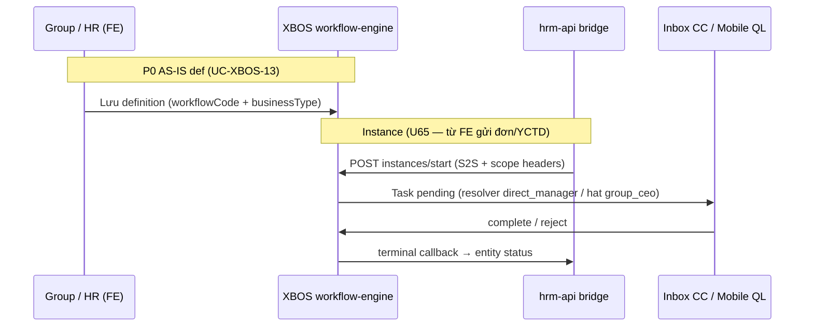

# PO — Taxonomy quy trình HRM enterprise (logistics VN)

| Meta | Value |
|------|--------|
| **Doc ID** | `PO-WF-CAT-TAXONOMY-01` |
| **work_item_id** | `PO-WF-CAT-TAXONOMY-01` |
| **Date** | 2026-08-03 |
| **Owner** | ba-process |
| **Parent program** | `docs/program/PO_ENTERPRISE_WF_CATALOG_MATRIX_PROGRAM.md` §3 |
| **Status** | **APPROVED (governance)** — map AS-IS/GAP; **không** claim UAT DONE |
| **Locks** | U65 · U84 · no_prompt_echo · cấm bịa `workflowCode` |

---

## 1. Mục tiêu và phạm vi

**Mục tiêu:** Chốt bộ `process_id` P0–P2 cho HRM enterprise logistics VN; map mỗi process tới `workflowCode` / `businessType` **thực có trong code** hoặc ghi **SPEC_GAP** / **CANDIDATE** (chưa có constant).

**Nguồn đối chiếu (đọc — không sửa):**

| Nguồn | Vai trò |
|--------|---------|
| `apps/api/xbos-api/src/workflow-engine/workflow-catalog.constants.ts` | SoT mã WF canvas + `build*Definition()` |
| `apps/api/hrm-api/src/attendance/leave-workflow.bridge.ts` | Bridge P-LEAVE spawn/callback |
| `apps/api/hrm-api/src/recruitment/recruitment-workflow.bridge.ts` | Bridge P-REC-* spawn/callback |
| `docs/xbos/SRS.md` UC-XBOS-13..15 | Định nghĩa / instance / inbox |
| `docs/hrm/TECHSPEC.md` §16–18 | Leave AT-12 · Recruitment submit-workflow |
| `docs/decisions/` ADR-WORKFLOW-RESOLVER-DYNAMIC (cite trong CODE-MEMORY) | Resolver direct_manager |
| Program §3–§5 | Taxonomy + gán công ty |

**Out of scope wave này:** Ma trận process×company×catalog (→ `PO-WF-CAT-COMPANY-MATRIX-01` · ba-data); thực thi TC browser (→ QA packs).

---

## 2. Legend map code

| Trạng thái map | Ý nghĩa | QA/TC |
|----------------|---------|-------|
| **AS-IS** | `workflowCode` + `businessType` có trong `workflow-catalog.constants.ts` và/hoặc bridge HRM tương ứng | TC tạo def (XBOS) + instance (FE) + approve |
| **AS-IS (HRM-only)** | Nghiệp vụ + approve trong HRM API/DB; **chưa** bridge XBOS `instances/start` | TC HRM mutate + approve; WF designer **SPEC_GAP** |
| **SPEC_GAP** | SRS/program yêu cầu WF enterprise; **không** có mã trong catalog constants | Row gap + BA/SA delta; **cấm** invent code trong TC |
| **CANDIDATE** | Chưa impl; đặt tên đề xuất **chưa khóa** — chờ SA đặt tên chính thức | Chỉ template/def TC sau khi SA lock |

**Phụ — định nghĩa canvas (UF-XBOS-08):** `businessType` = `workflow_definition_review` (`WF_BUSINESS_TYPE_DEFINITION_REVIEW`) — không thuộc 14 family HRM §3 program; dùng pack `XBOS-WF-DESIGNER`.

---

## 3. Bảng taxonomy (process_id → code → gap)

| `process_id` | Tên VI | Domain | Priority | Actors (tối thiểu) | Diễn biến tối thiểu (bước SRS) | `workflowCode` | `businessType` | Map | Gap / ghi chú |
|--------------|--------|--------|----------|-------------------|--------------------------------|----------------|----------------|-----|----------------|
| **P-REC-PLAN** | Duyệt kế hoạch tuyển | Tuyển dụng | P0 | QL PB · HRBP · Group CEO (template) | 1) HR lập KHTD → 2) Gửi duyệt QT → 3) QL/CEO duyệt/từ chối → 4) Trạng thái plan terminal | `hrm_recruitment_plan_approval` | `hrm_recruitment_plan` | **AS-IS** | Bridge: `recruitment-workflow.bridge.ts`; canvas `buildHrmRecruitmentPlanApprovalDefinition()` |
| **P-REC-REQ** | Duyệt yêu cầu tuyển (YCTD) | Tuyển dụng | P0 | Trưởng bộ phận · HR · CEO (inbox) | 1) Tạo YCTD (headcount ≥1) → 2) Submit WF → 3) Duyệt → 4) `open`/terminal | `hrm_requisition_approval` | `hrm_requisition` | **AS-IS** | CO-TMDV tài xế · CO-VISUN HDV — persona khác §5 program |
| **P-REC-PIPE** | Pipeline ứng viên / offer | Tuyển dụng | P0 | HR · PV · QL tuyến | 1) Intake → 2) Screening → 3) Interview → 4) Offer → 5) Hire/reject | `hrm_candidate_pipeline` | `hrm_candidate` | **AS-IS** | Graph 4 bước `rec_intake`…`rec_offer`; map stage `REC_WF_TASK_TYPE_TO_STAGE` |
| **P-LEAVE** | Duyệt nghỉ phép | Chấm công | P0 | NV · QL trực tiếp · (L2) cấp trên | 1) NV gửi đơn → 2) Spawn WF → 3) QL duyệt/từ chối → 4) Terminal cập nhật leave | `hrm_leave_approval` | `hrm_leave` | **AS-IS** | **SPEC_GAP L2:** AS-IS graph **1 bước** `direct_manager`; ladder L1→L2 + `T_L1` = GAP-LEAVE-LADDER-01 (HOLD sponsor) |
| **P-ATT-ADJ** | Điều chỉnh CC / đi muộn | Chấm công | P0 | NV/Tài xế · QL ca | 1) Tạo YC chỉnh CC → 2) QL duyệt/từ chối → 3) Cập nhật bảng công | *(none in catalog)* | *(none)* | **AS-IS (HRM-only)** | Bảng `attendance_update_requests`; approve/reject Nest — **SPEC_GAP** WF: đề xuất CANDIDATE `hrm_attendance_adjustment_approval` / `hrm_attendance_adjustment` |
| **P-OT** | Duyệt tăng ca | Chấm công | P1 | NV ca · QL vận hành | 1) Đăng ký OT (ngày/ca/loại) → 2) QL duyệt → 3) OT vào báo cáo/lương | *(none)* | *(none)* | **CANDIDATE** | API `overtime-requests` + approve HRM — **không** bridge XBOS; SRS mindmap OT = MISSING/GĐ2 signal |
| **P-CONTRACT** | Gia hạn / ký HĐ | Hợp đồng | P1 | HR · NV · QL | 1) HR đề xuất HĐ → 2) Duyệt → 3) Ký/lưu trạng thái | *(none)* | *(none)* | **CANDIDATE** | CANDIDATE `hrm_contract_approval` / `hrm_contract` — chưa constant |
| **P-PROBATION** | Công nhận hết thử việc | Nhân sự | P1 | QL · HR | 1) Nhắc hết TV → 2) QL đánh giá → 3) Duyệt chính thức | *(none)* | *(none)* | **CANDIDATE** | CANDIDATE `hrm_probation_approval` / `hrm_probation` |
| **P-TRANSFER** | Điều chuyển / kiêm nhiệm | Nhân sự | P1 | HR · QL cũ/mới · CEO (multi-co) | 1) Lập QĐ điều chuyển → 2) Duyệt chuỗi → 3) Cập nhật NV | *(none)* | *(none)* | **CANDIDATE** | CANDIDATE `hrm_transfer_approval` / `hrm_transfer` |
| **P-DISCIPLINE** | Kỷ luật | Nhân sự | P2 | HR · QL · BLD | 1) Lập biên bản → 2) Duyệt → 3) Lưu hồ sơ | *(none)* | *(none)* | **CANDIDATE** | P2 — sau P0 matrix |
| **P-TRAIN** | Đào tạo / chứng chỉ lái | Logistics | P1 | HR đào tạo · Tài xế · QL đội xe | 1) Gán lộ trình/Giấy phép → 2) Theo dõi hạn GPLX → 3) Duyệt hoàn thành | *(none)* | *(none)* | **CANDIDATE** | CANDIDATE `hrm_training_cert_approval` / `hrm_training`; logistics GPLX §4 BR |
| **P-EXIT** | Nghỉ việc / offboarding | Nhân sự | P1 | NV · QL · HR · IT checklist | 1) Đơn nghỉ → 2) Duyệt → 3) Offboard checklist | *(none)* | *(none)* | **CANDIDATE** | CANDIDATE `hrm_exit_approval` / `hrm_exit` |
| **P-PAY-EX** | Ngoại lệ lương / tạm ứng | Lương | P2 | NV · Kế toán · CEO | 1) YC ngoại lệ → 2) Duyệt → 3) Post payroll | *(none)* | *(none)* | **CANDIDATE** | P2 |
| **P-CAT-EXT** | Duyệt mở rộng danh mục member | Catalog | P0 | Admin CT con · Group CEO | 1) CT gửi extension → 2) Tập đoàn duyệt/từ chối → 3) Pull HRM | `wf_hrm_catalog_extension_xe_du_lich` | `hrm_catalog_extension` | **AS-IS** | Pattern `wf_hrm_catalog_extension_{member}`; pilot tenant `xe-du-lich` trong constant |

---

## 4. Luồng tổng thể (reference)

---

## 5. Business rules logistics (P-REC · P-TRAIN · P-OT · P-ATT-ADJ)

Áp dụng khi gán **Primary** `CO-TMDV` (tài xế/vận hành) và spot các CT khác — bổ sung program §5, **không** thay SRS FR gốc.

### 5.1 P-REC-* (tuyển tài xế / vận hành)

| BR ID | Điều kiện | Hành động | Kết quả | Evidence test |
|-------|-----------|-----------|---------|---------------|
| **BR-PO-REC-LGX-01** | YCTD `job_titles` / vị trí thuộc nhóm **Lái xe / Vận hành** (catalog `job_titles` CO-TMDV) | Bắt buộc field **GPLX hạng** + **kinh nghiệm tuyến** trên hồ sơ ứng viên trước bước Offer | Không chuyển stage `offer` nếu thiếu (FE validation + AC) | TC-HRM-REC: CO-TMDV YCTD → pipeline → offer gate |
| **BR-PO-REC-LGX-02** | Ứng viên Offer approved | Hire link tạo NV với `employment_type` phù hợp ca/kho | `hrm_candidate` terminal `hired` → employee row | J-REC hire spine |
| **BR-PO-REC-LGX-03** | KHTD (P-REC-PLAN) vượt headcount rollup đội xe tháng | YCTD spawn vẫn được nhưng inbox ghi **cảnh báo vượt định biên** (display) | Không auto-reject — QL/CEO quyết định | SPEC_GAP display — ba-data + SA |

### 5.2 P-TRAIN (GPLX / chứng chỉ logistics)

| BR ID | Điều kiện | Hành động | Kết quả | Evidence test |
|-------|-----------|-----------|---------|---------------|
| **BR-PO-TRAIN-LGX-01** | NV có vai trò tài xế (plane A job_title) | Theo dõi **ngày hết hạn GPLX**; trước T-30 ngày → thông báo QL + NV | In-app/mobile notice; không khóa lương tự động wave này | TC-TRAIN-REMIND (PLANNED) |
| **BR-PO-TRAIN-LGX-02** | GPLX hết hạn (T0) | **Cấm** xếp ca lái chính cho đến khi có bản ghi đào tạo/cấp lại **approved** | Ca planner reject hoặc cảnh báo đỏ | SPEC_GAP ca planner — CANDIDATE WF P-TRAIN |
| **BR-PO-TRAIN-LGX-03** | Hoàn thành khóa bắt buộc (DEFensive driving / HHGT) | QL + HR duyệt chứng chỉ → cập nhật competency | Trạng thái đủ điều kiện lái | CANDIDATE `hrm_training_cert_approval` |

### 5.3 P-OT (tăng ca logistics)

| BR ID | Điều kiện | Hành động | Kết quả | Evidence test |
|-------|-----------|-----------|---------|---------------|
| **BR-PO-OT-LGX-01** | OT đăng ký **trước ca** ≥ 2h (ca kho) hoặc **sau ca** trong 24h (ca tuyến) | Validate `overtime_type` + `overtime_date` | 400 nếu ngoài cửa sổ | Unit/API khi SA lock API_DESIGN OT |
| **BR-PO-OT-LGX-02** | Tổng OT tuần NV > ngưỡng policy (config — **không** hardcode N) | Yêu cầu thêm bước duyệt **QL đội + HR** | SPEC_GAP multi-step — hiện AS-IS approve 1 cấp HRM API | TC-OT-BLK until WF code |
| **BR-PO-OT-LGX-03** | OT **ca đêm** / **lễ** | Hệ số ca lấy từ catalog `shifts` (`is_night_shift`, coefficient) | Payroll consume — không tính trên FE | HRM-ATTENDANCE TC FN-REQ-OT |

### 5.4 P-ATT-ADJ (đi muộn / chỉnh công ca)

| BR ID | Điều kiện | Hành động | Kết quả | Evidence test |
|-------|-----------|-----------|---------|---------------|
| **BR-PO-ATT-LGX-01** | YC chỉnh công lý do **đi muộn tuyến** / **GPS lệch** | Bắt buộc **mốc ca** + **lý do** + (tuỳ chọn) ảnh/log | Row `attendance_update_requests` pending | Mobile AT-01 · HRM approve |
| **BR-PO-ATT-LGX-02** | QL duyệt đi muộn ≤ 15 phút và ≤ 3 lần/tháng | Auto-approve policy (alternate) | **SPEC_GAP** — hiện manual approve only | ba-process defer |
| **BR-PO-ATT-LGX-03** | Duyệt xong | Cập nhật `attendance_records` tương ứng; fanout `attendance_update_request.approved` | FE F5 thấy công đã chỉnh | U65 FE path |

---

## 6. Handoff

| Role | Việc kế | Done when |
|------|---------|-----------|
| **ba-data** | `PO-WF-CAT-COMPANY-MATRIX-01` — process×`co_key`×catalog key + AC cột | File matrix + trace `PO_WF_PROCESS_TAXONOMY.md` §3 |
| **sa** | Lock tên CANDIDATE WF; delta API_DESIGN P-ATT-ADJ / P-OT bridge | ADR hoặc TechSpec §WF append |
| **qa** | TC packs §6 program — cột `process_id` · `co_key` | PLANNED rows; **không** seed inbox |

---

## 7. Rủi ro mở

| ID | Mô tả | Owner |
|----|--------|-------|
| **R-PO-WF-01** | P-LEAVE L2 ladder (`T_L1`) chưa sponsor — TC LV-02 BLOCKED | PM + sponsor |
| **R-PO-WF-02** | P-ATT-ADJ / P-OT approve HRM-only — inbox XBOS không thống nhất | SA bridge wave |
| **R-PO-WF-03** | `wf_hrm_catalog_extension_*` chỉ 1 member code AS-IS — CT khác cần pattern mới | Dev-BE + ba-data |

---

*PO-WF-CAT-TAXONOMY-01 · ba-process · 2026-08-03*
