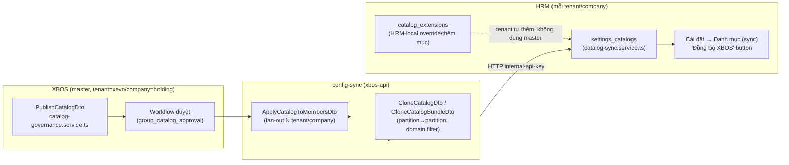

# Phân tích nghiệp vụ HRM từ dữ liệu khách hàng gửi P.CNTT — Kiến trúc XBOS Master Data → Tenant

| Meta | Value |
|---|---|
| work_item_id | BA-CNTT-PAYROLL-CATALOG-ARCH-01 |
| Ngày | 2026-08-13 |
| Nguồn dữ liệu | `docs/từ khách hàng/Gửi P.CNTT/` — 6 mảng nghiệp vụ, đã đọc **thật 100%** bởi 6 agent CLAUDE-CODE (không dùng file `SYNTHESIS-CNTT-PAYROLL-67FILES...FULL.xlsx` của phiên khác — đã xác nhận có dữ liệu bịa, xem `docs/journal/2026-08-13.md`) |
| Trạng thái | DRAFT — chờ sponsor duyệt trước khi đụng vào bất kỳ hệ thống nào |

---

## 0. Tóm tắt cho sponsor (đọc trước, 2 phút)

1. **Dữ liệu payroll đã đọc thật, verify chéo PDF↔Excel** — xem §3. Không có gì cần đọc lại.
2. **Kiến trúc đúng đã CÓ SẴN trong code, không cần phát minh mới** — XBOS đã có cơ chế "publish catalog ở master → apply xuống tenant/company" hoàn chỉnh (`CatalogGovernanceService`, `ApplyCatalogToMembersDto`, `CloneCatalogDto`) — xem §1. Việc còn lại là DÙNG đúng cơ chế này, không phải insert thẳng vào HRM.
3. **Thư viện điều khoản hợp đồng (mà bạn hỏi) đã có khung sẵn** — `hrm_contract_clauses` (bảng đã có cột `origin`/`origin_company_id`/`lineage_code` — tức là đã thiết kế cho đúng mô hình master→tenant clone bạn mô tả), UI `ContractClauseGroupNav`/`ContractClauseListTable` đã build — xem §2. Cái thiếu là NỘI DUNG điều khoản thật (chưa thấy trong `Gửi P.CNTT` — folder này chủ yếu là chính sách LƯƠNG, không phải điều khoản hợp đồng lao động đầy đủ).
4. **19 câu bạn đã trả lời trong sheet Xác nhận (file cũ) vẫn dùng được** — vì chúng nói về NGUYÊN TẮC cấu hình (per-tenant, per-Payroll-Group...), không phụ thuộc số liệu bịa.
5. Việc tiếp theo: bạn duyệt bản phân tích này + file Excel danh mục thật (`SYNTHESIS-CNTT-PAYROLL-REAL-...xlsx`, đang làm) → mới bàn bước nạp dữ liệu theo đúng luồng XBOS ở §4.

---

## 1. Kiến trúc Master Data — ĐÃ CÓ SẴN, chỉ cần dùng đúng

Đọc code thật xác nhận (không suy đoán):



**Nguồn tham chiếu code thật** (không phải suy đoán):
- `apps/api/xbos-api/src/catalog-governance/catalog-governance.service.ts` — publish + workflow duyệt (`WF_BUSINESS_TYPE_HRM_CATALOG`, step `group_catalog_approval`), gọi HRM qua `hrmFetch` (header `x-internal-api-key`, `x-tenant-id`, `x-company-id`).
- `apps/api/xbos-api/src/config-sync/dto/publish-catalog.dto.ts` — 1 catalog = `{name, domain, assignedTo: ['hrm'|'xbos'|'web-portal'], items: [{code,label,unit,status}]}`, publish từ `tenantId+companyId` (thường = `xevn`/`holding`, hằng số `MASTER_TENANT_XEVN`/`MASTER_COMPANY_HOLDING`).
- `apps/api/xbos-api/src/config-sync/dto/apply-catalog-to-members.dto.ts` — fan-out catalog đã publish xuống nhiều `targets: [{tenantId, companyId}]` — **đây chính là cơ chế "tenant mới load master nào" bạn hỏi**.
- `apps/api/xbos-api/src/config-sync/dto/clone-catalog.dto.ts` + `clone-catalog-bundle.dto.ts` — sao chép catalog partition→partition, filter theo `domain[]`/`keyPrefix`, chính sách xung đột `reject|overwrite|skip`.
- `apps/api/hrm-api/src/catalog-sync/catalog-sync.service.ts` + `apps/web/hrm/src/components/settings/SettingsCatalogsTab.tsx` (nút "Đồng bộ XBOS") — phía HRM nhận catalog XBOS đã publish, hiển thị nguồn `XBOS` vs `HRM` (extension) trong bảng — khớp đúng những gì thấy trên UI hôm nay (`ceo`, `CHRO` = XBOS; `dev_dead`, `qa_test_dialog` = HRM local).

**Kết luận kiến trúc:** dữ liệu danh mục rút ra từ `Gửi P.CNTT` (Thành phần lương, Ngạch bậc, Loại quyết định, Loại hợp đồng, Ca làm việc...) — nếu là **danh mục dùng chung nhiều tenant/công ty thành viên** (VD ngạch bậc D1-E2 theo QĐ 2A áp dụng "Toàn công ty") → PHẢI publish ở XBOS (`tenantId=xevn, companyId=holding`) rồi `ApplyCatalogToMembers` xuống các company con, KHÔNG insert thẳng vào HRM 1 tenant. Chỉ những mục thật sự riêng biệt 1 tenant (VD 1 vài mã nội bộ) mới dùng `catalog_extensions` (HRM-local).

---

## 2. Thư viện điều khoản hợp đồng — khung đã có, nội dung chưa có

**Đã có trong code** (không cần dựng mới):
- Bảng `hrm_contract_clauses` (Postgres) — cột: `company_id, code, title_vi, body_vi, clause_group, status, created_by, updated_by, origin, origin_company_id, lineage_code`. Cột `origin`/`origin_company_id`/`lineage_code` cho thấy hệ thống **đã thiết kế sẵn cho mô hình clause có nguồn gốc từ 1 company/tenant khác** (giống hệt tinh thần "XBOS master → clone xuống tenant" bạn mô tả) — chỉ là hiện áp cho hợp đồng, chưa chắc đã nối với luồng XBOS catalog-governance ở §1 (cần SA xác nhận có đi qua config-sync hay là cơ chế riêng — **điểm cần hỏi SA**, chưa tự kết luận).
- UI: `apps/web/hrm/src/components/settings/ContractClauseGroupNav.tsx`, `ContractClauseListTable.tsx`, `ContractLegalPrintSettingsPanel.tsx` (tab "Điều khoản HĐ" trong Cài đặt) — quản lý nhóm điều khoản (`clause_group`), CRUD điều khoản, versioning (`clauses_snapshot_json` lưu tại thời điểm ký — hợp đồng cũ giữ nguyên nội dung điều khoản dù điều khoản gốc bị sửa sau).
- `apps/web/hrm/src/components/contracts/ContractCreateStep2ClausePreview.tsx` — bước tạo hợp đồng đã có sẵn bước "chọn điều khoản có sẵn" (đúng như bạn mô tả — không gõ lại).
- `apps/web/hrm/src/lib/contractClauseLibraryUx.ts`, `contractClauseOrder.ts` — logic UX thư viện điều khoản, thứ tự hiển thị.

**Chưa có:** nội dung điều khoản THẬT của công ty. `Gửi P.CNTT/` là dữ liệu **chính sách LƯƠNG/thưởng/phụ cấp** (quy chế, quyết định điều chỉnh đơn giá) — không phải văn bản hợp đồng lao động đầy đủ với các điều khoản pháp lý chuẩn (thời hạn HĐ, nghĩa vụ, quyền lợi, chấm dứt HĐ...). 1 file mẫu hợp đồng thử việc thật (`HỢP ĐỒNG THỬ VIỆC` — Công ty TNHH X.E Việt Nam) từng được đọc ở phiên trước (không nằm trong `Gửi P.CNTT`) có cấu trúc 5 điều (Điều 1: Thời hạn/công việc; Điều 2: Chế độ làm việc; Điều 3: Nghĩa vụ/quyền lợi NLĐ; Điều 4: Nghĩa vụ/quyền hạn NSDLĐ; Điều 5: Điều khoản thi hành) — đây là ứng viên tốt để seed thư viện điều khoản MẶC ĐỊNH, nhưng **cần sponsor xác nhận** đây có phải mẫu chính thức muốn dùng làm SoT không, và có mẫu HĐ chính thức (không phải thử việc) hay chưa.

**Tham khảo thế giới** (WebSearch, nguồn dưới): mô hình "Contract Clause Library" chuẩn ngành — kho điều khoản đã duyệt sẵn (pre-approved), gắn metadata/tag (loại HĐ, khu vực pháp lý), version control, không cho sales/HR tự viết lại — công cụ chỉ được CHỌN + đúng câu chữ đã duyệt. Đây khớp 100% với thiết kế `clause_group` + `status` + snapshot-tại-thời-điểm-ký đã có trong code XeVN — hướng đi hiện tại ĐÚNG chuẩn ngành, chỉ cần hoàn thiện nội dung + luồng publish từ XBOS nếu điều khoản cần dùng chung nhiều company (giống §1).

---

## 2b. Công thức lương động (formula engine) — ĐÃ CÓ, nhưng chưa đủ "mở" như AMIS HRM cho các công thức CNTT

Sponsor so sánh với AMIS HRM (cấu hình bảng lương bằng công thức tham chiếu tên biến). Đọc code thật xác nhận:

**Đã có sẵn** — `apps/api/hrm-api/src/payroll/pay-formula*.ts` (2.214 dòng, 3 file chính):
- `pay-formula.service.ts` — CRUD công thức lương: trạng thái `draft → pending_publish → active → retired`, **dual-control publish** (2 người duyệt), mã công thức ổn định (`pay_formula_code`), expression lưu dạng JSON (`expression_json`).
- `pay-formula-evaluator.ts` — evaluator thuần (pure function), form đã tài liệu hoá `gd1_eval_v1`: mỗi dòng công thức = `{component_code, sign: earning|deduction, source: var|const|expr, var?, amount?, expr?: {op: add|sub|mul|div, left, right}}`. **Đã tự trích dẫn AMIS trong CODE-MEMORY**: `"AMIS SRC Emp→Period→Template→Catalog (cite only)"` — tức là chain ưu tiên nguồn dữ liệu (Nhân viên override → Kỳ lương → Mẫu bảng lương → Danh mục) đã lấy đúng cảm hứng từ AMIS.
- `pay-formula-variable-bag.ts` — bộ nạp biến từ DB thật: giờ công đã chốt (`payable_hours`, `standard_hours`, `ot_hours_weighted`...), lương cơ bản/phụ cấp từ hồ sơ C&B nhân viên, số người phụ thuộc GTGC — **đúng tinh thần "kéo extra data từ DB ra, định nghĩa bằng tên"** sponsor mô tả.

**Giới hạn hiện tại (gap thật, không phải lỗi — chỉ là chưa mở rộng tới):**
`PAY_FORMULA_REQUIRED_VAR_ALLOWLIST` (constants) hiện CHỈ có 7 biến cố định: `payable_hours, standard_hours, ot_hours_weighted, paid_leave_hours, unpaid_leave_hours, base_salary, dependents_count` + 1 pattern mở `allowance_[a-z0-9_]+`. Đây là danh sách ĐÓNG (closed allow-list), người dùng KHÔNG tự thêm biến mới qua UI được.

**Đối chiếu công thức THẬT từ `Gửi P.CNTT`** — ví dụ sponsor đưa (Tổng đài, QĐ 196/2024):

```
Tổng lương = Lương cuộc nghe + Lương hợp đồng + Lương thời gian
           + Thưởng Top + Thưởng hạn chế cuộc gọi nhỡ
           + Lương phép + Phụ cấp khác
```

| Thành phần trong công thức thật | Có trong allowlist hiện tại? | Nguồn dữ liệu cần "kéo" |
|---|---|---|
| Lương cuộc nghe | ❌ Không | `= Đơn giá/cuộc × Số cuộc nghe` — số cuộc nghe nằm trong file `KPI 1500/1731 T5.2026.xlsx` (dữ liệu vận hành tổng đài, KHÔNG phải attendance/C&B) |
| Lương hợp đồng | ❌ Không | `= Đơn giá/hợp đồng × Số hợp đồng` — cùng nguồn KPI 1500/1731 |
| Lương thời gian | ❌ Không | Đơn giá cố định theo ca (700k/1.5tr) — có thể map `const` |
| Thưởng Top | ❌ Không | Xếp hạng theo điểm CLDV — nguồn `BC tỉ lệ nhỡ` |
| Thưởng hạn chế gọi nhỡ | ❌ Không | Hệ số theo bậc thang tỷ lệ nhỡ — nguồn `BC tỉ lệ nhỡ t5.2026.xlsx` |
| Lương phép | ✅ Có (`paid_leave_hours` × base) | |
| Phụ cấp khác | ✅ Có (`allowance_*` pattern) | |

Tương tự với 2 công thức thật khác đã trích (không liệt hết, xem §3):
- **Lái xe tuyến**: `Lương lượt (đơn giá theo tỉnh/bậc thang) + Lương doanh thu (%DT theo bậc) + Lương CLDV (hệ số theo điểm) + Lương CPN + Lương hợp đồng khác tỉnh − giảm trừ` — hầu hết KHÔNG có trong allowlist hiện tại (đơn giá lượt/doanh thu/CLDV đều là dữ liệu vận hành ngoài attendance/C&B).
- **Lái xe tải**: `Lương cứng + Lương TN QLPT + Thưởng DT (bậc thang theo tải trọng) + PC giao hàng phân phối + Lương KPI` — tương tự, phần lớn ngoài allowlist.

**Kết luận:** đa số các khoản thu nhập THẬT trong `Gửi P.CNTT` là **thu nhập theo sản lượng/vận hành** (số cuộc gọi, số lượt, số hợp đồng, doanh thu, điểm chất lượng) — nguồn dữ liệu này khác hẳn nhóm biến hiện có (attendance/C&B/GTGC). Đây khớp đúng với khái niệm **"Input Pack"** đã được BA speced TRƯỚC ĐÓ cùng phiên làm việc này (`docs/program/specs/PO-HRM-PAY-INPUT-PACKS-SPEC-01.md`, work item `PO-HRM-PAY-INPUT-PACKS-SPEC-01`) — tức là đội đã lường trước nhu cầu "nạp dữ liệu vận hành ngoài" làm biến công thức, nhưng **chưa nối `pay-formula-variable-bag.ts` với input pack đó** (allowlist vẫn chỉ có 7 biến cũ). Đây là gap kỹ thuật cụ thể, nên là **work item riêng** (đề xuất: `PO-HRM-PAY-FORMULA-INPUT-PACK-VAR-BAG-BE-01`) — mở allowlist từ "đóng cứng 7 biến" sang "biến do BA/PM định nghĩa qua Input Pack Profile (đã có UI `pay_input_pack_profile` catalog), validate tên biến theo quy ước, rồi evaluator/variable-bag đọc động" — đúng tinh thần AMIS mà sponsor mô tả, không phải build lại từ đầu.

---

## 3. Dữ liệu payroll thật đã trích xuất (6 agent, verify chéo) — tóm tắt điều hướng

Toàn bộ bảng chi tiết (Quyết định-Chính sách / Cấu trúc Excel / Đề xuất danh mục) theo từng mảng nằm đầy đủ trong lịch sử hội thoại phiên làm việc 2026-08-13 (task-notification của 6 agent: dphh, tdhk, misc, lxtuyen, lxtai, vptinh) và sẽ được đưa vào file Excel đồng hành `SYNTHESIS-CNTT-PAYROLL-REAL-20260813.xlsx`. Điểm nổi bật nhất:

| Mảng | Phát hiện quan trọng nhất |
|---|---|
| Chung (QĐ 2A) | **Bảng ngạch bậc chính thức 11 ngạch D1→E2**, lương tối thiểu công ty = 5.310.000đ (bậc I ngạch E2) — nguồn CHUẨN cho catalog "Ngạch bậc" |
| Điều phối hàng hóa | Quy chế 2022 + 6 QĐ điều chỉnh (hoa hồng DTHG 6-8%→7.5-10.5%, DTHN 1%→2-3%, lương ship 25%→50%→70%); thang lương bậc 1-10 |
| Tổng đài hành khách | QĐ 196/2024 (không phải "QĐ 412" như file bịa) — công thức Lương cuộc nghe + hợp đồng + thời gian + Top + hạn chế gọi nhỡ; **KPI 1500/1731 = 2 đầu số hotline khác nhau**, không phải 2 chuẩn KPI |
| Lái xe tuyến | Cơ chế lương **khác nhau theo từng tỉnh** (6 tỉnh), thay đổi nhiều lần theo QĐ 439/753/816/837/169; đơn giá lượt Nam Định thật 45k→70k (KHÔNG phải 180k như file bịa) |
| Lái xe tải | QĐ 206/2026 — **bảng định mức đầy đủ 19 loại tải trọng** (lương cứng 7.5-12.5tr, TN QLPT, mức DT hỗ trợ/mục tiêu) + khoán nhiên liệu 10 nhóm xe |
| Văn phòng tỉnh | Quy chế 2020 (chỉ 3/6 tỉnh có PDF gốc: Nam Định/Ninh Bình/Thái Bình), hệ số lương theo chức danh TCN=20/ĐH=17/LXTC=16/KT=12 |

**Danh mục KHÔNG có căn cứ nguồn** trong `Gửi P.CNTT` (không bịa thêm): Kênh tuyển dụng, Nhà bảo hiểm (thương mại), Loại nghỉ đầy đủ (chỉ thấy phép/lễ, chưa thấy ốm/thai sản/việc riêng đầy đủ), Ca làm việc chuẩn hóa (18 sheet lịch làm việc dùng ký hiệu KHÁC NHAU theo từng tỉnh/đơn vị — xem 19 câu Xác nhận cũ, Q1 sponsor đã trả lời "dùng riêng từng tenant").

---

## 4. Đề xuất luồng xử lý (theo đúng kiến trúc §1, KHÔNG tự ý insert)

1. **Phân loại từng đề xuất danh mục** (sẽ có trong Excel đồng hành) theo 2 nhóm:
   - **MASTER (XBOS)** — áp dụng "Toàn công ty"/nhiều company (VD Ngạch bậc QĐ 2A, Loại quyết định chung) → publish qua `PublishCatalogDto` tại `xevn/holding`.
   - **TENANT-LOCAL (HRM extension)** — chỉ 1 company/chi nhánh (VD đơn giá lượt riêng Nam Định, cơ chế lương riêng lái xe tuyến 1 tỉnh) → tạo qua `catalog_extensions` của đúng company đó (HRM UI "Đồng bộ (sync)" → "Thêm mới").
2. Với nhóm MASTER: cần xác nhận `domain` + `assignedTo` phù hợp (VD domain=`payroll`, assignedTo=`['hrm']`) trước khi publish — **cần SA/PM xác nhận domain taxonomy hiện có** (chưa tự đặt tên domain mới nếu chưa thấy quy ước).
3. Với "Thành phần lương" có công thức phức tạp (%DT theo bậc thang, hệ số CLDV...) — bản thân catalog chỉ chứa TÊN + MÃ; **công thức tính** thuộc phạm vi `pay_sheet_template`/`salary_components`/policy pack (đã có kiến trúc riêng từ chuỗi `PO-HRM-PAY-SHEET-TEMPLATE-SPEC-01` làm trước đó cùng phiên) — không nhét công thức vào catalog item.
4. Chạy thử 1 domain nhỏ trước (VD "Ngạch bậc" — dữ liệu sạch nhất, ít tranh cãi nhất) qua đúng luồng XBOS → verify HRM nhận đúng qua "Đồng bộ XBOS" → mới mở rộng các domain còn lại.
5. **Không có bước "autotest insert" kiểu ghi thẳng DB** — mọi thay đổi catalog phải qua API `publish/apply/clone` ở trên để giữ đúng audit trail + workflow duyệt đã xây.

---

## 5. Câu hỏi còn mở cần sponsor/SA quyết trước khi code

| # | Câu hỏi | Vì sao quan trọng |
|---|---|---|
| 1 | `hrm_contract_clauses` hiện có đi qua luồng XBOS catalog-governance (§1) hay là cơ chế riêng của HRM? | Quyết định điều khoản HĐ tạo ở XBOS hay tạo thẳng HRM |
| 2 | Danh mục "domain" hợp lệ hiện tại ở XBOS là gì (đã có sẵn danh sách chưa, hay tự đặt mới)? | Tránh tạo domain trùng/rác khi publish |
| 3 | Có mẫu Hợp đồng lao động CHÍNH THỨC (không phải thử việc) để làm SoT cho thư viện điều khoản không? | `Gửi P.CNTT` không có, cần sponsor cung cấp thêm nếu muốn build thư viện điều khoản thật |
| 4 | 19 câu trả lời cũ (sheet Xác nhận file cũ) — xác nhận vẫn giữ nguyên áp dụng (không đổi vì phát hiện dữ liệu bịa chỉ ở phần số liệu/tên file, không ở phần logic bạn trả lời)? | Tránh hỏi lại sponsor những gì đã chốt |
| 5 | Phạm vi đợt 1 nên bắt đầu từ domain nào (đề xuất: Ngạch bậc QĐ 2A — sạch nhất) hay sponsor muốn ưu tiên khác? | Chọn điểm bắt đầu rủi ro thấp |

---

## 6. Nguồn

Sources: [SpotDraft — Contract Clause Library Guide](https://www.spotdraft.com/blog/contract-clause-library-in-2026) · [Concord — Clause Library](https://www.concord.app/blog/clause-library) · [ContractLogix — Clause and Template Library](https://www.contractlogix.com/contract-management/clause-and-template-library-clm/) · [Swiftwater — Clause Libraries, Templates & Playbooks](https://swiftwaterco.com/insights/what-are-clause-libraries-contract-templates-and-contract-playbooks/)

Code thật (nội bộ repo, không phải nguồn ngoài): `apps/api/xbos-api/src/catalog-governance/`, `apps/api/xbos-api/src/config-sync/dto/`, `apps/api/hrm-api/src/catalog-sync/`, `apps/web/hrm/src/components/settings/ContractClauseGroupNav.tsx` + `ContractLegalPrintSettingsPanel.tsx`.
