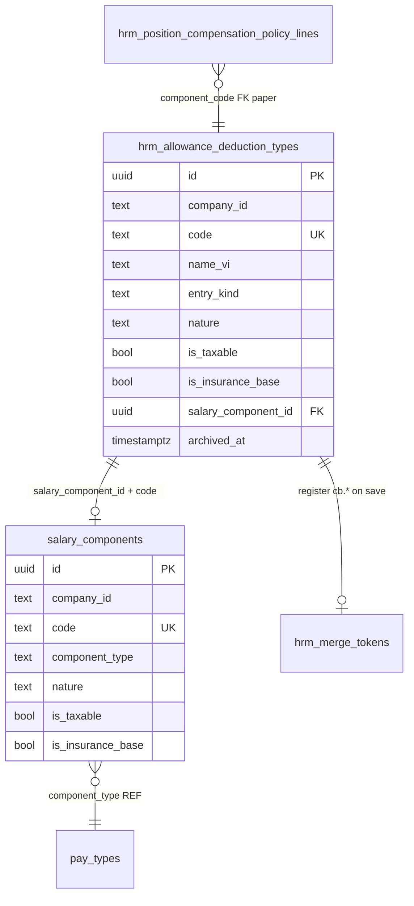

# PO-HRM-ALLOWANCE-CATALOG-SYNC-01 — Physical dual SoT PC/KT ↔ salary_components

| Field | Value |
|-------|--------|
| **work_item_id** | `PO-HRM-ALLOWANCE-CATALOG-SYNC-01` |
| **parent** | `PO-HRM-AMIS-PARITY-SETTINGS-DEFAULTS-BA-01` |
| **prior** | `PO-HRM-DYNAMIC-CONFIG-PLATFORM-DATA-01` · `PO-HRM-DYNAMIC-CONFIG-PLATFORM-PAY-CATALOG-API-01` |
| **lane** | governance · ba-data |
| **change_mode** | **ADD** `hrm_allowance_deduction_types` · **EXPAND** settings master key · **SYNC** contract to `salary_components` · **REGISTER** `cb.allowance_{code}` MergeToken |
| **date** | 2026-08-07 |
| **status** | **CONFIRMED** — unblocks `PO-HRM-SETTINGS-DEFAULTS-DATA-01` + SA API F.1 |
| **spec_ref** | **BR-AMIS-SET-DEF-03** · **UC-SET-DEF-03** · **AC-AMIS-SET-PC-CAT-01** · **AC-PLT-PAY-01** · **BR-PLT-01/02/04/05** · ADR Option **B** L1/L3/L6 |
| **honesty** | `payroll_e2e_ready=false` · **cấm** `apps/**` · **cấm** migrate this seat · U65 zero-seed |
| **ack_status** | **PASS_TO_PM** |

---

## 0. Verdict (machine-readable)

| Decision | Stamp |
|----------|--------|
| **Dual SoT pattern** | **CONFIRMED** — Settings PC/KT catalog = **authoritative write** for allowance/deduction kinds; `salary_components` = **PAY mirror** bound by shared `code` + optional `salary_component_id` |
| **Physical PC/KT** | **CONFIRMED ADD** `public.hrm_allowance_deduction_types` — **not** generic `hrm_catalog_extension_items` alone (typed nature/tax/SI flags) |
| **Settings catalog_key** | **CONFIRMED ADD** master key `allowance_deduction_types` (alias `allowance_types` \| `deduction_types` read-only) |
| **Sync on save** | **CONFIRMED** single transaction: PC row upsert → mirror `salary_components` → register `hrm_merge_tokens` |
| **MergeToken** | **CONFIRMED ADD** hook `cb.allowance_{code}` (income) · `cb.deduction_{code}` (deduction) — **BR-PLT-01 class** |
| **scope_parity** | **CONFIRMED U19** — PC list/get/mutate uses **same** `resolveHrmListScope` as `salary_components` |
| **soft-delete** | **CONFIRMED BR-PLT-04** — retire PC ↔ retire linked component; **cấm** hard-delete default |
| **AS-IS keep** | Live `salary_components` ensureSchema · starter rows · `pay_types` REF for `component_type` · **cấm** wipe PAY-CATALOG-BE |
| **Unlock** | **sa** F-ALLOW-CAT-SYNC F.1 → **dev-be** ensureSchema + sync service → unblocks **PO-HRM-SETTINGS-DEFAULTS-DATA-01** |

---

## 1. Problem & dual SoT model

### 1.1 Gap (P0 orphan)

| Surface today | Issue |
|---------------|-------|
| Settings «Danh mục PC/KT» (paper) | No physical typed catalog; no bind to PAY |
| `salary_components` (PARTIAL_LIVE) | PAY picker/engine SoT — rows may exist **without** Settings PC metadata |
| `hrm_catalog_extension_items` | Generic `{code,label,unit,status}` — **insufficient** for tax/SI/nature AMIS parity |
| Position policy / C&B (downstream) | **Blocked** — references `component_code` absent in unified catalog (**BR-AMIS-SET-DEF-03**) |

### 1.2 Dual SoT (locked)

```text
┌────────────────────────────────────────────────────────────────────┐
│ WRITE PATH (GĐ1 — Settings admin HCNS / C&B)                       │
│  Settings UI → F-ALLOW-CAT-* → hrm_allowance_deduction_types       │
│       │ single TX                                              │
│       ├── mirror UPSERT → salary_components (same code)            │
│       └── register UPSERT → hrm_merge_tokens (cb.allowance_*)      │
└────────────────────────────────────────────────────────────────────┘
         │ read (pickers)              │ read (engine / SRC)
         ▼                             ▼
   Policy / C&B / CTR merge      PAY template / process / formula vars
```

| Role | Entity | Authority |
|------|--------|-----------|
| **Settings semantics** | `hrm_allowance_deduction_types` | Nature PC/KT · taxable · SI base · calc_mode · display label VI |
| **PAY runtime identity** | `salary_components` | Open `code` · `component_type` (pay_types REF) · formula FK · process/template bind |
| **Contract merge** | `hrm_merge_tokens` | `cb.allowance_{code}` / `cb.deduction_{code}` picker |

**Code invariant:** `hrm_allowance_deduction_types.code` ≡ `salary_components.code` (case-sensitive storage; UQ on `lower(code)` per company).

**Reject orphan (GĐ1 product rule):** After PC catalog has ≥1 active row, **BR-PLT-02** — consumers (policy lines, C&B picker, template lines) **must** use catalog code; free-text `component_code` rejected on write.

---

## 2. Entity map & ER



---

## 3. CONFIRMED ADD — `hrm_allowance_deduction_types`

> Platform **ICatalogRow** instance for Settings vertical — domain `SET` · `catalog_kind=allowance_deduction`.

| Column | Type | Null | Default | Ý nghĩa |
|--------|------|------|---------|---------|
| `id` | uuid | NO | gen_random_uuid() | PK |
| `company_id` | text | NO | | Plane B slug — **same** persist rule as `salary_components` |
| `code` | text | NO | | Open slug — shared with PAY (`PC_DIEU_XE`, `KT_TAM_UNG`, …) |
| `name_vi` | text | NO | | Nhãn hiển thị Settings / merge / picker |
| `entry_kind` | text | NO | | `allowance` (phụ cấp) \| `deduction` (khấu trừ) |
| `nature` | text | NO | `income` | Maps to `salary_components.nature`: `income` \| `deduction` \| `other` |
| `value_type` | text | NO | `currency` | `currency` \| `number` \| `percent` |
| `is_taxable` | boolean | NO | false | Tính chất thuế TNCN |
| `is_insurance_base` | boolean | NO | false | Tính vào base BH |
| `calc_mode` | text | NO | `fixed` | `fixed` \| `formula` \| `rate` — GĐ1 UI may expose fixed+formula only |
| `default_value` | numeric(18,2) | NO | 0 | Định mức mặc định (VND) — **not** employee SoT |
| `min_value` | numeric(18,2) | YES | | Cap min |
| `max_value` | numeric(18,2) | YES | | Cap max |
| `default_formula_definition_id` | uuid | YES | | Optional soft FK → `pay_formula_definitions.id` (mirror to SC on sync) |
| `salary_component_id` | uuid | YES | | Soft FK → `salary_components.id` after mirror upsert |
| `component_code` | text | NO | | Denormalized `code` — join without UUID hop · audit |
| `description` | text | YES | | Ghi chú nội bộ |
| `sort_order` | int | NO | 0 | List order Settings |
| `status` | text | NO | `active` | `draft` \| `active` \| `retired` |
| `is_system` | boolean | NO | false | Starter row — **not** ceiling (**BR-PLT-05**) |
| `archived_at` | timestamptz | YES | | Soft-delete (**BR-PLT-04**) |
| `created_at` / `updated_at` | timestamptz | NO | now() | |
| `created_by` / `updated_by` | text | YES | | Actor |

### 3.1 Constraints / indexes

| Name (hint) | Rule |
|-------------|------|
| **PK** | `id` |
| **UQ active code** | `(company_id, lower(code)) WHERE archived_at IS NULL` |
| **UQ active component link** | `(salary_component_id) WHERE archived_at IS NULL AND salary_component_id IS NOT NULL` — one PC row per SC |
| **IX** | `(company_id, entry_kind, status)` · `(company_id, sort_order)` |
| **CHK `chk_allow_entry_kind`** | `entry_kind IN ('allowance','deduction')` — **only** closed enum on **kind axis** (not on code) |
| **CHK `chk_allow_nature`** | `nature IN ('income','deduction','other')` |
| **CHK `chk_allow_calc_mode`** | `calc_mode IN ('fixed','formula','rate')` |
| **CHK `chk_allow_status`** | `status IN ('draft','active','retired')` |
| **CHK `chk_allow_code_format`** | Same slug regex as `SALARY_COMPONENT_CODE_FORMAT` — format only |
| **FORBIDDEN** | `CHECK (code IN (...))` closed N-set on codes |

### 3.2 Lifecycle

| Event | PC row | Mirror `salary_components` | MergeToken |
|-------|--------|----------------------------|------------|
| Create active | INSERT | UPSERT by `(company_id, code)` | UPSERT `cb.allowance_*` or `cb.deduction_*` |
| Update flags/label | UPDATE | SYNC mapped columns | Refresh `label_vi` if token exists |
| Retire | `status=retired`, `archived_at` | `is_active=false`, `archived_at` | `status=retired` / soft archive token |
| Reactivate | clear `archived_at`, `status=active` | `is_active=true` | token `active` |
| Hard delete | **FORBIDDEN** default | **FORBIDDEN** if FK history | soft only |

---

## 4. Mirror map — PC → `salary_components`

| Source (`hrm_allowance_deduction_types`) | Target (`salary_components`) | Rule |
|------------------------------------------|------------------------------|------|
| `company_id` | `company_id` | Same slug |
| `code` | `code` | Identical |
| `name_vi` | `name` | Display |
| `entry_kind` + policy | `component_type` | Map §4.1 — assert in effective `pay_types` |
| `nature` | `nature` | Direct |
| `value_type` | `value_type` | Direct |
| `is_taxable` | `is_taxable` | Direct |
| `is_insurance_base` | `is_insurance_base` | Direct |
| `default_value` | `default_value` | Direct |
| `min_value` / `max_value` | `min_value` / `max_value` | Direct |
| `default_formula_definition_id` | `default_formula_definition_id` | Direct FK |
| `sort_order` | `sort_order` | Direct |
| `status` active? | `is_active` | `active` → true; else false |
| `archived_at` | `archived_at` | Parity |
| `is_system` | `is_system` | Direct |
| — | `formula` TEXT | **Do not** copy as engine — hint optional null |
| `id` (after insert SC) | back-ref | Set `salary_component_id` on PC row |

### 4.1 `entry_kind` → `component_type` (pay_types REF)

| entry_kind | Default `component_type` | Fallback |
|------------|------------------------|----------|
| `allowance` | `phu_cap` | First active `pay_types` where nature/class = allowance — tenant may override in body |
| `deduction` | `khau_tru` | First active deduction-class pay_type |

**Validation:** `assertCodeInEffectiveCatalog(pay_types, component_type)` — **`HRM-PAY-TYPE-KEY`** on sync failure.

**Starter rows:** Bootstrap examples in ensureSchema **may** pre-link existing `LUONG_CO_BAN` etc. — **not** required to create PC rows for system base/thue/cham_cong GĐ1 (those are PAY-native, not PC/KT catalog).

---

## 5. MergeToken registration (BR-PLT-01 class)

On **successful** PC catalog save (`status=active`, `archived_at IS NULL`):

| entry_kind | `token_key` | `source_path` | `ring` | `domain` | `origin` |
|------------|-------------|---------------|--------|----------|----------|
| `allowance` | `cb.allowance_{code_lower}` | `cb.allowances.{code}` | `cb` | `SET` | `allowance_catalog` |
| `deduction` | `cb.deduction_{code_lower}` | `cb.deductions.{code}` | `cb` | `SET` | `allowance_catalog` |

| Field | Value |
|-------|-------|
| `label_vi` | `{name_vi}` from PC row |
| `company_id` | Same as PC row |
| `status` | `active` |
| UQ | `(company_id, lower(token_key)) WHERE archived_at IS NULL` per platform DATA-01 |

**Retire PC row:** set token `status=retired` + `archived_at` — issued contract snapshots **must_keep** (BR-PLT-03).

**Coexistence:** Registry wins over template `keyword_map` for same key (VAL-PLT-TOK-01).

**FORBIDDEN:** Closed enum of token keys; hard-delete token rows.

---

## 6. Settings catalog integration

| Item | Value |
|------|-------|
| **catalog_key (canonical)** | `allowance_deduction_types` |
| **aliases (read)** | `allowance_types`, `deduction_types`, `phu_cap_khau_tru` |
| **storage** | Dedicated table §3 — **not** `hrm_catalog_extension_items` SoT for typed fields |
| **Overview API** | `GET /settings-catalogs/overview` row synthesized from `hrm_allowance_deduction_types` count + sample (empty honest) |
| **CATALOG_FAMILIES ADD** | `{ familyId: 'allowance_deduction', storageKey: 'allowance_deduction_types', aliases: [...] }` |

---

## 7. Data interaction matrix

| Operation | PC table | salary_components | merge_tokens | Transaction |
|-----------|----------|-------------------|--------------|-------------|
| **C**reate PC | INSERT | UPSERT mirror | UPSERT register | **Single TX** |
| **R**ead list | SELECT scoped | JOIN optional display `componentTypeLabel` | — | — |
| **R**ead get-by-id | SELECT | LEFT JOIN SC | — | scope_parity |
| **U**pdate PC | UPDATE | SYNC mirror | Refresh label | Single TX |
| **D** retire PC | soft | soft mirror | soft token | Single TX |
| Direct SC POST (PAY UI) | **GĐ1:** if `entry_kind` would be allowance/deduction → **reject** `HRM-ALLOW-CAT-409-DUAL-WRITE` **or** auto-create PC row (SA pick **reject** path for orphan prevention) | INSERT | optional | PM default: **reject** unless `syncFromPayroll=true` waiver |

---

## 8. Validation matrix

| ID | Condition | Rule | Expected | HTTP / code |
|----|-----------|------|----------|-------------|
| **VAL-ALLOW-01** | Create PC with duplicate active `code` | UQ company+lower(code) | Reject | 409 `HRM-ALLOW-CAT-409-CODE` |
| **VAL-ALLOW-02** | `code` fails slug format | Format CHK only | Reject | 400 `HRM-ALLOW-CAT-CODE-INVALID` |
| **VAL-ALLOW-03** | `entry_kind=allowance` but `nature=deduction` | App consistency | Reject or coerce to `income` — **reject** GĐ1 | 400 `HRM-ALLOW-CAT-NATURE-MISMATCH` |
| **VAL-ALLOW-04** | `default_formula_definition_id` set | Soft assert formula scope + company | Reject OOS | 404 `HRM-PAY-FORMULA-404-DEF` |
| **VAL-ALLOW-05** | Mapped `component_type` ∉ effective `pay_types` | assert catalog | Reject | 400 `HRM-PAY-TYPE-KEY` |
| **VAL-ALLOW-06** | List PC id then get-by-id out of rollup scope | scope_parity U19 | 403/404 | scope class |
| **VAL-ALLOW-07** | Retire PC with position policy lines active | Soft warn — **allow** retire; picker hides; history FK intact | 200 + policy orphan warn metadata | 200 |
| **VAL-ALLOW-08** | Catalog active count > 0 and consumer sends free-text `component_code` | BR-PLT-02 | Reject | 400 `HRM-ALLOW-CAT-ORPHAN-CODE` |
| **VAL-ALLOW-09** | Sync TX partial failure | Rollback all | No half mirror | 500 / retry |
| **VAL-ALLOW-10** | MergeToken register fails after SC upsert | Rollback entire save | No orphan SC without token GĐ1 | TX rollback |
| **VAL-ALLOW-11** | Direct `DELETE salary_components` for linked row | Forbidden default | Use retire path | 409 `HRM-ALLOW-CAT-409-LINKED` |
| **VAL-ALLOW-12** | Member CEO lists holding PC rows | Scope ladder | Member sees own slug only | per ADR scope |

---

## 9. API F.1 hints (SA deepen — not this seat)

| F-id | METHOD / path (proposed) | Mục đích |
|------|--------------------------|----------|
| **F-ALLOW-CAT-01** | `GET /api/hrm/settings/allowance-deduction-types` · `GET …/{id}` | List/get PC/KT — display-ready + linked `salaryComponentId` |
| **F-ALLOW-CAT-02** | `POST /api/hrm/settings/allowance-deduction-types` | Create + sync TX |
| **F-ALLOW-CAT-03** | `PATCH …/{id}` | Update + sync |
| **F-ALLOW-CAT-04** | `POST …/{id}/retire` | Soft-delete parity |
| **F-ALLOW-CAT-05** | `GET …/{id}/merge-tokens` | Admin preview registered tokens |

**Merge with existing:** `F-PLT-PAY-COMP-*` remains PAY read/mutate for **non-PC** components (base, tax, attendance vars). Allowance/deduction **writes** route through F-ALLOW-CAT-* GĐ1.

---

## 10. Traceability matrix

| Requirement | DB | API | FE (later) | Test evidence |
|-------------|-----|-----|------------|---------------|
| **BR-AMIS-SET-DEF-03** | §3 + §4 sync | F-ALLOW-CAT-02/03 | Settings PC/KT | **AC-AMIS-SET-PC-CAT-01** |
| **UC-SET-DEF-03** | §3 CRUD | F-ALLOW-CAT-* | Settings menu | **J-HRM-SET-DEF-01** |
| **AC-PLT-PAY-01** | mirror SC | F-PLT-PAY-COMP-01 list | Lương picker | picker parity QA |
| **BR-PLT-01** | §5 tokens | F-ALLOW-CAT save side-effect | CTR merge list | AC-PLT-CTR-05 class |
| **BR-PLT-02** | VAL-ALLOW-08 | assert on policy/C&B | picker only | position policy DATA next |
| **BR-PLT-04** | lifecycle §3.2 | retire endpoints | soft UI | AC-PLT-SET-02 reuse |
| **BR-AMIS-PAY-SRC-02** | `component_code` on lines | emp salary history | C&B | separate WI |
| **scope_parity U19** | VAL-ALLOW-06 | list↔get | deep link | holding/member matrix |

---

## 11. AS-IS vs ADD summary

| Artifact | Status | Action |
|----------|--------|--------|
| `salary_components` | PARTIAL_LIVE | **KEEP** — mirror target |
| `hrm_catalog_extension_items` | LIVE | **KEEP** — not SoT for PC typed fields |
| `hrm_merge_tokens` | PAPER (platform DATA-01) | **USE** — register on save |
| `hrm_allowance_deduction_types` | ABSENT | **ADD** |
| `allowance_deduction_types` catalog_key | ABSENT | **ADD** master keys |
| Settings PC UI | ABSENT | dev-fe after API |
| Position policy table | PAPER (defaults WI) | **blocked until** this CONFIRM |

---

## 12. must_keep · forbidden

| must_keep | forbidden |
|-----------|-----------|
| Open catalog N+1 codes (**BR-PLT-05**) | Closed `CHECK (code IN (...))` on PC or SC |
| `salary_components.formula` TEXT ≠ engine | Treat TEXT as published formula |
| Soft-delete only | Hard-delete linked rows |
| scope_parity U19 | List returns id detail 404 under group CEO |
| U65 zero-seed UF | Seed PC rows for QA PASS |
| Starter PAY rows (`LUONG_CO_BAN`, …) | Force PC row for every SC |
| Platform Option B | Mega-EAV single table all domains |

---

## 13. Residual · next waves

| # | Item | Owner |
|---|------|-------|
| R1 | SA F.1 `F-ALLOW-CAT-*` full DTO | sa |
| R2 | BE ensureSchema + sync service + jest | dev-be |
| R3 | `PO-HRM-SETTINGS-DEFAULTS-DATA-01` position policy FK | ba-data |
| R4 | Settings FE PC/KT screen U65 | dev-fe |
| R5 | Backfill orphan SC → PC rows (one-time ops script) — **not** UAT seed | devops + sponsor waiver |
| R6 | Group holding publish PC catalog GĐ2 | pm |

---

## ack_status

**PASS_TO_PM**
