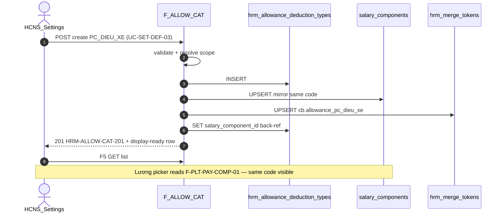

# PO-HRM-ALLOWANCE-CATALOG-SYNC-API-01 — API_DESIGN F.1 · Settings PC/KT ↔ PAY mirror

| Field | Value |
|-------|--------|
| **work_item_id** | `PO-HRM-ALLOWANCE-CATALOG-SYNC-API-01` |
| **parent** | `PO-HRM-ALLOWANCE-CATALOG-SYNC-01` |
| **lane** | governance · sa |
| **change_mode** | **ADD** Settings PC/KT CRUD · **EXPAND** F-PLT-PAY-COMP-02/03 dual-write guard · **NO CODE** `apps/**` · **no seed** |
| **date** | 2026-08-07 |
| **status** | **CONFIRMED** — unblocks `ALLOW-CAT-BE-01` |
| **ref_data** | [`PO-HRM-ALLOWANCE-CATALOG-SYNC-01`](./PO-HRM-ALLOWANCE-CATALOG-SYNC-01.md) · [`po-hrm-allowance-catalog-sync-data-01`](../../qa/evidence/po-hrm-allowance-catalog-sync-data-01.md) |
| **ref_pay_peer** | [`PO-HRM-DYNAMIC-CONFIG-PLATFORM-PAY-CATALOG-API-01`](./PO-HRM-DYNAMIC-CONFIG-PLATFORM-PAY-CATALOG-API-01.md) F-PLT-PAY-COMP-* |
| **ref_token** | [`PO-HRM-DYNAMIC-CONFIG-PLATFORM-DATA-01`](./PO-HRM-DYNAMIC-CONFIG-PLATFORM-DATA-01.md) §3 `hrm_merge_tokens` |
| **ref_ba** | [`po-hrm-amis-parity-settings-defaults-ba-01`](../../qa/evidence/po-hrm-amis-parity-settings-defaults-ba-01.md) **UC-SET-DEF-03** · **BR-AMIS-SET-DEF-03** · **AC-AMIS-SET-PC-CAT-01** |
| **ref_adr** | [`ADR-HRM-DYNAMIC-CONFIG-PLATFORM`](../../architecture/ADR-HRM-DYNAMIC-CONFIG-PLATFORM.md) Option B L1/L3/L6 |
| **honesty** | `payroll_e2e_ready=false` · no module UAT flip · U65 zero-seed |
| **must_keep** | Open catalog N+1 codes (**BR-PLT-05**) · soft-delete only (**BR-PLT-04**) · scope_parity U19 · PAY-native rows (`LUONG_CO_BAN`, …) not forced through PC · single TX sync |
| **ack_status** | **PASS_TO_PM** |

---

## 0. Objective & path strategy

Deepen **Settings PC/KT catalog** (phụ cấp / khấu trừ) as **authoritative write path** with **dual-write sync** to `salary_components` + `hrm_merge_tokens` register — per DATA CONFIRM [`PO-HRM-ALLOWANCE-CATALOG-SYNC-01`](./PO-HRM-ALLOWANCE-CATALOG-SYNC-01.md).

| Lock | Rule |
|------|------|
| **Prefix** | **ADD** `/api/hrm/settings/allowance-deduction-types*` — Settings vertical; **not** generic extension-items CRUD |
| **Scope resolver** | `resolveHrmSettingsCatalogCompanyId` (main→holding) **same** as `settings-catalogs` · list/get/mutate **scope_parity U19** with `F-PLT-PAY-COMP-01` peer |
| **Dual SoT write** | **F-ALLOW-CAT-02/03/04** = sole GĐ1 write path for allowance/deduction kinds |
| **PAY guard GĐ1** | **EXPAND** `F-PLT-PAY-COMP-02/03` — reject create/update when row is PC/KT class → **`HRM-ALLOW-CAT-409-DUAL-WRITE`** (no `syncFromPayroll` waiver GĐ1) |
| **Sync TX** | Create/update/retire PC → mirror SC → register token — **single transaction**; any step fail → full rollback (**VAL-ALLOW-09/10**) |
| **MergeToken origin** | **EXPAND** `hrm_merge_tokens.origin` CHECK to include `allowance_catalog` (DATA-01 §3.2 currently omits — BE prerequisite) |
| **Envelope** | `{ code, message, data }` · camelCase DTO wire |
| **Auth** | Same HRM JWT / membership as Settings catalogs |



---

## 1. Capability map

| Cap | F-id | METHOD / path | BA / AC |
|-----|------|---------------|---------|
| List / get PC/KT | **F-ALLOW-CAT-01** | `GET /api/hrm/settings/allowance-deduction-types` · `GET …/{id}` | **UC-SET-DEF-03** · **AC-AMIS-SET-PC-CAT-01** · **AC-PLT-PAY-01** read |
| Create + sync | **F-ALLOW-CAT-02** | `POST /api/hrm/settings/allowance-deduction-types` | **BR-AMIS-SET-DEF-03** · **AC-AMIS-SET-PC-CAT-01** |
| Update + sync | **F-ALLOW-CAT-03** | `PATCH /api/hrm/settings/allowance-deduction-types/{id}` | Same + **BR-PLT-04** |
| Retire + sync | **F-ALLOW-CAT-04** | `POST …/{id}/retire` | **BR-PLT-04** · **BR-AMIS-SET-DEF-07** |
| MergeToken preview | **F-ALLOW-CAT-05** | `GET …/{id}/merge-tokens` | **BR-PLT-01** · **AC-PLT-CTR-05** class |

**Settings overview integration:** `GET /api/hrm/settings-catalogs/overview` synthesizes row for master key `allowance_deduction_types` (aliases: `allowance_types`, `deduction_types`, `phu_cap_khau_tru`) — count + sample; empty honest **200** `[]`.

**CATALOG_FAMILIES ADD (BE):**

```text
{ familyId: 'allowance_deduction', storageKey: 'allowance_deduction_types',
  aliases: ['allowance_types', 'deduction_types', 'phu_cap_khau_tru'] }
```

---

## 2. Shared DTO — AllowanceDeductionTypeRow (response)

Display-ready row returned by F-ALLOW-CAT-01/02/03/04.

| DTO field | DB column (`hrm_allowance_deduction_types`) | Notes |
|-----------|---------------------------------------------|-------|
| `id` | `id` | uuid PK |
| `companyId` | `company_id` | Persist slug (holding partition when main JWT) |
| `code` | `code` | Open slug — shared with SC |
| `nameVi` | `name_vi` | Display label VI |
| `entryKind` | `entry_kind` | `allowance` \| `deduction` |
| `nature` | `nature` | `income` \| `deduction` \| `other` |
| `valueType` | `value_type` | `currency` \| `number` \| `percent` |
| `isTaxable` | `is_taxable` | TNCN flag |
| `isInsuranceBase` | `is_insurance_base` | BH base flag |
| `calcMode` | `calc_mode` | `fixed` \| `formula` \| `rate` |
| `defaultValue` | `default_value` | numeric(18,2) — not employee SoT |
| `minValue` / `maxValue` | `min_value` / `max_value` | optional caps |
| `defaultFormulaDefinitionId` | `default_formula_definition_id` | soft FK → `pay_formula_definitions` |
| `defaultFormula` | join | `{ id, code, version, status }` summary — no expression on list |
| `salaryComponentId` | `salary_component_id` | mirror link after sync |
| `componentCode` | `component_code` | denorm = `code` |
| `componentType` | *(mirror)* | from linked SC — default `phu_cap` / `khau_tru` |
| `componentTypeLabel` | *(computed)* | from effective `pay_types` catalog |
| `description` | `description` | optional |
| `sortOrder` | `sort_order` | |
| `status` | `status` | `draft` \| `active` \| `retired` |
| `isSystem` | `is_system` | starter row flag |
| `archivedAt` | `archived_at` | soft-delete |
| `createdAt` / `updatedAt` | timestamps | |
| `createdBy` / `updatedBy` | actor | optional |
| `sync` | *(computed)* | `{ salaryComponentSynced: boolean, mergeTokenKey?: string }` — admin debug GĐ1 |
| `policyOrphanWarn` | *(computed on retire)* | optional metadata when active policy lines reference code (**VAL-ALLOW-07**) |

---

## 3. API_DESIGN F.1 — F-ALLOW-CAT-*

### 3.1 F-ALLOW-CAT-01 — List / get allowance-deduction types

| | |
|--|--|
| **METHOD / path** | `GET /api/hrm/settings/allowance-deduction-types` · `GET /api/hrm/settings/allowance-deduction-types/{id}` |
| **Mục đích** | Trả danh mục phụ cấp/khấu trừ Settings — picker cho chính sách vị trí, C&B, và admin HCNS — kèm liên kết PAY mirror (`salaryComponentId`) display-ready (**UC-SET-DEF-03** · **AC-PLT-PAY-01** read). |
| **Nghiệp vụ xử lý** | (1) Auth + `resolveHrmSettingsCatalogCompanyId` from query/body `company_id` + JWT (main→holding). (2) List: default exclude `status=retired` / `archived_at IS NOT NULL` unless `include_retired=true`. (3) Filters: `entry_kind?`, `status?`, `q?` (ilike code/name_vi). (4) Sort: `sort_order`, `code`. (5) Empty → **200** `data=[]` — U65 honest, no fake starter. (6) Join LEFT `salary_components` on `salary_component_id` for `componentType` + `componentTypeLabel`. (7) Join optional `pay_formula_definitions` summary when FK set. (8) **Get-by-id:** load UUID with **same** scope predicate as list — OOS → **404** `HRM-ALLOW-CAT-404` / scope class (**VAL-ALLOW-06** · U19). (9) Alias filter `entry_kind=allowance` equivalent to read alias catalog `allowance_types`. |
| **Tham chiếu bước SRS / AC** | **UC-SET-DEF-03** happy «Settings → PC/KT → F5 catalog list» · **AC-AMIS-SET-PC-CAT-01** (read leg) · **AC-PLT-PAY-01** picker source · **BR-AMIS-SET-DEF-06** scope · Platform **BR-PLT-02** (effective catalog for downstream consumers) |
| **Request (query)** | `company_id` (required) · `entry_kind?` · `status?` · `q?` · `include_retired?` · `page?` · `page_size?` |
| **Response** | `200` `HRM-ALLOW-CAT-200` + `{ items: AllowanceDeductionTypeRow[], total? }` or single row on get |

| **Lỗi** | `HRM-AUTH-001` · scope 403/409 · get OOS **404** — empty list **≠** 404 |

---

### 3.2 F-ALLOW-CAT-02 — Create allowance-deduction type (+ sync TX)

| | |
|--|--|
| **METHOD / path** | `POST /api/hrm/settings/allowance-deduction-types` |
| **Mục đích** | HCNS tạo mã phụ cấp/khấu trừ mới trong Settings — ** một lần Lưu** ghi PC catalog, mirror `salary_components`, và đăng ký MergeToken cho HĐ/C&B (**BR-AMIS-SET-DEF-03** · **AC-AMIS-SET-PC-CAT-01**). |
| **Nghiệp vụ xử lý** | **BEGIN TX.** (1) `resolveHrmSettingsCatalogCompanyId` persist slug. (2) Require `code`, `nameVi`, `entryKind` — validate slug format → **`HRM-ALLOW-CAT-CODE-INVALID`** (**VAL-ALLOW-02**). (3) UQ active `(company_id, lower(code))` → **`HRM-ALLOW-CAT-409-CODE`** (**VAL-ALLOW-01**). (4) **Nature consistency:** `entryKind=allowance` requires `nature=income` (default income if omitted); `entryKind=deduction` requires `nature=deduction` — else **`HRM-ALLOW-CAT-NATURE-MISMATCH`** (**VAL-ALLOW-03**). (5) Map `componentType` default: allowance→`phu_cap`, deduction→`khau_tru`; body override allowed if ∈ effective `pay_types` → else **`HRM-PAY-TYPE-KEY`** (**VAL-ALLOW-05**). (6) `defaultFormulaDefinitionId` optional — soft assert company/rollup scope → **`HRM-PAY-FORMULA-404-DEF`** (**VAL-ALLOW-04**). (7) INSERT `hrm_allowance_deduction_types` (`status` default `active` unless `draft` sent). (8) **Mirror UPSERT** `salary_components` by `(company_id, code)` per DATA §4 field map; set `is_active` from status; **do not** copy `formula` TEXT as engine. (9) **Register MergeToken** when `status=active` and not archived: `token_key=cb.allowance_{lower(code)}` or `cb.deduction_{lower(code)}`; `source_path=cb.allowances.{code}` / `cb.deductions.{code}`; `ring=cb`; `domain=SET`; `origin=allowance_catalog`; `label_vi=nameVi` — UQ active token per company (**VAL-ALLOW-10**). (10) UPDATE PC row `salary_component_id` + `component_code=code`. (11) **COMMIT** or rollback all on any failure (**VAL-ALLOW-09**). (12) Return display-ready row §2. |
| **Tham chiếu bước SRS / AC** | **UC-SET-DEF-03** happy «Tạo mã mới → 2xx → F5» · **AC-AMIS-SET-PC-CAT-01** «Tạo `PC_DIEU_XE` → Lương picker same code» · **BR-AMIS-SET-DEF-03** dual bind · **BR-PLT-01** token register · **BR-PLT-05** open code N+1 |
| **Request → DB** | Body → INSERT PC + UPSERT SC + UPSERT token |

| DTO (body) | DB | Required |
|------------|-----|----------|
| `companyId` | `company_id` | yes (or token-derived) |
| `code` | `code` | yes |
| `nameVi` | `name_vi` | yes |
| `entryKind` | `entry_kind` | yes |
| `nature` | `nature` | default from entryKind |
| `valueType` | `value_type` | default `currency` |
| `isTaxable` / `isInsuranceBase` | flags | optional |
| `calcMode` | `calc_mode` | default `fixed` |
| `defaultValue` | `default_value` | default 0 |
| `minValue` / `maxValue` | min/max | optional |
| `defaultFormulaDefinitionId` | `default_formula_definition_id` | optional |
| `componentType` | *(mirror→SC.component_type)* | optional override |
| `description` | `description` | optional |
| `sortOrder` | `sort_order` | optional |
| `status` | `status` | default `active` |

| **Response** | `201` `HRM-ALLOW-CAT-201` + AllowanceDeductionTypeRow |
| **Lỗi** | See §6 taxonomy |

---

### 3.3 F-ALLOW-CAT-03 — Update allowance-deduction type (+ sync TX)

| | |
|--|--|
| **METHOD / path** | `PATCH /api/hrm/settings/allowance-deduction-types/{id}` |
| **Mục đích** | Sửa metadata PC/KT (nhãn, thuế, BH, định mức, công thức mặc định) — đồng bộ mirror PAY và refresh MergeToken label — không phá lịch sử phiếu đã phát hành. |
| **Nghiệp vụ xử lý** | **BEGIN TX.** (1) Peek `company_id` → `assertResourceInHrmScope` / settings catalog scope (**U19**). (2) Reject if row archived unless reactivate path. (3) Partial patch allowed fields (same as create). (4) Code change → re-assert UQ + **re-register token_key** (retire old token key soft, upsert new if code changes — rare admin). (5) `entryKind`/`nature` change → re-validate consistency (**VAL-ALLOW-03**). (6) SYNC mapped columns to linked `salary_components` (create mirror if missing — recovery path). (7) Refresh token `label_vi` when `nameVi` changes. (8) Reactivate: `status=active`, clear `archived_at` → mirror `is_active=true`, token active. (9) **COMMIT** or full rollback. (10) Reject empty body → **`HRM-VAL-001`**. |
| **Tham chiếu bước SRS / AC** | **UC-SET-DEF-03** alternate «sửa flags» · **BR-PLT-04** · **BR-AMIS-SET-DEF-03** |
| **Response** | `200` `HRM-ALLOW-CAT-200` + row |

---

### 3.4 F-ALLOW-CAT-04 — Retire allowance-deduction type (+ sync TX)

| | |
|--|--|
| **METHOD / path** | `POST /api/hrm/settings/allowance-deduction-types/{id}/retire` |
| **Mục đích** | Ngừng theo dõi mã PC/KT — ẩn picker Settings/Lương/chính sách — **không** xóa cứng FK lịch sử (**BR-PLT-04** · **BR-AMIS-SET-DEF-07**). |
| **Nghiệp vụ xử lý** | **BEGIN TX.** (1) Scope assert. (2) Set PC `status=retired`, `archived_at=now()`. (3) Mirror SC: `is_active=false`, `archived_at=now()` when column exists. (4) Token: `status=retired`, `archived_at=now()` — issued contract snapshots **must_keep** resolved values (**BR-PLT-03**). (5) If active position policy lines reference `component_code` → **200** with `policyOrphanWarn: { activePolicyLineCount }` — **allow** retire (**VAL-ALLOW-07**). (6) **FORBIDDEN** hard DELETE on linked SC (**VAL-ALLOW-11**). (7) Re-activate via PATCH F-ALLOW-CAT-03. |
| **Tham chiếu bước SRS / AC** | **UC-SET-DEF-03** alternate «Ngừng theo dõi» · **BR-PLT-04** · **AC-PLT-SET-02** reuse class |
| **Request body** | optional `{ reason?: string }` |
| **Response** | `200` `HRM-ALLOW-CAT-200` + `{ id, status: 'retired', policyOrphanWarn? }` |

---

### 3.5 F-ALLOW-CAT-05 — Preview registered merge tokens

| | |
|--|--|
| **METHOD / path** | `GET /api/hrm/settings/allowance-deduction-types/{id}/merge-tokens` |
| **Mục đích** | Admin HCNS xem token Merge đã đăng ký cho mã PC/KT — phục vụ kiểm tra HĐ/C&B trước phát hành (**BR-PLT-01**). |
| **Nghiệp vụ xử lý** | (1) Scope assert on PC row. (2) Query `hrm_merge_tokens` where `company_id` match and `token_key` = derived key from PC `entry_kind`+`code` (active + retired for audit when `include_retired=true`). (3) Return display-ready token rows per DATA-01 §7.1 DTO (`tokenKey`, `labelVi`, `sourcePath`, `ring`, `domain`, `status`, `origin`). (4) Empty registry → **200** `[]` (honest if save failed partial — should not happen post-TX). |
| **Tham chiếu bước SRS / AC** | **BR-PLT-01** · **AC-PLT-CTR-05** class · **VAL-PLT-TOK-01** coexistence note |
| **Response** | `200` + `{ items: MergeTokenRow[] }` |

---

## 4. EXPAND — F-PLT-PAY-COMP dual-write guard (GĐ1 lock)

> Peer: [`PO-HRM-DYNAMIC-CONFIG-PLATFORM-PAY-CATALOG-API-01`](./PO-HRM-DYNAMIC-CONFIG-PLATFORM-PAY-CATALOG-API-01.md) §3.2/3.3 — **do not duplicate** full F-PLT-PAY-COMP F.1; **ADD** guard only.

| F-id | EXPAND |
|------|--------|
| **F-PLT-PAY-COMP-02** POST | Before INSERT: if `componentType` ∈ **`PAY_PC_KT_COMPONENT_TYPES`** (`phu_cap`, `khau_tru` defaults + tenant allowance/deduction-class pay_types) **OR** body declares `nature` in `{income,deduction}` with intent allowance/deduction catalog → **409** **`HRM-ALLOW-CAT-409-DUAL-WRITE`** with VI message «Tạo phụ cấp/khấu trừ qua Cài đặt → Danh mục PC/KT». **Exception GĐ1:** none — **reject path locked** (PM default). PAY-native codes (`LUONG_CO_BAN`, `THUE_TNCN`, attendance vars) **not** in guard set. |
| **F-PLT-PAY-COMP-03** PATCH | Same guard when patch would **introduce** PC/KT class on row not previously PAY-native system row. Rows already linked via `hrm_allowance_deduction_types.salary_component_id` → **409** «Sửa qua Settings PC/KT». |
| **F-PLT-PAY-COMP-04** retire | Allow retire on mirror SC when invoked from PAY UI for linked row → **409** **`HRM-ALLOW-CAT-409-LINKED`** — use F-ALLOW-CAT-04 (**VAL-ALLOW-11**). |
| **F-PLT-PAY-COMP-01** read | **KEEP** — PAY picker still lists mirrored rows for **AC-PLT-PAY-01** / **AC-AMIS-SET-PC-CAT-01** read leg. |

**Detection helper (BE):** `isAllowanceDeductionComponentType(componentType, payTypesCatalog)` + `findAllowanceCatalogLink(salaryComponentId|code)`.

---

## 5. Mirror map (API layer reminder)

| PC field | SC column | API note |
|----------|-----------|----------|
| `code` | `code` | invariant |
| `nameVi` | `name` | |
| mapped `componentType` | `component_type` | pay_types REF |
| `nature` | `nature` | |
| tax/SI/value/caps/formula FK | same | per DATA §4 |
| `status=active` | `is_active=true` | |
| `archivedAt` | `archived_at` | |

**MergeToken on save (active row):**

| entryKind | token_key | source_path |
|-----------|-----------|-------------|
| `allowance` | `cb.allowance_{lower(code)}` | `cb.allowances.{code}` |
| `deduction` | `cb.deduction_{lower(code)}` | `cb.deductions.{code}` |

---

## 6. Error taxonomy

| Code | HTTP | When |
|------|------|------|
| `HRM-ALLOW-CAT-201` | 201 | Create OK |
| `HRM-ALLOW-CAT-200` | 200 | Read/update/retire OK |
| `HRM-ALLOW-CAT-404` | 404 | PC row not found / scope |
| `HRM-ALLOW-CAT-409-CODE` | 409 | Duplicate active code (**VAL-ALLOW-01**) |
| `HRM-ALLOW-CAT-409-DUAL-WRITE` | 409 | PAY POST/PATCH blocked — use Settings path |
| `HRM-ALLOW-CAT-409-LINKED` | 409 | Hard delete / PAY retire on linked SC (**VAL-ALLOW-11**) |
| `HRM-ALLOW-CAT-CODE-INVALID` | 400 | Slug format only — **not** closed enum (**VAL-ALLOW-02**) |
| `HRM-ALLOW-CAT-NATURE-MISMATCH` | 400 | entryKind vs nature (**VAL-ALLOW-03**) |
| `HRM-ALLOW-CAT-ORPHAN-CODE` | 400 | Consumer free-text when catalog effective (**VAL-ALLOW-08**) — assert on **downstream** APIs (policy/C&B), document here for traceability |
| `HRM-PAY-TYPE-KEY` | 400 | componentType ∉ pay_types (**VAL-ALLOW-05**) |
| `HRM-PAY-FORMULA-404-DEF` | 404 | formula FK OOS (**VAL-ALLOW-04**) |
| `HRM-VAL-001` | 400 | Empty PATCH |
| `HRM-AUTH-001` | 401 | Unauthorized |
| `HRM-SCOPE-409` / 403 | 409/403 | Scope parity (**VAL-ALLOW-06**, **VAL-ALLOW-12**) |
| `HRM-ALLOW-CAT-500-SYNC` | 500 | TX rollback — partial sync (**VAL-ALLOW-09/10**) |

---

## 7. Validation matrix (API)

| ID | Condition | Expected |
|----|-----------|----------|
| **VAL-ALLOW-01** | Duplicate active code | 409 `HRM-ALLOW-CAT-409-CODE` |
| **VAL-ALLOW-02** | Invalid slug | 400 `HRM-ALLOW-CAT-CODE-INVALID` |
| **VAL-ALLOW-03** | entryKind/nature mismatch | 400 `HRM-ALLOW-CAT-NATURE-MISMATCH` |
| **VAL-ALLOW-04** | Bad formula FK | 404 `HRM-PAY-FORMULA-404-DEF` |
| **VAL-ALLOW-05** | Bad componentType | 400 `HRM-PAY-TYPE-KEY` |
| **VAL-ALLOW-06** | List vs get scope | scope_parity jest |
| **VAL-ALLOW-07** | Retire with policy lines | 200 + warn metadata |
| **VAL-ALLOW-08** | Orphan consumer code | 400 on policy/C&B write (downstream) |
| **VAL-ALLOW-09** | Sync partial fail | Full TX rollback |
| **VAL-ALLOW-10** | Token register fail | Full TX rollback |
| **VAL-ALLOW-11** | DELETE linked SC | 409 dual-write / linked |
| **VAL-ALLOW-12** | Member CEO scope | Own slug only |
| **VAL-ALLOW-13** | POST PAY `phu_cap` new code | 409 `HRM-ALLOW-CAT-409-DUAL-WRITE` |
| **VAL-ALLOW-14** | POST F-ALLOW-CAT then GET PAY list | Same `code` visible (**AC-AMIS-SET-PC-CAT-01**) |
| **VAL-ALLOW-15** | POST F-ALLOW-CAT active | Token in F-ALLOW-CAT-05 / merge picker |

---

## 8. Traceability

| Requirement | API | QA evidence (later) |
|-------------|-----|---------------------|
| **BR-AMIS-SET-DEF-03** | F-ALLOW-CAT-02/03 sync | **AC-AMIS-SET-PC-CAT-01** |
| **UC-SET-DEF-03** | F-ALLOW-CAT-* | **J-HRM-SET-DEF-01** |
| **AC-PLT-PAY-01** | mirror + F-PLT-PAY-COMP-01 read | picker parity |
| **BR-PLT-01** | save side-effect token | merge list F5 |
| **BR-PLT-02** | VAL-ALLOW-08 downstream | policy DATA next |
| **BR-PLT-04** | F-ALLOW-CAT-04 | soft retire |
| **BR-PLT-05** | open code create | VAL-ALLOW-02 format only |
| **scope_parity U19** | F-ALLOW-CAT-01 | holding/member matrix |

---

## 9. Dev unlock · BE prerequisites

| Prerequisite | Owner |
|--------------|-------|
| DDL `hrm_allowance_deduction_types` | dev-be ensureSchema |
| EXPAND `hrm_merge_tokens.origin` CHECK + `allowance_catalog` | dev-be |
| `AllowanceCatalogSyncService` single-TX | dev-be |
| EXPAND `PayrollCatalogService` dual-write guard | dev-be |
| CATALOG_FAMILIES + overview row | dev-be |
| jest: scope_parity · sync TX · PAY guard · open N+1 | dev-be |

| Gate | After this seat |
|------|-----------------|
| SA F.1 F-ALLOW-CAT-* | **YES — this file** |
| **dev-be** `ALLOW-CAT-BE-01` | **UNLOCKED** |
| dev-fe Settings PC/KT UI | After BE + QA smoke |
| `payroll_e2e_ready` | Remains **false** |

---

## 10. Non-claims

- No `apps/**` · migrations · Nest export.
- No Settings UI LIVE.
- No position policy table (next WI).
- No orphan SC backfill (ops waiver R5).
- No claim AMIS parity DONE.

---

## ack_status

**PASS_TO_PM**
