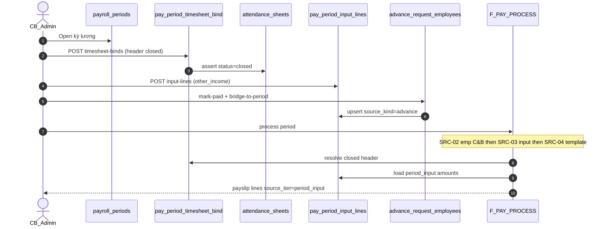

# PO-HRM-AMIS-PARITY-PAY-INPUT-PACK-API-01 — API_DESIGN F.1 · AMIS Step4 input packs

| Field | Value |
|-------|--------|
| **work_item_id** | `PO-HRM-AMIS-PARITY-PAY-INPUT-PACK-API-01` |
| **Parent** | `PO-HRM-AMIS-PARITY-RESEARCH-01` |
| **prior** | `PO-HRM-AMIS-PARITY-PAY-INPUT-PACK-DATA-01` **CONFIRMED** · TPL-API-01 · formula API-01 **CONFIRMED** (cấm reopen) |
| **lane** | governance · sa |
| **change_mode** | **ADD** F-PAY-PERIOD-BIND/INPUT/ADV-BRIDGE · **EXPAND** F-PAY-PERIOD-01 · F-PAY-PROCESS-01 · **DOC-DELTA** client API · **NO CODE** `apps/**` |
| **Date** | 2026-08-07 |
| **Status** | **CONFIRMED** — unlock **dev-be** ensureSchema + CRUD + bridge + SRC-03 wire |
| **ref_data** | `PO-HRM-AMIS-PARITY-PAY-INPUT-PACK-DATA-01.md` · evidence `po-hrm-amis-parity-pay-input-pack-data-01.md` |
| **ref_depth** | `po-hrm-amis-parity-pay-depth-01.md` §3 **BR-AMIS-PAY-SRC-03** · AC-PAY-SRC-03 |
| **ref_att** | `PO-HRM-PAYROLL-FORMULA-RUN-GAP-DATA-ATT-LINE-01` — **retain** · **alias ≠ bind** |
| **ref_platform** | `ADR-HRM-DYNAMIC-CONFIG-PLATFORM` Option B — open catalog `component_code` · soft-delete |
| **Honesty** | `payroll_e2e_ready=false` · **cấm** invent LIVE · tables **PAPER** until BE |
| **must_keep** | ATT-LINE-01 hours bag · formula F.1 · TPL F.1 · scope_parity U19 · U65 · no FE net SoT |
| **ack_status** | **PASS_TO_PM** |

---

## 0. Objective & locks

Unlock **API_DESIGN F.1** for AMIS Step4 **input packs** after ba-data CONFIRMED:

| Pack | Table | F-id |
|------|-------|------|
| Chuyển công / closed header ref | `pay_period_timesheet_bind` | **F-PAY-PERIOD-BIND-01** |
| Thu nhập khác / tạm ứng / RD materialize | `pay_period_input_lines` | **F-PAY-PERIOD-INPUT-01** |
| Advance workflow → input line | bridge on `advance_request_employees` | **F-PAY-ADV-BRIDGE-01** |
| PROCESS SRC tier 2 | resolver inside **F-PAY-PROCESS-01** | **BR-AMIS-PAY-SRC-03** EXPAND |

| Lock | Rule |
|------|------|
| **Alias ≠ line bag** | `pay_period_timesheet_bind.timesheet_header_id` → `attendance_sheets.id` — **FORBIDDEN** alias to `att_timesheet_line` |
| **Hours vars** | **F-PAY-ATT-CLOSED-01** reads `att_timesheet_line` per ATT-LINE-01 — **orthogonal** to bind CRUD |
| **SRC order** | Emp C&B (2) → **period input (3)** → template OV-C (4) → catalog default (5) — cite depth-01 §3 |
| **Advance AS-IS** | **KEEP** `advance_requests` / `advance_request_employees` batch workflow — bridge **writes** input lines; PROCESS **reads** input lines only |
| **Open catalog** | `component_code` · `source_kind` open string — **FORBIDDEN** `CHECK (code IN (...))` |
| **Soft-delete** | Unbind / remove input = `archived_at` — no hard DELETE |
| **Scope** | list ↔ get-by-id ↔ mutate = **same** `resolveHrmListScope` / period company expand (U19) |
| **Immutability** | Period `processing`/`closed` → input/bind mutate → **`HRM-PAY-PERIOD-409-IMMUTABLE`** |
| **Formula / TPL** | **cấm** reopen F-PAY-FORMULA-* · F-PAY-SHEET-TPL-* F.1 |

**Envelope:** `{ code, message, data }`  
**Auth:** HRM JWT / membership — same payroll peers as periods / advance-requests.

---

## 1. Capability map

| Cap | F-id | METHOD / path (Nest physical) | AC / BR |
|-----|------|-------------------------------|---------|
| List / bind chuyển công | **F-PAY-PERIOD-BIND-01** | `GET/POST …/periods/:periodId/timesheet-binds` · `GET …/timesheet-binds/:bindId` · `POST …/:bindId/archive` | **AC-AMIS-ATT-XFER-01** · VAL-INP-BIND-* |
| CRUD thu nhập khác / pack kỳ | **F-PAY-PERIOD-INPUT-01** | `GET/POST/PATCH …/periods/:periodId/input-lines` · `POST …/input-lines/:lineId/archive` | **AC-PAY-SRC-03** · VAL-INP-LINE-* |
| Advance → input bridge | **F-PAY-ADV-BRIDGE-01** | **EXPAND** `POST …/advance-requests/:requestId/mark-paid` · `POST …/:requestId/bridge-to-period` · hook on reject | **AC-PAY-SRC-03** advance · BR-PAY-ADV-BRIDGE-* |
| Period create optional bind | **F-PAY-PERIOD-01** EXPAND | `POST …/periods` body `timesheetBinds[]?` | cite existing PERIOD-01 |
| Process SRC-03 | **F-PAY-PROCESS-01** EXPAND | `POST …/periods/:id/process` | **BR-AMIS-PAY-SRC-03** · VAL-INP-SRC-03 |
| Hours (retain) | **F-PAY-ATT-CLOSED-01** | orchestrator precheck | ATT-LINE-01 — **no change** this seat |



---

## 2. Alias lock — bind header ≠ att_timesheet_line

| Concern | Physical | HTTP | Role | ≠ |
|---------|----------|------|------|---|
| **Chuyển công / period sheet ref** | `pay_period_timesheet_bind.timesheet_header_id` | `/periods/:id/timesheet-binds` | Period declares **which closed sheet** is payroll input | **Not** `att_timesheet_line` |
| **Hour/OT/leave columns** | `att_timesheet_line` (ATT-LINE-01) | ATT sheet APIs + F-PAY-ATT-CLOSED-01 internal | Per-employee hour vars for formula | **Not** bind table |
| **Period variable amounts** | `pay_period_input_lines` | `/periods/:id/input-lines` | SRC tier 2 amounts (thu nhập khác, tạm ứng) | **Not** hour vars |

**FORBIDDEN:** POST `att_timesheet_line.id` as bind FK; store hours on bind row; PROCESS join live `advance_requests` mid-evaluate (use bridged input lines).

---

## 3. BR-AMIS-PAY-SRC-03 — PROCESS resolver EXPAND

**must_keep order** (cite depth-01 §3 · TPL-API-01 §4):

```text
For each component in period snapshot (or enroll set):
  1. SRC-02: Emp C&B fixed amount → source_tier=emp_cb
  2. SRC-03: Active pay_period_input_lines row for (period, employee, component_code)
             → amount wins over template + catalog; source_tier=period_input; source_ref=period_input:{id}
  3. SRC-04: Template OV-C published formula override
  4. SRC-05: Catalog default published formula — else FORMULA-412 (no silent 0)
Hour/OT vars: SRC-01 + ATT-LINE-01 only — SRC-03 does NOT apply to payable_hours keys
```

| Rule | API / PROCESS behavior |
|------|------------------------|
| **BR-AMIS-PAY-SRC-03** | Active input line for period-variable component → use `amount` (± `quantity` per component policy) **before** template/catalog |
| **VAL-INP-SRC-03** | Payslip line `source_tier=period_input` · `source_ref=period_input:{uuid}` |
| **VAL-INP-SRC-03b** | Pack row exists but ignored → **FAIL** QA (not silent 0) |
| **Multiple source_kind** | Resolver picks **one** row per component: prefer explicit `manual`/`other_income` over `advance` when both exist — tie-break `updated_at DESC` (document in BE; GĐ1 single row per UQ) |
| **RD overlap** | Input line **wins** over live `hrm_reward_discipline` read when both present (DATA §5) |
| **FE** | **FORBIDDEN** POST computed amounts as pack SoT without input line row (VAL-INP-FE-01) |

**EXPAND F-PAY-PROCESS-01 step (6) detail:**

1. After F-PAY-ATT-CLOSED-01 resolves bind → load `att_timesheet_line` vars (ATT-LINE-01).
2. Per employee × snapshot column: run SRC-02 → **probe/load `pay_period_input_lines`** → SRC-04 → SRC-05.
3. When SRC-03 hits: skip formula evaluate for **fixed amount** components; still evaluate when component policy = formula-with-pack-override (amount as var) — GĐ1 default = **amount replaces evaluate** for `nature=fixed|allowance` period-variable codes.
4. Write `payroll_payslip_lines` with audit fields when column exists.

---

## 4. API_DESIGN F.1 — F-PAY-PERIOD-BIND-01

### 4.1 LIST / GET — timesheet binds

| | |
|--|--|
| **METHOD / path** | `GET /api/hrm/payroll/periods/:periodId/timesheet-binds` · `GET …/timesheet-binds/:bindId` |
| **Mục đích** | Liệt kê / xem **chuyển công** — bảng công **header** đã gắn kỳ lương (AMIS Step4 pack A) — không trả hour lines. |
| **Nghiệp vụ xử lý** | (1) Load period by `:periodId` with **same** scope predicate as `GET /periods/:id` (U19). (2) Default `archived_at IS NULL`. (3) Filters: `include_archived?`, `transfer_kind?`. (4) Join display-ready: `timesheetHeaderId`, `timesheetCode`, `timesheetName`, `timesheetStatus`, `sheetDateFrom`, `sheetDateTo` from `attendance_sheets` — **cấm** raw UUID-only. (5) Assert period company matches bind `company_id`. (6) Get-by-id: **404** out of scope (not 200 leak). (7) Empty `[]` = **200**. |
| **Tham chiếu bước SRS** | **FR-UC-BP-PAY-01** Diễn biến **#2–#3** (chốt công → chuyển tính lương) · **FR-UC-BP-PAY-06** tiên quyết bảng công · **AC-AMIS-ATT-XFER-01** · AMIS Step4 · DATA §2 |
| **Request (query)** | `company_id?` (required if not in token scope) · `include_archived?` · `transfer_kind?` |
| **Response → DB** | |

| DTO field | DB column / join |
|-----------|------------------|
| `id` | `pay_period_timesheet_bind.id` |
| `companyId` | `company_id` |
| `payrollPeriodId` | `payroll_period_id` |
| `timesheetHeaderId` | `timesheet_header_id` → `attendance_sheets.id` |
| `timesheetDisplayLabel` | join `attendance_sheets.code` / `name` |
| `timesheetStatus` | join `attendance_sheets.status` |
| `transferKind` | `transfer_kind` |
| `boundAt` | `bound_at` |
| `boundBy` | `bound_by` |
| `note` | `note` |
| `archivedAt` | `archived_at` |

| **Lỗi** | Period 404 scope · `HRM-SCOPE-409` |
| **scope_parity** | List predicate ≡ get-by-id (**must_keep**) |

---

### 4.2 CREATE — bind closed sheet to period

| | |
|--|--|
| **METHOD / path** | `POST /api/hrm/payroll/periods/:periodId/timesheet-binds` |
| **Mục đích** | Ghi **chuyển công** — gắn bảng công **đã chốt** vào kỳ lương (AMIS «chuyển tính lương»). |
| **Nghiệp vụ xử lý** | (1) Period must be `draft`/`open` — else **`HRM-PAY-PERIOD-409-IMMUTABLE`**. (2) Load `attendance_sheets` by `timesheetHeaderId`; assert `status='closed'` — else **`HRM-PAY-ATT-412`**. (3) Assert sheet date range **overlaps** period window (BR-BIND-02). (4) Assert sheet company compatible with period company (rollup rules). (5) **FORBIDDEN** bind punch/leave/OT ids (BR-BIND-03). (6) INSERT bind; UQ active pair → **`HRM-PAY-INP-409-DUP`**. (7) Set `bound_at=now()`, `bound_by=actor`. (8) **Does not** copy hours — hours remain on `att_timesheet_line`. |
| **Tham chiếu bước SRS** | **FR-UC-BP-PAY-01** #2–#3 · **FR-UC-BP-PAY-06** bước chuyển công · **AC-AMIS-ATT-XFER-01** · VAL-INP-BIND-01..03 |
| **Request → DB** | |

| DTO | DB column | Required |
|-----|-----------|----------|
| `timesheetHeaderId` | `timesheet_header_id` | YES |
| `transferKind` | `transfer_kind` | optional default `closed_transfer` |
| `note` | `note` | optional |
| *(server)* | `company_id`, `payroll_period_id`, `bound_at`, `bound_by` | server |

| **Response** | Bind DTO (§4.1) + `warnings[]` if sheet multi-OU later |
| **Lỗi** | ATT-412 · IMMUTABLE · DUP · scope 409 |

---

### 4.3 ARCHIVE — soft unbind

| | |
|--|--|
| **METHOD / path** | `POST /api/hrm/payroll/periods/:periodId/timesheet-binds/:bindId/archive` |
| **Mục đích** | Hủy gắn bảng công khỏi kỳ trước khi process — giữ audit. |
| **Nghiệp vụ xử lý** | (1) Period not `processing`/`closed`. (2) Set `archived_at=now()`. (3) Idempotent if already archived → 200. (4) **FORBIDDEN** hard DELETE. |
| **Tham chiếu bước SRS** | **FR-UC-BP-PAY-06** alternate — đổi bảng công trước tính · DATA §6.1 |
| **Lỗi** | IMMUTABLE · 404 scope |

---

### 4.4 EXPAND F-PAY-PERIOD-01 — optional bind on period create

| | |
|--|--|
| **EXPAND** | `POST /api/hrm/payroll/periods` body optional `timesheetBinds: [{ timesheetHeaderId, transferKind?, note? }]` |
| **Nghiệp vụ** | After period INSERT, call same rules as §4.2 for each bind — transactional; first bind fail rolls back entire create (GĐ1). |
| **Tham chiếu** | FR-UC-BP-PAY-01 #1+#3 combined UX |
| **Response EXPAND** | Include `boundTimesheetHeaderIds[]` (existing field) populated from bind table |

---

## 5. API_DESIGN F.1 — F-PAY-PERIOD-INPUT-01

### 5.1 LIST / GET — period input lines

| | |
|--|--|
| **METHOD / path** | `GET /api/hrm/payroll/periods/:periodId/input-lines` · `GET …/input-lines/:lineId` |
| **Mục đích** | Liệt kê **dữ liệu tính lương kỳ** — thu nhập khác, tạm ứng, điều chỉnh tay (AMIS Step4 pack B/C) per NV+component. |
| **Nghiệp vụ xử lý** | (1) Period scope parity. (2) Filters: `employee_id?`, `component_code?`, `source_kind?`, `include_archived?`. (3) Pagination: `cursor?` / `limit?`. (4) Display-ready: `employeeDisplayName`, `componentDisplayLabel` from joins — **cấm** raw codes only. (5) Money fields plain number on wire; FE vi-VN grouping on display. (6) Get-by-id 404 out of scope. |
| **Tham chiếu bước SRS** | **FR-UC-BP-PAY-06** Diễn biến **#5** (dữ liệu kỳ · thu nhập khác) · **AC-PAY-SRC-03** · AMIS Step4 · DATA §3 |
| **Response → DB** | |

| DTO field | DB column |
|-----------|-----------|
| `id` | `id` |
| `companyId` | `company_id` |
| `periodId` | `period_id` |
| `employeeId` | `employee_id` |
| `employeeDisplayName` | join `employees` |
| `componentCode` | `component_code` |
| `componentDisplayLabel` | join `salary_components.name` |
| `amount` | `amount` |
| `quantity` | `quantity` |
| `sourceKind` | `source_kind` |
| `sourceRef` | `source_ref` |
| `effectiveDate` | `effective_date` |
| `note` | `note` |
| `archivedAt` | `archived_at` |
| `createdAt` / `updatedAt` | timestamps |

| **Lỗi** | Scope · empty = 200 |

---

### 5.2 CREATE / PATCH — upsert input line

| | |
|--|--|
| **METHOD / path** | `POST /api/hrm/payroll/periods/:periodId/input-lines` · `PATCH …/input-lines/:lineId` |
| **Mục đích** | Nhập / sửa **thu nhập khác** hoặc điều chỉnh kỳ có lý do — amount SoT for SRC-03. |
| **Nghiệp vụ xử lý** | (1) Period mutable (`draft`/`open`). (2) Validate `employee_id` in company scope. (3) Assert `component_code` exists in `salary_components` (open catalog) — else **`HRM-PAY-INP-404-COMPONENT`**. (4) `source_kind` open string — recommended: `other_income` \| `manual` \| `rd_transfer` \| `advance` (advance usually via bridge §6). (5) `amount` finite numeric; reject FE-formatted strings. (6) UQ active tuple → **`HRM-PAY-INP-409-DUP`** on POST; PATCH may change amount/note. (7) **FORBIDDEN** mutate when period immutable. (8) Optional `effective_date` intra-period. |
| **Tham chiếu bước SRS** | **FR-UC-BP-PAY-06** #5 · **AC-PAY-SRC-03** · **AC-AMIS-PAY-PACK-01** · VAL-INP-LINE-01..04 · VAL-INP-FE-01 |
| **Request → DB** | |

| DTO | DB | Required (POST) |
|-----|-----|-----------------|
| `employeeId` | `employee_id` | YES |
| `componentCode` | `component_code` | YES |
| `amount` | `amount` | YES |
| `quantity` | `quantity` | optional |
| `sourceKind` | `source_kind` | YES (default `manual`) |
| `sourceRef` | `source_ref` | optional |
| `effectiveDate` | `effective_date` | optional |
| `note` | `note` | optional |

| **Lỗi** | 400 missing · 404 component · 409 dup/immutable · scope |

---

### 5.3 ARCHIVE — soft delete input line

| | |
|--|--|
| **METHOD / path** | `POST /api/hrm/payroll/periods/:periodId/input-lines/:lineId/archive` |
| **Mục đích** | Xóa mềm dòng pack — fall through SRC-04/05 on next process. |
| **Nghiệp vụ xử lý** | Period mutable; set `archived_at`; advance cancel uses same path (§6). |
| **Tham chiếu bước SRS** | FR-UC-BP-PAY-06 alternate · DATA §6.2 |

---

## 6. API_DESIGN F.1 — F-PAY-ADV-BRIDGE-01

### 6.1 AS-IS (KEEP)

| Endpoint | Status |
|----------|--------|
| `GET/POST /api/hrm/payroll/advance-requests` | **LIVE** batch header |
| `GET …/advance-requests/:id/employees` | **LIVE** lines |
| `POST …/approve` · `…/reject` | **LIVE** workflow |
| `POST …/mark-paid` | **LIVE** — **EXPAND** bridge (below) |

**Gap:** `mark-paid` does **not** yet upsert `pay_period_input_lines` — BE-01 implements per this F.1.

---

### 6.2 EXPAND mark-paid — bridge to period input

| | |
|--|--|
| **METHOD / path** | `POST /api/hrm/payroll/advance-requests/:requestId/mark-paid` **EXPAND** |
| **Mục đích** | Khi tạm ứng **đã chi**, materialize khấu trừ kỳ vào pack SRC-03 — không để PROCESS join batch table. |
| **Nghiệp vụ xử lý** | (1) Existing mark-paid status transition **KEEP**. (2) **ADD** body fields: `payrollPeriodId` (uuid, **required for bridge**), `componentCode?` (default tenant advance code e.g. `tam_ung`). (3) Map `salary_period` TEXT → **`payrollPeriodId`** — **cấm** TEXT as SoT (DATA §4.1). (4) For each `advance_request_employees` row: upsert `pay_period_input_lines` with `source_kind=advance`, `amount=advance_amount`, `source_ref=advance_request_employee:{id}`, `employee_id` resolved from code if needed. (5) **BR-PAY-ADV-BRIDGE-02** idempotent re-mark. (6) Period must be mutable. (7) Response **ADD** `bridgedInputLineIds[]`. |
| **Tham chiếu bước SRS** | **FR-UC-BP-PAY-06** tạm ứng kỳ · **AC-PAY-SRC-03** advance path · DATA §4 **BR-PAY-ADV-BRIDGE-01..04** · VAL-INP-ADV-01 |
| **Request EXPAND** | |

| DTO | Required |
|-----|----------|
| `payrollPeriodId` | YES (bridge) |
| `componentCode` | optional (catalog advance code) |
| *(existing decide fields)* | per AS-IS |

| **Lỗi** | Period 404 · IMMUTABLE · employee not in scope · **`HRM-PAY-ADV-409-BRIDGE`** partial fail with `failedEmployees[]` |

---

### 6.3 SYNC — manual re-bridge (optional GĐ1)

| | |
|--|--|
| **METHOD / path** | `POST /api/hrm/payroll/advance-requests/:requestId/bridge-to-period` |
| **Mục đích** | Idempotent re-sync advance lines → input pack (repair / admin). |
| **Nghiệp vụ xử lý** | Same upsert as §6.2 without status change; request must be `paid` or policy `approved_for_payroll`. |
| **Tham chiếu bước SRS** | AC-PAY-SRC-03 · VAL-INP-ADV-01 |

---

### 6.4 REVOKE on reject/cancel — archive bridged lines

| | |
|--|--|
| **EXPAND** | `POST …/advance-requests/:requestId/reject` (and cancel if added) |
| **Nghiệp vụ** | **BR-PAY-ADV-BRIDGE-03:** archive input lines where `source_ref` prefix `advance_request_employee:` matches request employees — soft only. |
| **Tham chiếu** | DATA §4.2 |

---

## 7. Error taxonomy (ADD)

| Code | When |
|------|------|
| `HRM-PAY-ATT-412` | Bind or process: sheet not `closed` / missing bind when required |
| `HRM-PAY-PERIOD-409-IMMUTABLE` | Mutate bind/input after period `processing`/`closed` |
| `HRM-PAY-INP-409-DUP` | Duplicate active bind or input UQ tuple |
| `HRM-PAY-INP-404-COMPONENT` | Unknown `component_code` in company catalog |
| `HRM-PAY-INP-404` | Bind/line not found in scope |
| `HRM-PAY-ADV-409-BRIDGE` | Bridge upsert failed (partial) |
| `HRM-PAY-ADV-409-PERIOD` | Invalid / out-of-scope `payrollPeriodId` |
| `HRM-SCOPE-409` / 403/404 | Scope parity U19 |
| `HRM-VAL-400` | Missing required fields |

---

## 8. Validation matrix (cite DATA §7)

| ID | Condition | API |
|----|-----------|-----|
| VAL-INP-BIND-01 | Bind open sheet | ATT-412 |
| VAL-INP-BIND-02 | Sheet company ≠ period | scope 409 |
| VAL-INP-BIND-03 | Duplicate active bind | INP-409-DUP |
| VAL-INP-BIND-04 | List bind id under main; get 404 | scope_parity FAIL |
| VAL-INP-LINE-01 | Missing fields | 400 |
| VAL-INP-LINE-02 | Unknown component | 404-COMPONENT |
| VAL-INP-LINE-03 | Mutate after immutable | IMMUTABLE |
| VAL-INP-LINE-04 | Duplicate UQ | 409-DUP |
| VAL-INP-SRC-03 | Process with pack | `source_tier=period_input` |
| VAL-INP-SRC-03b | Pack ignored | QA FAIL |
| VAL-INP-ADV-01 | Paid advance bridged | input line + source_ref |
| VAL-INP-FE-01 | FE net as SoT | reject |

---

## 9. Client API_DESIGN DOC-DELTA (ADD-only)

**File:** `docs/client-delivery/hrm-enterprise-blueprint/API_DESIGN_HRM_ENTERPRISE.md`

| Change | Detail |
|--------|--------|
| **ADD** | **F-PAY-PERIOD-BIND-01** LIST/CREATE/ARCHIVE — full F.1 · DTO↔`pay_period_timesheet_bind` |
| **ADD** | **F-PAY-PERIOD-INPUT-01** LIST/UPSERT/ARCHIVE — full F.1 · DTO↔`pay_period_input_lines` |
| **ADD** | **F-PAY-ADV-BRIDGE-01** EXPAND mark-paid + bridge-to-period + reject archive |
| **EXPAND** | **F-PAY-PERIOD-01** — optional `timesheetBinds[]` on create |
| **EXPAND** | **F-PAY-PROCESS-01** — SRC-03 tier 2 read `pay_period_input_lines` · audit `source_tier` |
| **ADD** | §7.2 aliases `source_kind` · `source_ref` · `transfer_kind` |
| **UPGRADE** | §7.3 F-PAY-PERIOD-BIND/INPUT/ADV-BRIDGE → **PASS** (F.1 CONFIRMED) |
| **KEEP** | F-PAY-FORMULA-* · F-PAY-SHEET-TPL-* · ATT-LINE-01 · P1–P6 · scope_parity · U65 |
| **FORBIDDEN** | Wipe formula/TPL F.1 · alias bind to att_timesheet_line · invent LIVE · `apps/**` |

---

## 10. Dev unlock gate

| Gate | Status after this seat |
|------|------------------------|
| DATA-01 physical CONFIRMED | **YES** (prior) |
| API F.1 BIND/INPUT/ADV-BRIDGE + PROCESS SRC-03 | **YES — this file** |
| **dev-be** `PO-HRM-AMIS-PARITY-PAY-INPUT-PACK-BE-01` | **UNLOCKED** |
| Formula / TPL BE | **Separate** — may parallel |
| `payroll_e2e_ready` | Remains **false** |

---

## 11. Non-claims

- No `apps/**` / migrations / Nest routes this seat.
- No claim LIVE input packs / AMIS parity DONE / Phase1 DONE.
- No reopen F-PAY-FORMULA-* or F-PAY-SHEET-TPL-* F.1.
- No merge bind with `att_timesheet_line` DDL.
- No seed U65 evidence.

---

## 12. Handoff

| Field | Value |
|-------|--------|
| **next_owner** | **dev-be** → `PO-HRM-AMIS-PARITY-PAY-INPUT-PACK-BE-01` |
| **evidence_path** | `docs/qa/evidence/po-hrm-amis-parity-pay-input-pack-api-01.md` |
| **ack_status** | **PASS_TO_PM** |
