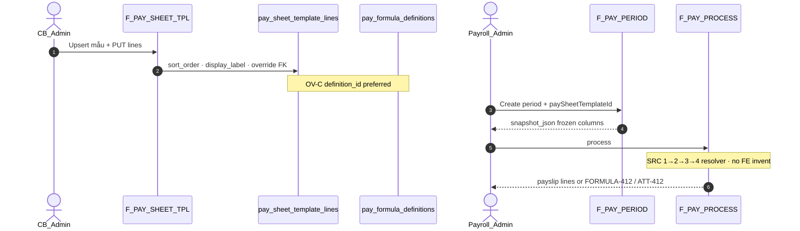

# PO-HRM-AMIS-PARITY-PAY-TPL-API-01 — API_DESIGN F.1 · F-PAY-SHEET-TPL-*

| Field | Value |
|-------|--------|
| **work_item_id** | `PO-HRM-AMIS-PARITY-PAY-TPL-API-01` |
| **Parent** | `PO-HRM-AMIS-PARITY-RESEARCH-01` |
| **prior** | `PO-HRM-AMIS-PARITY-PAY-DATA-01` **PASS** · SA-01 §3.2–3.3 · §6 · PAY-DEPTH AC-PAY-TPL-* |
| **lane** | governance · sa |
| **change_mode** | **ADD** F-PAY-SHEET-TPL-* · **EXPAND** F-PAY-PERIOD-01 + F-PAY-PROCESS-01 (snapshot · SRC resolver) · **DOC-DELTA** client API · **NO CODE** `apps/**` |
| **Date** | 2026-08-07 |
| **Status** | **CONFIRMED** — ba-data physical ADD-plan · OV-C · alias pack≠mẫu · residual = **product fidelity only** |
| **ref_data** | Evidence `po-hrm-amis-parity-pay-data-01.md` §§2–6 · VAL-PAY-TPL-* |
| **ref_sa** | `po-hrm-amis-parity-sa-01.md` §3.2–3.3 · §4 Option B · §6 BETTER |
| **ref_ba** | `po-hrm-amis-parity-pay-depth-01.md` **AC-PAY-TPL-01..06** · **AC-PAY-SRC-01..06** · BR-AMIS-PAY-SRC-01..05 |
| **ref_formula** | `PO-HRM-PAYROLL-FORMULA-RUN-GAP-API-01` **CONFIRMED** — **cấm** reopen · COMP/EVAL stay on formula wave |
| **ref_amis** | `PO_HRM_AMIS_PARITY_RESEARCH_01.md` §3 bước 3–5 |
| **ref_platform** | `ADR-HRM-DYNAMIC-CONFIG-PLATFORM` Option B — FormSchema consumer; open catalog; soft-delete |
| **Honesty** | `payroll_e2e_ready=false` · **cấm** invent LIVE engine · **cấm** merge `salary_templates` pack into mẫu SoT |
| **must_keep** | Pack enroll paths LIVE · formula F.1 · closed-sheet ATT-412 · no FE net · U65 · scope_parity · soft-delete `archived_at` |
| **ack_status** | **PASS_TO_PM** |

---

## 0. Objective & locks

Unlock **API_DESIGN F.1** for AMIS-class **mẫu bảng lương** (`pay_sheet_templates` / `pay_sheet_template_lines`) after ba-data CONFIRMED. Unlock **dev-be** `ensureSchema` + TPL CRUD **after** this seat — **separate** from formula BE-01 (may run in parallel). SRC precedence = **BE resolver algorithm** (not a DB enum column). COMP/EVAL/AUTHOR/PUBLISH remain on **F-PAY-FORMULA-*** wave.

| Lock | Rule |
|------|------|
| **Physical tables** | Nest ADD-plan **`pay_sheet_templates`** + **`pay_sheet_template_lines`** (DATA-01 §2) |
| **Alias ≠ mẫu** | LIVE **`salary_templates`** + **`hrm_salary_template_components`** = hire/enroll **pack only** — **FORBIDDEN** deepen into kỳ mẫu SoT |
| **Paths** | Nest physical **`/api/hrm/payroll/pay-sheet-templates*`** · pack stays **`/api/hrm/payroll/salary-templates*`** |
| **OV-C** | Preferred `formula_override_definition_id` → published `pay_formula_definitions`; optional `formula_override_json` = **PREVIEW draft only** — PROCESS FORBIDDEN without published definition |
| **SRC** | Emp C&B > period input > template override > catalog/default formula — **resolver** in PROCESS (cite DATA §4 · BA BR-SRC) — **not** invent FE amounts |
| **Open catalog** | Template `code` tenant-defined — **FORBIDDEN** `CHECK (code IN (...))` / reject N+1th |
| **Soft-delete** | `archived_at` on header + lines — **do not** copy pack hard `DELETE` |
| **Scope** | list ↔ get-by-id ↔ mutate = **same** `resolveHrmListScope` as periods / salary-templates (U19) |
| **Honesty** | Docs ≠ UAT · `payroll_e2e_ready=false` |
| **Formula HOLD** | **cấm** reopen formula F.1 / invent evaluator AST this seat |

**Envelope:** `{ code, message, data }`  
**Auth:** HRM JWT / membership — same payroll peers.

---

## 1. Capability map

| Cap | F-id | METHOD / path (Nest physical) | AC / BR |
|-----|------|-------------------------------|---------|
| List / get mẫu | **F-PAY-SHEET-TPL-LIST-01** | `GET /api/hrm/payroll/pay-sheet-templates` · `GET …/pay-sheet-templates/:id` | **AC-PAY-TPL-01** · scope_parity |
| Upsert header | **F-PAY-SHEET-TPL-UPSERT-01** | `POST /api/hrm/payroll/pay-sheet-templates` · `PATCH …/:id` | **AC-PAY-TPL-01** · VAL-PAY-TPL-01/02 |
| Replace lines | **F-PAY-SHEET-TPL-LINES-01** | `PUT …/pay-sheet-templates/:id/lines` · `GET …/:id/lines` | **AC-PAY-TPL-01/02/06** · OV-C · VAL-PAY-TPL-03/04 · OV-01..04 |
| Soft archive | **F-PAY-SHEET-TPL-ARCHIVE-01** | `POST …/pay-sheet-templates/:id/archive` · optional line archive | Soft-delete · open catalog |
| Period from mẫu | **F-PAY-PERIOD-01** EXPAND | `POST /api/hrm/payroll/periods` (+ `paySheetTemplateId`) · optional `POST …/periods/:id/bind-sheet-template` | **AC-PAY-TPL-03/05** |
| Process SRC | **F-PAY-PROCESS-01** EXPAND | `POST …/periods/:id/process` *(live)* | **AC-PAY-SRC-*** · BR-AMIS-PAY-SRC-01..05 |
| Enroll pack (EXISTING) | **F-PAY-SALARY-PACK-01** *(alias note)* | `GET\|POST\|PATCH\|DELETE /api/hrm/payroll/salary-templates*` | Hire/enroll — **≠** mẫu |



---

## 2. Alias lock — pack vs mẫu

| Concern | Physical | HTTP | Purpose |
|---------|----------|------|---------|
| **Hire / enroll pack** | `salary_templates` + `hrm_salary_template_components` | `/payroll/salary-templates*` | Default component membership + `default_value` / `sort_order` for enroll |
| **Mẫu bảng lương (AMIS Step3)** | `pay_sheet_templates` + `pay_sheet_template_lines` | `/payroll/pay-sheet-templates*` | Period sheet structure · label · order · OV-C override · applicability |
| **Formula SoT** | `pay_formula_definitions` | `/payroll/formulas*` | Dual-control expression — **cite** formula API-01 |
| **Component catalog** | `salary_components` | `/payroll/salary-components*` | Open picker — `formula` TEXT **≠** engine |

**FORBIDDEN:** Single resource that merges pack CRUD into mẫu; renaming pack tables into mẫu without BA deprecate wave.

---

## 3. OV-C override resolve (API contract)

Cite DATA-01 §3 · SA storage Option B / OV-C:

```text
On line bind / preview / process for a template column:
  IF formula_override_definition_id IS NOT NULL
    → load pay_formula_definitions (same company/rollup scope)
    → PROCESS: require status=active (published); else FORMULA-412
    → PREVIEW: draft allowed with warnings[] (honest staging)
  ELSE IF formula_override_json IS NOT NULL
    → PREVIEW only (opaque AST stash)
    → PROCESS: FORBIDDEN → HRM-PAY-FORMULA-412 (VAL-PAY-TPL-OV-01)
  ELSE
    → no template override → fall to SRC tier 4 (catalog/default published formula)
```

| Rule | API behavior |
|------|----------------|
| **VAL-PAY-TPL-OV-01** | Process with jsonb-only override → `HRM-PAY-FORMULA-412` |
| **VAL-PAY-TPL-OV-02** | Override definition out of company/rollup → `404` / `HRM-SCOPE-409` |
| **VAL-PAY-TPL-OV-03** | Active definition immutable — change override = new formula version + re-bind line |
| **VAL-PAY-TPL-OV-04** | **Never** read `salary_components.formula` TEXT as override or engine |

---

## 4. SRC precedence — resolver (not invent FE)

**must_keep order** (AMIS §3 · BA BR-AMIS-PAY-SRC · DATA §4):

```text
1. Emp history / C&B fixed amount for component     — highest
2. Period input pack (other income / advance / tay)
3. Template line formula override (OV-C published)
4. Component / published formula default            — lowest
Hour/OT/leave vars ONLY from closed attendance sheet (Q-PAY-F-3) — ATT-412 if open
```

| Rule | API |
|------|-----|
| Storage | **No** priority enum column on component — algorithm in **F-PAY-PROCESS-01** |
| Audit (when lines ADD) | Optional `source_tier` on payslip line: `emp_cb` \| `period_input` \| `template_override` \| `formula_default` |
| FE | **FORBIDDEN** POST computed net / override amount as SoT (OS28 · VAL-PAY-SRC-05) |
| Period input CRUD | **PAPER** `pay_period_input_lines` — **out of this F.1 CRUD** (stage after TPL BE); PROCESS cites read-when-LIVE |

**COMP/EVAL:** remain on formula wave — this seat only **binds** published definition ids on lines + documents resolver order.

---

## 5. API_DESIGN F.1 — F-PAY-SHEET-TPL-*

### 5.1 F-PAY-SHEET-TPL-LIST-01 — List / GET by id

| | |
|--|--|
| **METHOD / path** | `GET /api/hrm/payroll/pay-sheet-templates` · `GET /api/hrm/payroll/pay-sheet-templates/:id` |
| **Mục đích** | Liệt kê / xem chi tiết **mẫu bảng lương** theo pháp nhân (status, applicability, default) để chọn khi lập kỳ và thiết kế cột — **không** trả enroll pack. |
| **Nghiệp vụ xử lý** | (1) `resolveHrmListScope` + required `company_id` (slug Plane B — same `listSalaryTemplates` / periods). (2) Default exclude `archived_at IS NOT NULL` unless `include_archived=true`. (3) Filters: `status?` (`draft`\|`active`\|`retired`), `is_default?`, `applicability_scope?`, `q?`, `active_only?` (period picker). (4) Empty `[]` = **200**. (5) Get-by-id: **same** company/rollup predicate — out of scope → **404/403** (not 200 leak) — **U19**. (6) Optional `include_lines=true` embeds non-archived lines ordered by `sort_order`. (7) Display-ready: `code`, `name`, `status`, applicability fields — **cấm** raw UUID-only labels without name. |
| **Tham chiếu bước SRS** | **FR-UC-BP-PAY-02** dual SoT (mẫu) · **FR-UC-BP-PAY-06** chọn mẫu · AMIS Step3 · **AC-PAY-TPL-01** · DATA §6.2 scope |
| **Request (query)** | `company_id` · `status?` · `is_default?` · `applicability_scope?` · `include_archived?` · `include_lines?` · `q?` |
| **Response → DB** | |

| DTO field | DB column (`pay_sheet_templates`) |
|-----------|-----------------------------------|
| `id` | `id` |
| `companyId` | `company_id` |
| `code` | `code` |
| `name` | `name` |
| `description` | `description` |
| `status` | `status` |
| `isDefault` | `is_default` |
| `applicabilityScope` | `applicability_scope` |
| `ouId` | `ou_id` |
| `positionKey` | `position_key` |
| `employeeId` | `employee_id` |
| `archivedAt` | `archived_at` |
| `createdAt` / `updatedAt` | `created_at` / `updated_at` |
| `lines[]` (optional) | join `pay_sheet_template_lines` (§5.3 map) |

| **Lỗi** | Scope 403/409 · empty **không** 404 |
| **scope_parity** | List predicate ≡ get-by-id assert (**must_keep**) |

---

### 5.2 F-PAY-SHEET-TPL-UPSERT-01 — Create / patch header

| | |
|--|--|
| **METHOD / path** | `POST /api/hrm/payroll/pay-sheet-templates` · `PATCH /api/hrm/payroll/pay-sheet-templates/:id` |
| **Mục đích** | Tạo / sửa header mẫu (mã, tên, phạm vi áp dụng OU/chức danh/NV, default, status draft→active) — **không** ghi enroll pack. |
| **Nghiệp vụ xử lý** | (1) Scope + persist `resolveHrmPersistCompanyIdText`. (2) **Create:** INSERT with `status` default `draft` (or body); require `code`+`name`; validate `code` format/slug only → **`HRM-PAY-TPL-CODE-INVALID`** (**not** closed enum). (3) Duplicate active `(company_id, lower(code))` where `archived_at IS NULL` → **`HRM-PAY-TPL-409-CODE`** (VAL-PAY-TPL-02). (4) `applicability_scope` open string (`company`\|`ou`\|`position`\|`employee` recommended) — soft assert matching `ou_id`/`position_key`/`employee_id` when scope requires. (5) `is_default=true`: clear prior default for same company (app assert) or allow multi-default with warning — GĐ1 recommend one default. (6) **Patch:** refuse mutate if `archived_at` set → archive restore separate. (7) Transition `retired` via status or ARCHIVE. (8) **FORBIDDEN:** hard-delete; CHK IN template codes; writing lines on this endpoint (use LINES-01). |
| **Tham chiếu bước SRS** | **FR-UC-BP-PAY-02** · AMIS Step3 tạo mẫu · **AC-PAY-TPL-01** · DATA §2.1 · VAL-PAY-TPL-01/02 |
| **Request → DB** | |

| DTO | DB column | Required |
|-----|-----------|----------|
| `companyId` | `company_id` | YES (create) |
| `code` | `code` | create |
| `name` | `name` | create |
| `description` | `description` | optional |
| `status` | `status` | optional |
| `isDefault` | `is_default` | optional |
| `applicabilityScope` | `applicability_scope` | YES (default `company`) |
| `ouId` | `ou_id` | when scope=`ou` |
| `positionKey` | `position_key` | when scope=`position` |
| `employeeId` | `employee_id` | when scope=`employee` |
| *(server)* | `created_by`/`updated_by`, timestamps | server |

| **Response → DB** | Header DTO (§5.1) |
| **Lỗi** | `HRM-PAY-TPL-CODE-INVALID` · `HRM-PAY-TPL-409-CODE` · `HRM-VAL-400` · scope · `404` |
| **scope_parity** | Mutate assert = list company scope |

---

### 5.3 F-PAY-SHEET-TPL-LINES-01 — Get / replace column set

| | |
|--|--|
| **METHOD / path** | `GET /api/hrm/payroll/pay-sheet-templates/:id/lines` · `PUT /api/hrm/payroll/pay-sheet-templates/:id/lines` |
| **Mục đích** | Đọc / thay thế tập cột mẫu (thành phần catalog, nhãn hiển thị, thứ tự, override công thức OV-C) — form GĐ1 reorder OK; **cấm** yêu cầu DnD formula canvas (R-PAY-DD-01). |
| **Nghiệp vụ xử lý** | (1) Load template by id with **same** scope as LIST. (2) **GET:** return non-archived lines ordered by `sort_order`. (3) **PUT replace-set (GĐ1):** body `lines[]` full intended active set; soft-archive removed prior lines (`archived_at=now()`); upsert by `component_id`. (4) Each line: require `componentId` in company `salary_components` → else **`HRM-PAY-TPL-404-COMPONENT`** (VAL-PAY-TPL-03). Snapshot `component_code` from catalog at write. (5) `displayLabel` optional override; null → FE uses component name. (6) `sortOrder` required (≥0). (7) **OV-C:** accept `formulaOverrideDefinitionId` and/or `formulaOverrideJson`; if both → **definition_id wins** on resolve. (8) On write with `formulaOverrideDefinitionId`: soft assert definition exists under same company/rollup (**OV-02**); **do not** require `active` on draft template save — process gate later. (9) Duplicate `component_id` in body → **`HRM-PAY-TPL-409-LINE`** (VAL-PAY-TPL-04). (10) `isIdentityOrTotal` / `groupKey` / `isVisible` optional. (11) **FORBIDDEN:** treat pack `hrm_salary_template_components` as SoT; persist SC.formula TEXT as override; FE net. |
| **Tham chiếu bước SRS** | AMIS Step3 cột + override · **AC-PAY-TPL-01/02/06** · BR-AMIS-PAY-SRC-04 · DATA §2.2–§3 · SA §3.2 |
| **Request → DB** | |

| DTO (`lines[]`) | DB column (`pay_sheet_template_lines`) | Required |
|-----------------|----------------------------------------|----------|
| `componentId` | `component_id` | YES |
| *(server snapshot)* | `component_code` | YES |
| `displayLabel` | `display_label` | optional |
| `sortOrder` | `sort_order` | YES |
| `groupKey` | `group_key` | optional |
| `isVisible` | `is_visible` | default true |
| `isIdentityOrTotal` | `is_identity_or_total` | default false |
| `formulaOverrideDefinitionId` | `formula_override_definition_id` | optional OV-C |
| `formulaOverrideJson` | `formula_override_json` | optional preview stash |
| *(server)* | `template_id`, `company_id`, timestamps | server |

| **Response** | `{ templateId, lines[] }` with display-ready fields + optional `formulaOverrideCode`/`version` join for VI |
| **Lỗi** | `HRM-PAY-TPL-404-COMPONENT` · `HRM-PAY-TPL-409-LINE` · `HRM-PAY-TPL-404` · OV scope · `400` |
| **scope_parity** | Template get-by-id before mutate |

---

### 5.4 F-PAY-SHEET-TPL-ARCHIVE-01 — Soft-delete

| | |
|--|--|
| **METHOD / path** | `POST /api/hrm/payroll/pay-sheet-templates/:id/archive` · optional `POST …/lines/:lineId/archive` |
| **Mục đích** | Ẩn mẫu / cột khỏi picker bằng `archived_at` — giữ lịch sử snapshot kỳ đã lập. |
| **Nghiệp vụ xử lý** | (1) Scope + load. (2) Set `archived_at=now()`; optionally `status=retired`. (3) Archive header **does not** CASCADE wipe formula definitions. (4) Periods already bound keep `sheet_template_snapshot_json`. (5) **FORBIDDEN:** `DELETE FROM` hard-delete pattern from salary-templates pack. (6) List default hides archived. |
| **Tham chiếu bước SRS** | Soft-delete Platform L1 · DATA §6.1 · AC-PAY-TPL-05 immutability of past periods |
| **Lỗi** | `404` · scope · `409` if policy blocks archive of sole default (optional VI) |

---

## 6. EXPAND — F-PAY-PERIOD-01 (create / bind mẫu)

| | |
|--|--|
| **METHOD / path** | Nest live `POST /api/hrm/payroll/periods` · `GET/PATCH …/periods/:id` · optional `POST …/periods/:id/bind-sheet-template` |
| **Mục đích** *(keep + ADD)* | Mở kỳ lương; **ADD** chọn mẫu active → lưu `pay_sheet_template_id` + **immutable** `sheet_template_snapshot_json` khi bind / process-start policy. |
| **Nghiệp vụ xử lý — ADD** | (1) Accept `paySheetTemplateId` on create or bind endpoint. (2) Template must be in scope + preferably `status=active` + not archived — else **`HRM-PAY-TPL-412-TEMPLATE`**. (3) Build snapshot from current lines: per column `{ component_code, display_label, sort_order, formula_definition_id?, override_applied }`. (4) Persist `payroll_periods.pay_sheet_template_id` + `sheet_template_snapshot_json` (DATA §2.3). (5) After process start / processed: **refuse** hot-swap template or line override that would rewrite snapshot (**AC-PAY-TPL-05**) → **`HRM-PAY-TPL-409-IMMUTABLE`**. (6) Policy “require mẫu”: create/process without template → **`HRM-PAY-TPL-412-TEMPLATE`** (VAL-PAY-TPL-05). (7) **FORBIDDEN:** use `salary_templates` id as mẫu bind. |
| **Tham chiếu bước SRS** | **FR-UC-BP-PAY-06** Diễn biến **#1–#2** lập bảng theo mẫu · AMIS Step5 · **AC-PAY-TPL-03/05** |
| **Request → DB** | `paySheetTemplateId` → `pay_sheet_template_id`; snapshot → `sheet_template_snapshot_json` |
| **Lỗi** | `HRM-PAY-TPL-412-TEMPLATE` · `HRM-PAY-TPL-409-IMMUTABLE` · scope |

---

## 7. EXPAND — F-PAY-PROCESS-01 (SRC + OV-C bind notes)

| | |
|--|--|
| **METHOD / path** | Nest live `POST /api/hrm/payroll/periods/:id/process` |
| **Mục đích** *(keep)* | Orchestrate kỳ → phiếu |
| **Nghiệp vụ xử lý — ADD SRC/TPL** | (1) Keep ATT closed → `HRM-PAY-ATT-412`. (2) Prefer column set from period **snapshot** (not live template mutate). (3) For each component column / enrolled employee: run **SRC resolver** §4 — short-circuit amount tiers 1–2 before evaluate. (4) Tier 3: if snapshot `override_applied` / definition id → evaluate **published** `pay_formula_definitions` only (OV-C) — jsonb-only → `HRM-PAY-FORMULA-412`. (5) Tier 4: published default formula for component code (formula wave) — **never** SC.formula TEXT. (6) Missing all → `HRM-PAY-FORMULA-412` VI (**AC-PAY-SRC-05**) — **no** silent 0₫ UAT · **no** Nest %. (7) Write payslip lines; optional `source_tier`. (8) **FORBIDDEN:** FE-supplied net; invent evaluator AST here (cite formula BE). |
| **Tham chiếu bước SRS** | FR-UC-BP-PAY-01/06 · **AC-PAY-SRC-01..06** · BR-AMIS-PAY-SRC-01..05 · formula API-01 §5 · AMIS §3 priority |
| **Lỗi** | `HRM-PAY-ATT-412` · `HRM-PAY-FORMULA-412` · `HRM-PAY-TPL-412-TEMPLATE` · `HRM-PAY-BOUNDARY-403` · scope |

**Staging:** Full SRC tier-2 packs + hour-var fidelity may remain **BLOCKED** until `pay_period_input_lines` / `att_timesheet_line` LIVE — honest codes; **do not** flip `payroll_e2e_ready`.

---

## 8. F-PAY-SALARY-PACK-01 — EXISTING enroll pack *(alias note)*

| | |
|--|--|
| **METHOD / path** | Live `GET\|POST\|PATCH\|DELETE /api/hrm/payroll/salary-templates` (+ `…/components`, duplicate) |
| **Mục đích** | Pack thành phần mặc định khi **hire/enroll** — **không** thay mẫu bảng lương kỳ. |
| **Nghiệp vụ** | Keep LIVE behavior; soft-delete gap on pack is known — **do not** copy hard DELETE into mẫu APIs. New AMIS product UX must call **pay-sheet-templates**. |
| **Tham chiếu** | DATA §1.2 alias · SA reject Option A deepen pack |
| **Regression** | Hire→pay enroll AC-PAY-HIRE-04/05 must_keep |

---

## 9. Error taxonomy

| Code | When |
|------|------|
| `HRM-PAY-TPL-CODE-INVALID` | Template code format/slug only — **not** closed enum |
| `HRM-PAY-TPL-409-CODE` | Duplicate active `(company_id, code)` |
| `HRM-PAY-TPL-409-LINE` | Duplicate component on one mẫu |
| `HRM-PAY-TPL-404-COMPONENT` | Line component not in company catalog |
| `HRM-PAY-TPL-404` | Template / line not found in scope |
| `HRM-PAY-TPL-412-TEMPLATE` | Missing/invalid mẫu when policy requires · inactive/archived bind |
| `HRM-PAY-TPL-409-IMMUTABLE` | Hot-swap mẫu/snapshot after process start |
| `HRM-PAY-FORMULA-412` | OV-C jsonb-only on process · missing published definition (cite formula taxonomy) |
| `HRM-PAY-ATT-412` | Open/missing closed sheet |
| `HRM-SCOPE-409` / 403/404 | Scope parity |
| `HRM-VAL-400` | Missing required fields |

---

## 10. Validation matrix (cite DATA §7)

| ID | Condition | API |
|----|-----------|-----|
| VAL-PAY-TPL-01 | Create without company/code | 400 |
| VAL-PAY-TPL-02 | Duplicate active code | `409-CODE` |
| VAL-PAY-TPL-03 | Unknown component | `404-COMPONENT` |
| VAL-PAY-TPL-04 | Dup component lines | `409-LINE` |
| VAL-PAY-TPL-05 | Process/create require-mẫu without template | `412-TEMPLATE` |
| VAL-PAY-TPL-OV-01..04 | §3 | FORMULA-412 / scope |
| VAL-PAY-SRC-01..05 | §4 | source_tier / FORMULA-412 / ATT-412 / reject FE SoT |

---

## 11. Client API_DESIGN DOC-DELTA (ADD-only)

**File:** `docs/client-delivery/hrm-enterprise-blueprint/API_DESIGN_HRM_ENTERPRISE.md`

| Change | Detail |
|--------|--------|
| **ADD** | **F-PAY-SHEET-TPL-LIST/UPSERT/LINES/ARCHIVE-01** — full F.1 · DTO↔DATA-01 |
| **EXPAND** | **F-PAY-PERIOD-01** — `pay_sheet_template_id` + snapshot |
| **EXPAND** | **F-PAY-PROCESS-01** — SRC resolver + OV-C process gate (pointer) |
| **ADD** | Alias note **F-PAY-SALARY-PACK-01** ≠ mẫu |
| **UPGRADE** | §7.1 Nest `pay_sheet_templates` / `_lines` · §7.3 verdict **PASS** (F.1 CONFIRMED) |
| **KEEP** | F-PAY-FORMULA-* CONFIRMED · P1–P6 · GW · GĐ2 DnD · D7 · `payroll_e2e_ready=false` |
| **FORBIDDEN** | Wipe formula F.1 · merge pack into mẫu · invent LIVE engine · `apps/**` |

---

## 12. Dev unlock gate

| Gate | Status after this seat |
|------|------------------------|
| PAY-DATA-01 columns CONFIRMED | **YES** (prior) |
| API F.1 TPL LIST/UPSERT/LINES/ARCHIVE + PERIOD/PROCESS notes | **YES — this file** |
| **dev-be** ensureSchema + TPL CRUD | **UNLOCKED** — work_item `PO-HRM-AMIS-PARITY-PAY-TPL-BE-01` |
| Formula BE-01 | **Separate** — may parallel; OV-C process SoT needs published definitions |
| Period input / ATT line | Staged — honest BLOCKED codes |
| `payroll_e2e_ready` | Remains **false** |

---

## 13. Non-claims

- No `apps/**` / migrations / Nest OpenAPI export this seat.
- No invent LIVE evaluator / AST / GĐ1 formula DnD.
- No claim `payroll_e2e_ready=true` / AMIS parity DONE / Phase1 DONE.
- No reopen F-PAY-FORMULA-* HOLD / workshop.
- No merge `salary_templates` into mẫu SoT.

---

## 14. Handoff

- **ack_status:** `PASS_TO_PM`
- **next_owner:** `pm` → dispatch **dev-be** `PO-HRM-AMIS-PARITY-PAY-TPL-BE-01` (ensureSchema + CRUD; separate from formula BE if still running)
- **evidence_path:** `docs/qa/evidence/po-hrm-amis-parity-pay-tpl-api-01.md`
