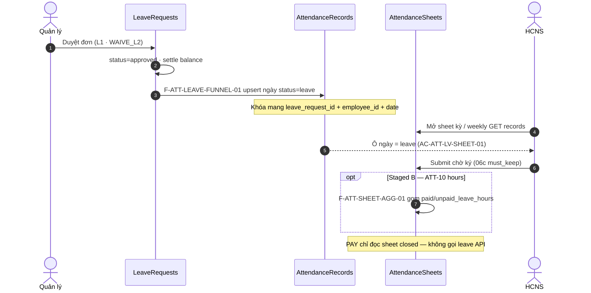

# PO-HRM-ATT-LEAVE-FUNNEL-SPEC-01 — TechSpec / API intents: phép đã duyệt → phễu bảng công

| Field | Value |
|-------|--------|
| work_item_id | `PO-HRM-ATT-LEAVE-FUNNEL-SPEC-01` |
| from_role | sa |
| to_role | pm |
| lane | governance · sa |
| program | `W-ALL-PARALLEL-01` · parent `PO-HRM-E2E-LINK-ATT-SPEC-01` **P0-3** |
| change_mode | **ADD** · **NO CODE** `apps/**` until PM/sponsor CONFIRM |
| date | 2026-08-06 |
| SoT spine | `PO-HRM-E2E-LINK-ATT-SPEC-01` §4.2 · §5 P0-3 · `PO_E2E_BUSINESS_SPINE_PROGRAM.md` E2E-SPINE-02 L11 |
| SoT khách | `SRS_HRM_ENTERPRISE.md` **FR-UC-BP-ATT-09** → **ATT-10** («Công nghỉ phép») → ATT-11 |
| SoT team | `docs/hrm/SRS.md` HRM-AT-14 · **AC-ATT-SHEET-01..06** · UC-HRM-10 leave |
| Journey | **J-HRM-06** · **06b** (must_keep) · **06c** (must_keep sign) · UF-HRM-16 · AC-ATT-LV-SHEET-01 |
| Ladder | `PO-HRM-ATT-LEAVE-LADDER-N-01` · **WAIVE_L2_PHASE1** — **cấm** reopen N / invent ladder |
| honesty | **`attendance_uat_ready=false`** · Attendance **not CLOSED** · U65 zero-seed |
| ack_status | **PASS_TO_PM** |

---

## 0. Verdict

| Item | Value |
|------|--------|
| **Gap class** | **C-SPINE-BREAK ATT-SB-02** — approve leave **không** materialize vào `attendance_records` / dòng bảng công → weekly/ATT-10 «Công nghỉ phép» đứt |
| **CHOSEN option** | **Option A** (eager day markers trên records) **+ staged B** (aggregate hours vào line trước submit/sign) — **không** Option C FE-join |
| **Dev unlock this seat** | **HOLD** — chờ PM CONFIRM packet + ba-data DB soft-FK delta |
| **attendance_uat_ready** | **false** (cấm claim) |
| **WAIVE_L2** | **giữ** — seat này **không** đụng ladder / WF 2 bước |

---

## 1. Evidence facts (AS-IS — no invention)

| # | Fact | Source |
|---|------|--------|
| F1 | Enterprise ATT-10 phễu **bắt buộc** thành phần **Công nghỉ phép** từ phép đã duyệt (theo loại) | `SRS_HRM_ENTERPRISE.md` FR-UC-BP-ATT-10 bảng đầu vào |
| F2 | Parent AC: **AC-ATT-LV-SHEET-01** — duyệt phép U65 → mở weekly cùng kỳ → thấy phép; F5; ≠ epoch 1970 | `PO-HRM-E2E-LINK-ATT-SPEC-01` §4.2 |
| F3 | `approveLeaveRequest` / internal: `status=approved` + `settleApprovedLeaveBalance` + fanout — **không** INSERT/UPSERT `attendance_records` | `leave-requests.service.ts` |
| F4 | `attendance_sheets` create = **header-only**; **không** seed roster/records (AC-ATT-SHEET empty honesty) | `attendance-catalog.service.ts` · AC-ATT-SHEET-01..06 |
| F5 | Weekly / lưới kỳ AS-IS = `GET …/attendance/records?from_date&to_date` (≤2/10s) — **không** join leave API trên FE SoT | HRM-AT-14 · `docs/hrm/TECHSPEC.md` §14.4 |
| F6 | `attendance_records.status` enum AS-IS: `pending\|present\|absent\|leave` — **có** slot `leave`; schema **không** có `leave_request_id` | `attendance.service.ts` ensureSchema |
| F7 | Enterprise logical SoT PAY: `att_timesheet_line.paid_leave_hours` / `unpaid_leave_hours` — AS-IS runtime sheet = `attendance_sheets` header + records grid; line hours **chưa** materialize đầy đủ ATT-10 | `DB_DESIGN_HRM_ENTERPRISE.md` §4.6 |
| F8 | Leave WF bridge / L1 approve path LIVE (narrow GWC); ladder L2 = **WAIVED_P1** | LEAVE-WF evidence · LADDER-N-01 |
| F9 | **J-HRM-06b** 🟢 storm guard; **J-HRM-06c** sign slice PASS (2026-08-06) — **≠** module UAT-ready; funnel leave→sheet vẫn mở | `PROGRAM_JOURNEY_MAP.md` |
| F10 | Canonical HTTP sheets: `/api/hrm/attendance/attendance-sheets…` (ADR 20260805) — mọi F-id mới gắn path này | ADR-HRM-ATT-SHEET-HTTP-PATH |

**Implication:** L11 spine đứt ở **materialize** (records / line hours), không ở form leave hay create sheet. Spec seat khóa **khi nào / field nào / API nào** ghi công nghỉ — không invent ladder N.

---

## 2. Target architecture (transition)



**Invariants**

| ID | Rule |
|----|------|
| INV-1 | PAY **không** FK/HTTP tới `leave_requests` (ADR 4-pillar / BR-BP-TS-03) — phép chỉ vào phễu **trước** close |
| INV-2 | Sheet `closed` → **không** mutate records/lines từ leave reverse (`HRM-ATT-SHEET-LOCKED` / equivalent) |
| INV-3 | Create sheet **vẫn** không auto-seed roster — chỉ materialize ngày có phép duyệt (giữ empty honesty) |
| INV-4 | Storm guard 06b: funnel **không** thêm GET loop; mutate leave → tối đa invalidate records query hiện có |
| INV-5 | WAIVE_L2: mọi đơn L1 terminal — funnel **không** chờ bước L2 |

---

## 3. Options A / B / C

### Option A — Eager materialize daily `attendance_records` on approve (**RECOMMENDED P0**)

| Dimension | Detail |
|-----------|--------|
| **Summary** | Khi leave → `approved`, BE expand `[from_date..to_date]` (calendar / half-day per leave unit config) → **UPSERT** `attendance_records` (`status=leave`, soft `leave_request_id`, note/type display-ready). Reject/cancel sau approve → reverse markers nếu sheet kỳ **không** `closed`. |
| **Scope** | Đóng AC-ATT-LV-SHEET-01 + weekly J-HRM-06b visibility; nền cho ATT-10 «thấy phép» |
| **Complexity** | Medium — transaction trong approve path; UQ `(company, employee, date)` đã có |
| **Pros** | Khớp AS-IS weekly = records; OS 28 (FE không join); reuse status enum `leave`; U65 testable; không đụng sign path |
| **Cons** | Chưa đủ `paid_leave_hours` line cho PAY depth; half-day / holiday skip cần BR rõ; conflict nếu ngày đã `present` |
| **Failure modes** | (a) Ghi đè punch im lặng → mitigate: conflict policy §5. (b) Storm FE refetch → mitigate: INV-4. (c) Reverse sau close → 409 LOCKED |

### Option B — Lazy aggregate on sheet submit / rebuild (**STAGED after A**)

| Dimension | Detail |
|-----------|--------|
| **Summary** | `POST …/attendance-sheets/{id}/aggregate` (hoặc trong `submit`) đọc phép `approved` giao kỳ + punch/OT → ghi `att_timesheet_line` / projection `paid_leave_hours` · `unpaid_leave_hours` · `payable_hours`. |
| **Scope** | ATT-10 hours SoT trước ký/chốt; consumer PAY |
| **Complexity** | Higher — cần ba-data khóa physical line vs AS-IS header; idempotent rebuild |
| **Pros** | Khớp enterprise §4.6; một lần gom phễu; phù hợp BR-BP-TS-01 |
| **Cons** | Weekly vẫn trống phép nếu chỉ B không A; phụ thuộc DB line chưa đủ AS-IS |
| **This seat** | **Spec intents + queue** — **không** unlock Dev B trước ba-data CONFIRM line physical |

### Option C — FE overlay leave onto weekly (**REJECT**)

| Dimension | Detail |
|-----------|--------|
| **Summary** | Weekly FE gọi `leave-requests` + `records` rồi tô màu ô |
| **Verdict** | **REJECT** — vi phạm OS 28 / display-ready; hai nguồn số; F5/race; PAY vẫn mù |
| **Risk** | UAT giả «thấy phép» trong khi sheet close không có giờ phép |

### Trade-off matrix

| Criterion | A | B | C |
|-----------|---|---|---|
| AC-ATT-LV-SHEET-01 weekly | **Pass** | Fail alone | Fake Pass |
| ATT-10 hours → PAY | Partial | **Pass** | Fail |
| OS 28 FE–BE | **Pass** | **Pass** | Fail |
| must_keep 06b storm | Pass (care) | Pass | Risk |
| must_keep 06c sign | Pass | Touch submit only | Pass |
| WAIVE_L2 intact | **Yes** | **Yes** | Yes |
| Complexity / time | Medium | High | Low (wrong) |

**Recommend:** **A now (P0 funnel)** → **B staged (P0-ATT-10-hours)** sau ba-data. **C forbidden.**

---

## 4. TechSpec API intents (F.1 skeleton — purpose · business · SRS bước)

> Physical path prefix: `/api/hrm/attendance/…` (ADR). Logical F-id namespace `F-ATT-*`.  
> **ADD-only** overlay — không wipe F-ATT-SHEET-01..04 / F-ATT-WF-SIGN / LeaveWorkflowBridge.

### F-ATT-LEAVE-FUNNEL-01 — Materialize records khi duyệt phép

| Mục | Nội dung |
|-----|----------|
| **Mục đích** | Sau ATT-09 approved, mỗi ngày trong kỳ nghỉ có marker công `leave` để lưới tuần / Bản ghi phản ánh «Công nghỉ phép». |
| **Nghiệp vụ xử lý** | Trong cùng transaction approve (hoặc ngay sau commit + outbox): load row leave `approved`; expand dates; UPSERT record theo UQ; set `status=leave`; gắn soft `leave_request_id`; copy `leave_type` → display fields; **không** spawn ladder L2. Conflict ngày đã `present`/`absent` → policy §5 (default: **409** `HRM-ATT-LEAVE-FUNNEL-CONFLICT` trừ override HCNS sau). |
| **Tham chiếu bước SRS** | FR-UC-BP-ATT-09 Thành công → ATT-10 đầu vào «Công nghỉ phép» · Parent L11 · Diễn biến ATT-10 #2 «Chạy gộp» (day marker = input gộp) · AC-ATT-LV-SHEET-01 |
| **HTTP** | *Internal* trong `POST …/leave-requests/{id}/approve` (và WF terminal callback approve) — **không** bắt user gọi API riêng Phase-1 |
| **Response impact** | Approve 2xx vẫn `HRM-LEAVE-203`; optional echo `materialized_record_ids[]` / `materialized_days` (display-ready) |
| **Errors** | `HRM-ATT-LEAVE-FUNNEL-CONFLICT` · `HRM-ATT-SHEET-LOCKED` nếu mọi ngày thuộc sheet closed · scope 409 parity list↔approve |

### F-ATT-LEAVE-FUNNEL-02 — Reverse markers khi từ chối / hủy sau duyệt

| Mục | Nội dung |
|-----|----------|
| **Mục đích** | Không để công nghỉ «ma» khi đơn không còn approved. |
| **Nghiệp vụ xử lý** | Nếu transition rời `approved` → `rejected`/`cancelled`: xóa hoặc downgrade records có `leave_request_id` = đơn **chỉ khi** không thuộc header `closed`. Ngày có punch độc lập giữ nguyên. |
| **Tham chiếu bước SRS** | ATT-09 reject path · BR-BP-TS / V-07 sheet locked · Parent L11 inverse |
| **HTTP** | Internal trong reject / cancel / WF reject callback |
| **Errors** | `HRM-ATT-SHEET-LOCKED` (409) nếu sheet closed — yêu cầu reopen UC trước |

### F-ATT-LEAVE-FUNNEL-03 — GET records display-ready leave (list/weekly)

| Mục | Nội dung |
|-----|----------|
| **Mục đích** | FE weekly/Bản ghi hiển thị phép **không** join leave API. |
| **Nghiệp vụ xử lý** | Khi `status=leave`: trả `leave_request_id`, `leave_type` / `leave_type_label`, `status_label` vi-VN («Nghỉ phép»); date ISO; **cấm** epoch 1970. |
| **Tham chiếu bước SRS** | HRM-AT-14 lưới · AC-ATT-SHEET-02/06 · AC-ATT-LV-SHEET-01 · OS 28 |
| **HTTP** | `GET /api/hrm/attendance/records` (existing) — **EXPAND** projection only |
| **Storm** | **must_keep** ≤2 GET / 10s cùng from/to — **cấm** thêm poll vì funnel |

### F-ATT-SHEET-AGG-01 — Aggregate leave hours vào line (Option B · staged)

| Mục | Nội dung |
|-----|----------|
| **Mục đích** | Trước submit/sign, dòng NV có `paid_leave_hours` / `unpaid_leave_hours` theo loại phép (ATT-10 SoT giờ). |
| **Nghiệp vụ xử lý** | Idempotent rebuild: sum hours từ records `leave` (+ catalog paid/unpaid) giao `sheet.start_date..end_date`; ghi line UQ `(header_id, employee_id)`; **không** gọi lại leave để PAY. |
| **Tham chiếu bước SRS** | FR-UC-BP-ATT-10 Diễn biến #2–#3 · BR-BP-TS-01 · tiên quyết ATT-11 |
| **HTTP** | `POST /api/hrm/attendance/attendance-sheets/{sheetId}/aggregate` **hoặc** gộp vào existing `POST …/submit` (ba-data + SA confirm một SoT) |
| **Errors** | `HRM-AS-404` · scope 409 · `HRM-ATT-SHEET-LOCKED` nếu closed |
| **HOLD** | Dev B **sau** `PO-HRM-ATT-LEAVE-FUNNEL-DB-01` CONFIRM physical line columns |

### F-ATT-LEAVE-FUNNEL-04 — Scope parity (U19)

| Mục | Nội dung |
|-----|----------|
| **Mục đích** | Materialize / reverse / aggregate dùng **cùng** company scope resolver với leave list/approve và sheet list/get. |
| **Nghiệp vụ xử lý** | `resolveHrmListScope` / sheet-scope helper; TEXT slug vs UUID ladder parity leave AT-12/13. |
| **Tham chiếu bước SRS** | Parent L10 · E-ATT-409 · ADR scope ladder |
| **HTTP** | Mọi mutate trên paths hiện có — không endpoint scope riêng |

---

## 5. Conflict & unit policy (DRAFT — ba-process seal sau CONFIRM)

| Case | Default Phase-1 | Note |
|------|-----------------|------|
| Ngày đã `present` + leave approve overlap | **409 CONFLICT** — không silent overwrite | HCNS giải trình / update-request trước |
| Ngày `pending`/`absent` | UPSERT → `leave` | OK |
| Half-day / hour unit (Q-LEAVE-UNIT) | Materialize **fraction** via note + status leave **hoặc** 0.5 day flag in `other` JSON — **không** invent unit lock; follow catalog type | ba-data |
| Ngày lễ trong range | Vẫn marker leave **hoặc** skip theo BR holiday — **OPEN-Q1** (không bịa) | ba-process |
| Sheet `submitted`/`closed` | Approve leave overlapping → **409 LOCKED** hoặc require reopen | Align V-07 |
| Multi-company leave | company_id record = leave row company (TEXT ladder) | F-ATT-LEAVE-FUNNEL-04 |

**OPEN-Q (không invent)**

| Q | Question | Owner |
|---|----------|-------|
| OPEN-Q1 | Ngày lễ trong khoảng nghỉ: vẫn `leave` hay skip? | ba-process |
| OPEN-Q2 | Aggregate gắn `submit` vs endpoint `/aggregate` riêng? | sa+ba-data sau DB |
| OPEN-Q3 | Unpaid vs paid map từ `leave_types` catalog field nào? | ba-data |

---

## 6. must_keep / forbidden

| Keep | Rule |
|------|------|
| **J-HRM-06b / UF-HRM-16 / AC-ATT-SHEET-01..06** | Empty honesty; **≤2** GET sheets + records / 10s; **cấm** auto-reload storm |
| **J-HRM-06c sign path** | `signatures` · `close` · `submit` contract **không** regress; funnel **không** bypass chữ ký |
| **WAIVE_L2_PHASE1** | **Không** reopen N; **không** WF 2-step; **không** 🟢 LV-02; Option A ladder pack = backlog only |
| **LeaveWorkflowBridge** | Spawn/callback L1 giữ; funnel hook **sau** terminal approve — không thay bridge |
| **U65** | Cấm seed leave/inbox để pass funnel QA |
| **PAY boundary** | Không HTTP leave từ payroll |

| Forbidden | |
|-----------|--|
| Option C FE-join | |
| `apps/**` trước CONFIRM + DB-01 | |
| Claim `attendance_uat_ready=true` | |
| Invent ladder `N` / `T_L1` | |
| Dual-write shadow hours trên PAY | |

---

## 7. Acceptance (browser U65 — sau Dev)

| AC | Steps | Pass |
|----|-------|------|
| **AC-ATT-LV-SHEET-01** | Login → tạo đơn leave FE → QL duyệt → mở **Bảng chấm công** sheet kỳ giao → weekly thấy ô/status nghỉ phép → F5 còn → Network records 2xx · dates ≠ 1970 | 🟢 |
| **AC-ATT-LV-SHEET-02** | Reject sau approve (sheet open) → marker leave biến mất / không còn status leave cho `leave_request_id` đó | 🟢 |
| **AC-ATT-LV-SHEET-03** | Sheet closed + approve leave overlap → 409 LOCKED (hoặc documented reopen path) — **không** im lặng ghi | 🟢 |
| **AC-ATT-SHEET-04/06** | Sau funnel wave: storm regress = **FAIL tức thì** | must_keep |
| **LV-02** | **WAIVED_P1** — cấm 🟢 | honesty |

---

## 8. P0_fix_queue (sau CONFIRM — copy-ready)

| Priority | work_item_id | Owner | Entry | Exit | Depends |
|----------|--------------|-------|-------|------|---------|
| P0-DB | `PO-HRM-ATT-LEAVE-FUNNEL-DB-01` | **ba-data** | PM CONFIRM this packet | Soft FK `leave_request_id` (+ optional `leave_type_key`) trên `attendance_records`; IX; map unpaid/paid OPEN-Q3; DOC-DELTA DB_DESIGN §4.x — **không** wipe §4.6 | This SPEC |
| P0-BE | `PO-HRM-ATT-LEAVE-FUNNEL-BE-01` | **dev-be** | DB-01 CONFIRM | F-ATT-LEAVE-FUNNEL-01..04 trong approve/reject + GET projection; jest materialize/reverse/conflict/locked; scope parity | DB-01 |
| P0-FE | `PO-HRM-ATT-LEAVE-FUNNEL-FE-01` | **dev-fe** | BE READY_FOR_QA | Weekly/Bản ghi bind display-ready leave label; **cấm** FE join leave list; không thêm poll | BE-01 |
| P0-QA | `PO-HRM-ATT-LEAVE-FUNNEL-QA-01` | **qa** | FE+BE READY | AC-ATT-LV-SHEET-01..03 U65 + storm regress 06b; evidence path | FE/BE |
| P0-AGG | `PO-HRM-ATT-SHEET-AGG-01` | ba-data → sa deepen → dev-be | After FUNNEL-QA or parallel if DB line ready | F-ATT-SHEET-AGG-01 physical + submit/aggregate | OPEN-Q2 |
| — | `PO-HRM-ATT-LEAVE-LADDER-WF-01` | — | **BLOCKED** | — | **HOLD** WAIVE |

```text
Cascade:
  PM CONFIRM PO-HRM-ATT-LEAVE-FUNNEL-SPEC-01
  → ba-data FUNNEL-DB-01
  → parallel narrow: BE-01 + (FE-01 after BE contract)
  → qa FUNNEL-QA-01 (U65 · must_keep 06b/06c · WAIVE_L2)
  → optional AGG-01 for ATT-10 hours
  → attendance_uat_ready vẫn false đến SB-02 đóng + residual ATT P0 khác
```

---

## 9. Honesty locks

| Flag | Value |
|------|-------|
| `attendance_uat_ready` | **false** |
| ATT-SB-02 leave→sheet funnel | **OPEN** until FUNNEL-QA PASS |
| WAIVE_L2 / LV-02 | **WAIVED_P1** — không reopen |
| J-HRM-06b | **🟢 must_keep** |
| J-HRM-06c | **must_keep** (slice PASS ≠ module UAT) |
| Face web / export Nest / summary RPT | **out_mvp** — không đụng |
| apps/** this seat | **untouched** |

---

## Completion contract

- `completion_report`: Đã khóa AS-IS gap (approve≠records), Options A/B/C + recommend A+staged B, F-ATT-LEAVE-FUNNEL-01..04 + AGG-01 intents (purpose·business·SRS bước), must_keep 06b/06c/WAIVE_L2, P0_fix_queue ba-data→BE→FE→QA, honesty `attendance_uat_ready=false`. **No apps/** · no commit · no invent N.
- `next_owner`: **pm** → stamp CONFIRM → **ba-data** `PO-HRM-ATT-LEAVE-FUNNEL-DB-01`
- `ack_status`: **PASS_TO_PM**
- `evidence_path`: `docs/program/specs/PO-HRM-ATT-LEAVE-FUNNEL-SPEC-01.md` · `docs/qa/evidence/po-hrm-att-leave-funnel-spec-01.md`
