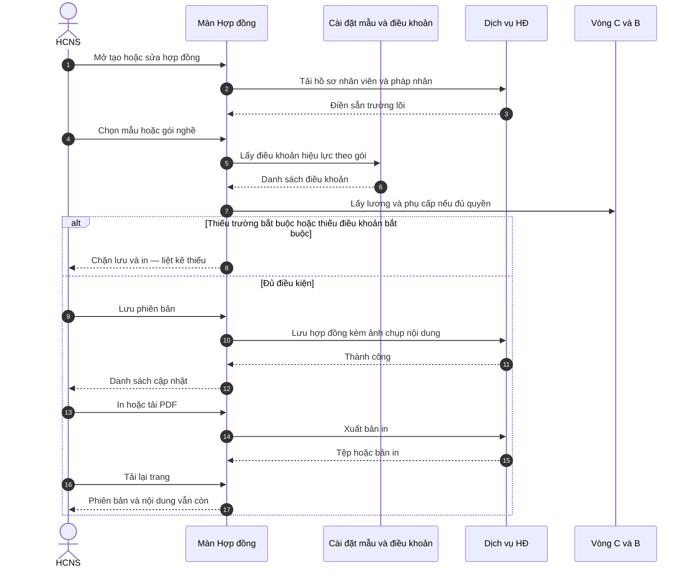
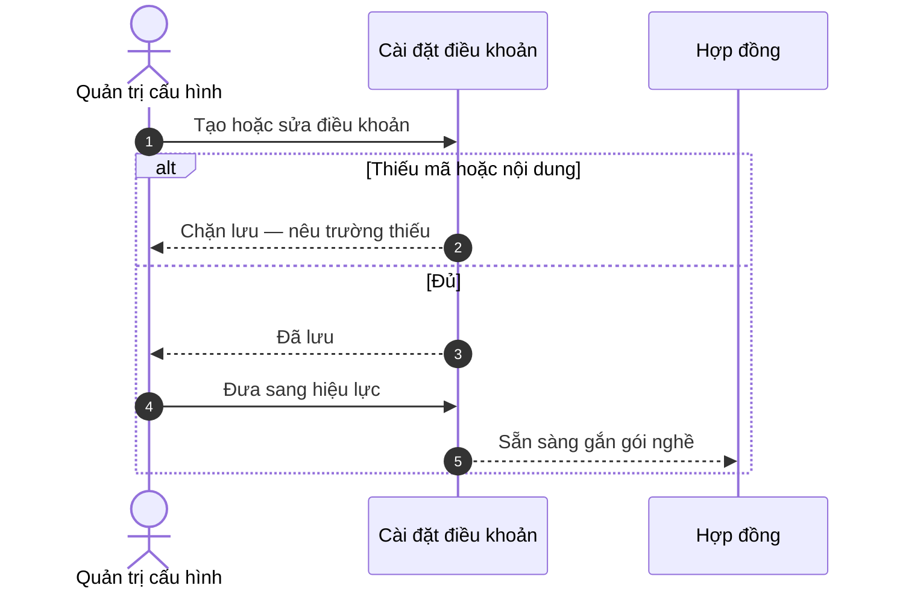

# Delta SRS — Hợp đồng lao động chuẩn VN (Đ.21 + pack nghề + in ấn)

**Trạng thái draft:** DRAFT · chờ chốt sponsor → ba-docs merge Enterprise  
**Neo spine:** FR-UC-BP-CORE-09 · UC-HRM-25 · UF-HRM-02 (CRUD must_keep)  
**Chế độ:** ADD-only · **không** xóa / đè CRUD registry · **không** claim printable UAT  
**Program:** `docs/program/PO_HRM_CONTRACT_LEGAL_PRINT_PROGRAM.md`

---

## 0. Meta đội ngũ (không đưa vào bản gửi khách)

| Mục | Giá trị |
|-----|---------|
| work_item_id | `PO-HRM-CONTRACT-LEGAL-PRINT-SPEC-01` |
| lane | governance · ba-process |
| law_ref | BLLĐ 2019 **Điều 21** · **TT 10/2020/TT-BLĐTBXH** Điều 3 (+ Đ.21 khoản 2 bảo mật) |
| samples_ref | thuvienphapluat / MISA AMIS mẫu HĐLĐ; mauhopdong.vn / hopdongmau.com (driver) — **cấu trúc tham chiếu**, cấm paste full DOC bản quyền vào docs khách |
| honesty | `contracts_printable_ready=false` · `hrm_personnel_uat_ready=false` · U65 |
| must_keep | UF-HRM-02 / J-HRM-03 CRUD list-create-edit-F5; `contract_types` picker; scope parity; soft-delete |
| forbidden | apps/** this wave · seed · wipe CORE-09 · invent pháp lý ngoài Đ.21/TT10 |
| next | ba-docs merge → sa TechSpec → ba-data DB/API → FE/BE |

---

## 1. Mục tiêu nghiệp vụ

Biến màn Hợp đồng từ **sổ đăng ký** (loại HĐ · ngày · NV · mã) thành luồng **HĐLĐ dùng được**:

1. Đủ **nội dung chủ yếu** theo Đ.21 / TT 10 (map field + nguồn dữ liệu).
2. **Lõi chung** mọi nghề + **pack nghề** (IT văn phòng vs Lái xe…) khác chi tiết công việc + nhóm điều khoản.
3. **In / PDF** nhìn như văn bản hợp đồng thật (tiêu đề · bên A/B · điều khoản · chữ ký), không chỉ bảng registry.
4. **Thư viện điều khoản** cấu hình ở Cài đặt (versioned) — cấm hardcode toàn bộ văn bản luật trên FE.

**Không** thay tư vấn luật sư; hệ thống hỗ trợ soạn theo khung pháp lý công bố.

---

## 2. As-is / To-be

| | As-is (product 2026-08) | To-be (program này) |
|---|------------------------|---------------------|
| Form HĐ | `contract_code` · NV · phòng · `contract_type` · hiệu lực/hết hạn · status · notes · file_url (+ `position_key` POST) | + đầy đủ field Đ.21 (merge từ master/C&B/company) + pack + clauses |
| Mẫu in | Không wizard «chọn mẫu → merge preview → In» | CORE-09 print spine đầy đủ |
| Điều khoản | Không thư viện Settings | Clause library versioned theo pack |
| UF-HRM-02 🟢 | CRUD registry PASS | **Giữ**; printable = gate riêng |
| Honesty | Matrix 🟢 dễ hiểu nhầm = HĐLĐ đủ | `contracts_printable_ready=false` đến QA print U65 |

### Gap vs Đ.21 (tóm tắt)

| Đ.21 điểm | As-is form | Gap |
|-----------|------------|-----|
| a) NSDLĐ + người ký bên A | Không trên form (chỉ company scope) | **impl_gap** + cần company signer |
| b) NLĐ CCCD/DOB/giới/cư trú | Chỉ tên / denorm | **impl_gap** — phải merge employee master |
| c) Công việc + địa điểm | position_key / department mảnh | **impl_gap** — job description + work_location |
| d) Thời hạn | effective/expiry | **partial** — thiếu loại xác định/không xác định + thử việc |
| đ) Lương · hình thức · kỳ · PC | **Không** trên body (F5 salary off — đúng C&B boundary) | Cần merge **C&B** trên preview đủ quyền |
| e–k | Không | Clause groups Settings |
| In ấn | Upload `file_url` tùy chọn | ≠ generate HĐLĐ |

---

## 3. Phạm vi

### 3.1 Trong phạm vi (MVP)

1. Map field Đ.21 → nguồn dữ liệu (bảng A).
2. Model **core + role-pack**: `GENERAL` · `IT_OFFICE` · `DRIVER` (+ optional `LOGISTICS`).
3. Clause library Settings (CRUD + version + apply_to packs).
4. Print spine: tạo/sửa HĐ → chọn mẫu/pack → merge preview → In/PDF → F5.
5. Draft FR ADD (Diễn biến 4 cột + sequenceDiagram) cho ba-docs.
6. Honesty flag + P0_fix_queue.

### 3.2 Ngoài phạm vi

| Ngoài | Ghi chú |
|-------|---------|
| Xóa / thay CRUD UF-HRM-02 | must_keep |
| Paste full DOC mẫu công khai vào SRS khách | bản quyền |
| E-sign / chữ ký số nhà nước | GĐ2 |
| OCR scan HĐ giấy | OUT |
| Seed để có HĐ in được | U65 cấm |
| Claim personnel / contract printable UAT | đến QA+QC |

---

## 4. Tác nhân

| Tác nhân | Vai trò |
|----------|---------|
| HCNS | Tạo HĐ, chọn pack/mẫu, xem trước, in |
| C&B | Xem/sửa field mật (lương, MST…) trên preview; cấu hình clause lương/BH |
| Quản trị cấu hình | CRUD mẫu + clause library ở Settings |
| Người ký bên A (NSDLĐ) | Field thẩm quyền giao kết (Đ.18/TT10) — cấu hình pháp nhân |
| Hệ thống | Merge keyword; validate Đ.21 mandatory; snapshot version; PDF |

---

## A) Bảng Đ.21 mandatory → field đề xuất + nguồn

> Căn cứ: BLLĐ 2019 Điều 21 khoản 1 điểm a–k; chi tiết ghi nhận theo **TT 10/2020 Điều 3**.  
> Nguồn: `employee` = hồ sơ công khai · `cb` = vòng C&B · `company` = pháp nhân · `contract` = bản ghi HĐ · `clause` = thư viện điều khoản · `settings` = cấu hình tenant.

| # | Đ.21 / TT10 | Nội dung bắt buộc (ngắn) | Field đề xuất (logical) | Nguồn SoT | Ghi chú |
|---|-------------|--------------------------|-------------------------|-----------|---------|
| A1 | 21.1.a / TT3.1 | Tên NSDLĐ | `employer_legal_name` | company | Giấy ĐKKD / tên pháp nhân |
| A2 | 21.1.a / TT3.1 | Địa chỉ NSDLĐ (+ ĐT/email nếu có) | `employer_address` · `employer_phone` · `employer_email` | company | |
| A3 | 21.1.a / TT3.1.c | Họ tên + chức danh người giao kết bên A | `employer_signatory_name` · `employer_signatory_title` | company / settings | Thẩm quyền Đ.18 k3 |
| B1 | 21.1.b / TT3.2 | Họ tên NLĐ | `employee_full_name` | employee | Read-only denorm |
| B2 | 21.1.b | Ngày sinh · giới tính | `employee_dob` · `employee_gender` | employee | |
| B3 | 21.1.b | Nơi cư trú | `employee_residence_address` | employee | |
| B4 | 21.1.b | CCCD/CMND/HC | `employee_id_number` · `employee_id_type` | employee / cb | PII |
| B5 | TT3.2.a | ĐT · email (nếu có) | `employee_phone` · `employee_email` | employee | |
| B6 | TT3.2.b | GPLĐ (NLĐ NN) | `work_permit_number` | employee / cb | Optional khi VN |
| C1 | 21.1.c / TT3.3.a | Công việc phải thực hiện | `job_title` · `job_description_text` | contract + position catalog / JD snapshot | Pack bổ sung chi tiết |
| C2 | 21.1.c / TT3.3.b | Địa điểm / phạm vi làm việc | `work_location` · `work_location_scope` | contract | Driver: nhiều điểm / tuyến |
| D1 | 21.1.d / TT3.4 | Loại thời hạn | `term_type` enum: `indefinite` \| `definite` \| `seasonal_other*` | contract | *nếu tenant bật |
| D2 | 21.1.d | Ngày bắt đầu · kết thúc (nếu xác định) | `effective_from` · `effective_to` | contract | As-is đã có partial |
| D3 | (thông lệ + phụ lục) | Thử việc (nếu có) | `probation_days` · `probation_end` | contract | Không thay Đ.21 bắt buộc nhưng hay có trên mẫu VN |
| E1 | 21.1.đ / TT3.5 | Mức lương theo công việc/chức danh | `base_salary_amount` · `salary_grade_ref` | **cb** snapshot trên HĐ | Che nếu thiếu quyền C&B |
| E2 | 21.1.đ | Hình thức trả lương | `pay_method` | cb / contract | Tiền mặt / chuyển khoản… |
| E3 | 21.1.đ | Kỳ hạn trả lương | `pay_cycle` | cb / contract | Tháng / kỳ… |
| E4 | 21.1.đ | Phụ cấp · khoản bổ sung | `allowances_json` · `supplements_json` | cb | Snapshot lúc ban hành |
| F1 | 21.1.e | Chế độ nâng bậc / nâng lương | clause group `GRADE_RAISE` | clause | Body VI cấu hình |
| G1 | 21.1.g | Thời giờ làm việc · nghỉ ngơi | clause `WORKING_HOURS` + field `standard_hours_note` | clause + contract | Pack IT vs Driver khác body |
| H1 | 21.1.h | Bảo hộ lao động | clause `PPE` | clause | Driver: bắt buộc nhóm PPE |
| I1 | 21.1.i | BHXH · BHYT · BHTN | clause `SOCIAL_INSURANCE` + enrollment ref | clause + CORE-10 | Không dual-write SI SoT |
| K1 | 21.1.k | Đào tạo · bồi dưỡng nghề | clause `TRAINING` | clause | |
| X1 | 21.2 | Bí mật KD / CN (khi liên quan) | clause `NDA_TRADE_SECRET` | clause | **IT_OFFICE** mặc định bật |
| R1 | Registry | Mã HĐ · loại HĐ catalog · status | `contract_code` · `contract_type_key` · `status` | contract | **must_keep** UF-HRM-02 |
| R2 | Registry | NV FK · company scope | `employee_id` · `company_id` | contract | |

**Quy tắc merge:** field đã có trên master/C&B → **điền sẵn** trên preview (CORE-09); user chỉ sửa field được phép; lưu HĐ = snapshot tại phiên bản (không orphan free-text SoT cho chức danh — dùng `position_key`).

---

## B) Core vs role-pack

### B.1 Pack codes (MVP)

| Pack code | Áp dụng khi | Khác core |
|-----------|-------------|-----------|
| `GENERAL` | Fallback mọi vị trí | Chỉ Đ.21 core + clause bắt buộc chung |
| `IT_OFFICE` | Họ nghề IT / văn phòng / kỹ thuật phần mềm | Mô tả công việc desk/hybrid; NDA; thiết bị CNTT; IP; OT văn phòng |
| `DRIVER` | Lái xe / tài xế vận tải | GPLX hạng; phương tiện; tuyến/điểm; giờ lái; PPE; trách nhiệm TNGT; cấm rượu bia |
| `LOGISTICS` | Optional GĐ1.5 | Kho + giao nhận — subset DRIVER + kho |

**Resolve rule (đề xuất — SA chốt):** `position_family` / `job_family_key` → rule Settings (giống JD pack) → pack; user HCNS **được đổi** pack trước ban hành nếu rule sai; snapshot `pack_code` trên phiên bản HĐ.

### B.2 Field khác nhau theo pack

| Field / nhóm | GENERAL | IT_OFFICE | DRIVER |
|--------------|---------|-----------|--------|
| `job_description_text` depth | Tóm tắt chức danh | Scope dự án · stack · on-call (optional) | Nhiệm vụ lái · giao nhận · bảo dưỡng cơ bản |
| `work_location_scope` | 1 địa điểm chính | VP + remote% optional | Nhiều điểm / tuyến / vùng |
| `vehicle_plate` · `license_class` | — | — | **Bắt buộc pack** |
| `equipment_list` (laptop…) | — | Optional clause attach | — |
| `route_or_region` | — | — | Optional/required theo tenant |
| Lương khoán/km | — | — | Optional allowance type |

### B.3 Clause groups theo pack

| Clause group code | GENERAL | IT_OFFICE | DRIVER | Mandatory? |
|-------------------|---------|-----------|--------|------------|
| `PARTIES` (A/B header) | ✓ | ✓ | ✓ | Yes (render từ field A/B) |
| `JOB_DUTIES` | ✓ | ✓+ | ✓+ | Yes |
| `TERM_PROBATION` | ✓ | ✓ | ✓ | Yes |
| `COMPENSATION` | ✓ | ✓ | ✓ | Yes (C&B) |
| `GRADE_RAISE` | ✓ | ✓ | ✓ | Yes Đ.21.e |
| `WORKING_HOURS` | ✓ | office OT | hours-of-service | Yes |
| `PPE` | ✓ mỏng | ✓ mỏng | ✓ **dày** | Yes Đ.21.h |
| `SOCIAL_INSURANCE` | ✓ | ✓ | ✓ | Yes |
| `TRAINING` | ✓ | ✓+ cert | ✓ GPLX/defensive | Yes |
| `NDA_TRADE_SECRET` | optional | **default on** | optional | Đ.21.2 khi áp |
| `IP_WORK_PRODUCT` | — | default on | — | Pack |
| `IT_EQUIPMENT` | — | default on | — | Pack |
| `DRIVER_VEHICLE` | — | — | **mandatory** | Pack |
| `DRIVER_SAFETY_ALCOHOL` | — | — | **mandatory** | Pack |
| `DRIVER_LIABILITY` | — | — | default on | Pack |
| `TERMINATION_GENERAL` | ✓ | ✓ | ✓ | Yes (thông lệ mẫu VN) |
| `DISPUTE_LAW` | ✓ | ✓ | ✓ | Yes |

---

## C) Clause library model (Settings)

### C.1 Entity `hrm_contract_clause` (logical)

| Thuộc tính | Kiểu | Quy tắc |
|------------|------|---------|
| `id` | uuid | PK |
| `company_id` | text | Scope pháp nhân (hoặc group template publish — SA) |
| `code` | text | Unique trong tenant; ổn định (vd. `PPE_DRIVER_V1` → code gốc `PPE_DRIVER`) |
| `title_vi` | text | Tiêu đề điều / mục |
| `body_vi` | text (rich/plain) | Nội dung tiếng Việt; hỗ trợ `{{keyword}}` |
| `clause_group` | enum/text | Nhóm B.3 |
| `apply_to_packs` | text[] | `GENERAL` · `IT_OFFICE` · `DRIVER` · `*` |
| `sort_order` | int | Thứ tự trong nhóm / toàn văn |
| `mandatory` | bool | Bắt buộc có mặt khi pack resolve |
| `status` | `draft` \| `active` \| `retired` | Chỉ `active` vào merge |
| `version` | int | Tăng khi sửa body đã từng ban hành |
| `effective_from` | date | Optional |
| `archived_at` | timestamptz | Soft-delete |

### C.2 Entity `hrm_contract_template` (logical — nâng CORE-09)

| Thuộc tính | Kiểu | Quy tắc |
|------------|------|---------|
| `code` | text | vd. `HDLD_STANDARD` |
| `name_vi` | text | |
| `pack_code` | text | Gắn 1 pack mặc định |
| `layout_json` | jsonb | Thứ tự section/clause_group + style print |
| `keyword_map` | jsonb | `{{employee_full_name}}` → path nguồn |
| `status` | active/retired | |
| `version` | int | |

### C.3 BR clause

| BR | Rule |
|----|------|
| **BR-CTR-CL-01** | Sửa `body_vi` của clause đã gắn HĐ **active/amended** → **version mới**; HĐ cũ giữ snapshot. |
| **BR-CTR-CL-02** | Pack resolve thiếu clause `mandatory=true` → **chặn** In/PDF + liệt kê thiếu. |
| **BR-CTR-CL-03** | FE **cấm** hardcode body luật dài; chỉ render từ API library + snapshot. |
| **BR-CTR-CL-04** | 0 template active → CTA Cài đặt; **không** lưu phiên bản «từ mẫu» giả (AC-CTR-TPL-01). |

---

## D) Print spine + AC FE sau 2xx

### D.1 Happy path

```text
Login HCNS/C&B → Menu Hợp đồng
 → Tạo HĐ (giữ CRUD UF-HRM-02) hoặc mở HĐ draft
 → Chọn mẫu / pack (resolve gợi ý từ position_family)
 → Hệ thống merge field Đ.21 + clause active theo pack
 → Xem trước (layout văn bản: Quốc hiệu · Bên A/B · Điều … · chữ ký)
 → Lưu phiên bản (POST/PATCH 2xx) → list/detail cập nhật
 → In hoặc Tải PDF (2xx) → F5 vẫn cùng phiên bản + pack_code + snapshot
```

### D.2 sequenceDiagram (draft khách — tiếng Việt)



### D.3 AC browser (U65)

| Mã | Đạt khi | Không đạt khi |
|----|---------|----------------|
| **AC-CTR-PRINT-01** | 0 mẫu active → chỉ hướng dẫn cấu hình; không In được bản «giả» | In được khi chưa có mẫu |
| **AC-CTR-PRINT-02** | Có mẫu + đủ Đ.21 → preview có Bên A/B, công việc, thời hạn, khối lương (đủ quyền), ≥1 điều khoản | Preview = form registry thuần |
| **AC-CTR-PRINT-03** | Đổi pack IT↔DRIVER → nhóm điều khoản đổi đúng B.3 | Cùng body cho mọi nghề |
| **AC-CTR-PRINT-04** | Lưu phiên bản → Network 2xx → FE list/detail hiện pack + version; **F5 còn** | Mất sau F5 |
| **AC-CTR-PRINT-05** | In/PDF 2xx → nội dung khớp preview (không lệch field) | PDF trống / lệch |
| **AC-CTR-PRINT-06** | Thiếu field Đ.21 / clause mandatory → chặn + liệt kê | Lưu/In im lặng thiếu |
| **AC-CTR-PRINT-07** | Role không C&B: che lương/MST trên preview | Lộ C&B |
| **AC-CTR-PRINT-08** | UF-HRM-02 CRUD cũ vẫn tạo/sửa/F5 được (regression) | Vỡ CRUD khi thêm print |
| **AC-CTR-CL-01** | Settings: tạo clause → active → xuất hiện khi resolve pack | Hardcode FE |

**J-* đề xuất:** `J-HRM-CTR-01` (create→preview→save→F5) · `J-HRM-CTR-02` (pack IT vs Driver clause diff) · `J-HRM-CTR-03` (Settings clause → contract consume).

---

## E) Draft SRS FR ADD (ba-docs merge)

> ADD-only dưới CORE-09 / hoặc FR mới `FR-UC-BP-CORE-09a` · `09b` · `09c`. **Không** wipe FR-UC-BP-CORE-09 hiện có. Văn phong khách: không meta pipeline / path `docs/`.

### E.1 FR-UC-BP-CORE-09a — Thư viện điều khoản hợp đồng (Cài đặt)

#### Thông tin chung

| Mục | Nội dung |
|-----|----------|
| Tác nhân | Quản trị cấu hình · HCNS |
| Ưu tiên | Cao — MVP |
| Tiên quyết | Pháp nhân trong phạm vi; quyền cấu hình |
| Hậu điều kiện | Điều khoản hiệu lực sẵn sàng gắn mẫu / gói nghề |
| BR | BR-CTR-CL-01..04 |

**Mục đích:** Quản lý điều khoản tiếng Việt theo mã, phiên bản và gói nghề — không phụ thuộc văn bản cứng trên màn hình nghiệp vụ.

#### Diễn biến nghiệp vụ

| # | Tương tác | Điều kiện / quy tắc | Kết quả hoặc lỗi |
|---|-----------|---------------------|------------------|
| 1 | Mở Cài đặt — điều khoản HĐ | Đúng pháp nhân | Danh sách clause theo nhóm |
| 2 | Tạo / sửa clause | Đủ mã · tiêu đề · nội dung · gói áp dụng | Bản nháp hoặc hiệu lực |
| 3 | Đưa sang hiệu lực | Không trùng mã active lệch nghĩa | `active`; tăng version nếu đã từng ban hành |
| 4 | Ngừng dùng | Có HĐ cũ gắn snapshot | `retired`; HĐ cũ không đổi nội dung |
| Thành công | — | — | Clause sẵn sàng cho mẫu in |



### E.2 FR-UC-BP-CORE-09b — Chọn gói nghề và sinh bản xem trước

#### Diễn biến nghiệp vụ

| # | Tương tác | Điều kiện / quy tắc | Kết quả hoặc lỗi |
|---|-----------|---------------------|------------------|
| 1 | Mở HĐ draft / tạo mới | Có hồ sơ NV | Form lõi + gợi ý gói nghề |
| 2 | Chọn mẫu / gói | Mẫu hiệu lực | Merge field + clause |
| 3 | Xem trước | Đủ quyền xem C&B nếu có lương | Bản văn bản HĐLĐ |
| 4 | Thiếu bắt buộc | Field Đ.21 hoặc clause mandatory | Chặn — liệt kê thiếu |
| Thành công | — | — | Bản xem trước sẵn sàng lưu / in |

### E.3 FR-UC-BP-CORE-09c — Lưu phiên bản và in / PDF

#### Diễn biến nghiệp vụ

| # | Tương tác | Điều kiện / quy tắc | Kết quả hoặc lỗi |
|---|-----------|---------------------|------------------|
| 1 | Lưu phiên bản | Preview đã đủ bắt buộc | 2xx; gắn hồ sơ; snapshot |
| 2 | In hoặc tải PDF | Phiên bản đã lưu hoặc đủ điều kiện xuất | Tệp / hộp thoại in |
| 3 | Tải lại trang | Sau bước 1–2 | Cùng phiên bản · gói · nội dung |
| Thành công | — | — | HĐ dùng được để ký / lưu hồ sơ giấy |

**Tiêu chí chấp nhận (khách):** AC-CTR-PRINT-01..08 · AC-CTR-TPL-01..05 (đã có) · AC-CTR-CL-01.

---

## F) P0_fix_queue (copy-ready)

| # | work_item_id | Owner | Entry | Exit | evidence_path |
|---|--------------|-------|-------|------|---------------|
| 1 | `PO-HRM-CONTRACT-LEGAL-PRINT-DOCS-01` | **ba-docs** | SPEC-01 PASS_TO_PM + sponsor OK draft | Merge ADD FR-09a/b/c vào Enterprise; inventory clause groups; no_prompt_echo; không wipe CORE-09/UF CRUD | `docs/qa/evidence/po-hrm-contract-legal-print-docs-01.md` |
| 2 | `PO-HRM-CONTRACT-LEGAL-PRINT-SA-01` | **sa** | DOCS-01 merged hoặc HOLD rõ | TechSpec: template + clause + print API map bước SRS; keyword_map; pack resolve; C&B ACL | `docs/qa/evidence/po-hrm-contract-legal-print-sa-01.md` |
| 3 | `PO-HRM-CONTRACT-LEGAL-PRINT-DATA-01` | **ba-data** | SA draft | DB_DESIGN cột/FK/index + API_DESIGN mục đích·bước SRS; snapshot versioning | `docs/qa/evidence/po-hrm-contract-legal-print-data-01.md` |
| 4 | `PO-HRM-CONTRACT-LEGAL-PRINT-BE-01` | **dev-be** | DATA+SA confirm | API clause/template/merge/print; scope parity; jest; no seed UAT | `docs/qa/evidence/po-hrm-contract-legal-print-be-01.md` |
| 5 | `PO-HRM-CONTRACT-LEGAL-PRINT-FE-01` | **dev-fe** | BE READY_FOR_QA slice | Settings clause UI + contract preview/print; regression UF-HRM-02; U65 | `docs/qa/evidence/po-hrm-contract-legal-print-fe-01.md` |
| 6 | `PO-HRM-CONTRACT-LEGAL-PRINT-QA-01` | **qa** | FE+BE handoff | Browser AC-CTR-PRINT-* + J-HRM-CTR-*; honesty flag; zero-seed | `docs/qa/evidence/po-hrm-contract-legal-print-qa-01.md` |
| 7 | `PO-HRM-CONTRACT-LEGAL-PRINT-QC-01` | **qc** | QA PASS | GO/GWC slice printable; **không** promote personnel UAT toàn module nếu residual | `docs/qa/evidence/po-hrm-contract-legal-print-qc-01.md` |

### next_dispatch_prompt (ba-docs)

```text
work_item_id: PO-HRM-CONTRACT-LEGAL-PRINT-DOCS-01
from_role: pm
to_role: ba-docs
change_mode: ADD
read_first:
  - docs/program/specs/PO-HRM-CONTRACT-LEGAL-PRINT-SPEC-01.md
  - docs/client-delivery/hrm-enterprise-blueprint/SRS_HRM_ENTERPRISE.md FR-UC-BP-CORE-09
  - docs/qa/evidence/po-hrm-contract-legal-print-spec-01.md
task: Merge draft FR-UC-BP-CORE-09a/09b/09c (clause library · pack preview · save/print) ADD-only into Enterprise SRS; preserve CORE-09 + UF-HRM-02 CRUD; no_prompt_echo; inventory clause groups GENERAL/IT_OFFICE/DRIVER; keep contracts_printable_ready=false wording in team note only.
forbidden: apps/** · wipe FR · paste copyrighted full DOC samples
exit: PASS_TO_PM · evidence docs/qa/evidence/po-hrm-contract-legal-print-docs-01.md
```

### next_dispatch_prompt (sa — sau docs hoặc song song HOLD)

```text
work_item_id: PO-HRM-CONTRACT-LEGAL-PRINT-SA-01
from_role: pm
to_role: sa
read_first: SPEC-01 §A–D · CORE-09 · DB_DESIGN hrm_contract
task: TechSpec template+clause+merge-print; pack resolve; C&B field ACL; keyword_map; versioning snapshot; API map Diễn biến 09a/b/c.
forbidden: apps/** until sponsor CONFIRM docs
exit: PASS_TO_PM · evidence po-hrm-contract-legal-print-sa-01.md
```

---

## G) Honesty

| Flag | Value | Meaning |
|------|-------|---------|
| `contracts_printable_ready` | **false** | Chưa có HĐLĐ in chuẩn Đ.21 + pack + PDF spine nghiệm thu U65 |
| `hrm_personnel_uat_ready` | **false** | Giữ từ E2E EMP — không promote vì SPEC này |
| UF-HRM-02 / J-HRM-03 | 🟢 CRUD only | **Không** đồng nghĩa printable HĐLĐ |

**Câu honesty (team):** *Sản phẩm hiện tại = registry CRUD hợp đồng; chưa phải bản HĐLĐ đủ Điều 21 có điều khoản nghề và bản in.*

---

## 5. Rủi ro / giả định

| # | Rủi ro / giả định | Owner |
|---|-------------------|-------|
| 1 | Không có mẫu HĐLĐ nhà nước bắt buộc duy nhất — tenant soạn theo Đ.21 | BA communicated |
| 2 | Mẫu public chỉ tham chiếu cấu trúc — tránh bản quyền | ba-docs |
| 3 | Signer bên A chưa có trên company master → cần Settings field | sa/ba-data |
| 4 | Lương trên HĐ = snapshot C&B tại ban hành — không SoT sống cho PAY | sa (align CORE-02) |
| 5 | Driver license / plate có thể nằm asset module — MVP cho phép field trên HĐ pack | sa |

---

## Completion contract

| Field | Value |
|-------|-------|
| completion_report | Closed: Đ.21 map · pack model · clause library · print spine AC · draft FR 09a/b/c · P0 queue · honesty false. Residual: ba-docs merge · sa/data · no code. |
| next_owner | **ba-docs** (primary) → sa |
| ack_status | **PASS_TO_PM** |
| evidence_path | `docs/qa/evidence/po-hrm-contract-legal-print-spec-01.md` |
