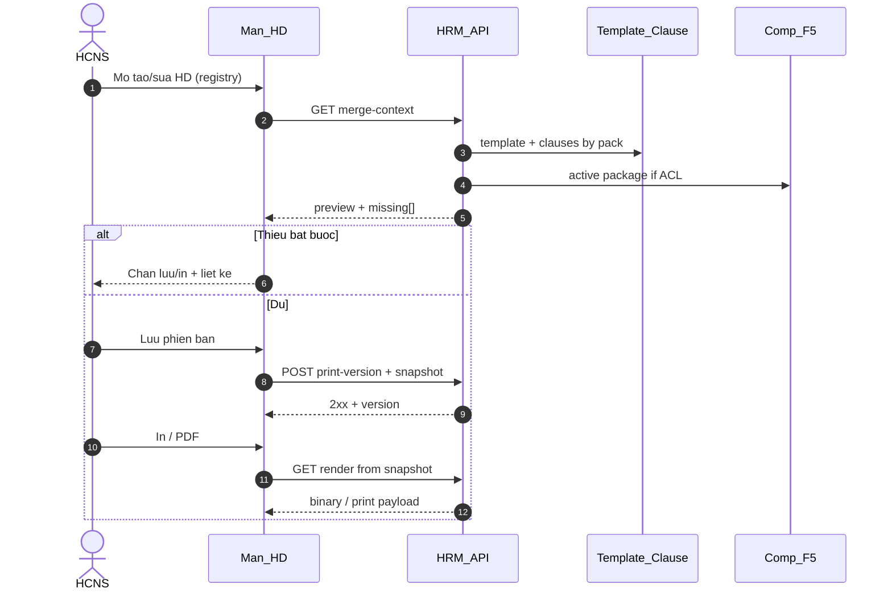

# PO-HRM-CONTRACT-LEGAL-PRINT-TECHSPEC-01 — TechSpec · HĐLĐ mẫu · điều khoản · gói nghề · in/PDF

| Field | Value |
|-------|--------|
| **work_item_id** | `PO-HRM-CONTRACT-LEGAL-PRINT-TECH-01` |
| **lane** | governance · sa |
| **change_mode** | ADD · **NO CODE** `apps/**` · **NO** wipe CORE-09 / F-CORE-CTR-01 stub |
| **Date** | 2026-08-06 |
| **Status** | **DRAFT TechSpec depth** — cascade **DB_DESIGN + API_DESIGN CONFIRMED** (`PO-HRM-CONTRACT-LEGAL-PRINT-DATA-01`); **cấm Dev** đến sponsor CONFIRM docs pack |
| **ref_srs** | [`SRS_HRM_ENTERPRISE.md`](../../client-delivery/hrm-enterprise-blueprint/SRS_HRM_ENTERPRISE.md) **v0.18** · **FR-UC-BP-CORE-09** · **09a** · **09b** · **09c** |
| **ref_spec** | [`PO-HRM-CONTRACT-LEGAL-PRINT-SPEC-01.md`](./PO-HRM-CONTRACT-LEGAL-PRINT-SPEC-01.md) §A–D |
| **ref_docs** | [`po-hrm-contract-legal-print-docs-01.md`](../../qa/evidence/po-hrm-contract-legal-print-docs-01.md) |
| **ref_db_asis** | [`DB_DESIGN_HRM_ENTERPRISE.md`](../../client-delivery/hrm-enterprise-blueprint/DB_DESIGN_HRM_ENTERPRISE.md) §3.4 `hrm_contract` |
| **ref_api_stub** | [`API_DESIGN_HRM_ENTERPRISE.md`](../../client-delivery/hrm-enterprise-blueprint/API_DESIGN_HRM_ENTERPRISE.md) **F-CORE-CTR-01** (shallow — deepen via family dưới) |
| **Client pointer** | [`TECHSPEC_HRM_ENTERPRISE.md`](../../client-delivery/hrm-enterprise-blueprint/TECHSPEC_HRM_ENTERPRISE.md) DOC-DELTA §5 / §10 — cite only |
| **Honesty** | `contracts_printable_ready=false` · `hrm_personnel_uat_ready=false` · U65 zero-seed · **không** claim printable UAT |
| **must_keep** | UF-HRM-02 / J-HRM-03 registry CRUD · BR-CD-F5-01 salary **off contract body** (merge C&B snapshot chỉ trên preview/print đủ quyền) · soft-delete · scope_parity |
| **ack_status** | **PASS_TO_PM** |

---

## 0. Context & objective

**Business intent:** Biến sổ đăng ký HĐ (CRUD registry) thành luồng **HĐLĐ dùng được**: thư viện điều khoản (Settings) · gói nghề · merge preview · lưu phiên bản snapshot · In/PDF — bám Đ.21 / TT10 (map SPEC §A), không paste full DOC mẫu công khai.

**Architecture truth (locked this wave):**

| Lock | Rule |
|------|------|
| Registry SoT | Physical AS-IS **`employee_contracts`** = alias logical **`hrm_contract`** — **must_keep** list/create/patch/F5 (UF-HRM-02) |
| Print spine | Template + keyword_map + clause library + pack resolve → preview → version snapshot → PDF/print |
| Salary / C&B | **BR-CD-F5-01:** `salary` trên body HĐ **deprecated/ignored**; lương trên preview = **read/merge** từ compensation package / C&B ring → **snapshot** vào phiên bản in khi ban hành — **không** SoT sống PAY |
| Pack codes | `GENERAL` · `IT_OFFICE` · `DRIVER` · optional `LOGISTICS` (GĐ1.5) |
| FE hardcode | **FORBIDDEN** body luật dài trên màn nghiệp vụ (BR-CTR-CL-03) |
| Dev gate | **DB_DESIGN delta confirm + API_DESIGN F.1 confirm** + sponsor CONFIRM docs trước `apps/**` |
| Honesty | `contracts_printable_ready=false` đến QA U65 browser AC-CTR-PRINT-* |

**AS-IS gap (Nest read-only 2026-08-06):**

| Surface | Finding |
|---------|---------|
| `POST/GET/PATCH/DELETE …/contracts-insurance/contracts` | Registry: code · type · dates · status · notes · position_key · signer_* · dept — **no** template · clause · pack · print · file generate |
| `employee_contracts` columns | No `pack_code`, `template_id`, `print_version`, `merged_snapshot_json`, parties legal full, term_type |
| Compensation | Separate F5 packages — **must_keep**; print merge reads active package when ACL allows |
| CORE-09 paper | Enterprise SRS v0.18 FR đủ; product print = **not implemented** |

---

## 1. Logical architecture — print/merge spine

```text
Settings (tenant/company scope)
  ├── hrm_contract_template   (keyword_map · layout_json · default pack)
  └── hrm_contract_clause     (body_vi · clause_group · apply_to_packs · version · mandatory)

Registry (must_keep)
  └── employee_contracts / hrm_contract   (CRUD UF-HRM-02)

Print/merge runtime
  1) Resolve pack (rule → user override)
  2) Load template active + clauses active for pack
  3) Merge keyword_map ← employee public + company + contract fields + C&B (ACL)
  4) Validate Đ.21 mandatory + mandatory clauses
  5) Preview DTO (masked C&B if no ACL)
  6) Persist print_version + snapshot (immutable for that version)
  7) Render PDF/print from snapshot (not live library mutate)
```



---

## 2. Entities (logical DB sketch — ba-data physicalizes)

> Sketch only. **ba-data** owns column/FK/index/alias map in `DB_DESIGN_HRM_ENTERPRISE.md`. Prefer ADD columns / child tables; **cấm** replace `employee_contracts` registry.

### 2.1 `hrm_contract_template` (ADD)

| Attribute | Type | Rule |
|-----------|------|------|
| `id` | uuid | PK |
| `company_id` | text | Scope (or group-publish later — OPEN-Q) |
| `code` | text | Unique per company; e.g. `HDLD_STANDARD` |
| `name_vi` | text | |
| `pack_code` | text | Default pack: `GENERAL`\|`IT_OFFICE`\|`DRIVER`\|`LOGISTICS` |
| `layout_json` | jsonb | Section order = clause_group sequence + print chrome |
| `keyword_map` | jsonb | `{{token}}` → source path (see §4) |
| `status` | text | `draft`\|`active`\|`retired` — only `active` in merge |
| `version` | int | Bump on body/layout change after issued use |
| `archived_at` | timestamptz | Soft-delete |

**UQ:** `(company_id, code)` WHERE `archived_at IS NULL` (ba-data chốt partial vs status).

### 2.2 `hrm_contract_clause` (ADD)

| Attribute | Type | Rule |
|-----------|------|------|
| `id` | uuid | PK |
| `company_id` | text | Scope |
| `code` | text | Stable code (version rows share code lineage) |
| `title_vi` | text | |
| `body_vi` | text | May contain `{{keyword}}` |
| `clause_group` | text | SPEC §B.3 (`JOB_DUTIES`, `PPE`, `NDA_TRADE_SECRET`, …) |
| `apply_to_packs` | text[] | Packs or `*` |
| `sort_order` | int | |
| `mandatory` | bool | Pack resolve gate |
| `status` | text | `draft`\|`active`\|`retired` |
| `version` | int | BR-CTR-CL-01 |
| `effective_from` | date | Optional |
| `archived_at` | timestamptz | Soft-delete |

### 2.3 `hrm_contract` / physical `employee_contracts` (EXPAND overlay)

| ADD (logical) | Purpose |
|---------------|---------|
| `pack_code` | Snapshot pack at latest print version (nullable until first print save) |
| `template_id` | Soft FK → template (nullable for registry-only rows) |
| `term_type` | `indefinite`\|`definite`\|`seasonal_other` |
| `work_location` / `work_location_scope` | Đ.21.c — AS-IS may lack; ADD |
| `job_description_text` | Depth by pack — not free-text position SoT (`position_key` remains catalog) |
| `probation_days` / `probation_end` | Optional |
| Driver pack fields | `license_class` · `vehicle_plate` · `route_or_region` (nullable; required when pack=DRIVER) |
| Employer signatory | Prefer company settings; may denorm `employer_signatory_*` on version |

**must_keep AS-IS:** `contract_code` · `contract_type` · `start_date`/`end_date` · `status` · `employee_id` · `company_id` · `position_key` · `notes` · soft delete pattern · G-CI-01 end_date by type · **salary ignored on write**.

### 2.4 `hrm_contract_print_version` (ADD — snapshot spine)

| Attribute | Type | Rule |
|-----------|------|------|
| `id` | uuid | PK |
| `contract_id` | uuid | Soft FK → `employee_contracts.id` |
| `company_id` | text | Scope parity |
| `version_no` | int | Monotonic per contract |
| `pack_code` | text | Frozen |
| `template_id` / `template_version` | | Frozen |
| `merged_fields_json` | jsonb | All Đ.21 merge fields **after** ACL apply at save (C&B included only if saver had ACL — see §5) |
| `clauses_snapshot_json` | jsonb | Ordered `{code, title_vi, body_vi, clause_group, clause_version}` |
| `compensation_snapshot_json` | jsonb | **Nullable** — salary/allowances at ban hành; **not** live PAY SoT |
| `status` | text | `draft_preview`\|`issued`\|`superseded` |
| `issued_at` | timestamptz | |
| `issued_by` | uuid/text | |
| `pdf_artifact_ref` | text | Optional storage key after render |
| `archived_at` | timestamptz | |

| **UQ** | `(contract_id, version_no)` |
| **Rule** | Amend / phụ lục → **new** version; never silent overwrite `issued` snapshot (BR-CTR-CL-01) |

### 2.5 Alias map (intent)

| Logical | Physical AS-IS prefer |
|---------|----------------------|
| `hrm_contract` | `public.employee_contracts` |
| `hrm_contract_template` | **ADD** `hrm_contract_templates` (or `employee_contract_templates`) |
| `hrm_contract_clause` | **ADD** `hrm_contract_clauses` |
| `hrm_contract_print_version` | **ADD** `hrm_contract_print_versions` |
| Compensation read | `compensation_packages` / active F5 — **reuse** · no dual-write |

---

## 3. Pack resolve

### 3.1 Codes (MVP)

| Pack | When | Notes |
|------|------|-------|
| `GENERAL` | Default / fallback | Core Đ.21 + mandatory common clauses |
| `IT_OFFICE` | IT / office / software | NDA · IP · IT equipment default on |
| `DRIVER` | Driver / transport | GPLX · vehicle · PPE thick · alcohol · liability |
| `LOGISTICS` | Optional GĐ1.5 | Subset DRIVER + warehouse — **not** required for GĐ1 exit |

### 3.2 Resolve algorithm (locked intent)

```text
1. Input: employee.position_key / job_family_key (catalog)
2. Lookup Settings rule: job_family → pack_code (tenant table — ba-data; may reuse JD pack pattern)
3. If no rule → pack = GENERAL
4. HCNS may override pack on draft before issue (SRS 09b #5)
5. On print-version save → freeze pack_code on version + denorm on contract row
6. Changing pack after issued → requires new version (not mutate old snapshot)
```

### 3.3 Mandatory clause gate (BR-CTR-CL-02)

For chosen `pack_code`, every clause with `mandatory=true` AND (`apply_to_packs` contains pack OR `*`) AND `status=active` must appear in resolved set. Missing → block save/print with `missing_clauses[]` `{code, title_vi}`.

### 3.4 Pack-specific field gates

| Pack | Extra required fields (validate on preview/save) |
|------|--------------------------------------------------|
| GENERAL / IT_OFFICE | Đ.21 core map SPEC §A (A1–K1 as configured) |
| DRIVER | + `license_class` · `vehicle_plate` (tenant may mark `route_or_region` required) |
| LOGISTICS | ba-data/tenant rules when enabled |

---

## 4. keyword_map

### 4.1 Shape

```json
{
  "{{employee_full_name}}": { "source": "employee.full_name", "ring": "public" },
  "{{base_salary_amount}}": { "source": "cb.active_package.base_salary", "ring": "cb" },
  "{{employer_legal_name}}": { "source": "company.legal_name", "ring": "company" },
  "{{job_title}}": { "source": "catalog.position_key.display", "ring": "public" }
}
```

| `ring` | Merge rule |
|--------|------------|
| `public` | Always fill when available |
| `company` | From operating unit / company master |
| `contract` | From contract draft fields |
| `cb` | Only if caller has C&B ACL; else token → masked placeholder / omit on preview |
| `clause` | Resolved at clause body render |

### 4.2 Canonical tokens (MVP subset — extend in API_DESIGN)

Align SPEC §A: `employer_legal_name`, `employer_address`, `employer_signatory_name`, `employer_signatory_title`, `employee_full_name`, `employee_dob`, `employee_gender`, `employee_residence_address`, `employee_id_number`, `job_title`, `job_description_text`, `work_location`, `effective_from`, `effective_to`, `term_type`, `probation_*`, `base_salary_amount`, `pay_method`, `pay_cycle`, `allowances_json`, driver tokens (`license_class`, `vehicle_plate`, …).

**Rule:** Unknown token in active template/clause → treat as validation warning or block per tenant policy (default GĐ1: **block issue** if token in mandatory section).

---

## 5. C&B field ACL on preview

| Rule | Behavior |
|------|----------|
| **BR-CD-F5-01** | Contract create/patch **ignores** `salary` on body — registry path unchanged |
| **AC-CTR-TPL-04 / AC-CTR-PRINT-07** | Preview response: if `!canViewCb` → omit or mask `base_salary_amount`, MST, bank, allowance amounts |
| Merge read | `GET compensation-packages/active?employee_id=` **reuse** — same scope_parity |
| Snapshot on issue | If issuer has ACL → persist `compensation_snapshot_json`; if not → **block issue** when compensation clause/fields mandatory **or** allow issue with empty comp block only if tenant policy says registry-only (default GĐ1: **block** when COMPENSATION clause mandatory) |
| PAY | Snapshot is **historical print**; payroll continues to read F5 packages / payslip SoT — **no** dual-write |

---

## 6. Capability map — F-CORE-CTR family

**Prefix physical (AS-IS prefer):** `/api/hrm/contracts-insurance`  
**Prefix logical (enterprise):** `/api/hrm/core`  
**Envelope:** `{ code, message, data }`  
**Scope:** list ↔ get ↔ mutate = `resolveHrmListScope` + `assertResourceInHrmScope` (U19).

| Cap | F-id | METHOD / path (physical prefer) | SRS bước |
|-----|------|----------------------------------|----------|
| List/create/patch/delete registry | **F-CORE-CTR-01** | AS-IS `…/contracts` CRUD | CORE-09 registry · **09b #1** · AC-CTR-PRINT-08 |
| List templates | **F-CORE-CTR-TPL-01** | `GET …/contract-templates` | **09** #1 · **09a** consume |
| Upsert / activate template | **F-CORE-CTR-TPL-02** | `POST/PATCH …/contract-templates` | **09** AC-CTR-TPL-01 |
| List clauses | **F-CORE-CTR-CL-01** | `GET …/contract-clauses` | **09a #1** |
| Create/update clause | **F-CORE-CTR-CL-02** | `POST/PATCH …/contract-clauses` | **09a #2** · **#5** |
| Activate clause (version bump) | **F-CORE-CTR-CL-03** | `POST …/contract-clauses/:id/activate` | **09a #3** |
| Retire clause | **F-CORE-CTR-CL-04** | `POST …/contract-clauses/:id/retire` | **09a #4** |
| Resolve pack suggestion | **F-CORE-CTR-PACK-01** | `GET …/contracts/pack-resolve?employee_id=` | **09b #1–#2** |
| Merge preview | **F-CORE-CTR-PREV-01** | `POST …/contracts/:id/preview` *(or draft body)* | **09b #2–#4** · **09** #2–#3 |
| Save print version | **F-CORE-CTR-VER-01** | `POST …/contracts/:id/print-versions` | **09c #1** · **#4** |
| List/get versions | **F-CORE-CTR-VER-02** | `GET …/contracts/:id/print-versions` | **09c #3** · AC-CTR-PRINT-04 |
| Render PDF/print | **F-CORE-CTR-PDF-01** | `GET …/print-versions/:versionId/pdf` | **09c #2** · AC-CTR-PRINT-05 |

**Overlay:** Deepen stub **F-CORE-CTR-01**; **không** wipe checklist path if later bound; checklist remains orthogonal (CORE-03).

---

## 7. API_DESIGN F.1 — FR-UC-BP-CORE-09a (clause library)

### 7.1 F-CORE-CTR-CL-01 — List clauses

| | |
|--|--|
| **Mục đích** | Trả thư viện điều khoản theo pháp nhân / nhóm để màn Cài đặt và resolve pack. |
| **Nghiệp vụ xử lý** | (1) Scope assert. (2) Filter `status`, `clause_group`, `pack`. (3) Exclude `archived_at`. (4) Empty `[]` = 200 (CTA tạo). |
| **Tham chiếu bước SRS** | **FR-UC-BP-CORE-09a** Diễn biến **#1** · AC-CTR-CL-01. |
| **Request** | Query: `company_id`, optional `status`, `clause_group`, `pack_code`. |
| **Response → DB** | `hrm_contract_clause.*` display-ready. |
| **Lỗi** | Scope 403/409 · 403 thiếu quyền cấu hình. |

### 7.2 F-CORE-CTR-CL-02 — Create / update clause

| | |
|--|--|
| **Mục đích** | Tạo/sửa điều khoản (nháp hoặc hiệu lực) đủ mã · tiêu đề · nội dung · gói. |
| **Nghiệp vụ xử lý** | Validate required fields; reject empty `body_vi`/`code`; soft-update draft; if updating **active** body that was issued → force version path via CL-03 (không overwrite im lặng). |
| **Tham chiếu bước SRS** | **09a #2** · **#5** · BR-CTR-CL-01. |
| **Request → DB** | `code`, `title_vi`, `body_vi`, `clause_group`, `apply_to_packs[]`, `sort_order`, `mandatory`, `status?`. |
| **Lỗi** | `HRM-CTR-CL-REQUIRED` · `HRM-CTR-CL-CODE-CONFLICT` · scope/auth. |

### 7.3 F-CORE-CTR-CL-03 — Activate (+ version bump)

| | |
|--|--|
| **Mục đích** | Đưa điều khoản sang hiệu lực; tăng `version` nếu đã từng ban hành / gắn HĐ. |
| **Nghiệp vụ xử lý** | (1) Gate quyền. (2) If prior active same `code` → retire or supersede per ba-data. (3) Set `status=active`; bump `version` when lineage had issued snapshot (BR-CTR-CL-01). (4) New actives appear in pack resolve. |
| **Tham chiếu bước SRS** | **09a #3** · AC-CTR-CL-01 · AC-CTR-CL-02. |
| **Lỗi** | `HRM-CTR-CL-CODE-CONFLICT` · `HRM-CTR-CL-REQUIRED`. |

### 7.4 F-CORE-CTR-CL-04 — Retire

| | |
|--|--|
| **Mục đích** | Ngừng dùng điều khoản; **không** đổi snapshot HĐ cũ. |
| **Nghiệp vụ xử lý** | Set `retired`; keep rows; print versions retain `clauses_snapshot_json`. |
| **Tham chiếu bước SRS** | **09a #4** · AC-CTR-CL-03. |
| **Lỗi** | 404 scope · 403. |

### 7.5 F-CORE-CTR-TPL-01 / TPL-02 — Templates (CORE-09 + 09a consume)

| | |
|--|--|
| **Mục đích** | CRUD/list mẫu HĐ + `keyword_map`/`layout_json`; 0 active → CTA only. |
| **Nghiệp vụ xử lý** | Only `active` templates selectable; BR-CTR-CL-04 / AC-CTR-TPL-01. |
| **Tham chiếu bước SRS** | **FR-UC-BP-CORE-09** Diễn biến **#1–#2** · AC-CTR-TPL-01..05. |

---

## 8. API_DESIGN F.1 — FR-UC-BP-CORE-09b (pack + preview)

### 8.1 F-CORE-CTR-01 — Registry CRUD (must_keep overlay)

| | |
|--|--|
| **Mục đích** | Giữ tạo/sửa/list/get/xóa mềm sổ đăng ký HĐ (mã · loại · NV · hiệu lực · trạng thái). |
| **Nghiệp vụ xử lý** | AS-IS behavior + optional new nullable fields (`pack_code`, `term_type`, …) **without** requiring print spine; **ignore salary** on write (F5); G-CI-01 end_date; scope_parity; overlap 409 per V-05. |
| **Tham chiếu bước SRS** | **09b #1** · AC-CTR-PRINT-08 · UF-HRM-02. |
| **Lỗi** | AS-IS `HRM-CON-*` + scope — **không** regress. |

### 8.2 F-CORE-CTR-PACK-01 — Pack resolve suggestion

| | |
|--|--|
| **Mục đích** | Gợi ý `pack_code` từ chức danh / họ nghề; HCNS vẫn đổi được. |
| **Nghiệp vụ xử lý** | Load employee `position_key` → rule table → default `GENERAL`; return `{ suggested_pack, allowed_packs[], reason }`. |
| **Tham chiếu bước SRS** | **09b #1–#2** · **#5**. |
| **Lỗi** | Employee 404 scope. |

### 8.3 F-CORE-CTR-PREV-01 — Merge preview

| | |
|--|--|
| **Mục đích** | Sinh bản xem trước văn bản HĐLĐ: bên A/B · công việc · thời hạn · điều khoản theo gói · khối lương theo ACL. |
| **Nghiệp vụ xử lý** | (1) Scope contract/employee. (2) Resolve template (explicit id or default for pack). (3) If 0 active template → `HRM-CTR-TPL-NONE` + CTA (AC-CTR-PRINT-01). (4) Resolve clauses for pack. (5) Merge keyword_map from employee/company/contract. (6) If ACL C&B → merge compensation; else mask. (7) Validate mandatory fields + mandatory clauses → `missing_fields[]` / `missing_clauses[]`. (8) Return `preview_html` or structured sections + `can_issue` bool. **Không** persist snapshot unless VER-01. |
| **Tham chiếu bước SRS** | **09b #2–#4** · **09** #2–#3 · AC-CTR-PRINT-02/03/06/07 · AC-CTR-TPL-02..04. |
| **Request** | `{ template_id?, pack_code, field_overrides? }` |
| **Response** | `{ pack_code, sections[], merged_fields, clauses[], missing_fields[], missing_clauses[], can_issue, cb_masked: boolean }` |
| **Lỗi** | `HRM-CTR-TPL-NONE` · `HRM-CTR-PACK-INVALID` · `HRM-CTR-DRIVER-REQUIRED` · scope. |

**Pack switch:** same endpoint with new `pack_code` → different clause set (AC-CTR-PRINT-03).

---

## 9. API_DESIGN F.1 — FR-UC-BP-CORE-09c (version + PDF)

### 9.1 F-CORE-CTR-VER-01 — Save print version

| | |
|--|--|
| **Mục đích** | Lưu phiên bản HĐ kèm ảnh chụp nội dung + gói + version điều khoản; cập nhật list/detail. |
| **Nghiệp vụ xử lý** | (1) Re-run preview validation server-side (không tin FE). (2) If `!can_issue` → 400 + missing lists (AC-CTR-PRINT-06). (3) INSERT print_version (`issued`); freeze snapshots. (4) Denorm `pack_code` / `template_id` on contract. (5) Prior issued → `superseded` if amend. (6) Return version display-ready for FE sau 2xx. |
| **Tham chiếu bước SRS** | **09c #1** · **#4** · AC-CTR-PRINT-04 · AC-CTR-TPL-01/05. |
| **Request → DB** | Same as preview inputs; server builds snapshots. |
| **Lỗi** | `HRM-CTR-ISSUE-BLOCKED` · `HRM-CTR-TPL-NONE` · scope. |

### 9.2 F-CORE-CTR-VER-02 — List/get versions (F5)

| | |
|--|--|
| **Mục đích** | Sau Lưu / F5: còn `version_no`, `pack_code`, snapshot metadata. |
| **Nghiệp vụ xử lý** | scope_parity get-by-id; C&B fields in snapshot respect read ACL (mask if needed). |
| **Tham chiếu bước SRS** | **09c #3** · AC-CTR-PRINT-04 · AC-CTR-TPL-05. |

### 9.3 F-CORE-CTR-PDF-01 — Render PDF / print

| | |
|--|--|
| **Mục đích** | Xuất bản in/PDF **khớp** snapshot phiên bản (không merge live library). |
| **Nghiệp vụ xử lý** | (1) Load issued version. (2) Render from `merged_fields_json` + `clauses_snapshot_json` + layout. (3) Optional store `pdf_artifact_ref`. (4) Block if version not issued / missing. |
| **Tham chiếu bước SRS** | **09c #2** · AC-CTR-PRINT-05. |
| **Lỗi** | `HRM-CTR-VERSION-NOT-ISSUED` · `HRM-CTR-RENDER-FAIL` · scope. |

**Note:** Upload `file_url` (if FE has) **≠** substitute for PDF-01 (SRS 09c).

---

## 10. Error taxonomy (deterministic)

| Code | HTTP | When |
|------|------|------|
| `HRM-CTR-TPL-NONE` | 400 | 0 active template; fake issue/print |
| `HRM-CTR-CL-REQUIRED` | 400 | Clause missing code/title/body |
| `HRM-CTR-CL-CODE-CONFLICT` | 409 | Active code conflict |
| `HRM-CTR-PACK-INVALID` | 400 | Unknown pack |
| `HRM-CTR-DRIVER-REQUIRED` | 400 | DRIVER missing license/plate |
| `HRM-CTR-ISSUE-BLOCKED` | 400 | missing_fields / missing_clauses |
| `HRM-CTR-VERSION-NOT-ISSUED` | 400 | PDF before issue |
| `HRM-CTR-CB-FORBIDDEN` | 403 | Attempt to read unmasked C&B without ACL |
| Scope | 403/409 | Parity failures |

Keep AS-IS `HRM-CON-*` / `HRM-AUTH-001` on registry path.

---

## 11. must_keep / forbidden

### must_keep

- UF-HRM-02 / J-HRM-03 CRUD list → create → edit → F5
- `contract_types` picker / catalog binding
- BR-CD-F5-01 salary off body; compensation packages F5
- Soft-delete; company scope ladder; list↔get parity
- CORE-09 AC-CTR-TPL-01..05 semantics
- Enterprise FR text v0.18 (no wipe)

### forbidden

- `apps/**` / `packages/**` this wave
- Seed to fabricate printable contracts (U65)
- Claim `contracts_printable_ready=true` / personnel UAT from TechSpec alone
- Paste copyrighted full DOC samples into client docs
- FE-hardcoded long legal bodies as SoT
- Dual-write PAY from print snapshot
- Silent overwrite of issued print versions

---

## 12. Option evaluation (pack storage)

| Option | Summary | Risk | Verdict |
|--------|---------|------|---------|
| **A** | Child tables template + clause + print_version; expand `employee_contracts` | Clear SoT; more migrations | **Recommend** |
| **B** | All print JSON on contract row only | Fast; weak versioning/library reuse | Reject for clause library |
| **C** | External DMS only | Weak merge/ACL | Reject GĐ1 |

**Recommend A** — aligns BR-CTR-CL-01 snapshot + Settings library.

---

## 13. OPEN-Q (do not invent)

| ID | Question | Owner |
|----|----------|-------|
| Q-CTR-01 | Group-level template publish vs per-company only? | **LOCKED 2026-08-07** — **Option A** in-HRM publish→pull→apply ([`ADR-HRM-CONTRACT-LIBRARY-GROUP-PUBLISH-20260807.md`](../../architecture/ADR-HRM-CONTRACT-LIBRARY-GROUP-PUBLISH-20260807.md) · [`PO-HRM-CONTRACT-LEGAL-PRINT-SA-02.md`](./PO-HRM-CONTRACT-LEGAL-PRINT-SA-02.md)); **physical CONFIRMED** [`PO-HRM-CONTRACT-LEGAL-PRINT-DATA-02.md`](./PO-HRM-CONTRACT-LEGAL-PRINT-DATA-02.md); next **dev-be**; **≠** printable UAT |
| Q-CTR-02 | PDF engine (server puppeteer vs client print CSS)? | SA + DevOps NFR |
| Q-CTR-03 | LOGISTICS in GĐ1 or GĐ1.5 only? | PM (SPEC = optional) |
| Q-CTR-04 | Employer signatory SoT on company master columns? | ba-data |
| Q-CTR-05 | Exact job_family→pack rule table reuse JD pack? | ba-data |

---

## 14. Dev unlock criteria

1. Sponsor CONFIRM docs (SRS v0.18 + this TechSpec).  
2. `PO-HRM-CONTRACT-LEGAL-PRINT-DATA-01` — DB_DESIGN columns/FK/index + alias map CONFIRMED.  
3. API_DESIGN F.1 physicalized for F-CORE-CTR-* (ba-data / sa API seat).  
4. Then BE → FE → QA U65; honesty stays **false** until QA+QC printable slice.

---

## 15. Honesty (team)

| Flag | Value |
|------|-------|
| `contracts_printable_ready` | **false** |
| `hrm_personnel_uat_ready` | **false** |
| UF-HRM-02 🟢 | Registry CRUD only — **≠** HĐLĐ printable |

---

## Completion contract

| Field | Value |
|-------|-------|
| completion_report | Closed: TechSpec ADD — entities template/clause/print_version · pack resolve · keyword_map · C&B ACL · F.1 map 09a/09b/09c · AS-IS gap · must_keep F5/UF-02 · honesty false. Residual: DATA-01 **CONFIRMED** (2026-08-06); Dev HOLD until sponsor CONFIRM. |
| next_owner | **pm** (sponsor CONFIRM) |
| ack_status | **PASS_TO_PM** |
| evidence_path | `docs/qa/evidence/po-hrm-contract-legal-print-tech-01.md` |
