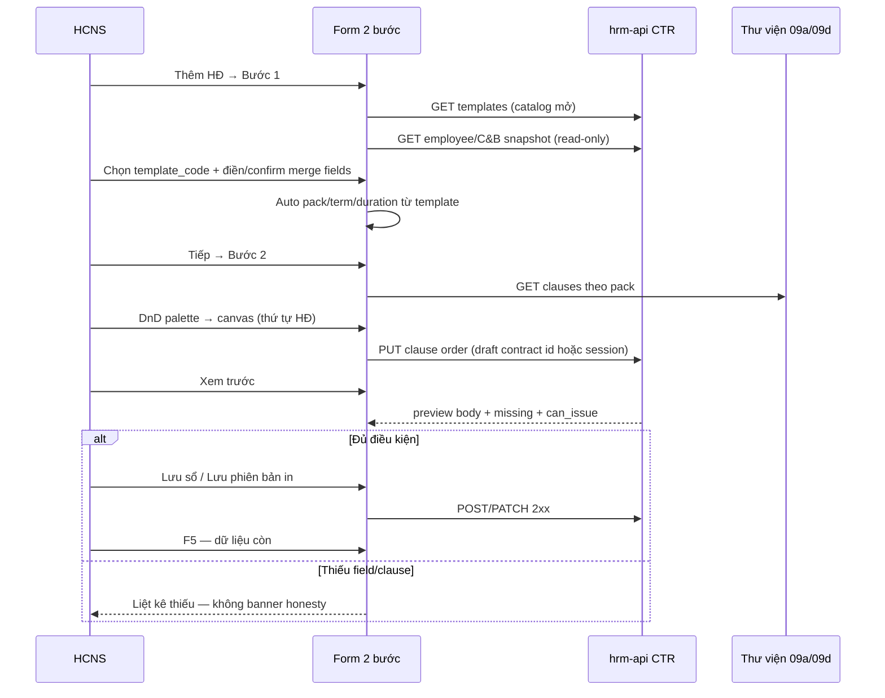

# BA pack — Tạo HĐLĐ redesign (Excel X.E × AMIS CTR × UX 2 bước)

| Meta | Value |
|------|--------|
| **work_item_id** | `PO-HRM-CTR-CREATE-REDESIGN-BA-01` |
| **parent** | `PO_HRM_CTR_CREATE_REDESIGN_SPONSOR_INTAKE.md` |
| **lane** | governance · ba-process |
| **date** | 2026-08-10 |
| **priority** | **P0** (sponsor — trước wave program khác) |
| **status** | **CONFIRMED** · O1–O15 · unlock **`PO-HRM-CTR-CREATE-REDESIGN-SA-01`** |
| **change_mode** | **ADD** — không đè UF-HRM-02 registry CRUD · không mở Q-CTR-01/02 CLOSED · không wipe print-spine GWC seals |
| **uc_ids** | `FR-UC-BP-CORE-09` · `09a` · `09b` · `09c` · `09d` · peer `FR-UC-BP-PLT-01` (catalog/schema/merge) |
| **ref_spec** | `PO-HRM-CONTRACT-LEGAL-PRINT-XEVN-TPL-SPEC-01.md` §2–§5 · `PO-HRM-CONTRACT-LEGAL-PRINT-XEVN-TEMPLATES-OUTLINE-01.md` |
| **ref_amis** | `docs/qa/evidence/po-hrm-amis-parity-ba-01.md` — CTR rows (mẫu mở · clause DnD **OK** principle) |
| **ref_srs** | `docs/client-delivery/hrm-enterprise-blueprint/SRS_HRM_ENTERPRISE.md` FR-UC-BP-CORE-09a/b/c/d |
| **honesty** | `contracts_printable_ready=false` · **cấm** claim printable / module CTR UAT · **C-SLICE-≠-MODULE** |
| **cấm** | `apps/**` · seed body HĐ · prompt echo client SRS · hardcode closed 8 `template_code` · honesty paragraphs on production UI |

---

## 0. Process objective & actors

### Mục tiêu

Khóa **luồng tạo/sửa HĐ** để HCNS:

1. Chọn **`template_code`** từ catalog mở (starter X.E + HR N+) và thấy **đủ trường merge** theo loại HĐ × khối (Excel §5).
2. Gán **thứ tự điều khoản** rõ ràng **trên luồng tạo** (palette + canvas DnD — cùng nghiệp vụ AMIS «mẫu → điều khoản → xem trước»).
3. Không còn **đoạn chú thích honesty/dev** trên màn khách (`AC-CTR-UX-01`).
4. Giữ **sổ đăng ký** UF-HRM-02: Lưu HĐ không bắt buộc mẫu in (`AC-CTR-XEVN-08`).

### Diễn viên

| Actor | Trách nhiệm |
|-------|-------------|
| HCNS / HRBP (scope) | Tạo/sửa HĐ · chọn mẫu · gán clause · xem trước · Lưu sổ / lưu phiên bản in (khi đủ điều kiện) |
| Hệ thống | Resolve `template_code` → pack · term · default ngày · merge employee/C&B/company · validate `can_issue` |
| Cài đặt (09a/09d) | Thư viện clause · catalog mẫu — SoT nội dung, không hardcode body trên form |

### Phạm vi

| In | Out |
|----|-----|
| IA form 2 bước + wireframe text · gap matrix · O1–O15 · J-HRM-CTR-CREATE-* DRAFT | Impl FE/BE |
| AC-CTR-UX-01 bỏ banner honesty user-facing | Claim `contracts_printable_ready=true` |
| BIND AC-CTR-XEVN-01..11 (giữ) trên luồng mới | DOCX upload default · clone UI AMIS |
| AMIS parity **nghiệp vụ** (không pixel) | Seed catalog/body |

---

## 1. AS-IS (scan prose — không sửa code)

### 1.1 `Contracts.tsx` — dialog tạo/sửa

- **Một dialog dài** (`max-w-*`): trường sổ đăng ký (NV, mã HĐ, loại catalog, ngày hiệu lực/hết hạn, trạng thái, ghi chú, file đính kèm, `work_location`) + **`ContractPrintSpinePanel`** cuối form.
- **Pack mặc định** khi mở tạo: `printPackCode = GENERAL` (không neo `template_code` X.E ngay bước đầu).
- **Honesty user-facing (cần gỡ):**
  - Banner list page: `data-testid="ctr-core09-registry-honesty"` — `core09HonestyBannerText()` + AC-CTR-XEVN-08 + «09a–d ADD ≠ CORE-09 DONE».
  - Trong dialog: `ctr-core09-registry-no-tpl-note` — giải thích registry vs mẫu in (có thể **rút gọn** thành hint 1 dòng tiếng Việt, **không** paragraph pipeline).
- **Grid:** chủ yếu `grid-cols-2` — **chưa** layout 12 cột theo ma trận merge theo `template_code`.
- **Lưu:** POST/PATCH gửi `pack_code`, `template_id`, `template_code` khi có — print overlay tách khỏi registry fields.

### 1.2 `ContractPrintSpinePanel.tsx` — print spine trong dialog

- Khối «Bản in / điều khoản HĐLĐ» — chọn **gói nghề + mẫu**; DnD **palette ↔ canvas** clause (`@hello-pangea/dnd`).
- **`libraryReady` gate:** palette/canvas chỉ đầy đủ sau load thư viện — dễ **ẩn** thao tác gán clause khi load chậm/lỗi.
- **Honesty user-facing (cần gỡ):** `ctr-print-honesty`, `ctr-core09-honesty` — `contracts_printable_ready=false`, CORE-09c residual, Nest `/core` = 0, v.v.
- **ZERO-TPL CTA** khi `templates.length === 0` — hợp lệ giữ (nghiệp vụ), nhưng **không** lẫn với honesty pipeline.
- Preview ephemeral; issue/PDF theo BE `can_issue` — **giữ** must_keep F5/C&B.

### 1.3 Gap tóm tắt sponsor (khớp intake)

| Kỳ vọng | AS-IS |
|---------|--------|
| Picker `template_code` XEVN_* + field theo mẫu | Pack GENERAL/IT_OFFICE/DRIVER; matrix **shallow** |
| Merge §5 VP/DRIVER trên form | Một phần qua preview/C&B; không layout theo loại HĐ |
| Clause DnD **trên tạo HĐ** | Có nhưng **lẫn** print spine + honesty; điều kiện `libraryReady` |
| AMIS: mẫu → clause → preview | Settings có DnD; **create dialog** chưa parity UX |

---

## 2. TO-BE — Luồng AMIS-aligned (nghiệp vụ)



**BR-CTR-CREATE-01:** Bước 2 **khóa** cho đến khi Bước 1 có `template_code` hợp lệ **hoặc** user chọn «Chỉ lưu sổ đăng ký» (skip print — AC-CTR-XEVN-08).

**BR-CTR-CREATE-02:** Đổi `template_code` ở Bước 1 → reset gợi ý clause canvas theo template default; user confirm nếu đã kéo clause (tránh mất thứ tự im lặng).

**BR-CTR-CREATE-03:** Cùng nghiệp vụ AMIS CTR row «Clause library + layout DnD» — thao tác gán **trên create**, không chỉ Settings.

---

## 3. Wireframe mô tả (text)

### 3.1 Khung chung

- **Vỏ:** Dialog rộng (`max-w-5xl` hoặc full-bleed embed) · `xevn-safe-inline` · **Stepper** 2 bước cố định header (cùng trục `h-10` với tiêu đề).
- **Footer:** `Quay lại` | `Tiếp` / `Lưu` — Bước 2 thêm `Xem trước` · `Lưu phiên bản in` (khi BE cho phép).

### 3.2 Bước 1 — «Thông tin hợp đồng & mẫu»

| Vùng | Bố cục (grid 12) | Nội dung |
|------|------------------|----------|
| A — Sổ đăng ký (must_keep UF-HRM-02) | col-span-12 · 2 hàng | NV (picker) · Mã HĐ · Loại HĐ (catalog) · Trạng thái |
| B — Mẫu in (09d) | col-span-12 | **Combobox catalog mở** `template_code` + nhãn `name_vi` · badge pack (IT_OFFICE/DRIVER) · **read-only** gợi ý `term_type` |
| C — Thời hạn | col-span-4 + col-span-4 + col-span-4 | `effective_from` · `effective_to` (ẩn/disable khi KXĐ) · nút «Áp dụng gợi ý từ mẫu» |
| D — Bên B / công việc (merge §5) | col-span-4 × 3 | Họ tên (read-only từ NV) · Chức danh (catalog) · **Nơi làm việc** · Đơn vị/pháp nhân (scope) |
| E — C&B (read-only) | col-span-12 card | Lương cơ bản · phụ cấp snapshot — **không** free-type (F5) |
| F — DRIVER block | col-span-12 (conditional) | Chỉ khi `pack_code=DRIVER`: GPLX số · hạng · ngày cấp · nơi cấp — required trước preview/issue |
| G — Link «Chỉ lưu sổ» | col-span-12 text link | Skip Bước 2 → Lưu registry only (08) |

**Không** hiển thị paragraph `core09HonestyBannerText` / `contracts_printable_ready` trên vùng A–G.

### 3.3 Bước 2 — «Điều khoản & xem trước»

| Vùng | Bố cục | Nội dung |
|------|--------|----------|
| Trái 4/12 — **Palette** | Danh sách scroll | Clause khả dụng theo `pack_code` + `template_code` (lọc active) · drag handle rõ · search |
| Phải 8/12 — **Canvas** | Danh sách ordered | Thứ tự điều khoản trên HĐ · drop zone trống có CTA «Kéo điều khoản từ danh sách trái» |
| Dưới full width — **Preview** | Panel | Render body display-ready từ BE · khối missing field/clause **danh sách bullet** (không honesty) |
| Actions | Footer | `Đồng bộ thứ tự` (PUT clauses) · `Xem trước` · `Lưu phiên bản` / `Tải PDF` khi `can_issue` |

**Tách visual** Bước 2 khỏi «Cài đặt in» — user hiểu đây là **gán điều khoản cho HĐ đang tạo**.

---

## 4. Gap matrix — Excel field × template_code × AMIS × AS-IS × TO-BE AC

> **Cột AMIS:** bước luồng HĐ trên AMIS HRM (principle từ parity evidence — không copy UI).

| Excel / merge field (§5) | `template_code` scope | AMIS step (CTR) | AS-IS UI | TO-BE AC |
|--------------------------|----------------------|-----------------|----------|----------|
| `employer_legal_name` · `employer_unit_label` | Tất cả XEVN_* | Chọn đơn vị → merge Bên A | Preview/BE; form không section Bên A | **O3** · **O4** — hiển thị read-only Bước 1; đổi đơn vị → re-merge (**AC-CTR-XEVN-07**) |
| `contract_number` | Tất cả | Nhập/sinh số HĐ | `contract_code` field có | **O3** — pattern gợi ý từ template/org (**BR-CTR-TPL-05**) |
| Bên B identity (tên, CCCD, DOB, phone) | Tất cả | Lấy từ hồ sơ NV | Tên NV; thiếu block CCCD/phone trên form | **O3** — card Bên B read-only đủ nhãn Đ.21 |
| `job_title` · `work_location` | Tất cả | Điều 1 | `work_location` có; title qua dept/job | **O3** — catalog title + `work_location` col-span-4 |
| `effective_from` / `effective_to` | `*_FT_*` · `*_PROBATION_*` | Thời hạn HĐ | Date pickers chung | **O5** — default 60d / +12 / +24 / KXĐ ẩn `effective_to` (**AC-CTR-XEVN-04..06**) |
| `base_salary_*` + phụ cấp | Tất cả | Merge C&B | Trong preview/C&B masked | **O10** — card C&B read-only Bước 1 (**BR-CD-F5-01**) |
| `driver_license_*` (4 field) | `*_DRIVER` only | Hồ sơ lái xe | Chủ yếu preview | **O11** — block GPLX Bước 1 + chặn preview (**AC-CTR-XEVN-09**) |
| Clause order | Per `pack_code` + template | DnD layout mẫu | DnD trong spine; ẩn khi !libraryReady | **O6** · **O7** — palette Bước 2 always visible after load |
| Open `template_code` N+1 | Catalog | Thêm mẫu Settings | API có; picker shallow | **O2** (**AC-CTR-XEVN-01/11**) |
| Chọn mẫu → preview khác VP/LX | `*_OFFICE` vs `*_DRIVER` | So sánh mẫu | Pack-level | **O4** (**AC-CTR-XEVN-02/03**) |
| Registry không bắt mẫu | — | (N/A) | Note dài + honesty | **O8** — link ngắn «Chỉ lưu sổ» (**AC-CTR-XEVN-08**) |
| Honesty / dev banners | — | (N/A) | List + dialog + spine | **O9** (**AC-CTR-UX-01**) |
| Lưu → F5 | Tất cả | Lưu HĐ | Có | **O13** (U65) |
| List → detail HĐ | Tất cả | Mở HĐ | Có view dialog | **O12** (**J-HRM-CTR-CREATE-06**) |

### 4.1 Ma trận `template_code` starter × field delta (tóm tắt)

| `template_code` | `effective_to` UI | GPLX block | Tiêu đề preview (logic) |
|-----------------|-------------------|------------|-------------------------|
| `XEVN_PROBATION_OFFICE` / `*_DRIVER` | Bắt buộc (TV) | DRIVER only | HỢP ĐỒNG THỬ VIỆC |
| `XEVN_FT_12M_*` | Bắt buộc · default +12m | DRIVER only | HĐLĐ XĐTH |
| `XEVN_FT_24M_*` | Bắt buộc · default +24m | DRIVER only | HĐLĐ XĐTH |
| `XEVN_INDEF_*` | Ẩn / không bắt buộc | DRIVER only | HĐLĐ KXĐTH |

---

## 5. Acceptance criteria O1–O15 (browser · U65)

> Mọi O: login HCNS scope hợp lệ → menu **Hợp đồng** → **Thêm hợp đồng** (hoặc sửa draft) · Network POST/PUT **2xx** · quan sát FE · **F5** · **zero-seed**. Probe alone ≠ 🟢.

| Mã | Đạt khi | Không đạt khi |
|----|---------|----------------|
| **O1** | Dialog tạo có **stepper 2 bước** tách «Thông tin & mẫu» / «Điều khoản & xem trước»; không scroll một khối dài lẫn registry + DnD | Một trang dài như AS-IS |
| **O2** | Bước 1: combobox `template_code` từ **GET catalog mở**; chọn `XEVN_FT_12M_OFFICE` → hiện badge pack IT_OFFICE; **không** list cứng 8 trên FE | Chỉ GENERAL/IT_OFFICE/DRIVER pack; hardcode 8 |
| **O3** | Sau chọn mẫu: grid hiển thị **nhóm field merge §5** (Bên B, thời hạn, đơn vị, mã HĐ) — label tiếng Việt | Chỉ field sổ tối thiểu; thiếu `work_location`/đơn vị |
| **O4** | Cùng NV: `XEVN_FT_12M_OFFICE` vs `XEVN_FT_12M_DRIVER` → Bước 1 có/không **khối GPLX**; preview Bước 2 khác clause DRIVER | VP ≡ LX |
| **O5** | `XEVN_FT_12M_*` vs `XEVN_FT_24M_*`: đổi `effective_from` → nút gợi ý set `effective_to` **12 vs 24** tháng; `XEVN_INDEF_*` không bắt ngày kết thúc | KXĐ bắt `effective_to`; 12T=24T |
| **O6** | Bước 2: palette trái + canvas phải; kéo clause **từ palette vào canvas** → thứ tự đổi; `PUT` clause order **2xx** | Không kéo được; chỉ Settings |
| **O7** | Luồng đủ 3 pha: chọn mẫu (1) → gán clause (2) → **Xem trước** thấy body | Preview không sau clause |
| **O8** | Link «Chỉ lưu sổ đăng ký»: Lưu **không** `template_code` → 2xx; F5 list có HĐ; **không** bắt mẫu | Bắt mẫu để Lưu registry |
| **O9** | **AC-CTR-UX-01:** Không còn element user-visible `ctr-core09-registry-honesty`, `ctr-print-honesty`, `ctr-core09-honesty` **paragraph**; không text `contracts_printable_ready=false` / «CORE-09 DONE» trên UI | Bất kỳ honesty paragraph trên màn HCNS |
| **O10** | Khối lương/phụ cấp **read-only**; không input free-type lương trên form | Nhập lương tay trên create |
| **O11** | `*_DRIVER` thiếu GPLX → Bước 2 «Xem trước»/Issue **chặn** + liệt kê field | Preview/issue thiếu GPLX |
| **O12** | Sau Lưu: list → **mở xem/sửa** HĐ → `template_code` + clause order **khớp** (cross-nav) | Mất template/clause sau navigate |
| **O13** | U65: mutate → 2xx → toast/list → **F5** → còn `template_code` + dates | Chỉ API pass |
| **O14** | Flag `contracts_printable_ready` chỉ QA/dev (`data-qa` hoặc env) — **không** render paragraph cho user | User thấy flag honesty |
| **O15** | **DENY** claim printable UAT / module CTR DONE trong evidence wave này; `contracts_printable_ready=false` giữ | QC/PM claim 🟢 printable module |

### 5.1 AC-CTR-UX-01 (sponsor lock — normative)

| Đạt khi | Không đạt khi |
|---------|----------------|
| Production UI (list Hợp đồng + dialog tạo/sửa + Bước 2) **không** hiển thị đoạn văn honesty/dev/pipeline (CORE-09 DONE, printable flag, Nest /core = 0, «09a–d ADD», v.v.) | Giữ `core09HonestyBannerText()` hoặc tương đương visible |
| Thông báo thiếu mẫu/clause/field = **bullet nghiệp vụ** tiếng Việt (thiếu GPLX, thiếu điều khoản X) | Thay bằng paragraph trạng thái program |
| Hint registry-vs-print ≤ **1 câu** (tuỳ chọn) hoặc icon help — **không** paragraph amber | `ctr-core09-registry-no-tpl-note` dài như AS-IS |

---

## 6. Journeys — `J-HRM-CTR-CREATE-*` (DRAFT)

**Honesty:** DRAFT paper — QA browser sau SA-01 + FE-01/BE-01. **must_keep:** J-HRM-CTR-04..07 · J-HRM-03 · UF-HRM-02.

| Journey | Click path (U65) | Pass khi (map O) |
|---------|------------------|------------------|
| **J-HRM-CTR-CREATE-01** | Login → Hợp đồng → Thêm → Bước 1 chọn `XEVN_FT_12M_OFFICE` + NV + ngày → Tiếp | O1–O3 · O5 |
| **J-HRM-CTR-CREATE-02** | Tiếp Bước 2 → kéo ≥2 clause palette→canvas → Đồng bộ → Xem trước | O6–O7 |
| **J-HRM-CTR-CREATE-03** | Bước 1 đổi `XEVN_PROBATION_OFFICE` vs `XEVN_FT_12M_OFFICE` → preview title/label khác | O5 · AC-CTR-XEVN-04 |
| **J-HRM-CTR-CREATE-04** | Cùng NV: `XEVN_FT_12M_DRIVER` — GPLX đủ → preview có GTĐB; thiếu GPLX → chặn | O4 · O11 · AC-CTR-XEVN-09 |
| **J-HRM-CTR-CREATE-05** | Thêm HĐ → «Chỉ lưu sổ» → Lưu không mẫu → F5 | O8 |
| **J-HRM-CTR-CREATE-06** | Sau CREATE-01 Lưu → list → mở sửa → Bước 1/2 khớp | O12 · L2.5 |
| **J-HRM-CTR-CREATE-07** | Settings có mẫu 9+ → create picker thấy → chọn → preview | O2 · J-HRM-CTR-07 |
| **J-HRM-CTR-CREATE-08** | Quét UI list+dialog: **không** honesty paragraph (snapshot) | O9 · AC-CTR-UX-01 |

---

## 7. Business rules (ADD)

| ID | Điều kiện | Hành động | Outcome |
|----|-----------|-----------|---------|
| **BR-CTR-CREATE-01** | User chọn «Chỉ lưu sổ» | Skip Bước 2; POST registry không `template_code` | HĐ tồn tại; print optional sau |
| **BR-CTR-CREATE-02** | `template_code` đổi sau khi canvas có clause | Confirm reset hoặc giữ custom order | Tránh mất thứ tự im lặng |
| **BR-CTR-CREATE-03** | `pack_code` lệch `template_code` | Chặn Lưu + message | BR-CTR-TPL resolve SPEC-01 |
| **BR-CTR-CREATE-04** | `term_type=indefinite` | Ẩn/không validate `effective_to` registry | BR-CTR-TPL-03 |
| **BR-CTR-UX-01** | Render UI khách | Cấm honesty paragraph | O9 |

---

## 8. Residuals & risks

| ID | Mô tả | Owner kế |
|----|--------|----------|
| **R-CTR-CREATE-IA** | Stepper vs embed CC narrow width | SA-01 |
| **R-CTR-CREATE-API** | Draft id trước PUT clauses khi create mới | SA-01 / BE-01 |
| **R-CTR-CREATE-FE** | Tách component từ `ContractPrintSpinePanel` | FE-01 |
| **R-CTR-CREATE-REG** | Regression J-HRM-CTR-04..07 | QA sau FE |
| **R-CTR-PRINT** | PDF fidelity / printable module | QC — **ngoài** slice này |

**Open (SA):** Probation SI mandatory clause — SPEC-01 §4.3 defer SA xác nhận GĐ1 (giữ nguyên).

---

## 9. Handoff — SA (`PO-HRM-CTR-CREATE-REDESIGN-SA-01`)

**read_first:** file này §3–§6 · TPL-SPEC §5 · Enterprise SRS 09b/09d.

**Deliverables SA:**

1. IA confirm 2-step + API sequence (create draft → bind clauses → preview).
2. Field manifest per `template_code` (FormSchema / merge registry) — BIND PLT-01.
3. API_DESIGN delta: endpoints clause order on draft create path.
4. `must_keep` / `forbidden_paths` cho FE-01/BE-01.

**DENY SA:** Claim printable UAT · closed enum 8 templates.

---

## 10. Handoff — Dev / QA (sau SA)

| Role | Entry | Exit |
|------|-------|------|
| **dev-fe** | SA-01 LOCKED | O1–O11 · O13–O14 UI; AC-CTR-UX-01 |
| **dev-be** | SA-01 LOCKED | Template resolve + clause PUT on create; display-ready preview |
| **qa** | READY_FOR_QA | J-HRM-CTR-CREATE-01..08 evidence U65 |
| **qc** | QA PASS | GWC slice — **không** module CTR UAT |

---

## 11. Completion contract

| Field | Value |
|-------|--------|
| **completion_report** | Đóng BA P0 create redesign: gap matrix Excel×template×AMIS×AS-IS×TO-BE; wireframe 2-step + clause DnD; O1–O15 + AC-CTR-UX-01; mint J-HRM-CTR-CREATE-01..08 DRAFT; residuals R-CTR-CREATE-*; **không** `apps/**` |
| **residual** | SA API/IA · FE split spine · printable module · probation SI SA confirm |
| **next_owner** | **sa** (`PO-HRM-CTR-CREATE-REDESIGN-SA-01`) |
| **ack_status** | **PASS_TO_PM** |
| **evidence_path** | `docs/program/specs/PO-HRM-CTR-CREATE-REDESIGN-BA-01.md` · `docs/qa/PILOT_BUSINESS_FLOW_BA_TRACE.md` §42 |
| **printable** | **false** · `contracts_printable_ready=false` |

### next_dispatch_prompt (copy-ready)

```text
work_item_id: PO-HRM-CTR-CREATE-REDESIGN-SA-01
role: sa
read_first:
  - docs/program/specs/PO-HRM-CTR-CREATE-REDESIGN-BA-01.md
  - docs/program/specs/PO-HRM-CONTRACT-LEGAL-PRINT-XEVN-TPL-SPEC-01.md §5
  - docs/client-delivery/hrm-enterprise-blueprint/SRS_HRM_ENTERPRISE.md FR-UC-BP-CORE-09b/09d
entry_criteria: BA-01 PASS_TO_PM; sponsor P0 create redesign LOCKED
exit_criteria: IA 2-step LOCKED; FormSchema/merge manifest per template_code; API_DESIGN delta clause-bind-on-create + preview; must_keep UF-HRM-02 + AC-CTR-XEVN-08 + AC-CTR-UX-01; unlock FE-01/BE-01 narrow paths
cấm: claim contracts_printable_ready; closed enum 8; apps/** in SA doc only
evidence_path: docs/program/specs/PO-HRM-CTR-CREATE-REDESIGN-SA-01.md
ack_status target: PASS_TO_PM → dev-fe PO-HRM-CTR-CREATE-REDESIGN-FE-01
```
