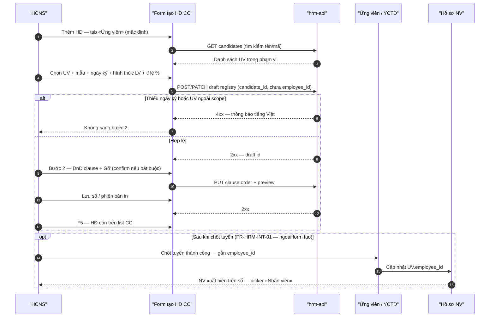
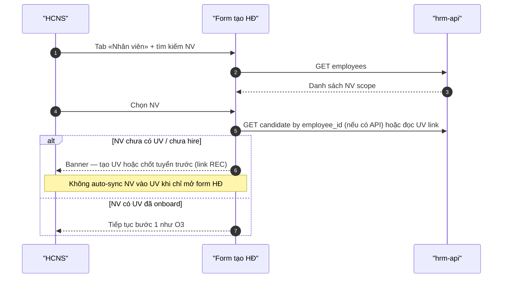

# BA pack — Tạo HĐLĐ redesign · BA-02 CONFIRM (sponsor Q1–Q12)

| Meta | Value |
|------|--------|
| **work_item_id** | `PO-HRM-CTR-CREATE-REDESIGN-BA-02` |
| **status** | **CONFIRMED** |
| **sponsor_confirm_date** | 2026-08-10 (chat — SoT `NEED-SPONSOR-QUESTIONS-CTR-CREATE-AUDIT.md` § Sponsor answers) |
| **parent** | `PO-HRM-CTR-CREATE-REDESIGN-BA-01.md` · `po-hrm-ctr-create-audit-ba-01.md` (G-01..G-18) |
| **lane** | governance · ba-process |
| **change_mode** | **ADD** — không wipe O1–O15 BA-01 trừ **AMEND** ghi rõ bảng §1 |
| **uc_ids** | `FR-UC-BP-CORE-09` · `09a` · `09b` · `09c` · peer `FR-HRM-RC-03` · `FR-HRM-INT-01` |
| **honesty** | `contracts_printable_ready=false` · **C-SLICE-≠-MODULE** · **cấm** claim printable / module CTR UAT |
| **no_prompt_echo** | true — delta SRS team path only |

---

## §0 Map sponsor Q# → quyết định

| Q# | Trả lời | Quyết định BA-02 |
|----|---------|------------------|
| Q1 | A | Overlay parent Command Center ~**90%** chiều rộng × ~**90vh** chiều cao (TECHSPEC §4.1 align SA Option A) |
| Q2 | Có | QA nghiệm thu DnD bước 2 **bắt buộc** URL `…/command-center/hrm/contracts` |
| Q3 | B | **Tên HĐ** read-only / auto từ mã HĐ + loại HĐ (catalog) |
| Q4 | Có | **Ngày ký** — date picker bắt buộc GĐ1 trước Lưu |
| Q5 | A | **Hình thức làm việc** (catalog) + **Tỉ lệ hưởng lương %** trên bước 1 GĐ1 |
| Q6 | Custom | Dropdown + **tìm kiếm**; tab/toggle **Ứng viên** vs **Nhân viên**; luồng tạo mới = **ứng viên**; chọn NV → trace REC→EMP (§5) |
| Q7 | Có | Nút **«Gỡ»** mỗi dòng canvas bước 2 |
| Q8 | Có | Confirm khi gỡ điều khoản **bắt buộc** theo mẫu |
| Q9 | C | Phụ cấp dạng «+ Thêm» = **GĐ2**; GĐ1 giữ **một card C&B read-only** (**O10**) |
| Q10 | Có | **Trích yếu** — textarea bước 1 GĐ1 |
| Q11 | B | Typography theo theme XeVN — **không** AC số cụ thể GĐ1 |
| Q12 | Có | Mẫu `XEVN_PROBATION_*` **bắt buộc** chọn được trên catalog active GĐ1 |

---

## §1 Delta so với BA-01 (RETAIN · AMEND · ADD)

| Mã BA-01 | Trạng thái BA-02 | Ghi chú |
|----------|------------------|---------|
| **O1–O2** | **RETAIN** | Stepper 2 bước · catalog mở `template_code` |
| **O3** | **AMEND** | Bổ sung field GĐ1: tên HĐ (Q3-B), ngày ký (Q4), hình thức LV + tỉ lệ % (Q5), trích yếu (Q10); **đối tượng** = ứng viên mặc định (Q6) |
| **O4–O7** | **RETAIN** | GPLX DRIVER · clause DnD · preview 3 pha |
| **O8** | **RETAIN** | «Chỉ lưu sổ» · AC-CTR-XEVN-08 |
| **O9** | **RETAIN** | AC-CTR-UX-01 — không honesty paragraph |
| **O10** | **RETAIN** | Card C&B read-only — **không** sub-grid phụ cấp «+ Thêm» (Q9-C) |
| **O11–O15** | **RETAIN** | DRIVER chặn · L2.5 · U65 · DENY module UAT |
| **Wireframe §3.1** | **AMEND** | `max-w-5xl` → **full CC viewport** (Q1-A); không AC px/vh số (Q11-B) |
| **NV picker** | **AMEND** | «NV (picker)» → **CatalogSearchPicker** + mode **Ứng viên | Nhân viên** (Q6) |
| **Bước 2** | **ADD** | Nút **Gỡ** + confirm bắt buộc (Q7–Q8) |
| **J-CREATE URL** | **AMEND** | Mọi journey mutate DnD/preview: URL CC (Q2) |

**DENY (giữ):** Claim `contracts_printable_ready=true` · module CTR UAT DONE · seed body HĐ trong evidence.

---

## §2 Wireframe delta (text)

### §2.1 Shell dialog (Q1-A · Q11-B)

- **Mount:** Radix portal **parent** Command Center (align TECHSPEC §4.1 · SA Option A) — overlay che sidebar/top chrome CC, không «màn con» trong bbox iframe.
- **Kích thước:** ~90% chiều rộng viewport × ~90vh chiều cao (ước lượng thị giác; QA đo bbox dialog so viewport — **không** AC font-size/px GĐ1).
- **Stepper** 2 bước header · footer `Quay lại` | `Tiếp` | `Lưu` | Bước 2: `Xem trước` · `Đồng bộ thứ tự`.

### §2.2 Bước 1 — field manifest GĐ1 (sau Q3–Q6 · Q9–Q10)

| Vùng | Field / control | Ghi chú AC |
|------|-----------------|------------|
| A — Đối tượng HĐ | Toggle/tab **Ứng viên** (mặc định) \| **Nhân viên** | Q6 |
| A | Combobox + **tìm kiếm** (tên/mã); **không** hiển thị UUID thô trên trigger | AC-CTR-SUBJECT-01 |
| A | Mã HĐ · Loại HĐ (catalog) · Trạng thái sổ | RETAIN UF-HRM-02 |
| A | **Tên HĐ** — read-only, sinh từ mã + loại | Q3-B · AC-CTR-FIELD-01 |
| A | **Ngày ký** — date picker **bắt buộc** | Q4 · AC-CTR-FIELD-02 |
| B — Thời hạn | `effective_from` / `effective_to` · gợi ý từ mẫu | O5 |
| C — Làm việc & lương | **Hình thức làm việc** (catalog) · **Tỉ lệ hưởng lương %** | Q5 · AC-CTR-FIELD-03 |
| D — Merge §5 | Bên B read-only · chức danh · `work_location` · đơn vị | O3 |
| E — C&B | **Một card** lương/phụ cấp **read-only** snapshot | O10 · Q9-C |
| F — DRIVER | GPLX block khi `*_DRIVER` | O11 |
| G — Trích yếu | Textarea **Trích yếu** (≠ ghi chú sổ tùy chọn) | Q10 · AC-CTR-FIELD-05 |
| H | Link «Chỉ lưu sổ đăng ký» | O8 |

**GĐ2 (out of slice):** Sub-grid phụ cấp «+ Thêm» kiểu AMIS.

### §2.3 Bước 2 — palette · canvas · Gỡ (Q7–Q8)

- Palette trái · canvas phải — RETAIN O6–O7.
- Mỗi dòng canvas: nút **«Gỡ»** (icon + nhãn) — AC-CTR-DND-01.
- Gỡ clause **bắt buộc** theo mẫu (`is_mandatory` / default layout): dialog confirm tiếng Việt trước khi xóa khỏi canvas — AC-CTR-DND-02.
- Preview panel: bullet thiếu field/clause — **không** honesty paragraph (AC-CTR-UX-01).

---

## §3 Business rules ADD (BR-CTR-CREATE-05+)

| ID | Điều kiện | Hành động | Outcome |
|----|-----------|-----------|---------|
| **BR-CTR-CREATE-05** | Q1-A portal parent | Create dialog mount parent CC + sync stylesheet embed | Overlay full CC; QA URL CC |
| **BR-CTR-CREATE-06** | `subject_type=candidate` (mặc định) | Bind `candidate_id` (+ optional `requisition_id`) trên draft/registry theo API SA | HĐ gắn ứng viên; `employee_id` null hoặc deferred |
| **BR-CTR-CREATE-07** | `subject_type=employee` | Chỉ cho NV đã có trong sổ scope; **không** auto-sync từ picker | NV phải tồn tại trước POST |
| **BR-CTR-CREATE-08** | NV chọn nhưng chưa có trace REC→EMP | Cảnh báo + link «Mở tuyển dụng» / chặn nếu policy GĐ1 | Không bịa `employee_id` từ UV |
| **BR-CTR-CREATE-09** | Thiếu **Ngày ký** | Chặn Tiếp/Lưu bước 1 | Validation FE + BE |
| **BR-CTR-CREATE-10** | User «Gỡ» mandatory clause | Confirm dialog | Tránh gỡ nhầm |
| **BR-CTR-CREATE-11** | `contract_code` + `contract_type` đổi | Cập nhật **Tên HĐ** read-only | Q3-B |
| **BR-CTR-UX-02** | QA matrix DnD | Evidence **chỉ** PASS khi URL CC + persona `ceo@xe.vn` | Q2 |

**RETAIN:** BR-CTR-CREATE-01..04 · BR-CTR-UX-01 (BA-01 §7).

---

## §4 Acceptance criteria — map Q# → AC-CTR-* (browser U65)

> **Chuẩn chung:** Login HCNS scope hợp lệ → menu **Hợp đồng** trên **Command Center** `…/command-center/hrm/contracts` (local `:5173` hoặc `:8088` theo env QA) · **zero-seed** · mutate → Network **2xx** · quan sát FE · **F5** · probe alone ≠ 🟢.

| AC ID | Q# | Đạt khi | Không đạt khi |
|-------|-----|---------|----------------|
| **AC-CTR-UX-01** | — | **RETAIN** BA-01 §5.1 — không honesty paragraph production UI | Visible `ctr-*-honesty` paragraph |
| **AC-CTR-UX-06** | Q1 | Mở «Thêm HĐ»: dialog bbox ≥ ~85% viewport width và ≥ ~85% viewport height; overlay che **sidebar CC** (screenshot) | Dialog ~66%×76% trong iframe (AUDIT-QA-01 FAIL pattern) |
| **AC-CTR-UX-07** | Q2 | J-HRM-CTR-CREATE-02 evidence ghi URL `command-center/hrm/contracts`; DnD bước 2 PASS trên CC | PASS chỉ `…/hr/contracts?portal=1` cho DnD slice |
| **AC-CTR-FIELD-01** | Q3 | Sau nhập/chọn mã HĐ + loại: **Tên HĐ** hiển thị read-only, đổi khi mã/loại đổi | Tên HĐ editable hoặc trống |
| **AC-CTR-FIELD-02** | Q4 | Không chọn Ngày ký → không Tiếp/Lưu; chọn `dd/MM/yyyy` → Tiếp được | Ngày ký optional hoặc epoch junk |
| **AC-CTR-FIELD-03** | Q5 | Bước 1 có catalog **Hình thức làm việc** + field **Tỉ lệ hưởng lương %** (0–100, không thousand group) | Thiếu một trong hai; free-text SoT |
| **AC-CTR-FIELD-04** | Q9 | Bước 1: **không** nút «+ Thêm» phụ cấp; một card C&B read-only | Sub-grid phụ cấp editable GĐ1 |
| **AC-CTR-FIELD-05** | Q10 | Textarea **Trích yếu** lưu qua POST/PATCH; F5 còn nội dung | Chỉ «Ghi chú» sổ; mất sau F5 |
| **AC-CTR-SUBJECT-01** | Q6 | Toggle **Ứng viên** (default) / **Nhân viên**; combobox có **ô tìm kiếm**; trigger hiển thị **tên + mã** | UUID trên trigger; không search |
| **AC-CTR-SUBJECT-02** | Q6 | Mode **Ứng viên**: chọn UV scope → Lưu registry 2xx; list/detail hiển thị liên kết UV (label) | POST bắt buộc `employee_id` khi chưa có NV |
| **AC-CTR-SUBJECT-03** | Q6 | Mode **Nhân viên**: chỉ NV có trong GET employees scope; nếu NV không có UV linked → banner hướng dẫn REC (không crash) | Auto tạo NV từ picker |
| **AC-CTR-DND-01** | Q7 | Bước 2: mỗi dòng canvas có «Gỡ»; bấm Gỡ → dòng biến khỏi canvas trước Lưu | Chỉ DnD ngược |
| **AC-CTR-DND-02** | Q8 | Gỡ clause mandatory → confirm; Hủy → giữ dòng; Đồng ý → gỡ | Gỡ im lặng mandatory |
| **AC-CTR-CATALOG-01** | Q12 | Picker active có ≥1 `XEVN_PROBATION_*`; chọn → Tiếp bước 2; preview title TV | Probation missing / HOLD catalog |
| **AC-CTR-UX-08** | Q11 | Dialog tuân token theme XeVN (contrast đọc được); **không** assert px/vh trong evidence GĐ1 | AC số font/scroll trong QA pack |

**Map O cũ (regression):** O1→UX-06+stepper · O2→CATALOG-01+O2 · O3→FIELD-01..05+SUBJECT-* · O6–O7→DND-01+UX-07 · O8–O15 unchanged.

---

## §5 Q6 spine — Candidate vs Employee SoT · sequence · gaps

### §5.1 Bảng SoT đối tượng HĐ (GĐ1)

| Khía cạnh | **Ứng viên** (luồng tạo HĐ mới — mặc định) | **Nhân viên** (gia hạn / NV đã có sổ) |
|-----------|---------------------------------------------|----------------------------------------|
| **Nguồn danh sách** | `GET /api/hrm/recruitment/candidates` (scope company) | `GET /api/hrm/employees` (scope) |
| **SoT bản ghi** | `recruitment_candidates` | `employees` |
| **Khóa trên HĐ (TO-BE)** | `candidate_id` (+ optional `requisition_id`) — **ADD** API/DB (SA/BE) | `employee_id` (must_keep registry) |
| **AS-IS DB `employee_contracts`** | Cột **`employee_id` NOT NULL** — **không** `candidate_id` | Đã bind `employee_id` |
| **Merge Bên B** | Snapshot từ UV (+ YCTD vị trí) cho preview | Snapshot từ hồ sơ NV |
| **REC→EMP** | Sau **FR-HRM-INT-01** / hire: `recruitment_candidates.employee_id` set (soft link — cite `recruitment.controller.ts` INT-01) | NV đã tồn tại; có thể có `employee_id` trên UV |
| **Workflow động** | Pipeline stage catalog (`rec_pipeline_stage`) + funnel bucket `onboard` — **không** thay thế BPMN hire đầy đủ GĐ1 | Không bắt workflow khi chỉ gia hạn HĐ |
| **AMIS/MISA học mô hình** | Cấu hình stage + quy trình duyệt tập trung (platform) — **GĐ2** cho CTR create auto-trigger | — |

### §5.2 Sequence — Tạo HĐ từ **ứng viên** (TO-BE GĐ1)



### §5.3 Sequence — Chọn **nhân viên** trên form (cảnh báo REC)



### §5.4 Gap table — impl vs sponsor Q6 (không invent code)

| Gap ID | Mô tả | Owner hint | Trigger |
|--------|--------|------------|---------|
| **G-CTR-SUBJ-01** | `employee_contracts.employee_id NOT NULL` — không lưu HĐ «chỉ UV» | **dev-be** + **ba-data** — nullable `employee_id` hoặc draft table + `candidate_id` | AC-CTR-SUBJECT-02 |
| **G-CTR-SUBJ-02** | FE AS-IS bind NV `employee_id` only (`Contracts.tsx` pattern) | **dev-fe** FE-03 | AC-CTR-SUBJECT-01 |
| **G-CTR-SUBJ-03** | Không auto «sync NV vào list khi tạo HĐ» — sponsor yêu cầu **kiểm tra** REC | **ba-process** closed in §5 · **sa** API contract | Q6 custom |
| **G-CTR-WF-01** | Workflow engine động (BPMN/inbox) **chưa** gắn bước «tạo HĐ» theo stage UV | **sa** — defer GĐ2; GĐ1 manual REC→INT-01→HĐ | Không claim inbox seed |
| **G-CTR-WF-02** | Platform dynamic config (`PO_HRM_DYNAMIC_CONFIG_PLATFORM_01`) — stage catalog có; **orchestration** hire ≠ CTR create | **sa** | REC pipeline only |
| **G-CTR-PORTAL-01** | Parent portal + DnD same-document (SA Option A residual) | **sa** + **dev-fe** | AC-CTR-UX-06/07 |

---

## §6 Journeys — J-HRM-CTR-CREATE refresh (CONFIRM criteria)

**Base URL (bắt buộc Q2):** `http://localhost:5173/command-center/hrm/contracts` (hoặc pilot `:8088/...` — **cùng path CC**). Persona: `ceo@xe.vn` / `Xevn@2026`. **U65** · **hdsd_align:** menu Command Center → Nhân sự → Hợp đồng.

| Journey | Click path | Pass when (BA-02) |
|---------|------------|-------------------|
| **J-HRM-CTR-CREATE-01** | Thêm → Bước 1: tab **Ứng viên** · search UV · `template_code` · ngày ký · hình thức LV · tỉ lệ % · trích yếu → Tiếp | AC-CTR-UX-06 · FIELD-02/03/05 · SUBJECT-01/02 · O1–O3 · O5 |
| **J-HRM-CTR-CREATE-02** | Bước 2 CC URL: DnD ≥2 clause · **Gỡ** 1 dòng · Gỡ mandatory có confirm · Đồng bộ · Xem trước | AC-CTR-UX-07 · DND-01/02 · O6–O7 |
| **J-HRM-CTR-CREATE-03** | `XEVN_PROBATION_*` vs `XEVN_FT_12M_*` — preview title khác | AC-CTR-CATALOG-01 · O5 |
| **J-HRM-CTR-CREATE-04** | DRIVER GPLX đủ/thiếu | O4 · O11 (RETAIN) |
| **J-HRM-CTR-CREATE-05** | «Chỉ lưu sổ» — không mẫu → F5 | O8 (RETAIN) |
| **J-HRM-CTR-CREATE-06** | List → sửa — template + clause khớp | O12 · L2.5 |
| **J-HRM-CTR-CREATE-07** | Catalog 9+ trên picker | O2 (RETAIN) |
| **J-HRM-CTR-CREATE-08** | UI scan — không honesty paragraph | AC-CTR-UX-01 |
| **J-HRM-CTR-CREATE-09** | Tab **Nhân viên** · chọn NV có/không UV link → banner hoặc tiếp tục | AC-CTR-SUBJECT-03 |

**Status:** CONFIRM paper — QA `QA-PO-HRM-CTR-CREATE-REDESIGN-03` sau FE-03.

---

## §7 SRS delta ADD-only (team — không gửi khách)

**File đích (team):** `docs/client-delivery/hrm-enterprise-blueprint/SRS_HRM_ENTERPRISE_team.md` (tạo ADD section nếu chưa có) · tham chiếu khách `SRS_HRM_KHACH.md` FR-HRM-INT-01 · FR-HRM-RC-03.

**FR-UC-BP-CORE-09a (tạo HĐ — ADD Diễn biến rows):**

| # | Tương tác | Điều kiện | Kết quả |
|---|-----------|-----------|---------|
| N1 | Mở dialog trên Command Center | Parent portal full viewport | Overlay che chrome CC |
| N2 | Chọn đối tượng | Mặc định ứng viên; tìm kiếm danh sách | Không UUID thô trên UI |
| N3 | Nhập ngày ký | Bắt buộc GĐ1 | Chặn Lưu nếu trống |
| N4 | Hình thức LV + tỉ lệ % | Catalog + số % | Gửi API display-ready |
| N5 | Tên HĐ | Tự sinh từ mã + loại | Read-only |
| N6 | Trích yếu | Textarea GĐ1 | Lưu registry |
| N7 | Bước 2 DnD | URL CC | PUT clause 2xx |
| N8 | Gỡ điều khoản | Mandatory | Confirm |
| N9 | Chọn NV thay UV | NV chưa REC | Cảnh báo — không auto-sync |

**Peer FR (đã có khách — không sửa bản gửi):** `FR-HRM-INT-01` (chốt tuyển → `employee_id`) · `FR-HRM-RC-03` (tạo UV).

---

## §8 Handoff & completion contract

| Role | Work item | Entry | Exit |
|------|-----------|-------|------|
| **sa** | `PO-HRM-CTR-CREATE-REDESIGN-SA-02` (hoặc delta SA-01) | BA-02 CONFIRM | Portal Option A LOCKED · API `candidate_id` on contract draft · DnD parent doc plan |
| **dev-fe** | `PO-HRM-CTR-CREATE-REDESIGN-FE-03` | SA portal + subject API hint | AC-CTR-UX-06/07 · FIELD-* · SUBJECT-* · DND-* |
| **dev-be** | BE slice subject | G-CTR-SUBJ-01 | POST accepts candidate path or waiver |
| **qa** | `QA-PO-HRM-CTR-CREATE-REDESIGN-03` | READY_FOR_QA | J-CREATE-01..09 U65 CC URL |

| Field | Value |
|-------|--------|
| **completion_report** | Publish CONFIRM: Q1–Q12 → AC-CTR-* · wireframe delta · BR-05..11 · Q6 spine + 2 sequenceDiagram · gap G-CTR-SUBJ/WF/PORTAL · J-CREATE refresh · SRS delta pointer ADD-only |
| **residual** | G-CTR-SUBJ-01 BE schema · G-CTR-WF-01 workflow GĐ2 · probation catalog data QA-01 HOLD until FE/BE |
| **next_owner** | **sa** (portal + API subject) **parallel** **dev-fe** FE-03 after SA portal lock |
| **ack_status** | **PASS_TO_PM** |
| **evidence_path** | `docs/program/specs/PO-HRM-CTR-CREATE-REDESIGN-BA-02.md` · `docs/qa/PILOT_BUSINESS_FLOW_BA_TRACE.md` §42 (updated) |
| **printable** | **false** |
| **pm_dispatch_hint** | Dispatch SA-02 portal+candidate contract API **and** FE-03 reconcile AUDIT-QA-01 matrix; then QA-03 CC URL mandatory |

### next_dispatch_prompt (sa)

```text
work_item_id: PO-HRM-CTR-CREATE-REDESIGN-SA-02
role: sa
read_first:
  - docs/program/specs/PO-HRM-CTR-CREATE-REDESIGN-BA-02.md §5–§7
  - docs/program/specs/PO-HRM-CTR-CREATE-AUDIT-SA-01.md Option A
  - docs/ecosystem/TECHSPEC.md §4.1
entry_criteria: BA-02 CONFIRM PASS_TO_PM; sponsor Q1-A + Q2 CC URL locked
exit_criteria: LOCK parent portal create dialog + DnD same-document strategy (Option A conditions §3.4); API_DESIGN delta candidate_id on contract create/draft + signing_date + work_form + salary_ratio_percent + abstract fields; must_keep employee_id registry UF-HRM-02; gap G-CTR-SUBJ-01 resolution path; unlock FE-03
cấm: apps/**; claim contracts_printable_ready
evidence_path: docs/program/specs/PO-HRM-CTR-CREATE-REDESIGN-SA-02.md
ack_status: PASS_TO_PM
```

### next_dispatch_prompt (dev-fe)

```text
work_item_id: PO-HRM-CTR-CREATE-REDESIGN-FE-03
role: dev-fe
read_first:
  - docs/program/specs/PO-HRM-CTR-CREATE-REDESIGN-BA-02.md §2–§4
  - docs/qa/evidence/po-hrm-ctr-create-audit-qa-01.md (CTRAUDITQA1-MSMQ0L96)
  - docs/program/specs/PO-HRM-CTR-CREATE-AUDIT-SA-01.md (after SA-02 LOCK)
entry_criteria: SA-02 portal geometry LOCKED (or PM hotfix P0 with bus); BA-02 CONFIRM
exit_criteria: AC-CTR-UX-06/07 PASS retest matrix; FIELD-01..05; SUBJECT-01..03 UI; DND-01/02; AC-CTR-UX-01 retain; READY_FOR_QA J-CREATE-01..09 paths
cấm: honesty paragraphs; seed; PASS only /hr portal URL for DnD
evidence_path: docs/qa/evidence/po-hrm-ctr-create-redesign-fe-03.md
ack_status: READY_FOR_QA
```

### next_dispatch_prompt (qa)

```text
work_item_id: QA-PO-HRM-CTR-CREATE-REDESIGN-03
role: qa
read_first:
  - docs/program/specs/PO-HRM-CTR-CREATE-REDESIGN-BA-02.md §4 §6
  - docs/qa/PILOT_BUSINESS_FLOW_BA_TRACE.md §42
entry_criteria: dev-fe FE-03 READY_FOR_QA; L0 PASS
exit_criteria: Browser U65 all AC-CTR-* mapped; URL command-center/hrm/contracts mandatory for J-CREATE-02; evidence blocks per qa-fe-outside-browser-gate; contracts_printable_ready=false; ack PASS_TO_PM or FAIL with defect ids
evidence_path: docs/qa/evidence/po-hrm-ctr-create-redesign-qa-03.md
ack_status: PASS_TO_PM
```
