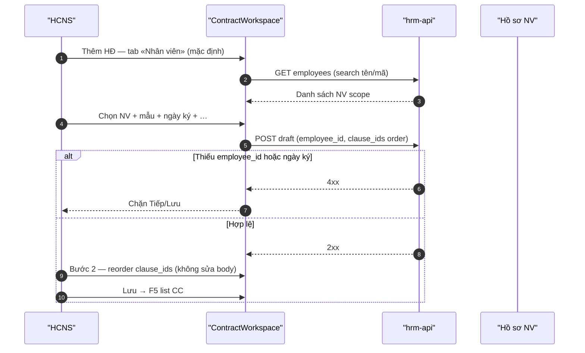
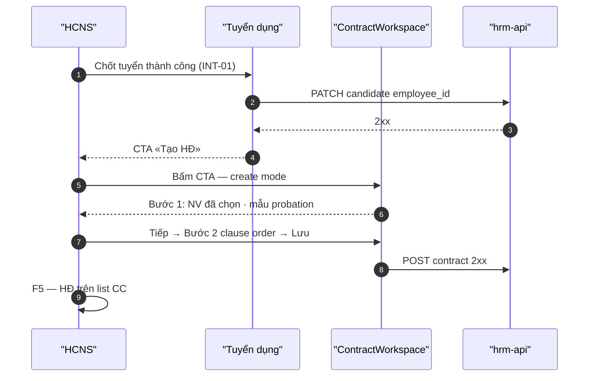

# BA pack — ContractWorkspace NV-first · view parity · REC hire CTA

| Meta | Value |
|------|--------|
| **work_item_id** | `PO-HRM-CTR-WORKSPACE-WAVE-G1` |
| **artifact_id** | `PO-HRM-CTR-WORKSPACE-NV-FIRST-BA-03` |
| **status** | **CONFIRM-ready** |
| **sponsor_confirm_date** | 2026-08-11 (chat — chốt lộ trình G1 parallel wave) |
| **parent** | `PO-HRM-CTR-CREATE-REDESIGN-BA-02.md` · `PO-HRM-CTR-CREATE-REDESIGN-BA-01.md` |
| **lane** | governance · ba-process |
| **change_mode** | **AMEND** BA-02 §Q6 · ADD ContractWorkspace · ADD view/hire AC — **không wipe** BA-01/02 RETAIN rows |
| **uc_ids** | `FR-UC-BP-CORE-09` · `09a` · `09b` · peer `FR-HRM-INT-01` · `FR-HRM-RC-07` |
| **read_first** | `PO-HRM-E2E-LINK-EMP-SPEC-01.md` · `PO-HRM-REC-E2E-LINKAGE-SPEC-01.md` · `PO-HRM-CONTRACT-LEGAL-PRINT-UNICOM-OUTLINE-01.md` |
| **honesty** | `contracts_printable_ready=false` · **C-SLICE-≠-MODULE** · **cấm** claim module CTR UAT DONE |
| **no_prompt_echo** | true — delta team path only |

---

## §0 Map sponsor G1 → quyết định BA-03

| # | Trả lời sponsor 2026-08-11 | Quyết định BA-03 |
|---|---------------------------|------------------|
| G1-1 | NV-first | Tab/mode **Nhân viên** mặc định; khóa mang `employee_id` bắt buộc trên luồng chính |
| G1-2 | UV optional | Tab **Ứng viên** chỉ khi **offer trước hire** (chưa có `employee_id`); không thay NV-first |
| G1-3 | REC → HĐ | Sau chốt tuyển (INT-01): CTA **«Tạo HĐ»** prefill `employee_id` + mẫu `XEVN_PROBATION_*` |
| G1-4 | View parity | Chi tiết HĐ = **cùng shell 2 bước** ContractWorkspace; canvas read-only + **In/PDF**; **cấm** registry-only view |
| G1-5 | Clause SoT | Nội dung điều khoản chỉ sửa tại **Settings → Điều khoản**; create/edit HĐ = chọn + sắp xếp `clause_ids` |
| G1-6 | Parallel wave | RETAIN BA-02 Q1–Q5, Q7–Q12, O1–O15, AC-CTR-UX/DND/FIELD/CATALOG trừ hàng **AMEND** §1 |

---

## §1 Delta so với BA-02 (RETAIN · AMEND · ADD)

| Mã BA-02 | Trạng thái BA-03 | Ghi chú |
|----------|------------------|---------|
| **O1–O2** | **RETAIN** | Stepper 2 bước · catalog `template_code` |
| **O3** | **AMEND** | Subject default **NV** (G1-1); UV tab G1-2; giữ field GĐ1 Q3–Q5, Q10 |
| **O4–O7** | **RETAIN** | GPLX · DnD · Gỡ · preview 3 pha |
| **O8–O15** | **RETAIN** | Registry-only save · UX honesty · DRIVER · L2.5 · U65 |
| **Q6 BA-02** | **AMEND** | Đảo default UV→**NV**; UV = offer pre-hire only |
| **BR-CTR-CREATE-06..08** | **AMEND** | Đảo logic subject — xem §4 |
| **AC-CTR-SUBJECT-01..03** | **AMEND** | NV default · UV optional — xem §6 |
| **View / Eye dialog** | **ADD** | ContractWorkspace mode `view` \| `edit` \| `create` — §2 |
| **REC hire CTA** | **ADD** | `AC-CTR-HIRE-CTA-*` · `J-HRM-CTR-HIRE-CTA-01` — §5 |
| **Clause body inline** | **ADD** | `BR-CTR-WS-04` — cấm sửa `body_vi` trên workspace |
| **J-CREATE-01, 09** | **AMEND** | NV-first paths — §8 |

**DENY (giữ):** `contracts_printable_ready=true` · module CTR UAT DONE · seed body · wipe BA-01/02 RETAIN.

---

## §2 ContractWorkspace — shell thống nhất (TO-BE)

### §2.1 Mục tiêu

Một surface **`ContractWorkspace`** (dialog full viewport CC — RETAIN Q1-A) phục vụ:

| Mode | Mở từ | Bước 1 | Bước 2 |
|------|--------|--------|--------|
| **create** | List HĐ «Thêm» · REC CTA «Tạo HĐ» · Profile NV «Thêm HĐ» | Form nhập — editable | Palette + canvas DnD — editable |
| **edit** | List «Sửa» · J-HRM-CTR-CREATE-06 | Form — editable (RETAIN O12) | Canvas DnD — editable |
| **view** | List «Eye» · deep link `contract_id` | Form — **read-only** | Canvas — **read-only** + toolbar **In** · **PDF** (preview/issue theo BE `can_issue`) |

**Cấm AS-IS:** Eye mở dialog registry-only (chỉ grid field sổ) không có bước 2 canvas + In/PDF.

### §2.2 Wireframe text (delta BA-02 §2)

```text
┌─ ContractWorkspace (parent CC ~90%×90vh) ─────────────────────────┐
│ [Bước 1: Thông tin HĐ] [Bước 2: Điều khoản]     (stepper header) │
├──────────────────────────────────────────────────────────────────┤
│ Bước 1: Đối tượng [NV default | UV optional] · mã/loại/ngày ký…  │
│ Bước 2: Palette (trái) | Canvas clause_ids (phải)              │
│         create/edit: DnD + Gỡ (RETAIN Q7–Q8)                     │
│         view: read-only rows + preview panel + [In] [PDF]        │
├──────────────────────────────────────────────────────────────────┤
│ Quay lại | Tiếp | Lưu (create/edit) | Đóng (view)                │
└──────────────────────────────────────────────────────────────────┘
```

**UI screen spec:** `docs/hrm/ui-screens/UI-CTR-WORKSPACE.md`

### §2.3 Clause body SoT (G1-5)

| Layer | SoT nội dung `body_vi` | Hành vi workspace |
|-------|-------------------------|-------------------|
| **Settings** | `UI-SETTINGS-CTR-CLAUSES` — CRUD + activate/retire | Duy nhất nơi sửa full text điều khoản |
| **Template composer** | `UI-SETTINGS-CTR-TEMPLATE-COMPOSER` — chọn + order `clause_ids` | Không sửa body inline trên canvas |
| **ContractWorkspace** | Snapshot `clause_ids[]` + order từ template/default + user reorder | **Chỉ** select/reorder/gỡ; preview merge từ Settings snapshot |

---

## §3 Subject SoT — NV-first · UV offer pre-hire (AMEND Q6)

### §3.1 Bảng đối tượng (thay BA-02 §5.1)

| Khía cạnh | **Nhân viên** (mặc định — luồng chính) | **Ứng viên** (optional — offer trước hire) |
|-----------|----------------------------------------|------------------------------------------|
| **Khi dùng** | Gia hạn · NV đã hire · REC CTA sau INT-01 | UV đã offer, **chưa** có `employee_id` |
| **Nguồn danh sách** | `GET /api/hrm/employees` (scope) | `GET /api/hrm/recruitment/candidates` (scope) |
| **Khóa trên HĐ** | `employee_id` **bắt buộc** | `candidate_id` (+ optional `requisition_id`); `employee_id` null |
| **Tab default** | **Nhân viên** (G1-1) | Chỉ khi user chuyển tab hoặc deep-link `?subject=candidate` |
| **Sau hire** | Luôn dùng NV path | Không tạo HĐ mới trên tab UV cho UV đã có `employee_id` — redirect NV |

### §3.2 Sequence — NV-first create (TO-BE)



### §3.3 Sequence — UV offer pre-hire (optional)

```mermaid
sequenceDiagram
  autonumber
  participant HCNS as "HCNS"
  participant WS as "ContractWorkspace"
  participant API as "hrm-api"

  HCNS->>WS: Tab «Ứng viên» (optional)
  WS->>API: GET candidates (chưa employee_id)
  alt UV đã có employee_id (đã hire)
    WS-->>HCNS: Banner — dùng tab Nhân viên; không Lưu UV path
  else UV chưa hire
    HCNS->>WS: Chọn UV + mẫu offer/probation
    WS->>API: POST (candidate_id, employee_id null)
    Note over WS,API: Sau INT-01 hire → HĐ mới qua NV + REC CTA
  end
```

---

## §4 Business rules — workspace + subject (ADD · AMEND)

| ID | Điều kiện | Hành động | Outcome |
|----|-----------|-----------|---------|
| **BR-CTR-WS-01** | Mở Eye / detail bất kỳ `contract_id` | Mount **ContractWorkspace** mode `view` — 2 bước | Không registry-only dialog |
| **BR-CTR-WS-02** | mode `view` | Bước 1–2 read-only; hiện **In** · **PDF** khi BE `can_issue` | Preview/issue theo print spine RETAIN |
| **BR-CTR-WS-03** | mode `create` \| `edit` | Bước 2 chỉ mutate `clause_ids` order + gỡ; **không** PATCH `body_vi` | SoT Settings |
| **BR-CTR-WS-04** | User cố sửa body trên canvas | Ẩn editor / chặn — CTA «Sửa tại Cài đặt» | Tránh fork nội dung |
| **BR-CTR-WS-05** | List → Sửa | Cùng workspace mode `edit` — không form riêng | Parity create |
| **BR-CTR-CREATE-06** | **AMEND** | `subject_type=employee` **mặc định**; POST bắt `employee_id` luồng chính | G1-1 |
| **BR-CTR-CREATE-07** | **AMEND** | `subject_type=candidate` chỉ khi UV **chưa** `employee_id` | G1-2 offer pre-hire |
| **BR-CTR-CREATE-08** | **RETAIN** | NV chưa trace REC khi cần UV context → banner link REC | Không bịa id |
| **BR-CTR-HIRE-01** | REC INT-01 success · `employee_id` set | Hiện CTA **«Tạo HĐ»** trên UV detail / hire dialog | G1-3 |
| **BR-CTR-HIRE-02** | Bấm CTA «Tạo HĐ» | Open workspace `create` prefill `employee_id` + `template_code` = active `XEVN_PROBATION_*` nếu có | Probation default |
| **BR-CTR-HIRE-03** | Không có mẫu probation active | CTA vẫn mở workspace; step1 CTA Settings mẫu (RETAIN ZERO-TPL) | Không seed |

**RETAIN:** BR-CTR-CREATE-01..05, 09..11, BR-CTR-UX-01..02 (BA-02 §3).

---

## §5 REC hire → CTA «Tạo HĐ» (G1-3)

### §5.1 Vị trí CTA

| Surface | Actor | Điều kiện hiện CTA |
|---------|-------|---------------------|
| Recruitment — UV detail sau **Chốt tuyển** (FR-HRM-INT-01) | HCNS | `employee_id` mới set · 2xx |
| Recruitment — Hire success toast/dialog | HCNS | Cùng phiên hire |
| Profile NV (tuỳ chọn GĐ1) | HCNS | Link «Thêm HĐ» preselect — RETAIN EMP spine |

### §5.2 Prefill contract

| Field | Nguồn prefill |
|-------|----------------|
| `employee_id` | Từ hire / UV.`employee_id` |
| `template_code` | Active catalog `XEVN_PROBATION_*` đầu tiên scope; user đổi được |
| `company_id` | Scope token / NV |
| Bước 2 `clause_ids` | Default layout từ template đã chọn |

### §5.3 Sequence — REC hire CTA



---

## §6 Acceptance criteria (browser U65)

> **Chuẩn chung (RETAIN BA-02):** Login HCNS → CC `…/command-center/hrm/contracts` · zero-seed · mutate → 2xx · FE quan sát · **F5** · probe alone ≠ 🟢.

### §6.1 AMEND — AC-CTR-SUBJECT-* (NV-first)

| AC ID | Đạt khi | Không đạt khi |
|-------|---------|----------------|
| **AC-CTR-SUBJECT-01** | Mở «Thêm HĐ»: tab **Nhân viên** active mặc định; combobox search tên+mã; có tab **Ứng viên** optional | UV default như BA-02 cũ; UUID trên trigger |
| **AC-CTR-SUBJECT-02** | Mode **Nhân viên**: chọn NV scope → Lưu 2xx; list/detail label NV | POST bắt candidate khi đã chọn NV |
| **AC-CTR-SUBJECT-03** | Mode **Ứng viên**: chỉ UV **chưa** `employee_id`; UV đã hire → banner chuyển NV | Lưu UV đã có employee_id |
| **AC-CTR-SUBJECT-04** | **ADD** Deep-link profile NV «Thêm HĐ» → NV preselected; không auto firstEmp | Prefill NV đầu list (D11 EMP spec) |

### §6.2 ADD — AC-CTR-VIEW-* (view parity)

| AC ID | Đạt khi | Không đạt khi |
|-------|---------|----------------|
| **AC-CTR-VIEW-01** | List → **Eye**: mở **ContractWorkspace** 2 bước; stepper hiện | Dialog chỉ grid registry |
| **AC-CTR-VIEW-02** | Bước 1 view: mọi field read-only; không input editable | Field sửa được ở view |
| **AC-CTR-VIEW-03** | Bước 2 view: canvas hiện đủ clause đã lưu; **không** drag handle | Thiếu bước 2; empty không giải thích |
| **AC-CTR-VIEW-04** | View: nút **In** và/hoặc **PDF** khi `can_issue`; preview merge đúng NV | Không có In/PDF; registry-only |
| **AC-CTR-VIEW-05** | View → Đóng → List; F5 detail vẫn mở đúng `contract_id` | 404 scope; mất clause order |

### §6.3 ADD — AC-CTR-HIRE-CTA-*

| AC ID | Đạt khi | Không đạt khi |
|-------|---------|----------------|
| **AC-CTR-HIRE-CTA-01** | Sau hire INT-01 từ FE: thấy CTA **«Tạo HĐ»** trên UV detail | Không CTA; seed hire |
| **AC-CTR-HIRE-CTA-02** | Bấm CTA → workspace create; **employee_id** khớp NV vừa hire; tab NV | Trống employee; tab UV |
| **AC-CTR-HIRE-CTA-03** | Prefill `XEVN_PROBATION_*` active nếu catalog có; user đổi mẫu → Tiếp bước 2 OK | Bắt buộc probation khi catalog trống mà không CTA Settings |
| **AC-CTR-HIRE-CTA-04** | Hoàn tất Lưu → list CC có HĐ; F5; J-HRM-01 link NV | Chỉ API PASS |

### §6.4 ADD — AC-CTR-WS-CLAUSE-*

| AC ID | Đạt khi | Không đạt khi |
|-------|---------|----------------|
| **AC-CTR-WS-CLAUSE-01** | Bước 2 create/edit: **không** có textarea sửa `body_vi` trên canvas | Inline body editor trên HĐ |
| **AC-CTR-WS-CLAUSE-02** | Gỡ / reorder → Lưu → view mode hiện đúng thứ tự | Order lệch sau F5 |
| **AC-CTR-WS-CLAUSE-03** | Sửa body tại Settings → HĐ **mới** tạo sau đó lấy snapshot mới; HĐ cũ giữ snapshot cũ (issued policy RETAIN) | Im lặng đổi body HĐ đã lưu |

**RETAIN regression:** AC-CTR-UX-01, 06, 07 · FIELD-01..05 · DND-01/02 · CATALOG-01 · AC-CTR-XEVN-08 (BA-02 §4).

---

## §7 Journeys — J-HRM-CTR-* (refresh G1)

**Base URL (RETAIN Q2):** `…/command-center/hrm/contracts` · persona `ceo@xe.vn` · **U65**.

| Journey | Click path | Pass when (BA-03) |
|---------|------------|-------------------|
| **J-HRM-CTR-CREATE-01** | **AMEND** Thêm → tab **NV** (default) search · mẫu · ngày ký · … → Tiếp | AC-CTR-SUBJECT-01/02 · FIELD-* · UX-06 |
| **J-HRM-CTR-CREATE-02** | **RETAIN** Bước 2 CC DnD · Gỡ · Xem trước | AC-CTR-UX-07 · DND-* |
| **J-HRM-CTR-CREATE-03..08** | **RETAIN** BA-02 §6 | — |
| **J-HRM-CTR-CREATE-09** | **AMEND** Tab **Ứng viên** optional — UV pre-hire only | AC-CTR-SUBJECT-03 |
| **J-HRM-CTR-CREATE-10** | **ADD** Tab UV → chọn UV chưa hire → Lưu → F5 | AC-CTR-SUBJECT-03 · offer path |
| **J-HRM-CTR-VIEW-01** | **ADD** List → Eye → 2 bước read-only | AC-CTR-VIEW-01/02 |
| **J-HRM-CTR-VIEW-02** | **ADD** Bước 2 view canvas + In/PDF | AC-CTR-VIEW-03/04 |
| **J-HRM-CTR-VIEW-03** | **ADD** View → đóng → Sửa cùng workspace edit | BR-CTR-WS-05 · O12 |
| **J-HRM-CTR-HIRE-CTA-01** | **ADD** REC hire → CTA → create probation → Lưu → F5 | AC-CTR-HIRE-CTA-* · HTP bước 5 pointer |
| **J-HRM-CTR-04..07** | **RETAIN** paper journeys (template/preview) | must_keep BA trace §24 |

**Map E2E spine:** `PO-HRM-E2E-LINK-EMP-SPEC-01` D7 HTP bước 5 — `J-HRM-CTR-HIRE-CTA-01` là AC browser cho «sau hire có HĐ».

---

## §8 Gap table (impl — không invent)

| Gap ID | Mô tả | Owner | Trigger |
|--------|--------|-------|---------|
| **G-CTR-WS-01** | Eye AS-IS = registry dialog không 2 bước | **dev-fe** | AC-CTR-VIEW-01 |
| **G-CTR-WS-02** | Chưa có component ContractWorkspace unified | **dev-fe** + **sa** | UI-CTR-WORKSPACE |
| **G-CTR-WS-03** | REC hire dialog thiếu CTA «Tạo HĐ» | **dev-fe** REC + CTR | AC-CTR-HIRE-CTA-01 |
| **G-CTR-SUBJ-01** | **RETAIN** `employee_id NOT NULL` chặn UV-only path | **dev-be** | AC-CTR-SUBJECT-03 |
| **G-CTR-SUBJ-04** | **ADD** Default tab vẫn UV trong code BA-02 | **dev-fe** | AC-CTR-SUBJECT-01 |
| **G-CTR-INLINE-BODY** | Canvas cho sửa body | **dev-fe** remove | AC-CTR-WS-CLAUSE-01 |

---

## §9 SRS delta ADD-only (team)

**FR-UC-BP-CORE-09a — ADD Diễn biến:**

| # | Tương tác | Kết quả |
|---|-----------|---------|
| W1 | Xem chi tiết HĐ (Eye) | ContractWorkspace 2 bước read-only + In/PDF |
| W2 | Tạo HĐ mặc định | Tab NV · `employee_id` bắt buộc |
| W3 | Offer pre-hire | Tab UV optional · `candidate_id` khi chưa hire |
| W4 | Sau chốt tuyển | CTA Tạo HĐ · prefill NV + probation template |
| W5 | Điều khoản trên HĐ | Chỉ order `clause_ids` — body SoT Settings |

**Peer:** FR-HRM-INT-01 · FR-HRM-RC-07 (hire) — không sửa bản khách.

---

## §10 Handoff & completion contract

| Role | Work item | Entry | Exit |
|------|-----------|-------|------|
| **sa** | `PO-HRM-CTR-WORKSPACE-SA-01` | BA-03 CONFIRM | ContractWorkspace IA LOCK · API view+clause_ids · REC CTA deep-link contract |
| **dev-fe** | `PO-HRM-CTR-WORKSPACE-FE-01` | SA lock | Workspace component · NV default · view parity · REC CTA · READY_FOR_QA |
| **dev-be** | BE slice G-CTR-SUBJ-01 + hire prefill API | SA API delta | candidate path + employee_id nullable policy |
| **qa** | `QA-PO-HRM-CTR-WORKSPACE-G1-01` | FE READY | J-CREATE/VIEW/HIRE-CTA U65 CC URL |

| Field | Value |
|-------|--------|
| **completion_report** | BA-03 CONFIRM-ready: AMEND Q6 NV-first · UV offer pre-hire · ContractWorkspace unified shell · AC-CTR-VIEW/HIRE-CTA/WS-CLAUSE · BR-CTR-WS + AMEND subject BR · J-* refresh · gap G-CTR-WS · UI-CTR-WORKSPACE stub · honesty false |
| **residual** | G-CTR-SUBJ-01 BE · printable module HOLD · G-CTR-WF-01 defer GĐ2 |
| **next_owner** | **sa** parallel **dev-fe** after SA portal/workspace LOCK |
| **ack_status** | **PASS_TO_PM** |
| **evidence_path** | `docs/program/specs/PO-HRM-CTR-WORKSPACE-NV-FIRST-BA-03.md` · `docs/hrm/ui-screens/UI-CTR-WORKSPACE.md` · `docs/qa/PILOT_BUSINESS_FLOW_BA_TRACE.md` §42 (delta) |

### next_dispatch_prompt (sa)

```text
work_item_id: PO-HRM-CTR-WORKSPACE-SA-01
role: sa
lane: governance
read_first:
  - docs/program/specs/PO-HRM-CTR-WORKSPACE-NV-FIRST-BA-03.md §2–§8
  - docs/program/specs/PO-HRM-CTR-CREATE-REDESIGN-SA-02.md
  - docs/hrm/ui-screens/UI-CTR-WORKSPACE.md
entry_criteria: BA-03 CONFIRM PASS_TO_PM; sponsor G1 NV-first + view parity locked
exit_criteria: LOCK ContractWorkspace modes create|edit|view; API_DESIGN delta clause_ids-only mutate on contract; GET contract detail returns layout for view shell; REC hire CTA route/query contract create prefill; must_keep print spine can_issue; gap G-CTR-SUBJ-01 resolution; unlock FE-01
cấm: apps/**; claim contracts_printable_ready; registry-only view as PASS
evidence_path: docs/program/specs/PO-HRM-CTR-WORKSPACE-SA-01.md
ack_status: PASS_TO_PM
```

### next_dispatch_prompt (dev-fe)

```text
work_item_id: PO-HRM-CTR-WORKSPACE-FE-01
role: dev-fe
lane: execution
read_first:
  - docs/program/specs/PO-HRM-CTR-WORKSPACE-NV-FIRST-BA-03.md §2 §6 §7
  - docs/hrm/ui-screens/UI-CTR-WORKSPACE.md
  - docs/program/specs/PO-HRM-CTR-CREATE-REDESIGN-BA-02.md (RETAIN UX/DND/FIELD)
  - docs/program/specs/PO-HRM-CTR-WORKSPACE-SA-01.md (after LOCK)
entry_criteria: SA-01 workspace+API LOCKED; BA-03 CONFIRM
exit_criteria: ContractWorkspace component replaces create+eye dialogs; NV tab default; UV optional pre-hire; Eye=2-step read-only+In/PDF; REC hire CTA prefill employee_id+probation template; no inline body_vi on canvas; AC-CTR-VIEW-* + HIRE-CTA-* + amended SUBJECT-*; RETAIN AC-CTR-UX-06/07 DND; READY_FOR_QA J-HRM-CTR-CREATE/VIEW/HIRE-CTA
cấm: honesty paragraphs; seed; registry-only view; UV default tab
allowed_paths: apps/web/**/contracts/** · recruitment hire CTA touch only
evidence_path: docs/qa/evidence/po-hrm-ctr-workspace-fe-01.md
ack_status: READY_FOR_QA
```
