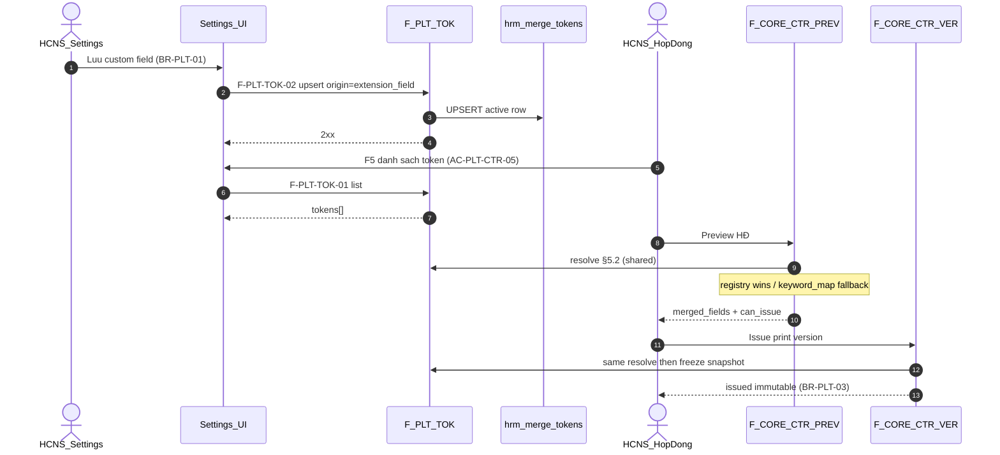

# PO-HRM-DYNAMIC-CONFIG-PLATFORM-API-01 — API_DESIGN F.1 · F-PLT-TOK-01..03

| Field | Value |
|-------|--------|
| **work_item_id** | `PO-HRM-DYNAMIC-CONFIG-PLATFORM-API-01` |
| **Parent** | `PO-HRM-DYNAMIC-CONFIG-PLATFORM-01` |
| **lane** | governance · sa |
| **change_mode** | **ADD** F-PLT-TOK · **EXPAND** CTR PREV/VER merge call · **NO CODE** `apps/**` · **no seed** · **no wipe** print-spine / DATA-01/02 / XEVN-TPL / UF-HRM-02 |
| **Date** | 2026-08-07 |
| **Status** | **CONFIRMED** — sponsor Option **B** · DATA-01 CONFIRMED · TechSpec §6 · ADR L1–L7 |
| **ref_data** | [`PO-HRM-DYNAMIC-CONFIG-PLATFORM-DATA-01.md`](./PO-HRM-DYNAMIC-CONFIG-PLATFORM-DATA-01.md) §3 `hrm_merge_tokens` · **§5.2 resolve order** · §7 DTO hints |
| **ref_tech** | [`PO-HRM-DYNAMIC-CONFIG-PLATFORM-TECHSPEC-01.md`](./PO-HRM-DYNAMIC-CONFIG-PLATFORM-TECHSPEC-01.md) §1.1C · §3.5 · §6 F-PLT-TOK · error taxonomy |
| **ref_adr** | [`ADR-HRM-DYNAMIC-CONFIG-PLATFORM`](../../architecture/ADR-HRM-DYNAMIC-CONFIG-PLATFORM.md) Option B · **L1–L7** |
| **ref_ba** | [`PO-HRM-DYNAMIC-CONFIG-PLATFORM-BA-01.md`](./PO-HRM-DYNAMIC-CONFIG-PLATFORM-BA-01.md) **BR-PLT-01** · **AC-PLT-CTR-05** · BR-PLT-03/04/05 |
| **ref_spine** | [`DATA-01`](./PO-HRM-CONTRACT-LEGAL-PRINT-DATA-01.md) §5.9–5.12 PREV/VER/PDF · [`XEVN-TPL-API-01`](./PO-HRM-CONTRACT-LEGAL-PRINT-XEVN-TPL-API-01.md) CORR open catalog |
| **Honesty** | `contracts_printable_ready=false` · no module `*_uat_ready` flip · no Phase1 DONE · U65 |
| **must_keep** | UF-HRM-02 · print-spine GWC · soft-delete · XBOS legal-body · U65 · DYNAMIC-LOCK / CORR (no reject 9th) · Q-CTR-01/02 CLOSED · BR-CD-F5-01 |
| **ack_status** | **PASS_TO_PM** |

---

## 0. Objective & locks

Deepen **API_DESIGN F.1** for platform **MergeToken** registry (`IMergeToken`) onto physical Nest prefix **`/api/hrm/merge-tokens`**, and **EXPAND** CTR print-spine **PREV/VER** to call the same resolve order — **không** redesign PDF / library paths.

| Lock | Rule |
|------|------|
| **Paths TOK** | **ADD** `/api/hrm/merge-tokens` (closes DATA residual **R-PLT-DATA-01**) — cross-domain registry, **not** nested only under contracts-insurance |
| **Paths CTR** | **Preserve** `/api/hrm/contracts-insurance` PREV/VER/PDF METHOD/path — **deepen merge step only** |
| **Resolve** | **DATA §5.2** deterministic order — registry **wins** over `keyword_map`; empty registry → keyword_map fallback (print-spine operable) |
| **Open catalog** | **CORR / DYNAMIC-LOCK / BR-PLT-05:** **FORBIDDEN** API reject 9th template as closed enum; `HRM-PLT-CAT-CODE-INVALID` / `HRM-CTR-TPL-CODE-INVALID` = **format/slug only** |
| **Syntax GĐ1** | `{{token_key}}` only (Q-PLT-01) — reject dual `#x#` on resolve/persist policy |
| **Soft-delete** | `archived_at` only — **no** hard-delete |
| **Scope** | list ↔ get-by-id ↔ mutate = `resolveHrmListScope` + `assertResourceInHrmScope` (**U19**) |
| **Honesty** | Docs ≠ UAT flip · printable remains **false** |

**Envelope:** `{ code, message, data }`  
**Auth:** same HRM JWT / membership as contracts-insurance peers.

---

## 1. Capability map

| Cap | F-id | METHOD / path (physical — locked) | BA / AC |
|-----|------|-----------------------------------|--------|
| List / get tokens | **F-PLT-TOK-01** | `GET /api/hrm/merge-tokens` · `GET …/merge-tokens/:tokenId` | AC-PLT-CTR-05 (picker after F5) · BR-PLT-04 |
| Upsert / register | **F-PLT-TOK-02** | `POST /api/hrm/merge-tokens` · `PUT /api/hrm/merge-tokens` (upsert by key) · `PATCH …/:tokenId` · `POST …/:tokenId/retire` | **BR-PLT-01** · AC-PLT-CTR-05 |
| Resolve preview | **F-PLT-TOK-03** | `POST /api/hrm/merge-tokens/resolve-preview` | AC-PLT-CTR-05 · BR-PLT-01 · VAL-PLT-TOK-* |
| CTR merge preview | **F-CORE-CTR-PREV-01** | `POST …/contracts-insurance/contracts/:id/preview` | **EXPAND** step merge → §5.2 · must_keep spine |
| CTR issue version | **F-CORE-CTR-VER-01** | `POST …/contracts/:id/print-versions` | Freeze `merged_fields_json` from same resolve · **BR-PLT-03** |
| CTR PDF | **F-CORE-CTR-PDF-01** | `GET …/print-versions/:versionId/pdf` | Snapshot only — **no redesign** |
| CTR open TPL | **F-CORE-CTR-TPL-01/02** | XEVN-TPL-API CORR | **cấm** reject 9th · AC-PLT-CTR-01 |



---

## 2. Resolve contract (cite DATA §5.2 — shared by TOK-03 + PREV + VER)

> **Single resolver** (Nest helper after ensureSchema). PREV/VER **must** call this — **cấm** second ad-hoc keyword-only merge after registry ships.

```text
1) If print version issued (context=issued) → use merged_fields_json (immutable) — stop
2) Else if hrm_merge_tokens has active row for (company_id, token_key) AND archived_at IS NULL
     → registry wins (source_path + ring) — VAL-PLT-TOK-01
3) Else if template.keyword_map has "{{token_key}}" or token_key
     → keyword_map (normalize braces) — VAL-PLT-TOK-02 / VAL-PLT-TOK-03
4) Else builtin defaults (ensure / service constants) 
5) Else missing → warn / add missing_fields / HRM-PLT-TOKEN-UNKNOWN when policy requires
```

| Rule | Behavior |
|------|----------|
| **VAL-PLT-TOK-01** | Same key in registry **and** keyword_map → **registry wins** |
| **VAL-PLT-TOK-02** | Registry empty / no row → **fallback keyword_map** — print-spine still 2xx path |
| **VAL-PLT-TOK-03** | keyword_map keys with `{{x}}` → normalize `token_key=x` |
| **VAL-PLT-TOK-04** | Dual `#x#` in same template GĐ1 → **REJECT** persist/resolve (`HRM-PLT-SCHEMA-INVALID` / VAL path) |
| **VAL-PLT-TOK-05** | Ring `cb` without ACL → mask / omit (BR-CD-F5-01 class) |
| **Empty registry** | **Feature-safe:** PREV/VER operable on keyword_map alone (ADR §8.2 rollback) |

---

## 3. API_DESIGN F.1 — F-PLT-TOK-*

### 3.1 F-PLT-TOK-01 — List / get merge tokens

| | |
|--|--|
| **METHOD / path** | `GET /api/hrm/merge-tokens` · `GET /api/hrm/merge-tokens/:tokenId` |
| **Mục đích** | Trả danh sách merge token (picker Settings / clause authoring / admin) — display-ready `labelVi` + `tokenKey` — để sau Lưu custom field (BR-PLT-01) user F5 thấy token mới (**AC-PLT-CTR-05**). |
| **Nghiệp vụ xử lý** | (1) `resolveHrmListScope` + required `company_id` (query). (2) Exclude `archived_at IS NOT NULL` unless `include_archived=true` (admin only). (3) Optional filters: `domain`, `status` (`draft`\|`active`\|`retired`), `ring`, `origin`, `q` (ilike `token_key`/`label_vi`). (4) Default list = `status=active` when filter omitted (picker). (5) Empty `[]` = **200** — **không** fake builtin rows in UF evidence (U65). (6) Get-by-id: **same** scope resolver — out of scope → 404/403 (**VAL-PLT-03** / U19). (7) Wire `tokenKey` **without** braces; FE may render `{{tokenKey}}`. |
| **Tham chiếu bước SRS / AC** | **BR-PLT-01** (consumer list after register) · **AC-PLT-CTR-05** (F5 list có token) · **BR-PLT-04** soft-delete hide · BA platform capability MergeToken · TechSpec §1.1C · DATA §7.1 |
| **Request (query)** | `company_id` (required) · `domain?` · `status?` · `ring?` · `origin?` · `include_archived?` · `q?` |
| **Response → DB** | `data.items[]` (or `data[]`) from `hrm_merge_tokens`: |

| DTO field | DB column | Notes |
|-----------|-----------|-------|
| `id` | `id` | uuid |
| `companyId` | `company_id` | |
| `tokenKey` | `token_key` | no braces |
| `sourcePath` | `source_path` | |
| `ring` | `ring` | CHK ring set |
| `domain` | `domain` | CTR\|EMP\|… |
| `labelVi` | `label_vi` | display-ready |
| `status` | `status` | |
| `origin` | `origin` | builtin\|keyword_map\|extension_field\|import |
| `extensionFieldRef` | `extension_field_ref` | soft ref |
| `meta` | `meta_json` | |
| `version` | `version` | |
| `archivedAt` | `archived_at` | null when active |
| `updatedAt` | `updated_at` | |

| **Lỗi** | Scope 403/409 · 403 thiếu quyền cấu hình · empty **không** 404 |
| **scope_parity** | List filter predicate = get-by-id assert |

---

### 3.2 F-PLT-TOK-02 — Upsert / register token (BR-PLT-01)

| | |
|--|--|
| **METHOD / path** | `POST /api/hrm/merge-tokens` (create) · `PUT /api/hrm/merge-tokens` (**upsert** by `(company_id, token_key)` active) · `PATCH /api/hrm/merge-tokens/:tokenId` · `POST …/:tokenId/retire` (soft) |
| **Mục đích** | Đăng ký / làm mới MergeToken khi admin CRUD token **hoặc** Settings lưu custom field hiệu lực (**BR-PLT-01** / MISA) — cùng `company_id` scope. |
| **Nghiệp vụ xử lý** | (1) Scope + mutate assert. (2) Validate `tokenKey` format CHK (`^[a-z][a-z0-9_]*(\.[a-z][a-z0-9_]*)*$`) — **`HRM-PLT-CAT-CODE-INVALID` = format only** — **cấm** closed token enum / «not in starter N». (3) Validate `ring` / `domain` / `origin` / `status` CHKs. (4) **Upsert path (preferred for BR-PLT-01):** match active `(company_id, lower(token_key))` → refresh `source_path`, `label_vi`, `ring`, `extension_field_ref`, `meta_json`, `status=active`, bump `version` if material change after issued consumer exists; else INSERT. (5) UQ conflict other active row → **`HRM-PLT-CAT-CODE-CONFLICT`**. (6) `origin=extension_field` → require `extensionFieldRef` (soft). (7) Retire: set `status=retired` and/or `archived_at=now()` — pickers hide; issued snapshots unchanged (**BR-PLT-03** / **VAL-PLT-07**). (8) **FORBIDDEN** hard-delete (**VAL-PLT-08**). (9) Hook intent: Settings extension-item save active **SHOULD** call upsert same txn/event — physical EMP hook may stage after CTR (DATA residual R-PLT-DATA-03); API contract ready. |
| **Tham chiếu bước SRS / AC** | **BR-PLT-01** · **AC-PLT-CTR-05** (Lưu field → token list) · **BR-PLT-04** · **BR-PLT-05** (starter ≠ ceiling) · VAL-PLT-01/02/04 · TechSpec §1.1C · DATA §3.4 · §7.2 |
| **Request → DB** | |

| DTO | DB | Required |
|-----|-----|----------|
| `companyId` | `company_id` | always |
| `tokenKey` | `token_key` | create / upsert |
| `sourcePath` | `source_path` | create / upsert |
| `ring` | `ring` | create / upsert |
| `domain` | `domain` | create / upsert |
| `labelVi` | `label_vi` | create / upsert |
| `status` | `status` | optional (default `active`) |
| `origin` | `origin` | optional (default `builtin`; BR-PLT-01 → `extension_field`) |
| `extensionFieldRef` | `extension_field_ref` | when `origin=extension_field` |
| `meta` | `meta_json` | optional |

| **Response → DB** | Single token row display-ready (same map as TOK-01) |
| **Lỗi** | `HRM-PLT-CAT-CODE-INVALID` · `HRM-PLT-CAT-CODE-CONFLICT` · `HRM-VAL-400` · scope 403/409 |
| **scope_parity** | Mutate assert same list scope |

**BR-PLT-01 register shape (example):**

```text
tokenKey: custom.emp.<code>
sourcePath: custom.emp.<code>
ring: custom
domain: EMP | CTR (per owning module)
origin: extension_field
extensionFieldRef: <settings extension item id/code>
labelVi: <field label vi-VN>
status: active
```

---

### 3.3 F-PLT-TOK-03 — Resolve preview (read — no persist)

| | |
|--|--|
| **METHOD / path** | `POST /api/hrm/merge-tokens/resolve-preview` |
| **Mục đích** | Resolve map `tokenKey → value` theo **DATA §5.2** cho admin smoke / Settings preview / shared helper — **không** INSERT print version (VER owns freeze). |
| **Nghiệp vụ xử lý** | (1) Scope `company_id`. (2) Optional `templateId` → load `hrm_contract_templates.keyword_map` (+ layout tokens referenced). (3) Optional `contractId` → load live employee/contract/OU columns for value binding (same spine sources as PREV). (4) Optional `tokenKeys[]` filter; default = union(registry active keys for company/domain, keyword_map keys, request extras). (5) Apply **§2 resolve order** per key. (6) ACL: ring `cb` → mask unless `canViewCb` (**VAL-PLT-TOK-05**). (7) Dual `#x#` detected in clause/body sample → `HRM-PLT-SCHEMA-INVALID` (GĐ1). (8) Missing mandatory keys (when `strict=true` or policy) → `warnings[]` / optional `HRM-PLT-TOKEN-UNKNOWN` — default preview **soft** warn + still **200** when empty registry (VAL-PLT-06). (9) **Không** write `hrm_merge_tokens` or `print_versions`. |
| **Tham chiếu bước SRS / AC** | **AC-PLT-CTR-05** (preview hiện giá trị khi có data) · **BR-PLT-01** · DATA **§5.2** · TechSpec §3.5 · VAL-PLT-TOK-01..05 · VAL-PLT-06 |
| **Request** | |

```text
{
  companyId: string,                 // required
  templateId?: uuid,                 // keyword_map source
  contractId?: uuid,                 // live value binding
  domain?: "CTR"|"EMP"|...,
  tokenKeys?: string[],              // without braces
  fieldOverrides?: Record<string, unknown>,
  canViewCb?: boolean,
  strict?: boolean                   // default false — soft missing
}
```

| **Response** | |

```text
{
  companyId,
  templateId?,
  resolveOrder: "issued|registry|keyword_map|builtin|missing",  // doc echo / debug
  tokens: [
    {
      tokenKey,
      displayToken,          // "{{tokenKey}}"
      source: "registry"|"keyword_map"|"builtin"|"override"|"missing",
      sourcePath?,
      ring?,
      value?,                // masked if cb
      masked?: boolean,
      warning?: string
    }
  ],
  mergedPreview: { [tokenKey]: value },   // convenience map
  warnings: string[]
}
```

| Resolve input | Physical source |
|---------------|-----------------|
| Registry | `hrm_merge_tokens` (active, scope) |
| Template override | `hrm_contract_templates.keyword_map` |
| Contract / employee / OU | Live domain columns (print-spine) |
| C&B | ACL-gated |
| Issued | N/A on this endpoint — use VER-02 snapshot |

| **Lỗi** | Scope · `HRM-PLT-SCHEMA-INVALID` (dual syntax) · `HRM-PLT-TOKEN-UNKNOWN` when `strict` + mandatory missing · template/contract 404 scope |
| **scope_parity** | templateId / contractId must pass same company scope as list |

---

## 4. CTR PREV / VER deepen (must_keep spine — merge call only)

> **Preserve** METHOD/path/response envelope from DATA-01 §5.9–5.11 + XEVN-TPL-API §3.3–3.4.  
> **Change:** replace ad-hoc «Merge keyword_map only» with **shared §2 resolver**.

### 4.1 F-CORE-CTR-PREV-01 — Merge step EXPAND

| AS-IS step (DATA-01 §5.9 / XEVN §3.3) | EXPAND (this API) |
|--------------------------------------|-------------------|
| «(5)/(6) Merge keyword_map …» | **Call shared resolve (§2 / DATA §5.2):** for each token in layout/clauses/keyword_map → registry wins → else keyword_map → else builtin → else missing. Empty `hrm_merge_tokens` → **keyword_map-only** path still 2xx. |
| C&B ACL | Unchanged — ring `cb` mask (**VAL-PLT-TOK-05** / BR-CD-F5-01) |
| Persist | Still **none** until VER |
| Open catalog | Template resolve by `template_id` **or** `template_code` any **active** code — **cấm** reject because «not in 8» |

**Tham chiếu:** 09b / 09d PREV ACs · **AC-PLT-CTR-05** · **BR-PLT-03** (preview ≠ freeze) · Q-CTR CLOSED.

### 4.2 F-CORE-CTR-VER-01 — Freeze from same resolve

| Step | Rule |
|------|------|
| Re-run PREV validation | Unchanged gates (`can_issue`, DRIVER, TERM, …) |
| Build `merged_fields_json` | **Output of shared §2 resolve** at issue time (+ `_meta.template_code` mirror) |
| After issue | Edit TOK-02 registry **does not** mutate issued snapshot (**BR-PLT-03** · VAL-PLT-07) |
| PDF-01 | Still reads **frozen** JSON only — **no** live re-merge · **no** PDF redesign |

### 4.3 F-CORE-CTR-TPL open catalog (pointer — CORR)

| Rule | Stamp |
|------|--------|
| Create / activate 9th+ `code` | **Allowed** — format + UQ + pack ∈ configured |
| `HRM-CTR-TPL-CODE-INVALID` | Format/slug only |
| API reject «not in starter 8» | **FORBIDDEN** (DYNAMIC-LOCK · AC-PLT-CTR-01 · AC-CTR-XEVN-11) |
| This seat | Does **not** invent new TPL path — cites XEVN-TPL-API CORR |

---

## 5. Error taxonomy (platform + keep CTR)

| Code | HTTP | When | Spec |
|------|------|------|------|
| `HRM-PLT-CAT-CODE-INVALID` | 400 | `token_key` / catalog code **format** fail — **not** «not in starter N» | VAL-PLT-01 · BR-PLT-05 |
| `HRM-PLT-CAT-CODE-CONFLICT` | 409 | Active UQ `(company_id, lower(token_key))` | VAL-PLT-01 |
| `HRM-PLT-PACK-INVALID` | 400 | pack ∉ configured (shared class; CTR may use CTR-* twin) | TechSpec §6 |
| `HRM-PLT-TOKEN-UNKNOWN` | 400 | Mandatory token missing under `strict` / issue policy | VAL step 5 |
| `HRM-PLT-SCHEMA-INVALID` | 400 | `layout_json` / dual `#token#` GĐ1 / bad meta | Q-PLT-01 · VAL-PLT-TOK-04 |
| Existing `HRM-CTR-*` | as spine | PREV/VER/PDF / TPL CORR | DATA-01 · XEVN-TPL-API |
| Scope | 403/409 | list↔id↔mutate parity | U19 · VAL-PLT-03 |

---

## 6. DTO ↔ column summary (binding)

| F-id | Primary table | Notes |
|------|---------------|-------|
| F-PLT-TOK-01/02 | `hrm_merge_tokens` | DATA §3 physical |
| F-PLT-TOK-03 | read: tokens + `keyword_map` + live cols | no write |
| PREV/VER | `employee_contracts` · `hrm_contract_templates` · `hrm_contract_print_versions` | must_keep; VER writes `merged_fields_json` |

---

## 7. Scope parity (U19)

| Surface | List | Get-by-id | Mutate |
|---------|------|-----------|--------|
| `hrm_merge_tokens` | `resolveHrmListScope` | **Same** | Same |
| PREV contract | Contract in list scope | — | — |
| Holding `main` | ADR-GROUP-CEO + library ADR | List id then detail 404 = defect | |

Journey link (QA later): **AC-PLT-CTR-05** · proposed `J-HRM-CTR-07` + print `J-HRM-03`.

---

## 8. must_keep / forbidden

| Keep | Forbidden |
|------|-----------|
| UF-HRM-02 nullable `template_*` | Require template on every contract |
| Print-spine PREV→VER→PDF paths | Redesign PDF / reopen Q-CTR |
| Soft-delete tokens | Hard-delete |
| keyword_map fallback when registry empty | Remove keyword_map before empty-safe |
| Open catalog 9+ templates | API reject 9th as closed enum · CHK IN (8) · FE fixed 8 |
| XBOS REF catalogs | Sync legal clause/template bodies |
| `contracts_printable_ready=false` | Flip readiness / Phase1 from this doc |
| DATA-01/02 · XEVN-TPL-API CORR | Wipe / contradict CORR |

---

## 9. Honesty

| Flag | Value |
|------|-------|
| `contracts_printable_ready` | **false** |
| Platform / Phase1 DONE | **false** |
| This seat | Docs only — API_DESIGN F.1 |
| `apps/**` touched | **none** |
| Option B | **Sponsor CONFIRMED** 2026-08-07 |

---

## 10. Cascade unlock

| Gate | Status |
|------|--------|
| DATA-01 physical `hrm_merge_tokens` | **CONFIRMED** |
| This API F.1 F-PLT-TOK + PREV merge deepen | **CONFIRMED** |
| **Dev HOLD lifted for** | **dev-be** ensureSchema MergeToken (+ omit closed XEVN CHK) · shared resolver · wire PREV/VER |
| Still HOLD | Shared mega package beyond MergeToken until needed; EMP auto-hook may stage (R-PLT-DATA-03) |
| **dev-fe** | After BE READY_FOR_QA — token picker / AC-PLT-CTR-05 |
| **QA** | AC-PLT-CTR-01..06 U65 browser — printable still false |

**Residual OPEN (non-blocking):**

| ID | Note | Owner |
|----|------|-------|
| R-PLT-API-01 | EMP extension-item → TOK-02 same-txn hook | dev-be after CTR TOK |
| R-PLT-API-02 | Holding publish payload include tokens GĐ1.5 | sa / ba-data later |
| R-PLT-API-03 | Client DOC-DELTA pointer F-PLT-TOK | ba-docs |

---

## 11. Completion contract

| Field | Value |
|-------|--------|
| **ack_status** | **PASS_TO_PM** |
| **evidence_path** | `docs/qa/evidence/po-hrm-dynamic-config-platform-api-01.md` |
| **next_owner** | **pm** → **dev-be** ensureSchema `hrm_merge_tokens` + shared resolve + PREV/VER wire |
| **completion_report** | CONFIRMED API F.1 ADD F-PLT-TOK-01..03 (paths `/api/hrm/merge-tokens`) with Mục đích · Nghiệp vụ · AC-PLT-CTR-05/BR-PLT-01 · DTO↔DB · HRM-PLT-*; cite DATA §5.2 registry-wins/empty-fallback; EXPAND PREV/VER merge call must_keep PDF; open catalog no 9th reject; printable=false; no apps/**. |
