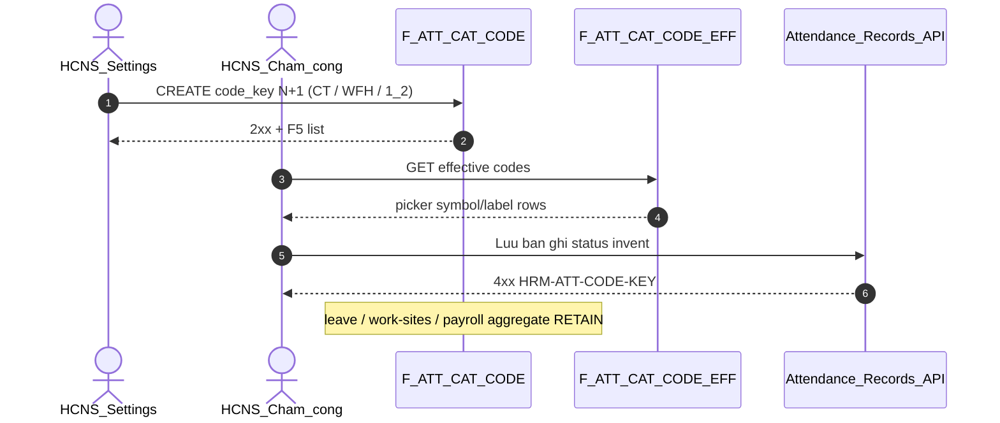

# PO-HRM-DYNAMIC-CONFIG-PLATFORM-ATT-CODE-CATALOG-SA-01 — Option/F.1 · AC-PLT-ATT-CODE-01 attendance-code (ký hiệu công) open catalog

| Field | Value |
|-------|--------|
| **work_item_id** | `PO-HRM-DYNAMIC-CONFIG-PLATFORM-ATT-CODE-CATALOG-SA-01` |
| **Parent** | `PO-HRM-DYNAMIC-CONFIG-PLATFORM-EMP-DEPT-CATALOG-QC-01` **GWC** · U88 continuous · BA-01 §2.1/§2.3 **Attendance codes / work sites** row (work-sites already OWN by peer) |
| **Program** | `PO-HRM-CONTINUOUS-W8-20260807` |
| **lane** | governance · sa |
| **change_mode** | **ADD** Option/F.1 narrow **AC-PLT-ATT-CODE-01*** · **DEFINE** Nest SoT (AS-IS closed DTO enum + FE hardcode label/badge map · **no** Nest attendance-code table) · **NO CODE** `apps/**` · **no seed** · **no wipe** ATT leave / work-sites / sign / J-HRM-06c · EMP dept/pos/status/custom/token-ext · SI type/insurer · CTR · PAY/DEC/REC/LIST-TOTALS |
| **Date** | 2026-08-08 |
| **Status** | **CONFIRMED** — Option **B** **LOCKED** (Nest `att_attendance_code` = open attendance-code catalog SoT · symbol/label/typed-flag metadata) · ba-data **UNLOCK** · ba-process **UNLOCK** · BE **HOLD** until BA (+ DATA) |
| **prior_qc** | `emp-dept-catalog-qc-01` **GWC** stamp **`EMPDEPTQA-MSK3VVXX`** · EMP position **`EMPPOSQA2-MSK3CDH1`** · EMP status **`EMPSTQA-MSK20G7H`** · EMP custom **`EMPCFQA-MSK14LUH`** · MergeToken EXT **`EMPTOKEXTQA-MSJ57PE1`** — **SEAL RETAIN** · honesty personnel/e2e/printable=false · **`C-SLICE-≠-MODULE`** |
| **prior_ba** | [`PO-HRM-DYNAMIC-CONFIG-PLATFORM-BA-01.md`](./PO-HRM-DYNAMIC-CONFIG-PLATFORM-BA-01.md) §2.3 ATT row **Attendance codes / work sites → Open catalog codes + sites CRUD Settings · GĐ1** · **BR-PLT-02/04/05/06** |
| **ref_peer_att_leave** | Nest leave-type Option **B** · [`ATT-LEAVE-CATALOG-SA-01`](./PO-HRM-DYNAMIC-CONFIG-PLATFORM-ATT-LEAVE-CATALOG-SA-01.md) **AC-PLT-ATT-LEAVE-01** — **cite ≠ copy** · **orthogonal** (leave sub-type ≠ attendance day-code) · **SEAL RETAIN** |
| **ref_peer_att_worksite** | Nest work-sites Option **B** · [`ATT-WORKSITE-CATALOG-SA-01`](./PO-HRM-DYNAMIC-CONFIG-PLATFORM-ATT-WORKSITE-CATALOG-SA-01.md) **AC-PLT-ATT-WORKSITE-01** — **cite** · work-sites OWN elsewhere · **SEAL RETAIN** |
| **ref_peer_emp_status** | Nest `emp_employment_status` Option **B** (no table → DEFINE) · [`EMP-STATUS-CATALOG-SA-01`](./PO-HRM-DYNAMIC-CONFIG-PLATFORM-EMP-STATUS-CATALOG-SA-01.md) — **closest structural peer** (DEFINE new Nest catalog + typed flags + transition/counting graph stays code L-EMP-ST-07) |
| **ref_peer_pay** | PAY Nest `salary_components` Option B · admin open ≠ consumer invent |
| **ref_adr** | [`ADR-HRM-DYNAMIC-CONFIG-PLATFORM`](../../architecture/ADR-HRM-DYNAMIC-CONFIG-PLATFORM.md) Option B · L1 Catalog · L6 soft-delete · `ICatalogRow` · **Q-PLT-03 mega-EAV DENY** · [`ADR-HRM-ATTENDANCE-CFG-PERSIST`](../../architecture/ADR-HRM-ATTENDANCE-CFG-PERSIST-20260804.md) D1 work_shifts ops lock |
| **ref_srs** | [`SRS_HRM_ENTERPRISE.md`](../../client-delivery/hrm-enterprise-blueprint/SRS_HRM_ENTERPRISE.md) **FR-UC-BP-ATT-01/02/10/11** (record status · timesheet line aggregation) · funnel leave TXN must_keep |
| **ref_db** | [`DB_DESIGN_HRM_ENTERPRISE.md`](../../client-delivery/hrm-enterprise-blueprint/DB_DESIGN_HRM_ENTERPRISE.md) §4.4 attendance_records `status` · att_timesheet_line — **no** attendance-code catalog table today |
| **Honesty** | `attendance_uat_ready=false` · `payroll_e2e_ready=false` · **DENIED** invent module ATT UAT · **DENIED** reopen ATT leave/work-sites/sign/J-HRM-06c · **DENIED** reopen EMP dept/pos/status/custom/token-ext · SI · CTR · **DENIED** rewrite payroll/LIST-TOTALS aggregate · **`C-SLICE-≠-MODULE`** · U65 |
| **must_keep** | `attendance_records.status` text column · att-timesheet-line aggregate counting code (`present`→standard · `leave`→paid/unpaid via `isUnpaidLeaveTypeKey`) · `att_leave_type` leave sub-type SoT · `work_shifts` ops lock · soft-delete class · scope_parity U19 · display-ready `status_label` path · open catalog no closed status enum ceiling |
| **ack_status** | **PASS_TO_PM** · **CONFIRMED** |

---

## 1. Decision context (ADR option pack)

| | |
|--|--|
| **Decision title** | AC-PLT-ATT-CODE-01 — attendance-code (**ký hiệu công / day-type symbol**) open catalog · admin CREATE N+1 · consumer invent KEY when EFF ≠ empty |
| **Requestor** | pm · U88 after EMP-DEPT-CATALOG-QC-01 GWC · BA-01 §2.3 ATT «Attendance codes … Open catalog · GĐ1» |
| **Decision owner** | sa |
| **Related** | FR-UC-BP-ATT-01/02/10/11 · BR-PLT-02/04/05/06 · peer ATT-LEAVE / ATT-WORKSITE / EMP-STATUS Option B · att-timesheet-line aggregate |

### 1.1 Problem — AS-IS vs target

| Current state (AS-IS grep evidence) | Gap / target |
|-------------------------------------|--------------|
| **Closed enum** `CreateAttendanceRecordDto.status` `@IsIn(['pending','present','absent','leave'])` (**H**) — attendance-record consumer bound to 4 fixed codes | Named open **attendance-code** catalog SoT + admin CREATE N+1 (e.g. business trip `CT`, half-day `1/2`, remote `WFH`, holiday `L`) — **FORBIDDEN** enum ceiling when EFF>0 |
| `AttendanceService.createRecord`: `status = payload.status ?? 'pending'` — **no** catalog assert (unlike leave `assert ∈ F-ATT-CAT-EFF`) | Consumer assert `status/code ∈ EFF` when active count>0 → else typed **`HRM-ATT-CODE-KEY`** |
| FE `AttendanceRecordsTable` hardcodes label map + badge variant + `<Select>` options with **richer** keys `present · early_leave · absent · on_leave · leave · pending` (**H**) — **divergent** from BE enum (`early_leave`/`on_leave` not accepted by DTO) | Catalog-driven symbol/label/badge (display-ready) when EFF>0; hardcode map = **bootstrap fallback only** (EFF=0) |
| `att-timesheet-line-aggregate.ts` counts by **hardcoded** `status==='present'` (→ standard hours) / `status==='leave'` (→ paid/unpaid via `isUnpaidLeaveTypeKey`) | Counting **semantics** = payroll/LIST-TOTALS sealed **code** GĐ1 — catalog carries typed flags (`counts_as`,`day_weight`,`is_paid`) for **GĐ2** wiring; **FORBIDDEN** rewrite aggregate this seat |
| **No** Nest table `att_attendance_code` (grep: only `att_leave_type` leave sub-type + funnel + aggregate) | Peer EMP-STATUS class → **DEFINE** new Nest `ICatalogRow` catalog; leave/work-sites tables **≠** this |
| No Settings MD `attendance_codes` producer LIVE (unlike EMP-CUSTOM extension-items) | Settings partition (if later added) = **group REF merge-read** only — **not** sole SoT |
| ATT leave / work-sites / sign / J-HRM-06c · EMP dept/pos/status/custom/token-ext · SI · CTR seals | **FORBIDDEN** reopen / fold attendance-code into any of these |

**Failure if unresolved:** FE keeps richer hardcode keys BE rejects; DTO closed enum blocks legitimate codes (CT/WFH/½); no catalog SoT while peers Nest; PM flips `attendance_uat_ready`; someone folds attendance-code into `att_leave_type` (collide leave sub-type SoT) or rewrites the sealed aggregate; ba-data invents mega-EAV attendance table.

### 1.2 Constraints

- Docs-only this seat · **no** `apps/**` · **no** seed (U65)
- **DENY** `attendance_uat_ready=true` · `payroll_e2e_ready=true` · module ATT UAT · Phase1
- **SEAL RETAIN:** ATT leave (`att_leave_type` GWC) · ATT work-sites GWC · leave WAIVE / sheet-sign / J-HRM-06c · EMP dept **`EMPDEPTQA-MSK3VVXX`** · EMP position **`EMPPOSQA2-MSK3CDH1`** · EMP status **`EMPSTQA-MSK20G7H`** · EMP custom **`EMPCFQA-MSK14LUH`** · MergeToken EXT **`EMPTOKEXTQA-MSJ57PE1`** · SI type/insurer · CTR legal-print · PAY/DEC/REC/LIST-TOTALS
- Cite existing `/api/hrm/attendance/*` — **cấm** invent `/api/hrm/platform/att/*` mega catalog
- **FORBIDDEN** fold attendance-code into `att_leave_type` / `work_shifts` / `attendance_work_sites`
- **Clarify BA §2.6 closed-enum principle:** attendance-record **lifecycle / counting semantics** (present→standard, leave→paid/unpaid) may remain **code** (L-ATT-CODE-07); the **allowed day-code list + symbol/label** = **open catalog** — not «every runtime enum stays closed», not «rewrite payroll aggregate now».

### 1.3 BA «Open catalog Settings» vs peer Nest (refinement)

BA-01 §2.3 TO-BE said «Open catalog codes … CRUD Settings». SA **refines** (same class as leave / status after BA said Settings): **Nest domain table = writer SoT**; any future Settings partition `attendance_codes` = **group REF merge-read** only (**BR-PLT-06**). This is **not** EMP-CUSTOM Option A — that seat had a **LIVE sealed** Settings extension-items producer; attendance-code has **no** producer and only closed DTO enum + FE hardcode.

---

## 2. Options

### Option A — Settings Master Data `attendance_codes` = sole SoT (+ drop DTO enum)

| | |
|--|--|
| **Description** | Add settings-catalogs partition as sole picker/assert SoT; BE `assertCodeInEffectiveCatalog` on record status; never Nest-physicalize attendance-code. |
| **Benefits** | No new domain DDL; nominal literal match to BA «Settings» wording. |
| **Costs** | Permanent orphan vs peers ATT leave (`att_leave_type`) / ATT work-sites / EMP-STATUS Nest SoT; typed counting flags (`counts_as`/`day_weight`/`is_paid`) weak on generic MD rows; aggregate still needs those flags physical for GĐ2 → touch anyway; no Settings producer LIVE today (empty → same hardcode fallback trap as EMP-STATUS). |
| **Risks** | Peer seats **REJECTED** MD-alone as primary SoT (PAY O4 / ATT leave / EMP status) — **REJECT** as primary for GĐ1. |

### Option B — Nest `att_attendance_code` = authoritative open attendance-code catalog · Settings REF merge-read · counting semantics stay code GĐ1 — **RECOMMEND / LOCK**

| | |
|--|--|
| **Description** | Peer **ATT leave · ATT work-sites · EMP-STATUS · SI · PAY**: single open attendance-code catalog = Nest **`public.att_attendance_code`** via **F-ATT-CAT-CODE-*** list / CRUD / effective (tenant writer = SoT; future Settings partition = **group REF merge-read**, tenant wins collision). Admin **CREATE open N+1** slug (**BR-PLT-05**) — e.g. `CT` (công tác), `WFH`, `1/2` (nửa ngày), `L` (lễ), `KL` (không lương). Row carries **typed flags** (not free JSON SoT): `code`, `name_vi`, `symbol`, `counts_as` ∈ {`work`,`paid_leave`,`unpaid_leave`,`holiday`,`absent`,`other`}, `day_weight` (1 / 0.5 …), `is_paid`, `is_present`, `sort_order`, `color`, soft-delete. When **effective active code count > 0**, attendance-record create/update **`status`** (day-code) **must** ∈ EFF (**BR-PLT-02**); invent → **`HRM-ATT-CODE-KEY`** (alias `HRM-ATT-CODE-UNKNOWN`). Empty EFF → soft skip invent + CTA Settings · **no seed** · FE/BE hardcode label map = **bootstrap fallback only** (EFF=0). Display `status_label` / symbol resolve from catalog when known. **Counting semantics** (`att-timesheet-line-aggregate` present→standard, leave→paid/unpaid) and payroll/LIST-TOTALS remain **sealed code** GĐ1 — catalog **provides** `counts_as`/`day_weight`/`is_paid` for **GĐ2** aggregate wiring (residual, **not** this seat, **not** reopen payroll). |
| **Benefits** | Aligns Platform Option B · ATT leave/work-sites/EMP-STATUS Nest · closes closed-enum + FE-divergence ambiguity; admin≠consumer split; typed flags physical for future payroll wiring without folding into leave-type; no reopen of sealed aggregate. |
| **Costs** | ba-data physical ADD (1 table) · ba-process AC matrix · BE/FE after BA+DATA · FE label-map rebind residual; GĐ2 aggregate-flag wiring separate wave. |
| **Risks** | Misread as reopen ATT leave/work-sites or rewrite payroll aggregate → **L-ATT-CODE-07/08/09**. Misread empty-EFF hardcode fallback as «closed enum ceiling» → **L-ATT-CODE-04/06**. |

### Option C — Hybrid dual writers / mega-EAV / fold into leave-type or work_shifts / rewrite aggregate / invent UAT

| | |
|--|--|
| **Description** | Settings MD **and** Nest both write; or mega `hrm_att_catalog_rows` EAV; or fold attendance-code into `att_leave_type` / `work_shifts`; or rewrite `att-timesheet-line-aggregate` counting this seat; or flip `attendance_uat_ready` / reopen leave·work-sites·sign seals. |
| **Benefits** | None for GĐ1 honesty. |
| **Costs** | Dual SoT · seal churn · leave/day-code SoT collision · payroll regression risk. |
| **Risks** | **REJECT** — DENY mega-EAV (ADR Q-PLT-03) · DENY dual writers · DENY fold · DENY rewrite sealed aggregate · DENY reopen · DENY UAT flip. |

---

## 3. Trade-off matrix

| Criteria | Weight | A Settings MD sole | **B Nest att_attendance_code** | C Hybrid / fold / aggregate rewrite / UAT |
|----------|-------:|-------------------:|-------------------------------:|-------------------------------------------:|
| Business value (BR-PLT-02/05 · BA GĐ1) | 5 | 2 | **5** | 0 |
| Honesty / seal safety (leave·work-sites·payroll retain) | 5 | 3 | **5** | 0 |
| Single attendance-code SoT vs peers Nest | 5 | 1 | **5** | 1 |
| Time to deliver | 4 | 4 | **3** | 4 |
| Complexity | 4 | 4 | **3** | 0 |
| Maintainability (admin open ≠ consumer invent · typed flags) | 4 | 2 | **5** | 1 |
| **Weighted** | | 66 | **110** | 18 |

---

## 4. Decision

| | |
|--|--|
| **Selected** | **Option B** — architecture **LOCKED** |
| **Seat verdict** | **CONFIRMED** |
| **Why B** | Closed DTO enum **remains** + FE hardcode label/badge map (divergent keys BE rejects) — BA GĐ1 trigger met. Unlike EMP-CUSTOM Option A (Settings extension **already** sealed producer), attendance-code has **no** Nest SoT and **no** Settings producer (empty → hardcode). Peers ATT leave / work-sites / EMP-STATUS chose Nest `ICatalogRow`. Typed counting flags belong on a Nest row, not MD-alone, and enable future payroll wiring **without** folding into leave-type or reopening the sealed aggregate. |
| **Rejected** | **A** Settings MD sole SoT · **C** hybrid / mega-EAV / fold / rewrite aggregate / UAT invent / reopen seals |
| **Assumptions** | `att_leave_type` leave sub-type + `work_shifts` ops + payroll/LIST-TOTALS aggregate remain sealed; starter codes bootstrap-only; counting semantics may remain code GĐ1 (open **code list**, not open **counting engine**). |

### 4.1 Physical / DATA / BA / BE gates

| Question | Answer |
|----------|--------|
| New ba-data physicalize? | **UNLOCK** — ADD `public.att_attendance_code` (peer EMP-STATUS DEFINE class; leave/work-sites tables **≠** this) |
| Unlock ba-process? | **YES** — `PO-HRM-DYNAMIC-CONFIG-PLATFORM-ATT-CODE-CATALOG-BA-01` AC pack (**AC-PLT-ATT-CODE-01***) |
| Unlock BE? | **HOLD** until BA **and** DATA CONFIRMED |
| Unlock FE? | After BA — bind Nest EFF picker + catalog symbol/label; **FORBIDDEN** hardcode sole SoT when EFF>0; reconcile FE `early_leave`/`on_leave` divergence |
| Reopen ATT leave / work-sites / sign / J-06c? | **FORBIDDEN** |
| Reopen EMP dept/pos/status/custom/token-ext · SI · CTR? | **FORBIDDEN** |
| Rewrite payroll/LIST-TOTALS aggregate? | **FORBIDDEN** this seat — typed flags physical only; GĐ2 wiring separate |
| Drop closed DTO enum ceiling? | **YES** via BE after BA+DATA (slug format CHK OK; closed `IsIn(4)` ceiling **FORBIDDEN**) |

### 4.2 Peer / adjacent ATT catalogs (cite — do not reopen / fold)

| Catalog / ops | Nest SoT | This seat |
|---------------|----------|-----------|
| Leave sub-types | `att_leave_type` · F-ATT-CAT-LVT/EFF · **ATT-LEAVE GWC SEAL** | **≠** attendance-code · **OUT reopen/fold** — `leave` day-code may *reference* a leave sub-type via existing `leave_type_key`, but the **day-code set** ≠ leave sub-type set |
| Work sites | `attendance_work_sites` · F-ATT-CAT-WS-* · **GWC SEAL** | **OUT** — geofence SoT, not day-code |
| Work shifts | `work_shifts` ops (ADR D1) | **OPS LOCK** — **FORBIDDEN** treat as attendance-code duplicate |
| **Attendance codes** | Nest `att_attendance_code` (**DEFINE**) | **OWN** AC-PLT-ATT-CODE-01 |
| Record status consumer | `attendance_records.status` · `createRecord` | Consumer of effective codes |
| Timesheet aggregate | `att-timesheet-line-aggregate` present/leave counting | **SEALED CODE** — typed-flag wiring GĐ2 residual |

---

## 5. Locks (L-ATT-CODE-*)

| Lock | Rule |
|------|------|
| **L-ATT-CODE-01 Admin ≠ consumer** | **Catalog admin** POST/PUT F-ATT-CAT-CODE-02 = **open N+1** slug (BR-PLT-05). **Consumers** (attendance-record create/update `status`; any mutate binding day-code) when effective count **>0** = **picker/FK only** (BR-PLT-02 · **AC-PLT-ATT-CODE-01**). |
| **L-ATT-CODE-02 Code SoT** | Authoritative attendance-code list = Nest `att_attendance_code` via **F-ATT-CAT-CODE-01/EFF-01** — **FORBIDDEN** Settings MD alone · **FORBIDDEN** FE/DTO closed enum as sole SoT when EFF>0 |
| **L-ATT-CODE-03 Dual SoT REF** | Future Settings `attendance_codes` = **group REF merge-read** only — tenant Nest wins collision (**BR-PLT-06**) |
| **L-ATT-CODE-04 Admin open** | CREATE N+1 open slug (**BR-PLT-05**) — **FORBIDDEN** closed enum / reject N+1 / restore `IsIn(['pending','present','absent','leave'])` as product ceiling |
| **L-ATT-CODE-05 Consumer invent** | EFF codes >0 → record `status`/day-code must ∈ EFF — invent → **`HRM-ATT-CODE-KEY`** (alias `HRM-ATT-CODE-UNKNOWN`); format-only slug **does not** bypass membership |
| **L-ATT-CODE-06 Empty EFF** | Active count **=0** → soft empty + CTA Settings · invent assert **skip** · **no seed** · bootstrap hardcode label map OK **only** when EFF=0 |
| **L-ATT-CODE-07 Counting semantics stay code** | `att-timesheet-line-aggregate` (present→standard · leave→paid/unpaid via `isUnpaidLeaveTypeKey`) + payroll/LIST-TOTALS remain **sealed code** GĐ1 — **FORBIDDEN** claim this seat rewrites counting engine · catalog `counts_as`/`day_weight`/`is_paid` = physical metadata for **GĐ2** wiring only |
| **L-ATT-CODE-08 Orthogonal / no fold** | **≠** `att_leave_type` (leave sub-type) · **≠** `work_shifts` · **≠** `attendance_work_sites` · **≠** `emp_employment_status` — **FORBIDDEN** fold / dual master |
| **L-ATT-CODE-09 Seals retain** | **FORBIDDEN** reopen ATT leave / work-sites / sign / J-HRM-06c · EMP dept/pos/status/custom/token-ext · SI type/insurer · CTR · PAY/DEC/REC/LIST-TOTALS without warrant |
| **L-ATT-CODE-10 Honesty** | **DENIED** `attendance_uat_ready` / `payroll_e2e_ready` / printable / module ATT UAT / Phase1 · **`C-SLICE-≠-MODULE`** |
| **L-ATT-CODE-11 Soft-delete** | Retire = soft (`archived_at`/`active=false`); history `attendance_records` may keep retired codes (**BR-PLT-04**) · **FORBIDDEN** hard-delete product retire |
| **L-ATT-CODE-12 Scope** | list ↔ get-by-id ↔ mutate ↔ consumer assert = `resolveHrmListScope` (**U19**) |
| **L-ATT-CODE-13 Display-ready** | List/get expose `symbol` + `status_label` from catalog (or safe fallback) — FE **cấm** join invent label when BE provides |
| **L-ATT-CODE-14 Mega-EAV** | **FORBIDDEN** one ATT mega catalog table for code+leave+work-sites+shifts (ADR Q-PLT-03) |

```text
  (future) settings-catalogs attendance_codes (group REF) ──► merge-read only
           │
  F-ATT-CAT-CODE CRUD ──► public.att_attendance_code (code SoT · typed flags)
           │
           ▼
  F-ATT-CAT-CODE-EFF-01 effective (tenant wins) ──► picker symbol/label
           │
  Consumers (count>0): attendance record status/day-code ∈ EFF
    · POST/PATCH attendance_records.status (createRecord)
           │
  invent code ──► HRM-ATT-CODE-KEY
  empty EFF   ──► skip assert · CTA · no seed · hardcode fallback only
  counting (present→std · leave→paid/unpaid) ──► SEALED CODE (GĐ2 wire flags)
  att_leave_type / work_shifts / work_sites / payroll ──► OUT this seat
```

---

## 6. API_DESIGN F.1 (DEFINE — unlock ba-data / ba-process)

### 6.1 Admin / attendance-code catalog

| ID | METHOD / path (proposed) | Mục đích | Nghiệp vụ | Tham chiếu |
|----|--------------------------|----------|-----------|-----------|
| **F-ATT-CAT-CODE-01** | `GET …/attendance/attendance-codes` | List attendance-code catalog | Scope parity · display-ready (symbol/label) · default active filter · soft-delete hidden | BR-PLT-04/05 |
| **F-ATT-CAT-CODE-02** | `POST …/attendance/attendance-codes` | Admin CREATE N+1 | Open slug · UQ active `(company_id, lower(code))` · typed flags | **BR-PLT-05** · AC-PLT-ATT-CODE-01d |
| **F-ATT-CAT-CODE-03** | `PUT/PATCH …/attendance/attendance-codes/:id` | Update metadata/flags | No wipe consumer history codes | BR-PLT-04 |
| **F-ATT-CAT-CODE-04** | soft-retire (`active=false`/`archived_at`) | Retire code | Hide from picker · history OK | BR-PLT-04 |
| **F-ATT-CAT-CODE-EFF-01** | `GET …/attendance/attendance-codes/effective` | Effective union Nest + Settings REF | Tenant wins · active only default | **BR-PLT-06** · peer leave EFF |

### 6.2 Consumer invent KEY (after BA+DATA)

| ID | Surface | Mục đích | Error |
|----|---------|----------|-------|
| **F-ATT-CODE-CNS-01** | `createRecord` / update attendance-record `status` (day-code) | Enforce ∈ EFF when count>0 | **`HRM-ATT-CODE-KEY`** (alias `HRM-ATT-CODE-UNKNOWN`) |
| **F-ATT-CODE-CNS-02** | Display map | Prefer catalog symbol/label; hardcode map only EFF=0 bootstrap | — |
| **F-ATT-CODE-CNS-03** | Aggregate counting (`att-timesheet-line-aggregate`) | **RETAIN sealed code** GĐ1; typed-flag wiring = **GĐ2 residual** | **OUT this seat** |

**Empty EFF:** skip invent assert · UI CTA · **no seed**.



### 6.3 Physical pointer (ba-data — unlock)

| Table | Role | Notes |
|-------|------|-------|
| `att_attendance_code` | Attendance-code `ICatalogRow` | `code`, `name_vi`, `symbol`, `counts_as`, `day_weight`, `is_paid`, `is_present`, `sort_order`, `color`, soft-delete, UQ `(company_id, lower(code))` active |
| `attendance_records.status` | Consumer text | Keep column; validate ∈ EFF when count>0; **EXPAND** drop closed `IsIn` DTO ceiling |
| `att_timesheet_line` | Aggregate output | **RETAIN** — counting reads flags only in **GĐ2** wiring wave |

**Starter codes (bootstrap only — not UF evidence):** e.g. `present`/`X`, `absent`/`V`, `leave`/`P`, `business_trip`/`CT`, `half_day`/`½`, `wfh`/`WFH`, `holiday`/`L`, `unpaid`/`KL` — **FORBIDDEN** as closed ceiling.

---

## 7. Acceptance pointers (ba-process unlock — draft IDs)

| ID | PASS when (draft — BA owns final wording) |
|----|-------------------------------------------|
| **AC-PLT-ATT-CODE-01** | EFF>0 · consumer attendance-record picker from F-ATT-CAT-CODE-EFF-01 · 2xx · F5 code ∈ catalog |
| **AC-PLT-ATT-CODE-01b** | EFF>0 · consumer invent unknown day-code → **`HRM-ATT-CODE-KEY`** |
| **AC-PLT-ATT-CODE-01c** | EFF=0 · invent skip · CTA · **no seed** · no closed-enum ceiling claim |
| **AC-PLT-ATT-CODE-01d** | Admin CREATE code N+1 (CT/WFH/½) → **2xx** open slug → F5 list |
| **AC-PLT-ATT-CODE-01e** | Soft-retire code → hidden picker · history record row OK |
| **AC-PLT-ATT-CODE-01f** | Display: FE symbol/label from catalog when EFF>0; hardcode map only EFF=0 · reconcile FE `early_leave`/`on_leave` divergence |
| **AC-PLT-ATT-CODE-01H** | Honesty false · leave/work-sites/sign/EMP/SI/CTR/payroll aggregate retain · **C-SLICE-≠-MODULE** · no attendance/payroll flip |

**VAL pointers:** VAL-ATT-CODE-CNS-01 (record status OOS when EFF>0 → 4xx) · VAL-ATT-CODE-CNS-02 (admin N+1 open 2xx) · VAL-ATT-CODE-CNS-03 (list picker scope = assert scope jest) · VAL-ATT-CODE-CNS-04 (soft-retire hide + history) · closed `IsIn` enum absent after DATA/BE.

**Consumer surface inventory (ba-process must enumerate exact UF/J-*):** Chấm công → bảng ghi công (create/update record `status`) · Settings/CFG attendance-code CRUD tab · **not** leave-type create · **not** work-sites · **not** work_shifts · **not** sheet close/sign · **not** payroll aggregate.

**Align note:** **AC-PLT-ATT-CODE-01** = named peer of **AC-PLT-ATT-LEAVE-01** / **AC-PLT-ATT-WORKSITE-01** / **AC-PLT-EMP-STATUS-01** — BA pack must cross-ref (no duplicate conflicting rules; leave sub-type ≠ day-code).

---

## 8. Failure modes

| Option / path | Failure mode | Detection | Mitigation |
|---------------|--------------|-----------|------------|
| A | Settings MD green · Nest orphan · empty → hardcode | Record status source ≠ effective | Reject A; bind Nest EFF |
| B | FE keeps `early_leave`/`on_leave` hardcode not in catalog | QA AC-PLT-ATT-CODE-01f picker source | FE rebind catalog · reconcile divergence |
| B | BE treats admin CREATE as invent | Admin N+1 4xx | L-ATT-CODE-01 · 01d |
| B | Someone wires flags into aggregate this seat | payroll regression / LIST-TOTALS drift | L-ATT-CODE-07 · GĐ2 only |
| C | Fold into `att_leave_type` / rewrite aggregate / flip UAT | Honesty / seal audit | DENY |
| Any | Seed codes for picker density | U65 audit | FAIL QA |

---

## 9. Rollout / unlock

```text
ATT-CODE-CATALOG-SA-01 (this) CONFIRMED · Option B LOCKED
  → ba-process: PO-HRM-DYNAMIC-CONFIG-PLATFORM-ATT-CODE-CATALOG-BA-01 AC pack
  → ba-data:    PO-HRM-DYNAMIC-CONFIG-PLATFORM-ATT-CODE-CATALOG-DATA-01 physical ADD
  → (after BA+DATA) BE: F-ATT-CAT-CODE + CNS KEY · drop closed IsIn enum
  → FE: Nest EFF picker · symbol/label · deprecate hardcode sole SoT · reconcile divergence
  → QA U65 AC-PLT-ATT-CODE-01* · retain leave/work-sites/payroll
  → QC narrow — DENY attendance/payroll flip / module ATT UAT / reopen seals
```

| Wave | Owner | Exit |
|------|-------|------|
| **This** | sa | Option B LOCKED · F.1 · ba-process **UNLOCK** · ba-data **UNLOCK** · BE HOLD |
| **AC pack** | ba-process | AC-PLT-ATT-CODE-01* CONFIRMED |
| **DATA** | ba-data | Physical CONFIRMED · closed-enum EXPAND note |
| **BE/FE** | dev-be / dev-fe | Only after BA+DATA |
| **QA/QC** | qa → qc | Narrow seal · honesty false |

**Rollback:** Feature-flag CNS off; retain text `attendance_records.status`; do not reintroduce closed `IsIn` enum as product ceiling; no DDL drop on aggregate.

**Success (this seat):** Option B locked · ba-data UNLOCK · ba-process UNLOCK · BE HOLD · honesty false · seals retained · leave/work-sites/sign/EMP/SI/CTR/payroll **not** reopened.

---

## 10. Non-claims

- No `apps/**` / migration / seed.
- No `attendance_uat_ready=true` · no `payroll_e2e_ready=true` · no module ATT UAT · no Phase1.
- No reopen ATT leave / work-sites / sign / J-HRM-06c · EMP dept/pos/status/custom/token-ext · SI type/insurer · CTR · PAY/DEC/REC/LIST-TOTALS.
- No rewrite of `att-timesheet-line-aggregate` counting / payroll — typed flags physical only, GĐ2 wiring separate wave.
- No fold attendance-code into `att_leave_type` / `work_shifts` / `attendance_work_sites`.
- This file owns **AC-PLT-ATT-CODE-01 Option/F.1 DEFINE** (peer ATT-LEAVE / ATT-WORKSITE / EMP-STATUS), not a second leave/work-sites redesign, not an aggregate rewrite.

---

## 11. Completion

| Field | Value |
|-------|--------|
| **completion_report** | Option **B CONFIRMED LOCKED** — attendance-code (**ký hiệu công / day-type**) open catalog SoT = Nest **`att_attendance_code`** (DEFINE new table; symbol/label + typed flags `counts_as`/`day_weight`/`is_paid`); future Settings partition = REF merge-read; admin CREATE N+1 ≠ consumer invent **`HRM-ATT-CODE-KEY`**; AS-IS closed DTO `IsIn(['pending','present','absent','leave'])` + FE hardcode label/badge map (divergent `early_leave`/`on_leave`) = residual to drop after DATA; **counting semantics** (`att-timesheet-line-aggregate` present→standard · leave→paid/unpaid) + payroll/LIST-TOTALS **RETAIN sealed code** GĐ1 (flag wiring = GĐ2); Option A Settings-sole **REJECT**; leave/work-sites/sign/EMP dept·pos·status·custom·token-ext/SI/CTR **RETAIN**; ba-data **UNLOCK** (physical ADD); ba-process **UNLOCK** (AC pack); BE **HOLD**; honesty attendance/payroll false · **C-SLICE-≠-MODULE**. |
| **next_owner** | `ba-process` (+ `ba-data` parallel — Nest ADD) |
| **next_dispatch_prompt** | `Task ba-process — work_item_id: PO-HRM-DYNAMIC-CONFIG-PLATFORM-ATT-CODE-CATALOG-BA-01. Read SA §5–§7 (L-ATT-CODE-01..14, F-ATT-CAT-CODE-*, AC-PLT-ATT-CODE-01*). Produce AC pack: enumerate exact consumer UF/J-* (Chấm công → bảng ghi công create/update status; Settings attendance-code CRUD tab); BR condition→action→outcome; VAL-ATT-CODE-CNS-01..04; lock leave sub-type ≠ day-code; lock counting semantics stay code GĐ1 (no payroll reopen). In parallel Task ba-data — work_item_id: PO-HRM-DYNAMIC-CONFIG-PLATFORM-ATT-CODE-CATALOG-DATA-01: physicalize public.att_attendance_code per §6.3 (columns, typed flags, UQ (company_id, lower(code)) active, soft-delete) + EXPAND note dropping closed IsIn DTO ceiling; NO second ATT catalog table; NO fold into att_leave_type; NO seed. Both docs-only; BE HOLD until BA+DATA CONFIRMED; U65; honesty attendance_uat_ready=false.` |
| **ack_status** | **PASS_TO_PM** |
| **evidence_path** | `docs/qa/evidence/po-hrm-dynamic-config-platform-att-code-catalog-sa-01.md` |
