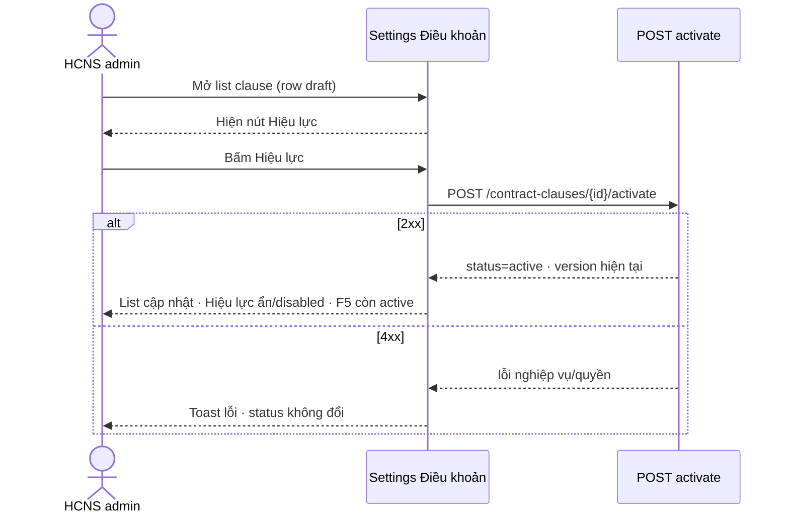
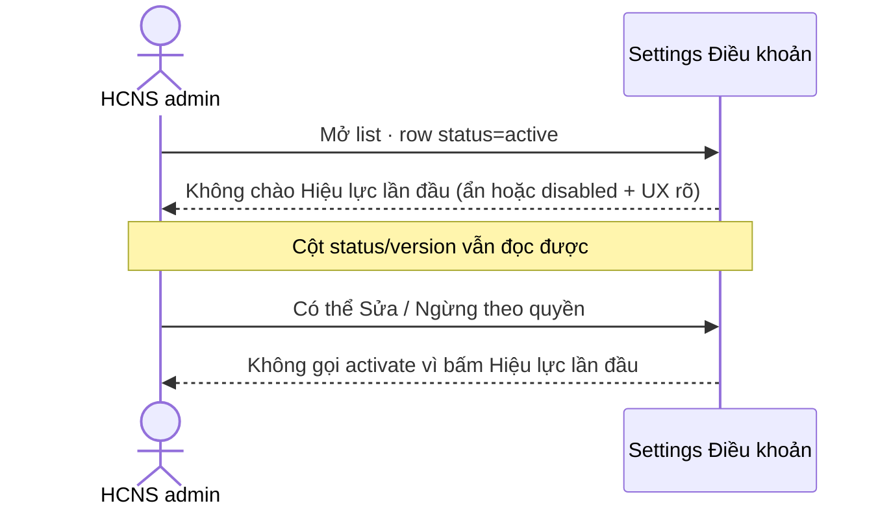
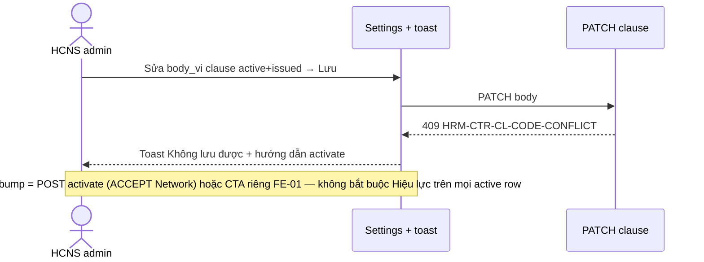

# PO-HRM-DYNAMIC-CONFIG-PLATFORM-CTR-CLAUSE-ACTIVATE-UI-BA-01

| Field | Value |
|-------|--------|
| **work_item_id** | `PO-HRM-DYNAMIC-CONFIG-PLATFORM-CTR-CLAUSE-ACTIVATE-UI-BA-01` |
| **from_role** | `ba-process` |
| **to_role** | `pm` |
| **lane** | governance — **ADD-only** residual **`R-CTR-CL-ACTIVATE-UI`** |
| **priority** | P2 |
| **date** | 2026-08-09 |
| **parent** | `PO-HRM-DYNAMIC-CONFIG-PLATFORM-CTR-CLAUSE-QC-03` GWC · residual ACCEPT P2 |
| **change_mode** | **ADD** (không wipe BA-01 · không reopen ISSUE-AC AC-02/03) |
| **ack_status** | **PASS_TO_PM** · **CONFIRMED** |
| **U65** | zero-seed · FE-first · cấm seed nghiệm thu |
| **honesty** | `contracts_printable_ready=false` · `C-SLICE-≠-MODULE` · honesty flags **false** |

---

## 0. Purpose (mục tiêu seat)

Khóa **ACCEPT / CONFIRMED** cho residual **`R-CTR-CL-ACTIVATE-UI`**: trên Settings → **Hợp đồng in** → **Điều khoản**, hành vi nút **Hiệu lực** phải **đo được** theo trạng thái row:

| Trạng thái clause (`status`) | Kỳ vọng UX **Hiệu lực** |
|------------------------------|-------------------------|
| **Không** `active` (vd. `draft`, trạng thái chờ kích hoạt lần đầu) | **Hiện** đường kích hoạt — user bấm **Hiệu lực** → `POST …/activate` → `status=active` |
| **`active`** (đã hiệu lực) | **Không** chào **Hiệu lực** như kích hoạt lần đầu — **ẩn** **hoặc** **disabled** kèm UX rõ (tooltip / nhãn / toast soft-block) |

Seat này **không** mở lại spine soft-block AC-02/03 (đã SEAL QC-03 stamp **`CLQA4-KMZ54C`**). Seat này **không** invent Nest FE-ADMIN, **không** flip printable, **không** claim module CTR UAT.

**Disposition (BA):** hành vi hiện tại FE (`status !== 'active'` → render **Hiệu lực**; `active` → **không** render nút) **khớp** AC lõi **AC-PLT-CTR-CL-ACT-01/02**. Soft-block toast sau PATCH 409 đã hướng dẫn activate/version bump (QA-04). → **ACCEPT_AS_IS** đóng residual P2 là mặc định. **FE-01** chỉ mở nếu PM muốn polish **clear UX** (disabled + tooltip / CTA **Tăng phiên bản** sau 409) — **cấm** FE-01 “bật lại Hiệu lực trên mọi row active”.

---

## 1. Actors · scope · must_keep

### 1.1 Actors

| Actor | Vai trò trong UC này |
|-------|----------------------|
| **HCNS / Settings admin** | Tạo clause draft → **Hiệu lực** lần đầu; sửa body khi đã issued → nhận soft-block; quan sát UX khi row đã `active` |
| **QA** | Xác nhận AC-ACT trên browser U65 (không seed) |
| **dev-fe** (optional FE-01) | Chỉ polish clear UX theo AC đã CONFIRMED — không Nest invent |

### 1.2 IN scope

- Nút / control **Hiệu lực** trên list clause Settings
- Phân nhánh theo `status=active` vs không-active
- Liên hệ toast soft-block AC-02 (hướng dẫn activate) — **cite** không reopen detection
- Disposition residual **`R-CTR-CL-ACTIVATE-UI`**: ACCEPT_AS_IS **hoặc** FE-01 hẹp

### 1.3 OUT of scope (explicit DENY)

| OUT | Lý do |
|-----|-------|
| Nest invent / FE-ADMIN rewrite (BA-06 / SA-02 Option A HOLD) | **DENY** |
| Flip `contracts_printable_ready` / printable module | PRINTABLE-HOLD **RETAIN** |
| Module CTR UAT / Phase1 DONE / `PROGRAM_JOURNEY_MAP` 🟢 module | **C-SLICE-≠-MODULE** |
| Reopen AC-PLT-CTR-CL-02/03 · PATCH 409 detection · snapshot freeze | QC-03 **SEAL** |
| Reopen CLQA2-KMCG5L company_id PATCH P0 | **SEAL RETAIN** |
| Rewrite BA-05 FE-ADMIN inventory | **DENY** |
| Seed / API fake activate để “có nút” | U65 |
| DnD template 404 OBS · toast conflict-code string | P2 OBS riêng — **không** gộp vào ACTIVATE-UI DoD |
| Invent bảng version history (ba-data) | BA-01 §7 HOLD **RETAIN** |
| `apps/**` trong seat BA | governance only |

### 1.4 must_keep

- CLQA2-KMCG5L PATCH seal (query-only `company_id`)
- `contracts_printable_ready=false`
- `C-SLICE-≠-MODULE`
- Honesty flags **false**
- AC-02/03 SEAL **`CLQA4-KMZ54C`**
- CTR-TEMPLATE KEY seal · ATT/EMP/SI/DEC peer seals — **không reopen**

### 1.5 Spec retain (cite, không wipe)

| Spec | Vai trò |
|------|---------|
| `PO-HRM-DYNAMIC-CONFIG-PLATFORM-CTR-CLAUSE-BA-01.md` | AC-01..06 + H SoT gốc |
| `PO-HRM-DYNAMIC-CONFIG-PLATFORM-CTR-CLAUSE-ISSUE-AC-BA-01.md` | Spine U65 · §6.3 activate P2 alternate |
| QC-03 / QA-04 | Residual wording + soft-block toast evidence |

**Sửa diễn giải residual:** QC-03 “Expose version-bump UX when active” **không** được hiểu là “luôn hiện **Hiệu lực** trên mọi row `active`”. Diễn giải CONFIRMED = **ẩn/disabled Hiệu lực khi đã active**; version bump sau soft-block = toast + `POST activate` (ACCEPT) hoặc CTA **riêng** (FE-01 optional) — **không** nhầm với kích hoạt lần đầu.

---

## 2. As-is vs to-be

| | As-is (LIVE — QA/FE) | To-be (CONFIRMED product) |
|--|----------------------|---------------------------|
| Row `status !== 'active'` | Nút **Hiệu lực** **hiện** · `onActivateClause` → POST activate | **RETAIN** — AC-PLT-CTR-CL-ACT-02 |
| Row `status === 'active'` | Nút **Hiệu lực** **không render** (`null`) · cột `status` / `version` vẫn hiện | **CONFIRMED** — **không chào** kích hoạt lần đầu; ẩn **hoặc** disabled + UX rõ = PASS AC-ACT-01 |
| Sau PATCH 409 issued | Toast «Không lưu được điều khoản» + message BE gợi ý activate/version bump; **không** có CTA Hiệu lực trên row active | **ACCEPT** soft-block path (AC-02 SEAL); version-bump UI riêng = **optional** FE-01 — **không** bắt buộc để đóng residual nếu AC-ACT-01/02 PASS |
| QC residual cũ | “Hiệu lực hidden when already active” ghi như **gap** | **Reclassify:** đây là **hành vi đúng** theo AC-ACT-01 — residual đóng bằng ACCEPT_AS_IS (hoặc polish clear UX, không “expose lại”) |

---

## 3. Use-case catalog

### UC-CTR-CL-ACT-01 — Kích hoạt lần đầu (inactive → active)

**Purpose:** Admin đưa clause từ draft/chưa active sang `active` để dùng trong pack/template/issue spine.

**Happy path:** Settings → Điều khoản → row không-active → **Hiệu lực** → Network `POST …/contract-clauses/{id}/activate?company_id=…` **2xx** → list `status=active` · **F5** còn active · nút **Hiệu lực** biến mất / disabled.

**Alternate:** CREATE mới rồi **Hiệu lực** ngay (QA-04 spine A).

**Exception:** activate khi thiếu quyền / id sai → 4xx toast; **không** silent success.

### UC-CTR-CL-ACT-02 — Row đã active — không chào Hiệu lực lần đầu

**Purpose:** Tránh hiểu nhầm “bấm Hiệu lực lại = lưu body” trên clause đã active.

**Happy path:** Mở list → chọn row `status=active` → **không** có control **Hiệu lực** clickable lần đầu (ẩn **hoặc** disabled + tooltip/nhãn rõ: đã hiệu lực).

**Alternate:** User **Sửa** body khi chưa issued → PATCH **200** (AC-01 RETAIN) — **không** cần Hiệu lực.

**Exception:** User cố kích hoạt lần đầu trên active qua UI → **không có** path UI; DevTools POST activate vẫn là API path (ISSUE-AC §6.3) — **không** FAIL AC-ACT nếu UI đúng ẩn/disabled.

### UC-CTR-CL-ACT-03 — Soft-block issued + hướng dẫn version bump (cite AC-02)

**Purpose:** Sau soft-block, user hiểu cần `POST activate` (version++) — **không** ghi đè snapshot issued.

**Happy:** Sửa body issued → Lưu → **409** `HRM-CTR-CL-CODE-CONFLICT` → toast hướng dẫn activate → (ACCEPT) Network/DevTools activate **hoặc** (optional FE-01) CTA **Tăng phiên bản** riêng.

**Exception:** Silent 200 on issued body → **FAIL AC-02** (đã SEAL — **cấm** reopen seat này để “fix” bằng seed).

**Cấm:** Đòi hỏi nút mang nhãn **Hiệu lực** trên mọi row active như DoD của residual này.

---

## 4. sequenceDiagram · Diễn biến (balanced)

### 4.1 UC-CTR-CL-ACT-01 — kích hoạt lần đầu

#### Diễn biến bước (UC-CTR-CL-ACT-01)

| # | Actor | Bước | Kết quả quan sát |
|---|-------|------|------------------|
| 1 | Admin | Login → Settings → Hợp đồng in → Điều khoản | List clause load |
| 2 | Admin | Xác định row `status` ≠ `active` | Nút **Hiệu lực** **VISIBLE** |
| 3 | Admin | Bấm **Hiệu lực** | Network POST activate |
| 4 | Hệ thống | Activate OK | **2xx** · `status=active` |
| 5 | Admin | Quan sát row + **F5** | **Hiệu lực** không còn chào kích hoạt lần đầu · status vẫn `active` |
| 6 | Hệ thống (fail) | Activate 4xx | Toast lỗi · không đổi status |

### 4.2 UC-CTR-CL-ACT-02 — đã active

#### Diễn biến bước (UC-CTR-CL-ACT-02)

| # | Actor | Bước | Kết quả quan sát |
|---|-------|------|------------------|
| 1 | Admin | Mở list clause | Có ≥1 row `active` |
| 2 | FE | Render actions | **Hiệu lực** **ABSENT** hoặc **disabled** + tooltip/nhãn rõ |
| 3 | Admin | Đọc cột status / version | Biết row đã hiệu lực (không phụ thuộc màu đơn) |
| 4 | Admin | Không thấy CTA kích hoạt lần đầu | **PASS** AC-ACT-01 |
| 5 | Fail | FE hiện **Hiệu lực** clickable trên active như lần đầu | **FAIL** AC-ACT-01 |

### 4.3 UC-CTR-CL-ACT-03 — soft-block cite (không reopen AC-02)

---

## 5. Acceptance criteria (measurable)

| ID | Persona / J-* | Precondition | Action (FE) | PASS | FAIL |
|----|---------------|--------------|-------------|------|------|
| **AC-PLT-CTR-CL-ACT-01** | HCNS · J-HRM-CTR-CL-ACT-01 | ≥1 clause `status=active` trên list | Quan sát cột thao tác row active | **Hiệu lực** **không** được chào như kích hoạt lần đầu: **ẩn** **hoặc** **disabled** + UX rõ (tooltip/nhãn/status đọc được); **F5** giữ hành vi | Nút **Hiệu lực** clickable trên active như lần đầu · silent empty cell **không** có status/version/tooltip **và** không có soft-block guidance khi cần bump |
| **AC-PLT-CTR-CL-ACT-02** | HCNS · J-HRM-CTR-CL-ACT-02 | ≥1 clause `status≠active` (draft) | Bấm **Hiệu lực** → quan sát Network + list + **F5** | POST activate **2xx**; row → `active`; sau đó AC-ACT-01 áp dụng | Nút vắng trên draft · activate 5xx · F5 mất active · seed để có draft |
| **AC-PLT-CTR-CL-ACT-03** | HCNS · cite J-HRM-CTR-CL-02 | Clause active+issued (AC-02 SEAL) | Sửa body → Lưu | **409 CONFLICT** + toast hướng dẫn activate **RETAIN**; **không** đòi Hiệu lực trên mọi active để PASS AC-02 | Dùng seat này để reopen AC-02/03 · đòi hiện Hiệu lực trên mọi active |
| **AC-PLT-CTR-CL-ACT-H** | Governance | — | — | printable=false · C-SLICE · không Nest invent · không seed · không module CTR UAT · không rewrite BA-05 | Flip flags · invent FE-ADMIN · claim module GO |

### 5.1 Clear UX definition (đo được)

**PASS “clear UX” khi ACTIVE** nếu **một** trong các điều kiện đúng:

1. **Ẩn nút** **và** cột `status` (và khuyến nghị `version`) **visible** trên row; **hoặc**
2. Nút **Hiệu lực** **disabled** với `title`/aria/tooltip tiếng Việt rõ («Đã hiệu lực» / tương đương); **hoặc**
3. Sau soft-block 409, toast/description hướng dẫn activate/version bump **visible** (đã chứng minh QA-04).

**LIVE baseline:** (1) + (3) đã có → đủ **ACCEPT_AS_IS** đóng **`R-CTR-CL-ACTIVATE-UI`**.

### 5.2 Journey add (U19 — C-SLICE only)

| Journey | Mục đích | Promote PROGRAM_JOURNEY_MAP module? |
|---------|----------|-------------------------------------|
| **J-HRM-CTR-CL-ACT-01** | Active row: Hiệu lực không chào lần đầu | **NO** — C-SLICE |
| **J-HRM-CTR-CL-ACT-02** | Draft → Hiệu lực → active + F5 | **NO** |

---

## 6. Business rules

| BR | Condition | Action | Outcome |
|----|-----------|--------|---------|
| **BR-CTR-CL-ACT-01** | `status === 'active'` trên list Settings clause | **Không** chào **Hiệu lực** như kích hoạt lần đầu (ẩn hoặc disabled + UX rõ) | Tránh nhầm activate lần đầu trên row đã active |
| **BR-CTR-CL-ACT-02** | `status !== 'active'` và chưa retired theo rule Ngừng | Hiện **Hiệu lực** · POST activate khi bấm | Draft → active U65 |
| **BR-CTR-CL-ACT-03** | Active + issued + đổi `body_vi` | Soft-block **409** + hướng dẫn activate (BR-CTR-CL-01 RETAIN) | Snapshot issued không bị ghi đè |
| **BR-CTR-CL-ACT-04** | Version bump sau CONFLICT | `POST …/activate` → `version++` (BR-CTR-CL-01b RETAIN) | UI riêng optional; **cấm** diễn giải “phải hiện Hiệu lực trên mọi active” |
| **BR-CTR-CL-ACT-H** | Honesty | Giữ printable=false · C-SLICE | Không promote module CTR |

---

## 7. Validation / Data Interaction table

| VAL | Field / control | Rule | UI/API | FAIL |
|-----|-----------------|------|--------|------|
| **VAL-CTR-CL-ACT-01** | Button **Hiệu lực** | Chỉ enable/visible cho kích hoạt lần đầu khi `status≠active` | FE list actions | Visible+enabled trên `active` như lần đầu |
| **VAL-CTR-CL-ACT-02** | POST activate | Query/header scope `company_id` peer activate (RETAIN) | Network 2xx | Body invent Nest / seed |
| **VAL-CTR-CL-ACT-03** | Soft-block toast | Sau 409 có message hướng dẫn activate | FE toast | White screen / silent 200 |
| **VAL-CTR-CL-ACT-04** | Status column | User đọc được `active` không chỉ dựa màu | FE table | Chỉ màu, không text status khi ẩn nút |
| **VAL-CTR-CL-01** | Issued body PATCH | **409 CONFLICT** RETAIN | AC-02 SEAL | Reopen seat ACT để “sửa” detection |

---

## 8. Disposition residual `R-CTR-CL-ACTIVATE-UI`

| Option | Khi nào | Owner kế |
|--------|---------|----------|
| **A — ACCEPT_AS_IS (mặc định CONFIRMED)** | AC-ACT-01/02/H thỏa LIVE (ẩn khi active + hiện khi draft + toast soft-block) | **pm** observe · đóng residual · **không** bắt buộc FE-01 |
| **B — FE-01 narrow polish** | Sponsor muốn disabled+tooltip **hoặc** CTA **Tăng phiên bản** sau 409 | **dev-fe** — **cấm** hiện lại **Hiệu lực** clickable trên mọi active |

**BA recommendation:** **Option A ACCEPT_AS_IS**. FE-01 chỉ khi PM chọn Option B.

---

## 9. Handoff package

| Role | Expectation | Done |
|------|-------------|------|
| **PM** | Seal CONFIRMED AC; chọn A hoặc B | Bus INTAKE + dispatch |
| **dev-fe** (nếu B) | Polish theo AC-ACT chỉ | Evidence FE-01 · READY_FOR_QA |
| **QA** (nếu B) | J-HRM-CTR-CL-ACT-01/02 browser U65 | 🟢/🔴 per AC |
| **QC** | Không reopen AC-02/03 | Residual ACT closed or FE Condition |

---

## 10. Open risks / assumptions

| Item | Note |
|------|------|
| A1 | LIVE FE `ContractLegalPrintSettingsPanel` `c.status !== 'active' ? Hiệu lực : null` — khớp AC-ACT-01 “not offered” |
| A2 | QC wording “Expose version-bump” **superseded** bởi pack này |
| R1 | Nếu FE-01 làm sai (bật Hiệu lực mọi active) → **FAIL** AC-ACT-01 |
| R2 | Retired row: nút Ngừng ẩn; Hiệu lực cũng ẩn nếu không active — ngoài seat trừ khi sponsor mở retire-reactivate |

---

## 11. completion (spec)

**ack_status:** **PASS_TO_PM** · **CONFIRMED**

**completion_report:** ADD-only AC pack **AC-PLT-CTR-CL-ACT-01/02/03/H** + BR/VAL + journeys J-HRM-CTR-CL-ACT-01/02. Khóa: active → Hiệu lực không chào lần đầu; inactive → path còn. Disposition **ACCEPT_AS_IS** mặc định; FE-01 optional clear-UX only. OUT: Nest invent · printable · module UAT · reopen AC-02/03 · BA-05 rewrite.

**next_owner:** **pm**

**evidence_path:** `docs/qa/evidence/po-hrm-dynamic-config-platform-ctr-clause-activate-ui-ba-01.md`
