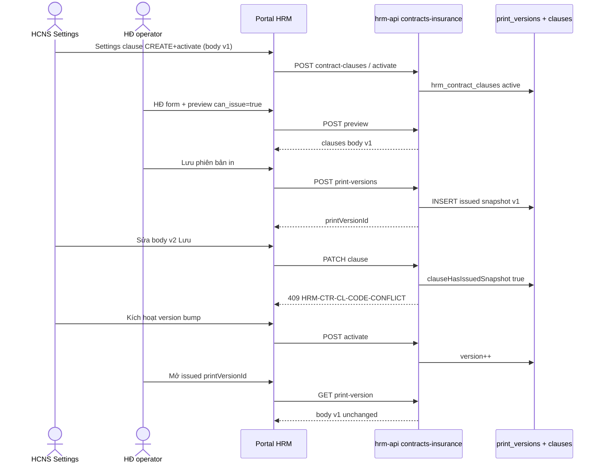

# PO-HRM-DYNAMIC-CONFIG-PLATFORM-CTR-CLAUSE-ISSUE-AC-BA-01 — ADD-only Diễn biến delta · AC-PLT-CTR-CL-02 / AC-PLT-CTR-CL-03 · issue→freeze U65 spine

| Field | Value |
|-------|--------|
| **work_item_id** | `PO-HRM-DYNAMIC-CONFIG-PLATFORM-CTR-CLAUSE-ISSUE-AC-BA-01` |
| **lane** | governance · ba-process |
| **change_mode** | **ADD-only** — **APPEND** delta sections; **CẤM wipe** [`PO-HRM-DYNAMIC-CONFIG-PLATFORM-CTR-CLAUSE-BA-01.md`](./PO-HRM-DYNAMIC-CONFIG-PLATFORM-CTR-CLAUSE-BA-01.md) |
| **Parent** | CTR-CLAUSE-BA-01 **CONFIRMED** · CTR-CLAUSE-QC-02 **GWC** stamp **`CLQA2-KMCG5L`** · CONDITION **`R-CTR-CL-ISSUE-SPINE-U65`** P1 |
| **Program** | `PO-HRM-CONTINUOUS-W8-20260807` · U88 supports **QA-03** spine seat |
| **Date** | 2026-08-09 |
| **Status** | **CONFIRMED** — AC-02/03 Diễn biến delta for U65 browser (zero-seed) |
| **residual_id** | **`R-CTR-CL-ISSUE-SPINE-U65`** (cite — closure target for QA-03, not this docs seat) |
| **ref_prior_ac** | BA-01 §3 UC-CTR-CL-EDIT-ISSUED · §4 AC-02/03 · VAL-CTR-CL-01 |
| **ref_qc** | [`po-hrm-dynamic-config-platform-ctr-clause-qc-02.md`](../../qa/evidence/po-hrm-dynamic-config-platform-ctr-clause-qc-02.md) |
| **ref_fe_sa** | [`PO-HRM-DYNAMIC-CONFIG-PLATFORM-CTR-CLAUSE-FE-SA-01.md`](./PO-HRM-DYNAMIC-CONFIG-PLATFORM-CTR-CLAUSE-FE-SA-01.md) · **`R-PLT-CTR-CL-FE-01`** HOLD RETAIN |
| **ref_printable** | [`PO-HRM-DYNAMIC-CONFIG-PLATFORM-CTR-PRINTABLE-HOLD-SA-01.md`](./PO-HRM-DYNAMIC-CONFIG-PLATFORM-CTR-PRINTABLE-HOLD-SA-01.md) Option A · **`contracts_printable_ready=false`** |
| **Honesty** | **`contracts_printable_ready=false`** · **`payroll_e2e_ready=false`** · **`C-SLICE-≠-MODULE`** · U65 zero-seed · **DENIED** module CTR UAT · Phase1 · seed · flip printable |
| **must_keep** | BA-01 AC-01/04/06/H sealed **`CLQA2-KMCG5L`** · P0 **`R-PLT-CTR-CL-FE-PATCH-COMPANY-ID` CLOSED** · `clauses_snapshot_json` immutable · Nest `body_vi` SoT Option B RETAIN |
| **DENY** | seed · flip printable · module CTR UAT claim · invent Nest dual SoT · reopen P0 PATCH as FAIL · `apps/**` |
| **ack_status** | **PASS_TO_PM** |

> **HARD EXIT GATE:** UTF-8 **no BOM** · Shell **Length ≥ 8192** verified before CONFIRMED. This seat **does not** replace BA-01 — QA must read **both** files for AC-02/03 spine.

---

## 0. Relationship to CTR-CLAUSE-BA-01 (non-destructive)

| Rule | Application |
|------|-------------|
| **RETAIN** | Toàn bộ AC-PLT-CTR-CL-01..06 + VAL-CTR-CL-01..05 + BR-CTR-CL-01..05 trong BA-01 **giữ nguyên** |
| **APPEND** | File này **bổ sung** Diễn biến 4 cột + click path FE + nhánh lỗi **chỉ** cho **AC-PLT-CTR-CL-02** và **AC-PLT-CTR-CL-03** |
| **Supersedes?** | **Không** — nếu mâu thuẫn, BA-01 là gốc; delta này **làm rõ** bước U65 mà QC-02 ghi NOTE_BLOCKED |
| **QA mapping** | QA-03 (hoặc seat spine kế) **bắt buộc** cite BA-01 **và** file ISSUE-AC-BA-01 trong evidence `spec_ref` |

**Lý do delta:** QC-02 GWC chấp nhận AC-01/04/06/H nhưng **CONDITION P1** vì QA-02 không thu được `printVersionId` trong chuỗi U65. QA không được **tự nghĩ** bước issue — delta này khóa click path từ Settings clause → attach/pack → contract spine → issue → freeze assert.

---

## 1. Process objective (delta scope)

**Objective:** Cung cấp **acceptance criteria đo được** và **Diễn biến từng bước** để đóng **`R-CTR-CL-ISSUE-SPINE-U65`** bằng luồng FE U65 (login → menu → Lưu → quan sát sau 2xx → F5), **không seed**, **không** API-only PASS cho AC-02/03.

| Actor | Vai trò trong spine AC-02/03 |
|-------|------------------------------|
| **HCNS / Settings admin** | Tạo clause + gắn `apply_to_packs` · kích hoạt clause · (sau conflict) **POST activate** version bump |
| **HCNS / HĐ operator** | Tạo/sửa HĐ · điền registry bắt buộc preview · **Xem trước** · **Lưu phiên bản in** (issue) |
| **QA** | Ghi `printVersionId` · assert PATCH conflict · assert snapshot body immutable |
| **BE (read-only cite)** | `updateClause` → **409** `HRM-CTR-CL-CODE-CONFLICT` khi active+issued+đổi `body_vi`; `activateClause` version++ khi issued |

**Boundaries IN:** U65 spine preconditions · AC-02 soft-block vs activate · AC-03 snapshot compare · VAL wire codes · failure-first branches.

**Boundaries OUT:** DnD reorder (AC-PLT-CTR-03 peer) · DOCX GĐ2 · flip `contracts_printable_ready` · module CTR UAT · seed để có issued PV.

---

## 2. Residual closure definition — `R-CTR-CL-ISSUE-SPINE-U65`

| Field | Value |
|-------|--------|
| **residual_id** | **`R-CTR-CL-ISSUE-SPINE-U65`** |
| **Severity** | **P1** (QC-02 CONDITION — not P0 NO-GO on PATCH slice) |
| **Opened by** | QA-01/QA-02 — không có `printVersionId` sau contract submit |
| **Closed when** | QA evidence (browser U65) chứng minh **cả hai**: AC-PLT-CTR-CL-02 **và** AC-PLT-CTR-CL-03 **🟢 PASS** theo §4–§5 file này |
| **Not closed by** | BA docs alone · API probe without issued PV · seed insert print_versions |

**Carry peers (do not confuse with spine closure):**

| ID | Sev | Note |
|----|-----|------|
| **`R-CTR-CL-ACTIVATE-UI`** | P2 | Nút **Hiệu lực** ẩn khi clause đã active — QA có thể dùng **POST activate** qua Network hoặc API doc path; **P2 không chặn** AC-02 PASS nếu activate thành công |
| **`R-PLT-CTR-CL-FE-01`** | P2 HOLD | FE-SA ACCEPT_AS_IS — **DENY** invent FE unlock as spine blocker |

---

## 3. End-to-end U65 spine — Settings clause → issue print version → `printVersionId`

### 3.1 Persona · URL · L0

| Item | Value |
|------|--------|
| Persona | `ceo@xe.vn` / `Xevn@2026` |
| Scope | `company_id=main` · tenant `xevn` |
| Portal | `http://127.0.0.1:5173` (hoặc `:8088` pilot nếu PM chuẩn hóa — **cùng** proxy HRM `:28001`) |
| L0 | `pnpm run qc:dev-stack` exit health **200** trước browser |
| U65 | **Cấm** `pnpm seed:*` · mọi row clause/template/HĐ tạo từ **Settings + HĐ form** trong phiên QA |

### 3.2 Phase A — Settings: clause + pack attach (precondition library)

**Menu:** Portal HRM → **Cài đặt** → tab **Hợp đồng in** (`contract-legal`) → sub-tab **Điều khoản**.

| Step | Diễn biến | Kỳ vọng đo được |
|------|-----------|-----------------|
| A1 | Nhập **Mã** `CL_SPINE_{STAMP}` · Tiêu đề · **`body_vi` v1** (có token `{{employee_name}}` nếu cần preview) · **Nhóm điều khoản** · **`apply_to_packs`** gồm pack HĐ sẽ dùng (vd. `LABOR` / pack template) · **Bắt buộc** nếu template yêu cầu mandatory | Form hợp lệ |
| A2 | **Lưu** (CREATE) | Network `POST /api/hrm/contracts-insurance/contract-clauses` → **201** **`HRM-CTR-CL-201`** |
| A3 | **F5** → row còn · mở **Sửa** xác nhận body v1 | GET list 200 · textarea khớp v1 |
| A4 | Row → **Kích hoạt** / **Hiệu lực** (nếu UI hiện; nếu ẩn → xem §6.3 activate alternate) | `POST …/contract-clauses/{id}/activate?company_id=main` → **2xx** · `status=active` |
| A5 | (Khuyến nghị spine) Sub-tab **Mẫu hợp đồng**: CREATE template `TPL_SPINE_{STAMP}` · gắn cùng pack · **mandatory** clause pack khớp A1 · **Kích hoạt** template | `POST …/contract-templates` **201** `HRM-CTR-TPL-201` · activate **2xx** |

**FAIL nhanh Phase A:** POST 400 `HRM-VAL-001` do `company_id` trong PATCH body (đã đóng P0 — PATCH phải `?company_id=main` only) · body rỗng → `HRM-CTR-CL-REQUIRED`.

### 3.3 Phase B — Contract UF-HRM-02 → print spine → issue

**Menu:** **Nhân sự / Hợp đồng** (embed HĐ) → **Tạo** hoặc mở HĐ draft.

| Step | Diễn biến | Kỳ vọng đo được |
|------|-----------|-----------------|
| B1 | Chọn **Mẫu** = `TPL_SPINE_{STAMP}` (active) · nhân viên · ngày · các trường SRS bắt buộc | Form submit được |
| B2 | **Quan trọng (failure-first):** điền **Nơi làm việc / work_location** (registry + override spine nếu panel có) — thiếu → preview `can_issue=false` → nút **Lưu phiên bản in** disabled (cite FE-03 closure **`R-CTR-PRINT-CAN-ISSUE`**) | Preview payload `can_issue=true` |
| B3 | Mở panel **In HĐ / Print spine** → **Xem trước** | `POST …/contracts/{contractId}/preview?company_id=main` → **201/200** · response `can_issue=true` · `clauses[]` chứa `code=CL_SPINE_{STAMP}` · `body_vi` = v1 |
| B4 | **Lưu phiên bản in** / Save print version | `POST …/contracts/{contractId}/print-versions?company_id=main` → **201** · response có **`id`** (= **`printVersionId`**) · status **issued** |
| B5 | **F5** → danh sách phiên bản in **≥1** · ghi **`printVersionId`** vào evidence JSON | `GET …/contracts/{id}/print-versions` có row issued |

**Artifact bắt buộc QA ghi:** `contractId`, `clauseId`, `clauseCode`, **`printVersionId`**, `body_vi` snapshot tại B4 (từ preview hoặc GET print-version detail).

### 3.4 Phase C — AC-02 conflict probe (issued referenced)

| Step | Diễn biến | Kỳ vọng |
|------|-----------|---------|
| C1 | Quay **Settings → Điều khoản** → **Sửa** `CL_SPINE_{STAMP}` (đang **active** và đã xuất hiện trong issued snapshot) | — |
| C2 | Đổi **`body_vi`** → **v2** (chuỗi khác hẳn v1) → **Lưu** | `PATCH …/contract-clauses/{clauseId}?company_id=main` → **409** · code **`HRM-CTR-CL-CODE-CONFLICT`** · message gợi ý **activate/version bump** |
| C3 | FE | Toast/banner **nghiệp vụ** (không 500 trắng) · **không** coi là VAL-001 scope |
| C4 | **Activate path** (happy alternate AC-02): `POST …/activate` → **2xx** · `version` tăng (issued=true path) | Row active · version N+1 |

### 3.5 Phase D — AC-03 snapshot freeze verify

| Step | Diễn biến | Kỳ vọng |
|------|-----------|---------|
| D1 | Mở lại HĐ → print spine → chọn **phiên bản đã phát hành** **`printVersionId`** (read-only / xem bản issued) | UI load issued version |
| D2 | So sánh **`body_vi`** clause trong issued view / GET detail vs **v1** (không phải v2) | **PASS** nếu body issued = **v1** |
| D3 | (Optional L1 cross-check) GET `…/print-versions/{printVersionId}` → `clauses_snapshot_json` chứa body v1 | JSON immutable vs library v2 |

**FAIL AC-03:** issued body đổi theo library sau C2 dù PATCH bị 409 · snapshot mutate.

---

## 4. AC-PLT-CTR-CL-02 — delta acceptance (issued edit soft-block + activate)

### 4.1 Header (RETAIN BA-01 intent)

| ID | UF | J-* | Precondition (delta chi tiết) |
|----|-----|-----|--------------------------------|
| **AC-PLT-CTR-CL-02** | UF-CTR-CL-EDIT-ISSUED | **J-HRM-CTR-CL-02** | Phase A–B **hoàn tất** · **`printVersionId`** captured · clause **`CL_SPINE_*` active** · `clauseHasIssuedSnapshot=true` |

### 4.2 Diễn biến 4 cột (failure-first balanced)

| # | Bước (Actor) | Hệ thống | Kết quả mong đợi | Nhánh lỗi / alternate |
|---|--------------|----------|------------------|------------------------|
| 1 | QA xác nhận issued PV tồn tại | GET print-versions | ≥1 row `status=issued` chứa clause code | **Empty issued set** → 🟡 **BLOCKED** §6.1 — quay B2–B4, **không** claim FAIL AC-02 nếu chưa issue |
| 2 | Admin sửa `body_vi` v2 → Lưu | `updateClause` | **409** **`HRM-CTR-CL-CODE-CONFLICT`** | **200** `HRM-CTR-CL-200` → 🔴 **FAIL** (issued+active phải soft-block) |
| 3 | FE hiển thị lỗi | Toast/dialog | Message tiếng Việt / code rõ · không crash | **500** / Uncaught → 🔴 **FAIL** §6.2 |
| 4 | Admin **Kích hoạt** (version bump) | `activateClause` | **2xx** · `version`++ | UI ẩn nút → alternate §6.3 vẫn PASS nếu POST activate OK |
| 5 | Admin sửa body v3 trên version mới (chưa re-issue) | PATCH | **200** `HRM-CTR-CL-200` (allowed — chưa issued trên version mới) | — |
| 6 | Mở HĐ **issued cũ** | consumer snapshot | Body clause = **v1** | Body = v2/v3 → 🔴 **FAIL** hồi tố |

### 4.3 Measurable PASS / FAIL

| Verdict | Điều kiện |
|---------|-----------|
| **🟢 PASS** | C2 = **409 CONFLICT** (not VAL-001) **và** (C4 activate OK **hoặc** documented P2 UI gap with successful POST activate) **và** issued HĐ giữ body v1 |
| **🟡 BLOCKED** | Không có `printVersionId` / empty issued — **`R-CTR-CL-ISSUE-SPINE-U65` still OPEN** |
| **🔴 FAIL** | Silent 200 overwrite on issued active body · 500 thay soft-block · VAL-001 regression on PATCH body |

### 4.4 Network evidence block (QA copy template)

```markdown
### AC-PLT-CTR-CL-02 — {STAMP}
- printVersionId: `{uuid}`
- clauseCode: `CL_SPINE_{STAMP}` · clauseId: `{uuid}`
- Before: body_vi v1 = «…»
- Action: PATCH body_v2 → **409 HRM-CTR-CL-CODE-CONFLICT**
- Activate: POST …/activate → **{status}** · version {N}→{N+1}
- Issued re-open: body still v1 — **PASS/FAIL**
- spec_ref: ISSUE-AC-BA-01 §4 · BA-01 AC-02 · residual R-CTR-CL-ISSUE-SPINE-U65
```

---

## 5. AC-PLT-CTR-CL-03 — delta acceptance (issue freeze snapshot)

### 5.1 Header

| ID | UF | J-* | Precondition |
|----|-----|-----|--------------|
| **AC-PLT-CTR-CL-03** | UF-CTR-CL-ISSUE-FREEZE | **J-HRM-CTR-CL-03** | **`printVersionId`** issued tại Phase B4 · admin đã **attempt** sửa library (C2) |

### 5.2 Diễn biến 4 cột

| # | Bước | Hệ thống | Kết quả | Nhánh lỗi |
|---|------|----------|---------|-----------|
| 1 | Issue print version (Phase B4) | INSERT `hrm_contract_print_versions` | `clauses_snapshot_json` chụp body **v1** | `HRM-CTR-ISSUE-BLOCKED` nếu thiếu mandatory — điều chỉnh template/clause |
| 2 | Admin sửa library (blocked at PATCH) | snapshot row | **Không UPDATE** snapshot JSON | SQL/FE mutate snapshot → 🔴 FAIL |
| 3 | User mở issued version trên HĐ | GET print-version / spine UI | Hiển thị body **v1** | Hiển thị v2 → 🔴 FAIL |
| 4 | F5 issued view | cache | v1 persisted | — |

### 5.3 PASS / FAIL

| Verdict | Điều kiện |
|---------|-----------|
| **🟢 PASS** | Issued **`printVersionId`** body clause = **v1** sau attempt edit v2 · library row có thể v2/v3 **chỉ** sau activate path — **không** đổi issued |
| **🟡 BLOCKED** | Không issue được — spine §6.1 |
| **🔴 FAIL** | Issued content follows library live body · snapshot JSON thay đổi |

---

## 6. Failure-first matrix (balanced — không chỉ auth/500)

### 6.1 Empty issued set (`printVersionId` none)

| Triệu chứng | Phân loại | QA verdict | Hành động |
|-------------|-----------|------------|-----------|
| Preview 201 nhưng `can_issue=false` | **Registry/spine gap** (vd. thiếu `work_location`) | 🟡 **BLOCKED** spine | Điền trường preview · **không** seed PV |
| Nút **Lưu phiên bản in** disabled | Cùng class | 🟡 BLOCKED | Cite **`R-CTR-PRINT-CAN-ISSUE`** playbook FE-03 |
| Contract submit OK nhưng chưa bấm issue | User flow chưa đủ | 🟡 BLOCKED | Hoàn thành B3–B4 |
| GET print-versions `[]` | Chưa issue | 🟡 BLOCKED | **Không** ghi FAIL AC-02/03 — ghi **NOTE_BLOCKED** như QA-02 |

### 6.2 Soft-block vs 500 (AC-02)

| Response | Phân loại | Verdict |
|----------|-----------|---------|
| **409** + `HRM-CTR-CL-CODE-CONFLICT` | **Đúng nghiệp vụ** BR-CTR-CL-01 | 🟢 path PASS (bước C2) |
| **400** `HRM-VAL-001` | Transport/DTO regression | 🔴 FAIL — reopen **P0 PATCH** only if body `company_id` returns |
| **500** Nest unhandled | Reliability | 🔴 FAIL — dispatch dev-be (ngoài BA seat) |
| **200** on issued active body change | Logic bug | 🔴 FAIL AC-02 |

### 6.3 Activate path (UI P2 vs nghiệp vụ)

| Tình huống | Kỳ vọng AC-02 | Ghi chú |
|------------|---------------|---------|
| Nút **Hiệu lực** ẩn khi đã active | POST activate vẫn **được phép** qua DevTools / row action nếu có | **`R-CTR-CL-ACTIVATE-UI`** P2 — **không** downgrade AC-02 PASS nếu activate 2xx |
| Sau 409, user activate → version++ | PATCH tiếp trên version mới **200** | Happy alternate BA-01 UC |
| User bỏ qua activate, sửa title only (không body) | PATCH **200** nếu BE cho phép | **Ngoài** AC-02 scope — AC-02 chỉ khóa **body_vi** |

### 6.4 Active-not-issued confusion (QA-02 lesson)

| Tình huống | Kỳ vọng | Verdict |
|------------|---------|---------|
| Clause **active** nhưng **chưa** có issued snapshot | PATCH body **200** `HRM-CTR-CL-200` | **Đúng** — **không** phải AC-02 PASS |
| Clause active + **có** issued snapshot | PATCH body **409** | AC-02 PASS step |

---

## 7. VAL / wire code map (delta index)

| Code | HTTP | Khi nào | AC liên quan | FAIL nếu |
|------|------|---------|--------------|----------|
| **`HRM-CTR-CL-200`** | 200 | PATCH/activate/retire OK | AC-01 · post-activate edit | Dùng thay CONFLICT trên issued body |
| **`HRM-CTR-CL-201`** | 201 | CREATE clause | Phase A2 | — |
| **`HRM-CTR-CL-CODE-CONFLICT`** | **409** | UQ code **hoặc** issued body change cần activate | **AC-02** · VAL-CTR-CL-01 | Absent on issued body edit |
| **`HRM-CTR-CL-REQUIRED`** | 400 | body/title/code rỗng | Phase A | 500 / lưu rỗng |
| **`HRM-CTR-CL-404`** | 404 | miss id | — | — |
| **`HRM-CTR-ISSUE-BLOCKED`** | 400 | issue khi `!can_issue` | Phase B4 | Seed fake issue |
| **`HRM-CTR-TPL-KEY`** / **`HRM-CTR-TPL-NONE`** | 400 | template consumer | Phase B1 | Nhầm với CL codes |
| **`HRM-VAL-001`** | 400 | DTO forbid (vd. body `company_id`) | Regression guard | Trên AC-02 spine after CLQA2 fix |

**VAL-CTR-CL-01 (RETAIN BA-01):** Sửa body clause đã issued không qua version bump → **409 CONFLICT** — delta này **không** đổi mã.

---

## 8. Business rules (delta append only)

| BR | Condition | Action | Outcome | Test evidence |
|----|-----------|--------|---------|---------------|
| **BR-CTR-CL-01** | active + issued snapshot + đổi `body_vi` | PATCH reject **409 CONFLICT** | HĐ cũ giữ snapshot | AC-02 C2 |
| **BR-CTR-CL-01b** | Sau CONFLICT, POST activate | `version++` khi `issued=true` | Version mới cho HĐ **mới** | AC-02 C4 |
| **BR-CTR-CL-02** | Issue thiếu mandatory | `HRM-CTR-ISSUE-BLOCKED` | Không PV | Phase B4 |
| **BR-CTR-CL-SNAPSHOT-01** | Issued PV tồn tại | `clauses_snapshot_json` **immutable** khi library đổi | AC-03 D2 | GET PV detail |

---

## 9. Sequence — UC-CTR-CL-ISSUE-SPINE-U65 (mermaid)



---

## 10. AC-PLT-CTR-CL-H — honesty RETAIN (explicit for QA-03)

| Lock | Value | QA must |
|------|-------|---------|
| **`contracts_printable_ready`** | **`false`** | Ghi trong evidence honesty JSON — **DENY** promote |
| **`payroll_e2e_ready`** | **`false`** | RETAIN |
| **`C-SLICE-≠-MODULE`** | **true** | AC-02/03 PASS **≠** module CTR UAT |
| **`PROGRAM_JOURNEY_MAP` module 🟢** | **DENIED** | J-02/03 PASS chỉ slice evidence |
| **Seed** | **DENIED** U65 | Mọi PV từ FE issue |
| **Peer seals** | CTR-TPL KEY · ATT · EMP · PATCH **`CLQA2-KMCG5L`** | **Cấm reopen** P0 PATCH FAIL |

**AC-H PASS criteria (unchanged from BA-01):** evidence có dòng honesty **false** + **C-SLICE** + không claim Phase1/module DONE.

---

## 11. Handoff — QA-03 complement

| Người nhận | Entry | Exit |
|-----------|-------|------|
| **qa** (`PO-HRM-DYNAMIC-CONFIG-PLATFORM-CTR-CLAUSE-QA-03` **may be in-flight**) | L0 PASS · đọc **BA-01 + file này** · AC-01 already green | `printVersionId` + AC-02 **409** + AC-03 freeze 🟢 · evidence ≥8192 · **`R-CTR-CL-ISSUE-SPINE-U65` CLOSED** |
| **dev-fe** | Chỉ nếu spine BLOCKED do UI (can_issue false **sau** điền đủ registry) | Fix wiring — **không** từ BA seat |
| **pm** | PASS_TO_PM QA-03 | QC narrow re-gate optional · **DENY** flip printable |

**Complement note:** Nếu QA-03 đã DISPATCHED trước file này — QA **bổ sung** `spec_ref: ISSUE-AC-BA-01` vào evidence header; steps §3 **authoritative** thay tự suy diễn.

---

## 12. Traceability

| Requirement | BA-01 | Delta ISSUE-AC-BA-01 | QC-02 | QA target |
|-------------|-------|----------------------|-------|-----------|
| AC-PLT-CTR-CL-02 | §4 row | §4 Diễn biến + §3 spine | CONDITION | QA-03 🟢 |
| AC-PLT-CTR-CL-03 | §4 row | §5 + Phase D | CONDITION | QA-03 🟢 |
| VAL-CTR-CL-01 | §4.1 | §7 CONFLICT | — | Network assert |
| R-CTR-CL-ISSUE-SPINE-U65 | residual | §2 definition | OPEN P1 | Close on QA-03 |

---

## 13. Assumptions · dependencies · DENY list

**Assumptions:**
- `clauseHasIssuedSnapshot` match `"code":"CL_…"` trong JSON snapshot (LIVE BE).
- Print spine **`can_issue`** phụ thuộc registry HĐ (work_location class) — QA điền từ FE, không seed.
- Template/clause **pack parity** — clause `apply_to_packs` khớp template pack.

**Dependencies:**
- UF-HRM-02 contract form LIVE.
- FE PATCH scope fix **`CLQA2-KMCG5L`** RETAIN.

**DENY (mission):**
- seed · flip printable · module CTR UAT · invent Nest dual SoT · reopen P0 PATCH as FAIL without new VAL-001 evidence · `apps/**` edits from ba-process.

---

## 14. Completion contract

| Field | Value |
|-------|--------|
| **work_item_id** | `PO-HRM-DYNAMIC-CONFIG-PLATFORM-CTR-CLAUSE-ISSUE-AC-BA-01` |
| **ack_status** | **PASS_TO_PM** |
| **evidence_path** | `docs/program/specs/PO-HRM-DYNAMIC-CONFIG-PLATFORM-CTR-CLAUSE-ISSUE-AC-BA-01.md` |
| **next_owner** | **qa** (complement **QA-03** if in-flight) |
| **Closed by this seat** | AC-02/03 Diễn biến delta · VAL map · spine click path · failure-first §6 |
| **Open until QA-03** | **`R-CTR-CL-ISSUE-SPINE-U65`** execution proof |

### completion_report

**Closed (governance):** ADD-only delta spec for **AC-PLT-CTR-CL-02** and **AC-PLT-CTR-CL-03** with concrete U65 FE click path (Settings clause → attach/pack → template activate → contract → preview `can_issue` → issue → `printVersionId` → PATCH **409 CONFLICT** → activate → issued snapshot body v1 unchanged). Failure-first §6 covers empty issued set, soft-block vs 500, activate alternate vs **`R-CTR-CL-ACTIVATE-UI`** P2. **AC-H** retains `contracts_printable_ready=false`, **C-SLICE**, U65 zero-seed. VAL codes indexed §7. **BA-01 not wiped.** Residual **`R-CTR-CL-ISSUE-SPINE-U65`** cited — closes on QA-03, not this doc alone.

**Residual:** **`R-CTR-CL-ISSUE-SPINE-U65`** P1 OPEN until QA browser PASS · **`R-CTR-CL-ACTIVATE-UI`** P2 · **`R-PLT-CTR-CL-FE-01`** HOLD.

### next_dispatch_prompt (copy-ready — QA-03 complement)

```text
work_item_id: PO-HRM-DYNAMIC-CONFIG-PLATFORM-CTR-CLAUSE-QA-03
from_role: pm
to_role: qa
lane: execution
priority: P1
parent: PO-HRM-DYNAMIC-CONFIG-PLATFORM-CTR-CLAUSE-ISSUE-AC-BA-01 PASS_TO_PM · QC-02 GWC · R-CTR-CL-ISSUE-SPINE-U65
read_first:
  - docs/program/specs/PO-HRM-DYNAMIC-CONFIG-PLATFORM-CTR-CLAUSE-BA-01.md
  - docs/program/specs/PO-HRM-DYNAMIC-CONFIG-PLATFORM-CTR-CLAUSE-ISSUE-AC-BA-01.md (§3 spine authoritative)
  - docs/qa/evidence/po-hrm-dynamic-config-platform-ctr-clause-qc-02.md
entry_criteria:
  - L0 PASS · U65 zero-seed · ceo@xe.vn company_id=main
  - AC-01 PATCH green (CLQA2-KMCG5L) — do not reopen P0 R-PLT-CTR-CL-FE-PATCH-COMPANY-ID
exit_criteria:
  - Phase A–B: printVersionId captured per ISSUE-AC-BA-01 §3 (incl. work_location if can_issue false)
  - AC-PLT-CTR-CL-02: PATCH body → 409 HRM-CTR-CL-CODE-CONFLICT; activate version bump; issued HĐ body v1 retained
  - AC-PLT-CTR-CL-03: issued printVersionId body unchanged after library edit attempt
  - AC-PLT-CTR-CL-H: contracts_printable_ready=false · C-SLICE · no seed · evidence ≥8192 UTF-8 no BOM
  - Close residual R-CTR-CL-ISSUE-SPINE-U65 on PASS
cấm: seed · flip printable · module CTR UAT · PROGRAM_JOURNEY_MAP module green · reopen P0 PATCH without VAL-001 regression
ack_status_target: PASS_TO_PM or FAIL_TO_PM with owner lane
evidence_path: docs/qa/evidence/po-hrm-dynamic-config-platform-ctr-clause-qa-03.md
```

---

## 15. Appendix — QA checklist (spine seat)

| # | Check | PASS |
|---|-------|------|
| 1 | Clause CREATE 201 + activate 2xx | ☐ |
| 2 | Template CREATE+activate pack match | ☐ |
| 3 | Contract form submit | ☐ |
| 4 | Preview can_issue=true | ☐ |
| 5 | POST print-versions 201 + printVersionId saved | ☐ |
| 6 | PATCH body 409 CONFLICT | ☐ |
| 7 | POST activate version++ | ☐ |
| 8 | Issued view body = v1 | ☐ |
| 9 | Honesty false + C-SLICE in JSON | ☐ |
| 10 | F5 regression AC-01 PATCH still 200 no body company_id | ☐ |

*End of PO-HRM-DYNAMIC-CONFIG-PLATFORM-CTR-CLAUSE-ISSUE-AC-BA-01.*
