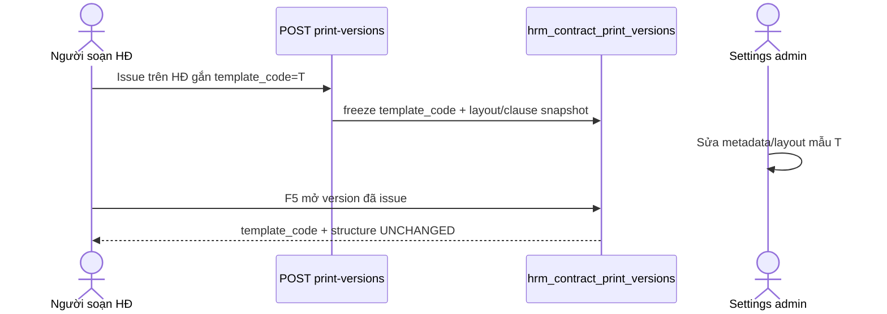

# PO-HRM-DYNAMIC-CONFIG-PLATFORM-CTR-TEMPLATE-BA-01 — AC pack · contract **template open catalog** (`hrm_contract_templates`)

| Field | Value |
|-------|--------|
| **work_item_id** | `PO-HRM-DYNAMIC-CONFIG-PLATFORM-CTR-TEMPLATE-BA-01` |
| **lane** | governance · ba-process |
| **change_mode** | **ADD** (AC wording only) — **no code** `apps/**` · **no seed** (U65) · **no wipe** · **RETAIN** LIVE Nest open catalog |
| **Parent** | `PO-HRM-DYNAMIC-CONFIG-PLATFORM-CTR-TEMPLATE-SA-01` — **CONFIRMED Option B (RETAIN AS-IS LIVE Nest `hrm_contract_templates`)** |
| **Program** | `PO-HRM-CONTINUOUS-W8-20260807` · U88 continuous after CTR-CLAUSE-DOCS ACCEPT |
| **Date** | 2026-08-08 |
| **Status** | **CONFIRMED** — AC-PLT-CTR-TPL-* + VAL matrix authored · ba-data **HOLD** · FE **HOLD** (admin CRUD LIVE) · BE **narrow CNS unlock optional** (KEY wire only) |
| **ref_sa** | [`PO-HRM-DYNAMIC-CONFIG-PLATFORM-CTR-TEMPLATE-SA-01.md`](./PO-HRM-DYNAMIC-CONFIG-PLATFORM-CTR-TEMPLATE-SA-01.md) §4 Option B · §5 L-CTR-TPL-* · §7 invent stamp · §8 OUT · §9 ba-data HOLD · §10 stubs |
| **ref_ba_platform** | [`PO-HRM-DYNAMIC-CONFIG-PLATFORM-BA-01.md`](./PO-HRM-DYNAMIC-CONFIG-PLATFORM-BA-01.md) §3.2 Template CRUD · **AC-PLT-CTR-01/03/04/06** · **BR-CTR-TPL-DYN-01..07** · **BR-PLT-02/03/04/05** |
| **ref_lock** | [`PO-HRM-CONTRACT-LEGAL-PRINT-XEVN-TPL-DYNAMIC-LOCK.md`](./PO-HRM-CONTRACT-LEGAL-PRINT-XEVN-TPL-DYNAMIC-LOCK.md) · [`CORR-01`](./PO-HRM-CONTRACT-LEGAL-PRINT-XEVN-TPL-CORR-01.md) |
| **ref_peer_retain** | CTR-CLAUSE-BA-01 Option B `body_vi` RETAIN — **cấm reopen** · ATT leave-balance CNS-WIRE CLOSED · FE LVRULE **01g HOLD** cite ≠ invent · ATT seals RETAIN |
| **ref_code (verified LIVE)** | `migrations/20260806_contract_legal_print.sql` · `20260807_contract_library_publish.sql` · `contract-legal-print.service.ts` (`createTemplate` · `bootstrapXevnMatrixDrafts` · resolve → freeze) · `contract-legal-print.constants.ts` · FE `ContractLegalPrintSettingsPanel.tsx` («Tạo mẫu #9+») · `ContractPrintSpinePanel.tsx` / `Contracts.tsx` (picker open catalog) |
| **Honesty** | `contracts_printable_ready=false` · `payroll_e2e_ready=false` · **DENIED** module CTR UAT / Phase1 · **`C-SLICE-≠-MODULE`** · U65 zero-seed |
| **must_keep** | issued `hrm_contract_print_versions.template_code` + layout/clause snapshot freeze · UF-HRM-02 nullable template · library publish/pull · DYNAMIC-LOCK / CORR-01 open catalog · clause `body_vi` RETAIN · ATT/EMP/SI/PAY/DEC/MergeToken seals |
| **ack_status** | **PASS_TO_PM** · **CONFIRMED** |

> **HARD EXIT GATE:** this file + evidence written and Shell byte-verified ≥3KB before CONFIRMED. Empty seat = INVALID.

---

## 1. Process objective and actors

**Objective:** Khóa acceptance criteria đo được (U65 browser, zero-seed) cho **mở catalog mẫu hợp đồng** trên Nest LIVE `hrm_contract_templates` — admin CREATE mã 9+ / N+1; starter-8 ≠ ceiling; consumer picker khi catalog EFF>0; invent → **`HRM-CTR-TPL-KEY`**; freeze issued `template_code`. Không migrate SoT, không physicalize, không flip printable, không reopen clause/ATT.

| Actor | Vai trò |
|-------|---------|
| **HCNS / Settings admin** | Tạo/sửa/kích hoạt/soft-retire mẫu (`code`, `name_vi`, `pack_code`, metadata); optional bootstrap starter 8 |
| **Người soạn HĐ (UF-HRM-02)** | CRUD HĐ ± chọn `template_code` active từ picker (nullable must_keep) |
| **Consumer preview / issue** | Resolve active template → freeze `template_code` + structure trên print version |
| **Group publisher** | Publish/pull thư viện mẫu (RETAIN — ngoài AC mutate này) |

**Boundaries:**
- **IN:** AC-PLT-CTR-TPL-01..07 + H · VAL-CTR-TPL-01..06 · UF/J-* · invent KEY lock · GAP vs LIVE.
- **OUT:** DnD `clause_ids` (**cite AC-PLT-CTR-03**) · clause `body_vi` reopen · DOCX GĐ2 · flip printable · mega-EAV · seed · module CTR UAT · invent FE HOLDs (incl. LVRULE 01g).

---

## 2. As-is vs to-be process

| Bước | AS-IS (LIVE evidence) | TO-BE (AC lock) |
|------|-----------------------|-----------------|
| Catalog SoT | Nest `hrm_contract_templates` + UQ `(company_id, lower(code)) WHERE archived_at IS NULL` | **RETAIN** Option B — **FORBIDDEN** Settings/XBOS sole SoT |
| Admin CREATE 9+ | `createTemplate` INSERT open code; FE «Tạo mẫu #9+» LIVE | **AC-PLT-CTR-TPL-01** ≡ **AC-PLT-CTR-01** ≡ AC-CTR-XEVN-11 |
| Starter 8 | `bootstrapXevnMatrixDrafts` upsert `XEVN_*`; FE `missingStarterTemplateCodes` soft warn | **AC-PLT-CTR-TPL-02** ≡ **AC-PLT-CTR-06** — soft warn **≠** block |
| Freeze | `print_versions.template_code` + layout/clause snapshot at issue | **AC-PLT-CTR-TPL-03** ≡ **AC-PLT-CTR-04** |
| Consumer invent | Unknown/inactive code → LIVE **`HRM-CTR-TPL-404`** message | **AC-PLT-CTR-TPL-04** target wire **`HRM-CTR-TPL-KEY`** (narrow BE CNS if not yet distinct) |
| Empty catalog | `HRM-CTR-TPL-NONE` on print paths requiring template; UF-HRM-02 nullable | **AC-PLT-CTR-TPL-06** · U65 no seed |
| Soft-retire | `status=retired` / `archived_at` | **AC-PLT-CTR-TPL-05** · BR-PLT-04 |
| DnD layout | `replaceTemplateClauses` LIVE | **OUT this seat** — cite **AC-PLT-CTR-03** |
| Clause body | Nest `body_vi` peer RETAIN | **OUT** — cấm reopen |

**Kết luận GAP (admin happy-path):** CREATE / list / F5 / picker / freeze / soft-retire / starter soft-warn **LIVE** → **không** mở FE build; **không** ba-data. **GAP hẹp:** invent taxonomy chưa có constant `HRM-CTR-TPL-KEY` (LIVE alias 404) → BE deepen CNS **optional** (xem §8).

---

## 3. Use-case flows (happy · alternate · exception)

### UC-CTR-TPL-CREATE-9 (AC-PLT-CTR-TPL-01)
```mermaid
sequenceDiagram
    actor Admin as HCNS/Settings admin
    participant FE as Settings templates tab
    participant API as POST /contracts/legal-print/templates
    participant DB as hrm_contract_templates
    Admin->>FE: Tạo mẫu #9+ (code HR, pack ∈ configured, name_vi)
    FE->>API: POST createTemplate
    API->>DB: INSERT (UQ + format + pack)
    DB-->>API: row
    API-->>FE: 2xx
    FE-->>Admin: list có row mới
    Admin->>FE: F5
    FE-->>Admin: row còn; form HĐ/picker chọn được mã 9
```
- **Alternate:** activate sau create nếu status draft → vẫn selectable khi `active`.
- **Exception:** slug illegal → `HRM-CTR-TPL-CODE-INVALID` (**≠** «không thuộc 8»); pack mismatch → `HRM-CTR-TPL-PACK-MISMATCH`; trùng code → conflict class.

### UC-CTR-TPL-STARTER-SOFT (AC-PLT-CTR-TPL-02)
- Happy: bootstrap hiện 0..8 starter; sau CREATE 9 catalog **>8**; soft warn thiếu starter **không** disable nút Tạo mẫu.
- Exception FAIL: UI/API hard-block vì ≠8 / not in `XEVN_*`.

### UC-CTR-TPL-ISSUE-FREEZE (AC-PLT-CTR-TPL-03)


### UC-CTR-TPL-CONSUMER-INVENT (AC-PLT-CTR-TPL-04)
- When catalog EFF (active)>0: consumer **chỉ** picker/FK; free-text invent → **`HRM-CTR-TPL-KEY`**.
- Empty EFF: nullable UF-HRM-02 OK; print require-template → `HRM-CTR-TPL-NONE` — **FORBIDDEN** seed 8 để pass UF.

---

## 4. Acceptance criteria (measurable — U65 · zero-seed)

| ID | Persona / UF · J-* | Precondition | Action (FE) | PASS (đo được) | FAIL |
|----|--------------------|--------------|-------------|----------------|------|
| **AC-PLT-CTR-TPL-01** | HCNS · **UF-CTR-TPL-CREATE-9** · **J-HRM-CTR-07** | Settings legal-print templates tab reachable; pack configured | Settings → tab Mẫu → **Tạo mẫu #9+** (code HR đặt ≠ starter list bắt buộc, pack ∈ configured, name_vi tối thiểu) → Lưu | Network `POST …/contracts/legal-print/templates` → **2xx**; list có row; **F5** row còn; form HĐ / print spine **picker chọn được** mã 9; preview bind mã 9 | Reject «không thuộc 8» · FE hardcode chỉ 8 · mất sau F5 · chỉ API PASS không F5/picker |
| **AC-PLT-CTR-TPL-02** | HCNS · **UF-CTR-TPL-STARTER** · J-HRM-CTR-07 (cùng seat) | Optional bootstrap đã/ chưa chạy | Quan sát starter 8 (nếu có); sau TPL-01 assert catalog **>8**; cố tạo thêm khi soft warn thiếu starter | Soft warn (nếu thiếu) **không** chặn CREATE; API không 4xx vì ≠8 | Soft warn / UI / API block vì starter ceiling |
| **AC-PLT-CTR-TPL-03** | Drafter · **UF-CTR-TPL-ISSUE-FREEZE** · **J-HRM-CTR-04** (+ print version) | HĐ gắn mẫu active; đủ điều kiện issue (không mở lại clause AC) | Issue print version → Settings sửa metadata/layout mẫu → F5 mở **version cũ** | Issued giữ `template_code` + structure freeze; draft/issue mới theo template hiện tại | Issued version đổi theo edit template |
| **AC-PLT-CTR-TPL-04** | Consumer · **UF-CTR-TPL-INVENT** · J-HRM-CTR-04 | Catalog active **EFF>0** | Thử bind `template_code` không thuộc catalog (API hoặc bypass picker nếu lộ) | Reject → wire **`HRM-CTR-TPL-KEY`** (target); **không** chấp nhận free-text SoT | Free-text accepted; silent coerce to starter |
| **AC-PLT-CTR-TPL-05** | HCNS · **UF-CTR-TPL-RETIRE** · J-HRM-CTR-07 | Template active không bắt buộc history orphan | Soft-retire mẫu | 2xx; picker **ẩn**; print versions / HĐ history **OK**; F5 giữ retired | Hard-delete làm mồ côi freeze |
| **AC-PLT-CTR-TPL-06** | Drafter · **UF-HRM-02** | — | Tạo/sửa HĐ **không** chọn template → Lưu | CRUD **2xx** + F5 (nullable must_keep) | Force template required |
| **AC-PLT-CTR-TPL-07** | QA · scope | Same company/membership | list templates ↔ get-by-id ↔ create ↔ preview/issue | Cùng scope resolver; **không** 409/404 drift (U19 · L-CTR-TPL-09) | Scope drift list↔id |
| **AC-PLT-CTR-TPL-H** | Governance honesty | — | — | `contracts_printable_ready=false`; **không** module CTR UAT; **không** reopen clause/ATT; **không** DnD/DOCX seat này; U65; **`C-SLICE-≠-MODULE`** | Flip flags · reopen · scope creep · claim module DONE |

### 4.1 Map to platform / CORR AC

| TPL AC | Maps to | Notes |
|--------|---------|-------|
| TPL-01 | **AC-PLT-CTR-01** ≡ **AC-CTR-XEVN-11** | Admin CREATE 9th |
| TPL-02 | **AC-PLT-CTR-06** ≡ AC-CTR-XEVN-01 revised | Starter ≠ ceiling |
| TPL-03 | **AC-PLT-CTR-04** | Issued freeze |
| TPL-04 | **BR-PLT-02** · SA invent KEY | Consumer invent |
| TPL-05 | **BR-PLT-04** | Soft-retire |
| TPL-06 | **UF-HRM-02** must_keep | Nullable template |
| TPL-07 | U19 · L-CTR-TPL-09 | Scope parity |
| — | **AC-PLT-CTR-03** | **OUT** DnD — cite only, **not** authored as TPL-* |

### 4.2 Validation matrix (VAL-CTR-TPL-*)

| VAL | Điều kiện | Kỳ vọng | FAIL |
|-----|-----------|---------|------|
| **VAL-CTR-TPL-01** | Admin CREATE code empty / illegal charset/slug | `HRM-CTR-TPL-CODE-INVALID` — **format only** | Message/code «not in starter 8» |
| **VAL-CTR-TPL-02** | Admin CREATE `pack_code` ∉ configured / matrix pack mismatch | `HRM-CTR-TPL-PACK-MISMATCH` | 500 / silent accept |
| **VAL-CTR-TPL-03** | Consumer invent when EFF>0 | **`HRM-CTR-TPL-KEY`** | Accept invent as SoT |
| **VAL-CTR-TPL-04** | Print/preview require template + EFF=0 | `HRM-CTR-TPL-NONE` + CTA admin — **no seed** | Seed 8 để pass |
| **VAL-CTR-TPL-05** | GET template by id miss (scope OK, row absent) | `HRM-CTR-TPL-404` — **≠** invent KEY class | Confuse 404 với invent KEY |
| **VAL-CTR-TPL-06** | Soft-retire then picker list default | Retired hidden; history FK OK | Hard-delete / history break |

### 4.3 Invent KEY wire decision (LOCKED)

| Class | Wire | When |
|-------|------|------|
| **Invent (consumer free-text / unknown code as SoT)** | **`HRM-CTR-TPL-KEY`** | Catalog active EFF>0 và code không thuộc catalog |
| **Resolve miss by id** | `HRM-CTR-TPL-404` | GET `templates/{id}` không thấy trong scope |
| **Empty catalog require-template** | `HRM-CTR-TPL-NONE` | Không có active template cho print path bắt buộc |

**AS-IS LIVE note:** unknown/inactive `template_code` trên preview hiện emit **`HRM-CTR-TPL-404`**. AC **không** chấp nhận 404 làm taxonomy invent lâu dài — **một wire / một điều kiện**. Gap hẹp → BE CNS ADD constant + map invent → KEY; giữ 404 cho get-by-id. **FORBIDDEN** alias vĩnh viễn không ghi evidence.

**Temporary QA bridge (optional):** nếu BE chưa ship KEY, QA ghi **🟡 residual** «invent still 404» — **không** 🟢 TPL-04 / VAL-03 cho đến khi wire KEY hoặc waiver owner+expiry (PM).

---

## 5. Business rule table

| BR | Condition | Action | Outcome |
|----|-----------|--------|---------|
| **BR-CTR-TPL-DYN-01** | List templates | Open catalog `status=active` (+ retired hidden) | Picker/API không hardcode 8 |
| **BR-CTR-TPL-DYN-02** / **BR-PLT-05** | Bootstrap starter | Upsert 8 `XEVN_*` optional | **≠ ceiling** |
| **BR-CTR-TPL-DYN-03** / L-CTR-TPL-04 | Invalid slug | `CODE-INVALID` | Never «not in 8» |
| **BR-CTR-TPL-DYN-04/05** / L-CTR-TPL-05 | Pack rules | Validate pack ∈ configured | `PACK-MISMATCH` |
| **BR-CTR-TPL-DYN-06** / **BR-PLT-03** / L-CTR-TPL-06 | Issue | Freeze `template_code` + structure | Later edit ≠ mutate issued |
| **BR-PLT-02** / L-CTR-TPL-02 | EFF>0 | Consumer picker/FK only | Invent → **HRM-CTR-TPL-KEY** |
| **BR-PLT-04** / L-CTR-TPL-07 | Retire | Soft only | History OK |
| **L-CTR-TPL-08** | UF-HRM-02 | Template optional | Nullable CRUD OK |
| **L-CTR-TPL-01** | SoT | Nest only | Settings/XBOS ≠ sole SoT |

---

## 6. UF / J-* enumeration (U65 browser evidence template)

| UF-ID | Click path (minimum) | Linked J-* | AC |
|-------|----------------------|------------|-----|
| **UF-CTR-TPL-CREATE-9** | Login HCNS/CEO → Settings → Hợp đồng / Legal-print → tab **Mẫu** → **Tạo mẫu #9+** → Lưu → quan sát list → **F5** → mở HĐ → picker chọn mã 9 | **J-HRM-CTR-07** | TPL-01 |
| **UF-CTR-TPL-STARTER** | Cùng Settings tab — quan sát soft warn starter (nếu thiếu) + CREATE vẫn được | J-HRM-CTR-07 | TPL-02 |
| **UF-CTR-TPL-PICK-PREVIEW** | Hợp đồng → tạo/sửa → chọn template (starter **hoặc** mã 9) → preview khác nhau theo mã | **J-HRM-CTR-04** | TPL-01 consumer side |
| **UF-CTR-TPL-ISSUE-FREEZE** | Issue print version → Settings sửa mẫu → F5 version cũ | J-HRM-CTR-04 (+ print spine) | TPL-03 |
| **UF-CTR-TPL-INVENT** | EFF>0 — thử code lạ (DevTools/API) → expect KEY | J-HRM-CTR-04 | TPL-04 · VAL-03 |
| **UF-CTR-TPL-RETIRE** | Soft-retire → picker ẩn → history OK | J-HRM-CTR-07 | TPL-05 |
| **UF-HRM-02** | Tạo/sửa HĐ **không** template → Lưu → F5 | J-HRM-03 (must_keep) | TPL-06 |

**Persona:** `ceo@xe.vn` / HCNS Settings admin tương đương pilot.  
**Honesty:** mọi UF **≠** chứng minh `contracts_printable_ready=true`.

**Journey map note (U19):** `J-HRM-CTR-07` đã DRAFT trên `PROGRAM_JOURNEY_MAP.md` — BA **RETAIN** id; không invent J-* mới trừ khi ba-docs mở. Cross-nav AC: list template → mở chi tiết/sửa mẫu load được (same Settings pane).

---

## 7. Explicit DENY / OUT (seat)

| DENY | Rule |
|------|------|
| DOCX binary GĐ2 | OUT |
| DnD reorder `clause_ids` | OUT — **cite peer AC-PLT-CTR-03** (không author TPL-DnD) |
| Reopen clause `body_vi` / CTR-CLAUSE L1 | FORBIDDEN — peer RETAIN |
| Flip `contracts_printable_ready` / `payroll_e2e_ready` | FORBIDDEN |
| Reopen ATT leave-balance / ATT L1 / invent FE LVRULE 01g | FORBIDDEN — **cite HOLD**, không DEFINE |
| Seed / `pnpm seed:*` để có 9th hoặc starter | FORBIDDEN U65 |
| Mega-EAV / second template table / Settings sole SoT | REJECT A·C |
| Module CTR UAT / Phase1 DONE / empty seat | DENIED |
| FE hardcode starter-8 list as sole picker | FAIL TPL-01 |

---

## 8. GAP analysis vs LIVE — gates

| Surface | LIVE? | GAP? | Gate |
|---------|-------|------|------|
| Nest table + UQ + status + layout_json | Yes (`20260806`) | **NO** | ba-data **HOLD** |
| Lineage / library publish | Yes (`20260807`) | **NO** | RETAIN |
| `createTemplate` 9+ | Yes (service + controller) | **NO** | BE HOLD schema |
| Starter bootstrap ≠ ceiling | Yes | **NO** | — |
| Freeze `print_versions.template_code` | Yes | **NO** | must_keep |
| FE Settings «Tạo mẫu #9+» + open list | Yes (`ContractLegalPrintSettingsPanel`) | **NO** build | FE **HOLD** |
| FE HĐ / print spine picker open catalog | Yes (`ContractPrintSpinePanel` · `Contracts.tsx`) | **NO** build | FE **HOLD** |
| Soft warn missing starter | Yes (`missingStarterTemplateCodes`) | Verify-only | QA |
| Invent wire **`HRM-CTR-TPL-KEY`** | **ABSENT** (LIVE uses `HRM-CTR-TPL-404` for unknown code) | **YES — narrow CNS** | Optional **dev-be** unlock §8.1 |
| Scope parity | Assumed LIVE via list scope | Verify jest | QA VAL-07 |

### 8.1 Conditional BE unlock (narrow)

| Item | Value |
|------|--------|
| work_item (if PM opens) | `PO-HRM-DYNAMIC-CONFIG-PLATFORM-CTR-TEMPLATE-BE-01` |
| Scope | ADD constant `HRM-CTR-TPL-KEY` · map consumer invent when EFF>0 → KEY · **keep** `HRM-CTR-TPL-404` for get-by-id miss · **keep** `HRM-CTR-TPL-NONE` empty |
| Forbidden | Schema migrate · Settings SoT · reopen clause · flip printable · mega-EAV · seed |
| Default nếu PM chưa mở | BE **HOLD**; TPL-04/VAL-03 = residual 🟡 |

**ba-data:** **HOLD confirmed** — không physicalize; không `PO-HRM-DYNAMIC-CONFIG-PLATFORM-CTR-TEMPLATE-DATA-01` trừ khi future AC đòi cột net-new (FORBIDDEN dual table).

**FE:** **HOLD** — không invent FE HOLDs; không mở LVRULE 01g.

---

## 9. Handoff package

| Owner | Expectation | Done when |
|-------|-------------|-----------|
| **PM** | Seal AC pack; quyết định BE-KEY narrow vs QA first | Bus PASS_TO_PM + honesty false |
| **dev-be** (optional) | KEY wire CNS only | Jest invent → KEY; 404 get-by-id unchanged |
| **QA** (when PM opens) | UF/J-* U65 browser per §6; no seed | Evidence URL+click+Network+F5 per AC |
| **ba-data** | HOLD | No DATA-01 |
| **dev-fe** | HOLD | Only if QA proves UX wiring gap on Tạo mẫu #9 |

---

## 10. Assumptions · dependencies · clarifications

- **Assumption:** CORR-01 / DYNAMIC-LOCK SUPERSEDE closed-8 vẫn hiệu lực; packs `GENERAL|IT_OFFICE|DRIVER|LOGISTICS` configured RETAIN.
- **Dependency:** CTR-CLAUSE `body_vi` RETAIN; print-spine GWC slice RETAIN — **không** reopen.
- **Cite peer:** ATT leave-balance CNS-WIRE CLOSED; FE LVRULE **01g HOLD** — không đụng.
- **Open non-blocking:** ba-docs có thể sync BA_TRACE J-HRM-CTR-07 wording với TPL-* ids (không chặn seat này).

---

## 11. Honesty

| Flag | Value |
|------|-------|
| `contracts_printable_ready` | **false** |
| `payroll_e2e_ready` | **false** |
| Module CTR UAT / Phase1 | **DENIED** |
| DnD / DOCX GĐ2 | **OUT** (cite AC-PLT-CTR-03) |
| `C-SLICE-≠-MODULE` | **RETAIN** |
| Seals reopened | **NONE** |
| This seat | Docs-only AC pack (ADD) |

---

## 12. Completion contract

| Field | Value |
|-------|--------|
| **completion_report** | CONFIRMED AC-PLT-CTR-TPL-01..07+H + VAL-01..06 from SA Option B stubs; map 01→AC-PLT-CTR-01, 02→06, 03→04; invent KEY **`HRM-CTR-TPL-KEY`** LOCK (LIVE 404 = narrow BE CNS gap optional); UF/J-* enumerated (J-HRM-CTR-07/04 · UF-HRM-02); ba-data HOLD; FE HOLD (LIVE); DENY DnD/DOCX/reopen clause·ATT/flip/seed/mega-EAV; honesty false · C-SLICE. |
| **next_owner** | **pm** |
| **ack_status** | **PASS_TO_PM** · **CONFIRMED** |
| **evidence_path** | `docs/qa/evidence/po-hrm-dynamic-config-platform-ctr-template-ba-01.md` |
