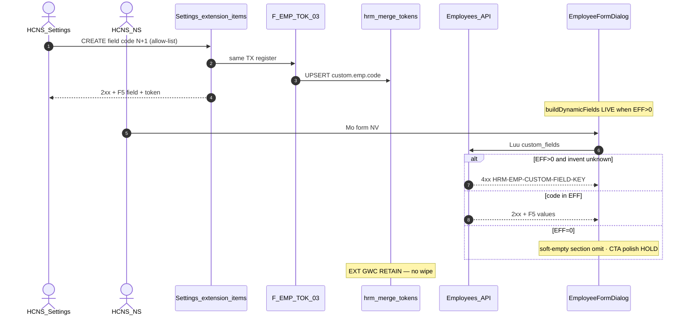

# PO-HRM-DYNAMIC-CONFIG-PLATFORM-EMP-CUSTOM-FIELD-FE-SA-01 — Option/F.1 · EMP custom-field **consumer FE residual** disposition (after CNS L1 GWC + DOCS)

| Field | Value |
|-------|--------|
| **work_item_id** | `PO-HRM-DYNAMIC-CONFIG-PLATFORM-EMP-CUSTOM-FIELD-FE-SA-01` |
| **Parent** | EMP-CUSTOM-FIELD-QC-01 **GWC** L1 CNS invent KEY · stamp **`EMPCFQA-MSK14LUH`** · GAP **`EMPCFCNSGAP-MSJCUBJB` CLOSED** · DOCS-01 **ACCEPT** SRS **v0.31** · HDSD **CH06d** · residual **R-EMP-CF-FE-01** P2 HOLD (empty CTA / picker deepen) |
| **U88 context** | After **SI-FE-ADMIN-NOTES-SA-01** Option A HOLD sealed (`R-PLT-SI-FE-ADMIN-01` · SPEC 40113) · continuous board EMP-CF **consumer FE** unlock-vs-HOLD · **≠** FE-ADMIN notes packs (EMP/ATT/SI already HOLD) |
| **Program** | `PO-HRM-CONTINUOUS-W8-20260807` |
| **lane** | governance · sa · **docs-only** · **NO** `apps/**` |
| **change_mode** | **ADD** Option/F.1 disposition for **consumer FE P2 residual** only · **no wipe** EMP-CUSTOM CNS L1 · MergeToken EXT · EMP ST/POS/DEPT FE CLOSED · FE-ADMIN HOLDs · ATT/SI/CTR seals · LVRULE HOLD |
| **Date** | 2026-08-08 |
| **Status** | **CONFIRMED** — Option **B** **LOCKED** · **ACCEPT_AS_IS_P2 HOLD** on minted **`R-PLT-EMP-CF-FE-01`** · ba-process **HOLD** (AC-PLT-EMP-CUSTOM-01* already CONFIRMED) · FE/BE **HOLD** (no closable consumer mount/persist GAP) · next_owner **pm** |
| **residual_id** | **`R-PLT-EMP-CF-FE-01`** *(minted this seat — supersedes informal `R-EMP-CF-FE-01` note from QA/QC; KEEP HOLD ≠ CLOSED ≠ WAIVED)* |
| **prior_sa** | [`EMP-CUSTOM-FIELD-SA-01`](./PO-HRM-DYNAMIC-CONFIG-PLATFORM-EMP-CUSTOM-FIELD-SA-01.md) Option **A** Settings extension-items = open field-def SoT — **RETAIN · do not wipe** |
| **prior_ba** | [`EMP-CUSTOM-FIELD-BA-01`](./PO-HRM-DYNAMIC-CONFIG-PLATFORM-EMP-CUSTOM-FIELD-BA-01.md) **AC-PLT-EMP-CUSTOM-01*** CONFIRMED · VAL-EMP-CF-CNS-* · **RETAIN** |
| **prior_be_qa_qc** | BE-01 READY · QA-01 PASS **`EMPCFQA-MSK14LUH`** · QC-01 **GWC** · invent **422** `HRM-EMP-CUSTOM-FIELD-KEY` · Nest `emp_custom_field` **ABSENT** — **RETAIN** |
| **prior_docs** | DOCS-01 ACCEPT SRS v0.31 CH06d — client wording locked · **FE P2 HOLD** noted · **did not invent FE Task** |
| **prior_ext** | MergeToken EMP EXT QC **`EMPTOKEXTQA-MSJ57PE1`** · **`R-EMP-TOK-EXT` SEALED** — **RETAIN / FORBIDDEN reopen** |
| **peer_cite_unlock** | [`EMP-STATUS-FE-SA-01`](./PO-HRM-DYNAMIC-CONFIG-PLATFORM-EMP-STATUS-FE-SA-01.md) · [`EMP-POSITION-FE-SA-01`](./PO-HRM-DYNAMIC-CONFIG-PLATFORM-EMP-POSITION-FE-SA-01.md) · [`EMP-DEPT-FE-SA-01`](./PO-HRM-DYNAMIC-CONFIG-PLATFORM-EMP-DEPT-FE-SA-01.md) Option **A UNLOCK** — **cite class only when closable Nest/Settings EFF unbound gap exists** |
| **peer_cite_hold** | [`CTR-TEMPLATE-FE-SA-01`](./PO-HRM-DYNAMIC-CONFIG-PLATFORM-CTR-TEMPLATE-FE-SA-01.md) Option **B ACCEPT_AS_IS** · [`SI-FE-ADMIN-NOTES-SA-01`](./PO-HRM-DYNAMIC-CONFIG-PLATFORM-SI-FE-ADMIN-NOTES-SA-01.md) Option **A ACCEPT_AS_IS** · [`EMP-FE-ADMIN-NOTES-SA-01`](./PO-HRM-DYNAMIC-CONFIG-PLATFORM-EMP-FE-ADMIN-NOTES-SA-01.md) HOLD — **cite when LIVE + no closable gap** |
| **Honesty** | `hrm_personnel_uat_ready=false` · `employees_e2e_linkage_ready=false` · `contracts_printable_ready=false` · **`C-SLICE-≠-MODULE`** · U65 · **DENIED** module EMP UAT · Phase1 · seed · flip personnel · reopen EXT · reopen EMP ST/POS/DEPT FE CLOSED · reopen FE-ADMIN HOLDs as unlock · invent Nest `emp_custom_field` · invent LVRULE |
| **must_keep** | Settings extension SoT Option A · F-EMP-TOK-03 / `custom.emp.*` · `HRM-EMP-CUSTOM-FIELD-KEY` L1 · Nest field-def ABSENT · EMP ST/POS/DEPT FE CLOSED · FE-ADMIN HOLDs · EXT seal · ATT/SI/CTR · LVRULE HOLD · honesty false |
| **ack_status** | **PASS_TO_PM** · **CONFIRMED** · Option **LOCKED** |

> **HARD EXIT GATE:** this file WriteAllText NFD · Shell **Length ≥ 8192** verified before CONFIRMED. Empty turn = INVALID-HANDOFF.

---

## 1. Decision context (ADR option evaluation)

| | |
|--|--|
| **Decision title** | Disposition for EMP **custom-field consumer FE residual** after CNS L1 invent KEY GWC + DOCS ACCEPT — UNLOCK consumer deepen vs ACCEPT_AS_IS HOLD vs invent/reject |
| **Requestor** | pm · U88 continuous · after SI-FE-ADMIN-NOTES Option A HOLD sealed · board residual EMP-CF FE P2 |
| **Decision owner** | sa |
| **Related** | AC-PLT-EMP-CUSTOM-01 / 01b / 01c / 01d / 01e / 01H · VAL-EMP-CF-CNS-01/02 · BR-PLT-01/02/04/05 · L-EMP-CF-01..13 · F-EMP-CF-01..03 · F-EMP-CF-CNS-01 · F-EMP-TOK-03 · informal `R-EMP-CF-FE-01` |
| **Template** | `.cursor/templates/ADR_OPTION_TEMPLATE.md` §§1–7 + F.1 |
| **Board** | `docs/program/PO_HRM_CONTINUOUS_W8_20260807.md` |

### 1.1 Problem — what residual remains after L1 + DOCS

Prior seats already locked:

| Seat | Verdict | Residual left for *this* seat? |
|------|---------|--------------------------------|
| EMP-CUSTOM-FIELD-SA-01 | Option **A LOCKED** — Settings `hrm_catalog_extension_items` = open field-def SoT · Nest field-def **FORBIDDEN** | Architecture SoT **CLOSED** — **do not wipe / do not redefine** |
| EMP-CUSTOM-FIELD-BA-01 | AC-PLT-EMP-CUSTOM-01* CONFIRMED · VAL-EMP-CF-CNS-* · ba-data HOLD | AC wording **CLOSED** — ba-process **HOLD** this seat |
| EMP-CUSTOM-FIELD-BE-01 | `HRM-EMP-CUSTOM-FIELD-KEY` wire READY · assert helper LIVE | BE CNS invent **CLOSED** at L1 |
| QA-01 / QC-01 | PASS / **GWC** stamp `EMPCFQA-MSK14LUH` · GAP CLOSED · Nest ABSENT | Invent KEY Network **SEALED** — **cấm reopen** |
| DOCS-01 | SRS v0.31 + HDSD CH06d **ACCEPT** · FE P2 HOLD noted | Client docs **CLOSED** · **did not invent FE** |
| MergeToken EXT | `EMPTOKEXTQA-MSJ57PE1` · `R-EMP-TOK-EXT` SEALED | **RETAIN** — **FORBIDDEN reopen** |
| Board FE residual | Named: *empty EFF CTA / extension picker deepen* (`R-EMP-CF-FE-01`) | **THIS seat** — FE Option/F.1 only · **consumer** class · **≠** FE-ADMIN notes |

**Question for F.1:** Is there a **closable consumer FE mount/persist GAP** on Employee form (and/or Settings producer path) that warrants Option **A UNLOCK** → `dev-fe` (peer EMP-STATUS/POSITION/DEPT), or is the residual **ACCEPT_AS_IS_P2 HOLD** (admin LIVE + consumer already mounts/persists extension fields + L1 KEY LIVE + empty CTA = P2 polish defer)?

### 1.2 Class discrimination (critical — do not confuse packs)

| Class | Example | When UNLOCK? | This EMP-CF FE residual? |
|-------|---------|--------------|--------------------------|
| **Consumer Nest EFF rebind** | EMP-STATUS / POSITION / DEPT / ATT-CODE | Surface LIVE + Nest/Settings EFF LIVE + AC picker locked BUT FE hardcode / unbound / form-gate omit | **NO** — custom fields already bind Settings `effectiveItems` via `buildDynamicFields` |
| **Consumer mount ABSENT / persist broken** | EMP-DEPT FE-02 `custom_fields.department` wire; EMP-STATUS Select ABSENT | Closable product gap → unlock `dev-fe` | **NO** — dynamic fields mount when EFF>0 · persist `custom_fields` LIVE |
| **FE-ADMIN ABSENT / notes pack** | ATT FE-ADMIN · EMP ST Nest admin · LVRULE 01g | ACCEPT_AS_IS HOLD (not this seat's primary class) | **OUT** — FE-ADMIN packs already HOLD separately · **FORBIDDEN reopen as unlock** |
| **FE-ADMIN LIVE + consumer LIVE + no gap** | CTR-TEMPLATE FE · SI FE-ADMIN notes (admin side) | ACCEPT_AS_IS HOLD | **YES — THIS class for consumer residual** |
| **Invent / reopen / flip** | Nest `emp_custom_field` · reopen EXT · flip personnel | REJECT Option C | REJECT |

**Mission lock:** This seat = **consumer FE P2 residual** for custom fields. **Do NOT** confuse with FE-ADMIN notes packs (EMP/ATT/SI already HOLD). **Do NOT** reopen EMP ST/POS/DEPT FE CLOSED.

### 1.3 READ-ONLY apps/web audit (cited — no edit)

#### A. Where field definitions are **authored** (FE-ADMIN / Settings producer)

| Surface | Path / symbol | LIVE? | Role |
|---------|---------------|------:|------|
| Definition SoT (SA Option A) | Nest-served Settings `hrm_catalog_extension_items` on allow-list EMP field catalogs | **YES** | Open catalog field-def SoT — **must_keep** |
| API client append | `apps/web/hrm/src/integrations/hrmApi.ts` — `appendSettingsCatalogExtensionItems` → `POST …/settings-catalogs/:catalogKey/extension-items` | **YES** | Extension-items physical path (F-EMP-CF-02 class) |
| API client upsert | `hrmApi.ts` — `upsertSettingsCatalogItem` → `POST …/settings-catalogs/items` | **YES** | SettingsCatalogsTab mutate path |
| Soft-retire / removal request | `requestSettingsCatalogFieldRemoval` · SettingsCatalogsTab remove mutation | **YES** | Soft path (BR-PLT-04 class) |
| Settings catalogs UI | `apps/web/hrm/src/components/settings/SettingsCatalogsTab.tsx` — sync XBOS · append code/label · badge `hrmExtensionItems.length` · table of extension rows | **YES** | **FE-ADMIN LIVE** for EMP field catalogs (UF-HRM-10) |
| Settings mount | `apps/web/hrm/src/pages/Settings.tsx` — `TabsTrigger value="catalogs"` · `TabsContent` → `SettingsCatalogsTab` | **YES** | Product admin route **MOUNTED** |
| Master-data buckets (peer) | `MasterDataSettingsPanel.tsx` — «Thêm / cập nhật mục (extension HRM)» | **YES** | Orthogonal MD buckets — cite only · **≠** Nest field-def invent |
| Nest `emp_custom_field` / field-def UI | grep apps/web + prior QC | **ABSENT** | Option A **RETAIN** — **FORBIDDEN invent** |

**FE-ADMIN class verdict:** Settings catalogs tab **PRESENT** with open append of HRM extension items (incl. allow-list EMP field catalogs), sync, removal request. This is **≠** ATT FE-ADMIN ABSENT class. Residual is **not** «invent Settings admin for custom fields».

#### B. Where extension fields are **consumed** (Employee form bind / persist)

| Surface | Path / symbol | LIVE? | Role |
|---------|---------------|------:|------|
| Catalog overview hook | `useSettingsCatalogsOverview({ enabled: open })` in `EmployeeFormDialog.tsx` | **YES** | Loads EMP field catalogs when dialog open |
| Allow-list find | `findCatalog(…, ['hrm_employee_basic_fields','employee_basic_fields'])` (+ personal/work/finance) | **YES** | L-EMP-CF-02 allow-list |
| Dynamic field builder | `buildDynamicFields` — filters `effectiveItems` active · excludes DEFAULT_* core codes · parses `unit` meta (text/select/…) | **YES** | **Consumer mount SoT** = Settings effective extension codes |
| Dynamic state | `dynamicFieldValues` · hydrate `employee.custom_fields` on edit (~L549) | **YES** | Edit restore LIVE |
| Render mount | `dynamicBasicFields` / `dynamicPersonalFields` / `dynamicWorkFields` / `dynamicFinanceFields` sections — Input/Select when `length > 0` | **YES** | **Mount LIVE when EFF>0** |
| Persist write | `handleSubmit` → `Object.entries(dynamicFieldValues)` → `custom_fields` on create/update payload (~L746–799) | **YES** | **Persist LIVE** |
| Mutations | `useEmployeeMutations.ts` passes `custom_fields` (avatar/dept merges orthogonal) | **YES** | Wire RETAIN |
| BE invent KEY | `emp-custom-field-consumer-assert.ts` · employees.service · L1 `EMPCFQA-MSK14LUH` | **YES SEALED** | Consumer invent → **422** `HRM-EMP-CUSTOM-FIELD-KEY` |
| Client invent KEY assert | QA spot · EmployeeFormDialog | **NO** | Optional toast polish — **≠** mount/persist gap (BE already gates) |
| Empty EFF CTA (AC-01d) | Dynamic sections gated `length > 0` → when EFF=0 section **omitted** (implicit soft-empty); **no** dedicated «Mở Cài đặt → trường mở rộng» banner on empty extension block | **PARTIAL polish** | Soft-empty behavior present · explicit CTA copy = **P2 defer** · **≠** EMP-STATUS hardcode unbound |
| Nested CatalogSearchPicker emptyHint | dept / position / employment_type pickers | **YES** | **Orthogonal** ST/POS/DEPT/ET catalogs — **already CLOSED FE** · **FORBIDDEN reopen** as EMP-CF unlock |

**Consumer class verdict:** Employee form **already mounts** extension fields from Settings `effectiveItems` when active defs exist, **hydrates** edit values, and **persists** non-empty values into `employee.custom_fields`. This is **≠** EMP-STATUS (Settings-MD/hardcode-3 unbound to Nest EFF) and **≠** EMP-POSITION/DEPT (form-gate omit picker). **No closable mount/persist gap** for Option A UNLOCK.

#### C. Empty EFF / CTA discrimination (AC-01d)

| Signal | AS-IS | Closable UNLOCK gap? |
|--------|-------|----------------------|
| EFF>0 dynamic fields appear | `buildDynamicFields` + render | **NO** — LIVE |
| EFF=0 no invent fields shown | `length > 0` guard · section absent | Soft-empty **implicit PASS class** |
| Explicit CTA link to Settings catalogs | Not on empty extension block | **P2 polish** only — BA VAL-EMP-CF-CNS-02 «FE CTA GAP verify» remains **HOLD note** · not product FAIL equivalent to unbound Select |
| Seed density when empty | Forbidden U65 | **RETAIN** — no FE invent density |
| Invent assert skip when EFF=0 | BE L1 class · QA did not force empty | **RETAIN** BE · not FE unlock driver |

#### D. Orthogonal / DENY reopen (must_keep)

| Peer | Status | This seat |
|------|--------|-----------|
| EMP-STATUS FE `EMPSTQAFE2-MSKE3NV1` | **CLOSED** | **FORBIDDEN reopen** |
| EMP-POSITION FE `EMPPOSQCFE-8DEF5536` | **CLOSED** | **FORBIDDEN reopen** |
| EMP-DEPT FE Condition | **CLOSED** (custom_fields.department wire) | **FORBIDDEN reopen** · cite only that `custom_fields` map is shared storage |
| EMP FE-ADMIN notes `R-PLT-EMP-FE-ADMIN-01` | **HOLD** | **FORBIDDEN reopen as unlock** |
| ATT / SI FE-ADMIN notes | **HOLD** | **FORBIDDEN reopen as unlock** |
| MergeToken EXT `R-EMP-TOK-EXT` | **SEALED** | **FORBIDDEN reopen** |
| LVRULE FE-01g | **HOLD** | **FORBIDDEN invent unlock** |
| Nest `emp_custom_field` | **ABSENT** | **FORBIDDEN invent** |

### 1.4 Board audit — unlock gate checklist

| Candidate gap | Evidence | Verdict |
|---------------|----------|---------|
| Consumer dynamic fields ABSENT when EFF>0 | EmployeeFormDialog `buildDynamicFields` + tab sections | **LIVE** — no unlock |
| Persist `custom_fields` missing on Lưu | `handleSubmit` builds `custom_fields` · mutations wire | **LIVE** — no unlock |
| Hardcode closed enum as sole SoT for extension codes | No closed extension enum Select; free Input/Select from catalog meta | **N/A** — not STATUS/ATT-CODE class |
| Form-gate omits entire extension surface | Extensions independent of `buildActiveFieldSet` required[] | **N/A** — not POSITION/DEPT gate class |
| Admin Settings extension CRUD ABSENT | SettingsCatalogsTab + API clients LIVE | **LIVE** — no admin invent |
| L1 invent KEY missing | `EMPCFQA-MSK14LUH` 422 KEY | **SEALED** — no BE reopen |
| Empty CTA deepen | Implicit soft-empty · explicit CTA polish | **P2 HOLD** — ACCEPT_AS_IS |
| FE-ADMIN notes pack confusion | Separate residuals already HOLD | **OUT** this seat |

**Conclusion:** READ-ONLY audit finds **no closable consumer FE mount/persist gap**. Residual class = **P2 defer / ACCEPT_AS_IS** after admin LIVE + consumer LIVE + L1 KEY SEALED + DOCS ACCEPT → prefer Option **B** · mint **`R-PLT-EMP-CF-FE-01` HOLD** · **next_owner=pm** (not `dev-fe`).

### 1.5 Constraints

- Docs-only · **no** `apps/**` · **no** seed (U65)
- **DENY** reopen EMP ST/POS/DEPT FE CLOSED
- **DENY** invent Nest dual / `emp_custom_field` / mega-EAV
- **DENY** unlock LVRULE 01g · flip printable/personnel · reopen FE-ADMIN HOLDs as unlock
- **DENY** reopen MergeToken EXT · ATT/SI/CTR · EMP-CUSTOM CNS L1
- **DENY** claim module EMP UAT / Phase1 / UF 🟢 from this disposition
- BA AC pack already CONFIRMED — this seat is **disposition only**, not redefine Option A SoT

### 1.6 Decision heuristic

| Rule | Application |
|------|-------------|
| Closable mount/persist gap + peer EMP-STATUS class → UNLOCK Option A → `dev-fe` | **Not met** |
| Admin LIVE + consumer LIVE + L1 KEY LIVE + residual = empty CTA polish → ACCEPT_AS_IS Option B → `pm` | **Met** |
| FE-ADMIN ABSENT notes → HOLD (peer ATT) | Cite only — **not** this residual (admin LIVE) |
| REJECT invent Nest / reopen seals / flip UAT | Option **C** |

---

## 2. Options

### Option A — UNLOCK FE consumer deepen (peer EMP-STATUS / POSITION / DEPT) — **REJECT as default**

| | |
|--|--|
| **Description** | Treat informal `R-EMP-CF-FE-01` as **named Condition closable** via `dev-fe` ADD-only: invent empty-EFF CTA banner linking Settings catalogs; optional client-side invent KEY toast mapping `HRM-EMP-CUSTOM-FIELD-KEY`; «picker deepen» for extension fields; possibly force remount paths «while at it». |
| **Benefits** | HDSD CH06d empty CTA copy more explicit; board residual line clears via execution. |
| **Costs** | FE Task + QA-FE + QC-FE for **polish** without mount/persist FAIL evidence; risk scope-creep into FE-ADMIN / ST-POS-DEPT reopen / Nest field-def UI. |
| **Risks** | Mis-classifies LIVE consumer as EMP-STATUS unbound gap → unnecessary churn · sponsor sees «another EMP FE wave» while L1+DOCS already ACCEPT · C-SLICE drift if claimed as UAT progress. |
| **Gate** | **Reject as default** — unlock heuristic requires **closable mount/persist gap**; audit finds **none**. Retain A only if sponsor **explicitly** opens EMP-CF empty-CTA FE wave. |

### Option B — ACCEPT_AS_IS_P2 HOLD · mint `R-PLT-EMP-CF-FE-01` — **RECOMMEND / LOCK**

| | |
|--|--|
| **Description** | Mint platform residual **`R-PLT-EMP-CF-FE-01`** = **P2 HOLD / NOTE** forever-until-sponsor (peer CTR-TEMPLATE-FE / SI-FE-ADMIN ACCEPT_AS_IS class for «LIVE + no closable gap»). Keep AC-01d empty CTA as deferred polish note. **Do not** dispatch `dev-fe`. Retain consumer mount/persist + Settings admin + L1 KEY + EXT seal as **CLOSED/RETAIN**. Supersede informal `R-EMP-CF-FE-01` naming with `R-PLT-EMP-CF-FE-01` for board continuity. |
| **Benefits** | Honest board state; zero FE churn; protects sealed L1/EXT/EMP FE CLOSED peers; aligns U88 continuous without inventing polish Tasks; matches QC «no FE invent this GWC» + DOCS «FE P2 HOLD». |
| **Costs** | Explicit Settings CTA banner remains optional until sponsor wave; client KEY toast optional. |
| **Risks** | Misread HOLD as «consumer ABSENT» or as FE-ADMIN class — mitigate with audit table §1.3 + discrimination §1.2. Misread HOLD as WAIVED AC-01d — mitigate: HOLD ≠ CLOSED ≠ WAIVED · AC RETAIN deferred polish. |
| **Gate** | L1 `EMPCFQA-MSK14LUH` RETAIN · DOCS CH06d RETAIN · EXT RETAIN · honesty false · C-SLICE. |

### Option C — Hybrid invent Nest / reopen seals / flip personnel / reopen FE-ADMIN as unlock

| | |
|--|--|
| **Description** | Invent Nest `emp_custom_field` + FE dual SoT; reopen MergeToken EXT; reopen EMP ST/POS/DEPT FE CLOSED; reopen EMP/ATT/SI FE-ADMIN HOLD as unlock; invent LVRULE; flip `hrm_personnel_uat_ready` / claim module EMP UAT / seed density. |
| **Benefits** | None for GĐ1 honesty. |
| **Costs** | Seal churn · dual SoT · sponsor trust · C-SLICE violation. |
| **Risks** | **REJECT** — DENY Nest invent · DENY reopen EXT/EMP FE CLOSED/FE-ADMIN · DENY LVRULE invent · DENY ready flip · DENY seed · DENY module EMP UAT. |

---

## 3. Trade-off matrix

| Criteria | Weight | **A UNLOCK FE** | **B ACCEPT_AS_IS HOLD** | **C Invent/reopen** |
|----------|-------:|----------------:|------------------------:|--------------------:|
| Honesty / seal safety (EXT · EMP FE CLOSED · L1) | 5 | 2 | **5** | 0 |
| Match AS-IS (LIVE mount+persist) | 5 | 1 | **5** | 0 |
| Avoid wrong-class unlock (≠ STATUS/POS/DEPT) | 5 | 1 | **5** | 0 |
| Business value (AC-01c already L1) | 4 | 2 | **4** | 1 |
| Time / bandwidth for U88 continuous | 4 | 2 | **5** | 0 |
| Maintainability (single Settings SoT) | 4 | 3 | **5** | 0 |
| Risk of C-SLICE / personnel flip claim | 5 | 2 | **5** | 0 |
| **Weighted** | | **52** | **154** | **5** |

---

## 4. Failure modes and mitigation

| Option | Failure mode | Detection | Mitigation |
|--------|--------------|-----------|------------|
| A | Unlock polish treated as product FAIL; reopen ST/POS/DEPT | Diff touches `EmployeeFormDialog` status/position/department gates | DENY allowed_paths; reject A as default |
| A | Invent Nest field-def UI «while FE» | New routes `/custom-field-defs` | DENY Nest · Option A SoT RETAIN |
| B | HOLD misread as WAIVED AC-01d | Board says CLOSED/WAIVED | Explicit **KEEP HOLD ≠ CLOSED ≠ WAIVED** |
| B | HOLD misread as consumer ABSENT | Future PM unlocks wrong class | Cite §1.3 LIVE mount+persist table |
| B | Idle program after HOLD | U88 idle | next_owner **pm** seal + continuous next vertical (not invent FE) |
| C | Dual SoT / EXT reopen | Second field-def table / EXT suite re-run | REJECT · SEAL RETAIN locks |

---

## 5. Decision

| | |
|--|--|
| **Selected** | **Option B** — architecture **LOCKED** |
| **Seat verdict** | **CONFIRMED** |
| **selected_option** | **ACCEPT_AS_IS_P2 HOLD** |
| **residual** | **`R-PLT-EMP-CF-FE-01` = HOLD** |
| **Why B** | READ-ONLY audit proves Settings admin extension path **LIVE** · EmployeeFormDialog **mounts** dynamic extension fields from allow-list catalogs when EFF>0 · **persists** `custom_fields` · BE invent KEY **SEALED** L1 · empty CTA = **P2 polish defer** (implicit soft-empty already) — **no closable consumer mount/persist gap** of EMP-STATUS/POSITION/DEPT unlock class. Peer CTR-TEMPLATE-FE / SI-FE-ADMIN ACCEPT_AS_IS applies. |
| **Rejected** | **A** UNLOCK default (wrong class · no closable gap) · **C** invent Nest / reopen seals / flip UAT |
| **Assumptions** | EMP-CUSTOM SA Option A Settings SoT remains authoritative; EXT seal remains sole BR-PLT-01 register path; EMP ST/POS/DEPT FE CLOSED remain RETAIN; FE-ADMIN HOLDs remain HOLD. |
| **next_owner** | **pm** (seal HOLD · U88 continuous — **not** `dev-fe`) |

### 5.1 Residual mint

| Field | Value |
|-------|--------|
| **ID** | **`R-PLT-EMP-CF-FE-01`** |
| **Severity** | **P2 HOLD** |
| **Scope** | Consumer FE empty-EFF **explicit CTA** polish + optional client KEY toast · **not** mount/persist FAIL |
| **Supersedes** | Informal QA/QC note `R-EMP-CF-FE-01` |
| **Status** | **HOLD** ≠ CLOSED ≠ WAIVED |
| **Unlock trigger** | Sponsor/PM **explicit** «mở FE wave EMP-CF empty CTA» — then re-disposition; default remains HOLD |
| **Owner while HOLD** | **pm** (board) · execution owner deferred |

### 5.2 Why not Option A (peer EMP-STATUS contrast)

| Dimension | EMP-STATUS FE-SA (UNLOCK) | EMP-CF FE-SA (this · HOLD) |
|-----------|---------------------------|----------------------------|
| Nest/Settings EFF SoT for picker | Nest ST/STR EFF LIVE · FE unbound hardcode-3 | Settings extension `effectiveItems` · FE **already bound** |
| Consumer Select/mount | Was ABSENT / wrong SoT | Dynamic fields **LIVE** when EFF>0 |
| Persist path | Status key wrong SoT risk | `custom_fields` write **LIVE** |
| L1 KEY | ST/STR KEY sealed then FE unlock | CUSTOM-FIELD-KEY sealed · FE polish only |
| Form-gate omit | status required omit bug | N/A for extensions |
| Disposition | Option A UNLOCK → dev-fe | Option B HOLD → pm |

### 5.3 Why not FE-ADMIN notes confusion

| Pack | Residual | Class |
|------|----------|-------|
| EMP / ATT / SI **FE-ADMIN NOTES** | `R-PLT-*-FE-ADMIN-01` HOLD | Admin deepen / ABSENT Nest admin / LIVE-no-gap notes |
| **This seat** | `R-PLT-EMP-CF-FE-01` HOLD | **Consumer** empty CTA polish after LIVE consumer |
| Discrimination | FE-ADMIN packs **RETAIN HOLD** — **FORBIDDEN** reopen as unlock under this work_item | Consumer residual **independent** HOLD mint |

---

## 6. Implementation and validation plan (HOLD — no FE Task)

### 6.1 Rollout steps (governance only)

1. PM seals bus: `R-PLT-EMP-CF-FE-01` **HOLD** · Option B LOCKED · SPEC this file.
2. Update continuous board row EMP-CF FE residual → **HOLD ACCEPT_AS_IS** (not DISPATCHED dev-fe).
3. U88: open **next** vertical / governance seat from board (not invent EMP-CF FE).
4. If sponsor later requests empty-CTA FE wave → new work_item `…-EMP-CUSTOM-FIELD-FE-02` with narrow allowed_paths — **not** this seat.

### 6.2 Rollback plan

- N/A code — docs-only. If wrongly unlocked later: revert FE Task; residual returns HOLD.

### 6.3 Validation checkpoints (RETAIN — do not re-run as unlock gate)

| Checkpoint | Expect | Owner |
|------------|--------|-------|
| L1 invent KEY | 422 `HRM-EMP-CUSTOM-FIELD-KEY` · stamp `EMPCFQA-MSK14LUH` | QA/QC RETAIN |
| Valid EFF persist | `pers_01` class 200 + F5 | RETAIN |
| EXT seal | `EMPTOKEXTQA-MSJ57PE1` not reopened | RETAIN |
| Nest field-def | ABSENT | RETAIN |
| FE mount spot (read-only) | `buildDynamicFields` + sections present in source | SA this seat |
| Honesty | personnel/e2e/printable **false** | PM |

### 6.4 Success criteria (this seat)

- [x] Option/F.1 written NFD · Length ≥ 8192
- [x] selected_option = ACCEPT_AS_IS_P2 HOLD
- [x] `R-PLT-EMP-CF-FE-01` minted HOLD
- [x] next_owner = pm
- [x] DENY list honored (no apps/** · no reopen · no Nest invent)
- [x] Discrimination vs EMP-STATUS UNLOCK + FE-ADMIN HOLD documented

---

## 7. API_DESIGN F.1 notes (CONFIRM deepen cite — no new Nest · no FE invent)

> F.1 below **cites** sealed EMP-CUSTOM SA/BA/API — **does not** unlock BE/FE execution.

### 7.1 Admin / definition (must_keep LIVE)

| ID | METHOD / path | Mục đích | Nghiệp vụ | Tham chiếu bước SRS / BR | FE AS-IS |
|----|---------------|----------|-----------|---------------------------|----------|
| **F-EMP-CF-01** | `GET …/settings-catalogs` (+ overview effective merge) | List field defs allow-list | Active rows = open catalog density | BR-PLT-05 · CORE-02b · AC-01 | SettingsCatalogsTab + EmployeeFormDialog overview **LIVE** |
| **F-EMP-CF-02** | `POST …/extension-items` **or** `POST …/settings-catalogs/items` upsert | Admin CREATE N+1 | Open slug · same-TX → **F-EMP-TOK-03** | **BR-PLT-01** · AC-01 / 01b | SettingsCatalogsTab append **LIVE** · `appendSettingsCatalogExtensionItems` client present |
| **F-EMP-CF-03** | soft-retire / removal-request | Soft-retire field def + token | BR-PLT-04 · AC-01e | SettingsCatalogsTab removal request **LIVE** |

**FORBIDDEN GĐ1:** invent `POST /api/hrm/employees/custom-field-defs` Nest physical · invent Nest field-def Settings panel.

### 7.2 Merge register (SEALED — EXPAND cite only)

| ID | Path | Rule |
|----|------|------|
| **F-EMP-TOK-03** | Side-effect inside F-EMP-CF-02/03 | `token_key=custom.emp.<code>` · `origin=extension_field` · **must_keep** EXT GWC `EMPTOKEXTQA-MSJ57PE1` · **FORBIDDEN reopen** |

### 7.3 Consumer invent KEY (SEALED L1 — FE HOLD polish only)

| ID | Surface | Mục đích | Nghiệp vụ | Error | FE AS-IS |
|----|---------|----------|-----------|-------|----------|
| **F-EMP-CF-CNS-01** | Employee create/update `custom_fields` | Enforce BR-PLT-02 when EFF>0 | Extension codes must ∈ EFF | **`HRM-EMP-CUSTOM-FIELD-KEY`** | BE **LIVE** L1 · FE mounts/persists · client KEY toast **optional HOLD** |
| **F-EMP-CF-CNS-02** | ESS self-PATCH narrow | Same invent class on ESS allow only | must_keep ESS rules · **cấm** widen | KEY / ESS 403 | **OUT deepen** unless ESS surface proven writing extension keys |

**Empty EFF:** invent assert **skip** · UI soft-empty (section omit) · explicit CTA **P2 HOLD** · **no seed**.



### 7.4 FE residual F.1 (HOLD — not unlock)

| Residual behavior | Spec | Disposition |
|-------------------|------|-------------|
| Mount dynamic fields EFF>0 | AC-01 / consumer bind | **LIVE RETAIN** |
| Persist custom_fields | AC-01c valid path | **LIVE RETAIN** |
| Invent KEY Network | AC-01c / VAL-CNS-01 | **L1 SEALED RETAIN** |
| Empty EFF explicit CTA | AC-01d / VAL-CNS-02 | **`R-PLT-EMP-CF-FE-01` HOLD** |
| Client KEY toast VI | UX polish | **HOLD** optional |
| Nest field-def UI | Option B SA REJECT | **DENIED** |

---

## 8. Locks (EMP-CF-FE)

| Lock | Rule |
|------|------|
| **L-EMP-CF-FE-01 SoT** | Definition SoT remains Settings extension-items (SA Option A) — **FORBIDDEN** Nest field-def unlock under FE residual |
| **L-EMP-CF-FE-02 Consumer LIVE** | EmployeeFormDialog dynamic mount+persist = **RETAIN** — do not claim ABSENT |
| **L-EMP-CF-FE-03 No wrong-class unlock** | **FORBIDDEN** treat this residual as EMP-STATUS/POSITION/DEPT unbound picker unlock without new FAIL evidence |
| **L-EMP-CF-FE-04 Residual mint** | **`R-PLT-EMP-CF-FE-01` HOLD** ≠ CLOSED ≠ WAIVED |
| **L-EMP-CF-FE-05 EXT** | **FORBIDDEN** reopen MergeToken EMP EXT / `R-EMP-TOK-EXT` |
| **L-EMP-CF-FE-06 EMP FE CLOSED** | **FORBIDDEN** reopen ST/POS/DEPT FE CLOSED seals |
| **L-EMP-CF-FE-07 FE-ADMIN HOLDs** | **FORBIDDEN** reopen EMP/ATT/SI FE-ADMIN HOLD as unlock |
| **L-EMP-CF-FE-08 LVRULE** | **FORBIDDEN** invent LVRULE 01g unlock |
| **L-EMP-CF-FE-09 Honesty** | personnel / e2e / printable **false** · **C-SLICE-≠-MODULE** · DENY module EMP UAT |
| **L-EMP-CF-FE-10 U65** | **FORBIDDEN** seed · UF 🟢 from L1 alone |
| **L-EMP-CF-FE-11 Docs-only** | This seat **FORBIDDEN** `apps/**` / `packages/**` |

---

## 9. Honesty / non-claims / seals RETAIN

| Flag / seal | Rule |
|-------------|------|
| `hrm_personnel_uat_ready` | **false** — **DENIED** flip |
| `employees_e2e_linkage_ready` | **false** — **DENIED** flip |
| `contracts_printable_ready` | **false** — **DENIED** flip |
| MergeToken EMP EXT `EMPTOKEXTQA-MSJ57PE1` · `R-EMP-TOK-EXT` | **SEAL RETAIN** |
| EMP-CUSTOM CNS L1 `EMPCFQA-MSK14LUH` | **SEAL RETAIN** — GAP CLOSED RETAIN |
| EMP ST/POS/DEPT FE | **CLOSED RETAIN** |
| EMP/ATT/SI FE-ADMIN | **HOLD RETAIN** |
| ATT / SI / CTR / DOC/ET / LVRULE | **SEAL / HOLD RETAIN** |
| Nest `emp_custom_field` / mega-EAV | **DENIED** |
| Module EMP UAT / Phase1 / UF 🟢 | **DENIED** |
| `C-SLICE-≠-MODULE` | HOLD disposition ≠ module GO |

---

## 10. Peer cite matrix (reuse)

| Peer seat | Option | Residual | Why cite |
|-----------|--------|----------|----------|
| EMP-STATUS-FE-SA | A UNLOCK | R-PLT-EMP-ST-FE-01 → CLOSED later | Contrast — closable Nest unbound gap |
| EMP-POSITION-FE-SA | A UNLOCK | R-PLT-EMP-POS-FE-01 | Contrast — form-gate + WH picker |
| EMP-DEPT-FE-SA | A UNLOCK | R-PLT-EMP-DEPT-FE-01 | Contrast — picker + custom_fields.department wire |
| CTR-TEMPLATE-FE-SA | B ACCEPT_AS_IS | R-PLT-CTR-TPL-FE-01 HOLD | **Same class** — LIVE admin+consumer · no closable gap |
| SI-FE-ADMIN-NOTES-SA | A ACCEPT_AS_IS | R-PLT-SI-FE-ADMIN-01 HOLD | Pack HOLD after LIVE · **≠** consumer unlock |
| EMP-FE-ADMIN-NOTES-SA | A ACCEPT_AS_IS | R-PLT-EMP-FE-ADMIN-01 HOLD | FE-ADMIN pack — **do not confuse** |
| ATT-LVRULE-FE-01G-SA | B ACCEPT_AS_IS | R-PLT-ATT-LVRULE-FE-01g HOLD | ABSENT admin deepen class — cite only |

---

## 11. Handoff / completion

### completion_report

**Closed (this seat):** Docs-only Option/F.1 disposition for EMP custom-field **consumer FE** residual after QC GWC `EMPCFQA-MSK14LUH` + DOCS SRS v0.31 CH06d ACCEPT. READ-ONLY audit of `EmployeeFormDialog.tsx` (`buildDynamicFields` · dynamic tab mounts · `custom_fields` persist) + `SettingsCatalogsTab.tsx` / `hrmApi.appendSettingsCatalogExtensionItems` / `upsertSettingsCatalogItem` proves **admin LIVE** + **consumer mount+persist LIVE**. **No closable** mount/persist gap of EMP-STATUS/POSITION/DEPT unlock class. **Selected Option B ACCEPT_AS_IS_P2 HOLD**. Minted **`R-PLT-EMP-CF-FE-01` HOLD** (supersedes informal `R-EMP-CF-FE-01`). Rejected Option A UNLOCK default · Option C invent Nest / reopen seals / flip UAT. EXT `EMPTOKEXTQA-MSJ57PE1` RETAIN · EMP ST/POS/DEPT FE CLOSED RETAIN · FE-ADMIN HOLDs RETAIN · Nest field-def ABSENT RETAIN · honesty false · C-SLICE · U65 · no `apps/**`.

**Residual:** `R-PLT-EMP-CF-FE-01` = **HOLD** (empty CTA polish / optional KEY toast) until sponsor explicit FE wave. L1 KEY + consumer LIVE + admin LIVE = **RETAIN**.

**Forbidden claims:** module EMP UAT · Phase1 DONE · personnel flip · UF 🟢 · reopen EXT · reopen EMP FE CLOSED · reopen FE-ADMIN as unlock · Nest `emp_custom_field`.

### next_owner

**pm**

### next_dispatch_prompt (copy-ready)

```text
work_item_id: PO-HRM-DYNAMIC-CONFIG-PLATFORM-EMP-CUSTOM-FIELD-FE-SA-01 (SEAL)
from_role: sa
to_role: pm
lane: governance
priority: P2
program: PO-HRM-CONTINUOUS-W8-20260807
u88: after EMP-CUSTOM-FIELD-FE-SA-01 Option B ACCEPT_AS_IS_P2 HOLD

## entry
- Read: docs/program/specs/PO-HRM-DYNAMIC-CONFIG-PLATFORM-EMP-CUSTOM-FIELD-FE-SA-01.md
- selected_option: ACCEPT_AS_IS_P2 HOLD
- residual: R-PLT-EMP-CF-FE-01 = HOLD (minted; supersedes R-EMP-CF-FE-01)
- next_owner: pm (NOT dev-fe)
- RETAIN: EMPCFQA-MSK14LUH · EMPTOKEXTQA-MSJ57PE1 · EMP ST/POS/DEPT FE CLOSED · FE-ADMIN HOLDs · Nest emp_custom_field ABSENT
- Honesty: personnel/e2e/printable=false · C-SLICE-≠-MODULE

## task
1) Seal bus PASS_TO_PM / board: R-PLT-EMP-CF-FE-01 HOLD ACCEPT_AS_IS — do NOT Task dev-fe
2) U88 continuous: open next vertical/governance seat from PO_HRM_CONTINUOUS_W8 board (peer after SI-FE-ADMIN HOLD + this HOLD)
3) DENY: invent EMP-CF FE Task · reopen EXT · reopen EMP FE CLOSED · reopen FE-ADMIN as unlock · Nest emp_custom_field · flip personnel · seed

## exit
Bus SEALED + TEAM_WORKING_NOW updated + ≥1 next U88 Task (sa|ba-*|execution per board) — idle-ok seat ≠ idle program
```

### evidence_path / ack_status / SPEC_LEN

| Field | Value |
|-------|--------|
| **evidence_path** | `docs/program/specs/PO-HRM-DYNAMIC-CONFIG-PLATFORM-EMP-CUSTOM-FIELD-FE-SA-01.md` |
| **ack_status** | **PASS_TO_PM** |
| **SPEC_LEN** | *(filled by WriteAllText Length verify)* |
| **selected_option** | **ACCEPT_AS_IS_P2 HOLD** (Option **B**) |
| **residual** | **`R-PLT-EMP-CF-FE-01` = HOLD** |
| **next_owner** | **pm** |

### RETAIN checklist (must_keep stamp)

- [x] MergeToken EMP EXT `EMPTOKEXTQA-MSJ57PE1` / `R-EMP-TOK-EXT` SEALED
- [x] EMP-CUSTOM CNS L1 `EMPCFQA-MSK14LUH` / GAP CLOSED
- [x] EMP-CUSTOM SA Option A Settings extension SoT
- [x] Nest `emp_custom_field` ABSENT
- [x] EMP ST / POS / DEPT FE CLOSED
- [x] EMP / ATT / SI FE-ADMIN HOLD
- [x] LVRULE FE-01g HOLD
- [x] ATT / SI / CTR seals
- [x] Honesty flags false · C-SLICE

---

## 12. Appendix — code cite index (read-only)

| Path | Why cited |
|------|-----------|
| `apps/web/hrm/src/components/employee/EmployeeFormDialog.tsx` | `buildDynamicFields` · `dynamicFieldValues` · tab mounts · `custom_fields` submit · allow-list catalogs |
| `apps/web/hrm/src/components/settings/SettingsCatalogsTab.tsx` | Admin append · `hrmExtensionItems` badge · removal request |
| `apps/web/hrm/src/integrations/hrmApi.ts` | `appendSettingsCatalogExtensionItems` · `upsertSettingsCatalogItem` · `requestSettingsCatalogFieldRemoval` |
| `apps/web/hrm/src/pages/Settings.tsx` | catalogs tab mount |
| `apps/web/hrm/src/hooks/useEmployeeMutations.ts` | `custom_fields` wire (avatar/dept orthogonal) |
| `apps/web/hrm/src/lib/empDeptCatalog.ts` | Orthogonal `custom_fields.department` — **CLOSED** · not EMP-CF unlock |
| `docs/qa/evidence/po-hrm-dynamic-config-platform-emp-custom-field-qa-01.md` | FE spot · `R-EMP-CF-FE-01` HOLD |
| `docs/qa/evidence/po-hrm-dynamic-config-platform-emp-custom-field-qc-01.md` | GWC · Condition HOLD · no FE invent |
| `docs/qa/evidence/po-hrm-dynamic-config-platform-emp-custom-field-docs-01.md` | DOCS ACCEPT · FE P2 HOLD |

### Appendix — decision one-liner

**UNLOCK denied** (no closable consumer mount/persist gap) · **ACCEPT_AS_IS_P2 HOLD locked** on **`R-PLT-EMP-CF-FE-01`** · **next_owner=pm**.

### Appendix — sponsor-facing summary (VI kỹ thuật)

Sau khi CNS L1 đã khóa invent KEY và tài liệu CH06d đã ACCEPT, kiểm tra mã nguồn (chỉ đọc) cho thấy: Cài đặt danh mục đã có đường thêm mục mở rộng; form Nhân sự đã gắn và lưu các trường mở rộng từ danh mục hiệu lực. Phần còn lại chỉ là CTA trống / toast KEY (P2) — **không** đủ điều kiện mở Task FE kiểu STATUS/POSITION/DEPT. Giữ **HOLD** residual nền tảng; PM niêm phong và cuốn chiếu U88 — **không** giao `dev-fe` trong seat này.

### Appendix — anti-patterns rejected (explicit)

1. Treating `length > 0` soft-empty as «consumer ABSENT» → false UNLOCK.
2. Folding FE-ADMIN NOTES HOLD into this consumer residual as unlock.
3. Reopening `custom_fields.department` / status Nest Select under EMP-CF work_item.
4. Inventing Nest `emp_custom_field` to «symmetry» with DOC/ET.
5. Claiming personnel UAT because dynamic fields render.
6. Using L1 probe PASS as UF 🟢.
7. Seeding extension density to demonstrate empty CTA.
8. Dual-writing Settings + Nest field-def.
9. Reopening EXT suite to «prove» 01b again.
10. Empty SA turn / NFC path write.

### Appendix — U88 continuity note

Idle-ok on this HOLD seat **≠** idle program. After PM seal, continuous board must still open the **next** vertical/governance item (peer pattern after SI-FE-ADMIN HOLD). Do not invent EMP-CF FE execution to fill idle.

### Appendix — AC-01d HOLD wording (non-waiver)

**AC-PLT-EMP-CUSTOM-01d** remains **CONFIRMED** in BA pack. Soft-empty (no invent fields when EFF=0) is satisfied by current FE omit behavior. Explicit Settings CTA banner is **deferred polish** under **`R-PLT-EMP-CF-FE-01` HOLD** — **not waived**, **not CLOSED**, **not** a L1 NO-GO.

### Appendix — VAL map retain

| VAL | Status vs this seat |
|-----|---------------------|
| VAL-EMP-CF-CNS-01 invent KEY | **L1 SEALED RETAIN** |
| VAL-EMP-CF-CNS-01-VALID | **L1 SEALED RETAIN** |
| VAL-EMP-CF-CNS-02 empty CTA | **FE HOLD note** under R-PLT-EMP-CF-FE-01 |
| VAL-EMP-CF-ADM-01/02 | Settings LIVE RETAIN / EXT smoke RETAIN |
| EXT-04c | **SEAL RETAIN** |

### Appendix — path lock

Canonical write: NFD `docs/program/specs/PO-HRM-DYNAMIC-CONFIG-PLATFORM-EMP-CUSTOM-FIELD-FE-SA-01.md` via `[System.IO.File]::WriteAllText` UTF-8 no BOM · Length gate ≥ 8192.

---

*End of Option/F.1 · PO-HRM-DYNAMIC-CONFIG-PLATFORM-EMP-CUSTOM-FIELD-FE-SA-01 · Option B LOCKED · R-PLT-EMP-CF-FE-01 HOLD · PASS_TO_PM*