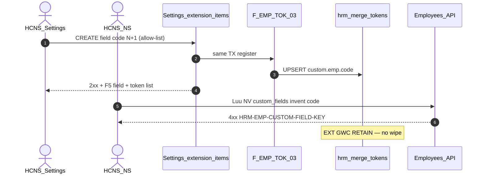

# PO-HRM-DYNAMIC-CONFIG-PLATFORM-EMP-CUSTOM-FIELD-SA-01 — Option/F.1 · EMP custom-field open catalog + BR-PLT-01

| Field | Value |
|-------|--------|
| **work_item_id** | `PO-HRM-DYNAMIC-CONFIG-PLATFORM-EMP-CUSTOM-FIELD-SA-01` |
| **Parent** | `PO-HRM-DYNAMIC-CONFIG-PLATFORM-ATT-WORKSITE-CATALOG-QC-01` **GWC** · U88 continuous · Q-PLT-05 PM order **PAY-COMP → EMP custom field → MergeToken** · **MergeToken EMP EXT already SEALED** |
| **Program** | `PO-HRM-CONTINUOUS-W8-20260807` |
| **lane** | governance · sa |
| **change_mode** | **ADD** Option/F.1 narrow **AC-PLT-EMP-CUSTOM-01*** · **EXPAND** link to sealed **F-EMP-TOK-03** / `custom.emp.*` · **NO** new Nest field-def table · **NO CODE** `apps/**` · **no seed** · **no wipe** MergeToken EMP EXT · ATT worksite/leave · SI · CTR · enrollment |
| **Date** | 2026-08-08 |
| **Status** | **CONFIRMED** — Option **A** **LOCKED** (Settings extension-items = open field-def SoT) · ba-data **HOLD** · ba-process **UNLOCK** · BE consumer invent-KEY **HOLD** until BA AC pack |
| **prior_q** | [`PO-HRM-DYNAMIC-CONFIG-PLATFORM-BA-01.md`](./PO-HRM-DYNAMIC-CONFIG-PLATFORM-BA-01.md) **BR-PLT-01** · **Q-PLT-05** PAY-COMP then EMP custom field |
| **prior_ext** | [`MERGE-TOKEN-EMP-EXT-SA-01`](./PO-HRM-DYNAMIC-CONFIG-PLATFORM-MERGE-TOKEN-EMP-EXT-SA-01.md) Option **B′** · QC GWC [`merge-token-emp-ext-qc-01`](../../qa/evidence/po-hrm-dynamic-config-platform-merge-token-emp-ext-qc-01.md) stamp **`EMPTOKEXTQA-MSJ57PE1`** · **`R-EMP-TOK-EXT` SEALED** — **RETAIN / EXPAND cite only** |
| **prior_gđ1** | [`MERGE-TOKEN-EMP-SA-01`](./PO-HRM-DYNAMIC-CONFIG-PLATFORM-MERGE-TOKEN-EMP-SA-01.md) DOC/ET `emp_catalog` · [`EMP-VERTICAL-SA-01`](./PO-HRM-DYNAMIC-CONFIG-PLATFORM-EMP-VERTICAL-SA-01.md) DOC/ET Nest — **RETAIN** · **≠** this custom-field seat |
| **ref_peer_pay** | PAY Nest `salary_components` Option **B** admin open ≠ consumer invent — **pattern cite**; EMP field-def SoT ≠ PAY (Settings extension already producer) |
| **ref_peer_att_ws** | ATT work-sites Option **B** Nest deepen · [`ATT-WORKSITE-CATALOG-SA-01`](./PO-HRM-DYNAMIC-CONFIG-PLATFORM-ATT-WORKSITE-CATALOG-SA-01.md) · QC GWC **RETAIN** |
| **ref_adr** | [`ADR-HRM-DYNAMIC-CONFIG-PLATFORM`](../../architecture/ADR-HRM-DYNAMIC-CONFIG-PLATFORM.md) Option B platform · **L3 MergeToken** · V3 · [`ADR-METADATA-APPLY-CONSUMERS-DELTA-20260620`](../../architecture/ADR-METADATA-APPLY-CONSUMERS-DELTA-20260620.md) extension-items apply |
| **ref_ba** | Platform BA-01 §2.1 EMP · **BR-PLT-01/02/04/05** · AC-PLT-CTR-05 class · CORE-02b custom field |
| **ref_api** | [`PLATFORM-API-01`](./PO-HRM-DYNAMIC-CONFIG-PLATFORM-API-01.md) **F-PLT-TOK-01..03** · SettingsCatalogs `extension-items` · F-EMP-TOK-03 |
| **Honesty** | `hrm_personnel_uat_ready=false` · `employees_e2e_linkage_ready=false` · `contracts_printable_ready=false` · **DENIED** invent module EMP UAT · **DENIED** reopen MergeToken EXT GWC · **DENIED** mega-EAV · **`C-SLICE-≠-MODULE`** · U65 |
| **must_keep** | single `hrm_merge_tokens` · F-EMP-TOK-03 allow-list register · DOC/ET Nest seals · F-PLT-TOK paths · soft-delete · scope_parity U19 · employee value JSON `custom_fields` storage · C&B surface lock · ATT worksite GWC · ATT-LEAVE · SI · CTR · enrollment |
| **ack_status** | **PASS_TO_PM** · **CONFIRMED** |

---

## 1. Decision context (ADR option pack)

| | |
|--|--|
| **Decision title** | AC-PLT-EMP-CUSTOM-01 — EMP custom-field **open catalog** · admin CREATE N+1 · BR-PLT-01 auto-register token (link sealed EXT) · consumer invent KEY when defs ≠ empty |
| **Requestor** | pm · U88 after ATT-WORKSITE-CATALOG-QC-01 GWC · Q-PLT-05 EMP custom field after PAY-COMP |
| **Decision owner** | sa |
| **Related** | BR-PLT-01/02/04/05 · ADR V3 · F-EMP-TOK-03 · AC-PLT-EMP-TOK-04* (SEALED) · CORE-02b · peer PAY/ATT admin-vs-consumer |

### 1.1 Problem — AS-IS vs target

| Current state (AS-IS evidence) | Gap / target |
|--------------------------------|--------------|
| Settings **`hrm_catalog_extension_items` LIVE** on EMP field catalogs (`hrm_employee_{basic\|personal\|work\|finance}_fields` + aliases) via Nest SettingsCatalogs | Named **AC-PLT-EMP-CUSTOM-01*** catalog pack (admin open vs consumer invent) still paper vs PAY/ATT Option seats |
| **F-EMP-TOK-03** LIVE — same-TX register `custom.emp.<code>` `origin=extension_field` · EXT QC GWC **`EMPTOKEXTQA-MSJ57PE1`** · **`R-EMP-TOK-EXT` CLOSED** | Catalog seat must **EXPAND cite** EXT — **FORBIDDEN** reopen / wipe / second register path |
| Employee form consumes extension codes → `employee.custom_fields` **values** | Consumer invent KEY when EFF defs **>0** and write uses unknown code — **not** sealed as AC-PLT-EMP-CUSTOM-* yet |
| EXT-04c: value PATCH alone **must not** create token | **must_keep** — register = **definition** only |
| No Nest table `emp_custom_field` / `emp_field_definition` | Inventing Nest field-def = dual SoT vs sealed producer — **reject GĐ1** |
| DOC/ET Nest catalogs + MergeToken `emp.doc.*` / `emp.et.*` **SEALED** | Orthogonal — **not** custom field definition SoT |

**Failure if unresolved:** PM treats EXT seal as full EMP custom-field catalog GO; FE invents field keys; ba-data invents Nest field-def / mega-EAV and reopens EXT; personnel UAT flipped; ATT/SI/CTR seals churned.

### 1.2 Constraints

- Docs-only this seat · **no** `apps/**` · **no** seed (U65)
- **DENY** `hrm_personnel_uat_ready=true` · `employees_e2e_linkage_ready=true` · printable · Phase1 · module EMP UAT
- **SEAL RETAIN:** MergeToken EMP EXT · MERGE-TOKEN-EMP DOC/ET · EMP-QC · ATT worksite GWC · ATT-LEAVE · SI type/insurer · CTR · enrollment · PAY/DEC/REC/LIST-TOTALS
- **EXPAND not wipe** `hrm_merge_tokens` / `custom.emp.*` / F-EMP-TOK-03
- Cite existing SettingsCatalogs + F-PLT-TOK paths — **cấm** invent `/api/hrm/employees/custom-fields*` Nest domain table GĐ1

---

## 2. Options

### Option A — Settings extension-items = open field-def SoT (+ sealed BR-PLT-01) — **RECOMMEND / LOCK**

| | |
|--|--|
| **Description** | **Sole** EMP custom-field **definition** SoT = Nest-served Settings **`hrm_catalog_extension_items`** on **allow-list** EMP field catalogs (EXT-SA §5.1). Admin **CREATE open N+1** (append/upsert active extension-item; format slug) — **not** closed enum. On successful definition save → **F-EMP-TOK-03** (already SEALED) upserts `custom.emp.<code>` into **`hrm_merge_tokens`** (**BR-PLT-01** · ADR V3) — **EXPAND cite**, no second register. When **effective active defs > 0**, consumers that bind extension codes into `custom_fields` **must** use `code` ∈ effective set (**BR-PLT-02**); invent → **`HRM-EMP-CUSTOM-FIELD-KEY`**. Empty EFF → soft empty + CTA Settings · **no seed** · invent assert **skip** (peer empty-catalog class). Retire definition → soft-retire item + token (**BR-PLT-04**). Value write on employee **≠** definition (**FORBIDDEN** as register trigger — EXT-04c). |
| **Benefits** | Matches AS-IS + sealed EXT producer; closes Q-PLT-05 EMP custom-field catalog seat without dual SoT; peer PAY/ATT **admin open ≠ consumer invent** split; zero ba-data EXPAND. |
| **Costs** | ba-process AC surface matrix + optional BE consumer assert deepen + FE picker/bind proof. |
| **Risks** | Misread «Settings-only» as MD overview stub without extension CRUD → mitigate **L-EMP-CF-01** (extension-items physical, not MD-alone). |

### Option B — Nest physical field defs (`emp_custom_field` / `emp_field_definition`)

| | |
|--|--|
| **Description** | ADD Nest domain table + CRUD `/api/hrm/employees/custom-field-defs*` as new SoT; migrate/abandon Settings extension-items as producer; rewire F-EMP-TOK-03. |
| **Benefits** | Symmetry with DOC/ET Nest tables on paper. |
| **Costs** | Dual SoT migration · reopen EXT GWC/BE · ba-data EXPAND · FE rewrite · risk wipe sealed AC-04. |
| **Risks** | Violates EXPAND-not-wipe EXT · ADR Q-PLT-03 mega-table drift — **REJECT GĐ1**. |

### Option C — Hybrid dual writers / mega-EAV FormSchema

| | |
|--|--|
| **Description** | Settings extension **and** Nest field-def both write; or one mega `IFormSchema` EAV for all EMP fields replacing extension + DOC/ET. |
| **Benefits** | None for GĐ1. |
| **Costs** | Dual SoT · seal reopen · Phase1 scope blow-up. |
| **Risks** | **REJECT** — DENY mega-EAV · DENY dual definition writers · DENY reopen EXT/DOC/ET. |

---

## 3. Trade-off matrix

| Criteria | Weight | **A Settings ext SoT** | B Nest field-def | C Hybrid / mega-EAV |
|----------|-------:|-----------------------:|-----------------:|--------------------:|
| Business value (BR-PLT-01/02 · Q-PLT-05) | 5 | **5** | 3 | 1 |
| Honesty / seal safety (EXT retain) | 5 | **5** | 1 | 0 |
| Single definition SoT | 5 | **5** | 2 | 0 |
| Time to deliver | 4 | **4** | 1 | 1 |
| Complexity | 4 | **4** | 1 | 0 |
| Maintainability (peer EXT / PAY admin-vs-consumer) | 4 | **5** | 2 | 1 |
| **Weighted** | | **118** | 42 | 12 |

---

## 4. Decision

| | |
|--|--|
| **Selected** | **Option A** — architecture **LOCKED** |
| **Seat verdict** | **CONFIRMED** |
| **Why A** | Field-def physical + BR-PLT-01 register **already LIVE/SEALED** on Settings extension-items; named catalog AC pack is the residual (admin open + consumer invent KEY), not a missing Nest table. Unlike PAY (Nest SC already SoT vs Settings orphan), EMP custom-field producer **is** Settings extension — Option A here ≡ peer «deepen existing SoT» class. |
| **Rejected** | **B** Nest field-def table / migrate off extension · **C** dual writers / mega-EAV |
| **Assumptions** | EXT GWC + F-EMP-TOK-03 remain authoritative register path; DOC/ET Nest remain orthogonal catalogs; default/core column codes stay out of `custom.emp.*` auto-register (EXT §5.2). |

### 4.1 Physical / DATA / BA / BE gates

| Question | Answer |
|----------|--------|
| New ba-data physicalize? | **HOLD** — `hrm_catalog_extension_items` + `hrm_merge_tokens.origin=extension_field` **LIVE** · **FORBIDDEN** second field-def table |
| Unlock ba-process? | **YES** — `PO-HRM-DYNAMIC-CONFIG-PLATFORM-EMP-CUSTOM-FIELD-BA-01` AC pack |
| Unlock ba-data? | **NO** this seat |
| Unlock BE? | **HOLD** until BA AC CONFIRMED — then narrow **consumer invent-KEY** deepen only if GAP proven (admin CREATE + register **must_keep** sealed — **cấm** reopen EXT BE) |
| Unlock FE? | After BA — admin surface + consumer bind to effective extension defs; **cấm** invent Nest field-def UI |
| Reopen MergeToken EXT? | **FORBIDDEN** |

### 4.2 Why not PAY-style «Option B Nest»

| PAY / ATT / SI | EMP custom field |
|----------------|------------------|
| Domain Nest catalog table is (or must become) code SoT | Definition SoT **already** = Settings extension-items |
| Settings MD/overview alone = orphan / REJECT | Settings MD-alone without extension CRUD = **REJECT** (shallow A) — full A uses extension-items |
| Consumer picker binds Nest EFF | Consumer binds **effective extension codes** on allow-list catalogs |

---

## 5. Locks (EMP-CF)

| Lock | Rule |
|------|------|
| **L-EMP-CF-01 Definition SoT** | EMP custom-field **definition** = `hrm_catalog_extension_items` on allow-list catalogs — **FORBIDDEN** Settings MD overview alone as SoT · **FORBIDDEN** Nest `emp_custom_field` GĐ1 |
| **L-EMP-CF-02 Allow-list** | Same EXT §5.1: `hrm_employee_basic_fields` · `hrm_employee_personal_fields` · `hrm_employee_work_fields` · `hrm_employee_finance_fields` (+ aliases) — **OUT** leave/allowance/DOC/ET/position |
| **L-EMP-CF-03 Admin open** | CREATE N+1 open slug (**BR-PLT-05**) — **FORBIDDEN** closed enum / reject N+1 |
| **L-EMP-CF-04 BR-PLT-01** | Definition active save → **F-EMP-TOK-03** → `custom.emp.<code>` on **`hrm_merge_tokens`** — **EXPAND cite SEALED EXT** · **FORBIDDEN** second token table / alternate register |
| **L-EMP-CF-05 Consumer invent** | When EFF active defs **>0**: consumer writes of extension codes **must** ∈ EFF — invent → **`HRM-EMP-CUSTOM-FIELD-KEY`** (**BR-PLT-02**) |
| **L-EMP-CF-06 Empty EFF** | Soft empty + CTA · **no seed** · invent assert **skip** when count=0 |
| **L-EMP-CF-07 Value ≠ definition** | Employee `custom_fields` value mutate **FORBIDDEN** as register trigger (EXT-04c) |
| **L-EMP-CF-08 Soft-delete** | Retire definition → soft-retire item + matching token · history values may retain retired keys (**BR-PLT-04**) · **FORBIDDEN** hard-delete |
| **L-EMP-CF-09 Seals retain** | **FORBIDDEN** reopen MergeToken EXT GWC · MERGE-TOKEN-EMP DOC/ET · ATT worksite/leave · SI · CTR · enrollment |
| **L-EMP-CF-10 Honesty** | **DENIED** personnel / e2e / printable ready · module EMP UAT · Phase1 · **`C-SLICE-≠-MODULE`** |
| **L-EMP-CF-11 Scope** | Same `resolveHrmListScope` as SettingsCatalogs / F-PLT-TOK (**U19**) |
| **L-EMP-CF-12 Position / C&B OUT** | XBOS `job_titles` / `departments` **AC-PLT-EMP-01** · C&B not public form — **not** custom-field catalog |
| **L-EMP-CF-13 DOC/ET OUT** | Nest DOC/ET catalogs + `emp.doc.*` / `emp.et.*` — **orthogonal** · **cấm** fold |

---

## 6. API_DESIGN F.1 (CONFIRM deepen · cite existing — no new Nest domain)

### 6.1 Admin / definition (must_keep existing)

| ID | METHOD / path | Mục đích | Nghiệp vụ | Tham chiếu bước SRS / BR |
|----|---------------|----------|-----------|---------------------------|
| **F-EMP-CF-01** | `GET …/settings-catalogs/:catalogKey` (+ extension items / effective merge-read) | List field defs for allow-list EMP catalogs | Active rows = open catalog density; display-ready labels | BR-PLT-05 · CORE-02b |
| **F-EMP-CF-02** | `POST …/settings-catalogs/:catalogKey/extension-items` | Admin CREATE / upsert field N+1 | Open code slug · UQ active · **same TX** → **F-EMP-TOK-03** | **BR-PLT-01** · AC-PLT-EMP-TOK-04 SEALED |
| **F-EMP-CF-03** | retire/DELETE extension-item (soft) | Soft-retire field def | Soft-retire matching `custom.emp.*` | BR-PLT-04 · EXT-04-RETIRE |

**FORBIDDEN GĐ1:** invent `POST /api/hrm/employees/custom-field-defs` Nest physical.

### 6.2 Merge register (SEALED — EXPAND cite only)

| ID | Path | Rule |
|----|------|------|
| **F-EMP-TOK-03** | Side-effect inside F-EMP-CF-02/03 | `token_key=custom.emp.<code>` · `origin=extension_field` · `domain=EMP` · `ring=custom` · via **F-PLT-TOK-02** columns · **must_keep** EXT GWC |

### 6.3 Consumer invent KEY (ADD deepen — after BA)

| ID | Surface | Mục đích | Nghiệp vụ | Error |
|----|---------|----------|-----------|-------|
| **F-EMP-CF-CNS-01** | Employee create/update (HR) paths that accept extension `custom_fields` keys | Enforce BR-PLT-02 when EFF>0 | Keys that are **extension defs** (not core/builtin allow) must ∈ EFF active codes | **`HRM-EMP-CUSTOM-FIELD-KEY`** |
| **F-EMP-CF-CNS-02** | ESS self-PATCH (narrow allow) | Same invent class on allowed ESS keys only | must_keep ESS phone/gender rules · do not widen ESS to full HR catalog | same KEY or retain ESS 403 class |

**Empty EFF:** skip invent assert · UI CTA to Settings · **no seed**.



---

## 7. Acceptance pointers (ba-process unlock — draft IDs)

| ID | PASS when (draft — BA owns final wording) |
|----|-------------------------------------------|
| **AC-PLT-EMP-CUSTOM-01** | Allow-list catalog: admin CREATE field N+1 → 2xx → F5 field visible on Settings / form schema bind |
| **AC-PLT-EMP-CUSTOM-01b** | Same save → F5 merge-tokens contains `custom.emp.<code>` `origin=extension_field` (**cite EXT AC-04** — may be **RETAIN smoke**, not reopen EXT suite) |
| **AC-PLT-EMP-CUSTOM-01c** | EFF>0 · consumer invent unknown extension code → **`HRM-EMP-CUSTOM-FIELD-KEY`** |
| **AC-PLT-EMP-CUSTOM-01d** | EFF=0 · invent assert skip · CTA · **no seed** |
| **AC-PLT-EMP-CUSTOM-01e** | Soft-retire field → hidden from picker · token retired · history OK |
| **AC-PLT-EMP-CUSTOM-01H** | Honesty false · EXT/ATT/SI/CTR seals retain · **C-SLICE-≠-MODULE** · no personnel flip |

**VAL pointers:** VAL-EMP-CF-CNS-* for invent / empty / non-allow-list catalog does not register token (EXT-04b retain).

---

## 8. Explicit OUT / DENY

| OUT | Rule |
|-----|------|
| Flip `hrm_personnel_uat_ready` / `employees_e2e_linkage_ready` / printable | **DENIED** |
| Reopen MergeToken EMP EXT GWC / R-EMP-TOK-EXT | **DENIED** — EXPAND cite only |
| Reopen ATT worksite / ATT-LEAVE / SI / CTR / enrollment | **DENIED** |
| Nest `emp_custom_field` / mega-EAV / dual token table | **DENIED** |
| Seed extension rows / tokens for UF | **DENIED** (U65) |
| Module EMP UAT / Phase1 DONE | **DENIED** · **`C-SLICE-≠-MODULE`** |
| Fold DOC/ET / position / C&B into this catalog | **DENIED** |
| Register on employee value save | **DENIED** |

---

## 9. Rollout / unlock

```text
EMP-CUSTOM-FIELD-SA-01 (this) CONFIRMED · Option A LOCKED
  → ba-data: HOLD (no seat)
  → ba-process: PO-HRM-DYNAMIC-CONFIG-PLATFORM-EMP-CUSTOM-FIELD-BA-01 AC pack
  → (after BA) BE: F-EMP-CF-CNS-* invent KEY only if GAP · must_keep F-EMP-TOK-03 / EXT
  → FE bind/assert per BA
  → QA U65 AC-PLT-EMP-CUSTOM-01* · cite EXT retain
  → QC narrow — DENY personnel / module EMP UAT / reopen EXT
```

| Wave | Owner | Exit |
|------|-------|------|
| **This** | sa | Option A LOCKED · F.1 · ba-process UNLOCK · ba-data HOLD |
| **AC pack** | ba-process | AC-PLT-EMP-CUSTOM-01* CONFIRMED |
| **BE/FE** | dev-be / dev-fe | Only after BA · CNS invent if GAP |
| **QA/QC** | qa → qc | Narrow seal · honesty false |

**Rollback:** Disable CNS assert flag; EXT register + extension CRUD remain; keyword_map empty-registry fallback intact.

---

## 10. Completion

| Field | Value |
|-------|--------|
| **completion_report** | Option **A CONFIRMED LOCKED** — EMP custom-field open catalog SoT = Settings `hrm_catalog_extension_items` allow-list; BR-PLT-01 via sealed F-EMP-TOK-03 / `custom.emp.*` **EXPAND cite**; consumer invent **`HRM-EMP-CUSTOM-FIELD-KEY`**; Nest field-def / mega-EAV / reopen EXT **REJECT**; ba-data HOLD; ba-process UNLOCK; honesty personnel false · **C-SLICE-≠-MODULE**; ATT worksite/leave · SI · CTR · enrollment · MergeToken EXT **RETAIN**. |
| **next_owner** | `ba-process` |
| **ack_status** | **PASS_TO_PM** |
| **evidence_path** | `docs/qa/evidence/po-hrm-dynamic-config-platform-emp-custom-field-sa-01.md` |
