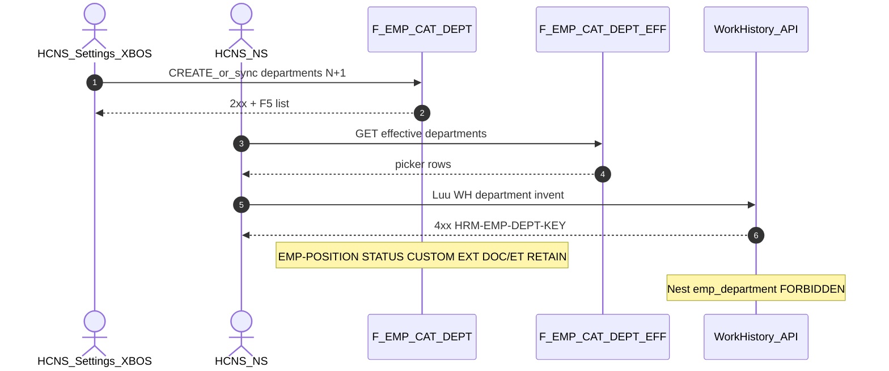

# PO-HRM-DYNAMIC-CONFIG-PLATFORM-EMP-DEPT-CATALOG-SA-01 — Option/F.1 · EMP department / org-unit catalog (`department_key` / `departments`)

| Field | Value |
|-------|--------|
| **work_item_id** | `PO-HRM-DYNAMIC-CONFIG-PLATFORM-EMP-DEPT-CATALOG-SA-01` |
| **Parent** | `PO-HRM-DYNAMIC-CONFIG-PLATFORM-EMP-POSITION-CATALOG-QC-01` **GWC L1** · stamp **`EMPPOSQA2-MSK3CDH1`** · **R-EMP-POS-DEPT-01** OUT Condition · U88 continuous · same Option **A** architecture as position |
| **Program** | `PO-HRM-CONTINUOUS-W8-20260807` |
| **lane** | governance · sa |
| **change_mode** | **ADD** Option/F.1 narrow **AC-PLT-EMP-DEPT-01*** · **EXPAND** Settings/XBOS `departments` SoT (producer **LIVE**) · **NO** Nest `emp_department` catalog · **NO** Nest `emp_position` · **NO CODE** `apps/**` · **no seed** · **no wipe** EMP-POSITION / EMP-STATUS / EMP-CUSTOM / EXT / DOC/ET / ATT/SI/CTR |
| **Date** | 2026-08-08 |
| **Status** | **CONFIRMED** — Option **A** **LOCKED** (Settings/XBOS `departments` effective = open department catalog SoT) · ba-data **HOLD** · ba-process **UNLOCK** · BE **HOLD** until BA |
| **prior_qc** | [`emp-position-catalog-qc-01`](../../qa/evidence/po-hrm-dynamic-config-platform-emp-position-catalog-qc-01.md) **GWC** · stamp **`EMPPOSQA2-MSK3CDH1`** · **R-EMP-POS-DEPT-01** CONDITION/OUT · honesty personnel/e2e/printable=false · **`C-SLICE-≠-MODULE`** |
| **prior_sa_peer** | [`EMP-POSITION-CATALOG-SA-01`](./PO-HRM-DYNAMIC-CONFIG-PLATFORM-EMP-POSITION-CATALOG-SA-01.md) Option **A** `job_titles` — **cite class** (LIVE Settings/XBOS producer → deepen A) |
| **prior_ba** | [`PO-HRM-DYNAMIC-CONFIG-PLATFORM-BA-01.md`](./PO-HRM-DYNAMIC-CONFIG-PLATFORM-BA-01.md) §2.1 EMP row **Chức danh / phòng ban** · **AC-PLT-EMP-01** (dept companion) · **BR-PLT-02/04/05/06** |
| **ref_peer_emp_custom** | EMP-CUSTOM Option **A** Settings LIVE — same Option A class · stamp **`EMPCFQA-MSK14LUH`** · **RETAIN** |
| **ref_peer_emp_status** | EMP-STATUS Option **B** Nest DEFINE — **cite ≠ copy** (Nest absent + hardcode → B; dept producer LIVE → A) · stamp **`EMPSTQA-MSK20G7H`** · **RETAIN** |
| **ref_peer_emp_doc_et** | EMP DOC/ET Nest Option **B** · [`EMP-VERTICAL-SA-01`](./PO-HRM-DYNAMIC-CONFIG-PLATFORM-EMP-VERTICAL-SA-01.md) **L-EMP-CAT-05** `job_titles`/`departments` = XBOS REF · **RETAIN** |
| **ref_peer_ext** | MergeToken EMP EXT **`EMPTOKEXTQA-MSJ57PE1`** · **RETAIN** · **≠** dept SoT |
| **ref_adr** | [`ADR-HRM-DYNAMIC-CONFIG-PLATFORM`](../../architecture/ADR-HRM-DYNAMIC-CONFIG-PLATFORM.md) · **BR-PLT-06** XBOS khung · Q-PLT-03 mega-EAV DENY |
| **Honesty** | `hrm_personnel_uat_ready=false` · `employees_e2e_linkage_ready=false` · `contracts_printable_ready=false` · **DENIED** invent module EMP UAT · **DENIED** reopen EMP-POSITION / EMP-STATUS / EMP-CUSTOM / EXT / DOC-ET / ATT / SI / CTR · **DENIED** invent FE for EMP-STATUS HOLD · **DENIED** invent Nest `emp_position` · **`C-SLICE-≠-MODULE`** · U65 |
| **must_keep** | Settings/XBOS `departments` SoT · `assertCodeInEffectiveCatalog` consumers (WH / CTR / DEC / REC / PERF) · EMP VERTICAL **L-EMP-CAT-05** · EMP-POSITION L1 Option A · soft-delete · scope_parity U19 · display-ready labels · EMP-STATUS · EMP-CUSTOM · EXT · DOC/ET · ATT/SI/CTR |
| **ack_status** | **PASS_TO_PM** · **CONFIRMED** |

---

## 1. Decision context (ADR option pack)

| | |
|--|--|
| **Decision title** | AC-PLT-EMP-DEPT-01 — EMP **department / org-unit catalog** (`department_key` ∈ Settings/XBOS `departments`) · admin CREATE/sync N+1 · consumer invent KEY when EFF ≠ empty · close BA-01 §2.1 phòng ban companion residual |
| **Requestor** | pm · U88 after EMP-POSITION-CATALOG-QC-01 GWC · **R-EMP-POS-DEPT-01** OUT follow-on |
| **Decision owner** | sa |
| **Related** | BA-01 §2.1 · AC-PLT-EMP-01 (dept) · BR-PLT-02/04/05/06 · EMP VERTICAL L-EMP-CAT-05 · peer EMP-POSITION Option A · EMP-CUSTOM A · EMP-STATUS B (cite ≠ copy) |

### 1.1 Problem — AS-IS vs target

| Current state (AS-IS evidence) | Gap / target |
|--------------------------------|--------------|
| Settings-catalogs family **`org_depts`** · storageKey **`departments`** (aliases `department_catalog` / `org_departments`) **LIVE** | Named **AC-PLT-EMP-DEPT-01*** pack still OUT from position seat — not «missing Nest catalog» |
| XBOS config-sync / business-master **`departments`** allow-list publish/pull **LIVE** (peer `job_titles`) | Deepen **BR-PLT-06** khung + tenant extension N+1 |
| BE consumers already assert ∈ `departments`: WH `department_key` (`HRM-WH-DEPT-KEY`) · CTR/DEC · REC JD/plan · PERF | **Unify** invent KEY class + empty CTA + FE picker gaps under **AC-PLT-EMP-DEPT-01*** — **FORBIDDEN** free-text SoT when EFF>0 (**BR-PLT-02**) |
| Nest table **`public.departments`** (DepartmentsService org-tree: parent_id / name / code) **exists** | **Orthogonal** org-structure CRUD — **≠** open catalog SoT for `department_key` soft-ref · **FORBIDDEN** promote org-tree as sole invent SoT / dual master vs Settings |
| **No** Nest `emp_department` / `emp_org_unit` **catalog** table (ICatalogRow peer DOC/ET/status) | EMP VERTICAL **L-EMP-CAT-05** — **FORBIDDEN** invent Nest dept catalog dual master vs XBOS |
| EMP-POSITION Option A SEAL · EMP-STATUS · EMP-CUSTOM · EXT · DOC/ET | **Orthogonal** — **FORBIDDEN** fold dept into position Nest · status · custom · reopen seals |

**Failure if unresolved:** Team invents Nest `emp_department` dual master vs XBOS; or folds dept into Nest `emp_position` / EMP-CUSTOM; or treats Nest org-tree alone as catalog SoT; or flips personnel UAT; or reopens EMP-POSITION/STATUS/CUSTOM seals.

### 1.2 Constraints

- Docs-only this seat · **no** `apps/**` · **no** seed (U65)
- **DENY** `hrm_personnel_uat_ready=true` · `employees_e2e_linkage_ready=true` · printable · Phase1 · module EMP UAT
- **SEAL RETAIN:** EMP-POSITION L1 (`EMPPOSQA2-MSK3CDH1`) · EMP-STATUS L1 (`EMPSTQA-MSK20G7H`) · EMP-CUSTOM (`EMPCFQA-MSK14LUH`) · MergeToken EXT (`EMPTOKEXTQA-MSJ57PE1`) · DOC/ET · ATT leave/worksite · SI type/insurer · CTR · enrollment · PAY/DEC/REC
- **DENY** invent FE for EMP-STATUS HOLD residual
- Cite EMP VERTICAL L-EMP-CAT-05 — **cấm** invent Nest `emp_department` catalog · **cấm** invent Nest `emp_position` · **cấm** mega EMP EAV

### 1.3 Why Option A (peer position `job_titles` — cite class)

| EMP status (Option **B**) | EMP position (Option **A**) | EMP department (this seat → **A**) |
|---------------------------|-----------------------------|-----------------------------------|
| Nest SoT **absent** · hardcode fallback · closed CHECK | Settings/XBOS `job_titles` **LIVE** | Settings/XBOS `departments` **LIVE** (+ XBOS sync) |
| Nest DEFINE needed | Nest invent **forbidden** L-EMP-CAT-05 | Nest invent **forbidden** same L-EMP-CAT-05 |
| — | Closest peer EMP-CUSTOM A | **Same class as position A** — deepen LIVE producer |

**BA «Catalog Settings» cell:** SA **confirms** Settings/XBOS as **writer SoT** for `department_key` (group XBOS khung + tenant extension — **BR-PLT-06**) — Nest org-tree may remain **org hierarchy surface** but is **not** the invent KEY catalog SoT.

---

## 2. Options

### Option A — Settings/XBOS `departments` = authoritative open department catalog SoT — **RECOMMEND / LOCK**

| | |
|--|--|
| **Description** | **Sole** `department_key` SoT = Settings-catalogs **effectiveItems** for storageKey **`departments`** (XBOS publish/pull khung + HRM tenant extension where ADR allows). Admin **CREATE / sync open N+1** (**BR-PLT-05** — **FORBIDDEN** closed enum ceiling). When **effective active count > 0**, consumers (WH create/update · employee dept bind · CTR/DEC · REC · PERF) **must** use code ∈ EFF (**BR-PLT-02**); invent → platform **`HRM-EMP-DEPT-KEY`** (WH may **retain alias** **`HRM-WH-DEPT-KEY`** as same class — BA maps ≡ / EXPAND). Empty EFF → soft empty + CTA Settings · invent assert **empty-catalog** class (peer **`HRM-WH-PICK-EMPTY-CATALOG`** / proposed **`HRM-EMP-DEPT-EMPTY-CATALOG`** — BA owns final code) · **no seed** · **FORBIDDEN** free-text fallback SoT. Soft-retire / inactive hide from picker · history rows keep retired keys (**BR-PLT-04**). Display-ready labels from catalog (OS 28). Nest `public.departments` org-tree = **retain as hierarchy ops surface** if product needs — **FORBIDDEN** as sole `department_key` invent SoT / dual writer vs Settings EFF. |
| **Benefits** | Matches LIVE producer + EMP VERTICAL must_keep; peer EMP-POSITION Option A; closes R-EMP-POS-DEPT-01 without dual master; zero ba-data Nest ADD; honesty-safe. |
| **Costs** | ba-process AC matrix · optional FE dept picker gap · optional BE invent-KEY / empty-catalog deepen after BA if GAP. |
| **Risks** | Confuse Nest org-tree CRUD with catalog SoT → mitigate **L-EMP-DEPT-01** (Settings/XBOS = invent SoT · org-tree ≠ dual master). |

### Option B — Nest `emp_department` (or promote Nest `public.departments` alone) = new open catalog · Settings REF only

| | |
|--|--|
| **Description** | DEFINE Nest ICatalogRow `emp_department` **or** declare Nest org-tree `public.departments` as sole `department_key` SoT; Settings `departments` demote to REF merge-read. |
| **Benefits** | Symmetry with Nest status/DOC on paper. |
| **Costs** | Dual master vs XBOS sync SoT · reopen EMP VERTICAL L-EMP-CAT-05 · ba-data ADD · rewire asserts · FE rewrite · seal churn · conflates org-tree with catalog codes. |
| **Risks** | Producer **already LIVE** — Option B threshold («producer absent + hardcode») **not met** · violates L-EMP-CAT-05 · BR-PLT-06 — **REJECT GĐ1**. |

### Option C — Hybrid dual writers / mega-EAV / fold into emp_position Nest · EMP-CUSTOM · reopen seals / invent UAT

| | |
|--|--|
| **Description** | Nest **and** Settings both write invent SoT; or fold dept into Nest `emp_position` / EMP-CUSTOM extension / EMP-STATUS; or flip personnel UAT / invent EMP-STATUS FE / reopen EMP-POSITION L1. |
| **Benefits** | None for GĐ1 honesty. |
| **Costs** | Dual SoT · seal reopen · spine confusion. |
| **Risks** | **REJECT** — DENY mega-EAV · DENY fold · DENY reopen · DENY personnel flip · DENY Nest invent · DENY invent EMP-STATUS FE. |

---

## 3. Trade-off matrix

| Criteria | Weight | **A Settings/XBOS LIVE** | B Nest emp_department / org-tree sole | C Hybrid / fold / UAT invent |
|----------|-------:|-------------------------:|-------------------------------------:|-----------------------------:|
| Business value (BR-PLT-02/06 · AC-PLT-EMP-DEPT · close OUT) | 5 | **5** | 2 | 0 |
| Honesty / seal safety (POSITION·STATUS·CUSTOM·EXT retain) | 5 | **5** | 1 | 0 |
| Single dept catalog SoT (no dual master vs XBOS) | 5 | **5** | 1 | 0 |
| Time to deliver | 4 | **4** | 1 | 2 |
| Complexity | 4 | **4** | 1 | 0 |
| Maintainability (admin open ≠ consumer invent) | 4 | **5** | 3 | 1 |
| **Weighted** | | **116** | 36 | 8 |

---

## 4. Decision

| | |
|--|--|
| **Selected** | **Option A** — architecture **LOCKED** |
| **Seat verdict** | **CONFIRMED** |
| **Why A** | Department catalog producer **already LIVE** on Settings/XBOS `departments` with multi-consumer asserts (peer `job_titles` Option A); residual is **named AC pack + empty/KEY unify / picker gaps**, not Nest absence. EMP VERTICAL **forbids** Nest dual master. Option B threshold (producer absent + hardcode) **not met**. Peer EMP-POSITION chose A for same class; EMP-STATUS chose B because Nest absent + hardcode — **cite ≠ copy**. |
| **Rejected** | **B** Nest `emp_department` DEFINE / Nest org-tree sole invent SoT · **C** hybrid / mega-EAV / fold into position·custom·status / UAT invent / reopen seals |
| **Assumptions** | XBOS sync + settings-catalogs remain SoT khung; tenant extension N+1 allowed per ADR; EMP-STATUS FE HOLD stays HOLD; EMP-POSITION L1 seal retained; Nest org-tree remains non-SoT for invent KEY. |

### 4.1 Physical / DATA / BA / BE gates

| Question | Answer |
|----------|--------|
| New ba-data physicalize Nest `emp_department`? | **HOLD** — **FORBIDDEN** ADD Nest dept catalog · Settings/XBOS physical **LIVE** |
| Unlock ba-process? | **YES** — `PO-HRM-DYNAMIC-CONFIG-PLATFORM-EMP-DEPT-CATALOG-BA-01` AC pack |
| Unlock ba-data? | **NO** this seat (no Nest ADD) — **HOLD** if Option A |
| Unlock BE? | **HOLD** until BA — then narrow CNS invent-KEY / empty CTA deepen **only if GAP** vs existing WH/CTR/DEC/REC asserts · **cấm** Nest catalog table · **cấm** reopen EMP-POSITION/STATUS BE |
| Unlock FE? | After BA — WH/employee/dept pickers bind EFF `departments`; **FORBIDDEN** free-text SoT when EFF>0 · **FORBIDDEN** invent EMP-STATUS FE |
| Reopen EMP-POSITION / EMP-STATUS / CUSTOM / EXT / DOC-ET / ATT / SI / CTR? | **FORBIDDEN** |
| Nest `emp_position` | **FORBIDDEN** invent (RETAIN position Option A deny) |
| Nest `public.departments` org-tree | **Retain hierarchy surface** · **FORBIDDEN** promote as sole invent SoT |

### 4.2 Why not EMP-STATUS-style «Option B»

| EMP status (B) | EMP department (A) |
|----------------|--------------------|
| Hardcode list + closed CHECK + no Nest | LIVE catalog + asserts; Nest invent **forbidden** by L-EMP-CAT-05 |
| Settings empty → hardcode SoT | Settings empty → empty-catalog **block free-text** + CTA |
| DEFINE Nest aligns peers | DEFINE Nest **breaks** XBOS REF must_keep |

---

## 5. Locks (EMP-DEPT)

| Lock | Rule |
|------|------|
| **L-EMP-DEPT-01 Dept catalog SoT** | Settings/XBOS **`departments`** effective = authoritative **`department_key`** SoT — **FORBIDDEN** Nest `emp_department` dual master · **FORBIDDEN** Nest org-tree alone as invent SoT · **FORBIDDEN** free-text SoT when EFF>0 |
| **L-EMP-DEPT-02 XBOS khung** | Group XBOS publish/pull = SoT khung (**BR-PLT-06**) · HRM Settings = consumer + tenant extension — **FORBIDDEN** invent second HRM-only catalog master replacing XBOS |
| **L-EMP-DEPT-03 Admin open** | CREATE/sync N+1 open slug (**BR-PLT-05**) — **FORBIDDEN** closed enum ceiling / reject N+1 because «not in starter list» |
| **L-EMP-DEPT-04 Consumer invent** | EFF>0 → invent unknown department → **`HRM-EMP-DEPT-KEY`** (alias retain **`HRM-WH-DEPT-KEY`** on WH — same class) |
| **L-EMP-DEPT-05 Empty EFF** | Soft empty + CTA Settings · empty-catalog class (peer WH EMPTY / proposed **`HRM-EMP-DEPT-EMPTY-CATALOG`**) · invent free-text **FORBIDDEN** · **no seed** |
| **L-EMP-DEPT-06 Peer position seal** | EMP-POSITION L1 Option A **RETAIN** — **FORBIDDEN** reopen · **FORBIDDEN** invent Nest `emp_position` · **FORBIDDEN** fold dept into Nest position |
| **L-EMP-DEPT-07 Orthogonal** | **≠** EMP-STATUS Nest · **≠** EMP-CUSTOM extension-items · **≠** DOC/ET · **≠** employment_type · **≠** Nest org-tree sole SoT |
| **L-EMP-DEPT-08 Seals retain** | **FORBIDDEN** reopen EMP-POSITION · EMP-STATUS L1 · EMP-CUSTOM · EXT · DOC/ET · ATT · SI · CTR · enrollment |
| **L-EMP-DEPT-09 Honesty** | **DENIED** personnel / e2e / printable ready · module EMP UAT · Phase1 · **`C-SLICE-≠-MODULE`** |
| **L-EMP-DEPT-10 Soft-delete** | Retire = soft · history WH/CTR/DEC may keep retired keys (**BR-PLT-04**) · **FORBIDDEN** hard-delete |
| **L-EMP-DEPT-11 Scope** | list ↔ get-by-id ↔ mutate = `resolveHrmListScope` (**U19**) |
| **L-EMP-DEPT-12 Display-ready** | Prefer catalog `*_label` — FE **cấm** join invent when BE provides |
| **L-EMP-DEPT-13 Mega-EAV** | **FORBIDDEN** fold dept into `emp_custom_field` / mega EMP catalog / status reason / Nest `emp_position` |
| **L-EMP-DEPT-14 EMP-STATUS FE** | **FORBIDDEN** invent FE for EMP-STATUS HOLD as part of this seat |
| **L-EMP-DEPT-15 Org-tree boundary** | Nest `public.departments` hierarchy **≠** catalog invent SoT — BA may note hierarchy UX OUT / follow-on · **cấm** dual invent writers |

---

## 6. API_DESIGN F.1 (EXPAND LIVE Settings — unlock ba-process; ba-data HOLD)

### 6.1 Admin / department catalog (existing Settings path — deepen AC, not new Nest catalog)

| ID | METHOD / path (proposed / cite LIVE) | Mục đích | Nghiệp vụ | Tham chiếu |
|----|--------------------------------------|----------|-----------|-----------|
| **F-EMP-CAT-DEPT-01** | `GET …/settings-catalogs` / items `departments` (LIVE) | List department catalog | Scope · display-ready · soft filter | BR-PLT-04/05/06 |
| **F-EMP-CAT-DEPT-02** | Settings / XBOS sync upsert extension N+1 | Admin CREATE/sync open | Open slug · UQ active · **BR-PLT-05** | **AC-PLT-EMP-DEPT-01** |
| **F-EMP-CAT-DEPT-03** | Update metadata / soft-retire | Retire hide picker | History keys OK | BR-PLT-04 |
| **F-EMP-CAT-DEPT-EFF-01** | Effective `departments` union XBOS+extension | Consumer picker SoT | Tenant extension wins collision per ADR | **BR-PLT-06** |

**FORBIDDEN:** invent `GET/POST …/employees/departments-catalog*` Nest ICatalogRow table as GĐ1 SoT · **FORBIDDEN** treat Nest org-tree CRUD as invent KEY SoT alone.

### 6.2 Consumer invent KEY (after BA — deepen if GAP)

| ID | Surface | Mục đích | Error |
|----|---------|----------|-------|
| **F-EMP-DEPT-CNS-01** | WH create/update `department_key` | Enforce ∈ EFF when count>0 | **`HRM-EMP-DEPT-KEY`** ≡ **`HRM-WH-DEPT-KEY`** |
| **F-EMP-DEPT-CNS-02** | Employee / profile dept bind (if any) | Same SoT | **`HRM-EMP-DEPT-KEY`** (BA maps) |
| **F-EMP-DEPT-CNS-03** | CTR/DEC / REC / PERF `department_key` | Same SoT | invent KEY class · **RETAIN** existing asserts |
| **F-EMP-DEPT-CNS-04** | Empty EFF | Block free-text · CTA | empty-catalog class (peer WH EMPTY / **`HRM-EMP-DEPT-EMPTY-CATALOG`**) |

**Empty EFF:** skip invent-as-accept · UI CTA · **no seed**.



### 6.3 Physical pointer (ba-data — HOLD)

| Artifact | Role | Notes |
|----------|------|-------|
| Settings `departments` (+ XBOS snapshot / extension) | Department `ICatalogRow`-class SoT | **LIVE** — no Nest ADD |
| `employee_work_timeline.department_key` | Consumer text | Validate ∈ EFF |
| CTR/DEC/REC/PERF `department_key` | Consumer text | Validate ∈ EFF |
| Nest `public.departments` | Org-tree hierarchy ops | **≠** invent SoT · retain surface |
| Nest `emp_department` | — | **FORBIDDEN** this program GĐ1 |
| Nest `emp_position` | — | **FORBIDDEN** · EMP-POSITION Option A RETAIN |

---

## 7. Acceptance pointers (ba-process unlock — draft IDs)

| ID | PASS when (draft — BA owns final wording) |
|----|-------------------------------------------|
| **AC-PLT-EMP-DEPT-01** | Consumer form: department = catalog picker ∈ EFF `departments`; reject free-text SoT when EFF>0 (**BA-01** §2.1) |
| **AC-PLT-EMP-DEPT-01b** | EFF>0 · invent unknown `department_key` → **`HRM-EMP-DEPT-KEY`** (≡ `HRM-WH-DEPT-KEY` class) |
| **AC-PLT-EMP-DEPT-01c** | EFF=0 · empty catalog → CTA Settings · **no seed** · free-text SoT **FORBIDDEN** (empty-catalog class) |
| **AC-PLT-EMP-DEPT-01d** | Admin CREATE/sync N+1 on `departments` → 2xx → F5 picker includes row (**BR-PLT-05**) |
| **AC-PLT-EMP-DEPT-01e** | Soft-retire / inactive → hidden picker · history WH/CTR OK |
| **AC-PLT-EMP-DEPT-01H** | Honesty false · EMP-POSITION/STATUS/CUSTOM/EXT/DOC-ET/ATT/SI/CTR retain · **C-SLICE-≠-MODULE** · no personnel flip · no EMP-STATUS FE invent · Nest `emp_department` / `emp_position` DENY |

**VAL pointers:** VAL-EMP-DEPT-CNS-* · VAL-SET-MD / FR-HRM-SC-DEPT retain · WH jest `HRM-WH-DEPT-KEY` retain.

**OUT this seat:** Nest org-tree hierarchy UX redesign · invent EMP-STATUS FE · reopen EMP-POSITION L1.

---

## 8. Explicit OUT / DENY

| OUT | Rule |
|-----|------|
| Flip `hrm_personnel_uat_ready` / `employees_e2e_linkage_ready` / printable | **DENIED** |
| Nest `emp_department` / Nest org-tree sole invent SoT / dual master vs XBOS | **DENIED** |
| Nest `emp_position` invent / reopen EMP-POSITION L1 seal | **DENIED** |
| Fold into EMP-CUSTOM / EMP-STATUS / DOC/ET / Nest position / mega-EAV | **DENIED** |
| Reopen EMP-STATUS L1 / invent EMP-STATUS FE HOLD | **DENIED** |
| Reopen EMP-CUSTOM · MergeToken EXT · DOC/ET · ATT · SI · CTR · enrollment | **DENIED** |
| Seed `departments` for UF | **DENIED** (U65) |
| Module EMP UAT / Phase1 DONE | **DENIED** · **`C-SLICE-≠-MODULE`** |
| Claim Settings MD alone = peer Nest Option B equivalent | **DENIED** (intentional XBOS REF Option A) |
| Seed / flip personnel / Phase1 | **DENIED** |

---

## 9. Rollout / unlock

```text
EMP-DEPT-CATALOG-SA-01 (this) CONFIRMED · Option A LOCKED
  → ba-process: PO-HRM-DYNAMIC-CONFIG-PLATFORM-EMP-DEPT-CATALOG-BA-01 AC pack
  → ba-data: HOLD (no Nest ADD · Option A)
  → (after BA) BE/FE: CNS invent KEY / empty CTA deepen IF GAP only
  → QA U65 AC-PLT-EMP-DEPT-01* · retain EMP-POSITION/STATUS/CUSTOM/EXT
  → QC narrow — DENY personnel / module EMP UAT / Nest emp_department / reopen seals
```

| Wave | Owner | Exit |
|------|-------|------|
| **This** | sa | Option A LOCKED · F.1 · ba-process **UNLOCK** · ba-data **HOLD** · BE HOLD |
| **AC pack** | ba-process | AC-PLT-EMP-DEPT-01* CONFIRMED |
| **DATA** | ba-data | **HOLD** — no WI unless BA finds physical GAP (unexpected) |
| **BE/FE** | dev-be / dev-fe | Only after BA · GAP-only · no Nest catalog · no reopen position/status |
| **QA/QC** | qa → qc | Narrow seal · honesty false |

**Rollback:** Keep existing asserts; do not introduce Nest dept catalog table; do not re-enable free-text SoT when EFF>0; do not reopen EMP-POSITION seal.

---

## 10. Completion

| Field | Value |
|-------|--------|
| **completion_report** | Option **A CONFIRMED LOCKED** — EMP **department** open catalog SoT = Settings/XBOS **`departments`** effective (producer LIVE · peer position `job_titles` A); admin CREATE/sync N+1 ≠ consumer invent **`HRM-EMP-DEPT-KEY`** (WH alias `HRM-WH-DEPT-KEY`); empty → CTA / empty-catalog · no seed; Nest `emp_department` / Nest org-tree sole invent SoT **REJECT**; Nest `emp_position` **REJECT** (RETAIN position A); Option B Nest / Option C fold·mega-EAV·reopen·UAT invent **REJECT**; EMP-POSITION L1 · EMP-STATUS · EMP-CUSTOM · EXT · DOC/ET · ATT/SI/CTR **RETAIN**; ba-data **HOLD**; ba-process **UNLOCK**; BE HOLD; honesty personnel false · **C-SLICE-≠-MODULE**; closes architecture for **R-EMP-POS-DEPT-01**. |
| **next_owner** | `ba-process` |
| **ack_status** | **PASS_TO_PM** |
| **evidence_path** | `docs/qa/evidence/po-hrm-dynamic-config-platform-emp-dept-catalog-sa-01.md` |
