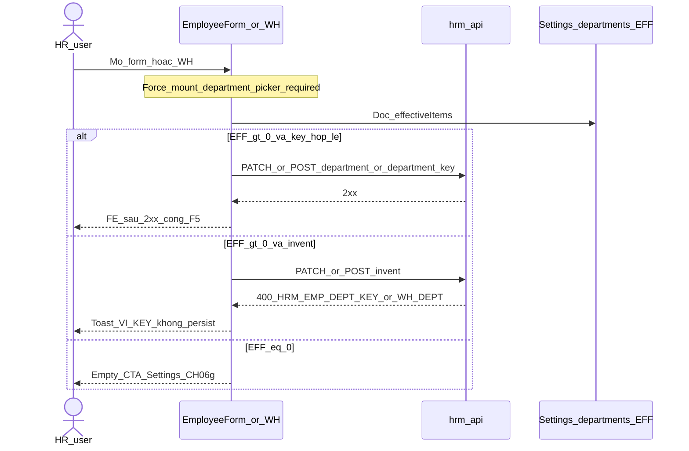

# PO-HRM-DYNAMIC-CONFIG-PLATFORM-EMP-DEPT-FE-SA-01 — Option/F.1 · FE residual **R-PLT-EMP-DEPT-FE-01** (WH / EMP department picker deepen)

| Field | Value |
|-------|--------|
| **work_item_id** | `PO-HRM-DYNAMIC-CONFIG-PLATFORM-EMP-DEPT-FE-SA-01` |
| **Parent** | EMP-DEPT-CATALOG-QC-01 **GWC** L1 stamp **`EMPDEPTQA-MSK3VVXX`** · DOCS CH06g **ACCEPT** · residual **FE WH/dept picker deepen HOLD** (mint **R-PLT-EMP-DEPT-FE-01**) |
| **U88 context** | EMP-POSITION QC-FE-01 **GWC** · **R-PLT-EMP-POS-FE-01 CLOSED ACCEPT** (stamp **EMPPOSQCFE-8DEF5536** · agent_qc `c4e9c3df-7466-4a61-a55e-61eceb804b34`) · EMP-STATUS FE CLOSED **EMPSTQAFE2-MSKE3NV1** RETAIN · ATT-CODE FE RETAIN · FE-ADMIN HOLD RETAIN · LVRULE 01g HOLD RETAIN · Nest `emp_position` **DENY** · Nest `emp_department` **DENY** · continuous residual = EMP-DEPT FE picker deepen |
| **Program** | `PO-HRM-CONTINUOUS-W8-20260807` |
| **lane** | governance · sa · **narrow FE HOLD disposition only** |
| **change_mode** | **ADD** Option/F.1 for **R-PLT-EMP-DEPT-FE-01** · **NO CODE** `apps/**` · **no seed** · **no wipe** EMP-DEPT L1 · EMP-POSITION FE CLOSED · EMP-STATUS FE CLOSED · EMP-CUSTOM · ATT · LVRULE HOLD · Nest `emp_department` DENY · Nest `emp_position` DENY |
| **Date** | 2026-08-08 |
| **Status** | **CONFIRMED** — Option **A** **LOCKED** · **UNLOCK FE consumer Settings `departments` EFF picker deepen** (peer EMP-POSITION / EMP-STATUS / ATT-CODE FE-SA Option A) · ba-process **HOLD** (AC-PLT-EMP-DEPT-01* already locked) · next = **dev-fe** |
| **prior_seals** | EMP-DEPT L1 `EMPDEPTQA-MSK3VVXX` · DOCS CH06g · EMP-POSITION L1 `EMPPOSQA2-MSK3CDH1` · EMP-POSITION FE CLOSED `EMPPOSQCFE-8DEF5536` · EMP-STATUS L1 `EMPSTQA-MSK20G7H` · EMP-STATUS FE CLOSED · EMP-CUSTOM `EMPCFQA-MSK14LUH` · MergeToken EXT · DOC/ET · ATT/SI/CTR · LVRULE FE-01g ACCEPT_AS_IS HOLD — **SEAL / HOLD RETAIN** |
| **prior_sa** | [`EMP-DEPT-CATALOG-SA-01`](./PO-HRM-DYNAMIC-CONFIG-PLATFORM-EMP-DEPT-CATALOG-SA-01.md) Option **A** Settings/XBOS `departments` SoT — this seat **≠** reopen catalog SoT · **≠** invent Nest `emp_department` |
| **prior_ba** | [`EMP-DEPT-CATALOG-BA-01`](./PO-HRM-DYNAMIC-CONFIG-PLATFORM-EMP-DEPT-CATALOG-BA-01.md) **AC-PLT-EMP-DEPT-01 / 01b / 01c / 01d / 01e / 01H** · VAL-EMP-DEPT-CNS-* already locked — **RETAIN** |
| **peer_cite_unlock** | [`EMP-POSITION-FE-SA-01`](./PO-HRM-DYNAMIC-CONFIG-PLATFORM-EMP-POSITION-FE-SA-01.md) Option **A** · [`EMP-STATUS-FE-SA-01`](./PO-HRM-DYNAMIC-CONFIG-PLATFORM-EMP-STATUS-FE-SA-01.md) Option **A** · [`ATT-CODE-FE-SA-01`](./PO-HRM-DYNAMIC-CONFIG-PLATFORM-ATT-CODE-FE-SA-01.md) Option **A** — consumer EFF rebind / picker deepen when surface LIVE + KEY LIVE |
| **peer_cite_hold** | [`ATT-LVRULE-FE-01G-SA-01`](./PO-HRM-DYNAMIC-CONFIG-PLATFORM-ATT-LVRULE-FE-01G-SA-01.md) ACCEPT_AS_IS_P2 · EMP-STATUS FE-ADMIN HOLD — **cite ≠ copy onto consumer residual** |
| **Honesty** | `hrm_personnel_uat_ready=false` · `employees_e2e_linkage_ready=false` · `contracts_printable_ready=false` · **`C-SLICE-≠-MODULE`** · U65 · **DENIED** module EMP UAT · seed · reopen EMP-DEPT L1 · reopen EMP-POSITION/STATUS FE CLOSED · invent LVRULE / EMP-ST FE-ADMIN · Nest `emp_department` · Nest `emp_position` · Face |
| **ack_status** | **PASS_TO_PM** · **CONFIRMED** |

---

## 1. Decision context (ADR option pack)

| | |
|--|--|
| **Decision title** | Disposition for **R-PLT-EMP-DEPT-FE-01** (P2) — unlock FE WH/EMP department picker deepen vs ACCEPT_AS_IS HOLD vs invent Nest / reopen seals |
| **Requestor** | pm · U88 continuous after EMP-POSITION FE CLOSED + EMP-DEPT L1 GWC + DOCS CH06g ACCEPT · residual FE WH/dept picker HOLD |
| **Decision owner** | sa |
| **Related** | AC-PLT-EMP-DEPT-01 / 01b / 01c / 01d / 01e / 01H · VAL-EMP-DEPT-CNS-01..07 · BR-PLT-EMP-DEPT-02/03/04/05 · F-EMP-CAT-DEPT-EFF · F-EMP-DEPT-CNS-01/02/04 · invent KEY **`HRM-EMP-DEPT-KEY`** ≡ **`HRM-WH-DEPT-KEY`** · empty **`HRM-EMP-DEPT-EMPTY-CATALOG`** (≡ peer WH EMPTY) · form-gate **`buildActiveFieldSet` required[]** |

### 1.1 Problem — what FE surface is HOLD (AS-IS evidence)

QC-01 sealed EMP-DEPT **L1** (Settings/XBOS `departments` EFF · invent **400 `HRM-WH-DEPT-KEY`** ≡ **`HRM-EMP-DEPT-KEY`** · no persist · Nest `emp_department` DENY · stamp **`EMPDEPTQA-MSK3VVXX`**). DOCS CH06g ACCEPT. Remaining product Condition from QC/DOCS (named **FE HOLD** — Condition id **minted this seat**):

| Residual ID | Severity | Surface inventory | Proven already (RETAIN) |
|-------------|----------|-------------------|-------------------------|
| **R-PLT-EMP-DEPT-FE-01** *(minted this seat)* | **P2 HOLD → unlock candidate** | **Consumer LIVE:** `EmployeeFormDialog` department = `CatalogSearchPicker` ← Settings `departments`/`department_catalog`/`org_departments` EFF **when** `hasBasicField('department')`; `EmployeeWorkTimeline` (WH) `department_key` = `CatalogSearchPicker` + `departmentOptionsFromCatalog` + emptyHint CTA; CTR/DEC/REC/PERF also assert KEY. **Gaps:** (1) **form-gate** — `buildActiveFieldSet` required[] forces `employee_code`/`full_name`/`status`/`position` but **omits `department`** → when Settings basic-fields catalog omits dept, `CatalogSearchPicker` **does not mount** (same class R-PLT-EMP-ST-FE-02 / R-PLT-EMP-POS-FE-02); (2) invent KEY toast for **`HRM-EMP-DEPT-KEY`** / WH alias **`HRM-WH-DEPT-KEY`** **ABSENT** on EMP mutate path (`useEmployeeMutations` has STATUS/POSITION toast paths · no DEPT); (3) empty EFF CTA / empty-catalog class messaging deepen vs CH06g; (4) soft-retire hide consistency on form path | L1 invent KEY LIVE · EFF active ≥4 (QA baseline) · Nest deny 404 · **R-EMP-POS-DEPT-01 CLOSED** · DOCS CH06g · P3 alias HOLD |
| FE-ADMIN Nest `emp_department` / dual master | **DENIED forever** | Nest catalog ABSENT (intentional Option A) · Settings/XBOS admin CREATE/sync already LIVE | **FORBIDDEN invent Nest SoT** |
| Nest `public.departments` org-tree | **Orthogonal RETAIN** | Hierarchy ops surface ≠ invent KEY catalog SoT | **FORBIDDEN** promote as sole invent SoT |
| EMP-POSITION FE CLOSED / EMP-STATUS FE CLOSED / FE-ADMIN / LVRULE 01g | **RETAIN** | Orthogonal peers | **FORBIDDEN reopen / invent** |

**Code facts (read-only audit — no apps edit this seat):**

| Layer | Fact | Gap vs AC-01 / VAL-CNS |
|-------|------|------------------------|
| BE invent KEY | WH `assertWhDepartmentKey` · invent → **400 `HRM-WH-DEPT-KEY`** ≡ platform **`HRM-EMP-DEPT-KEY`** · stamp `EMPDEPTQA-MSK3VVXX` · P3 alias HOLD (no BE rename-only unlock) | **SEALED** L1 — FE toast for DEPT KEY **not** wired on EMP mutate (peer STATUS/POSITION KEY toast LIVE) |
| BE Nest `emp_department` | ABSENT · live GET **404** | **must_keep DENY** — no FE Nest bind |
| BE Nest `emp_position` | ABSENT · live GET **404** | **must_keep DENY** — orthogonal POSITION FE CLOSED |
| Settings EFF `departments` | LIVE · active ≥1 (QA baseline **4→5**) | SoT Option A — FE already binds via `departmentOptionsFromCatalog` |
| FE `EmployeeFormDialog.tsx` ~L575–583 · L900+ | `buildActiveFieldSet(..., ['employee_code','full_name','status','position'])` — **department NOT forced**; render gated `hasBasicField('department')` + `CatalogSearchPicker` | **GAP form-gate class** — Settings omit `department` → picker ABSENT; peer STATUS/POSITION already forced into required[] |
| FE `EmployeeWorkTimeline.tsx` | CatalogSearchPicker `department_key` + emptyHint + Network keys | **Deepen:** surface invent KEY toast on 400 DEPT/WH-DEPT; retain picker SoT · no free-text regress |
| FE `useEmployeeMutations.ts` | STATUS / POSITION KEY toast LIVE · **no** `HRM-EMP-DEPT-KEY` / `HRM-WH-DEPT-KEY` branch | **GAP** — invent/opaque 400 without VI toast class peer POSITION |
| FE mount-guard test | Forces `status` + `position` in required[] · **no** `department` assert yet | FE-02 companion test expected after unlock |
| FE admin Nest dept CRUD | ABSENT (correct — Settings SoT) | **HOLD / DENY invent Nest admin** |

**Class discrimination (critical):**

| Class | Example | Disposition |
|-------|---------|-------------|
| **Consumer EFF picker deepen** (surface LIVE + L1 KEY LIVE + AC picker locked) | EMP-POSITION FE-01 · EMP-STATUS FE-01 · ATT-CODE FE-01 · **THIS residual** | **UNLOCK** Option A |
| **Form-gate required[] omit field** (Settings configured set >0 without field → picker unmount) | R-PLT-EMP-ST-FE-02 (`status`) · R-PLT-EMP-POS-FE-02 (`position`) · **department same class** | **MUST include** in Option A unlock (force `department` into required basic fields) |
| **FE-ADMIN / deepen ABSENT panel** (Network L1 OK · product admin FE OUT) | LVRULE FE-01g · OT FE-ADMIN · EMP-STATUS FE-ADMIN | **ACCEPT_AS_IS_P2 HOLD** — **not** this residual's primary class |
| **Invent Nest dual master / reopen / flip** | Nest `emp_department` · Nest `emp_position` · reopen EMP-POSITION/STATUS FE CLOSED · invent LVRULE · flip personnel | **REJECT** Option C |

**Failure if unresolved badly:** KEEP forever HOLD while EFF>0 + KEY LIVE → admin CREATE/sync green + Network KEY live but hồ sơ form **hides** department picker when Settings omits field · invent Lưu shows opaque error · CH06g consumer path unproven for invent toast · OR invent Nest `emp_department` «while at it» · OR reopen EMP-POSITION FE CLOSED · OR flip `hrm_personnel_uat_ready` · OR claim module EMP UAT · OR seed density for empty catalog.

### 1.2 Constraints

- Docs-only · **no** `apps/**` · **no** seed (U65)
- **DENY** Nest `emp_department` table / Nest admin FE invent
- **DENY** Nest `emp_position` · reopen EMP-POSITION FE CLOSED · reopen EMP-STATUS FE CLOSED
- **DENY** invent LVRULE FE 01g · invent EMP-STATUS FE-ADMIN
- **DENY** reopen EMP-DEPT L1 invent KEY seat · EMP-CUSTOM CNS · MergeToken EXT · DOC/ET · ATT/SI/CTR
- **DENY** flip personnel / e2e / printable · module EMP UAT · Phase1 · Face · seed
- **DENY** BE unlock solely to rename `HRM-WH-DEPT-KEY` → `HRM-EMP-DEPT-KEY` (P3 alias HOLD RETAIN — BA ≡ class)
- BA-01 **AC-01*** already exist — this seat is **disposition unlock**, not redefine Option A SoT
- must_keep: **DEPT KEY L1** · **POSITION KEY** · **EMP-POSITION FE CLOSED** · **EMP-STATUS FE CLOSED** · **EMP-CUSTOM** · **ATT** · **LVRULE HOLD** · **Nest emp_department DENY** · **Nest emp_position DENY** · **honesty false**

### 1.3 Decision heuristic

| Rule | Application |
|------|-------------|
| L1 KEY LIVE + consumer FE surface LIVE + AC picker locked → unlock consumer FE deepen | Prefer **A** (peer EMP-POSITION / EMP-STATUS / ATT-CODE FE-SA) |
| Form-gate omit field class already proven on status/position → dept must force-mount | Option A **MUST** include `department` in `buildActiveFieldSet` required[] |
| QC/DOCS «do not invent FE as L1 mandatory» ≠ forever HOLD when U88 opens residual | L1 seal deferred Condition; now unlock **consumer deepen only** |
| ACCEPT_AS_IS HOLD reserved for ABSENT admin / MVP deepen without consumer picker LIVE | LVRULE 01g class — **reject as default here** (WH + EmployeeFormDialog LIVE) |
| REJECT invent Nest / reopen POSITION/STATUS FE CLOSED / flip UAT | **C** |

### 1.4 Prior L1 RETAIN (do **not** reopen)

| Seal | Stamp / note | This seat |
|------|--------------|-----------|
| EMP-DEPT L1 | `EMPDEPTQA-MSK3VVXX` | **RETAIN** — cấm reopen invent KEY seat |
| DOCS CH06g | ACCEPT | **RETAIN** |
| R-EMP-POS-DEPT-01 | CLOSED (architecture) | **RETAIN CLOSED** |
| P3 alias `HRM-WH-DEPT-KEY` ≡ `HRM-EMP-DEPT-KEY` | HOLD | **RETAIN HOLD** — FE toast accepts **either** code as ≡ class |
| 01c empty wipe | NOTE_BLOCKED | **RETAIN** — empty CTA · **no seed** · **no wipe** |

### 1.5 Peer FE CLOSED cite (do **not** reopen)

| Peer | Stamp | Cite only |
|------|-------|-----------|
| EMP-POSITION FE | `EMPPOSQCFE-8DEF5536` · R-PLT-EMP-POS-FE-01 CLOSED | Form-gate + invent toast pattern — **FORBIDDEN reopen** |
| EMP-STATUS FE | `EMPSTQAFE2-MSKE3NV1` | Nest EFF + form-gate status — **FORBIDDEN reopen** |
| ATT-CODE FE | CLOSED RETAIN | Consumer EFF rebind class — cite ≠ invent admin |

---

## 2. Options

### Option A — Unlock FE consumer Settings `departments` EFF picker deepen (peer EMP-POSITION / STATUS / ATT-CODE) — **RECOMMEND / LOCK**

| | |
|--|--|
| **Description** | Treat **R-PLT-EMP-DEPT-FE-01** as **named Condition closable** via `dev-fe` ADD-only: deepen consumer bind when **EFF>0** — retain `CatalogSearchPicker` ← Settings/XBOS `departments` effectiveItems on **EmployeeFormDialog** + **EmployeeWorkTimeline** (WH); **MUST** force `department` into `buildActiveFieldSet` **required[]** (peer `status`/`position`) so picker **always mounts** even when Settings basic-fields catalog omits dept; ADD invent KEY toast VI for **400 `HRM-EMP-DEPT-KEY`** (and WH alias **`HRM-WH-DEPT-KEY`** as ≡ class — P3 HOLD RETAIN) on EMP mutate + WH mutate paths (peer POSITION KEY toast); empty EFF → soft empty + CTA Settings / CH06g · surface **`HRM-EMP-DEPT-EMPTY-CATALOG`** (≡ WH EMPTY) class · **no seed**; soft-retire hide from picker · history may keep retired keys; display-ready labels (OS 28) — **cấm** raw key. **KEEP** Nest `emp_department` **DENIED**. **KEEP** Nest `emp_position` **DENIED**. **KEEP** EMP-POSITION FE CLOSED / EMP-STATUS FE CLOSED / LVRULE HOLD / EMP-CUSTOM / ATT seals. |
| **Benefits** | Closes AC-PLT-EMP-DEPT-01 / 01b companion FE path; clears form-gate unmount class (same as FE-02 status/position); aligns peer POSITION/STATUS/ATT-CODE Option A; CH06g consumer invent path matches shipped FE; clears board FE HOLD without inventing Nest dual master. |
| **Costs** | One FE Task + QA-FE + QC-FE Condition close; vitest (mount-guard force `department`) + browser U65. |
| **Risks** | Scope creep into Nest `emp_department` / `emp_position` or EMP-POSITION FE reopen → mitigate with allowed_paths + DENY list. BE string-rename alias unlock → **FORBIDDEN** (P3 HOLD). |
| **Gate** | L1 `EMPDEPTQA-MSK3VVXX` RETAIN · Settings EFF LIVE · BA AC RETAIN · honesty false · EMP-POSITION FE CLOSED RETAIN · EMP-STATUS FE CLOSED RETAIN. |

### Option B — ACCEPT_AS_IS_P2 HOLD RETAIN until sponsor opens FE wave

| | |
|--|--|
| **Description** | Keep Condition **R-PLT-EMP-DEPT-FE-01** as **P2 HOLD / NOTE** forever-until-sponsor (peer LVRULE FE-01g). Do not dispatch `dev-fe`. |
| **Benefits** | Bandwidth for other verticals; zero FE churn. |
| **Costs** | When EFF>0, form may hide department picker (Settings omit) · invent Lưu remains opaque 400 without VI KEY toast; CH06g invent path unproven; board residual stalls after L1+KEY LIVE + consumer picker already LIVE — same class EMP-POSITION/STATUS/ATT-CODE already unlocked. |
| **Risks** | Misread HOLD as «AC-01 waived» or as FE-ADMIN/LVRULE class forever · sponsor sees Network KEY green but FE UX incomplete / field unmounted. |
| **Gate** | **Reject as default** — unlike LVRULE, consumer surface + Settings EFF + invent KEY already exist; QC HOLD was L1-mandatory deferral, not admin FE ABSENT. Retain B only if sponsor **explicitly** says defer EMP-DEPT FE. |

### Option C — Hybrid invent Nest emp_department / reopen POSITION·STATUS FE / invent LVRULE / flip personnel

| | |
|--|--|
| **Description** | Invent Nest `emp_department` SoT + admin FE; or promote Nest `public.departments` org-tree as sole invent SoT; or invent Nest `emp_position`; or reopen EMP-POSITION / EMP-STATUS FE CLOSED / invent EMP-ST FE-ADMIN / invent LVRULE 01g «while at it»; or flip `hrm_personnel_uat_ready` / claim module EMP UAT / seed density / Face. |
| **Benefits** | None for GĐ1 honesty. |
| **Costs** | Dual master vs XBOS · seal churn · C-SLICE violation · sponsor trust. |
| **Risks** | **REJECT** — DENY Nest emp_department · DENY Nest emp_position · DENY org-tree sole invent · DENY reopen EMP-POSITION/STATUS FE CLOSED · DENY invent LVRULE/EMP-ST FE-ADMIN · DENY ready flip · DENY seed · DENY module EMP UAT · DENY Face. |

---

## 3. Trade-off matrix

| Criteria | Weight | **A Unlock consumer FE** | B ACCEPT HOLD P2 | C Invent Nest/reopen/flip |
|----------|-------:|-------------------------:|-----------------:|--------------------------:|
| AC-01 / 01b / VAL-CNS honesty (invent toast + picker SoT + form-gate mount) | 5 | **5** | 1 | 0 |
| Peer EMP-POSITION / STATUS / ATT-CODE FE-SA class fit | 5 | **5** | 2 | 0 |
| Seal safety (DEPT L1·POSITION FE CLOSED·STATUS FE CLOSED·CUSTOM·ATT·LVRULE·Nest DENY) | 5 | **5** | **5** | 0 |
| Deny Nest emp_department / emp_position / invent LVRULE / FE-ADMIN | 5 | **5** | **5** | 0 |
| Business value (KEY LIVE usable on hồ sơ / WH) | 4 | **5** | 1 | 1 |
| Blast radius / complexity | 4 | 4 | **5** | 0 |
| U88 continuous (close named residual) | 4 | **5** | 2 | 0 |
| **Weighted** | | **154** | 91 | 4 |

---

## 4. Failure modes and mitigation

| Option | Failure mode | Detection | Mitigation |
|--------|--------------|-----------|------------|
| **A** | FE invents Nest `emp_department` table/UI | Diff Nest routes / migrations | **FORBIDDEN** · L-EMP-DEPT-FE-01 Nest DENY RETAIN |
| **A** | Invents Nest `emp_position` or reopens POSITION FE CLOSED | Diff Nest / position toast seat | DENY · cite `EMPPOSQCFE-8DEF5536` CLOSED |
| **A** | Reopens EMP-STATUS FE CLOSED / invents EMP-ST FE-ADMIN | Diff status Select Nest admin | DENY · cite EMPSTQAFE2 CLOSED · FE-ADMIN HOLD |
| **A** | Invents LVRULE 01g / ATT FE-ADMIN | Diff LeaveTab / ATT admin | DENY paths · LVRULE HOLD RETAIN |
| **A** | Claims module EMP UAT after toast / force-mount | Honesty matrix | **L-EMP-DEPT-FE-08** C-SLICE · personnel=false |
| **A** | Omits form-gate force `department` | QA FE-02 mount-guard | Exit criteria: required[] includes `department` + vitest |
| **A** | Omits KEY toast / empty CTA | QA 01b / 01c | Exit criteria invent toast + empty CTA |
| **A** | BE unlock alias rename alone | Diff WH KEY string | P3 HOLD RETAIN — toast accepts ≡ either code |
| B | HOLD forever while EFF>0 + KEY LIVE | Board stall + form unmount | Prefer A; B only sponsor-explicit defer |
| C | Nest invent / ready flip / seal reopen | Honesty / stamp | DENY · NO-GO process |

---

## 5. Decision

| | |
|--|--|
| **Selected** | **Option A** — architecture **LOCKED** |
| **Seat verdict** | **CONFIRMED** · **UNLOCK** FE consumer Settings `departments` EFF picker deepen |
| **Why A** | Consumer surfaces **LIVE** (`EmployeeFormDialog` + `EmployeeWorkTimeline` CatalogSearchPicker) + L1 invent KEY **LIVE** (`EMPDEPTQA-MSK3VVXX`) + AC-PLT-EMP-DEPT-01* locked + Settings EFF>0 — same class as EMP-POSITION / EMP-STATUS / ATT-CODE FE-SA Option A. Residual = deepen invent KEY toast + **form-gate force-mount `department`** + empty CTA + soft-retire, **not** ABSENT admin FE (LVRULE class). |
| **Rejected** | **B** ACCEPT_AS_IS_P2 as default · **C** Nest invent / reopen POSITION·STATUS FE / invent LVRULE / flip UAT |
| **Assumptions** | Settings/XBOS `departments` remain SoT; Nest emp_department stays DENIED; Nest emp_position stays DENIED; EMP-POSITION FE CLOSED stays CLOSED; EMP-STATUS FE CLOSED stays CLOSED; LVRULE HOLD stays HOLD; P3 alias ≡ class RETAIN. |
| **Sponsor trigger for B** | Only if sponsor says «defer EMP-DEPT FE / giữ HOLD» — then ACCEPT_AS_IS_P2 + honesty false RETAIN. |

### 5.1 Residual disposition matrix

| Residual | Pre-SA | Post-SA |
|----------|--------|---------|
| **R-PLT-EMP-DEPT-FE-01** | P2 HOLD (L1 deferred / DOCS «FE HOLD» unnamed) | **UNLOCK** → dispatch **dev-fe** FE-01 · Condition id **minted** |
| Nest `emp_department` | DENIED | **DENIED RETAIN** |
| Nest `emp_position` | DENIED | **DENIED RETAIN** |
| Nest org-tree sole invent | DENIED | **DENIED RETAIN** |
| EMP-POSITION FE CLOSED | CLOSED ACCEPT | **RETAIN CLOSED** |
| EMP-STATUS FE CLOSED | CLOSED ACCEPT | **RETAIN CLOSED** |
| FE-ADMIN EMP-ST / LVRULE 01g | HOLD | **HOLD RETAIN** — DENY invent |
| EMP-DEPT L1 | SEALED `EMPDEPTQA-MSK3VVXX` | **RETAIN** — cấm reopen invent KEY seat |
| EMP-CUSTOM / EXT / DOC-ET / ATT | SEAL RETAIN | **RETAIN** |
| P3 alias WH≡EMP DEPT KEY | HOLD | **HOLD RETAIN** |
| DOCS CH06g | ACCEPT | **RETAIN** |

### 5.2 Unlock gates (what Option A opens / does not)

| Question | Answer |
|----------|--------|
| Unlock ba-process new AC pack? | **HOLD** — AC-PLT-EMP-DEPT-01* already in BA-01 · **no** duplicate BA seat |
| Unlock ba-data / BE L1 reopen / alias rename? | **FORBIDDEN** — L1 `EMPDEPTQA-MSK3VVXX` **RETAIN** · P3 HOLD |
| Unlock FE consumer Settings EFF picker deepen + form-gate? | **YES** — `dev-fe` FE-01 |
| Unlock FE-ADMIN Nest dept CRUD? | **HOLD / FORBIDDEN invent** |
| Unlock LVRULE FE 01g / EMP-ST FE-ADMIN? | **FORBIDDEN** |
| May PM flip personnel / e2e / printable / claim module EMP UAT? | **NO** |
| May PM reopen EMP-POSITION / EMP-STATUS FE CLOSED? | **NO** |

### 5.3 FE bind contract (copy for dev-fe)

```text
EFF departments >0:
  - EmployeeFormDialog department CatalogSearchPicker options =
      departmentOptionsFromCatalog(Settings effectiveItems
        departments | department_catalog | org_departments)
  - MUST force 'department' into buildActiveFieldSet required[] 
      (peer 'status' / 'position') so picker always mounts
      even when Settings basic-fields catalog omits department
  - Submit create/update department / department_key ∈ EFF
  - WH EmployeeWorkTimeline department_key = same CatalogSearchPicker SoT
  - invent unknown → Network 400 HRM-EMP-DEPT-KEY
      (or HRM-WH-DEPT-KEY ≡ same class · P3 HOLD) + FE VI toast · no persist · F5
  - soft-retire / inactive → hidden from picker; history may retain retired keys
  - Display-ready labels from catalog (OS 28) — cấm raw key on UI
EFF =0:
  - Soft empty + CTA Settings / CH06g
  - empty-catalog class HRM-EMP-DEPT-EMPTY-CATALOG (≡ WH EMPTY) · FORBIDDEN seed
  - FORBIDDEN free-text fallback SoT
Negative:
  - invent when EFF>0 → 400 KEY + VI toast
  - Settings omit department without force-mount → FAIL FE-02 class (must not regress)
must_keep:
  - DEPT KEY L1 EMPDEPTQA-MSK3VVXX · POSITION KEY · EMP-POSITION FE CLOSED
  - EMP-STATUS FE CLOSED · EMP-CUSTOM · ATT · LVRULE HOLD
  - Nest emp_department DENY · Nest emp_position DENY
  - honesty personnel/e2e/printable=false · C-SLICE · U65 no seed
```

---

## 6. Architecture boundaries (UNLOCK inventory)

### 6.1 Consumer surfaces (IN)

| Surface | File | AS-IS bind | Deepen target |
|---------|------|------------|---------------|
| Form dept picker + **form-gate** | `EmployeeFormDialog.tsx` | Settings `departments` CatalogSearchPicker when `hasBasicField('department')`; required[] **omits** department | **Force** `'department'` into required[] (peer status/position); RETAIN picker SoT when EFF>0; invent toast path |
| WH timeline dept | `EmployeeWorkTimeline.tsx` | CatalogSearchPicker `department_key` + emptyHint | RETAIN picker; invent KEY toast on 400 DEPT/WH-DEPT; empty EFF CTA |
| EMP mutate toast | `useEmployeeMutations.ts` | STATUS / POSITION KEY only | ADD **`HRM-EMP-DEPT-KEY`** / **`HRM-WH-DEPT-KEY`** toast VI (≡ class) |
| Mount-guard test | `EmployeeFormDialog.mount-guard.test.ts` | Asserts status + position forced | ADD assert `'department'` in required[] (R-PLT-EMP-DEPT-FE-02 class) |
| Optional helper | `lib/empDeptCatalog.ts` (+test) | ABSENT | ADD KEY constants + normalize/display helpers (optional) |
| Empty CTA | form + WH | Settings link partial | Align CH06g · **`HRM-EMP-DEPT-EMPTY-CATALOG`** · **no seed** |

### 6.2 OUT / HOLD / DENY

| Item | Disposition |
|------|-------------|
| Nest `emp_department` table / routes / admin FE | **DENIED** |
| Nest `emp_position` / reopen POSITION FE CLOSED | **DENIED** |
| Nest `public.departments` org-tree as sole invent SoT | **DENIED** |
| EMP-STATUS FE CLOSED reopen | **DENIED** |
| Invent EMP-ST FE-ADMIN / LVRULE 01g | **DENIED HOLD RETAIN** |
| BE unlock rename WH-DEPT → EMP-DEPT KEY alone | **DENIED** P3 HOLD |
| CTR/DEC/REC/PERF picker rewrite | **OUT** unless regression — retain seals |
| Module EMP UAT / personnel flip / Face / seed | **DENIED** |

### 6.3 EFF>0 Settings `departments` bind (must)

When `effectiveItems` active count **> 0**:

1. Consumer SoT = picker code ∈ EFF `departments` (aliases department_catalog / org_departments).
2. Invent unknown / free-text SoT → Network **4xx `HRM-EMP-DEPT-KEY`** (WH may show **`HRM-WH-DEPT-KEY`** ≡) + FE VI toast.
3. Soft-retire / inactive → hidden from picker; history may retain retired keys.
4. Display-ready labels from catalog (OS 28) — **cấm** raw key on UI.
5. Form-gate: `department` **always** in active basic fields via required[] force — **cấm** Settings omit → silent unmount.

When EFF **= 0**: soft empty + CTA Settings / CH06g · empty-catalog class · **FORBIDDEN** seed · **FORBIDDEN** free-text fallback SoT.

### 6.4 Sequence (consumer invent — deepen)



---

## 7. allowed_paths (UNLOCK → dev-fe)

```text
allowed_paths:
  - apps/web/hrm/src/components/employee/EmployeeFormDialog.tsx
  - apps/web/hrm/src/components/employee/EmployeeFormDialog.mount-guard.test.ts
  - apps/web/hrm/src/components/employee/EmployeeWorkTimeline.tsx
  - apps/web/hrm/src/hooks/useEmployeeMutations.ts
  - apps/web/hrm/src/lib/empDeptCatalog.ts (+test) optional
  - apps/web/hrm/src/lib/catalogSearchPicker.ts (+test) only if shared empty/invent helper ADD
  - apps/web/hrm/src/integrations/hrmApi.ts (error code const / WH mutate toast surface only — no Nest emp_department)
forbidden_paths:
  - apps/api/** (Nest emp_department DENY · Nest emp_position DENY · L1 invent KEY seat RETAIN · P3 alias rename DENY)
  - EMP-STATUS form Nest admin / LVRULE LeaveTab admin invent
  - EMP-POSITION FE CLOSED reopen paths beyond incidental shared toast helper
  - seed scripts / flip ready flags / Face
must_keep:
  - HRM-EMP-DEPT-KEY (≡ HRM-WH-DEPT-KEY) · EMPDEPTQA-MSK3VVXX
  - POSITION KEY · EMP-POSITION FE CLOSED (EMPPOSQCFE-8DEF5536)
  - EMP-STATUS FE CLOSED
  - EMP-CUSTOM / ATT seals
  - LVRULE HOLD
  - Nest emp_department DENY · Nest emp_position DENY
  - Settings/XBOS departments SoT Option A
  - honesty false · C-SLICE
```

---

## 8. Architecture locks (L-EMP-DEPT-FE-*)

| Lock ID | Statement |
|---------|-----------|
| **L-EMP-DEPT-FE-01** | SoT = Settings/XBOS `departments` EFF — **FORBIDDEN** Nest `emp_department` · **FORBIDDEN** Nest org-tree sole invent |
| **L-EMP-DEPT-FE-02** | Unlock = consumer deepen only — **FORBIDDEN** invent Nest admin FE |
| **L-EMP-DEPT-FE-03** | Invent → toast **`HRM-EMP-DEPT-KEY`** (WH alias **`HRM-WH-DEPT-KEY`** ≡) when EFF>0 · P3 HOLD RETAIN |
| **L-EMP-DEPT-FE-04** | Empty EFF → CTA · **`HRM-EMP-DEPT-EMPTY-CATALOG`** · **no seed** |
| **L-EMP-DEPT-FE-05** | Form-gate: force `'department'` into `buildActiveFieldSet` required[] (peer status/position) — **FORBIDDEN** Settings omit → silent unmount |
| **L-EMP-DEPT-FE-06** | EMP-POSITION FE CLOSED + EMP-STATUS FE CLOSED **RETAIN** — **FORBIDDEN reopen** |
| **L-EMP-DEPT-FE-07** | LVRULE 01g + EMP-ST FE-ADMIN **HOLD RETAIN** — **FORBIDDEN invent** |
| **L-EMP-DEPT-FE-08** | EMP-DEPT L1 `EMPDEPTQA-MSK3VVXX` **RETAIN** — **FORBIDDEN reopen invent KEY seat** · Nest `emp_position` **DENIED** |
| **L-EMP-DEPT-FE-09** | Honesty personnel/e2e/printable=false · **`C-SLICE-≠-MODULE`** · DENY module EMP UAT / Face |

---

## 9. Rollout / checkpoint plan

| Step | Owner | Exit |
|------|-------|------|
| 1. This SA PASS_TO_PM | sa | Option A LOCKED · residual UNLOCK · R-PLT-EMP-DEPT-FE-01 minted |
| 2. Task `dev-fe` EMP-DEPT-CATALOG-FE-01 | pm → dev-fe | READY_FOR_QA · form-gate + toast + picker deepen |
| 3. QA-FE browser U65 | qa | AC-01/01b invent toast · empty CTA · FE-02 department mounts · POSITION/STATUS FE CLOSED not reopened |
| 4. QC-FE Condition close | qc | R-PLT-EMP-DEPT-FE-01 CLOSED · honesty false · C-SLICE |
| 5. U88 next | pm | FE-ADMIN note only OR next vertical — **DENY** Nest invent · **DENY** LVRULE invent · **DENY** flip personnel |

---

## 10. Validation / acceptance evidence plan

| AC | Evidence expected |
|----|-------------------|
| AC-PLT-EMP-DEPT-01 | WH/EMP picker ∈ EFF → 2xx → FE+F5 |
| AC-PLT-EMP-DEPT-01b | Invent → 400 KEY (EMP-DEPT or WH-DEPT ≡) + VI toast · no persist |
| AC-PLT-EMP-DEPT-01c | EFF=0 → empty CTA · no seed |
| AC-PLT-EMP-DEPT-01H | honesty false · seals RETAIN · Nest DENY · POSITION/STATUS FE CLOSED RETAIN |
| Form-gate FE-02 class | Settings omit department still mounts CatalogSearchPicker · vitest required[] includes `'department'` |
| Orthogonal | EMP-POSITION FE CLOSED / EMP-STATUS FE CLOSED / LVRULE HOLD / Nest DENY **not** reopened |

---

## 11. Impacted systems / dependencies

| System | Impact |
|--------|--------|
| HRM web FE | ADD form-gate force + toast + deepen picker only |
| hrm-api | **NONE** this seat — L1 KEY RETAIN · P3 alias HOLD |
| Settings/XBOS departments | REF SoT RETAIN |
| EMP-POSITION FE | **CLOSED RETAIN** |
| EMP-STATUS FE | **CLOSED RETAIN** |
| Nest emp_department / emp_position | **DENIED** |
| LVRULE / ATT | **HOLD / SEAL RETAIN** |

---

## 12. completion_report / next_dispatch

**Closed:** SA Option/F.1 for EMP-DEPT FE WH/dept picker HOLD — Option **A LOCKED UNLOCK** consumer Settings `departments` EFF picker deepen (peer EMP-POSITION/STATUS/ATT-CODE FE-SA); mint **R-PLT-EMP-DEPT-FE-01**; call out form-gate force-mount `department` (same class status/position FE-02); Nest `emp_department` / `emp_position` DENY RETAIN; EMP-POSITION FE CLOSED / EMP-STATUS FE CLOSED / EMP-CUSTOM / ATT / LVRULE HOLD RETAIN; honesty false · C-SLICE; docs-only.

**Open:** PM Task **dev-fe** `PO-HRM-DYNAMIC-CONFIG-PLATFORM-EMP-DEPT-CATALOG-FE-01` → QA-FE → QC-FE Condition close.

**next_owner:** **pm** → **dev-fe**

**ack_status:** **PASS_TO_PM** · **CONFIRMED**

### next_dispatch_prompt (copy-ready)

```text
work_item_id: PO-HRM-DYNAMIC-CONFIG-PLATFORM-EMP-DEPT-CATALOG-FE-01
from_role: pm
to_role: dev-fe
lane: execution
priority: P2
change_mode: ADD
residual: R-PLT-EMP-DEPT-FE-01
entry_criteria:
  - SA FE Option A LOCKED — docs/program/specs/PO-HRM-DYNAMIC-CONFIG-PLATFORM-EMP-DEPT-FE-SA-01.md
  - L1 EMPDEPTQA-MSK3VVXX RETAIN · Settings departments EFF LIVE · invent KEY HRM-EMP-DEPT-KEY ≡ HRM-WH-DEPT-KEY LIVE (P3 alias HOLD)
  - peer: EMP-POSITION / EMP-STATUS / ATT-CODE FE Settings|Nest EFF deepen + form-gate force required[]
  - cite DOCS CH06g ACCEPT · FE HOLD now UNLOCK — do NOT reopen EMP-POSITION FE CLOSED · EMP-STATUS FE CLOSED
exit_criteria:
  - EmployeeFormDialog: force 'department' into buildActiveFieldSet required[] (peer status/position) so CatalogSearchPicker ALWAYS mounts even when Settings basic-fields omits department
  - EmployeeFormDialog + EmployeeWorkTimeline department picker = Settings departments EFF when EFF>0; bootstrap/empty only EFF=0 + CTA CH06g
  - invent / out-of-EFF → Network 400 HRM-EMP-DEPT-KEY (or HRM-WH-DEPT-KEY ≡) + VI toast · no persist · F5
  - empty EFF CTA · no seed · soft-retire hide from picker · display-ready labels
  - vitest mount-guard asserts 'department' in required[] + lint/build PASS · CODE-MEMORY · READY_FOR_QA
cấm: Nest emp_department · Nest emp_position · invent LVRULE 01g · invent EMP-ST FE-ADMIN · reopen EMP-POSITION FE CLOSED · reopen EMP-STATUS FE CLOSED · reopen L1 DEPT · BE alias rename-only unlock · seed · flip ready · module EMP UAT · Face
allowed_paths:
  - apps/web/hrm/src/components/employee/EmployeeFormDialog.tsx
  - apps/web/hrm/src/components/employee/EmployeeFormDialog.mount-guard.test.ts
  - apps/web/hrm/src/components/employee/EmployeeWorkTimeline.tsx
  - apps/web/hrm/src/hooks/useEmployeeMutations.ts
  - apps/web/hrm/src/lib/empDeptCatalog.ts (+test) optional
  - apps/web/hrm/src/lib/catalogSearchPicker.ts (+test) optional shared helper only
  - apps/web/hrm/src/integrations/hrmApi.ts (toast/error const only)
must_keep: DEPT KEY L1 · POSITION KEY · EMP-POSITION FE CLOSED · EMP-STATUS FE CLOSED · EMP-CUSTOM · ATT · LVRULE HOLD · Nest emp_department DENY · Nest emp_position DENY · honesty false
evidence_path: docs/qa/evidence/po-hrm-dynamic-config-platform-emp-dept-catalog-fe-01.md
ack_status_target: READY_FOR_QA
```

---

## 13. Hand-off fields

| Field | Value |
|-------|--------|
| **completion_report** | Option A LOCKED UNLOCK FE consumer Settings departments EFF picker deepen; R-PLT-EMP-DEPT-FE-01 minted; form-gate force `department` required[]; Nest emp_department/emp_position DENY; EMP-POSITION FE CLOSED / EMP-STATUS FE CLOSED / LVRULE / EMP-CUSTOM / ATT RETAIN; honesty false · C-SLICE |
| **next_owner** | pm → **dev-fe** |
| **next_dispatch_prompt** | §12 above |
| **evidence_path** | `docs/program/specs/PO-HRM-DYNAMIC-CONFIG-PLATFORM-EMP-DEPT-FE-SA-01.md` |
| **ack_status** | **PASS_TO_PM** |
| **Option** | **A LOCKED** |

---

## 14. SA evidence stamps (machine)

```text
work_item_id: PO-HRM-DYNAMIC-CONFIG-PLATFORM-EMP-DEPT-FE-SA-01
condition_id: R-PLT-EMP-DEPT-FE-01
option: A LOCKED UNLOCK
parent_l1: EMPDEPTQA-MSK3VVXX
docs: CH06g ACCEPT
peer_closed: EMPPOSQCFE-8DEF5536 · EMPSTQAFE2-MSKE3NV1
deny: Nest emp_department · Nest emp_position · reopen POSITION/STATUS FE · invent LVRULE · flip personnel · seed
honesty: hrm_personnel_uat_ready=false · employees_e2e_linkage_ready=false · contracts_printable_ready=false · C-SLICE-≠-MODULE
form_gate: force department into buildActiveFieldSet required[] (peer status/position)
sot: Settings/XBOS departments EFF
invent_key: HRM-EMP-DEPT-KEY ≡ HRM-WH-DEPT-KEY (P3 HOLD)
empty: HRM-EMP-DEPT-EMPTY-CATALOG
ack_status: PASS_TO_PM
status: CONFIRMED
```
