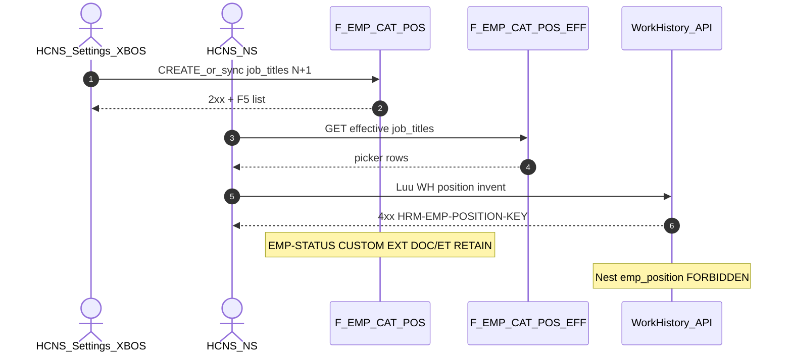

# PO-HRM-DYNAMIC-CONFIG-PLATFORM-EMP-POSITION-CATALOG-SA-01 — Option/F.1 · EMP position (`position_key` / `job_titles`) open catalog

| Field | Value |
|-------|--------|
| **work_item_id** | `PO-HRM-DYNAMIC-CONFIG-PLATFORM-EMP-POSITION-CATALOG-SA-01` |
| **Parent** | `PO-HRM-DYNAMIC-CONFIG-PLATFORM-EMP-STATUS-CATALOG-QC-01` **GWC L1** · stamp **`EMPSTQA-MSK20G7H`** · U88 continuous · prior BA-01 §2.1 **Chức danh / phòng ban** P0 (**WH free-text F**) |
| **Program** | `PO-HRM-CONTINUOUS-W8-20260807` |
| **lane** | governance · sa |
| **change_mode** | **ADD** Option/F.1 narrow **AC-PLT-EMP-01*** deepen · **EXPAND** Settings/XBOS `job_titles` SoT (producer **LIVE**) · **NO** Nest `emp_position` · **NO CODE** `apps/**` · **no seed** · **no wipe** EMP-STATUS L1 · EMP-CUSTOM · MergeToken EXT · DOC/ET · ATT/SI/CTR |
| **Date** | 2026-08-08 |
| **Status** | **CONFIRMED** — Option **A** **LOCKED** (Settings/XBOS `job_titles` effective = open position catalog SoT) · ba-data **HOLD** · ba-process **UNLOCK** · BE **HOLD** until BA · **dept companion OUT / follow-on** |
| **prior_qc** | [`emp-status-catalog-qc-01`](../../qa/evidence/po-hrm-dynamic-config-platform-emp-status-catalog-qc-01.md) **GWC** L1 · stamp **`EMPSTQA-MSK20G7H`** · honesty personnel/e2e/printable=false · **`C-SLICE-≠-MODULE`** · FE invent EMP-STATUS **HOLD** |
| **prior_ba** | [`PO-HRM-DYNAMIC-CONFIG-PLATFORM-BA-01.md`](./PO-HRM-DYNAMIC-CONFIG-PLATFORM-BA-01.md) §2.1 EMP row **Chức danh / phòng ban** · **AC-PLT-EMP-01** · **BR-PLT-02/04/05/06** |
| **ref_peer_emp_status** | EMP-STATUS Option **B** Nest DEFINE — **pattern cite ≠ copy** (Nest absent + hardcode → B) · **RETAIN** L1 |
| **ref_peer_emp_custom** | EMP-CUSTOM Option **A** Settings extension LIVE — **closest peer class** (producer LIVE → deepen A) · stamp **`EMPCFQA-MSK14LUH`** · **RETAIN** |
| **ref_peer_emp_doc_et** | EMP DOC/ET Nest Option **B** · [`EMP-VERTICAL-SA-01`](./PO-HRM-DYNAMIC-CONFIG-PLATFORM-EMP-VERTICAL-SA-01.md) **L-EMP-CAT-05** position ≠ EMP Nest table · **RETAIN** |
| **ref_peer_ext** | MergeToken EMP EXT **`EMPTOKEXTQA-MSJ57PE1`** · **RETAIN** · **≠** position SoT |
| **ref_adr** | [`ADR-HRM-DYNAMIC-CONFIG-PLATFORM`](../../architecture/ADR-HRM-DYNAMIC-CONFIG-PLATFORM.md) Option B platform · L1 Catalog · **BR-PLT-06** XBOS khung · Q-PLT-03 mega-EAV DENY |
| **Honesty** | `hrm_personnel_uat_ready=false` · `employees_e2e_linkage_ready=false` · `contracts_printable_ready=false` · **DENIED** invent module EMP UAT · **DENIED** reopen EMP-STATUS / EMP-CUSTOM / EXT / DOC-ET / ATT / SI / CTR · **DENIED** invent FE for EMP-STATUS HOLD · **`C-SLICE-≠-MODULE`** · U65 |
| **must_keep** | Settings/XBOS `job_titles` SoT · `assertCodeInEffectiveCatalog` consumers (EMP / WH / CTR / DEC / REC) · EMP VERTICAL **AC-PLT-EMP-01** XBOS REF · soft-delete · scope_parity U19 · display-ready labels · EMP-STATUS L1 · EMP-CUSTOM CNS · EXT · DOC/ET · ATT/SI/CTR |
| **ack_status** | **PASS_TO_PM** · **CONFIRMED** |

---

## 1. Decision context (ADR option pack)

| | |
|--|--|
| **Decision title** | AC-PLT-EMP-01 — EMP **position** open catalog (`position_key` / `job_title_key` ∈ Settings/XBOS `job_titles`) · admin CREATE/sync N+1 · consumer invent KEY when EFF ≠ empty · close WH free-text **F** residual |
| **Requestor** | pm · U88 after EMP-STATUS-CATALOG-QC-01 GWC L1 · BA-01 §2.1 P0 position/dept |
| **Decision owner** | sa |
| **Related** | BA-01 §2.1 · AC-PLT-EMP-01 · BR-PLT-02/04/05/06 · EMP VERTICAL L-EMP-CAT-05 · peer EMP-CUSTOM A · EMP-STATUS B (cite ≠ copy) |

### 1.1 Problem — AS-IS vs target

| Current state (AS-IS evidence) | Gap / target |
|--------------------------------|--------------|
| Settings-catalogs storageKey **`job_titles`** LIVE (aliases `positions` / `employee_positions`) · XBOS sync + HRM extension merge | Named **platform AC-PLT-EMP-01*** pack still residual on BA matrix P0 — not «missing Nest» |
| BE consumers already assert ∈ `job_titles`: `employees.job_title_key` · WH `position_key` (`HRM-WH-PICK-REQUIRED` / `HRM-WH-PICK-EMPTY-CATALOG`) · CTR/DEC `position_key` · REC JD position | **Unify** invent KEY class + empty CTA + FE picker gaps under **AC-PLT-EMP-01*** — **FORBIDDEN** free-text SoT when EFF>0 (**BR-PLT-02**) |
| BA-01 stamp **EMP-D2** / WH free-text **F** · AC-PLT-EMP-01 «WH create: position = catalog picker» | Close **F** residual as **consumer bind** deepen — not new dual master |
| **No** Nest table `emp_position` / `emp_job_title` (grep empty vs DOC/ET / status Nest) | EMP VERTICAL **L-EMP-CAT-05** + client DB/API **OUT** invent Nest position — **must_keep** |
| EMP VERTICAL must_keep: position/dept = **XBOS REF** via settings-catalogs | This seat **EXPAND** that lock — **FORBIDDEN** reopen as Nest Option B DEFINE |
| EMP-STATUS L1 Nest ST/STR · EMP-CUSTOM Option A · EXT · DOC/ET | **Orthogonal** — **FORBIDDEN** fold position into status/custom/DOC |

**Failure if unresolved:** Team invents Nest `emp_position` dual master vs XBOS; or paints Settings-MD-alone as peer Nest Option B; or flips personnel UAT; or reopens EMP-STATUS HOLD FE; WH free-text F remains while BA P0 open.

### 1.2 Constraints

- Docs-only this seat · **no** `apps/**` · **no** seed (U65)
- **DENY** `hrm_personnel_uat_ready=true` · `employees_e2e_linkage_ready=true` · printable · Phase1 · module EMP UAT
- **SEAL RETAIN:** EMP-STATUS L1 (`EMPSTQA-MSK20G7H`) · EMP-CUSTOM (`EMPCFQA-MSK14LUH`) · MergeToken EXT (`EMPTOKEXTQA-MSJ57PE1`) · DOC/ET · ATT leave/worksite · SI type/insurer · CTR · enrollment · PAY/DEC/REC
- **DENY** invent FE for EMP-STATUS HOLD residual
- Cite EMP VERTICAL L-EMP-CAT-05 — **cấm** invent Nest `emp_position` / mega EMP EAV

### 1.3 Why Option A (not EMP-STATUS Option B)

| EMP status (Option **B**) | EMP position (this seat → **A**) |
|---------------------------|----------------------------------|
| Nest SoT **absent** · Settings bind → **hardcode** fallback · closed CHECK | Settings/XBOS `job_titles` **LIVE** producer + multi-consumer assert already |
| Peer DOC/ET Nest DEFINE class | Peer EMP VERTICAL **explicit OUT** Nest position dual master |
| EMP-CUSTOM Option A **≠** applicable (no LIVE extension producer for status) | Closest peer = EMP-CUSTOM Option **A** (deepen LIVE Settings producer) |

**BA «Catalog Settings» cell:** SA **confirms** Settings/XBOS as **writer SoT** for position (group XBOS khung + tenant extension — **BR-PLT-06**) — **not** «Settings MD alone when Nest needed». Nest is **not** needed: intentional XBOS REF SoT.

---

## 2. Options

### Option A — Settings/XBOS `job_titles` = authoritative open position SoT — **RECOMMEND / LOCK**

| | |
|--|--|
| **Description** | **Sole** `position_key` / `job_title_key` SoT = Settings-catalogs **effectiveItems** for storageKey **`job_titles`** (XBOS publish/pull khung + HRM tenant extension where ADR allows). Admin **CREATE / sync open N+1** (**BR-PLT-05** — **FORBIDDEN** closed enum ceiling). When **effective active count > 0**, consumers (WH create/update · employee job title · CTR/DEC position · REC JD bind) **must** use code ∈ EFF (**BR-PLT-02**); invent → platform **`HRM-EMP-POSITION-KEY`** (WH may **retain alias** `HRM-WH-PICK-REQUIRED` as same class — BA maps ≡ / EXPAND). Empty EFF → soft empty + CTA Settings · invent assert **empty-catalog** class (`HRM-WH-PICK-EMPTY-CATALOG` retain) · **no seed** · **FORBIDDEN** free-text fallback SoT. Soft-retire / inactive hide from picker · history rows keep retired keys (**BR-PLT-04**). Display-ready labels from catalog (OS 28). **Dept** (`departments` / `department_key`) = **same Option A architecture** but **BA AC pack DEFERRED** follow-on (**OUT** this seat primary). |
| **Benefits** | Matches LIVE producer + EMP VERTICAL must_keep; closes BA-01 P0 F residual without dual master; peer EMP-CUSTOM admin≠consumer split; zero ba-data Nest ADD; honesty-safe. |
| **Costs** | ba-process AC matrix deepen · optional FE WH picker gap · optional BE invent-KEY alias unify after BA. |
| **Risks** | Misread «Settings MD alone» as rejected peer SI/ATT class → mitigate **L-EMP-POS-01** (XBOS REF SoT intentional · Nest forbidden). |

### Option B — Nest `emp_position` / `emp_job_title` = new open catalog · Settings REF only

| | |
|--|--|
| **Description** | DEFINE Nest `ICatalogRow` table + F-EMP-CAT-POS-* CRUD/EFF peer EMP DOC/ET / STATUS; Settings `job_titles` demote to REF merge-read. |
| **Benefits** | Symmetry with Nest status/DOC on paper. |
| **Costs** | Dual master vs XBOS sync SoT · reopen EMP VERTICAL L-EMP-CAT-05 · ba-data ADD · rewire all asserts · FE rewrite · seal churn. |
| **Risks** | Violates EMP VERTICAL + client DB/API OUT · BR-PLT-06 khung — **REJECT GĐ1**. |

### Option C — Hybrid dual writers / mega-EAV / fold into emp_custom_field / Settings-MD-alone-when-Nest-needed / invent UAT / reopen seals

| | |
|--|--|
| **Description** | Nest **and** Settings both write; or fold position into EMP-CUSTOM extension / status catalog; or claim Nest needed then use MD-alone; or flip `hrm_personnel_uat_ready` / invent EMP-STATUS FE / reopen EXT. |
| **Benefits** | None for GĐ1 honesty. |
| **Costs** | Dual SoT · seal reopen · spine confusion. |
| **Risks** | **REJECT** — DENY mega-EAV · DENY fold · DENY reopen · DENY personnel flip · DENY Nest invent · DENY MD-alone *as substitute when Nest needed* (Nest not needed here). |

---

## 3. Trade-off matrix

| Criteria | Weight | **A Settings/XBOS LIVE** | B Nest emp_position | C Hybrid / fold / UAT invent |
|----------|-------:|-------------------------:|--------------------:|-----------------------------:|
| Business value (BR-PLT-02/06 · AC-PLT-EMP-01 · close F) | 5 | **5** | 2 | 0 |
| Honesty / seal safety (EMP-STATUS·CUSTOM·EXT·VERTICAL retain) | 5 | **5** | 1 | 0 |
| Single position SoT (no dual master vs XBOS) | 5 | **5** | 1 | 0 |
| Time to deliver | 4 | **4** | 1 | 2 |
| Complexity | 4 | **4** | 1 | 0 |
| Maintainability (admin open ≠ consumer invent) | 4 | **5** | 3 | 1 |
| **Weighted** | | **116** | 36 | 8 |

---

## 4. Decision

| | |
|--|--|
| **Selected** | **Option A** — architecture **LOCKED** |
| **Seat verdict** | **CONFIRMED** |
| **Why A** | Position producer **already LIVE** on Settings/XBOS `job_titles` with consumer asserts; residual is **named AC pack + WH free-text F / picker gaps**, not Nest absence. EMP VERTICAL **forbids** Nest dual master. Peer EMP-CUSTOM chose Option A for LIVE Settings producer; EMP-STATUS chose B because Nest absent + hardcode — **cite ≠ copy**. |
| **Rejected** | **B** Nest `emp_position` DEFINE · **C** hybrid / mega-EAV / fold into custom·status / UAT invent / reopen seals / MD-alone-when-Nest-needed |
| **Assumptions** | XBOS sync + settings-catalogs remain SoT khung; tenant extension N+1 allowed per ADR; EMP-STATUS FE HOLD stays HOLD; dept same Option A but follow-on AC. |

### 4.1 Physical / DATA / BA / BE gates

| Question | Answer |
|----------|--------|
| New ba-data physicalize Nest? | **HOLD** — **FORBIDDEN** ADD `emp_position` · Settings/XBOS physical **LIVE** |
| Unlock ba-process? | **YES** — `PO-HRM-DYNAMIC-CONFIG-PLATFORM-EMP-POSITION-CATALOG-BA-01` AC pack (position primary) |
| Unlock ba-data? | **NO** this seat (no Nest ADD) |
| Unlock BE? | **HOLD** until BA — then narrow CNS invent-KEY / empty CTA deepen **only if GAP** vs existing WH/EMP asserts · **cấm** Nest table · **cấm** reopen EMP-STATUS BE |
| Unlock FE? | After BA — WH/employee pickers bind EFF `job_titles`; **FORBIDDEN** free-text SoT when EFF>0 · **FORBIDDEN** invent EMP-STATUS FE |
| Reopen EMP-STATUS / CUSTOM / EXT / DOC-ET / ATT / SI / CTR? | **FORBIDDEN** |
| Dept companion | **Same Option A LOCK** architecture · **OUT** primary AC this seat → follow-on `…-EMP-DEPT-CATALOG-*` |

### 4.2 Why not EMP-STATUS-style «Option B»

| EMP status (B) | EMP position (A) |
|----------------|------------------|
| Hardcode list + closed CHECK + no Nest | LIVE catalog + asserts; Nest invent **forbidden** by L-EMP-CAT-05 |
| Settings empty → hardcode SoT | Settings empty → empty-catalog **block free-text** (already coded) + CTA |
| DEFINE Nest aligns peers | DEFINE Nest **breaks** XBOS REF must_keep |

---

## 5. Locks (EMP-POS)

| Lock | Rule |
|------|------|
| **L-EMP-POS-01 Position SoT** | Settings/XBOS **`job_titles`** effective = authoritative **`position_key` / `job_title_key`** SoT — **FORBIDDEN** Nest `emp_position` dual master · **FORBIDDEN** free-text SoT when EFF>0 |
| **L-EMP-POS-02 XBOS khung** | Group XBOS publish/pull = SoT khung (**BR-PLT-06**) · HRM Settings = consumer + tenant extension — **FORBIDDEN** invent second HRM-only master replacing XBOS |
| **L-EMP-POS-03 Admin open** | CREATE/sync N+1 open slug (**BR-PLT-05**) — **FORBIDDEN** closed enum ceiling / reject N+1 because «not in starter list» |
| **L-EMP-POS-04 Consumer invent** | EFF>0 → invent unknown position → **`HRM-EMP-POSITION-KEY`** (alias retain **`HRM-WH-PICK-REQUIRED`** on WH — same class) |
| **L-EMP-POS-05 Empty EFF** | Soft empty + CTA Settings · **`HRM-WH-PICK-EMPTY-CATALOG`** class · invent free-text **FORBIDDEN** · **no seed** |
| **L-EMP-POS-06 Dept companion** | `departments` = same Option A · **OUT** primary AC pack this seat (follow-on) — **FORBIDDEN** invent Nest `emp_department` here |
| **L-EMP-POS-07 Orthogonal** | **≠** EMP-STATUS Nest · **≠** EMP-CUSTOM extension-items · **≠** DOC/ET · **≠** employment_type |
| **L-EMP-POS-08 Seals retain** | **FORBIDDEN** reopen EMP-STATUS L1 · EMP-CUSTOM · EXT · DOC/ET · ATT · SI · CTR · enrollment |
| **L-EMP-POS-09 Honesty** | **DENIED** personnel / e2e / printable ready · module EMP UAT · Phase1 · **`C-SLICE-≠-MODULE`** |
| **L-EMP-POS-10 Soft-delete** | Retire = soft · history WH/CTR/DEC may keep retired keys (**BR-PLT-04**) · **FORBIDDEN** hard-delete |
| **L-EMP-POS-11 Scope** | list ↔ get-by-id ↔ mutate = `resolveHrmListScope` (**U19**) |
| **L-EMP-POS-12 Display-ready** | Prefer catalog `*_label` — FE **cấm** join invent when BE provides |
| **L-EMP-POS-13 Mega-EAV** | **FORBIDDEN** fold position into `emp_custom_field` / mega EMP catalog / status reason |
| **L-EMP-POS-14 EMP-STATUS FE** | **FORBIDDEN** invent FE for EMP-STATUS HOLD as part of this seat |

---

## 6. API_DESIGN F.1 (EXPAND LIVE Settings — unlock ba-process; ba-data HOLD)

### 6.1 Admin / position catalog (existing Settings path — deepen AC, not new Nest)

| ID | METHOD / path (proposed / cite LIVE) | Mục đích | Nghiệp vụ | Tham chiếu |
|----|--------------------------------------|----------|-----------|-----------|
| **F-EMP-CAT-POS-01** | `GET …/settings-catalogs` / items `job_titles` (LIVE) | List position catalog | Scope · display-ready · soft filter | BR-PLT-04/05/06 |
| **F-EMP-CAT-POS-02** | Settings / XBOS sync upsert extension N+1 | Admin CREATE/sync open | Open slug · UQ active · **BR-PLT-05** | **AC-PLT-EMP-01** |
| **F-EMP-CAT-POS-03** | Update metadata / soft-retire | Retire hide picker | History keys OK | BR-PLT-04 |
| **F-EMP-CAT-POS-EFF-01** | Effective `job_titles` union XBOS+extension | Consumer picker SoT | Tenant extension wins collision per ADR | **BR-PLT-06** |

**FORBIDDEN:** invent `GET/POST …/employees/positions*` Nest domain table as GĐ1 SoT.

### 6.2 Consumer invent KEY (after BA — deepen if GAP)

| ID | Surface | Mục đích | Error |
|----|---------|----------|-------|
| **F-EMP-POS-CNS-01** | WH create/update `position_key` | Enforce ∈ EFF when count>0 | **`HRM-EMP-POSITION-KEY`** ≡ **`HRM-WH-PICK-REQUIRED`** |
| **F-EMP-POS-CNS-02** | Employee create/update `job_title_key` | Same SoT | **`HRM-EMP-POSITION-KEY`** (or retain existing catalog assert code — BA maps) |
| **F-EMP-POS-CNS-03** | CTR/DEC `position_key` / `signer_position_key` | Same SoT | invent KEY class · **RETAIN** existing CTR/DEC asserts |
| **F-EMP-POS-CNS-04** | Empty EFF | Block free-text · CTA | **`HRM-WH-PICK-EMPTY-CATALOG`** retain |

**Empty EFF:** skip invent-as-accept · UI CTA · **no seed**.



### 6.3 Physical pointer (ba-data — HOLD)

| Artifact | Role | Notes |
|----------|------|-------|
| Settings `job_titles` (+ XBOS snapshot / extension) | Position `ICatalogRow`-class SoT | **LIVE** — no Nest ADD |
| `employee_work_timeline.position_key` | Consumer text | Validate ∈ EFF |
| `employees.job_title_key` | Consumer text | Validate ∈ EFF |
| Nest `emp_position` | — | **FORBIDDEN** this program GĐ1 |

**Dept physical:** `departments` LIVE same class — **follow-on** AC · **FORBIDDEN** Nest `emp_department` this seat.

---

## 7. Acceptance pointers (ba-process unlock — draft IDs)

| ID | PASS when (draft — BA owns final wording) |
|----|-------------------------------------------|
| **AC-PLT-EMP-01** | WH create: position = catalog picker ∈ EFF `job_titles`; reject free-text SoT (**BA-01** retain wording) |
| **AC-PLT-EMP-01b** | EFF>0 · invent unknown `position_key` / `job_title_key` → **`HRM-EMP-POSITION-KEY`** (≡ WH-PICK-REQUIRED class) |
| **AC-PLT-EMP-01c** | EFF=0 · empty catalog → CTA Settings · **no seed** · free-text SoT **FORBIDDEN** (`HRM-WH-PICK-EMPTY-CATALOG`) |
| **AC-PLT-EMP-01d** | Admin CREATE/sync N+1 on `job_titles` → 2xx → F5 picker includes row (**BR-PLT-05**) |
| **AC-PLT-EMP-01e** | Soft-retire / inactive → hidden picker · history WH/CTR OK |
| **AC-PLT-EMP-01H** | Honesty false · EMP-STATUS/CUSTOM/EXT/DOC-ET/ATT/SI/CTR retain · **C-SLICE-≠-MODULE** · no personnel flip · no EMP-STATUS FE invent · Nest `emp_position` DENY |

**VAL pointers:** VAL-EMP-POS-CNS-* · VAL-SET-MD-01 / FR-HRM-SC-POS-01 retain · WH jest `HRM-WH-PICK-REQUIRED` retain.

**Dept:** draft **AC-PLT-EMP-DEPT-01*** → **OUT** follow-on WI.

---

## 8. Explicit OUT / DENY

| OUT | Rule |
|-----|------|
| Flip `hrm_personnel_uat_ready` / `employees_e2e_linkage_ready` / printable | **DENIED** |
| Nest `emp_position` / `emp_job_title` / dual master vs XBOS | **DENIED** |
| Fold into EMP-CUSTOM / EMP-STATUS / DOC/ET / mega-EAV | **DENIED** |
| Reopen EMP-STATUS L1 / invent EMP-STATUS FE HOLD | **DENIED** |
| Reopen EMP-CUSTOM · MergeToken EXT · DOC/ET · ATT · SI · CTR · enrollment | **DENIED** |
| Seed `job_titles` for UF | **DENIED** (U65) |
| Module EMP UAT / Phase1 DONE | **DENIED** · **`C-SLICE-≠-MODULE`** |
| Claim Settings MD alone = peer Nest Option B equivalent | **DENIED** (this is intentional XBOS REF Option A) |
| Primary dept AC pack this seat | **OUT** → follow-on (architecture Option A locked) |
| Seed / flip personnel / Phase1 | **DENIED** |

---

## 9. Rollout / unlock

```text
EMP-POSITION-CATALOG-SA-01 (this) CONFIRMED · Option A LOCKED
  → ba-process: PO-HRM-DYNAMIC-CONFIG-PLATFORM-EMP-POSITION-CATALOG-BA-01 AC pack
  → ba-data: HOLD (no Nest ADD)
  → (after BA) BE/FE: CNS invent KEY / WH picker deepen IF GAP only
  → QA U65 AC-PLT-EMP-01* · retain EMP-STATUS/CUSTOM/EXT
  → QC narrow — DENY personnel / module EMP UAT / Nest emp_position / reopen seals
  → (later) EMP-DEPT-CATALOG follow-on — same Option A
```

| Wave | Owner | Exit |
|------|-------|------|
| **This** | sa | Option A LOCKED · F.1 · ba-process **UNLOCK** · ba-data **HOLD** · BE HOLD |
| **AC pack** | ba-process | AC-PLT-EMP-01* CONFIRMED |
| **DATA** | ba-data | **HOLD** — no WI unless BA finds physical GAP (unexpected) |
| **BE/FE** | dev-be / dev-fe | Only after BA · GAP-only · no Nest |
| **QA/QC** | qa → qc | Narrow seal · honesty false |

**Rollback:** Keep existing asserts; do not introduce Nest position table; do not re-enable free-text SoT when EFF>0.

---

## 10. Completion

| Field | Value |
|-------|--------|
| **completion_report** | Option **A CONFIRMED LOCKED** — EMP **position** open catalog SoT = Settings/XBOS **`job_titles`** effective (producer LIVE); admin CREATE/sync N+1 ≠ consumer invent **`HRM-EMP-POSITION-KEY`** (WH alias `HRM-WH-PICK-REQUIRED`); empty → CTA / `HRM-WH-PICK-EMPTY-CATALOG` · no seed; Nest `emp_position` **REJECT** (EMP VERTICAL L-EMP-CAT-05); Option B Nest / Option C fold·mega-EAV·reopen·UAT invent **REJECT**; dept = same Option A **OUT** follow-on; EMP-STATUS L1 · EMP-CUSTOM · EXT · DOC/ET · ATT/SI/CTR **RETAIN**; ba-data **HOLD**; ba-process **UNLOCK**; BE HOLD; honesty personnel false · **C-SLICE-≠-MODULE**. |
| **next_owner** | `ba-process` |
| **ack_status** | **PASS_TO_PM** |
| **evidence_path** | `docs/qa/evidence/po-hrm-dynamic-config-platform-emp-position-catalog-sa-01.md` |
