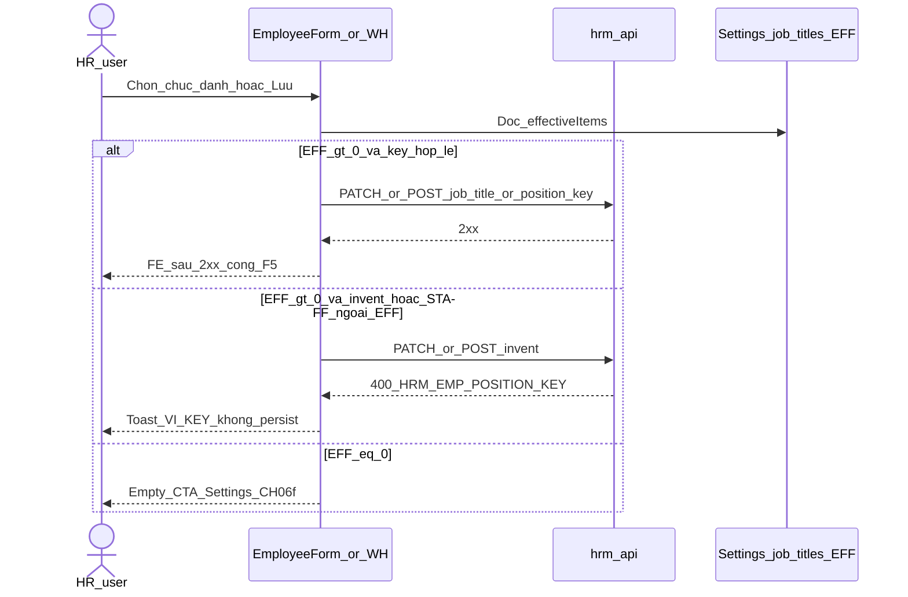

# PO-HRM-DYNAMIC-CONFIG-PLATFORM-EMP-POSITION-FE-SA-01 — Option/F.1 · FE residual **R-PLT-EMP-POS-FE-01** (WH / EMP position picker deepen)

| Field | Value |
|-------|--------|
| **work_item_id** | `PO-HRM-DYNAMIC-CONFIG-PLATFORM-EMP-POSITION-FE-SA-01` |
| **Parent** | EMP-POSITION-CATALOG-QC-01 **GWC** L1 stamp **`EMPPOSQA2-MSK3CDH1`** · DOCS CH06f **ACCEPT** · residual **FE WH picker deepen HOLD** (mint **R-PLT-EMP-POS-FE-01**) |
| **U88 context** | EMP-STATUS QC-FE-01 **GWC** · **R-PLT-EMP-ST-FE-01 CLOSED ACCEPT** (agent e479b628) · FE-ADMIN EMP-ST **HOLD RETAIN** · LVRULE 01g **HOLD RETAIN** (DENY invent) · continuous residual = EMP-POSITION FE picker deepen |
| **Program** | `PO-HRM-CONTINUOUS-W8-20260807` |
| **lane** | governance · sa · **narrow FE HOLD disposition only** |
| **change_mode** | **ADD** Option/F.1 for **R-PLT-EMP-POS-FE-01** · **NO CODE** `apps/**` · **no seed** · **no wipe** EMP-POSITION L1 · EMP-STATUS FE CLOSED · EMP-CUSTOM · ATT · LVRULE HOLD · Nest `emp_position` DENY |
| **Date** | 2026-08-08 |
| **Status** | **CONFIRMED** — Option **A** **LOCKED** · **UNLOCK FE consumer Settings `job_titles` EFF picker deepen** (peer EMP-STATUS / ATT-CODE FE-SA Option A) · ba-process **HOLD** (AC-PLT-EMP-01* already locked) · next = **dev-fe** |
| **prior_seals** | EMP-POSITION L1 `EMPPOSQA2-MSK3CDH1` · DOCS CH06f · EMP-STATUS L1 `EMPSTQA-MSK20G7H` · EMP-STATUS FE CLOSED · EMP-CUSTOM `EMPCFQA-MSK14LUH` · MergeToken EXT `EMPTOKEXTQA-MSJ57PE1` · DOC/ET · ATT/SI/CTR · LVRULE FE-01g ACCEPT_AS_IS HOLD — **SEAL / HOLD RETAIN** |
| **prior_sa** | [`EMP-POSITION-CATALOG-SA-01`](./PO-HRM-DYNAMIC-CONFIG-PLATFORM-EMP-POSITION-CATALOG-SA-01.md) Option **A** Settings/XBOS `job_titles` SoT — this seat **≠** reopen catalog SoT · **≠** invent Nest `emp_position` |
| **prior_ba** | [`EMP-POSITION-CATALOG-BA-01`](./PO-HRM-DYNAMIC-CONFIG-PLATFORM-EMP-POSITION-CATALOG-BA-01.md) **AC-PLT-EMP-01 / 01b / 01c / 01d / 01e / 01H** · VAL-EMP-POS-CNS-* already locked — **RETAIN** |
| **peer_cite_unlock** | [`EMP-STATUS-FE-SA-01`](./PO-HRM-DYNAMIC-CONFIG-PLATFORM-EMP-STATUS-FE-SA-01.md) Option **A** · [`ATT-CODE-FE-SA-01`](./PO-HRM-DYNAMIC-CONFIG-PLATFORM-ATT-CODE-FE-SA-01.md) Option **A** — consumer EFF rebind when surface LIVE + KEY LIVE |
| **peer_cite_hold** | [`ATT-LVRULE-FE-01G-SA-01`](./PO-HRM-DYNAMIC-CONFIG-PLATFORM-ATT-LVRULE-FE-01G-SA-01.md) ACCEPT_AS_IS_P2 · EMP-STATUS FE-ADMIN HOLD — **cite ≠ copy onto consumer residual** |
| **Honesty** | `hrm_personnel_uat_ready=false` · `employees_e2e_linkage_ready=false` · `contracts_printable_ready=false` · **`C-SLICE-≠-MODULE`** · U65 · **DENIED** module EMP UAT · seed · reopen L1 POSITION · reopen EMP-STATUS FE CLOSED · invent LVRULE / EMP-ST FE-ADMIN · Nest `emp_position` · Face |
| **ack_status** | **PASS_TO_PM** · **CONFIRMED** |

---

## 1. Decision context (ADR option pack)

| | |
|--|--|
| **Decision title** | Disposition for **R-PLT-EMP-POS-FE-01** (P2) — unlock FE WH/EMP position picker deepen vs ACCEPT_AS_IS HOLD vs invent Nest / reopen seals |
| **Requestor** | pm · U88 continuous after EMP-STATUS FE CLOSED + EMP-POSITION L1 GWC + DOCS CH06f ACCEPT · residual FE WH picker HOLD |
| **Decision owner** | sa |
| **Related** | AC-PLT-EMP-01 / 01b / 01c / 01d / 01e / 01H · VAL-EMP-POS-CNS-01/02/03 · BR-PLT-EMP-POS-02/03/04 · F-EMP-CAT-POS-EFF · F-EMP-POS-CNS-01/02/04 · invent KEY **`HRM-EMP-POSITION-KEY`** ≡ **`HRM-WH-PICK-REQUIRED`** · empty **`HRM-WH-PICK-EMPTY-CATALOG`** |

### 1.1 Problem — what FE surface is HOLD (AS-IS evidence)

QC-01 sealed EMP-POSITION **L1** (Settings/XBOS `job_titles` EFF · invent **400 `HRM-EMP-POSITION-KEY`** · no persist · Nest `emp_position` DENY · stamp **`EMPPOSQA2-MSK3CDH1`**). DOCS CH06f ACCEPT. Remaining product Condition from QC/DOCS:

| Residual ID | Severity | Surface inventory | Proven already (RETAIN) |
|-------------|----------|-------------------|-------------------------|
| **R-PLT-EMP-POS-FE-01** *(minted this seat)* | **P2 HOLD → unlock candidate** | **Consumer LIVE:** `EmployeeFormDialog` position = `CatalogSearchPicker` ← Settings `job_titles`/`positions`/`employee_positions` EFF; `EmployeeWorkTimeline` (WH) position_key = `CatalogSearchPicker` + `jobTitleOptionsFromCatalog` + emptyHint CTA; CTR/DEC/REC also picker-bound. **Gaps:** invent KEY toast for **`HRM-EMP-POSITION-KEY`** / WH alias **ABSENT** on EMP mutate path (status KEY toast LIVE · position KEY toast missing); edit-value resolve for invent/`STAFF` UAT rows (orthogonal OBS from EMP-STATUS QA-FE); empty EFF CTA / empty-catalog class messaging deepen vs CH06f; soft-retire hide consistency | L1 invent KEY LIVE · EFF active **8** · Nest deny 404 · R-PLT-EMP-POS-BE-01 CLOSED · DOCS CH06f |
| FE-ADMIN Nest `emp_position` / dual master | **DENIED forever** | Nest table ABSENT (intentional Option A) · Settings/XBOS admin CREATE/sync already LIVE | **FORBIDDEN invent Nest SoT** |
| EMP-STATUS FE CLOSED / FE-ADMIN EMP-ST / LVRULE 01g | **RETAIN** | Orthogonal — cite STAFF POSITION KEY OBS only | **FORBIDDEN reopen / invent** |

**Code facts (read-only audit — no apps edit this seat):**

| Layer | Fact | Gap vs AC-01 / VAL-CNS |
|-------|------|------------------------|
| BE invent KEY | `assertJobTitleKeyInCatalog` · PATCH/CREATE invent → **400 `HRM-EMP-POSITION-KEY`** · WH alias **`HRM-WH-PICK-REQUIRED`** ≡ same class · stamp `EMPPOSQA2-MSK3CDH1` | **SEALED** L1 — FE toast for POSITION KEY **not** wired on EMP mutate (peer STATUS KEY already wired) |
| BE Nest `emp_position` | ABSENT · live GET **404** | **must_keep DENY** — no FE Nest bind |
| Settings EFF `job_titles` | LIVE · active ≥1 (QA baseline **8**) | SoT Option A — FE already binds catalogs overview |
| FE `EmployeeFormDialog.tsx` ~L620–624 · L878–908 | `findCatalog(job_titles…)` + `CatalogSearchPicker` + emptyHint Settings CTA | **Deepen:** invent toast + edit resolve invent/STAFF + ensure free-text Input **never** returns as SoT |
| FE `EmployeeWorkTimeline.tsx` | CatalogSearchPicker `position_key` + emptyHint + Network keys | **Deepen:** surface invent KEY toast on 400 POSITION/WH-PICK; retain picker SoT · no free-text regress |
| FE `useEmployeeMutations.ts` | STATUS/REASON KEY toast LIVE · **no** `HRM-EMP-POSITION-KEY` branch | **GAP** — orthogonal STAFF OBS produced 400 without VI toast class peer STATUS |
| FE `EmployeeWorkHistory.tsx` | Legacy local `Input` free-text `position` | **OUT primary** this unlock (not WH timeline spine) — **do not** invent rewrite unless sponsor expands scope |
| FE admin Nest position CRUD | ABSENT (correct — Settings SoT) | **HOLD / DENY invent Nest admin** |

**Class discrimination (critical):**

| Class | Example | Disposition |
|-------|---------|-------------|
| **Consumer EFF picker deepen** (surface LIVE + L1 KEY LIVE + AC picker locked) | EMP-STATUS FE-01 · ATT-CODE FE-01 · OT/COMP/SHIFT FE · **THIS residual** | **UNLOCK** Option A |
| **FE-ADMIN / deepen ABSENT panel** (Network L1 OK · product admin FE OUT) | LVRULE FE-01g · OT FE-ADMIN · EMP-STATUS FE-ADMIN | **ACCEPT_AS_IS_P2 HOLD** — **not** this residual's primary class |
| **Invent Nest dual master / reopen / flip** | Nest `emp_position` · reopen EMP-STATUS FE CLOSED · invent LVRULE · flip personnel | **REJECT** Option C |

**Failure if unresolved badly:** KEEP forever HOLD while EFF>0 + KEY LIVE → admin CREATE/sync green + Network KEY live but FE Lưu invent/`STAFF` shows opaque error · CH06f consumer path unproven for invent toast · OR invent Nest `emp_position` «while at it» · OR reopen EMP-STATUS FE CLOSED because STAFF OBS · OR flip `hrm_personnel_uat_ready` · OR claim module EMP UAT.

### 1.2 Constraints

- Docs-only · **no** `apps/**` · **no** seed (U65)
- **DENY** Nest `emp_position` table / Nest admin FE invent
- **DENY** invent LVRULE FE 01g · invent EMP-STATUS FE-ADMIN · reopen EMP-STATUS FE CLOSED
- **DENY** reopen EMP-POSITION L1 invent KEY seat · EMP-CUSTOM CNS · MergeToken EXT · DOC/ET · ATT/SI/CTR
- **DENY** flip personnel / e2e / printable · module EMP UAT · Phase1 · Face · seed
- BA-01 **AC-01*** already exist — this seat is **disposition unlock**, not redefine Option A SoT
- must_keep: **POSITION KEY** · **EMP-STATUS FE CLOSED** · **EMP-CUSTOM** · **ATT** · **LVRULE HOLD** · **Nest emp_position DENY**

### 1.3 Decision heuristic

| Rule | Application |
|------|-------------|
| L1 KEY LIVE + consumer FE surface LIVE + AC picker locked → unlock consumer FE deepen | Prefer **A** (peer EMP-STATUS / ATT-CODE FE-SA) |
| QC/DOCS «do not invent FE as L1 mandatory» ≠ forever HOLD when U88 opens residual | L1 seal deferred Condition; now unlock **consumer deepen only** |
| ACCEPT_AS_IS HOLD reserved for ABSENT admin / MVP deepen without consumer picker LIVE | LVRULE 01g class — **reject as default here** (WH + EmployeeFormDialog LIVE) |
| REJECT invent Nest / reopen EMP-STATUS FE CLOSED / flip UAT | **C** |

### 1.4 Orthogonal OBS cite (do **not** reopen EMP-STATUS FE)

QA-FE EMP-STATUS observed UAT rows with `job_title_key=STAFF` → PATCH **400 `HRM-EMP-POSITION-KEY`** while Nest status+reason already in body. QC-FE **ACCEPT OBS** out of seat — **does not reopen** **R-PLT-EMP-ST-FE-01 CLOSED**. This FE-SA **owns** that OBS as **R-PLT-EMP-POS-FE-01** deepen (toast + prefer picker ∈ EFF / resolve edit value) — **FORBIDDEN** reopen EMP-STATUS FE CLOSED or invent EMP-ST FE-ADMIN.

---

## 2. Options

### Option A — Unlock FE consumer Settings `job_titles` EFF picker deepen (peer EMP-STATUS / ATT-CODE) — **RECOMMEND / LOCK**

| | |
|--|--|
| **Description** | Treat **R-PLT-EMP-POS-FE-01** as **named Condition closable** via `dev-fe` ADD-only: deepen consumer bind when **EFF>0** — retain `CatalogSearchPicker` ← Settings/XBOS `job_titles` effectiveItems on **EmployeeFormDialog** + **EmployeeWorkTimeline** (WH); ADD invent KEY toast VI for **400 `HRM-EMP-POSITION-KEY`** (and WH alias **`HRM-WH-PICK-REQUIRED`** as ≡ class) on EMP mutate + WH mutate paths (peer STATUS KEY toast); resolve edit value / block invent-only `STAFF`-class free keys when not ∈ EFF; empty EFF → soft empty + CTA Settings / CH06f · surface **`HRM-WH-PICK-EMPTY-CATALOG`** class · **no seed**; soft-retire hide from picker · history may keep retired keys. **KEEP** Nest `emp_position` **DENIED**. **KEEP** FE-ADMIN Nest position **ABSENT**. **KEEP** EMP-STATUS FE CLOSED / LVRULE HOLD / EMP-CUSTOM / ATT seals. |
| **Benefits** | Closes AC-PLT-EMP-01 / 01b companion FE path; clears orthogonal STAFF OBS with honest toast; aligns peer EMP-STATUS/ATT-CODE Option A; CH06f consumer invent path matches shipped FE; clears board FE HOLD without inventing Nest dual master. |
| **Costs** | One FE Task + QA-FE + QC-FE Condition close; vitest + browser U65. |
| **Risks** | Scope creep into Nest `emp_position` or EMP-STATUS FE reopen → mitigate with allowed_paths + DENY list. Legacy `EmployeeWorkHistory` free-text rewrite → keep **OUT** unless sponsor expands. |
| **Gate** | L1 `EMPPOSQA2-MSK3CDH1` RETAIN · Settings EFF LIVE · BA AC RETAIN · honesty false · EMP-STATUS FE CLOSED RETAIN. |

### Option B — ACCEPT_AS_IS_P2 HOLD RETAIN until sponsor opens FE wave

| | |
|--|--|
| **Description** | Keep Condition **R-PLT-EMP-POS-FE-01** as **P2 HOLD / NOTE** forever-until-sponsor (peer LVRULE FE-01g). Do not dispatch `dev-fe`. |
| **Benefits** | Bandwidth for other verticals; zero FE churn. |
| **Costs** | When EFF>0, invent/`STAFF` Lưu remains opaque 400 without VI KEY toast; CH06f invent path unproven; board residual stalls after L1+KEY LIVE + consumer picker already LIVE — same class EMP-STATUS/ATT-CODE already unlocked. |
| **Risks** | Misread HOLD as «AC-01 waived» or as FE-ADMIN/LVRULE class forever · sponsor sees Network KEY green but FE UX incomplete. |
| **Gate** | **Reject as default** — unlike LVRULE, consumer surface + Settings EFF + invent KEY already exist; QC HOLD was L1-mandatory deferral, not admin FE ABSENT. Retain B only if sponsor **explicitly** says defer EMP-POSITION FE. |

### Option C — Hybrid invent Nest emp_position / reopen EMP-STATUS FE / invent LVRULE / flip personnel

| | |
|--|--|
| **Description** | Invent Nest `emp_position` SoT + admin FE; or reopen EMP-STATUS FE CLOSED / invent EMP-ST FE-ADMIN / invent LVRULE 01g «while at it»; or flip `hrm_personnel_uat_ready` / claim module EMP UAT / seed density / Face. |
| **Benefits** | None for GĐ1 honesty. |
| **Costs** | Dual master vs XBOS · seal churn · C-SLICE violation · sponsor trust. |
| **Risks** | **REJECT** — DENY Nest emp_position · DENY reopen EMP-STATUS FE CLOSED · DENY invent LVRULE/EMP-ST FE-ADMIN · DENY ready flip · DENY seed · DENY module EMP UAT · DENY Face. |

---

## 3. Trade-off matrix

| Criteria | Weight | **A Unlock consumer FE** | B ACCEPT HOLD P2 | C Invent Nest/reopen/flip |
|----------|-------:|-------------------------:|-----------------:|--------------------------:|
| AC-01 / 01b / VAL-CNS honesty (invent toast + picker SoT) | 5 | **5** | 1 | 0 |
| Peer EMP-STATUS / ATT-CODE FE-SA class fit | 5 | **5** | 2 | 0 |
| Seal safety (POSITION L1·EMP-STATUS FE CLOSED·CUSTOM·ATT·LVRULE·Nest DENY) | 5 | **5** | **5** | 0 |
| Deny Nest emp_position / invent LVRULE / EMP-ST FE-ADMIN | 5 | **5** | **5** | 0 |
| Business value (KEY LIVE usable on hồ sơ / WH) | 4 | **5** | 1 | 1 |
| Blast radius / complexity | 4 | 4 | **5** | 0 |
| U88 continuous (close named residual) | 4 | **5** | 2 | 0 |
| **Weighted** | | **154** | 91 | 4 |

---

## 4. Failure modes and mitigation

| Option | Failure mode | Detection | Mitigation |
|--------|--------------|-----------|------------|
| **A** | FE invents Nest `emp_position` table/UI | Diff Nest routes / migrations | **FORBIDDEN** · L-EMP-POS-FE-01 Nest DENY RETAIN |
| **A** | Reopens EMP-STATUS FE CLOSED / invents EMP-ST FE-ADMIN | Diff status Select Nest admin | DENY · cite e479b628 CLOSED · FE-ADMIN HOLD |
| **A** | Invents LVRULE 01g / ATT FE-ADMIN | Diff LeaveTab / ATT admin | DENY paths · LVRULE HOLD RETAIN |
| **A** | Claims module EMP UAT after toast | Honesty matrix | **L-EMP-POS-FE-08** C-SLICE · personnel=false |
| **A** | Rewrites legacy WorkHistory free-text as mandatory | Diff EmployeeWorkHistory | Keep **OUT** primary · allowed_paths exclude unless sponsor |
| **A** | Omits KEY toast / empty CTA | QA 01b / 01c | Exit criteria invent toast + empty CTA |
| B | HOLD forever while EFF>0 + KEY LIVE | Board stall + STAFF OBS | Prefer A; B only sponsor-explicit defer |
| C | Nest invent / ready flip / seal reopen | Honesty / stamp | DENY · NO-GO process |

---

## 5. Decision

| | |
|--|--|
| **Selected** | **Option A** — architecture **LOCKED** |
| **Seat verdict** | **CONFIRMED** · **UNLOCK** FE consumer Settings `job_titles` EFF picker deepen |
| **Why A** | Consumer surfaces **LIVE** (`EmployeeFormDialog` + `EmployeeWorkTimeline` CatalogSearchPicker) + L1 invent KEY **LIVE** (`EMPPOSQA2-MSK3CDH1`) + AC-PLT-EMP-01* locked + Settings EFF>0 — same class as EMP-STATUS / ATT-CODE FE-SA Option A. Residual = deepen invent KEY toast + empty CTA + edit resolve (STAFF OBS), **not** ABSENT admin FE (LVRULE class). |
| **Rejected** | **B** ACCEPT_AS_IS_P2 as default · **C** Nest invent / reopen EMP-STATUS FE / invent LVRULE / flip UAT |
| **Assumptions** | Settings/XBOS `job_titles` remain SoT; Nest emp_position stays DENIED; EMP-STATUS FE CLOSED stays CLOSED; LVRULE HOLD stays HOLD; dept companion OUT remains follow-on. |
| **Sponsor trigger for B** | Only if sponsor says «defer EMP-POSITION FE / giữ HOLD» — then ACCEPT_AS_IS_P2 + honesty false RETAIN. |

### 5.1 Residual disposition matrix

| Residual | Pre-SA | Post-SA |
|----------|--------|---------|
| **R-PLT-EMP-POS-FE-01** | P2 HOLD (L1 deferred / DOCS note) | **UNLOCK** → dispatch **dev-fe** FE-01 |
| Nest `emp_position` | DENIED | **DENIED RETAIN** |
| EMP-STATUS FE CLOSED | CLOSED ACCEPT | **RETAIN CLOSED** — cite STAFF OBS only |
| FE-ADMIN EMP-ST / LVRULE 01g | HOLD | **HOLD RETAIN** — DENY invent |
| EMP-POSITION L1 | SEALED `EMPPOSQA2-MSK3CDH1` | **RETAIN** — cấm reopen invent KEY seat |
| EMP-CUSTOM / EXT / DOC-ET / ATT | SEAL RETAIN | **RETAIN** |
| DOCS CH06f | ACCEPT | **RETAIN** |

---

## 6. Architecture boundaries (UNLOCK inventory)

### 6.1 Consumer surfaces (IN)

| Surface | File | AS-IS bind | Deepen target |
|---------|------|------------|---------------|
| Form position picker | `EmployeeFormDialog.tsx` | Settings `job_titles` CatalogSearchPicker + emptyHint | RETAIN picker SoT when EFF>0; invent toast path; edit resolve invent/STAFF |
| WH timeline position | `EmployeeWorkTimeline.tsx` | CatalogSearchPicker `position_key` + emptyHint | RETAIN picker; invent KEY toast on 400 POSITION/WH-PICK; empty EFF CTA |
| EMP mutate toast | `useEmployeeMutations.ts` | STATUS/REASON KEY only | ADD **`HRM-EMP-POSITION-KEY`** toast VI (peer STATUS) |
| Optional helper | `lib/empPositionCatalog.ts` (+test) | ABSENT | ADD KEY constants + normalize/display helpers |
| Empty CTA | form + WH | Settings link partial | Align CH06f · **`HRM-WH-PICK-EMPTY-CATALOG`** class · **no seed** |

### 6.2 OUT / HOLD / DENY

| Item | Disposition |
|------|-------------|
| Nest `emp_position` table / routes / admin FE | **DENIED** |
| EMP-STATUS FE CLOSED reopen | **DENIED** |
| Invent EMP-ST FE-ADMIN / LVRULE 01g | **DENIED HOLD RETAIN** |
| Legacy `EmployeeWorkHistory.tsx` free-text | **OUT primary** this Task |
| CTR/DEC/REC picker rewrite | **OUT** unless regression — retain seals |
| Dept companion primary AC | **OUT** follow-on R-EMP-POS-DEPT-01 |
| Module EMP UAT / personnel flip / Face | **DENIED** |

### 6.3 EFF>0 Settings `job_titles` bind (must)

When `effectiveItems` active count **> 0**:

1. Consumer SoT = picker code ∈ EFF `job_titles` (aliases positions / employee_positions).
2. Invent unknown / free-text SoT → Network **4xx `HRM-EMP-POSITION-KEY`** (WH may show **`HRM-WH-PICK-REQUIRED`** ≡) + FE VI toast.
3. Soft-retire / inactive → hidden from picker; history may retain retired keys.
4. Display-ready labels from catalog (OS 28) — **cấm** raw key on UI.

When EFF **= 0**: soft empty + CTA Settings / CH06f · empty-catalog class · **FORBIDDEN** seed · **FORBIDDEN** free-text fallback SoT.

### 6.4 Sequence (consumer invent — deepen)



---

## 7. allowed_paths (UNLOCK → dev-fe)

```text
allowed_paths:
  - apps/web/hrm/src/components/employee/EmployeeFormDialog.tsx
  - apps/web/hrm/src/components/employee/EmployeeWorkTimeline.tsx
  - apps/web/hrm/src/hooks/useEmployeeMutations.ts
  - apps/web/hrm/src/lib/empPositionCatalog.ts (+test) optional
  - apps/web/hrm/src/lib/catalogSearchPicker.ts (+test) only if shared empty/invent helper ADD
  - apps/web/hrm/src/integrations/hrmApi.ts (error code const / WH mutate toast surface only — no Nest emp_position)
forbidden_paths:
  - apps/api/** (Nest emp_position DENY · L1 invent KEY seat RETAIN)
  - apps/web/hrm/src/components/employee/EmployeeWorkHistory.tsx (OUT primary)
  - EMP-STATUS form Nest admin / LVRULE LeaveTab admin invent
  - seed scripts / flip ready flags / Face
must_keep:
  - HRM-EMP-POSITION-KEY (≡ HRM-WH-PICK-REQUIRED)
  - EMP-STATUS FE CLOSED (e479b628)
  - EMP-CUSTOM / ATT seals
  - LVRULE HOLD
  - Nest emp_position DENY
  - Settings/XBOS job_titles SoT Option A
```

---

## 8. Architecture locks (L-EMP-POS-FE-*)

| Lock ID | Statement |
|---------|-----------|
| **L-EMP-POS-FE-01** | SoT = Settings/XBOS `job_titles` EFF — **FORBIDDEN** Nest `emp_position` |
| **L-EMP-POS-FE-02** | Unlock = consumer deepen only — **FORBIDDEN** invent Nest admin FE |
| **L-EMP-POS-FE-03** | Invent → toast **`HRM-EMP-POSITION-KEY`** (WH alias ≡) when EFF>0 |
| **L-EMP-POS-FE-04** | Empty EFF → CTA · **`HRM-WH-PICK-EMPTY-CATALOG`** · **no seed** |
| **L-EMP-POS-FE-05** | EMP-STATUS FE CLOSED **RETAIN** — STAFF OBS cite only · **FORBIDDEN reopen** |
| **L-EMP-POS-FE-06** | LVRULE 01g + EMP-ST FE-ADMIN **HOLD RETAIN** — **FORBIDDEN invent** |
| **L-EMP-POS-FE-07** | EMP-POSITION L1 `EMPPOSQA2-MSK3CDH1` **RETAIN** — **FORBIDDEN reopen invent KEY seat** |
| **L-EMP-POS-FE-08** | Honesty personnel/e2e/printable=false · **`C-SLICE-≠-MODULE`** · DENY module EMP UAT / Face |

---

## 9. Rollout / checkpoint plan

| Step | Owner | Exit |
|------|-------|------|
| 1. This SA PASS_TO_PM | sa | Option A LOCKED · residual UNLOCK |
| 2. Task `dev-fe` EMP-POSITION-CATALOG-FE-01 | pm → dev-fe | READY_FOR_QA · toast + picker deepen |
| 3. QA-FE browser U65 | qa | AC-01/01b invent toast · empty CTA · STAFF OBS closable · EMP-STATUS CLOSED not reopened |
| 4. QC-FE Condition close | qc | R-PLT-EMP-POS-FE-01 CLOSED · honesty false · C-SLICE |
| 5. U88 next | pm | FE-ADMIN note only OR next vertical — **DENY** Nest invent · **DENY** LVRULE invent |

---

## 10. Validation / acceptance evidence plan

| AC | Evidence expected |
|----|-------------------|
| AC-PLT-EMP-01 | WH/EMP picker ∈ EFF → 2xx → FE+F5 |
| AC-PLT-EMP-01b | Invent / STAFF-out-of-EFF → 400 KEY + VI toast · no persist |
| AC-PLT-EMP-01c | EFF=0 → empty CTA · no seed |
| AC-PLT-EMP-01H | honesty false · seals RETAIN · Nest DENY · EMP-STATUS FE CLOSED RETAIN |
| Orthogonal OBS | STAFF POSITION KEY now owned by this FE Condition — **not** status reopen |

---

## 11. Impacted systems / dependencies

| System | Impact |
|--------|--------|
| HRM web FE | ADD toast + deepen picker only |
| hrm-api | **NONE** this seat — L1 KEY RETAIN |
| Settings/XBOS job_titles | REF SoT RETAIN |
| EMP-STATUS FE | **CLOSED RETAIN** |
| Nest emp_position | **DENIED** |
| LVRULE / ATT | **HOLD / SEAL RETAIN** |

---

## 12. completion_report / next_dispatch

**Closed:** SA Option/F.1 for EMP-POSITION FE WH picker HOLD — Option **A LOCKED UNLOCK** consumer Settings `job_titles` EFF picker deepen (peer EMP-STATUS/ATT-CODE FE-SA); mint **R-PLT-EMP-POS-FE-01**; Nest `emp_position` DENY RETAIN; EMP-STATUS FE CLOSED / EMP-CUSTOM / ATT / LVRULE HOLD RETAIN; honesty false · C-SLICE; docs-only.

**Open:** PM Task **dev-fe** `PO-HRM-DYNAMIC-CONFIG-PLATFORM-EMP-POSITION-CATALOG-FE-01` → QA-FE → QC-FE Condition close.

**next_owner:** **pm** → **dev-fe**

**ack_status:** **PASS_TO_PM** · **CONFIRMED**

### next_dispatch_prompt (copy-ready)

```text
work_item_id: PO-HRM-DYNAMIC-CONFIG-PLATFORM-EMP-POSITION-CATALOG-FE-01
from_role: pm
to_role: dev-fe
lane: execution
priority: P2
change_mode: ADD
residual: R-PLT-EMP-POS-FE-01
entry_criteria:
  - SA FE Option A LOCKED — docs/program/specs/PO-HRM-DYNAMIC-CONFIG-PLATFORM-EMP-POSITION-FE-SA-01.md
  - L1 EMPPOSQA2-MSK3CDH1 RETAIN · Settings job_titles EFF LIVE · invent KEY HRM-EMP-POSITION-KEY LIVE
  - peer: EMP-STATUS / ATT-CODE FE Nest|Settings EFF deepen pattern
  - cite orthogonal STAFF POSITION KEY OBS from EMP-STATUS QA-FE — do NOT reopen EMP-STATUS FE CLOSED
exit_criteria:
  - EmployeeFormDialog + EmployeeWorkTimeline position picker = Settings job_titles EFF when EFF>0; bootstrap/empty only EFF=0 + CTA CH06f
  - invent / out-of-EFF (incl. STAFF OBS class) → Network 400 HRM-EMP-POSITION-KEY (or WH-PICK-REQUIRED ≡) + VI toast · no persist · F5
  - empty EFF CTA · no seed · soft-retire hide from picker
  - vitest + lint/build PASS · CODE-MEMORY · READY_FOR_QA
cấm: Nest emp_position · invent LVRULE 01g · invent EMP-ST FE-ADMIN · reopen EMP-STATUS FE CLOSED · reopen L1 POSITION · seed · flip ready · module EMP UAT · Face · rewrite EmployeeWorkHistory as mandatory
allowed_paths:
  - apps/web/hrm/src/components/employee/EmployeeFormDialog.tsx
  - apps/web/hrm/src/components/employee/EmployeeWorkTimeline.tsx
  - apps/web/hrm/src/hooks/useEmployeeMutations.ts
  - apps/web/hrm/src/lib/empPositionCatalog.ts (+test) optional
  - apps/web/hrm/src/lib/catalogSearchPicker.ts (+test) optional shared helper only
  - apps/web/hrm/src/integrations/hrmApi.ts (toast/error const only)
must_keep: POSITION KEY · EMP-STATUS FE CLOSED · EMP-CUSTOM · ATT · LVRULE HOLD · Nest emp_position DENY
evidence_path: docs/qa/evidence/po-hrm-dynamic-config-platform-emp-position-catalog-fe-01.md
ack_status_target: READY_FOR_QA
```

---

## 13. Hand-off fields

| Field | Value |
|-------|--------|
| **completion_report** | Option A LOCKED UNLOCK FE consumer Settings job_titles EFF picker deepen; R-PLT-EMP-POS-FE-01 minted; Nest DENY; EMP-STATUS FE CLOSED / LVRULE / EMP-CUSTOM / ATT RETAIN; honesty false · C-SLICE |
| **next_owner** | pm → dev-fe |
| **next_dispatch_prompt** | §12 above |
| **evidence_path** | `docs/qa/evidence/po-hrm-dynamic-config-platform-emp-position-fe-sa-01.md` |
| **ack_status** | **PASS_TO_PM** |