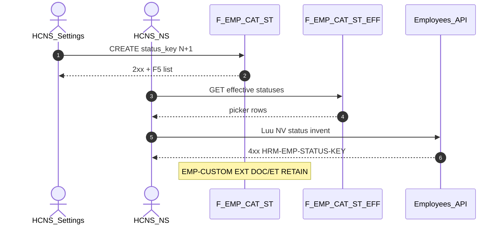

# PO-HRM-DYNAMIC-CONFIG-PLATFORM-EMP-STATUS-CATALOG-SA-01 — Option/F.1 · EMP employment status / reason open catalog

| Field | Value |
|-------|--------|
| **work_item_id** | `PO-HRM-DYNAMIC-CONFIG-PLATFORM-EMP-STATUS-CATALOG-SA-01` |
| **Parent** | `PO-HRM-DYNAMIC-CONFIG-PLATFORM-EMP-CUSTOM-FIELD-QC-01` **GWC** · U88 continuous · prior BA-01 row **Employment status / reason codes** (GĐ1 if hardcode list remains) |
| **Program** | `PO-HRM-CONTINUOUS-W8-20260807` |
| **lane** | governance · sa |
| **change_mode** | **ADD** Option/F.1 narrow **AC-PLT-EMP-STATUS-01*** · **DEFINE** Nest SoT (AS-IS Settings key + FE/BE/mobile hardcode · **no** Nest status table) · **NO CODE** `apps/**` · **no seed** · **no wipe** EMP-CUSTOM CNS L1 · MergeToken EXT · DOC/ET · ATT/SI/CTR/enrollment |
| **Date** | 2026-08-08 |
| **Status** | **CONFIRMED** — Option **B** **LOCKED** (Nest `emp_employment_status` + companion `emp_status_reason` = open catalog SoT) · ba-data **UNLOCK** · ba-process **UNLOCK** · BE **HOLD** until BA (+ DATA) |
| **prior_qc** | [`emp-custom-field-qc-01`](../../qa/evidence/po-hrm-dynamic-config-platform-emp-custom-field-qc-01.md) **GWC** CNS L1 · stamp **`EMPCFQA-MSK14LUH`** · EXT **`EMPTOKEXTQA-MSJ57PE1` SEAL RETAIN** · honesty personnel/e2e/printable=false · **`C-SLICE-≠-MODULE`** |
| **prior_ba** | [`PO-HRM-DYNAMIC-CONFIG-PLATFORM-BA-01.md`](./PO-HRM-DYNAMIC-CONFIG-PLATFORM-BA-01.md) §2.1 EMP row **Employment status / reason codes** · **BR-PLT-02/04/05/06** · §2.6 closed product enums clarification |
| **ref_peer_emp_custom** | EMP-CUSTOM Option **A** Settings extension SoT — **pattern cite only** (producer already LIVE) · **≠** this status seat · **RETAIN** CNS L1 |
| **ref_peer_emp_doc_et** | EMP DOC/ET Nest Option **B** · [`EMP-VERTICAL-SA-01`](./PO-HRM-DYNAMIC-CONFIG-PLATFORM-EMP-VERTICAL-SA-01.md) — **RETAIN** · **orthogonal** (`employment_type` ≠ `employment_status`) |
| **ref_peer_att_si** | ATT leave / work-sites · SI type/insurer Nest Option **B** admin open ≠ consumer invent |
| **ref_adr** | [`ADR-HRM-DYNAMIC-CONFIG-PLATFORM`](../../architecture/ADR-HRM-DYNAMIC-CONFIG-PLATFORM.md) Option B · L1 Catalog · L6 soft-delete · `ICatalogRow` · Q-PLT-03 mega-EAV DENY |
| **Honesty** | `hrm_personnel_uat_ready=false` · `employees_e2e_linkage_ready=false` · `contracts_printable_ready=false` · **DENIED** invent module EMP UAT · **DENIED** reopen EMP-CUSTOM / EXT / ATT / SI / CTR · **`C-SLICE-≠-MODULE`** · U65 |
| **must_keep** | `employees.status` text column · DOC/ET Nest seals · EMP-CUSTOM Option A CNS L1 · MergeToken EXT · soft-delete · scope_parity U19 · display-ready `status_label` path · C&B / position XBOS OUT |
| **ack_status** | **PASS_TO_PM** · **CONFIRMED** |

---

## 1. Decision context (ADR option pack)

| | |
|--|--|
| **Decision title** | AC-PLT-EMP-STATUS-01 — EMP employment **status** (+ **reason**) open catalog · admin CREATE N+1 · consumer invent KEY when EFF ≠ empty |
| **Requestor** | pm · U88 after EMP-CUSTOM-FIELD-QC-01 GWC |
| **Decision owner** | sa |
| **Related** | BA-01 §2.1 · BR-PLT-02/04/05/06 · peer EMP DOC/ET · ATT/SI Option B · EMP-CUSTOM Option A (cite ≠ copy) |

### 1.1 Problem — AS-IS vs target

| Current state (AS-IS evidence) | Gap / target |
|--------------------------------|--------------|
| FE `EmployeeFormDialog` binds Settings keys **`employee_statuses` / `employment_statuses`**; if `effectiveItems` empty → **hardcode fallback** `active \| probation \| inactive` | Named open catalog SoT + **admin CREATE N+1** · **FORBIDDEN** FE hardcode ceiling when EFF>0 |
| BE `employee-display.ts` **hardcode** VI map: `active\|inactive\|probation\|resigned\|terminated` | Display-ready label from **catalog** when EFF>0 (OS 28) — map = empty-EFF bootstrap only |
| Mobile `profileTabs` **hardcode** map: `active\|inactive\|terminated\|on_leave\|probation` (exotic → `—`) | Same consumer bind class — **not** closed product label enum |
| Nest bootstrap `employees` **`chk_employees_status CHECK (status IN ('active','inactive'))`** | Closed product CHECK **conflicts** FE/mobile richer keys — **FORBIDDEN** as catalog ceiling (**BR-PLT-05** / CORR-01 class) |
| Import catalog hint `select:active\|probation\|inactive` | Treat as bootstrap example — **not** SoT |
| **No** Nest table `emp_employment_status` / `emp_status_reason` (grep empty vs DOC/ET LIVE) | Peer EMP DOC/ET / SI / ATT = Nest `ICatalogRow` SoT — status still paper |
| Status **reason** codes | BA couples with status; AS-IS mostly free-text / absent dedicated picker — need companion open catalog when status requires reason |
| EMP-CUSTOM CNS L1 GWC · MergeToken EXT · DOC/ET | **FORBIDDEN** reopen / fold status into custom-field or employment_type |

**Failure if unresolved:** FE/mobile keep divergent hardcode lists; DB CHECK rejects open keys; Settings MD alone painted green while peers Nest; PM flips personnel UAT; EMP-CUSTOM/EXT reopened; mega-EAV invent.

### 1.2 Constraints

- Docs-only this seat · **no** `apps/**` · **no** seed (U65)
- **DENY** `hrm_personnel_uat_ready=true` · `employees_e2e_linkage_ready=true` · printable · Phase1 · module EMP UAT
- **SEAL RETAIN:** EMP-CUSTOM CNS L1 · MergeToken EMP EXT · EMP DOC/ET · ATT worksite/leave · SI type/insurer · CTR · enrollment · PAY/DEC/REC
- Cite EMP DOC/ET / ATT / SI Nest paths — **cấm** invent mega `hrm_emp_catalog_rows` EAV
- **Clarify BA §2.6:** closed **transition graph** (illegal reverse) may remain code; **allowed status / reason code list** = **open catalog** — not «every runtime enum stays closed»

### 1.3 BA «Catalog Settings» vs peer Nest (refinement)

BA-01 TO-BE cell said «Catalog Settings». SA **refines** (same class as leave / SI after BA said Settings): **Nest domain table = writer SoT**; Settings partition `employee_statuses` / `employment_statuses` = **group REF merge-read only** (**BR-PLT-06** · peer EMP `employment_types` dual-SoT). This is **not** EMP-CUSTOM Option A — that seat had **LIVE sealed** Settings **extension-items** producer; status does **not**.

---

## 2. Options

### Option A — Settings Master Data `employee_statuses` = sole SoT (+ drop FE hardcode)

| | |
|--|--|
| **Description** | Treat settings-catalogs partition as sole picker/assert SoT; deepen admin MD CRUD; BE `assertCodeInEffectiveCatalog`; never Nest-physicalize status. |
| **Benefits** | Matches FE key lookup today; zero new DDL; closest literal BA «Catalog Settings» cell. |
| **Costs** | Permanent orphan vs EMP DOC/ET · ATT · SI · PAY Nest SoT; typed flags (terminal / requires_reason / workforce) weak on MD rows; closed CHECK still needs ba-data touch anyway. |
| **Risks** | Peer seats **REJECTED** MD-alone as primary SoT (PAY O4 / ATT leave / SI) — **REJECT** as primary for GĐ1 status. |

### Option B — Nest `emp_employment_status` (+ companion `emp_status_reason`) = authoritative open catalog · Settings REF merge-read — **RECOMMEND / LOCK**

| | |
|--|--|
| **Description** | Peer **EMP DOC/ET · DEC · PAY · ATT · SI**: single open **status** catalog = Nest **`public.emp_employment_status`** via **F-EMP-CAT-ST-*** list/CRUD/effective (tenant writer = SoT; Settings `employee_statuses`/`employment_statuses` = **group REF merge-read** — tenant wins collision). Companion **`public.emp_status_reason`** open catalog (**F-EMP-CAT-STR-***) for reason codes when status `requires_reason=true` (or reason catalog EFF>0 on terminal transitions). Admin **CREATE open N+1** slug (**BR-PLT-05**). When **effective active status count > 0**, employee create/update **`status`** **must** ∈ EFF (**BR-PLT-02**); invent → **`HRM-EMP-STATUS-KEY`**. When reason required / reason EFF>0 on that transition, invent → **`HRM-EMP-STATUS-REASON-KEY`**. Empty EFF → soft skip invent + CTA Settings · **no seed** · FE **FORBIDDEN** hardcode fallback when Nest EFF>0 (bootstrap fallback only if EFF=0). **Drop/replace** closed `chk_employees_status` ceiling (ba-data). Typed flags on status row (not free JSON SoT): e.g. `is_workforce_active`, `is_terminal`, `requires_reason`, `counts_toward_headcount`, `sort_order`. Display `status_label` resolve from catalog label when known. |
| **Benefits** | Aligns Platform Option B · EMP vertical Nest · closes hardcode/CHECK/MD ambiguity; admin≠consumer split; reason pack in same F.1 without folding into ET/custom-field. |
| **Costs** | ba-data physical ADD (2 tables or 1+companion) · ba-process AC matrix · BE/FE after BA+DATA · mobile label rebind residual. |
| **Risks** | Misread as reopen EMP-CUSTOM/EXT or flip personnel → **L-EMP-ST-09/10**. Misread as replace full status-machine code → **L-EMP-ST-07** (graph may stay; codes open). |

### Option C — Hybrid dual writers / mega-EAV / fold into employment_type or custom-field / invent UAT

| | |
|--|--|
| **Description** | Settings MD **and** Nest both write; or mega EMP EAV; or fold status into `emp_employment_type` / extension-items; or flip `hrm_personnel_uat_ready` / reopen EMP-CUSTOM·EXT. |
| **Benefits** | None for GĐ1 honesty. |
| **Costs** | Dual SoT · seal churn · spine confusion (type ≠ status). |
| **Risks** | **REJECT** — DENY mega-EAV · DENY dual writers · DENY fold · DENY reopen · DENY personnel flip. |

---

## 3. Trade-off matrix

| Criteria | Weight | A Settings MD sole | **B Nest ST (+ reason)** | C Hybrid / fold / UAT invent |
|----------|-------:|-------------------:|-------------------------:|-----------------------------:|
| Business value (BR-PLT-02/05 · BA GĐ1) | 5 | 2 | **5** | 0 |
| Honesty / seal safety (EMP-CUSTOM·EXT retain) | 5 | 3 | **5** | 0 |
| Single status SoT vs peers Nest | 5 | 1 | **5** | 1 |
| Time to deliver | 4 | 5 | **2** | 4 |
| Complexity | 4 | 4 | **3** | 0 |
| Maintainability (admin open ≠ consumer invent) | 4 | 2 | **5** | 1 |
| **Weighted** | | 66 | **110** | 18 |

---

## 4. Decision

| | |
|--|--|
| **Selected** | **Option B** — architecture **LOCKED** |
| **Seat verdict** | **CONFIRMED** |
| **Why B** | Hardcode list **remains** (FE fallback + BE/mobile maps + closed CHECK) — BA GĐ1 trigger met. Unlike EMP-CUSTOM Option A (Settings extension **already** sealed producer), status has **no** Nest SoT and Settings bind is **orphan/empty → hardcode**. Peer EMP DOC/ET / ATT / SI chose Nest `ICatalogRow`. Typed flags + companion reason fit Nest, not MD-alone. |
| **Rejected** | **A** Settings MD sole SoT · **C** hybrid / mega-EAV / fold / UAT invent / reopen seals |
| **Assumptions** | DOC/ET Nest remain orthogonal; EMP-CUSTOM CNS L1 + EXT remain sealed; starter status keys bootstrap-only; transition legality code may remain for illegal reverse. |

### 4.1 Physical / DATA / BA / BE gates

| Question | Answer |
|----------|--------|
| New ba-data physicalize? | **UNLOCK** — ADD `public.emp_employment_status` + companion `public.emp_status_reason` (peer EMP DOC/ET / SI DEFINE class) |
| Unlock ba-process? | **YES** — `PO-HRM-DYNAMIC-CONFIG-PLATFORM-EMP-STATUS-CATALOG-BA-01` AC pack |
| Unlock BE? | **HOLD** until BA **and** DATA CONFIRMED |
| Unlock FE/Mobile? | After BA — bind Nest EFF picker; **FORBIDDEN** hardcode sole SoT when EFF>0 |
| Reopen EMP-CUSTOM / EXT / ATT / SI / CTR? | **FORBIDDEN** |
| Drop closed CHECK? | **YES** via ba-data EXPAND note (slug format CHK OK; enum ceiling **FORBIDDEN**) |

### 4.2 Why not EMP-CUSTOM-style «Option A»

| EMP custom field (Option A) | EMP status (this seat → B) |
|-----------------------------|----------------------------|
| Definition SoT **LIVE** = Settings extension-items + sealed F-EMP-TOK-03 | Status SoT **absent** Nest; Settings key lookup + **hardcode fallback** |
| Invent Nest field-def = dual SoT / reopen EXT | Invent Nest status = **align** peers; Settings = REF only |
| Admin CREATE already on extension path | Admin CREATE needs Nest F-EMP-CAT-ST-02 (+ Settings REF) |

---

## 5. Locks (EMP-ST)

| Lock | Rule |
|------|------|
| **L-EMP-ST-01 Status SoT** | Nest **`emp_employment_status`** = authoritative status **code** SoT — **FORBIDDEN** Settings MD alone · **FORBIDDEN** FE/mobile hardcode sole SoT when EFF>0 |
| **L-EMP-ST-02 Reason SoT** | Nest **`emp_status_reason`** = reason code SoT when required / EFF>0 — **FORBIDDEN** free-text SoT in that class |
| **L-EMP-ST-03 Dual SoT REF** | Settings `employee_statuses` / `employment_statuses` = **group REF merge-read** only — tenant Nest wins collision (**BR-PLT-06**) |
| **L-EMP-ST-04 Admin open** | CREATE N+1 open slug (**BR-PLT-05**) — **FORBIDDEN** closed enum / reject N+1 / restore `CHECK IN (active, inactive)` ceiling |
| **L-EMP-ST-05 Consumer invent** | EFF status >0 → employee `status` must ∈ EFF — invent → **`HRM-EMP-STATUS-KEY`**; reason invent → **`HRM-EMP-STATUS-REASON-KEY`** |
| **L-EMP-ST-06 Empty EFF** | Soft empty + CTA · invent assert **skip** · **no seed** · bootstrap label map OK only when EFF=0 |
| **L-EMP-ST-07 Transition graph** | Illegal reverse / lifecycle guards may remain **code** — **FORBIDDEN** claim this seat rewrites full SM product · **FORBIDDEN** confuse with open **code list** |
| **L-EMP-ST-08 Orthogonal catalogs** | **≠** `emp_employment_type` · **≠** EMP-CUSTOM extension-items · **≠** DOC/ET · **≠** contract status · **≠** leave types |
| **L-EMP-ST-09 Seals retain** | **FORBIDDEN** reopen EMP-CUSTOM CNS L1 · MergeToken EXT · DOC/ET · ATT · SI · CTR · enrollment |
| **L-EMP-ST-10 Honesty** | **DENIED** personnel / e2e / printable ready · module EMP UAT · Phase1 · **`C-SLICE-≠-MODULE`** |
| **L-EMP-ST-11 Soft-delete** | Retire = soft · history employees may keep retired keys (**BR-PLT-04**) · **FORBIDDEN** hard-delete |
| **L-EMP-ST-12 Scope** | list ↔ get-by-id ↔ mutate = `resolveHrmListScope` (**U19**) |
| **L-EMP-ST-13 Display-ready** | List/get expose `status_label` from catalog (or safe fallback) — FE **cấm** join invent for label when BE provides |
| **L-EMP-ST-14 Mega-EAV** | **FORBIDDEN** one EMP mega catalog table for status+DOC+ET+custom (ADR Q-PLT-03) |

---

## 6. API_DESIGN F.1 (DEFINE — unlock ba-data / ba-process)

### 6.1 Admin / status catalog

| ID | METHOD / path (proposed) | Mục đích | Nghiệp vụ | Tham chiếu |
|----|--------------------------|----------|-----------|-----------|
| **F-EMP-CAT-ST-01** | `GET …/employees/employment-statuses` | List status catalog | Scope parity · display-ready · soft-delete filter | BR-PLT-04/05 |
| **F-EMP-CAT-ST-02** | `POST …/employees/employment-statuses` | Admin CREATE N+1 | Open slug · UQ active · typed flags | **BR-PLT-05** · AC-PLT-EMP-STATUS-01 |
| **F-EMP-CAT-ST-03** | `PUT/PATCH …/employees/employment-statuses/:id` | Update metadata/flags | No wipe consumer history keys | BR-PLT-04 |
| **F-EMP-CAT-ST-04** | soft-retire / DELETE soft | Retire status | Hide from picker · history OK | BR-PLT-04 |
| **F-EMP-CAT-ST-EFF-01** | `GET …/employees/employment-statuses/effective` | Effective union Nest + Settings REF | Tenant wins · active only default | **BR-PLT-06** · peer ET/ATT |

### 6.2 Admin / reason catalog (companion)

| ID | METHOD / path (proposed) | Mục đích | Nghiệp vụ |
|----|--------------------------|----------|-----------|
| **F-EMP-CAT-STR-01** | `GET …/employees/status-reasons` | List reason codes | Optional `applies_to_status_keys` filter |
| **F-EMP-CAT-STR-02** | `POST …/employees/status-reasons` | Admin CREATE N+1 reason | Open slug |
| **F-EMP-CAT-STR-EFF-01** | `GET …/employees/status-reasons/effective` | Effective reasons | Consumer picker when required |

### 6.3 Consumer invent KEY (after BA+DATA)

| ID | Surface | Mục đích | Error |
|----|---------|----------|-------|
| **F-EMP-ST-CNS-01** | Employee create/update `status` | Enforce ∈ EFF when count>0 | **`HRM-EMP-STATUS-KEY`** |
| **F-EMP-ST-CNS-02** | Status change reason field (when required / reason EFF>0) | Enforce ∈ EFF reasons | **`HRM-EMP-STATUS-REASON-KEY`** |
| **F-EMP-ST-CNS-03** | Display map | Prefer catalog label; hardcode map only EFF=0 bootstrap | — |

**Empty EFF:** skip invent assert · UI CTA · **no seed**.



### 6.4 Physical pointer (ba-data — unlock)

| Table | Role | Notes |
|-------|------|-------|
| `emp_employment_status` | Status `ICatalogRow` | `status_key`, `name_vi`, flags, soft-delete, UQ `(company_id, lower(status_key))` active |
| `emp_status_reason` | Reason `ICatalogRow` | `reason_key`, `name_vi`, optional applies_to, soft-delete |
| `employees.status` | Consumer text | Keep column; validate ∈ EFF; **EXPAND** drop closed CHECK IN |

**Starter keys (bootstrap only — not UF evidence):** e.g. `active`, `probation`, `inactive`, `on_leave`, `resigned`, `terminated` — **FORBIDDEN** as CHECK ceiling.

---

## 7. Acceptance pointers (ba-process unlock — draft IDs)

| ID | PASS when (draft — BA owns final wording) |
|----|-------------------------------------------|
| **AC-PLT-EMP-STATUS-01** | Admin CREATE status N+1 → 2xx → F5 Nest list / Settings tab bind |
| **AC-PLT-EMP-STATUS-01b** | EFF>0 · consumer invent unknown `status` → **`HRM-EMP-STATUS-KEY`** |
| **AC-PLT-EMP-STATUS-01c** | EFF=0 · invent skip · CTA · **no seed** · no FE hardcode-as-SoT claim |
| **AC-PLT-EMP-STATUS-01d** | Soft-retire status → hidden picker · history employee row OK |
| **AC-PLT-EMP-STATUS-01e** | Reason: when required / EFF>0 · invent → **`HRM-EMP-STATUS-REASON-KEY`**; admin CREATE reason N+1 |
| **AC-PLT-EMP-STATUS-01H** | Honesty false · EMP-CUSTOM/EXT/DOC-ET/ATT/SI/CTR retain · **C-SLICE-≠-MODULE** · no personnel flip |

**VAL pointers:** VAL-EMP-ST-CNS-* · VAL-EMP-STR-CNS-* · closed CHECK absent after DATA.

---

## 8. Explicit OUT / DENY

| OUT | Rule |
|-----|------|
| Flip `hrm_personnel_uat_ready` / `employees_e2e_linkage_ready` / printable | **DENIED** |
| Reopen EMP-CUSTOM CNS L1 / MergeToken EXT | **DENIED** |
| Reopen EMP DOC/ET · ATT · SI · CTR · enrollment | **DENIED** |
| Nest mega-EAV / dual status writers | **DENIED** |
| Fold status into `emp_employment_type` / custom-field / DOC | **DENIED** |
| Seed status/reason rows for UF | **DENIED** (U65) |
| Module EMP UAT / Phase1 DONE | **DENIED** · **`C-SLICE-≠-MODULE`** |
| Claim Settings MD alone = peer Option B equivalent | **DENIED** |
| Full rewrite of status-machine transition product as this seat alone | **DENIED** (codes open; graph residual OK) |

---

## 9. Rollout / unlock

```text
EMP-STATUS-CATALOG-SA-01 (this) CONFIRMED · Option B LOCKED
  → ba-process: PO-HRM-DYNAMIC-CONFIG-PLATFORM-EMP-STATUS-CATALOG-BA-01 AC pack
  → ba-data: PO-HRM-DYNAMIC-CONFIG-PLATFORM-EMP-STATUS-CATALOG-DATA-01 physical ADD
  → (after BA+DATA) BE: F-EMP-CAT-ST/STR + CNS KEY · drop CHECK ceiling
  → FE/Mobile: Nest EFF picker · deprecate hardcode sole SoT
  → QA U65 AC-PLT-EMP-STATUS-01* · retain EMP-CUSTOM/EXT
  → QC narrow — DENY personnel / module EMP UAT / reopen seals
```

| Wave | Owner | Exit |
|------|-------|------|
| **This** | sa | Option B LOCKED · F.1 · ba-process **UNLOCK** · ba-data **UNLOCK** · BE HOLD |
| **AC pack** | ba-process | AC-PLT-EMP-STATUS-01* CONFIRMED |
| **DATA** | ba-data | Physical CONFIRMED · CHECK EXPAND |
| **BE/FE** | dev-be / dev-fe | Only after BA+DATA |
| **QA/QC** | qa → qc | Narrow seal · honesty false |

**Rollback:** Feature-flag CNS off; retain text `employees.status`; do not reintroduce closed CHECK as product ceiling.

---

## 10. Completion

| Field | Value |
|-------|--------|
| **completion_report** | Option **B CONFIRMED LOCKED** — EMP employment **status/reason** open catalog SoT = Nest `emp_employment_status` + companion `emp_status_reason`; Settings partitions = REF merge-read; admin CREATE N+1 ≠ consumer invent **`HRM-EMP-STATUS-KEY` / `HRM-EMP-STATUS-REASON-KEY`**; FE/BE/mobile hardcode + closed CHECK = residual to drop after DATA; Option A Settings-sole **REJECT**; EMP-CUSTOM CNS L1 · MergeToken EXT · DOC/ET · ATT/SI/CTR **RETAIN**; ba-data **UNLOCK**; ba-process **UNLOCK**; BE HOLD; honesty personnel false · **C-SLICE-≠-MODULE**. |
| **next_owner** | `ba-process` |
| **ack_status** | **PASS_TO_PM** |
| **evidence_path** | `docs/qa/evidence/po-hrm-dynamic-config-platform-emp-status-catalog-sa-01.md` |
