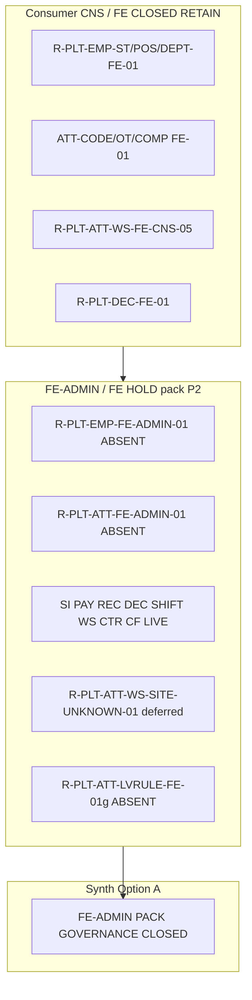

# PO-HRM-DYNAMIC-CONFIG-PLATFORM-FE-ADMIN-PACK-SYNTH-SA-01 — Option/F.1 · FE-ADMIN / FE residual HOLD pack rollup (W8 continuous)

| Field | Value |
|-------|--------|
| **work_item_id** | `PO-HRM-DYNAMIC-CONFIG-PLATFORM-FE-ADMIN-PACK-SYNTH-SA-01` |
| **Parent** | U88 continuous `PO-HRM-CONTINUOUS-W8-20260807` · after **`PO-HRM-DYNAMIC-CONFIG-PLATFORM-ATT-WS-SITE-UNKNOWN-SA-01`** sealed (**Option A** · `R-PLT-ATT-WS-SITE-UNKNOWN-01` · SPEC **23972**) |
| **Program** | `PO-HRM-CONTINUOUS-W8-20260807` |
| **lane** | governance · sa · **docs-only synth** · **NO** `apps/**` · **NO** re-open per-seat Option/F.1 |
| **change_mode** | **ADD** pack-level Option/F.1 inventory + disposition — consolidates sealed FE-ADMIN NOTES / FE-SA HOLD seats |
| **Date** | 2026-08-08 |
| **Status** | **CONFIRMED** · Option **A** **LOCKED** · **ACCEPT pack as governance CLOSED (P2 HOLD inventory)** · no execution unlock |
| **Honesty** | `hrm_personnel_uat_ready=false` · `hrm_attendance_uat_ready=false` · `attendance_e2e_linkage_ready=false` · `payroll_e2e_ready=false` · `recruitment_uat_ready=false` · `contracts_printable_ready=false` · **`C-SLICE-≠-MODULE`** · U65 · **DENIED** module UAT / Phase1 DONE from slice HOLDs |
| **ack_status** | **PASS_TO_PM** · **CONFIRMED** |

---

## 1. Decision context (ADR option pack §1)

| | |
|--|--|
| **Decision title** | W8 **synth rollup**: single pack inventory for all sealed **FE-ADMIN NOTES** and related **FE residual HOLD** seats — ACCEPT governance CLOSED vs unlock any residual vs invent Nest dual / reopen CNS / flip module ready |
| **Requestor** | pm · U88 after SITE-UNKNOWN SEAL |
| **Decision owner** | sa |
| **Related** | Dynamic Config Platform vertical · peer specs under `docs/program/specs/*FE-ADMIN*` and `*FE-SA*` · continuous board tail rows 200–212 · `TEAM_WORKING_NOW.md` |
| **Template** | `.cursor/templates/ADR_OPTION_TEMPLATE.md` §§1–7 + **§11 F.1 pack inventory** |
| **Non-goals** | Re-litigate each seat; patch product code; claim UAT from HOLD inventory; reopen sealed consumer CNS |

### 1.1 Mission scope (what this seat owns)

This seat **does not** replace child SA specs. It **indexes** them with **SPEC_LEN**, **residual_id**, **selected Option**, and **class** (LIVE vs ABSENT vs deferred consumer bind), then stamps **pack-level Option A** so PM can seal W8 FE-ADMIN wave without dispatching spurious `dev-fe`/`dev-be` Tasks.

**Included in inventory (mandatory):**

| Domain | residual_id | Child evidence spec |
|--------|-------------|---------------------|
| EMP FE-ADMIN pack | `R-PLT-EMP-FE-ADMIN-01` | `PO-HRM-DYNAMIC-CONFIG-PLATFORM-EMP-FE-ADMIN-NOTES-SA-01.md` |
| ATT CODE/OT/COMP FE-ADMIN pack | `R-PLT-ATT-FE-ADMIN-01` | `PO-HRM-DYNAMIC-CONFIG-PLATFORM-ATT-FE-ADMIN-NOTES-SA-01.md` |
| SI INS+INSURER FE-ADMIN pack | `R-PLT-SI-FE-ADMIN-01` | `PO-HRM-DYNAMIC-CONFIG-PLATFORM-SI-FE-ADMIN-NOTES-SA-01.md` |
| EMP custom field FE residual | `R-PLT-EMP-CF-FE-01` | `PO-HRM-DYNAMIC-CONFIG-PLATFORM-EMP-CUSTOM-FIELD-FE-SA-01.md` |
| PAY salary_components FE-ADMIN | `R-PLT-PAY-FE-ADMIN-01` | `PO-HRM-DYNAMIC-CONFIG-PLATFORM-PAY-FE-ADMIN-NOTES-SA-01.md` |
| REC pipeline-stages FE-ADMIN | `R-PLT-REC-FE-ADMIN-01` | `PO-HRM-DYNAMIC-CONFIG-PLATFORM-REC-FE-ADMIN-NOTES-SA-01.md` |
| DEC decision types FE-ADMIN | `R-PLT-DEC-FE-ADMIN-01` | `PO-HRM-DYNAMIC-CONFIG-PLATFORM-DEC-FE-ADMIN-NOTES-SA-01.md` |
| ATT work_shifts FE-ADMIN | `R-PLT-ATT-SHIFT-FE-ADMIN-01` | `PO-HRM-DYNAMIC-CONFIG-PLATFORM-ATT-SHIFT-FE-ADMIN-NOTES-SA-01.md` |
| ATT work-sites / GPS FE-ADMIN | `R-PLT-ATT-WS-FE-ADMIN-01` | `PO-HRM-DYNAMIC-CONFIG-PLATFORM-ATT-WORKSITE-FE-ADMIN-NOTES-SA-01.md` |
| SITE-UNKNOWN consumer bind | `R-PLT-ATT-WS-SITE-UNKNOWN-01` | `PO-HRM-DYNAMIC-CONFIG-PLATFORM-ATT-WS-SITE-UNKNOWN-SA-01.md` |
| CTR clause FE residual | `R-PLT-CTR-CL-FE-01` | `PO-HRM-DYNAMIC-CONFIG-PLATFORM-CTR-CLAUSE-FE-SA-01.md` |
| CTR template FE residual | `R-PLT-CTR-TPL-FE-01` | `PO-HRM-DYNAMIC-CONFIG-PLATFORM-CTR-TEMPLATE-FE-SA-01.md` |
| Leave accrual / panel FE 01g | `R-PLT-ATT-LVRULE-FE-01g` | `PO-HRM-DYNAMIC-CONFIG-PLATFORM-ATT-LVRULE-FE-01G-SA-01.md` |

**Explicitly OUT of FE-ADMIN pack (consumer UNLOCK CLOSED — RETAIN, not reopen):**

| residual_id | Status | Note |
|-------------|--------|------|
| `R-PLT-EMP-ST-FE-01` | CLOSED | QC-FE GWC · subset of EMP FE-ADMIN ABSENT class |
| `R-PLT-EMP-POS-FE-01` | CLOSED | Settings job_titles EFF consumer |
| `R-PLT-EMP-DEPT-FE-01` | CLOSED | Settings departments EFF consumer |
| `R-PLT-ATT-CODE-FE-01` | CLOSED | Consumer EFF rebind |
| `R-PLT-ATT-WS-FE-CNS-05` | CLOSED | GPS `check_in_method=gps` wire |
| `R-PLT-DEC-FE-01` | CLOSED | DEC consumer picker |
| `R-PLT-SI-INR-03` / `R-PLT-SI-INS-03` | CLOSED | SI consumer wires |

### 1.2 Pack taxonomy (architecture invariant)

Two **FE-ADMIN note classes** repeat across verticals — synth must not collapse them:

| Class | Meaning | Examples in W8 pack |
|-------|---------|---------------------|
| **LIVE twin** | Nest SoT + **Settings/ATT CFG admin panel mounted** + upsert/retire or CRUD clients **LIVE**; CNS/consumer often **CLOSED**; residual = **P2 NOTE** (polish / REF / starter-six), **not** mount gap | SI, PAY, REC, DEC, ATT-SHIFT, ATT-WORKSITE, CTR-CLAUSE, CTR-TEMPLATE, EMP-CF (consumer+admin LIVE) |
| **ABSENT twin** | Nest SoT + **Network L1** admin proven + **no** FE admin CRUD panel; consumer **CLOSED**; residual = deepen optional Nest admin UI | ATT CODE/OT/COMP (`R-PLT-ATT-FE-ADMIN-01`), EMP ST/STR + Nest position/dept DENY (`R-PLT-EMP-FE-ADMIN-01`) |
| **Deferred bind** | Reserved error / field **not posted** on consumer UF today | SITE-UNKNOWN (`work_site_id` · `HRM-ATT-SITE-UNKNOWN`) |
| **LVRULE 01g** | CNS-WIRE **CLOSED**; panel MVP-five vs open catalog **partial**; admin FE **ABSENT** (Network L1) | `R-PLT-ATT-LVRULE-FE-01g` — peer ABSENT class, **not** FE-ADMIN LIVE twin |

**Unlock gate (all child seats agree):** Option B execution (`dev-fe`/`dev-be`) **only** when **named closable gap** (mount/persist defect on **existing** UF surface) **or** sponsor explicit «mở FE wave … FE-ADMIN». Synth audit: **no such gap** at pack level that was not already consumer-UNLOCK class and **CLOSED**.

---

## 2. Problem to solve (ADR §2)

- **Current state:** W8 continuous wave sealed **≥14** governance Option/F.1 seats for FE-ADMIN / FE HOLD. Each seat minted a board **residual_id** with **ACCEPT_AS_IS_P2 HOLD** (or equivalent Option B HOLD on CTR/EMP-CF/LVRULE). Consumer CNS wires (DEC, REC, ATT-WS, SI, EMP dept/pos/status, ATT code/ot/comp) are **CLOSED** where cited in child specs.
- **Constraints:** U65 · honesty flags false · C-SLICE · DENY seed · DENY reopen CNS-05 / CNS-02 / DEC QC / REC CNS as FAIL · DENY invent Nest dual admin · DENY flip module UAT from HOLD inventory.
- **Failure impact if mis-synthesized:** PM re-dispatches `dev-fe` on HOLD NOTE class → seal churn · false attendance/personnel/recruitment ready · reopen sealed consumer FE · billing waste on duplicate SA seats.

---

## 3. Options (ADR §3)

### Option A — ACCEPT pack as governance **CLOSED** (P2 HOLD inventory only) — **RECOMMEND / LOCK**

| | |
|--|--|
| **Description** | Stamp W8 **FE-ADMIN pack** as **governance-complete** for Option/F.1 disposition: all rows in §4 inventory **RETAIN** child **selected_option** and **HOLD**; **no** pack-level unlock to execution; **no** new residual mint; PM may narrow board wording to «FE-ADMIN PACK SYNTH SEALED». Sponsor-gated reopen remains **per vertical** message (see §5.2). |
| **Benefits** | Single SoT for QC/PM; honors every child LOCK; zero apps churn; U88 bandwidth to next vertical (non FE-ADMIN invent) |
| **Costs** | Operators continue Network/API admin for ABSENT class; SITE-UNKNOWN and LVRULE panel deepen deferred |
| **Risks** | HOLD misread as «bug» → mitigated by class table §1.2 + honesty false |
| **Gate** | All child seats PASS_TO_PM CONFIRMED on board — **true** as of SITE-UNKNOWN seal |

### Option B — UNLOCK one vertical from pack synth

| | |
|--|--|
| **Description** | Use synth seat to override a child Option A/B HOLD and dispatch `dev-fe`/`dev-be` without sponsor message or new closable gap evidence. |
| **Benefits** | None at pack level — would only make sense with **new** named gap |
| **Costs** | Violates child LOCK · reopen CNS risk |
| **Risks** | Invent FAIL · U65 probe cheat · duplicate admin |
| **Gate** | **REJECT default** — synth found **no** named closable gap outside already-executed consumer UNLOCK seats |

### Option C — REJECT invent / reopen / flip

| | |
|--|--|
| **Description** | Invent Nest dual admin FE; reopen ATT CNS-05 / CNS-02; reopen DEC/REC/EMP consumer CLOSED; reopen FE-ADMIN HOLDs as mandatory unlock; invent LVRULE / SITE-UNKNOWN FAIL; flip attendance/personnel/payroll/recruitment/printable ready; claim Phase1 DONE; seed; `apps/**` from synth. |
| **Benefits** | None |
| **Costs** | High — trust / seal loss |
| **Risks** | QC NO-GO class |
| **Gate** | **DENY** |

---

## 4. Master inventory table (SPEC_LEN · residual · Option · class)

| # | Vertical | residual_id | selected_option | SPEC_LEN (bytes NFD) | FE-ADMIN class | Child spec (relative) |
|---|----------|-------------|-----------------|----------------------:|----------------|------------------------|
| 1 | EMP | `R-PLT-EMP-FE-ADMIN-01` | **A** ACCEPT_AS_IS_P2 HOLD | 28353 | **ABSENT** (ST/STR admin) + Nest pos/dept **DENY** | `./PO-HRM-DYNAMIC-CONFIG-PLATFORM-EMP-FE-ADMIN-NOTES-SA-01.md` |
| 2 | ATT | `R-PLT-ATT-FE-ADMIN-01` | **A** ACCEPT_AS_IS_P2 HOLD | 31734 | **ABSENT** (att_code · ot_type · ot_comp_type) | `./PO-HRM-DYNAMIC-CONFIG-PLATFORM-ATT-FE-ADMIN-NOTES-SA-01.md` |
| 3 | SI | `R-PLT-SI-FE-ADMIN-01` | **A** ACCEPT_AS_IS_P2 HOLD | 40113 | **LIVE** (Si* Settings panels) | `./PO-HRM-DYNAMIC-CONFIG-PLATFORM-SI-FE-ADMIN-NOTES-SA-01.md` |
| 4 | EMP-CF | `R-PLT-EMP-CF-FE-01` | **B** ACCEPT_AS_IS_P2 HOLD | 38846 | **LIVE** (dynamic fields consumer + Settings admin) | `./PO-HRM-DYNAMIC-CONFIG-PLATFORM-EMP-CUSTOM-FIELD-FE-SA-01.md` |
| 5 | PAY | `R-PLT-PAY-FE-ADMIN-01` | **A** ACCEPT_AS_IS_P2 HOLD | 49325 | **LIVE** (SalaryComponentsTab + REF) | `./PO-HRM-DYNAMIC-CONFIG-PLATFORM-PAY-FE-ADMIN-NOTES-SA-01.md` |
| 6 | REC | `R-PLT-REC-FE-ADMIN-01` | **A** ACCEPT_AS_IS_P2 HOLD | 55083 | **LIVE** (RecPipelineStageSettingsPanel) | `./PO-HRM-DYNAMIC-CONFIG-PLATFORM-REC-FE-ADMIN-NOTES-SA-01.md` |
| 7 | DEC | `R-PLT-DEC-FE-ADMIN-01` | **A** ACCEPT_AS_IS_P2 HOLD | 61534 | **LIVE** (DecDecisionTypeSettingsPanel) | `./PO-HRM-DYNAMIC-CONFIG-PLATFORM-DEC-FE-ADMIN-NOTES-SA-01.md` |
| 8 | ATT-SHIFT | `R-PLT-ATT-SHIFT-FE-ADMIN-01` | **A** ACCEPT_AS_IS_P2 HOLD | 53359 | **LIVE** (Ca tab useWorkShifts CRUD) | `./PO-HRM-DYNAMIC-CONFIG-PLATFORM-ATT-SHIFT-FE-ADMIN-NOTES-SA-01.md` |
| 9 | ATT-WS | `R-PLT-ATT-WS-FE-ADMIN-01` | **A** ACCEPT_AS_IS_P2 HOLD | 61773 | **LIVE** (GPS att-gps-sites-card CRUD) | `./PO-HRM-DYNAMIC-CONFIG-PLATFORM-ATT-WORKSITE-FE-ADMIN-NOTES-SA-01.md` |
| 10 | ATT-WS | `R-PLT-ATT-WS-SITE-UNKNOWN-01` | **A** ACCEPT_AS_IS_P2 HOLD | 23972 | **Deferred bind** (`work_site_id`) | `./PO-HRM-DYNAMIC-CONFIG-PLATFORM-ATT-WS-SITE-UNKNOWN-SA-01.md` |
| 11 | CTR | `R-PLT-CTR-CL-FE-01` | **B** ACCEPT_AS_IS_P2 HOLD | 25151 | **LIVE** (clause body_vi admin panel) | `./PO-HRM-DYNAMIC-CONFIG-PLATFORM-CTR-CLAUSE-FE-SA-01.md` |
| 12 | CTR | `R-PLT-CTR-TPL-FE-01` | **B** ACCEPT_AS_IS_P2 HOLD | 31210 | **LIVE** (template #9+ admin + consumer catalog) | `./PO-HRM-DYNAMIC-CONFIG-PLATFORM-CTR-TEMPLATE-FE-SA-01.md` |
| 13 | ATT-LVRULE | `R-PLT-ATT-LVRULE-FE-01g` | **B** ACCEPT_AS_IS_P2 HOLD | 16991 | **ABSENT** admin + panel deepen HOLD | `./PO-HRM-DYNAMIC-CONFIG-PLATFORM-ATT-LVRULE-FE-01G-SA-01.md` |

**Pack rollup SPEC_LEN (this file):** verified by WriteAllText Length gate (≥8192; target ≥12288).

**Option letter note:** Option **A** vs **B** on child seats is **labeling only** when both mean **ACCEPT_AS_IS_P2 HOLD** (CTR/EMP-CF/LVRULE use **B** per child heuristic); synth **does not** re-score options.

---

## 5. Trade-off matrix (ADR §4)

| Criteria | Weight | Option A (pack CLOSED) | Option B (pack unlock) | Option C (invent/reopen) |
|---|--:|--:|--:|--:|
| Seal integrity (CNS + consumer CLOSED) | 5 | 5 | 2 | 0 |
| PM/QC clarity (single inventory) | 4 | 5 | 3 | 1 |
| Delivery cost | 3 | 5 | 2 | 1 |
| Honesty / C-SLICE compliance | 5 | 5 | 3 | 0 |
| Sponsor trust (no surprise dev-fe) | 4 | 5 | 2 | 0 |
| Future sponsor FE-ADMIN wave readiness | 2 | 4 | 4 | 0 |

---

## 6. Failure modes and mitigation (ADR §5)

| Option | Failure mode | Detection | Mitigation |
|--------|--------------|-----------|------------|
| A | PM treats HOLD as CLOSED product UC | Board column «Condition KEEP» | This spec §4 table · honesty false |
| A | QC promotes module UAT from LIVE FE-ADMIN | `SERVICE_READINESS` audit | DENY flip flags in §1.1 |
| B | dev-fe on LIVE class without gap | Child audit «no closable mount/persist gap» | Reject dispatch; cite synth §3 Option B |
| C | Reopen CNS-05 after synth | Bus stamp `ATTWSQA2-MSJCG47P` | FORBIDDEN list §7 |
| C | Invent SITE-UNKNOWN QA FAIL | No FE post path | RETAIN HOLD · U65 |

---

## 7. Decision (ADR §6)

| | |
|--|--|
| **Selected option** | **Option A** — **ACCEPT FE-ADMIN pack as governance CLOSED (P2 HOLD inventory)** |
| **Why** | All mandatory child seats sealed with consistent **ACCEPT_AS_IS_P2 HOLD** (or equivalent); consumer UNLOCK work **already CLOSED** where applicable; **no** pack-level closable gap identified that is not sponsor-gated; Option B would **reopen** child LOCK without new evidence; Option C violates U88 DENY list. |
| **Assumptions** | Sponsor did not open «mở FE wave FE-ADMIN polish» in this message; CNS seals on board remain valid; LVRULE CNS-WIRE remains CLOSED. |
| **Rejected** | **Option B** — no named gap with clear `next_owner` dev-fe/be that avoids reopening sealed CNS/consumer FE. **Option C** — full DENY. |
| **Pack disposition** | **GOVERNANCE CLOSED** for W8 FE-ADMIN Option/F.1 wave · **product Conditions remain HOLD P2** per §4 |

### 7.1 FORBIDDEN after synth (DENY list)

- Invent Nest **dual** admin CRUD panels (second writer outside sealed LIVE paths)
- Reopen **CNS-05** (`R-PLT-ATT-WS-FE-CNS-05`) · **CNS-02** ATT-SHIFT · DEC QC-02 consumer · REC CNS GWC
- Reopen any **FE-ADMIN HOLD** row in §4 **as execution unlock** without sponsor vertical message
- Reopen **EMP-ST/POS/DEPT** · **ATT-CODE/OT/COMP** consumer FE **CLOSED** stamps
- Invent **LVRULE** 01g unlock · invent **SITE-UNKNOWN** mandatory FAIL / ensureDefaultWorkSite
- Flip **`hrm_attendance_uat_ready`** · **`hrm_personnel_uat_ready`** · **`payroll_e2e_ready`** · **`recruitment_uat_ready`** · **`contracts_printable_ready`**
- Claim **Phase1 DONE** · **module UAT** from slice HOLDs · seed (U65)
- **`apps/**`** edits from this seat

### 7.2 Sponsor-gated reopen map (not triggered by synth)

| Vertical | Trigger phrase (examples) | Allowed narrow execution |
|----------|---------------------------|---------------------------|
| EMP FE-ADMIN | «mở FE wave EMP FE-ADMIN / Trạng thái NV admin» | Nest ST/STR admin FE only; pos/dept Nest admin remains **DENY** |
| ATT FE-ADMIN | «quản trị danh mục chấm công · OT · loại chi trả» | Nest att_* admin CRUD FE only |
| ATT-WS SITE-UNKNOWN GĐ1.5 | UF binds `work_site_id` on punch/record | Paired BE DTO + FE/mobile + U65 |
| LVRULE 01g | «mở FE wave quỹ phép / panel AC-01g» | Panel + optional Settings admin — engine HOLD RETAIN |
| LIVE polish (SI/PAY/REC/DEC/SHIFT/WS/CTR) | Explicit polish wave per module | UX only — **no** SoT flip |

---

## 8. Implementation and validation plan (ADR §7)

| Step | Owner | Action |
|------|-------|--------|
| 1 | pm | Seal board row `…-FE-ADMIN-PACK-SYNTH-SA-01` **CONFIRMED**; attach this `evidence_path` |
| 2 | pm | **Do not** dispatch dev-fe/be from synth; RETAIN §4 HOLD ids on W8 continuous board |
| 3 | ba-process | Optional **reopen-gate inventory** (U88 next) — UF ids for sponsor-gated rows §7.2 only; **no** AC pack redefine Nest SoT |
| 4 | qc | Audit: honesty flags still false; no matrix row promoted from FE-ADMIN HOLD alone |
| 5 | sa | Append lesson to `.cursor/knowledge-base/sa.md` (reuse-tag: fe-admin-pack-synth-w8) |

**Rollback:** Re-open synth only if child spec proven INVALID-HANDOFF — then re-run **individual** seat, not pack unlock.

**Success criteria:** SPEC_LEN ≥8192 · §4 complete · Option A LOCK · PASS_TO_PM · no apps diff.

---

## 9. Architecture diagram (pack relationships)



---

## 10. Honesty and C-SLICE (program flags)

Closing **consumer** Conditions and sealing **FE-ADMIN HOLD** inventory **does not** promote:

| Flag | Value after synth |
|------|-------------------|
| `hrm_personnel_uat_ready` | false |
| `hrm_attendance_uat_ready` | false |
| `attendance_e2e_linkage_ready` | false |
| `payroll_e2e_ready` | false |
| `recruitment_uat_ready` | false |
| `contracts_printable_ready` | false |
| `C-SLICE-≠-MODULE` | **true** — slice GWC ≠ module UAT |

---

## 11. F.1 API / DB disposition notes (pack rollup — no physical unlock)

| Layer | Pack disposition |
|-------|------------------|
| **DB** | **No** synth-level schema change · Nest Option B SoT tables **RETAIN** per vertical child specs · DENY second admin SoT table invent |
| **API** | **No** new routes from synth · Network L1 admin endpoints **RETAIN** for ABSENT class · effective GET consumers **RETAIN** |
| **FE consumer** | **CLOSED** stamps **RETAIN** (§1.1 OUT table) — out of FE-ADMIN pack execution |
| **FE admin** | §4 inventory = **HOLD NOTE** or **deferred bind** — physical F.1 for admin UI deferred until sponsor §7.2 |
| **F.1 completeness** | **Governance complete** for W8 FE-ADMIN wave; **physical** F.1 depth remains **sponsor-gated** per vertical |

### 11.1 F.1 row per residual (abbreviated)

| residual_id | DB touch | API touch | FE admin F.1 |
|-------------|----------|-----------|--------------|
| `R-PLT-EMP-FE-ADMIN-01` | HOLD | Nest ST/STR L1 RETAIN | ABSENT admin FE deferred |
| `R-PLT-ATT-FE-ADMIN-01` | HOLD | att_* L1 RETAIN | ABSENT CRUD FE deferred |
| `R-PLT-SI-FE-ADMIN-01` | RETAIN | Si upsert/retire LIVE | LIVE — no synth unlock |
| `R-PLT-EMP-CF-FE-01` | RETAIN | custom_fields LIVE | LIVE — HOLD NOTE only |
| `R-PLT-PAY-FE-ADMIN-01` | RETAIN | salary_components LIVE | LIVE — Settings REF RETAIN |
| `R-PLT-REC-FE-ADMIN-01` | RETAIN | rec_pipeline_stage LIVE | LIVE — starter-six REF RETAIN |
| `R-PLT-DEC-FE-ADMIN-01` | RETAIN | hr_decision_type LIVE | LIVE |
| `R-PLT-ATT-SHIFT-FE-ADMIN-01` | RETAIN | work_shifts LIVE | LIVE — ADR D1 dual-write DENY |
| `R-PLT-ATT-WS-FE-ADMIN-01` | RETAIN | attendance_work_sites LIVE | LIVE — gps_locations JSON ≠ sole SoT |
| `R-PLT-ATT-WS-SITE-UNKNOWN-01` | HOLD | `HRM-ATT-SITE-UNKNOWN` reserved | No bind surface — GĐ1.5 |
| `R-PLT-CTR-CL-FE-01` | RETAIN | clause body SoT | LIVE panel HOLD |
| `R-PLT-CTR-TPL-FE-01` | RETAIN | template catalog LIVE | LIVE #9+ HOLD |
| `R-PLT-ATT-LVRULE-FE-01g` | RETAIN | policy L1 + KEY LIVE | Panel/admin deepen HOLD |

---

## 12. completion_report · handback

### completion_report

**Closed:** SA synth Option/F.1 for W8 **FE-ADMIN / FE residual HOLD pack** — master inventory §4 with **SPEC_LEN** + **selected_option** for all mandated residuals including SITE-UNKNOWN (23972) and LVRULE 01g; pack taxonomy §1.2; **Option A LOCKED** — governance CLOSED, **no** execution unlock; Option B rejected (no named closable gap); Option C DENY; honesty false · C-SLICE · docs-only · no `apps/**`.

**Open / RETAIN:** All §4 `residual_id` rows remain **P2 HOLD** on product board until sponsor §7.2; honesty flags false; module UAT not claimed.

### next_owner

**pm** — seal continuous board + U88 next governance (not dev-fe/dev-be from synth).

### next_dispatch_prompt (copy-ready — U88)

```text
work_item_id: PO-HRM-DYNAMIC-CONFIG-PLATFORM-FE-ADMIN-PACK-SYNTH-SA-01
from_role: sa
to_role: pm
lane: governance · U88
ack_status: PASS_TO_PM
verdict: Option A LOCKED — FE-ADMIN pack governance CLOSED (P2 HOLD inventory)
action:
  1) Seal board row PO-HRM-DYNAMIC-CONFIG-PLATFORM-FE-ADMIN-PACK-SYNTH-SA-01 = CONFIRMED
     · cite evidence docs/program/specs/PO-HRM-DYNAMIC-CONFIG-PLATFORM-FE-ADMIN-PACK-SYNTH-SA-01.md
  2) RETAIN all §4 residual_id HOLD rows — no dev-fe/dev-be dispatch from synth
  3) Update PO_HRM_CONTINUOUS_W8_20260807.md synth row PASS · TEAM_WORKING_NOW next vertical
  4) U88 next: Task ba-process reopen-gate inventory (sponsor-gated UF list §7.2 only)
     — entry: honesty false · no Nest SoT redefine · no reopen CNS/consumer FE
     — exit: ADD-only UF inventory doc path on bus · PASS_TO_PM
  5) DENY: invent Nest dual · reopen CNS-05/CNS-02 · flip module ready · claim UAT from HOLDs
alternate_if_no_ba_trigger: PM -> ALL idle-ok W8 FE-ADMIN governance slice with honesty false RETAIN
evidence: docs/program/specs/PO-HRM-DYNAMIC-CONFIG-PLATFORM-FE-ADMIN-PACK-SYNTH-SA-01.md
```

### evidence_path

`docs/program/specs/PO-HRM-DYNAMIC-CONFIG-PLATFORM-FE-ADMIN-PACK-SYNTH-SA-01.md`

### ack_status

**PASS_TO_PM** · **CONFIRMED**

### RETAIN stamps (must_keep)

- All child SPEC files §4 · consumer CLOSED stamps §1.1 · CNS-05 · CNS-02 · LVRULE CNS-WIRE · GEO-001/GEO-REQ LIVE · ADR D3 work-sites · honesty false · C-SLICE · U65

---

## 13. References

| Artifact | Role |
|----------|------|
| `docs/program/PO_HRM_CONTINUOUS_W8_20260807.md` | Board rows 200–212 |
| `docs/program/TEAM_WORKING_NOW.md` | Active synth dispatch |
| `docs/architecture/ADR-HRM-DYNAMIC-CONFIG-PLATFORM.md` | Platform boundary |
| `.cursor/templates/ADR_OPTION_TEMPLATE.md` | Option structure |
| Child specs `./PO-HRM-DYNAMIC-CONFIG-PLATFORM-*FE-ADMIN*` · `*FE-SA*` | Authoritative per-seat LOCK |

---

## 14. Expanded audit trail (PM / QC — why Option B was not selected)

### 14.1 LIVE class — no mount/persist gap

For SI, PAY, REC, DEC, ATT-SHIFT, ATT-WORKSITE, CTR clause/template, EMP-CF: child READ-ONLY audits documented **Settings or ATT CFG panel mounted**, **upsert/retire or CRUD clients wired**, and **CNS or L1** proof where applicable. Residuals document **REF/starter-six/polish** or **honesty**, not missing admin. Dispatching `dev-fe` from synth would **duplicate** sealed work and risk second admin writer (Option C class).

### 14.2 ABSENT class — Network L1 is admin path today

EMP FE-ADMIN and ATT CODE/OT/COMP packs: admin CREATE/PATCH proven via **Network** at L1; consumer EFF **CLOSED**. Peer **LVRULE 01g** uses same ACCEPT_AS_IS class. Unlock requires **sponsor FE-ADMIN wave**, not synth override.

### 14.3 SITE-UNKNOWN — deferred bind, not FE-ADMIN defect

`R-PLT-ATT-WS-SITE-UNKNOWN-01` (SPEC 23972) sealed **after** WORKSITE FE-ADMIN LIVE HOLD. GEO-001 ≠ SITE-ID. No FE post of `work_site_id`. Pack synth **does not** upgrade SITE-UNKNOWN to Option B.

### 14.4 Sealed CNS must not reopen for pack «completeness»

ATT-WORKSITE consumer GPS method (**CNS-05**), ATT-SHIFT consumer (**CNS-02**), DEC browser UF, REC stage CNS — all **CLOSED** in child evidence. Any pack-level «finish ATT module» narrative that reopens these is **Option C** and **DENIED**.

---

*End of SA Option/F.1 — FE-ADMIN PACK SYNTH — Option A LOCKED governance CLOSED · PASS_TO_PM*
