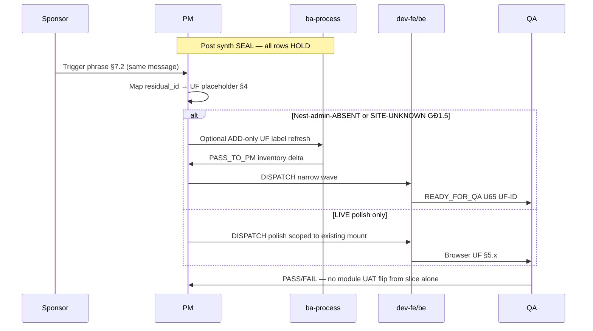

# PO-HRM-DYNAMIC-CONFIG-PLATFORM-FE-ADMIN-REOPEN-GATE-BA-01 — Reopen-gate UF inventory (sponsor-gated FE-ADMIN / FE residual HOLDs)

| Field | Value |
|-------|-------|
| **work_item_id** | `PO-HRM-DYNAMIC-CONFIG-PLATFORM-FE-ADMIN-REOPEN-GATE-BA-01` |
| **Parent / cite** | [`PO-HRM-DYNAMIC-CONFIG-PLATFORM-FE-ADMIN-PACK-SYNTH-SA-01`](./PO-HRM-DYNAMIC-CONFIG-PLATFORM-FE-ADMIN-PACK-SYNTH-SA-01.md) Option **A** **LOCKED** · SPEC **24195** · governance CLOSED P2 HOLD |
| **Program** | `PO-HRM-CONTINUOUS-W8-20260807` |
| **Lane** | governance · ba-process |
| **change_mode** | **ADD-only** UF inventory + sponsor reopen gates — **no** Nest SoT redefine · **no** AC pack promote into execution |
| **ack_status** | **PASS_TO_PM** |
| **U65** | Browser UF placeholders cite **login → menu → click → Lưu → F5** when execution unlocks — **this doc does not unlock** |
| **Honesty (RETAIN)** | `hrm_attendance_uat_ready=false` · `hrm_personnel_uat_ready=false` · `payroll_e2e_ready=false` · `recruitment_uat_ready=false` · `contracts_printable_ready=false` · **`C-SLICE-≠-MODULE`** |

---

## 1. Mục tiêu và phạm vi

### 1.1 Mục tiêu

Chuyển **§7.2 Sponsor-gated reopen map** của synth SA thành **bảng kiểm soát UF** có thể trace QA/PM: mỗi `residual_id` trong master inventory §4 synth có **class**, **UF-ID placeholder**, **đường vào FE** cần tồn tại **trước** khi PM được phép dispatch `dev-fe`/`dev-be`, **câu sponsor** mở cổ, và **status HOLD** (không promote AC Nest redefine).

### 1.2 In scope (bắt buộc — 13 hàng)

Toàn bộ §4 master inventory synth (rows 1–13): EMP · ATT · SI · EMP-CF · PAY · REC · DEC · ATT-SHIFT · ATT-WS · SITE-UNKNOWN · CTR-CL · CTR-TPL · LVRULE-01g.

### 1.3 Out of scope (DENY — RETAIN synth §7.1)

- Nest SoT redefine / invent catalog KEY mới / dual admin writer ngoài LIVE path đã seal.
- Reopen consumer FE AC đã **CLOSED** (EMP-ST/POS/DEPT · ATT-CODE/OT/COMP consumer · CNS-05 · CNS-02 · DEC-QC-02 · REC CNS GWC).
- Dispatch-ready unlock tới `dev-fe`/`dev-be` từ tài liệu này — **next_owner vẫn là pm/sponsor**.
- Claim module UAT / flip honesty flags / seed (U65).
- Sửa `apps/**`.

### 1.4 Actors

| Actor | Vai trò trong reopen-gate |
|-------|---------------------------|
| **Sponsor** | Phát **trigger phrase** §7.2 (cùng message) để mở vertical execution |
| **PM** | Chỉ dispatch execution sau sponsor gate + optional ba-process delta hẹp (không từ synth alone) |
| **ba-process** | Tài liệu này = inventory; AC Nest redefine **HOLD** |
| **QA** | Khi unlock: evidence UF-ID + click path + F5 (U65) |
| **QC** | Audit: không promote matrix từ HOLD inventory alone |

---

## 2. As-is vs to-be (governance)

| | As-is (post synth SEAL) | To-be (chỉ khi sponsor §7.2) |
|--|-------------------------|------------------------------|
| **Pack disposition** | FE-ADMIN pack **governance CLOSED** · product Conditions **HOLD P2** | Per-vertical **narrow** execution wave (UX polish hoặc Nest admin FE ABSENT deepen) |
| **UF registry** | Placeholder trong doc này — **chưa** ghi matrix Dev8088 🟢 | PM ghi bus DISPATCHED kèm UF-ID đã chọn từ bảng §4 |
| **AC / Nest** | Child BA/SA packs **RETAIN** · không redefine | ADD-only UF label refresh — **không** đổi SoT Option A/B đã LOCK |

---

## 3. Phân loại class (taxonomy RETAIN synth §1.2)

| Class | Ý nghĩa | Execution unlock mặc định |
|-------|---------|---------------------------|
| **Nest-admin-ABSENT** | Nest SoT · L1 Network admin proven · **không** panel FE admin CRUD | Chỉ khi sponsor mở wave FE-ADMIN vertical (Nest att_* / EMP ST/STR) |
| **LIVE admin** | Mount + persist admin **LIVE** · residual = NOTE / polish defer | Chỉ khi sponsor «polish wave» hoặc audit **named closable** mount/persist defect |
| **deferred bind** | Consumer contract **chưa** có surface post field (SITE-UNKNOWN `work_site_id`) | Sponsor GĐ1.5 UF + paired BE DTO + FE/mobile + U65 |

---

## 4. Master reopen-gate inventory (residual · class · UF · FE path · sponsor gate · status)

**SPEC_LEN rollup:** file này — verify NFD Length ≥8192 at handback.

| # | residual_id | class | UF-ID placeholder (pre-unlock) | FE entry path (BEFORE execution) | Sponsor must say (reopen gate) | Allowed narrow execution (after gate) | status |
|---|-------------|-------|--------------------------------|-----------------------------------|--------------------------------|----------------------------------------|--------|
| 1 | `R-PLT-EMP-FE-ADMIN-01` | **Nest-admin-ABSENT** | `UF-HRM-EMP-ADM-ST-STR-PLACEHOLDER` | Portal embed `/hr` → **Cài đặt / Settings** → (future) tab **Trạng thái NV / Lý do** Nest admin — **hiện ABSENT**; POSITION/DEPT admin = Settings `job_titles` / `departments` **LIVE** (không thuộc reopen Nest pos/dept) | «**mở FE wave EMP FE-ADMIN**» hoặc «**Trạng thái NV admin**» (Nest ST/STR) | `dev-fe` Nest ST/STR admin panel only · **DENY** Nest `emp_position`/`emp_department` admin · Settings SoT RETAIN | **HOLD** |
| 2 | `R-PLT-ATT-FE-ADMIN-01` | **Nest-admin-ABSENT** | `UF-HRM-ATT-ADM-CODE-OT-COMP-PLACEHOLDER` | `/hr` → **Cài đặt** hoặc **Chấm công → Cấu hình** (future) — admin CRUD cho **Mã ngày công · Loại OT · Loại chi trả OT** — **hiện ABSENT** (GET effective only) | «**quản trị danh mục chấm công · OT · loại chi trả**» hoặc «**mở FE wave ATT FE-ADMIN**» | `dev-fe` Nest `att_attendance_code` · `att_ot_type` · `att_ot_comp_type` admin CRUD FE only · consumer CLOSED RETAIN | **HOLD** |
| 3 | `R-PLT-SI-FE-ADMIN-01` | **LIVE admin** | `UF-HRM-SETTINGS-SI-TYP-ADM` · `UF-HRM-SETTINGS-SI-INR-ADM` | `/hr` → **Cài đặt** → tab **Loại BH** (`settings-tab-si-insurance-types`) · tab **Nhà BH** (`settings-tab-si-insurers`) · panels `SiInsuranceTypeSettingsPanel` / `SiInsurerSettingsPanel` | «**mở FE wave SI FE-ADMIN polish**» / «**quản trị danh mục Loại BH · Nhà BH**» | UX/HDSD polish on **existing** panels only · **no** new Nest tables · consumer EFF CLOSED RETAIN | **HOLD** |
| 4 | `R-PLT-EMP-CF-FE-01` | **LIVE admin + consumer** | `UF-HRM-10` (Settings catalogs) · `UF-HRM-EMP-CF-CONSUMER-PLACEHOLDER` | `/hr` → **Cài đặt** → **Danh mục / catalogs** (`SettingsCatalogsTab`) · consumer: **Nhân sự** → form NV → dynamic fields (`buildDynamicFields`) | «**mở FE wave EMP custom field polish**» hoặc named **closable** mount/persist defect on employee form | Narrow `dev-fe` polish · **DENY** invent Nest `emp_custom_field` · EXT seal RETAIN | **HOLD** |
| 5 | `R-PLT-PAY-FE-ADMIN-01` | **LIVE admin** | `UF-HRM-PAY-SC-ADM` | `/hr` → **Lương / Payroll** → tab **Thành phần lương** · `SalaryComponentsTab` · `useSalaryComponents` CRUD | «**mở FE wave PAY FE-ADMIN polish**» / «**quản trị Thành phần lương**» | UX polish on Payroll tab only · Settings C&B extension **REF only** RETAIN · formula LIVE DENY | **HOLD** |
| 6 | `R-PLT-REC-FE-ADMIN-01` | **LIVE admin** | `UF-HRM-SETTINGS-REC-STAGE-ADM` | `/hr` → **Cài đặt** → **Giai đoạn REC** (`settings-tab-rec-pipeline-stages`) · `RecPipelineStageSettingsPanel` | «**mở FE wave REC FE-ADMIN polish**» / «**quản trị Giai đoạn REC**» | Polish admin tab · starter-six **REF** RETAIN · Kanban EFF CLOSED RETAIN | **HOLD** |
| 7 | `R-PLT-DEC-FE-ADMIN-01` | **LIVE admin** | `UF-HRM-SETTINGS-DEC-TYP-ADM` | `/hr` → **Cài đặt** → **Loại quyết định** (`settings-tab-dec-decision-types`) · `DecDecisionTypeSettingsPanel` | «**mở FE wave DEC FE-ADMIN polish**» / «**quản trị Loại quyết định**» | Polish only · F-CORE-DEC/WH spine RETAIN · wire `R-PLT-DEC-FE-01` CLOSED | **HOLD** |
| 8 | `R-PLT-ATT-SHIFT-FE-ADMIN-01` | **LIVE admin** | `UF-HRM-ATT-SHIFT-CA-ADM` | `/hr` → **Chấm công** → tab **Ca** / **Danh sách ca** · `shifts-table` · `att-shifts-add` · `useWorkShifts` | «**mở FE wave ATT-SHIFT FE-ADMIN polish**» / «**quản trị Ca làm việc**» | Ca-tab polish · Settings MD `shifts` **REF** dual-write DENY · CNS-02 CLOSED RETAIN | **HOLD** |
| 9 | `R-PLT-ATT-WS-FE-ADMIN-01` | **LIVE admin** | `UF-HRM-ATT-WS-GPS-ADM` | `/hr` → **Chấm công** → **Cài đặt / GPS** · `att-gps-sites-card` · `att-gps-add-open` · `useAttendanceRules` work-site CRUD | «**mở FE wave ATT-WORKSITE FE-ADMIN polish**» / «**quản trị Điểm làm việc GPS**» | GPS card polish · `gps_locations` JSON **≠** sole SoT RETAIN · CNS-05 CLOSED | **HOLD** |
| 10 | `R-PLT-ATT-WS-SITE-UNKNOWN-01` | **deferred bind** | `UF-HRM-ATT-PUNCH-WORK-SITE-ID-PLACEHOLDER` (GĐ1.5) | Consumer path **chưa ship**: punch/record mutate post **`work_site_id`** — hiện `GPSAttendance` / CNS-05 = lat/lon + `check_in_method=gps` only | «**GĐ1.5**» + UF binds **`work_site_id`** on punch/record (web hoặc mobile) | Paired BE DTO assert **`HRM-ATT-SITE-UNKNOWN`** + FE picker + U65 · **≠** GEO-001 substitute | **HOLD** |
| 11 | `R-PLT-CTR-CL-FE-01` | **LIVE admin + consumer** | `UF-HRM-SETTINGS-CTR-CLAUSE-ADM` · `UF-HRM-CTR-PRINT-SPINE-CONSUMER` | `/hr` → **Cài đặt** → **In HĐ / legal print** · `ContractLegalPrintSettingsPanel` clause `body_vi` · consumer: **In HĐ** preview/PDF resolve body | «**mở FE wave CTR clause polish**» / «**quản trị điều khoản body_vi**» | UX polish · issued freeze RETAIN · **DENY** reopen body SoT to Settings MD | **HOLD** |
| 12 | `R-PLT-CTR-TPL-FE-01` | **LIVE admin + consumer** | `UF-HRM-SETTINGS-CTR-TPL-ADM` · `UF-HRM-CTR-TPL-PICKER-CONSUMER` | Same Settings panel · **Tạo mẫu #9+** · consumer: **Hợp đồng / In HĐ** template picker `ctr-print-template` | «**mở FE wave CTR template polish**» / «**quản trị mẫu HĐ #9+**» | Polish only · invent KEY L1 RETAIN · **DENY** closed-8 restore | **HOLD** |
| 13 | `R-PLT-ATT-LVRULE-FE-01g` | **Nest-admin-ABSENT** + panel partial | `UF-HRM-ATT-LEAVE-PANEL-01G-PLACEHOLDER` · `UF-HRM-ATT-LVRULE-ADM-PLACEHOLDER` | `/hr` → **Chấm công → Nghỉ phép** · panel quỹ (`leave-balance-panel`) · admin «Quy tắc quỹ phép» **ABSENT** (L1 Network only) | «**mở FE wave quỹ phép / panel AC-01g**» | Panel source ⊆ EFF/policy-bound · optional Settings admin · **engine F-ATT-LEAVE-04 HOLD RETAIN** | **HOLD** |

---

## 5. Chi tiết theo vertical (acceptance pre-unlock · không promote Nest AC)

### 5.1 `R-PLT-EMP-FE-ADMIN-01` (Nest-admin-ABSENT)

**Process fact RETAIN:** Consumer EMP STATUS/POSITION/DEPT FE **CLOSED**; Settings admin POSITION/DEPT **LIVE**; Nest ST/STR admin FE **ABSENT** với L1 Network OK.

**UF pre-unlock checklist (PM/QA — documentation only):**

1. Persona `ceo@xe.vn` → `/hr` → xác nhận **không** có panel Nest CRUD Trạng thái/Lý do (ABSENT expected).
2. Xác nhận Settings paths POSITION/DEPT vẫn LIVE — **không** dùng làm cớ reopen Nest pos/dept admin.

**Sponsor gate:** exact or semantic match to synth §7.2 EMP row.

**Pass/fail for «inventory complete»:** Doc lists UF placeholder + HOLD — **PASS** without sponsor message.

**Execution unlock:** **FAIL closed** until sponsor gate.

### 5.2 `R-PLT-ATT-FE-ADMIN-01` (Nest-admin-ABSENT)

**Process fact RETAIN:** Nest Option B SoT for att_code · ot_type · ot_comp_type; admin L1 CREATE/PATCH proven; **no** FE admin CRUD component (contrast SI LIVE).

**UF pre-unlock:** Future Settings/ATT CFG tabs for three catalogs — placeholders only.

**Cross-nav J-* (when unlock):** From ATT consumer tabs → CTA Settings admin (if added) — document in `PROGRAM_JOURNEY_MAP.md` **only after** sponsor open.

**DENY:** Reopen ATT-CODE/OT/COMP consumer FE CLOSED as part of admin wave.

### 5.3 `R-PLT-SI-FE-ADMIN-01` (LIVE admin)

**UF-HRM-SETTINGS-SI-TYP-ADM acceptance (when sponsor polish):** Login → Settings → Loại BH → Tạo/Sửa → Lưu → Network 2xx → F5 row còn.

**UF-HRM-SETTINGS-SI-INR-ADM:** Same for Nhà BH tab.

**HOLD meaning:** No mandatory dev-fe; polish is optional bandwidth.

### 5.4 `R-PLT-EMP-CF-FE-01` (LIVE)

**UF-HRM-10:** Settings → Danh mục → append extension item (allow-list) → Lưu → F5.

**Consumer:** Employee create/edit → dynamic fields visible when EFF>0 → PATCH `custom_fields` 2xx → F5.

**DENY:** Reopen EXT AC suite · invent Nest field-def table.

### 5.5 `R-PLT-PAY-FE-ADMIN-01` (LIVE)

**UF-HRM-PAY-SC-ADM:** Payroll → Thành phần lương → CRUD → F5.

**OBS C&B picker idle-ok:** Condition NOTE — **≠** reopen trigger alone.

### 5.6 `R-PLT-REC-FE-ADMIN-01` (LIVE)

**UF-HRM-SETTINGS-REC-STAGE-ADM:** Settings → Giai đoạn REC → upsert/retire → F5.

**OBS funnel «6 giai đoạn»:** Copy polish only under sponsor-named UF — not default unlock.

### 5.7 `R-PLT-DEC-FE-ADMIN-01` (LIVE)

**UF-HRM-SETTINGS-DEC-TYP-ADM:** Settings → Loại quyết định → CREATE N+ → F5.

**must_keep:** Person-bound flag from BE effective · WH spine — **not** cut on polish wave.

### 5.8 `R-PLT-ATT-SHIFT-FE-ADMIN-01` (LIVE)

**UF-HRM-ATT-SHIFT-CA-ADM:** Chấm công → Ca → `att-shifts-add` → persist → F5.

**DENY:** Settings `shifts` dual-write · reopen CNS-02 · reopen ATT-CODE FE-ADMIN as unlock pretext.

### 5.9 `R-PLT-ATT-WS-FE-ADMIN-01` (LIVE)

**UF-HRM-ATT-WS-GPS-ADM:** Chấm công → GPS card → add/edit site → F5.

**Peer cite:** SITE-UNKNOWN row separate — do not merge unlock gates.

### 5.10 `R-PLT-ATT-WS-SITE-UNKNOWN-01` (deferred bind)

**Process fact RETAIN:** GEO-001 / GEO-REQ **LIVE**; **`work_site_id`** not on punch DTO today; **`HRM-ATT-SITE-UNKNOWN`** reserved.

**UF pre-unlock placeholder:** Named product UF that **posts** `work_site_id` (web punch, attendance record edit, mobile check-in).

**Sponsor gate (synth):** «UF binds work_site_id on punch/record» + GĐ1.5 intent.

**Paired execution (after gate only):** ba-data/API_DESIGN delta if needed · dev-be DTO+assert · dev-fe/mobile picker · qa U65.

**DENY:** invent QA FAIL now · ensureDefaultWorkSite seed · treat GEO-001 as SITE-UNKNOWN.

### 5.11 `R-PLT-CTR-CL-FE-01` (LIVE)

**UF-HRM-SETTINGS-CTR-CLAUSE-ADM:** Settings legal-print → clause body_vi textarea → Lưu → F5.

**Consumer UF-HRM-CTR-PRINT-SPINE-CONSUMER:** Print spine preview shows resolved `body_vi` from API — **already LIVE**; polish ≠ SoT change.

**DENY:** Reopen clause body_vi Nest redefine · second admin writer.

### 5.12 `R-PLT-CTR-TPL-FE-01` (LIVE)

**UF-HRM-SETTINGS-CTR-TPL-ADM:** Tạo mẫu #9+ → F5 list.

**UF-HRM-CTR-TPL-PICKER-CONSUMER:** HĐ form / print spine picker — open catalog from API — RETAIN.

**DENY:** Reopen `R-PLT-CTR-CL-FE-01` HOLD as template unlock excuse.

### 5.13 `R-PLT-ATT-LVRULE-FE-01g` (ABSENT admin + panel partial)

**AC-PLT-ATT-LEAVE-BAL-01g RETAIN** in ATT-LEAVE-BALANCE-BA-01 — **this inventory does not redefine**.

**UF-HRM-ATT-LEAVE-PANEL-01G-PLACEHOLDER:** Leave create tab → balance panel types must ⊆ EFF/policy-bound when unlock — not MVP-five sole.

**UF-HRM-ATT-LVRULE-ADM-PLACEHOLDER:** Future Settings «Quy tắc quỹ phép» CRUD — Network L1 today.

**Sponsor gate:** «mở FE wave quỹ phép / panel AC-01g».

**DENY:** Invent OT-comp FE-ADMIN in same wave · flip attendance_uat_ready · engine LIVE claim.

---

## 6. Business rule matrix (reopen-gate)

| BR-ID | Condition | Action | Outcome |
|-------|-----------|--------|---------|
| BR-REOPEN-01 | Synth Option A pack CLOSED | ba-process may publish UF inventory only | HOLD rows **RETAIN** on board |
| BR-REOPEN-02 | No sponsor §7.2 phrase in **same** user message | PM **must not** dispatch dev-fe/be for FE-ADMIN HOLD | **FAIL closed** dispatch |
| BR-REOPEN-03 | Sponsor opens vertical polish (LIVE class) | Allow **narrow** dev-fe UX only | **No** SoT flip · honesty false RETAIN |
| BR-REOPEN-04 | Sponsor opens Nest ABSENT admin (EMP ST/STR · ATT att_*) | Allow dev-fe admin panels **only** for named Nest tables | Consumer CLOSED stamps **RETAIN** |
| BR-REOPEN-05 | Sponsor opens SITE-UNKNOWN GĐ1.5 | Require named UF posting `work_site_id` | BE+FE paired · U65 evidence |
| BR-REOPEN-06 | PM treats HOLD inventory as UAT pass | QC audit | **NO-GO** · cite honesty flags |
| BR-REOPEN-07 | Attempt reopen sealed CNS consumer | Block | FORBIDDEN §7.1 synth |
| BR-REOPEN-08 | ba-process tries Nest AC redefine in reopen doc | Reject handoff | **INVALID** — cite child BA LOCK only |

---

## 7. Sequence — sponsor reopen (documentation)



---

## 8. Handoff package

| To | Expectation | Done when |
|----|-------------|-----------|
| **PM** | Seal `…-REOPEN-GATE-BA-01` on bus · **RETAIN** §4 HOLD ids · dispatch execution **only** after sponsor §7.2 | This file on bus + Length ≥8192 |
| **SA** | No action required — synth CLOSED RETAIN | — |
| **ba-data** | **HOLD** until SITE-UNKNOWN or LVRULE unlock sponsor opens physical delta | — |
| **dev-fe / dev-be** | **No dispatch** from this work_item alone | Sponsor gate + PM DISPATCH |
| **QA** | When unlocked: use UF placeholders as matrix row seeds · U65 · J-* cross-nav where list→detail applies | Evidence path under `docs/qa/evidence/` |
| **QC** | Audit honesty false · no promotion from HOLD inventory | GWC unchanged |

---

## 9. Open risks and clarifications

| Risk | Mitigation |
|------|------------|
| UF placeholders misread as registered matrix IDs | PM must replace PLACEHOLDER suffix when promoting to `USER_FLOW_OPERABILITY_MATRIX.md` |
| LIVE class confused with «no work left» | HOLD = defer polish · mount already LIVE per child SA audit |
| SITE-UNKNOWN forced early | Require sponsor GĐ1.5 + named punch UF — not FE-ADMIN pack unlock |
| LVRULE 01g confused with ATT FE-ADMIN ABSENT pack | Separate residual row · AC-01g in BA-01 RETAIN |

**Clarifications needed from sponsor:** None for inventory completion — execution triggers are intentionally sponsor-gated.

---

## 10. Traceability

| Artifact | Link |
|----------|------|
| Synth master inventory | `./PO-HRM-DYNAMIC-CONFIG-PLATFORM-FE-ADMIN-PACK-SYNTH-SA-01.md` §4 · §7.2 |
| W8 board rows | `docs/program/PO_HRM_CONTINUOUS_W8_20260807.md` rows 200–213 |
| Child FE-ADMIN specs | `./PO-HRM-DYNAMIC-CONFIG-PLATFORM-*-FE-ADMIN*` · `*FE-SA*` per §4 |

---

## 11. Completion contract (handback)

```yaml
work_item_id: PO-HRM-DYNAMIC-CONFIG-PLATFORM-FE-ADMIN-REOPEN-GATE-BA-01
ack_status: PASS_TO_PM
evidence_path: docs/program/specs/PO-HRM-DYNAMIC-CONFIG-PLATFORM-FE-ADMIN-REOPEN-GATE-BA-01.md
completion_report: |
  ADD-only reopen-gate UF inventory for all 13 synth §4 residuals with class,
  UF-ID placeholders, FE entry paths, sponsor §7.2 gates, and HOLD status.
  No Nest SoT redefine · no execution unlock · no apps/** edits.
next_owner: pm
next_dispatch_prompt: |
  work_item_id: PO-HRM-CONTINUOUS-W8-NEXT-VERTICAL-PM-01 (or idle-ok governance)
  from_role: pm
  to_role: pm
  ack_status_target: PM -> ALL seal
  Seal bus row PO-HRM-DYNAMIC-CONFIG-PLATFORM-FE-ADMIN-REOPEN-GATE-BA-01 = PASS_TO_PM;
  attach evidence_path docs/program/specs/PO-HRM-DYNAMIC-CONFIG-PLATFORM-FE-ADMIN-REOPEN-GATE-BA-01.md;
  RETAIN all §4 residual HOLD on W8 board · honesty flags false;
  Do NOT dispatch dev-fe/be until sponsor §7.2 trigger in same message.
  U88: if no sponsor vertical open, PM -> ALL idle-ok W8 FE-ADMIN governance slice
  (honesty false RETAIN) and pick next OPEN program vertical per PO_HRM_CONTINUOUS board
  (e.g. ATT-LVRULE engine HOLD note-only · AMIS PAY depth · platform NFR) — governance only.
must_keep: synth Option A LOCK · consumer CNS CLOSED stamps · U65 · C-SLICE
```

---

*End of BA reopen-gate inventory — ADD-only · HOLD all execution · PASS_TO_PM*
