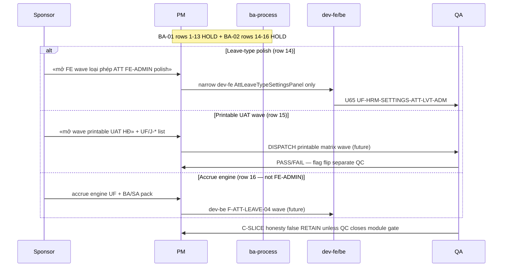

# PO-HRM-DYNAMIC-CONFIG-PLATFORM-FE-ADMIN-REOPEN-GATE-BA-02 — Reopen-gate inventory ADD delta (post SA seals)

| Field | Value |
|-------|-------|
| **work_item_id** | `PO-HRM-DYNAMIC-CONFIG-PLATFORM-FE-ADMIN-REOPEN-GATE-BA-02` |
| **Parent / cite** | [`PO-HRM-DYNAMIC-CONFIG-PLATFORM-FE-ADMIN-REOPEN-GATE-BA-01`](./PO-HRM-DYNAMIC-CONFIG-PLATFORM-FE-ADMIN-REOPEN-GATE-BA-01.md) SPEC **20612** · **RETAIN** all §4 rows 1–13 **unchanged** |
| **Program** | `PO-HRM-CONTINUOUS-W8-20260807` · U88 after **`CTR-PRINTABLE-HOLD-SA-01`** SEALED (Option A · `R-PLT-CTR-PRINTABLE-01` · SPEC **23993**) |
| **Lane** | governance · ba-process |
| **change_mode** | **ADD-only** rows to reopen-gate UF inventory — **no** Nest SoT redefine · **no** execution unlock · **no** flip `contracts_printable_ready` |
| **ack_status** | **PASS_TO_PM** |
| **U65** | UF placeholders cite **login → menu → click → Lưu → F5** when execution unlocks — **this doc does not unlock** |
| **Honesty (RETAIN)** | `hrm_attendance_uat_ready=false` · `hrm_personnel_uat_ready=false` · `payroll_e2e_ready=false` · `recruitment_uat_ready=false` · **`contracts_printable_ready=false`** · **`C-SLICE-≠-MODULE`** |

---

## 1. Mục tiêu và phạm vi delta

### 1.1 Mục tiêu

Bổ sung **ADD-only** vào inventory reopen-gate BA-01 sau ba ghế SA governance:

1. **`R-PLT-ATT-LEAVE-FE-ADMIN-01`** — lớp **LIVE twin** FE-ADMIN loại phép (orthogonal tới pack synth 13 hàng CODE/OT/COMP ABSENT).
2. **`R-PLT-CTR-PRINTABLE-01`** — cổ **honesty** printable module (slice LIVE ≠ flag true).
3. **`R-PLT-ATT-LVRULE-ENGINE-01`** — **cite HOLD** lớp **engine runtime** (không thuộc class FE-ADMIN) — BA-01 chỉ nêu engine trong dòng 01g, chưa có hàng residual engine riêng.

### 1.2 RETAIN (bắt buộc — không wipe BA-01)

Toàn bộ **13 hàng** master inventory [`FE-ADMIN-REOPEN-GATE-BA-01`](./PO-HRM-DYNAMIC-CONFIG-PLATFORM-FE-ADMIN-REOPEN-GATE-BA-01.md) §4 (#1–#13) **giữ nguyên nghĩa, class, UF placeholder, sponsor gate, status HOLD**. Tài liệu này **không** sửa file BA-01; PM/QA trace **song song**: BA-01 = synth pack · BA-02 = ADD extension §4.2.

### 1.3 Out of scope (DENY — RETAIN BA-01 §1.3)

- Nest SoT redefine · invent catalog KEY · dual admin writer.
- Dispatch-ready unlock tới `dev-fe`/`dev-be` từ work_item này.
- Flip **`contracts_printable_ready=true`** · flip **`hrm_attendance_uat_ready=true`**.
- Reopen ATTLEAVEQA consumer · reopen LVRULE engine/01g as unlock for leave-type FE-ADMIN.
- Reopen **`R-PLT-CTR-CL-FE-01`** / **`R-PLT-CTR-TPL-FE-01`** as printable unlock.
- Sửa `apps/**`.

### 1.4 Actors (unchanged taxonomy)

| Actor | Vai trò |
|-------|---------|
| **Sponsor** | Trigger phrase trong **cùng message** để mở vertical (§4.2 sponsor columns) |
| **PM** | Seal BA-02 · dispatch **chỉ** sau sponsor + BA-01/02 gate |
| **ba-process** | Delta inventory only — **HOLD** AC Nest redefine |
| **QA** | Khi unlock: UF-ID + U65 + J-* |
| **QC** | Audit honesty false · C-SLICE |

---

## 2. As-is vs to-be (ADD slice)

| | As-is (post BA-01 + SA seals) | To-be (chỉ khi sponsor gate §4.2) |
|--|-------------------------------|-----------------------------------|
| **Inventory rows** | BA-01 §4 = 13 HOLD synth residuals | BA-02 §4.2 = **+3** cited/minted rows **HOLD** |
| **Leave-type FE-ADMIN** | SA mint **`R-PLT-ATT-LEAVE-FE-ADMIN-01`** LIVE twin | Optional narrow polish wave — **≠** consumer reopen |
| **Printable module** | SA mint **`R-PLT-CTR-PRINTABLE-01`** flag false correct | Sponsor **printable UAT wave** + UF list + QC — **≠** flag flip alone |
| **Accrue engine** | SA **`R-PLT-ATT-LVRULE-ENGINE-01`** HOLD | Future accrue UF wave — **≠** FE-ADMIN reopen |

---

## 3. Class taxonomy extension

| Class | Ý nghĩa (ADD rows) | Default unlock |
|-------|----------------------|----------------|
| **LIVE admin twin** | Panel + persist **LIVE** · residual = NOTE/polish (peer SI/SHIFT/WS) | Sponsor «polish wave» **only** if named closable gap |
| **Honesty / module gate** | Slice GWC proven · program flag **false** until UF matrix | Sponsor «printable UAT wave» + UF/J-* + QC — **DENY** silent flip |
| **Engine runtime HOLD** | Policy/catalog L1 LIVE · **F-ATT-LEAVE-04** accrue **OUT** | Sponsor accrue engine UF + BA/SA depth — **NOT** FE-ADMIN class |

**Discrimination (bắt buộc PM/QA):**

| Residual | **NOT** confused with |
|----------|-------------------------|
| `R-PLT-ATT-LEAVE-FE-ADMIN-01` | `R-PLT-ATT-FE-ADMIN-01` (CODE/OT/COMP **ABSENT**) |
| `R-PLT-ATT-LEAVE-FE-ADMIN-01` | `R-PLT-ATT-LVRULE-ENGINE-01` / `R-PLT-ATT-LVRULE-FE-01g` |
| `R-PLT-CTR-PRINTABLE-01` | `R-PLT-CTR-CL-FE-01` / `R-PLT-CTR-TPL-FE-01` (FE-ADMIN polish HOLD) |
| `R-PLT-ATT-LVRULE-ENGINE-01` | Mọi hàng FE-ADMIN reopen-gate |

---

## 4. Master inventory

### 4.1 RETAIN — BA-01 §4 rows 1–13 (frozen reference)

**Source of truth for rows 1–13:** [`PO-HRM-DYNAMIC-CONFIG-PLATFORM-FE-ADMIN-REOPEN-GATE-BA-01.md`](./PO-HRM-DYNAMIC-CONFIG-PLATFORM-FE-ADMIN-REOPEN-GATE-BA-01.md) §4 — **do not edit via BA-02**.

| # | residual_id | status RETAIN |
|---|-------------|---------------|
| 1 | `R-PLT-EMP-FE-ADMIN-01` | **HOLD** |
| 2 | `R-PLT-ATT-FE-ADMIN-01` | **HOLD** |
| 3 | `R-PLT-SI-FE-ADMIN-01` | **HOLD** |
| 4 | `R-PLT-EMP-CF-FE-01` | **HOLD** |
| 5 | `R-PLT-PAY-FE-ADMIN-01` | **HOLD** |
| 6 | `R-PLT-REC-FE-ADMIN-01` | **HOLD** |
| 7 | `R-PLT-DEC-FE-ADMIN-01` | **HOLD** |
| 8 | `R-PLT-ATT-SHIFT-FE-ADMIN-01` | **HOLD** |
| 9 | `R-PLT-ATT-WS-FE-ADMIN-01` | **HOLD** |
| 10 | `R-PLT-ATT-WS-SITE-UNKNOWN-01` | **HOLD** |
| 11 | `R-PLT-CTR-CL-FE-01` | **HOLD** |
| 12 | `R-PLT-CTR-TPL-FE-01` | **HOLD** |
| 13 | `R-PLT-ATT-LVRULE-FE-01g` | **HOLD** |

Full columns (class · UF · FE path · sponsor phrase) remain **exactly** as BA-01 §4 — PM promotes UF from BA-01 for synth pack; from BA-02 §4.2 for ADD rows only.

### 4.2 ADD — Extension inventory (this work_item)

**SPEC_LEN rollup:** verify NFD UTF-8 no BOM · Length ≥8192 at handback.

| # | residual_id | class | UF-ID placeholder (pre-unlock) | FE entry path (BEFORE execution) | Sponsor must say (reopen gate) | Allowed narrow execution (after gate) | status | SA cite |
|---|-------------|-------|--------------------------------|-----------------------------------|--------------------------------|----------------------------------------|--------|---------|
| 14 | **`R-PLT-ATT-LEAVE-FE-ADMIN-01`** | **LIVE admin twin** | `UF-HRM-SETTINGS-ATT-LVT-ADM` · `UF-HRM-ATT-LVT-SIDEBAR-ADM` | `/hr` → **Cài đặt** → tab **Loại phép ATT** (`AttLeaveTypeSettingsPanel`) · `/hr` → **Chấm công** → sidebar **Quy tắc nghỉ phép** (same panel) · clients `upsertAttLeaveType` / `retireAttLeaveType` **LIVE** | «**mở FE wave loại phép ATT FE-ADMIN polish**» hoặc audit **named closable** mount/persist defect on existing panel UF | Narrow `dev-fe` UX/HDSD on **existing** panel only · **DENY** Nest dual admin · **DENY** reopen consumer `ATTLEAVEQA-MSJ7CPJH` · **DENY** bundle LVRULE engine/01g | **HOLD** | [`ATT-LEAVE-FE-ADMIN-NOTES-SA-01`](./PO-HRM-DYNAMIC-CONFIG-PLATFORM-ATT-LEAVE-FE-ADMIN-NOTES-SA-01.md) SPEC **25795** |
| 15 | **`R-PLT-CTR-PRINTABLE-01`** | **Honesty / module gate** | `UF-HRM-CTR-PRINTABLE-UAT-WAVE-PLACEHOLDER` *(bundle for sponsor-named printable UF set — not matrix ID until PM promotes)* · slices **RETAIN**: Q-CTR-02 PDF · print-spine GWC stamps | **Not** a single FE-ADMIN path — **module** printable UAT = multi-UF browser matrix (PREV/VER/issue/PDF/journey) when sponsor opens wave · peer CL/TPL admin **LIVE** but **HOLD** polish class | «**mở wave printable UAT HĐ**» + **named UF-IDs** / **J-HRM-CTR-*** rows + persona matrix trong **cùng** governance cycle | **Future** qa U65 full printable matrix + QC sign-off → **only then** PM may propose honesty flag flip (separate work_item · **not** this BA seat) · **DENY** `contracts_printable_ready=true` from slice alone · **DENY** reopen CL/TPL FE HOLD as printable unlock | **HOLD** | [`CTR-PRINTABLE-HOLD-SA-01`](./PO-HRM-DYNAMIC-CONFIG-PLATFORM-CTR-PRINTABLE-HOLD-SA-01.md) SPEC **23993** |
| 16 | **`R-PLT-ATT-LVRULE-ENGINE-01`** *(cite row — **engine**, not FE-ADMIN)* | **Engine runtime HOLD** | `UF-HRM-ATT-ACCRUE-ENGINE-PLACEHOLDER` | **No** FE-ADMIN CRUD surface for accrue job · Network L1 policy catalog **LIVE** · `POST …/leave-balances/accrue` **outline HOLD** per API_DESIGN F-ATT-LEAVE-04 | «**mở wave accrue engine / F-ATT-LEAVE-04**» + named UF-ID (e.g. UF-HRM-ATT-ACCRUE-01) + ba-process AC + SA API depth | **Future** `dev-be` accrue evaluator wave **after** Q-LEAVE-ACCRUAL lock — **DENY** dispatch from FE-ADMIN reopen inventory · **DENY** reopen FE 01g as engine dependency | **HOLD** | [`ATT-LVRULE-ENGINE-SA-01`](./PO-HRM-DYNAMIC-CONFIG-PLATFORM-ATT-LVRULE-ENGINE-SA-01.md) SPEC **22246** |

**Row 16 note:** BA-01 row #13 (`R-PLT-ATT-LVRULE-FE-01g`) **RETAIN** — panel partial + Settings admin ABSENT. Engine row **orthogonal** — PM **must not** merge unlock gates.

---

## 5. Chi tiết ADD rows (acceptance pre-unlock)

### 5.14 `R-PLT-ATT-LEAVE-FE-ADMIN-01` (LIVE admin twin)

**Process fact RETAIN (SA READ-ONLY audit):** Nest `att_leave_type` Option B **LIVE** · consumer QA **`ATTLEAVEQA-MSJ7CPJH`** 9/9 **SEALED** · admin CREATE Settings **PUT 200** + F5 proven (AC-PLT-ATT-LEAVE-01d class) · **`AttLeaveTypeSettingsPanel`** dual mount Settings + Attendance **LIVE**.

**UF pre-unlock checklist (documentation only):**

1. Persona `ceo@xe.vn` → `/hr` → Settings → **Loại phép ATT** → xác nhận panel load + Lưu path exists (**LIVE expected** — **not** ABSENT).
2. `/hr` → Chấm công → sidebar leave-rules → same panel **LIVE**.
3. **FAIL** inventory interpretation «no leave admin» — cite SA §1.2 audit.

**Cross-nav J-* (when sponsor polish unlock only):** Settings ↔ Attendance sidebar same catalog — document in `PROGRAM_JOURNEY_MAP.md` **after** sponsor open; consumer LeaveTab EFF **FORBIDDEN reopen**.

**Sponsor gate (exact or semantic):** «mở FE wave loại phép ATT FE-ADMIN polish» per [`ATT-LEAVE-FE-ADMIN-NOTES-SA-01`](./PO-HRM-DYNAMIC-CONFIG-PLATFORM-ATT-LEAVE-FE-ADMIN-NOTES-SA-01.md) §6.2.

**Execution unlock:** **FAIL closed** until sponsor gate · **FAIL** if bundled with LVRULE engine or CODE/OT/COMP ABSENT pack.

**Peer FORBIDDEN:**

- Reopen **`R-PLT-ATT-FE-ADMIN-01`** as leave-type unlock.
- Reopen **`R-PLT-ATT-LVRULE-ENGINE-01`** or **`R-PLT-ATT-LVRULE-FE-01g`** as leave-type FE-ADMIN unlock.

### 5.15 `R-PLT-CTR-PRINTABLE-01` (honesty printable HOLD)

**Process fact RETAIN:** Print-spine narrow slices **LIVE** (e.g. QC **`CTR3-HQV9ZW`**, QA **`CTR2-IAXGKL`** Q-CTR-02 PDF) · Settings CL/TPL **LIVE** · program honesty **`contracts_printable_ready=false`** **correct** per all QC evidence chain.

**UF placeholder meaning:** `UF-HRM-CTR-PRINTABLE-UAT-WAVE-PLACEHOLDER` = PM must replace with **explicit UF list** when sponsor opens printable wave — **not** a registered matrix row until promotion.

**Pre-unlock checklist (PM/QC — documentation):**

1. Confirm board/W7.5 still lists **`contracts_printable_ready=false`** — **PASS** if false.
2. Confirm no bus entry flips flag without sponsor printable wave — **PASS** if absent.
3. **DENY** treating Q-CTR-02 PDF PASS alone as module printable GO.

**Sponsor gate (SA LOCKED):** «mở wave printable UAT HĐ» + named UF-IDs / J-HRM-CTR-* + persona matrix · per [`CTR-PRINTABLE-HOLD-SA-01`](./PO-HRM-DYNAMIC-CONFIG-PLATFORM-CTR-PRINTABLE-HOLD-SA-01.md) §6.2.

**Allowed after gate (future — not default):** qa browser matrix U65 full printable journey · qc GO on **wave** · **separate** PM work_item for honesty flag proposal — **not** automatic from BA-02.

**Peer FORBIDDEN:**

- Reopen **`R-PLT-CTR-CL-FE-01`** / **`R-PLT-CTR-TPL-FE-01`** as «printable unlock».
- Flip **`contracts_printable_ready=true`** without QC closure on sponsor UF set.

**Companion cite:** `payroll_e2e_ready=false` **RETAIN** — **orthogonal** — do not bundle payroll closure into printable HOLD row.

### 5.16 `R-PLT-ATT-LVRULE-ENGINE-01` (engine cite — not FE-ADMIN)

**Process fact RETAIN:** Policy schema + admin L1 + CNS-WIRE KEY assert **LIVE/SEALED** · **F-ATT-LEAVE-04** accrue runtime **HOLD** · FE 01g **separate** row BA-01 #13.

**Class rule:** **Engine runtime HOLD** — **excluded** from FE-ADMIN taxonomy (Nest-admin-ABSENT / LIVE admin / deferred bind). PM dispatch from **FE-ADMIN-REOPEN-GATE** inventory **must not** target engine without sponsor accrue wave.

**UF placeholder:** `UF-HRM-ATT-ACCRUE-ENGINE-PLACEHOLDER` — future browser UF: policy published → accrue trigger/job → entitled delta → panel reflects (U65) — **not defined** in this ADD seat.

**Sponsor gate (SA Option B LOCK):** Explicit accrue engine wave + named UF · ba-process AC pack · SA F-ATT-LEAVE-04 API_DESIGN depth · Q-LEAVE-ACCRUAL component lock.

**DENY:**

- Unlock engine because FE-ADMIN BA-01/02 sponsor opened polish.
- Unlock engine because leave-type catalog GWC sealed.
- Seed accrue runs for UF (U65).

**Cross-reference BA-01 #13:** `R-PLT-ATT-LVRULE-FE-01g` **RETAIN** — sponsor «mở FE wave quỹ phép / panel AC-01g» **does not** authorize engine.

---

## 6. Business rule matrix (ADD delta)

| BR-ID | Condition | Action | Outcome |
|-------|-----------|--------|---------|
| BR-REOPEN-ADD-01 | BA-02 published | RETAIN BA-01 §4 rows 1–13 on all boards | Synth pack gates **unchanged** |
| BR-REOPEN-ADD-02 | PM maps leave-type admin gap | Check **`R-PLT-ATT-LEAVE-FE-ADMIN-01`** class **LIVE twin** first | Redirect to SA SPEC 25795 · **reject** ABSENT dispatch |
| BR-REOPEN-ADD-03 | PDF/spine slice PASS | **Must not** flip `contracts_printable_ready` | Cite **`R-PLT-CTR-PRINTABLE-01`** |
| BR-REOPEN-ADD-04 | Sponsor opens printable wave | PM replaces PLACEHOLDER with UF list · new execution work_item | Honesty flip **separate** QC gate |
| BR-REOPEN-ADD-05 | Sponsor opens LVRULE panel 01g | Use BA-01 row #13 only | **DENY** engine dispatch same wave |
| BR-REOPEN-ADD-06 | Sponsor opens accrue engine | Use row #16 + ENGINE SA SPEC 22246 | **DENY** FE-ADMIN inventory alone |
| BR-REOPEN-ADD-07 | QC sees module CTR/ATT UAT claim | Audit honesty flags | **NO-GO** without UF matrix |
| BR-REOPEN-ADD-08 | ba-process Nest AC redefine in ADD doc | Reject | **INVALID** — cite child BA/SA LOCK only |

**RETAIN BA-01 rules BR-REOPEN-01..08** — still apply to rows 1–13.

---

## 7. Sequence — ADD rows in sponsor reopen (documentation)



---

## 8. Handoff package

| To | Expectation | Done when |
|----|-------------|-----------|
| **PM** | Seal `…-REOPEN-GATE-BA-02` · RETAIN BA-01 13 rows · append §4.2 to W8 board trace | This file Length ≥8192 · PASS_TO_PM |
| **SA** | No action — cites already SEALED | RETAIN |
| **ba-data** | **HOLD** until SITE-UNKNOWN · accrue engine · printable UF wave sponsor opens | — |
| **dev-fe / dev-be** | **No dispatch** from BA-02 alone | Sponsor + PM DISPATCH |
| **QA** | Use ADD UF placeholders when unlocked · U65 · deny flag flip from slice | Evidence under `docs/qa/evidence/` |
| **QC** | Audit **`contracts_printable_ready=false`** · leave LIVE ≠ module ATT UAT | GWC unchanged |

---

## 9. Traceability

| Artifact | Link / SPEC |
|----------|-------------|
| BA-01 inventory (RETAIN) | `./PO-HRM-DYNAMIC-CONFIG-PLATFORM-FE-ADMIN-REOPEN-GATE-BA-01.md` SPEC **20612** |
| ATT leave FE-ADMIN SA | `./PO-HRM-DYNAMIC-CONFIG-PLATFORM-ATT-LEAVE-FE-ADMIN-NOTES-SA-01.md` SPEC **25795** |
| CTR printable honesty SA | `./PO-HRM-DYNAMIC-CONFIG-PLATFORM-CTR-PRINTABLE-HOLD-SA-01.md` SPEC **23993** |
| LVRULE engine SA (cite) | `./PO-HRM-DYNAMIC-CONFIG-PLATFORM-ATT-LVRULE-ENGINE-SA-01.md` SPEC **22246** |
| W8 board | `docs/program/PO_HRM_CONTINUOUS_W8_20260807.md` |
| Journey map (when unlock) | `docs/program/PROGRAM_JOURNEY_MAP.md` |
| BA trace (J-* optional) | `docs/qa/PILOT_BUSINESS_FLOW_BA_TRACE.md` |

---

## 10. Open risks

| Risk | Mitigation |
|------|------------|
| Row 14 misread as ABSENT like row #2 | L-ATT-LVT-FE-ADMIN-03 class LIVE twin |
| PDF PASS ⇒ flip printable flag | BR-REOPEN-ADD-03 · row #15 |
| Engine bundled into FE-ADMIN reopen | Row #16 class exclusion |
| BA-02 replaces BA-01 | §4.1 explicit RETAIN · two files |

**Clarifications needed from sponsor:** None for inventory ADD completion.

---

## 11. Completion contract (handback)

```yaml
work_item_id: PO-HRM-DYNAMIC-CONFIG-PLATFORM-FE-ADMIN-REOPEN-GATE-BA-02
ack_status: PASS_TO_PM
evidence_path: docs/program/specs/PO-HRM-DYNAMIC-CONFIG-PLATFORM-FE-ADMIN-REOPEN-GATE-BA-02.md
SPEC_LEN: verified NFD UTF-8 no BOM Length >= 8192
completion_report: |
  ADD-only delta to FE-ADMIN reopen-gate inventory: retained all 13 BA-01 §4 rows by reference;
  added rows 14 R-PLT-ATT-LEAVE-FE-ADMIN-01 (LIVE twin HOLD · SPEC 25795 · UF placeholders +
  sponsor §7.2-style gate); row 15 R-PLT-CTR-PRINTABLE-01 (honesty printable HOLD · SPEC 23993 ·
  printable UAT wave UF placeholder only); row 16 cite R-PLT-ATT-LVRULE-ENGINE-01 (engine class not
  FE-ADMIN · SPEC 22246). No Nest redefine · no contracts_printable_ready flip · no execution unlock ·
  no apps/** edits.
next_owner: pm
next_dispatch_prompt: |
  work_item_id: PO-HRM-DYNAMIC-CONFIG-PLATFORM-FE-ADMIN-REOPEN-GATE-BA-02-PM-SEAL-01
  from_role: pm
  to_role: pm
  lane: governance
  INTAKE: ba-process PASS_TO_PM — FE-ADMIN reopen-gate BA-02 ADD delta sealed;
  evidence_path docs/program/specs/PO-HRM-DYNAMIC-CONFIG-PLATFORM-FE-ADMIN-REOPEN-GATE-BA-02.md
  action:
    1) Seal bus row PO-HRM-DYNAMIC-CONFIG-PLATFORM-FE-ADMIN-REOPEN-GATE-BA-02 = PASS_TO_PM;
       append W8 board trace for rows R-PLT-ATT-LEAVE-FE-ADMIN-01 · R-PLT-CTR-PRINTABLE-01 ·
       cite R-PLT-ATT-LVRULE-ENGINE-01 alongside existing BA-01 13 HOLD rows
    2) RETAIN BA-01 SPEC 20612 §4 unchanged · honesty flags false · contracts_printable_ready=false
    3) Do NOT dispatch dev-fe/dev-be from BA-02; do NOT flip contracts_printable_ready
    4) U88: next governance or program vertical per PO_HRM_CONTINUOUS_W8_20260807.md tail
       (platform NFR · AMIS PAY depth · idle-ok FE-ADMIN governance) unless sponsor §7.2/§4.2
       trigger in same message
  exit: PM->ALL seal + TEAM_WORKING_NOW one line
  ack_status: PASS_TO_PM
must_keep: BA-01 13 rows · synth Option A LOCK · ATTLEAVEQA-MSJ7CPJH · print-spine GWC stamps ·
  U65 · C-SLICE · contracts_printable_ready=false
```

---

## 12. ADD table summary (PM quick scan)

| residual_id | SPEC | UF (placeholder) | Sponsor gate (short) | status |
|-------------|------|------------------|------------------------|--------|
| `R-PLT-ATT-LEAVE-FE-ADMIN-01` | 25795 | UF-HRM-SETTINGS-ATT-LVT-ADM · UF-HRM-ATT-LVT-SIDEBAR-ADM | mở FE wave loại phép ATT FE-ADMIN polish | **HOLD** |
| `R-PLT-CTR-PRINTABLE-01` | 23993 | UF-HRM-CTR-PRINTABLE-UAT-WAVE-PLACEHOLDER | mở wave printable UAT HĐ + UF/J-* | **HOLD** |
| `R-PLT-ATT-LVRULE-ENGINE-01` | 22246 | UF-HRM-ATT-ACCRUE-ENGINE-PLACEHOLDER | accrue engine / F-ATT-LEAVE-04 wave | **HOLD** (engine · not FE-ADMIN) |

---

*End of BA-02 — ADD-only reopen-gate delta · RETAIN BA-01 13 rows · PASS_TO_PM · no execution unlock*
